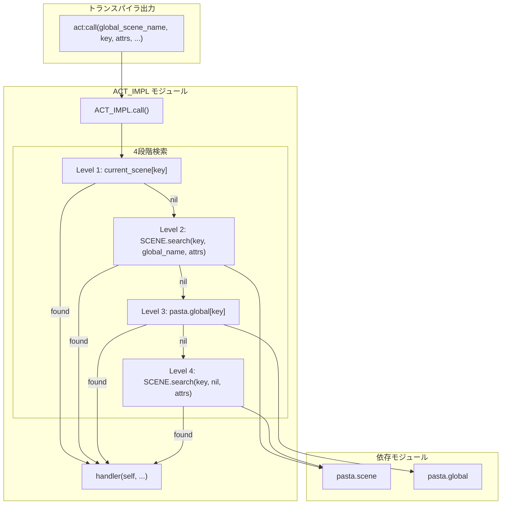
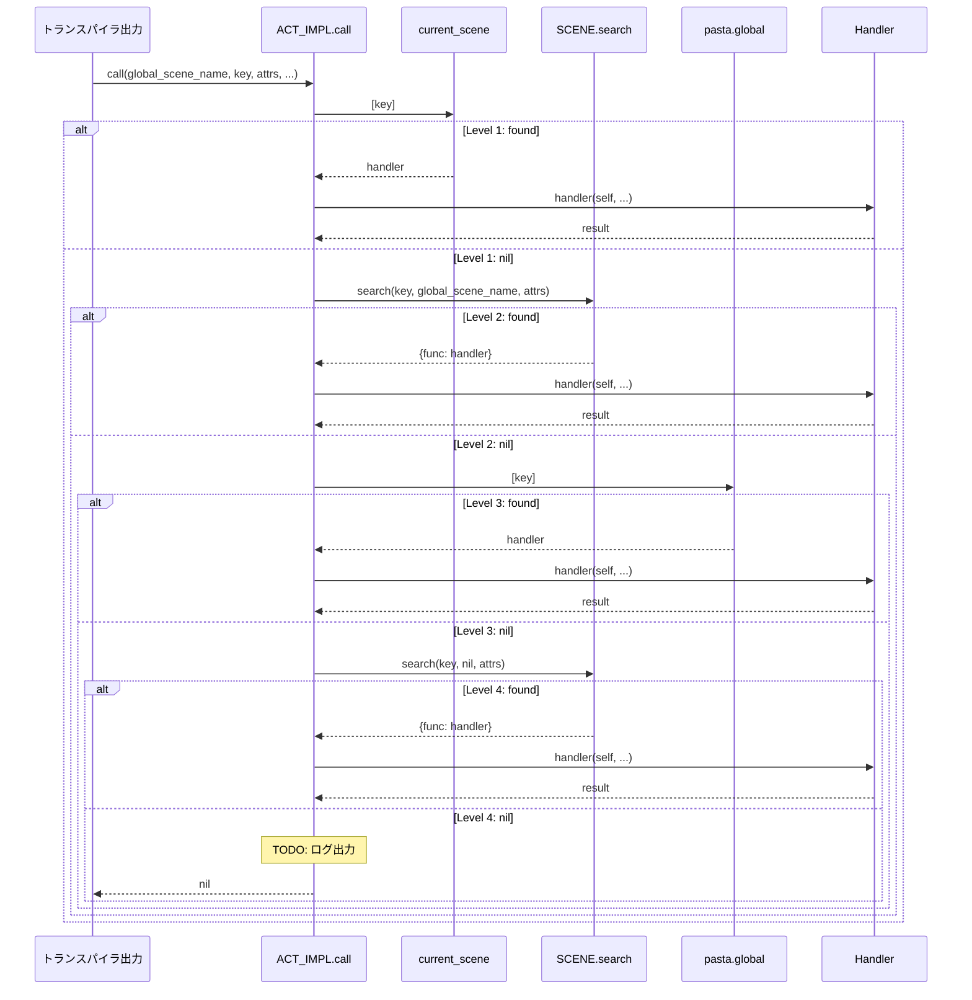

# Technical Design: ACT_IMPL.call 本格実装

## Overview

**Purpose**: トランスパイラが生成する`ACT_IMPL.call()`メソッドを、優先順位付き4段階検索を持つ本格的な実装に置き換える。

**Users**: Pastaトランスパイラ出力コード、シーン実行ランタイムが利用する。

**Impact**: 現在の単純な`SCENE.get()`呼び出しを、シーンローカル→スコープ付き検索→グローバル関数→全体検索のカスケード検索に置き換える。

### Goals
- トランスパイラ出力と一致する正しいシグネチャを実装
- 4段階の優先順位付き検索による柔軟なハンドラー解決
- 将来の`attrs`パラメータ拡張に備えたインターフェース

### Non-Goals
- `attrs`パラメータによる属性フィルタリングの実装（将来対応）
- ログ出力の完全実装（TODOコメントのみ）
- トランスパイラ出力形式の変更

---

## Architecture

### Existing Architecture Analysis

**変更対象**:
- `ACT_IMPL.call`の現在の実装は、配列形式の引数を期待しているが、トランスパイラは個別引数を出力している
- `SCENE.search`は2引数シグネチャで、第3引数`attrs`のサポートが必要

**統合ポイント**:
- `SCENE.search()`: 既存の検索機能を活用
- `pasta.global`: ユーザー定義グローバル関数テーブル
- `self.current_scene`: 現在のシーンテーブル

### Architecture Pattern & Boundary Map



**Architecture Integration**:
- **Selected pattern**: カスケード検索（優先順位付き多段解決）
- **Domain boundaries**: ACT_IMPLがハンドラー解決を担当、SCENEが検索エンジン提供
- **Existing patterns preserved**: actor.luaの多段検索パターンを流用
- **New components rationale**: 新規コンポーネントなし、既存関数の置き換えのみ
- **Steering compliance**: 宣言的フロー原則、Lua標準ライブラリ活用

### Technology Stack

| Layer   | Choice / Version | Role in Feature        | Notes          |
| ------- | ---------------- | ---------------------- | -------------- |
| Runtime | Lua 5.4 (mlua)   | スクリプト実行         | 既存スタック   |
| Module  | pasta.act        | ACT_IMPL.call実装      | 変更対象       |
| Module  | pasta.scene      | SCENE.search提供       | シグネチャ変更 |
| Module  | pasta.global     | グローバル関数テーブル | 変更なし       |

---

## System Flows

### ハンドラー検索フロー



---

## Requirements Traceability

| Requirement | Summary        | Components                  | Interfaces         | Flows          |
| ----------- | -------------- | --------------------------- | ------------------ | -------------- |
| 1.1-1.4     | シグネチャ定義 | ACT_IMPL.call               | call signature     | -              |
| 2.1-2.5     | 4段階検索      | ACT_IMPL.call               | SCENE.search       | ハンドラー検索 |
| 3.1-3.4     | ハンドラー実行 | ACT_IMPL.call               | handler invocation | ハンドラー検索 |
| 4.1-4.3     | attrs渡し      | SCENE.search                | search signature   | -              |
| 5.1-5.3     | 互換性         | ACT_IMPL.call, SCENE.search | -                  | -              |
| 6.1-6.2     | ログ拡張       | ACT_IMPL.call               | -                  | -              |

---

## Components and Interfaces

| Component     | Domain/Layer  | Intent                              | Req Coverage  | Key Dependencies              | Contracts |
| ------------- | ------------- | ----------------------------------- | ------------- | ----------------------------- | --------- |
| ACT_IMPL.call | Runtime/Act   | 4段階検索によるハンドラー解決と実行 | 1, 2, 3, 5, 6 | SCENE (P0), pasta.global (P1) | Service   |
| SCENE.search  | Runtime/Scene | シーン検索（第3引数拡張）           | 4             | @pasta_search (P0)            | Service   |

### Runtime/Act Layer

#### ACT_IMPL.call

| Field        | Detail                                      |
| ------------ | ------------------------------------------- |
| Intent       | 4段階優先順位検索によるハンドラー解決と実行 |
| Requirements | 1.1-1.4, 2.1-2.5, 3.1-3.4, 5.1-5.3, 6.1-6.2 |

**Responsibilities & Constraints**
- トランスパイラ出力から呼び出され、キーに対応するハンドラーを検索
- 4段階の優先順位に従い、最初に見つかった有効な関数を実行
- ハンドラーが見つからない場合はnilを返却（サイレント動作）
- 将来のログ出力拡張ポイントを含む

**Dependencies**
- Inbound: トランスパイラ出力 — シーン関数から呼び出し (P0)
- Outbound: SCENE.search — スコープ付き/全体検索 (P0)
- Outbound: pasta.global — グローバル関数テーブル参照 (P1)

**Contracts**: Service [x]

##### Service Interface

```lua
--- シーン呼び出し（4段階検索）
--- @param self Act アクションオブジェクト
--- @param global_scene_name string|nil グローバルシーン名
--- @param key string 検索キー
--- @param attrs table|nil 属性テーブル（将来拡張用、現在は未使用）
--- @param ... any 可変長引数（ハンドラーに渡す）
--- @return any ハンドラーの戻り値、またはnil
function ACT_IMPL.call(self, global_scene_name, key, attrs, ...)
```

- **Preconditions**:
  - `self`は有効なActオブジェクト
  - `key`は文字列（nil不可）
  - `attrs`はテーブルまたはnil（トランスパイラは常に`{}`を出力）
- **Postconditions**:
  - ハンドラーが見つかった場合: `handler(self, ...)`の戻り値を返却
  - ハンドラーが見つからない場合: `nil`を返却
- **Invariants**:
  - 検索順序は常にLevel 1→2→3→4
  - 副作用なし（ハンドラー実行を除く）

**Implementation Notes**
- **Level 1 nil安全性**: `self.current_scene`がnilまたは`self.current_scene[key]`がnilの場合、Level 2へ進む
- **Level 2/4結果取得**: `SCENE.search`の戻り値がnilでない場合、`.func`フィールドを取得
- **Level 3グローバル参照**: `require("pasta.global")`でモジュールを取得し、`[key]`でハンドラー検索
- **attrs渡し**: トランスパイラは常に`{}`を出力するため、そのままSCENE.searchに渡す（nil変換不要）
- **ログ拡張ポイント**: ハンドラー未発見時のTODOコメントで将来のログ機能を明示

---

### Runtime/Scene Layer

#### SCENE.search（シグネチャ拡張）

| Field        | Detail                                                   |
| ------------ | -------------------------------------------------------- |
| Intent       | 第3引数`attrs`を追加して将来の属性フィルタリングに備える |
| Requirements | 4.1-4.3                                                  |

**Responsibilities & Constraints**
- 既存の検索ロジックは変更なし
- 第3引数`attrs`を受け取るが、現時点では使用しない（将来の属性フィルタリング用に予約）
- **後方互換性**: Luaは余剰引数を無視するため、既存の2引数呼び出し`SCENE.search(key, global_name)`は動作継続
  - 新シグネチャ呼び出し例: `SCENE.search("key", "global", {})` 
  - 既存2引数呼び出し例: `SCENE.search("key", "global")` ← 第3引数nilとして解釈される

**Dependencies**
- Inbound: ACT_IMPL.call — ハンドラー検索 (P0)
- External: @pasta_search — Rust側検索エンジン (P0)

**Contracts**: Service [x]

##### Service Interface

```lua
--- シーンを名前で検索（プレフィックス検索）
--- @param name string 検索するシーン名
--- @param global_scene_name string|nil ローカル検索の場合のグローバルシーン名
--- @param attrs table|nil 属性テーブル（将来拡張用、現在は未使用）
--- @return SceneSearchResult|nil 検索結果、またはnil
function SCENE.search(name, global_scene_name, attrs)
```

- **Preconditions**:
  - `name`は文字列
  - `global_scene_name`は文字列またはnil
  - `attrs`はテーブルまたはnil（ACT_IMPL.callからは常に空テーブル`{}`が渡される）
- **Postconditions**:
  - 見つかった場合: `{global_name, local_name, func}`を持つ呼び出し可能オブジェクト
  - 見つからない場合: `nil`
- **Invariants**:
  - `attrs`は現在無視される（将来実装まで）
  - 2引数呼び出しとの後方互換性を維持（第3引数省略時はnilとして扱われる）

**Implementation Notes**
- シグネチャ変更のみ、既存ロジックは維持
- `attrs`パラメータは将来の属性ベースフィルタリング用に予約

---

## Error Handling

### Error Strategy

**サイレント動作**: ハンドラーが見つからない場合、エラーを発生させずnilを返却。これはDSLの柔軟性を維持するための設計判断。

### Error Categories and Responses

| カテゴリ             | 状況              | 対応                            |
| -------------------- | ----------------- | ------------------------------- |
| ハンドラー未発見     | 4段階すべてでnil  | nilを返却、将来ログ出力         |
| ハンドラー実行エラー | handler内でエラー | Luaエラーとして伝播（変更なし） |

### Monitoring

- 将来対応: ハンドラー未発見時のログ出力
- 現時点: TODOコメントで拡張ポイントを明示

---

## Testing Strategy

### Unit Tests (Lua)

1. **Level 1検索**: `current_scene[key]`から正しくハンドラーを取得
2. **Level 1 nil安全性**: `self.current_scene == nil`の場合、Level 2へスキップ
3. **Level 2検索**: `SCENE.search(key, global_scene_name, attrs)`経由で取得
4. **Level 3検索**: `pasta.global[key]`から取得
5. **Level 4検索**: `SCENE.search(key, nil, attrs)`フォールバック
6. **優先順位検証**: 複数レベルに存在する場合、Level 1が優先
7. **ハンドラー未発見**: 全レベルでnil時、nilを返却
8. **SCENE.search後方互換性**: 2引数呼び出し`SCENE.search(key, global_name)`が正常動作

### Integration Tests (Rust経由)

1. **トランスパイラ出力互換性**: 生成されたコードが正しく動作
2. **SCENE.search統合**: 第3引数追加後も既存テストがパス
3. **E2Eシナリオ**: シーン呼び出しチェーンが正常動作

### Regression Tests

1. **既存scene_search_test.rs**: 2引数呼び出しの互換性確認
2. **既存transpiler_integration_test.rs**: TCO最適化の動作確認
