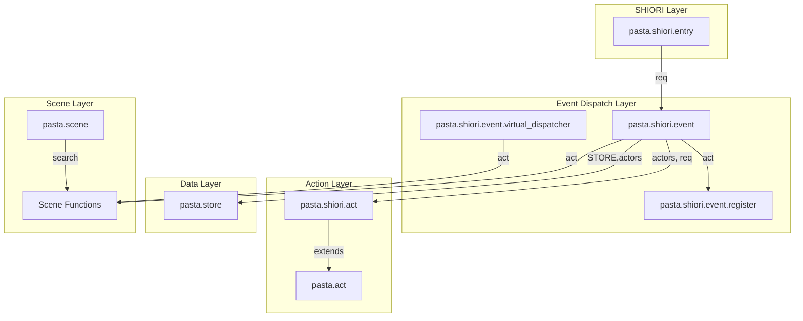
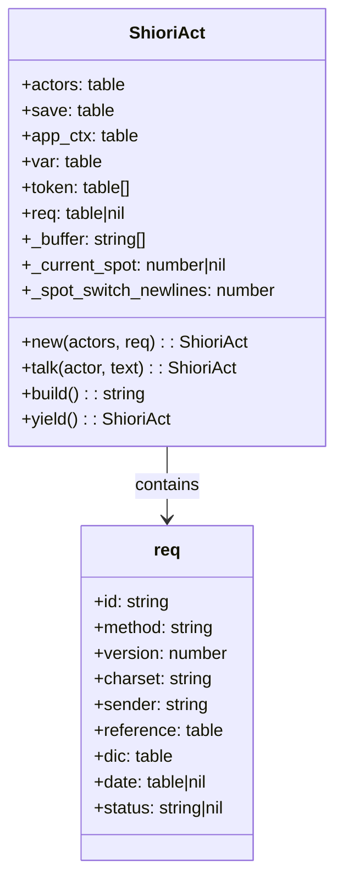
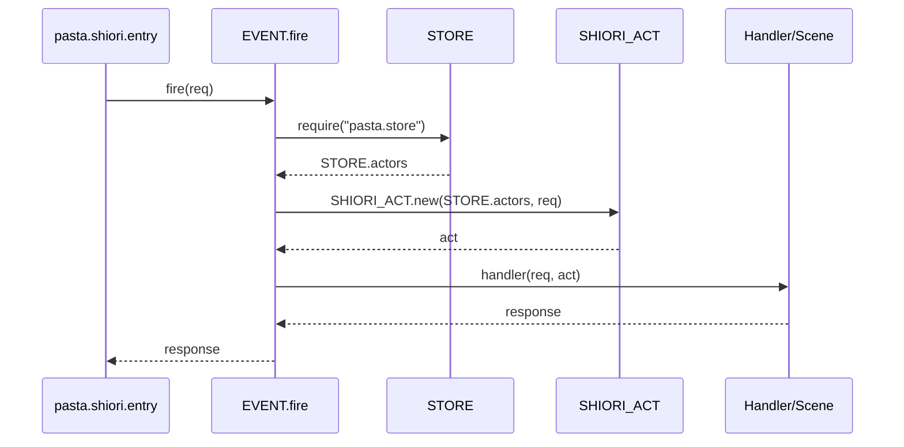

# Technical Design: act-req-parameter

## Overview

**Purpose**: この機能は、`pasta.shiori.act` モジュールに `req` フィールドを追加し、イベントディスパッチ処理で `act` オブジェクトを生成・シーン関数に引き渡すことで、シーン関数からSHIORIリクエスト情報へのアクセスを可能にする。

**Users**: シーン開発者・イベントハンドラ開発者が、イベントID・Reference配列・日時情報などを利用した動的な応答を実装する際に使用する。

**Impact**: 既存の `pasta.shiori.event` と `pasta.shiori.act` に軽微な拡張を行い、シーン関数の第1引数に `act` オブジェクトが渡されるようになる。

### Goals
- シーン関数から `act.req` を通じてSHIORIリクエスト情報にアクセス可能にする
- イベントディスパッチ処理で `act` オブジェクトを生成し、ハンドラ・シーン関数に引き渡す
- 既存のハンドラシグネチャ `function(req)` との後方互換性を維持する

### Non-Goals
- `req` テーブルの構造変更（Rust側 `parse_request()` は変更なし）
- ハンドラからの `act:build()` によるさくらスクリプト返却（将来の別仕様）
- `act.req` の書き込み保護（推奨レベルで読み取り専用）

---

## Architecture

### Architecture Pattern & Boundary Map



**Architecture Integration**:
- **Selected pattern**: 既存コンポーネント拡張（Option A） - 2-3ファイルの軽微な変更で実現
- **Domain boundaries**: EVENT層が act 生成を担当、ACT層は構造を提供
- **Existing patterns preserved**: MODULE/MODULE_IMPL分離、遅延ロード、依存性注入
- **Steering compliance**: lua-coding.md のモジュール構造規約に準拠

### Technology Stack

| Layer | Choice / Version | Role in Feature | Notes |
|-------|------------------|-----------------|-------|
| Runtime | Lua 5.4 (mlua) | スクリプト実行 | 可変長引数で後方互換 |
| Data | pasta.store | actors 辞書提供 | 変更なし |

---

## Requirements Traceability

| Requirement | Summary | Components | Interfaces | Flows |
|-------------|---------|------------|------------|-------|
| 1.1, 1.2, 1.3 | act.req フィールド追加 | SHIORI_ACT | SHIORI_ACT.new(actors, req) | - |
| 1.4 | req 読み取り専用 | SHIORI_ACT | - | - |
| 2.1, 2.3 | イベントディスパッチでact生成 | EVENT | EVENT.fire(req), create_act(req) | fire → create_act → handler |
| 2.2 | シーン関数フォールバックでact引き渡し | EVENT | EVENT.no_entry(req, act) | no_entry → scene_result(act) |
| 2.4 | エラー時500レスポンス | EVENT | - | 既存パターン維持 |
| 3.1, 3.2 | STORE.actors から取得 | EVENT | create_act(req) | fire → STORE.actors |
| 3.3 | テスタビリティ維持（DI） | SHIORI_ACT | SHIORI_ACT.new(actors, req) | - |
| 4.1, 4.2 | ハンドラ後方互換 | EVENT | handler(req, act) | Lua可変長引数 |
| 4.3 | SHIORI_ACT.new後方互換 | SHIORI_ACT | SHIORI_ACT.new(actors) | req省略時nil |

---

## Components and Interfaces

| Component | Domain/Layer | Intent | Req Coverage | Key Dependencies | Contracts |
|-----------|--------------|--------|--------------|------------------|-----------|
| SHIORI_ACT | ACT Layer | SHIORI専用actオブジェクト、req保持 | 1.1-1.4, 3.3, 4.3 | ACT (P0), CONFIG (P1) | Service |
| EVENT | Event Layer | イベント振り分け、act生成 | 2.1-2.4, 3.1-3.2, 4.1-4.2 | SHIORI_ACT (P0), STORE (P0), REG (P0) | Service |
| virtual_dispatcher | Event Layer | 仮想イベント発行、act引き渡し | 2.2 | SCENE (P1) | Service |

### ACT Layer

#### SHIORI_ACT (`pasta.shiori.act`)

| Field | Detail |
|-------|--------|
| Intent | SHIORI専用actオブジェクトにreqフィールドを追加し、リクエスト情報へのアクセスを提供 |
| Requirements | 1.1, 1.2, 1.3, 1.4, 3.3, 4.3 |

**Responsibilities & Constraints**
- `SHIORI_ACT.new(actors, req)` で req を受け取り、`base.req` に格納
- req パラメータは省略可能（nil扱い）で後方互換性維持
- `act.req` は読み取り専用として推奨（Luaの制限上、強制は不可）

**Dependencies**
- Inbound: EVENT — act生成時に呼び出し (P0)
- Outbound: ACT — 親クラスとして継承 (P0)
- Outbound: CONFIG — 設定読み込み (P1)

**Contracts**: Service [x]

##### Service Interface

```lua
--- @class ShioriAct : Act
--- @field req table|nil SHIORIリクエストテーブル（読み取り専用推奨）
--- @field _buffer string[]
--- @field _current_spot number|nil
--- @field _spot_switch_newlines number

--- 新規ShioriActを作成
--- @param actors table<string, Actor> 登録アクター
--- @param req table|nil SHIORIリクエストテーブル（オプション）
--- @return ShioriAct アクションオブジェクト
function SHIORI_ACT.new(actors, req)
```

- Preconditions: actors は table（空テーブル可）
- Postconditions: 戻り値の `req` フィールドに引数 req が設定される（nilの場合はnil）
- Invariants: 既存の SHIORI_ACT.new(actors) 呼び出しは引き続き動作する

**Implementation Notes**
- Integration: `base.req = req` を追加するのみ、親クラスに影響なし
- Validation: req の型チェックは行わない（呼び出し元が保証）
- Risks: なし（軽微な拡張）

---

### Event Layer

#### EVENT (`pasta.shiori.event`)

| Field | Detail |
|-------|--------|
| Intent | イベント振り分け処理でactを生成し、ハンドラ・シーン関数に引き渡す |
| Requirements | 2.1, 2.2, 2.3, 2.4, 3.1, 3.2, 4.1, 4.2 |

**Responsibilities & Constraints**
- `EVENT.fire()` 冒頭で `create_act(req)` により act を生成
- ハンドラ呼び出しを `handler(req, act)` に変更
- `EVENT.no_entry(req, act)` でシーン関数に `act` を引き渡す
- 既存ハンドラは第2引数を無視して動作（Lua仕様）

**Dependencies**
- Inbound: pasta.shiori.entry — SHIORI.request() から呼び出し (P0)
- Outbound: SHIORI_ACT — act生成 (P0)
- Outbound: STORE — actors取得 (P0)
- Outbound: REG — ハンドラ検索 (P0)
- Outbound: RES — レスポンス生成 (P1)
- Outbound: SCENE — シーン検索（遅延ロード） (P1)

**Contracts**: Service [x]

##### Service Interface

```lua
--- act オブジェクトを生成（モジュールローカル関数）
--- @param req table リクエストテーブル
--- @return ShioriAct act オブジェクト
local function create_act(req)
    local STORE = require("pasta.store")
    local SHIORI_ACT = require("pasta.shiori.act")
    return SHIORI_ACT.new(STORE.actors, req)
end

--- イベント振り分け
--- @param req table リクエストテーブル（req.id にイベント名）
--- @return string SHIORI レスポンス
function EVENT.fire(req)

--- デフォルトハンドラ（未登録イベント用）
--- @param req table リクエストテーブル
--- @param act ShioriAct|nil アクションオブジェクト
--- @return string SHIORI レスポンス
function EVENT.no_entry(req, act)
```

- Preconditions: req は有効なSHIORIリクエストテーブル
- Postconditions: ハンドラ/シーン関数に act が渡される
- Invariants: 既存ハンドラ `function(req)` は引き続き動作

**Implementation Notes**
- Integration: require文に `STORE`, `SHIORI_ACT` を追加（遅延ロードも可）
- Validation: act生成エラーは既存の xpcall でキャッチ
- Risks: 循環参照なし（STORE→他モジュールは既存パターン）

---

#### virtual_dispatcher (`pasta.shiori.event.virtual_dispatcher`)

| Field | Detail |
|-------|--------|
| Intent | 仮想イベント発行時にシーン関数にactを引き渡す |
| Requirements | 2.2 |

**Responsibilities & Constraints**
- `execute_scene(event_name, act)` でシーン関数に act を渡す
- 呼び出し元から act を受け取る設計に変更

**Dependencies**
- Inbound: EVENT（second_change.lua経由） — dispatch呼び出し (P1)
- Outbound: SCENE — シーン検索 (P1)

**Contracts**: Service [x]

##### Service Interface

```lua
--- シーン関数を実行（内部関数）
--- @param event_name string イベント名
--- @param act ShioriAct|nil アクションオブジェクト
--- @return string|nil 実行結果
local function execute_scene(event_name, act)

--- 仮想イベントディスパッチ
--- @param req table リクエストテーブル
--- @param act ShioriAct|nil アクションオブジェクト
--- @return string|nil シーン実行結果
function M.dispatch(req, act)
```

**Implementation Notes**
- Integration: M.dispatch, check_hour, check_talk に act 引数追加
- Validation: act が nil の場合も動作（シーン関数が対応）
- Risks: second_change.lua からの呼び出し変更が必要

---

## Data Models

### Domain Model



**Entities**:
- `ShioriAct`: SHIORI専用アクションオブジェクト（`req` フィールド追加）
- `req`: SHIORIリクエストテーブル（Rust側で生成、read-only）

**Invariants**:
- `act.req` は生成時に設定され、以降変更されない（推奨）
- `req` テーブルの構造は Rust側 `parse_request()` が保証

---

## System Flows

### イベント処理フロー



**Key Decisions**:
- act生成は `EVENT.fire()` の冒頭で1回のみ実行
- ハンドラが未登録の場合、`EVENT.no_entry(req, act)` が呼ばれ、シーン関数に `act` が渡される

---

## Error Handling

### Error Strategy
既存の `xpcall`/`pcall` + `RES.err()` パターンを維持する。

### Error Categories and Responses
- **act生成エラー**: xpcall でキャッチ → RES.err() で500レスポンス
- **シーン関数エラー**: pcall でキャッチ → RES.err() で500レスポンス（既存動作）
- **ハンドラエラー**: xpcall でキャッチ → RES.err() で500レスポンス（既存動作）

---

## Testing Strategy

### Unit Tests
1. `SHIORI_ACT.new(actors, req)` - req フィールドが設定されることを確認
2. `SHIORI_ACT.new(actors)` - 後方互換（req が nil）
3. `act.req` アクセス - 参照が正しいことを確認

### Integration Tests
1. `EVENT.fire()` - act がハンドラに渡されることを確認
2. `EVENT.no_entry()` - act がシーン関数に渡されることを確認
3. 既存ハンドラ `function(req)` - 第2引数無視で動作確認
4. `virtual_dispatcher.dispatch()` - act がシーン関数に渡されることを確認

### Regression Tests
1. 既存の `shiori_act_test.lua` 全テストがパスすること
2. 既存の `shiori_event_test.rs` 全テストがパスすること
