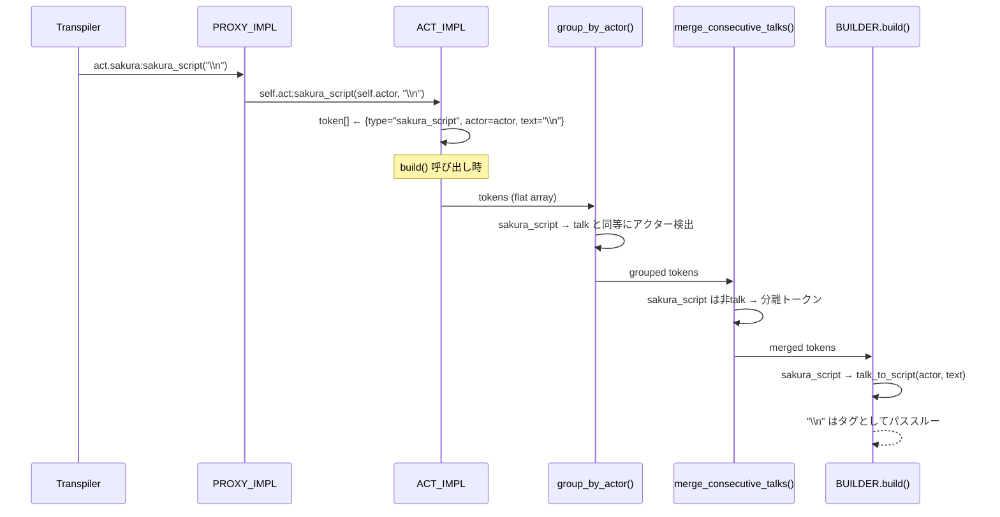

# Technical Design: act-sakura-script-method

## Overview

`Action::SakuraScript` のアクター紐付け欠落を3層（トランスパイラ / actランタイム / sakura_builder）で修正し、さくらスクリプトタグ（`\n`, `\w9`, `\s[ID]` 等）をアクターコンテキスト内で正しく処理する。

**対象ユーザー**: Pasta DSLでアクション行にさくらスクリプトを記述するゴースト開発者。
**影響**: `element_gen.rs` のコード生成出力形式が変更される（`act:sakura_script()` → `act.{actor}:sakura_script()`）。Luaランタイムに新メソッドとグループ化ロジックが追加される。

### Goals
- `Action::SakuraScript` を他の5つのAction型と同等にアクター紐付きで出力する
- Luaランタイムで `sakura_script()` メソッドによるトークン蓄積・グループ化・ビルドを実現する
- 既存テストとの互換性を維持し、新規テストでカバレッジを確保する

### Non-Goals
- `raw_script` トークン処理の変更（既存動作維持）
- `merge_consecutive_talks()` ロジックの変更（`sakura_script` は分離トークン）
- 新規さくらスクリプトタグの追加やパーサー変更

## Architecture

### Existing Architecture Analysis

3層にまたがる既存パイプライン:

```
Pasta DSL → [Parser] → AST(Action::SakuraScript)
         → [Transpiler] → Luaコード (act:sakura_script())    ← ★ バグ箇所
         → [Lua Runtime] → トークン蓄積 → group_by_actor → merge → build
         → [sakura_builder] → さくらスクリプト文字列
```

**既存パターン（`talk`）**:
- トランスパイラ: `act.{actor}:talk(literal)` — アクター紐付き出力
- PROXY_IMPL: `talk(self, text)` → `self.act:talk(self.actor, text)`
- ACT_IMPL: `talk(self, actor, text)` → `{ type="talk", actor=actor, text=text }`
- group_by_actor: `talk` トークンでアクター変更検出
- sakura_builder: `talk` → `talk_to_script(actor, inner.text)`

`sakura_script` はこの `talk` パターンを完全に踏襲する。

### Architecture Pattern & Boundary Map

```mermaid
graph LR
    subgraph Rust["Rust (pasta_lua crate)"]
        Parser["Parser<br/>Action::SakuraScript"]
        Transpiler["Transpiler<br/>element_gen.rs"]
    end
    subgraph Lua["Lua Runtime"]
        Proxy["PROXY_IMPL<br/>actor.lua"]
        Act["ACT_IMPL<br/>act.lua"]
        Group["group_by_actor()<br/>act.lua"]
        Merge["merge_consecutive_talks()<br/>act.lua"]
        Builder["BUILDER.build()<br/>sakura_builder.lua"]
    end

    Parser --> Transpiler
    Transpiler -->|"act.{actor}:sakura_script(literal)"| Proxy
    Proxy -->|"self.act:sakura_script(self.actor, text)"| Act
    Act -->|"token{type=sakura_script}"| Group
    Group --> Merge
    Merge --> Builder
    Builder -->|"talk_to_script(actor, text)"| Output["さくらスクリプト文字列"]

    style Transpiler fill:#fdd
    style Proxy fill:#fdd
    style Act fill:#fdd
    style Group fill:#fdd
    style Builder fill:#fdd
```



赤色: 変更対象コンポーネント

**Architecture Integration**:
- **Selected pattern**: 既存コンポーネント拡張 — `talk()` の実装パターンを `sakura_script()` として複製
- **Domain boundaries**: Rust（トランスパイラ）/ Lua（ランタイム）の既存境界を維持
- **Existing patterns preserved**: プロキシパターン（actor.lua）、トークン蓄積パターン（act.lua）、ビルダーパターン（sakura_builder.lua）
- **New components**: なし（既存ファイルへの追加のみ）

### Technology Stack

| Layer | Choice / Version | Role in Feature | Notes |
|-------|------------------|-----------------|-------|
| Transpiler | Rust / pasta_lua | `Action::SakuraScript` コード生成修正 | `element_gen.rs` 1行変更 |
| Runtime | Lua 5.5 / mlua 0.11 | メソッド追加・グループ化拡張 | `act.lua`, `actor.lua` |
| Builder | Lua 5.5 | トークン処理分岐追加 | `sakura_builder.lua` |
| Test | insta 1.46 / lua_test | スナップショット + BDDテスト | 新規テストケース追加 |

既存スタックからの逸脱なし。新規依存なし。

## System Flows

### sakura_script トークンのデータフロー



## Requirements Traceability

| Requirement | Summary | Components | Interfaces | Flows |
|-------------|---------|------------|------------|-------|
| 1.1 | `act.{actor}:sakura_script(literal)` 出力 | ElementGen | `generate_action()` | Transpiler→Proxy |
| 1.2 | `act:sakura_script()` 形式を生成しない | ElementGen | `generate_action()` | — |
| 2.1 | `PROXY_IMPL.sakura_script()` 追加 | ActorProxy | `sakura_script(self, text)` | Proxy→ACT |
| 2.2 | `ACT_IMPL.sakura_script()` 追加 | ActImpl | `sakura_script(self, actor, text)` | ACT→group |
| 2.3 | `group_by_actor()` でアクター検出参加 | GroupByActor | `group_by_actor(tokens)` | group→merge |
| 2.4 | ランタイムエラー解消 | 全コンポーネント | — | End-to-end |
| 3.1 | sakura_builder で `talk_to_script()` 処理 | SakuraBuilder | `BUILDER.build()` | merge→build |
| 3.2 | `raw_script` 既存動作維持 | SakuraBuilder | — | — |
| 4.1 | スナップショットテスト追加 | SnapshotTest | — | — |
| 4.2 | `cargo test -p pasta_lua` 全パス | 全テスト | — | — |
| 4.3 | `raw_script()` 既存動作維持 | ActImpl | — | — |

## Components and Interfaces

| Component | Domain/Layer | Intent | Req Coverage | Key Dependencies | Contracts |
|-----------|-------------|--------|--------------|------------------|-----------|
| ElementGen | Rust/Transpiler | SakuraScript コード生成修正 | 1.1, 1.2 | StringLiteralizer (P0) | — |
| ActorProxy | Lua/Runtime | sakura_script プロキシメソッド | 2.1 | ACT_IMPL (P0) | Service |
| ActImpl | Lua/Runtime | sakura_script トークン蓄積 | 2.2, 2.4, 4.3 | — | Service |
| GroupByActor | Lua/Runtime | sakura_script アクター検出 | 2.3 | — | — |
| SakuraBuilder | Lua/Builder | sakura_script トークン処理 | 3.1, 3.2 | @pasta_sakura_script (P0) | — |
| SnapshotTest | Rust/Test | スナップショット追加 | 4.1, 4.2 | insta (P0) | — |
| LuaUnitTest | Lua/Test | グループ化テスト追加 | 4.2 | lua_test (P0) | — |

### Rust / Transpiler Layer

#### ElementGen

| Field | Detail |
|-------|--------|
| Intent | `Action::SakuraScript` のコード生成出力にアクター紐付けを追加 |
| Requirements | 1.1, 1.2 |

**Responsibilities & Constraints**
- `generate_action()` 内の `Action::SakuraScript` 分岐でformat文字列を修正
- `actor` パラメータは `generate_action(&mut self, action: &Action, actor: &str)` の引数として既に利用可能
- 他のAction型の出力形式に影響を与えない

**Dependencies**
- Inbound: `generate_action_line()` → `generate_action()` 呼び出し (P0)
- Outbound: `StringLiteralizer::literalize()` — 文字列リテラル化 (P0)

##### Service Interface

```rust
// 変更前
Action::SakuraScript { script, .. } => {
    let literal = StringLiteralizer::literalize(script)?;
    self.writeln(&format!("act:sakura_script({})", literal))?;
}

// 変更後
Action::SakuraScript { script, .. } => {
    let literal = StringLiteralizer::literalize(script)?;
    self.writeln(&format!("act.{}:sakura_script({})", actor, literal))?;
}
```

- Preconditions: `actor` は有効なアクター名文字列
- Postconditions: 出力Luaコードが `act.{actor}:sakura_script(literal)` 形式
- Invariants: `script` はリテラル化済みの安全な文字列

### Lua / Runtime Layer

#### ActorProxy (actor.lua)

| Field | Detail |
|-------|--------|
| Intent | `sakura_script(self, text)` プロキシメソッドの追加 |
| Requirements | 2.1 |

**Responsibilities & Constraints**
- `talk()` と同構造で `sakura_script()` を追加
- `self.act:sakura_script(self.actor, text)` を呼び出す
- `PROXY_IMPL.talk()` の直後に配置

**Dependencies**
- Inbound: Transpiler出力 `act.{actor}:sakura_script(text)` (P0)
- Outbound: `ACT_IMPL.sakura_script()` (P0)

##### Service Interface

```lua
--- sakura_script（act経由でトークン蓄積）
--- @param self ActorProxy プロキシオブジェクト
--- @param text string さくらスクリプトタグ文字列
--- @return nil
function PROXY_IMPL.sakura_script(self, text)
    self.act:sakura_script(self.actor, text)
end
```

- Preconditions: `self.actor` は有効なアクターテーブル、`text` はさくらスクリプトタグ文字列
- Postconditions: `ACT_IMPL.sakura_script()` が呼び出され、トークンが蓄積される

#### ActImpl (act.lua)

| Field | Detail |
|-------|--------|
| Intent | `sakura_script(self, actor, text)` トークン蓄積メソッドの追加 |
| Requirements | 2.2, 2.4, 4.3 |

**Responsibilities & Constraints**
- `talk()` と同構造で `sakura_script()` を追加
- トークンtype は `"sakura_script"`（`"talk"` ではない）
- `ACT_IMPL.talk()` の直後に配置
- 既存の `raw_script()` メソッドは変更しない

**Dependencies**
- Inbound: `PROXY_IMPL.sakura_script()` (P0)
- Outbound: `self.token` テーブル (P0)

##### Service Interface

```lua
--- sakura_scriptトークン蓄積
--- @param self Act アクションオブジェクト
--- @param actor Actor アクターオブジェクト
--- @param text string さくらスクリプトタグ文字列
--- @return Act self メソッドチェーン用
function ACT_IMPL.sakura_script(self, actor, text)
    table.insert(self.token, { type = "sakura_script", actor = actor, text = text })
    return self
end
```

- Preconditions: `actor` は有効なアクターテーブル、`text` はさくらスクリプトタグ文字列
- Postconditions: `self.token` に `{ type="sakura_script", actor=actor, text=text }` が追加
- Invariants: `self` が返される（メソッドチェーン互換）

#### GroupByActor (act.lua — `group_by_actor()` ローカル関数)

| Field | Detail |
|-------|--------|
| Intent | `sakura_script` トークンを `talk` と同等にアクター変更検出に参加させる |
| Requirements | 2.3 |

**Responsibilities & Constraints**
- `elseif t == "talk"` 分岐を `elseif t == "talk" or t == "sakura_script"` に拡張
- アクター変更検出ロジックは `talk` と完全に同一
- `else` 分岐（`surface`, `wait` 等）は変更しない

##### Service Interface

```lua
-- 変更前
elseif t == "talk" then
    local talk_actor = token.actor
    ...

-- 変更後
elseif t == "talk" or t == "sakura_script" then
    local talk_actor = token.actor
    ...
```

- Preconditions: `sakura_script` トークンは `actor` フィールドを持つ
- Postconditions: `sakura_script` がアクターグループの開始・継続を引き起こせる

### Lua / Builder Layer

#### SakuraBuilder (sakura_builder.lua — `BUILDER.build()`)

| Field | Detail |
|-------|--------|
| Intent | `sakura_script` トークンを `talk` と同じく `talk_to_script()` で処理 |
| Requirements | 3.1, 3.2 |

**Responsibilities & Constraints**
- `talk` 分岐の直後に `sakura_script` 用の `elseif` を追加
- `talk_to_script()` 経由で処理（さくらスクリプトタグはトークナイザーがパススルー）
- `raw_script` 分岐は変更しない

**Dependencies**
- Inbound: `SHIORI_ACT_IMPL.build()` → `BUILDER.build()` (P0)
- External: `@pasta_sakura_script` モジュール — `talk_to_script(actor, text)` (P0)

##### Service Interface

```lua
-- talk 分岐の直後に追加
elseif inner_type == "sakura_script" then
    table.insert(buffer, SAKURA_SCRIPT.talk_to_script(actor, inner.text))
```

- Preconditions: `inner.text` はさくらスクリプトタグ文字列（`\n`, `\w9` 等）
- Postconditions: タグが `talk_to_script()` 経由でバッファに追加される（タグはパススルー）
- Invariants: `raw_script` 分岐の動作は不変

**Implementation Notes**
- `talk_to_script()` は内部のトークナイザー（`tokenizer.rs`）がさくらスクリプトタグパターン `\\[0-9a-zA-Z_!+*?&-]+(?:\[[^\]]*\])?` をマッチし、`TokenKind::SakuraScript` として認識。`wait_inserter.rs` はこの種別にウェイト挿入しない（パススルー）。詳細は `research.md` 参照

### Test Layer

#### SnapshotTest (snapshot_test.rs)

| Field | Detail |
|-------|--------|
| Intent | さくらスクリプト含む .pasta のトランスパイル結果スナップショット追加 |
| Requirements | 4.1, 4.2 |

**Responsibilities & Constraints**
- `snapshot_test.rs` にテスト関数を**インライン文字列**で追加（既存7/8件がインライン文字列パターンを採用しており、fixture ファイル方式は使用しない）
- テスト内容: アクション行にさくらスクリプトタグ（`\n`, `\w9` 等）を含む Pasta DSL のトランスパイル出力を検証
- 既存8スナップショットに影響なし（現行テストにさくらスクリプト使用例がない）

#### LuaUnitTest

| Field | Detail |
|-------|--------|
| Intent | `sakura_script` トークンのグループ化・ビルド動作テスト追加 |
| Requirements | 4.2 |

**対象ファイル（既存ファイルへの追記）**:
- `tests/lua_specs/act_grouping_test.lua` — `group_by_actor()` に関するテスト追記
- `tests/lua_specs/sakura_builder_test.lua` — `BUILDER.build()` に関するテスト追記

**act_grouping_test.lua 追記内容**:
- `sakura_script` 単体でのアクターグループ開始テスト
- `talk` + `sakura_script` 混合配列のグループ化テスト
- アクター切り替え検出テスト（`sakura_script` によるアクター変更）
- `merge_consecutive_talks()` での分離動作テスト

**sakura_builder_test.lua 追記内容**:
- `{ type="sakura_script", actor=..., text="\\n" }` トークンを含むグループを `BUILDER.build()` に渡し、さくらスクリプトタグがそのまま出力に含まれることをアサート（R3.1 の直接検証）
