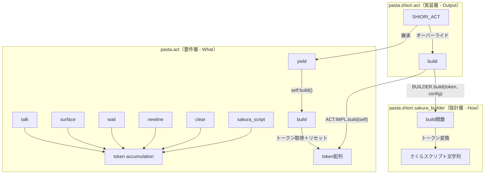
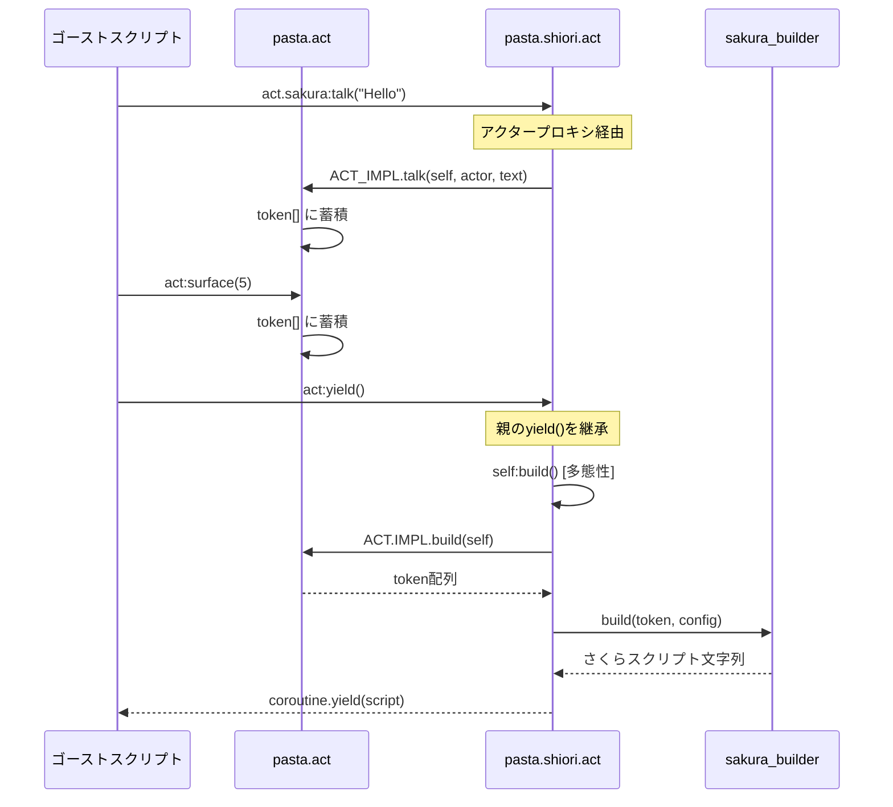

# Design Document

## Overview

**Purpose**: 本機能は、`pasta.act`と`pasta.shiori.act`のアーキテクチャを「要件/設計/実装」の責務分離原則に基づいて再設計する。

**Users**: Pastaフレームワークを使用するゴースト開発者が、より柔軟で拡張性の高いアクションオブジェクトAPIを利用できるようになる。

**Impact**: 既存の`_buffer`直接構築パターンを廃止し、トークンベースの中間表現を導入。子クラスの責務を最小化し、将来の他UI実装（HTML、Markdown等）への拡張性を確保する。

### Goals
- `pasta.act`に全トークン蓄積責務を集約
- `pasta.shiori.sakura_builder`にさくらスクリプト変換ロジックを分離
- 多態性を活用した`build()`/`yield()`の親子連携
- 既存APIの後方互換性維持

### Non-Goals
- 新しい出力フォーマット（HTML等）の実装
- パフォーマンス最適化
- トランスパイラー側の変更

## Architecture

### Existing Architecture Analysis

現行アーキテクチャの問題点:

```
pasta.act                    pasta.shiori.act
├── token[]                  ├── _buffer[]（さくらスクリプト直接構築）
├── talk() → tokenへ追加     ├── talk() → _bufferへ直接追加（親と重複）
├── sakura_script()          ├── surface/wait/newline/clear()
└── yield() → token出力      ├── build() → _buffer連結
                             └── reset()
```

問題:
1. 子クラスが`_buffer`に直接さくらスクリプトを構築（要件と実装の混在）
2. `talk()`が親子両方に存在し、子は`_buffer`操作後に親を呼ぶ（責務不明確）
3. `yield()`が親子両方に存在（重複実装）

### Architecture Pattern & Boundary Map



**Architecture Integration**:
- **Selected pattern**: Template Method + Strategy
  - 親クラスが骨格（yield→build→coroutine.yield）を定義
  - 子クラスがbuild()をオーバーライドして出力形式を変更
- **Domain boundaries**: 
  - `pasta.act`: トークン蓄積（What happened）
  - `pasta.shiori.sakura_builder`: 変換ルール（How to format）
  - `pasta.shiori.act`: 出力生成（Output production）
- **Existing patterns preserved**: 
  - MODULE/MODULE_IMPL分離パターン
  - メソッドチェーン（return self）
  - アクタープロキシ経由のメソッド呼び出し
- **New components rationale**: 
  - `sakura_builder`: 変換ロジックの単体テスト可能化
- **Steering compliance**: lua-coding.md準拠

### Technology Stack

| Layer     | Choice / Version            | Role in Feature      | Notes    |
| --------- | --------------------------- | -------------------- | -------- |
| Runtime   | Lua 5.4 (mlua)              | スクリプト実行       | 既存     |
| Framework | pasta_lua                   | Luaバックエンド層    | 既存     |
| Module    | pasta.act                   | トークン蓄積         | 拡張     |
| Module    | pasta.shiori.act            | さくらスクリプト生成 | 簡素化   |
| Module    | pasta.shiori.sakura_builder | 変換ロジック         | **新規** |

## System Flows

### トークン蓄積からさくらスクリプト生成までのフロー



## Requirements Traceability

| Requirement | Summary                 | Components       | Interfaces                          | Flows             |
| ----------- | ----------------------- | ---------------- | ----------------------------------- | ----------------- |
| 1           | UI操作トークン蓄積      | pasta.act        | ACT_IMPL.surface/wait/newline/clear | トークン蓄積      |
| 2           | スポット切り替え検出    | pasta.act        | ACT_IMPL.talk                       | トークン蓄積      |
| 3           | 子クラスメソッド削除    | pasta.shiori.act | -                                   | -                 |
| 4           | 子クラスフィールド削除  | pasta.shiori.act | SHIORI_ACT.new                      | -                 |
| 5           | 固定改行除去            | pasta.act        | ACT_IMPL.talk                       | トークン蓄積      |
| 6           | sakura_builder新設      | sakura_builder   | BUILDER.build                       | 変換フロー        |
| 7           | 親build()新設           | pasta.act        | ACT_IMPL.build                      | build/yieldフロー |
| 8           | yield()統一             | pasta.act        | ACT_IMPL.yield                      | yieldフロー       |
| 9           | 子build()オーバーライド | pasta.shiori.act | SHIORI_ACT_IMPL.build               | 変換フロー        |
| 10          | 互換性維持              | 全モジュール     | 公開API全て                         | 全フロー          |
| 11          | end_action()削除        | pasta.act        | ACT_IMPL.end_action                 | -                 |

## Components and Interfaces

| Component                   | Domain/Layer   | Intent                 | Req Coverage  | Key Dependencies                    | Contracts |
| --------------------------- | -------------- | ---------------------- | ------------- | ----------------------------------- | --------- |
| pasta.act                   | Core/Parent    | トークン蓄積と状態管理 | 1, 2, 5, 7, 8, 10, 11 | actor, scene                        | Service   |
| pasta.shiori.act            | SHIORI/Child   | さくらスクリプト生成   | 3, 4, 9, 10   | pasta.act (P0), sakura_builder (P0) | Service   |
| pasta.shiori.sakura_builder | SHIORI/Utility | トークン→文字列変換    | 6             | なし                                | Service   |

### Core Layer

#### pasta.act

| Field        | Detail                                             |
| ------------ | -------------------------------------------------- |
| Intent       | 全アクションのトークン蓄積と状態管理を担う親クラス |
| Requirements | 1, 2, 5, 7, 8, 10, 11                              |

**Responsibilities & Constraints**
- トークン配列（`self.token`）への蓄積
- 現在スポット（`self._current_spot`）の追跡
- スポット切り替え検出とspot_switchトークン挿入
- build()でのトークン取得とリセット
- yield()でのbuild()呼び出しとcoroutine.yield
- end_action()の公開API削除

**Dependencies**
- Inbound: pasta.shiori.act — 継承 (P0)
- Outbound: pasta.actor — アクタープロキシ生成 (P1)
- Outbound: pasta.scene — シーン検索 (P1)

**Contracts**: Service [x]

##### Service Interface

```lua
--- @class Act
--- @field token table[] トークン配列
--- @field _current_spot number|nil 現在のスポットID
--- @field now_actor Actor|nil 現在のアクター

--- @class ACT_IMPL

--- UI操作トークン蓄積
--- @param self Act
--- @param id number|string サーフェスID
--- @return Act self
function ACT_IMPL.surface(self, id)
    table.insert(self.token, { type = "surface", id = id })
    return self
end

--- @param self Act
--- @param ms number 待機時間（ミリ秒）
--- @return Act self
function ACT_IMPL.wait(self, ms)
    ms = math.max(0, math.floor(ms or 0))
    table.insert(self.token, { type = "wait", ms = ms })
    return self
end

--- @param self Act
--- @param n number|nil 改行回数（デフォルト1）
--- @return Act self
function ACT_IMPL.newline(self, n)
    table.insert(self.token, { type = "newline", n = n or 1 })
    return self
end

--- @param self Act
--- @return Act self
function ACT_IMPL.clear(self)
    table.insert(self.token, { type = "clear" })
    return self
end

--- トークン取得とリセット
--- @param self Act
--- @return table[] token配列
function ACT_IMPL.build(self)
    local token = self.token
    self.token = {}
    self.now_actor = nil
    self._current_spot = nil
    return token
end

--- build()結果をyield
--- @param self Act
--- @return Act self
function ACT_IMPL.yield(self)
    local result = self:build()
    coroutine.yield(result)
    return self
end
```

**スポット切り替え検出ロジック（talk()内）**:
```lua
function ACT_IMPL.talk(self, actor, text)
    if self.now_actor ~= actor then
        table.insert(self.token, { type = "actor", actor = actor })
        -- スポット切り替え検出
        local spot_id = actor.spot or 0
        if self._current_spot ~= nil and self._current_spot ~= spot_id then
            table.insert(self.token, { type = "spot_switch" })
        end
        self._current_spot = spot_id
        self.now_actor = actor
    end
    table.insert(self.token, { type = "talk", text = text })
    return self
end
```

**Implementation Notes**
- `ACT.new()`で`_current_spot = nil`を初期化
- 既存の`yield()`は内部で`build()`を呼び出すようリファクタリング
- メソッドチェーン用に全メソッドが`self`を返す

---

### SHIORI Layer

#### pasta.shiori.sakura_builder

| Field        | Detail                                                           |
| ------------ | ---------------------------------------------------------------- |
| Intent       | トークン配列をさくらスクリプト文字列に変換する純粋関数モジュール |
| Requirements | 6                                                                |

**Responsibilities & Constraints**
- トークン配列と設定を受け取り、さくらスクリプト文字列を返却
- 各トークンタイプに応じた変換処理
- さくらスクリプト用エスケープ処理
- 出力末尾への`\e`付与

**Dependencies**
- Inbound: pasta.shiori.act — build()から呼び出し (P0)
- External: なし

**Contracts**: Service [x]

##### Service Interface

```lua
--- @module pasta.shiori.sakura_builder
local BUILDER = {}

--- さくらスクリプト用エスケープ処理
--- @param text string 入力テキスト
--- @return string エスケープ済みテキスト
local function escape_sakura(text)
    if not text then return "" end
    local escaped = text:gsub("\\", "\\\\")
    escaped = escaped:gsub("%%", "%%%%")
    return escaped
end

--- spotからスポットID番号を決定
--- @param spot any スポット値
--- @return number スポットID番号
local function spot_to_id(spot)
    if spot == "sakura" or spot == 0 then return 0
    elseif spot == "kero" or spot == 1 then return 1
    elseif type(spot) == "number" then return spot
    elseif type(spot) == "string" then
        local n = spot:match("^char(%d+)$")
        if n then return tonumber(n) end
    end
    return 0
end

--- スポットタグを生成
--- @param spot_id number スポットID番号
--- @return string スポットタグ
local function spot_to_tag(spot_id)
    return string.format("\\p[%d]", spot_id)
end

--- @class BuildConfig
--- @field spot_switch_newlines number スポット切り替え時の改行量（デフォルト1.5）

--- トークン配列をさくらスクリプト文字列に変換
--- @param tokens table[] トークン配列
--- @param config BuildConfig|nil 設定
--- @return string さくらスクリプト文字列
function BUILDER.build(tokens, config)
    config = config or {}
    local spot_switch_newlines = config.spot_switch_newlines or 1.5
    local buffer = {}
    
    for _, token in ipairs(tokens) do
        local t = token.type
        if t == "actor" then
            local spot_id = spot_to_id(token.actor.spot)
            table.insert(buffer, spot_to_tag(spot_id))
        elseif t == "spot_switch" then
            local percent = math.floor(spot_switch_newlines * 100)
            table.insert(buffer, string.format("\\n[%d]", percent))
        elseif t == "talk" then
            table.insert(buffer, escape_sakura(token.text))
        elseif t == "surface" then
            table.insert(buffer, string.format("\\s[%s]", tostring(token.id)))
        elseif t == "wait" then
            table.insert(buffer, string.format("\\w[%d]", token.ms))
        elseif t == "newline" then
            for _ = 1, token.n do
                table.insert(buffer, "\\n")
            end
        elseif t == "clear" then
            table.insert(buffer, "\\c")
        elseif t == "sakura_script" then
            table.insert(buffer, token.text)
        end
        -- yield は無視
    end
    
    return table.concat(buffer) .. "\\e"
end

return BUILDER
```

**Implementation Notes**
- 純粋関数として実装（状態を持たない）
- ヘルパー関数（escape_sakura, spot_to_id, spot_to_tag）は内部に隠蔽
- 単体テストが容易な設計

---

#### pasta.shiori.act

| Field        | Detail                                                       |
| ------------ | ------------------------------------------------------------ |
| Intent       | SHIORI専用アクションオブジェクト、さくらスクリプト生成に特化 |
| Requirements | 3, 4, 9, 10                                                  |

**Responsibilities & Constraints**
- `pasta.act`を継承
- `build()`のみオーバーライド（親build()呼び出し→sakura_builder変換）
- `_spot_switch_newlines`設定の保持
- `transfer_date_to_var()`の維持

**Dependencies**
- Inbound: ゴーストスクリプト — アクションオブジェクト使用 (P0)
- Outbound: pasta.act — 継承 (P0)
- Outbound: pasta.shiori.sakura_builder — 変換呼び出し (P0)
- Outbound: pasta.config — 設定読み込み (P1)

**Contracts**: Service [x]

##### Service Interface

```lua
--- @module pasta.shiori.act
local ACT = require("pasta.act")
local BUILDER = require("pasta.shiori.sakura_builder")
local CONFIG = require("pasta.config")

--- @class ShioriAct : Act
--- @field _spot_switch_newlines number スポット切り替え時の改行数
--- @field req ShioriRequest|nil SHIORIリクエストオブジェクト
local SHIORI_ACT = {}
local SHIORI_ACT_IMPL = {}

setmetatable(SHIORI_ACT_IMPL, { __index = ACT.IMPL })

function SHIORI_ACT_IMPL.__index(self, key)
    local method = rawget(SHIORI_ACT_IMPL, key)
    if method then return method end
    return ACT.IMPL.__index(self, key)
end

SHIORI_ACT.IMPL = SHIORI_ACT_IMPL

--- 新規ShioriActを作成
--- @param actors table<string, Actor> 登録アクター
--- @param req ShioriRequest|nil SHIORIリクエストオブジェクト
--- @return ShioriAct
function SHIORI_ACT.new(actors, req)
    local base = ACT.new(actors)
    base._spot_switch_newlines = CONFIG.get("ghost", "spot_switch_newlines", 1.5)
    base.req = req
    return setmetatable(base, SHIORI_ACT_IMPL)
end

--- build()オーバーライド: さくらスクリプト生成
--- @param self ShioriAct
--- @return string さくらスクリプト文字列
function SHIORI_ACT_IMPL.build(self)
    -- 親のbuild()でトークン取得＆リセット
    local token = ACT.IMPL.build(self)
    -- sakura_builderで変換
    local script = BUILDER.build(token, {
        spot_switch_newlines = self._spot_switch_newlines
    })
    return script
end

-- transfer_date_to_var() は変更なし（既存実装維持）

return SHIORI_ACT
```

**削除対象メソッド**:
- `SHIORI_ACT_IMPL.talk()` — 親クラスを使用
- `SHIORI_ACT_IMPL.surface()` — 親クラスを使用
- `SHIORI_ACT_IMPL.wait()` — 親クラスを使用
- `SHIORI_ACT_IMPL.newline()` — 親クラスを使用
- `SHIORI_ACT_IMPL.clear()` — 親クラスを使用
- `SHIORI_ACT_IMPL.yield()` — 親クラスを使用
- `SHIORI_ACT_IMPL.reset()` — 親クラスを使用

**削除対象フィールド**:
- `_buffer` — トークンベースに移行
- `_current_spot` — 親クラスが管理

**Implementation Notes**
- `new()`では`_spot_switch_newlines`と`req`のみ設定
- `build()`は`\e`を付与しない（sakura_builderが付与）
- `yield()`は継承（親のyield()がself:build()を呼び出し、多態性で子のbuild()が実行される）

## Data Models

### Token Format

| Token Type    | Structure                                   | Description          |
| ------------- | ------------------------------------------- | -------------------- |
| actor         | `{ type = "actor", actor = Actor }`         | アクター切り替え     |
| spot_switch   | `{ type = "spot_switch" }`                  | スポット切り替え検出 |
| talk          | `{ type = "talk", text = string }`          | 発話テキスト         |
| surface       | `{ type = "surface", id = number\|string }` | サーフェス変更       |
| wait          | `{ type = "wait", ms = number }`            | 待機                 |
| newline       | `{ type = "newline", n = number }`          | 改行（n回）          |
| clear         | `{ type = "clear" }`                        | クリア               |
| sakura_script | `{ type = "sakura_script", text = string }` | 生スクリプト         |

### State Model

```lua
--- Act State
{
    token = {},          -- トークン配列
    now_actor = nil,     -- 現在のアクター
    _current_spot = nil, -- 現在のスポットID
    actors = {},         -- 登録アクター
    var = {},            -- ローカル変数
    save = {},           -- 永続変数
}

--- ShioriAct State (extends Act)
{
    -- Act fields...
    _spot_switch_newlines = 1.5, -- スポット切り替え改行量
    req = nil,                    -- SHIORIリクエスト
}
```

## Testing Strategy

### Unit Tests
- `sakura_builder.build()`: 各トークンタイプの変換テスト
- `ACT_IMPL.surface/wait/newline/clear()`: トークン蓄積テスト
- `ACT_IMPL.talk()`: スポット切り替え検出テスト
- `ACT_IMPL.build()`: トークン取得とリセットテスト
- `SHIORI_ACT_IMPL.build()`: 親呼び出し＋変換テスト

### Integration Tests
- `yield()`フロー: トークン蓄積→build→coroutine.yield
- アクタープロキシ経由の呼び出し: `act.sakura:talk("Hello")`
- 複数スポット切り替えシナリオ
- 既存テストスイート（shiori_act_test.lua）の互換性確認

### E2E Tests
- pasta_sample_ghostでの動作確認
- 既存ゴーストスクリプトの動作検証

## Migration Strategy

### Phase 1: 親クラス拡張
1. `pasta.act`に新メソッド追加（surface/wait/newline/clear/build）
2. `_current_spot`フィールド追加
3. `talk()`のスポット切り替え検出追加
4. `yield()`のリファクタリング
5. `end_action()`の削除

### Phase 2: sakura_builder作成
1. 新規モジュール`pasta/shiori/sakura_builder.lua`作成
2. ヘルパー関数移植（escape_sakura, spot_to_id, spot_to_tag）
3. `build()`関数実装

### Phase 3: 子クラス簡素化
1. `SHIORI_ACT_IMPL.build()`を新実装に置換
2. 不要メソッド削除（talk/surface/wait/newline/clear/yield/reset）
3. 不要フィールド削除（_buffer/_current_spot）
4. `new()`簡素化

### Phase 4: テスト更新
1. 新規sakura_builderテスト作成
2. 既存shiori_act_test.lua更新（固定改行除去対応）
3. pasta_sample_ghost同期

### Rollback Triggers
- 既存テストが大量に失敗
- 互換性問題が発見された場合

### Validation Checkpoints
- 各フェーズ後にテスト実行
- pasta_sample_ghostでの動作確認
