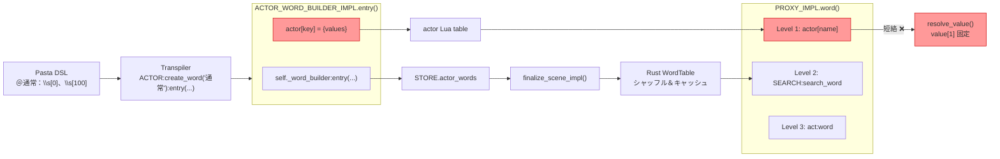
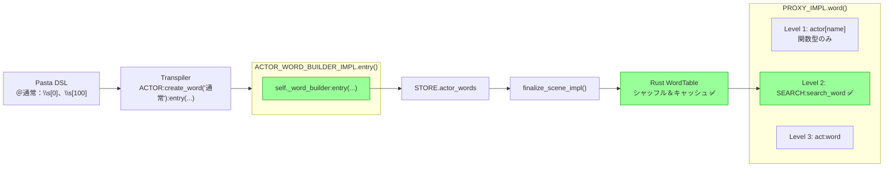

# 設計ドキュメント: actor-dict-word-shuffle

## 概要

**目的**: アクター辞書（`％` ブロック）の複数値定義でシャッフルが機能しないバグを修正する。`ACTOR_WORD_BUILDER_IMPL.entry()` の二重登録を除去し、文字列値の管理を Rust `WordTable` に一元化することで、アクタースコープ単語にもキャッシュベースの順次消費（シャッフル＆デッキ方式）を適用する。

**ユーザー**: ゴースト辞書制作者がアクターごとの表情バリエーション（`＠通常：\s[0]、\s[100]、\s[200]`）を定義した際、参照のたびにシャッフルされた候補値が返されるようになる。

**影響**: 登録パス（`entry()`）の修正のみ。検索パス（`PROXY_IMPL.word()`）の 3 段フォールバック順序は変更しない。

### ゴール

- `entry()` の `actor[key]` への不正な文字列書き込みを除去する
- アクタースコープ単語にシャッフル＆順次消費方式を適用する（グローバル/ローカルと同等）
- リグレッション防止テストを追加する
- `doc/spec/11-actor-dictionary.md` にシャッフル契約を明記する

### ノンゴール

- `PROXY_IMPL.word()` の検索フォールバック順序の変更
- `WORD.resolve_value()` のリファクタリング
- 11.5 節の将来拡張（Lua コードブロック）の実装
- パフォーマンス最適化（Level 2 の FFI オーバーヘッドは許容範囲内）

## アーキテクチャ

### 既存アーキテクチャ分析

現行のアクター単語データフローには 2 つの独立した登録パスが存在し、これがバグの根本原因となっている。

**現行データフロー（バグ状態）**:



**修正後データフロー**:



### アーキテクチャパターン＆境界マップ

**選択パターン**: Single Source of Truth の回復（二重登録の除去）

修正は登録パス 1 箇所のみであり、アーキテクチャパターンの変更は不要。既存の 3 段フォールバック検索および Rust `WordTable` のシャッフル機構をそのまま活用する。

**維持する既存パターン**:
- Lua `STORE` → `finalize_scene_impl()` → Rust `WordDefRegistry` → `WordTable` のデータフローパイプライン
- `PROXY_IMPL.word()` の Level 1 → 2 → 3 フォールバック順序
- `WordTable.search_word()` のキャッシュベース順次消費

**ステアリング準拠**:
- 設計哲学「Yield 型・宣言的フロー」を維持
- レイヤー分離原則（pasta_core = レジストリ、pasta_lua = ランタイム）を維持

### 技術スタック

| レイヤー | 選択 / バージョン | 本機能での役割 | 備考 |
|---|---|---|---|
| Lua ランタイム | Lua 5.5 (mlua 0.11) | `actor.lua` 修正対象 | 既存バージョン変更なし |
| Rust レジストリ | pasta_core | `WordTable` シャッフル＆キャッシュ | 変更なし（既存実装を活用） |
| テストフレームワーク | insta + lua_test | E2E テスト追加 | 既存ツール |

## システムフロー

### アクター単語参照フロー（修正後）

```mermaid
sequenceDiagram
    participant Scene as シーン実行
    participant Proxy as PROXY_IMPL.word()
    participant Actor as actor[name]
    participant Search as SEARCH:search_word()
    participant WT as WordTable (Rust)
    participant Act as act:word()

    Scene->>Proxy: word("通常")
    
    Proxy->>Actor: actor["通常"] 参照
    
    alt 関数型エントリが存在
        Actor-->>Proxy: function
        Proxy->>Proxy: value(act) 呼び出し
        Proxy-->>Scene: 関数の戻り値
    else nil（エントリなし）
        Actor-->>Proxy: nil
        Proxy->>Search: search_word("通常", "__actor_xxx__")
        Search->>WT: search_word("__actor_xxx__", "通常", [])
        
        alt キャッシュヒット（未消費あり）
            WT-->>Search: 次の候補値
        else キャッシュミスまたは全消費済み
            WT->>WT: collect_word_candidates()
            WT->>WT: シャッフル＆キャッシュ構築
            WT-->>Search: 先頭候補値
        end
        
        Search-->>Proxy: 結果文字列
        Proxy-->>Scene: 結果文字列
    else Level 2 も nil
        Search-->>Proxy: nil
        Proxy->>Act: word("通常")
        Act-->>Proxy: グローバル/シーンの結果
        Proxy-->>Scene: フォールバック結果
    end
```

## 要件トレーサビリティ

| 要件 | 概要 | コンポーネント | インタフェース | フロー |
|---|---|---|---|---|
| 1.1 | シャッフル＆順次消費で候補値選択 | WordTable (既存) | `search_word()` | アクター単語参照フロー Level 2 |
| 1.2 | 全消費後に再シャッフル | WordTable (既存) | `search_word()` キャッシュ再構築 | 同上 |
| 1.3 | デッキ方式（重複なし） | WordTable (既存) | `CachedWordSelection.next_index` | 同上 |
| 1.4 | 単一値の後方互換性 | WordTable (既存) | `search_word()` 1要素キャッシュ | 同上 |
| 2.1 | `entry()` 文字列値を WordTable のみに登録 | ACTOR_WORD_BUILDER_IMPL | `entry()` | 登録フロー |
| 2.2 | 関数型エントリの Level 1 動作維持 | PROXY_IMPL | `word()` Level 1 | 参照フロー |
| 3.1 | シャッフル検証テスト | E2E テスト | `set_word_selector()` | テスト |
| 3.2 | フォールバック検証テスト | E2E テスト | — | テスト |
| 3.3 | 単一値後方互換テスト | E2E テスト | — | テスト |
| 4.1 | 11 章にシャッフル契約を明記 | doc/spec/11-actor-dictionary.md | — | — |
| 4.2 | 4.1.4 への相互参照 | doc/spec/11-actor-dictionary.md | — | — |

## コンポーネント＆インタフェース

| コンポーネント | ドメイン/レイヤー | 意図 | 要件カバレッジ | 主要依存 | 変更種別 |
|---|---|---|---|---|---|
| ACTOR_WORD_BUILDER_IMPL | Lua ランタイム | アクター単語登録ビルダー | 2.1 | word.lua (P0) | **修正** |
| PROXY_IMPL | Lua ランタイム | 3 段フォールバック検索 | 1.1-1.4, 2.2 | SearchContext (P0) | 変更なし |
| WordTable | Rust レジストリ | シャッフル＆キャッシュ管理 | 1.1-1.4 | — | 変更なし |
| E2E テスト | テスト | シャッフル動作検証 | 3.1-3.3 | scene_test.rs (P0) | **新規** |
| doc/spec/11 | ドキュメント | 仕様記述 | 4.1, 4.2 | — | **修正** |

### Lua ランタイム層

#### ACTOR_WORD_BUILDER_IMPL.entry()

| フィールド | 詳細 |
|---|---|
| 意図 | アクター単語のエントリ登録（`actor[key]` への不正書き込みを除去） |
| 要件 | 2.1 |

**責務＆制約**
- `entry()` は可変長引数で受け取った文字列値を `self._word_builder:entry(...)` のみに委譲する
- `actor[key]` への書き込み（`if not self._actor[self._key]` ブロック全体）を削除する
- メソッドチェーン（`return self`）は維持する

**依存**
- Outbound: `WORD_BUILDER_IMPL.entry()` — 単語辞書への登録 (P0)

**契約**: Service [x]

##### サービスインタフェース

```lua
--- 修正後の entry() 
--- @param self ActorWordBuilder
--- @param ... string 可変長引数で値を受け取る
--- @return ActorWordBuilder メソッドチェーン用
function ACTOR_WORD_BUILDER_IMPL.entry(self, ...)
    -- 事前条件: values が 1 つ以上
    -- 事後条件: STORE.actor_words[actor_name][key] にエントリ追加済み
    -- 不変条件: actor[key] には一切書き込まない
end
```

- 事前条件: 引数が 1 つ以上
- 事後条件: `self._word_builder:entry(...)` のみ呼び出し完了
- 不変条件: `self._actor[self._key]` への代入・挿入は行わない

**実装ノート**
- 削除対象: `actor.lua` L47-53 の `actor[key]` 書き込みブロック
- `self._word_builder:entry(...)` 呼び出し（L45）は残す
- 空値チェック（`if #values > 0`、L43）は残す

#### PROXY_IMPL.word()（変更なし）

| フィールド | 詳細 |
|---|---|
| 意図 | 3 段フォールバック検索（変更なし、参考記載） |
| 要件 | 1.1-1.4, 2.2 |

**動作確認事項（テストで検証）**
- `entry()` 修正後、`actor[name]` は文字列テーブルを保持しないため Level 1 は `nil` を返す
- Level 2 の `SEARCH:search_word()` に到達し、`WordTable` のシャッフルが適用される
- 関数型エントリが `actor[key]` に存在する場合は引き続き Level 1 で処理される

### Rust レジストリ層（変更なし）

#### WordTable

| フィールド | 詳細 |
|---|---|
| 意図 | シャッフル＆キャッシュベース順次消費（変更なし） |
| 要件 | 1.1-1.4 |

**既存実装の確認事項**:
- `search_word()`: キャッシュキー `(module_name, search_key)` で `CachedWordSelection` を管理
- アクタースコープ: `module_name = "__actor_{name}__"`, `search_key = "{word_name}"`
- キャッシュ消費済み → `collect_word_candidates()` で候補再収集 → `shuffle_usize()` で再シャッフル → キャッシュ再構築
- 全候補消費まで同一値は再選択されない（デッキ方式）
- 単一値の場合: 1 要素のキャッシュが構築され、常にその値を返す（後方互換性）

## テスト戦略

### E2E テスト（`scene_test.rs` に追加）

Pasta DSL → transpile → Lua 実行 → finalize → search のパイプライン全体を検証する。

1. **シャッフル動作検証** (3.1):
   - フィクスチャ: アクター辞書に 3 値の単語を定義
   - `set_word_selector()` でモックセレクタを注入し、決定論的に順序を制御
   - `SEARCH:search_word(name, actor_scope)` を 3 回呼び出し、3 値すべてが消費されることを検証
   - 予想される呼び出し: `lua.load("SEARCH:search_word('通常', '__actor_さくら__')").eval()`

2. **フォールバック検証** (3.2):
   - アクター辞書に存在しない単語名を参照し、グローバル単語にフォールバックすることを検証
   - 既存 `test_actor_word_scope_resolution` の NOTE を昇格

3. **単一値後方互換** (3.3):
   - アクター辞書の単一値定義（`＠照れ：\s[1]`）が常に同一値を返すことを検証

### 既存テストへの影響

- `actor_word_dictionary_test.rs`: トランスパイラ出力テスト → 変更不要（出力コードは不変）
- `actor_word_test.lua`: Lua モジュール API テスト → 変更不要（`WORD.create_actor` は不変）
- `word_table_test.rs`: Rust 側テスト → 変更不要（WordTable は不変）

## 仕様ドキュメント更新（R4）

### doc/spec/11-actor-dictionary.md への追記

`11.4 アクタースコープと単語参照の統合` セクションに以下を追記:

- 「アクター単語はシャッフルされる」ことを仕様上の契約として明記
- 複数値定義時のシャッフル＆順次消費方式が 4.1.4 スコープ解決アルゴリズムと同一であることへの相互参照を追加
- 全候補消費後の再シャッフルについて記述
