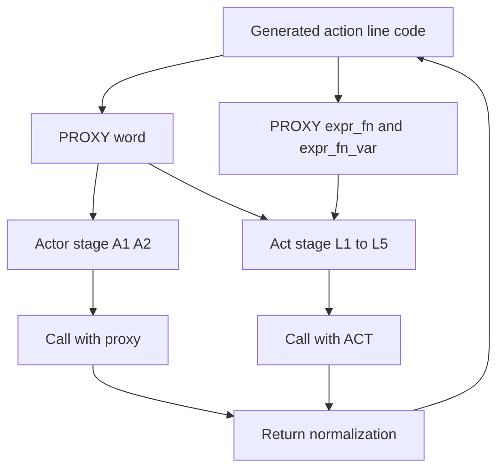
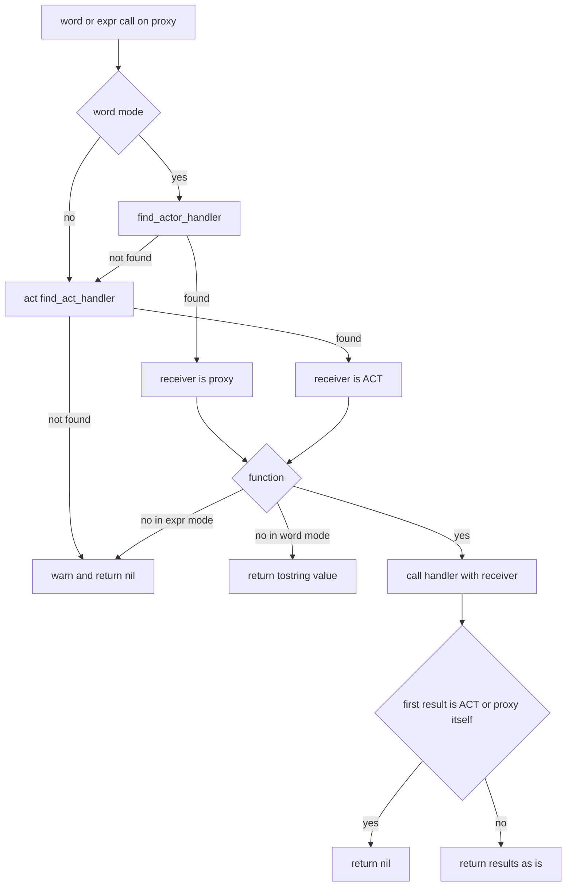

# Design Document: actor-proxy-act-delegation

## Overview

**Purpose**: アクション行（`アクター：…`）から呼んだ関数が第 1 引数に受け取るものを、関数の置き場所で決まる 1 つの規則にする。これにより、ゴースト作者はアクション行の `＠yield`・`＠チェイントーク`・`＠ゴースト終了` と、値がそれらの名前である `＠＄変数名` を、行の外と同じように使える（SHIORI のエラー応答 500 にならない）。

**Users**: ゴースト作者（DSL とシーンの Lua ブロック・`GLOBAL` 関数を書く人）と、pasta の開発者（回帰テストとマニュアルで規則を固定する人）。

**Impact**: アクタープロキシ（`pasta.actor` の `PROXY_IMPL`）が、見つけた関数に渡す第 1 引数を変える。行のアクター自身（アクターの表のフィールド）で見つかった関数は現行どおりプロキシを受け取り、それ以外の段で見つかった関数は ACT を受け取る。作者の `GLOBAL` 関数とシーンの関数は、アクション行から呼ばれたときプロキシでなく ACT を受け取るようになる（作者に見える変更。要件ディスカッションで受け入れ済み）。

### Goals

- アクション行の `＠yield`・`＠チェイントーク`・`＠ゴースト終了` と、act のメソッド・シーン関数の呼び出しが、行の外と同じ動作になる（1.1–1.7、2.4）。
- 第 1 引数の規則が「置き場所で決まる」の 1 つになり、マニュアルの全箇所が同じ規則を述べる（2.1–2.3、5.1–5.3）。
- 規則と修正を回帰テストで固定する。不具合を再現するテストは修正前の実装で失敗する（4.1–4.5）。
- ランタイムのソースの変更は `actor.lua` の 2 関数と補助 1 つに収める。

### Non-Goals

- 名前の検索順序（どの段をどの順で探すか）の変更。
- アクターの外の関数に話者（どのアクターの行か）を伝える手段の追加。
- act のメソッドの中身・戻り値の変更（`act.lua` は変えない）。
- アクション行の外の呼び出し（`＄x＝＠名前`・`＄＝＠名前（…）`・`＞名前`）と `＠＊名前（…）` の挙動の変更。
- `GLOBAL.yield`・`close_ghost` にプロキシを ACT へ直す防御を足すこと（要件が求めていない。手書き Lua でプロキシを直接渡す使い方は対象外）。
- 生成コード（`element_gen.rs`）の変更。

## Boundary Commitments

### This Spec Owns

- `PROXY_IMPL.word`・`PROXY_IMPL.expr_fn`・`PROXY_IMPL.expr_fn_var` が見つけた関数に渡す第 1 引数の規則（置き場所で決まる）。
- 上の 3 メソッドの戻り値の正規化（ACT またはプロキシそのものを値なしにする）。
- この規則と、アクション行からの組み込み関数の呼び出しを固定する回帰テスト。
- マニュアルのうち、アクション行から呼ばれた関数が受け取るものを述べる記述と、そこから再生成するスキルの `references/`。

### Out of Boundary

- `pasta/act.lua`（`find_act_handler`・`yield`・`wait`・`raw_script` などの中身と戻り値）。Wave 2 では `act-token-grouping-fix` が持つ。
- `pasta/global.lua`・`pasta/shiori/entry.lua`。並走条件では変更が許されているが、本設計では変更しない。
- アクション行のコード生成（`crates/pasta_lua/src/code_gen/`）。
- 検索の各段（A1・A2・L1〜L5）の中身と順序。アクター単語の検索キー。
- `crates/pasta_shiori/tests/support/scripts/pasta/` の古いランタイムの写し（追従させない）。

### Allowed Dependencies

- `ACT_IMPL.find_act_handler(self, mode, key, skip_methods)`（`act.lua`。既存の公開の形のまま呼ぶ）。
- `ACT_IMPL.actor_proxy(self, name)`（`dsl-codegen-runtime-safety` が足したプロキシ取得口。未登録のアクターにもその場限りのプロキシを返す）。
- act のメソッド・`GLOBAL.yield`・`close_ghost` が「第 1 引数に ACT を受け取れば現行どおり動く」こと。
- テスト基盤: `lua_test`（`crates/pasta_lua/tests/lua_specs/`）、`ShioriTestEnv`（`crates/pasta_shiori/tests/common/`）、埋め込みの標準ランタイムを使うフィクスチャの形（`fixtures/codegen_runtime_safety/pasta.toml`）。
- マニュアルの道具: `node book/tools/gen-skill-refs.mjs`（`--check`）、`node book/tools/link-check.mjs`。
- 依存の向きは現行どおり `pasta.actor` → `pasta.store`・`pasta.word`・`@pasta_log`。`pasta.actor` は `pasta.act` を `require` しない（`self.act` 経由で呼ぶだけ）。

### Revalidation Triggers

- `act.lua` の `find_act_handler` の引数・戻り値の形が変わるとき。
- act のメソッドの戻り値の慣習（メソッドチェーン用に `self` を返す）が変わるとき（戻り値の正規化の前提）。
- 生成コードがアクション行の関数呼び出し・単語参照をプロキシ以外の口で書くようになるとき。
- 話者を ACT の側から知る手段を足す spec が始まるとき（本規則の「アクターの外の関数は話者を受け取らない」が前提になる）。

## Architecture

### Existing Architecture Analysis

- 生成コードはアクション行を次の形で書く（変更しない）。
  - `＠名前` → `act:actor_proxy("A"):talk(act:actor_proxy("A"):word("名前"))`
  - `＠名前（…）` → `…:talk((…:expr_fn("名前", …)))`
  - `＠＄x` → `…:word(var.x, "var.x")`、`＠＄x（…）` → `…:expr_fn_var(var.x, "var.x", …)`
  - `＠＊名前（…）` → `act:global_fn(…)`（プロキシを通らない。ACT を渡す）
- `PROXY_IMPL.find_handler` は、アクターの段（`find_actor_handler`。word モードだけ。A1 はアクターの表、A2 はアクター単語辞書で文字列を返す）で見つからなければ `self.act:find_act_handler`（L1〜L5）へ委ねる。
- 現行の `call_expr` は `handler(self, ...)`、`word` は `handler(self)` で、どの段で見つかった関数にもプロキシを渡す。プロキシは act のメソッドを持たないため、ACT を前提とする関数（act のメソッド・`GLOBAL.yield`・`close_ghost`・シーン関数）がエラーになる。これが 500 の原因のすべてである。
- 関数呼び出しの形（expr モード）はアクターの段を探さない。したがって expr モードで見つかる関数は、常にアクターの外の関数である。
- act のメソッドの多くはメソッドチェーン用に `self`（ACT）を返す。生成コードは戻り値をそのまま `talk` に渡し、`ACT_IMPL.talk` は `nil` 以外を `tostring` するため、ACT を渡すだけでは `table: 0x…` が台詞に混ざる。

### Architecture Pattern & Boundary Map



**Architecture Integration**:

- 選んだ形: プロキシの後処理で、見つかった段に応じて渡すものを変える（research.md の案 A）。`actor.lua` だけで全経路が直り、`＠＊名前（…）`・行の外の呼び出しと受け取るものがそろう。
- 責務の分け方: 「どこで見つかったか」を知るのはプロキシの後処理だけにする。`word` はアクターの段と act の段を自分で順に呼び、`call_expr` は常に ACT を渡す。検索関数の戻り値の形は変えない。
- 保つもの: 公開の `PROXY_IMPL.find_handler`・`find_actor_handler` の引数・戻り値・検索順序。警告ログの文言。`talk`・`sakura_script`・`actor`・`act` フィールド。
- 新しい部品: 戻り値の正規化を行う局所関数 1 つ（`word` と `call_expr` の 2 か所で使うため関数にする）。新しいモジュール・公開 API・設定は足さない。
- steering との整合: マニュアルが文法・API の唯一の権威であり、挙動を変える同じ変更でマニュアルと生成スキルを更新する。

### Technology Stack

| Layer | Choice / Version | Role in Feature | Notes |
|-------|------------------|-----------------|-------|
| Lua ランタイム | LuaJIT 2.1（mlua 経由）、`pasta_scripts/pasta/actor.lua` | 第 1 引数の規則と戻り値の正規化 | 新しい依存なし |
| テスト（Lua） | `lua_test`（`tests/lua_specs/`） | プロキシ単体での規則の固定 | `init.lua` の一覧に新しい spec を足す |
| テスト（Rust） | `cargo test`（`pasta_lua`・`pasta_shiori`） | DSL → 実行 → SHIORI 応答の固定 | 実行前に環境変数 `NoDefaultCurrentDirectoryInExePath` を外す |
| マニュアル | mdBook（`book/src/`）、Node の `gen-skill-refs.mjs`・`link-check.mjs` | 規則の記述と生成スキルの再生成 | 同じ変更で再生成する |

## File Structure Plan

### Directory Structure

```
crates/pasta_lua/
├── pasta_scripts/pasta/
│   └── actor.lua                                  # 変更: call_expr・PROXY_IMPL.word・局所関数 1 つ・doc コメント
└── tests/
    ├── lua_specs/
    │   ├── actor_proxy_act_delegation_test.lua    # 新規: 規則・戻り値の正規化・組み込み関数（プロキシ単体）
    │   ├── init.lua                               # 変更: 上の spec を一覧に足す
    │   ├── actor_module_test.lua                  # 変更: expr_fn の期待を ACT に
    │   ├── act_dynamic_ref_test.lua               # 変更: expr_fn_var の期待を ACT に
    │   └── act_runtime_safety_test.lua            # 変更: 未登録アクターの行の GLOBAL 関数の期待を ACT に
    └── runtime/
        └── syntax_test.rs                         # 変更: 「＠＄f（１）はプロキシを受け取る」の期待を ACT に
crates/pasta_shiori/tests/
├── actor_proxy_act_delegation_e2e_test.rs         # 新規: SHIORI 経由の E2E
└── fixtures/actor_proxy_act_delegation/
    ├── pasta.toml                                 # 新規: 埋め込みの標準ランタイムを使う（codegen_runtime_safety と同じ形）
    └── dic/act_delegation.pasta                   # 新規: アクション行から組み込み関数を呼ぶシーン
book/src/
├── grammar/variables.md                           # 変更: 規則の正本（関数スコープの展開先）
├── grammar/words.md                               # 変更: 単語参照が見つけた関数・動的関数呼び出し
├── grammar/actor-dictionary.md                    # 変更: アクターの関数（規則への参照を足す。受け取るものは現行どおり）
├── grammar/call-jump.md                           # 変更: アクション行の ＠yield などが ＞ と同じ動作であること
├── lua/script-api.md                              # 変更: init_scene の注記・アクタープロキシの表・GLOBAL の節
└── internals/internal-modules.md                  # 変更: PROXY_IMPL のメソッド表と注記
.claude/skills/pasta-ghost-authoring/references/   # 再生成（手で編集しない）
.claude/skills/pasta-lua-coding/references/        # 再生成（手で編集しない）
```

### Modified Files

- `crates/pasta_lua/pasta_scripts/pasta/actor.lua` — 後述の ProxyDispatch。`global.lua`・`shiori/entry.lua`・`act.lua` は変更しない。
- 既存テスト 4 件 — 「アクターの外で見つかった関数がプロキシを受け取る」ことを固定している期待を、新しい規則（ACT を受け取る）を確かめる期待に変える（4.5）。`syntax_test.rs` の 1 件は research.md の一覧に無く、設計時の調査で見つけた。
- マニュアル 6 章と生成スキル — 後述の ManualRule。

## System Flows



- 検索の順序は現行の `find_handler` と同じ（アクターの段 → act の段）。`word` が 2 つの検索を自分で順に呼ぶのは、どちらで見つかったかを知るためだけである。
- `＠yield` の中断は関数の呼び出しの中（`Call`）で起きる。再開後に `yield` が返した ACT は値なしになり、`talk(nil)` は何も積まない。そのため同じ行の残り（`前＠yield後` の「後」）は再開後の応答に出る。

## Requirements Traceability

| Requirement | Summary | Components | Interfaces | Flows |
|-------------|---------|------------|------------|-------|
| 1.1 | `＠yield`・`＠チェイントーク` が継続トークになる | ProxyDispatch | `word`・`expr_fn` が ACT を渡す | System Flows |
| 1.2 | `＠ゴースト終了` が `\-` を加える | ProxyDispatch | 同上 | System Flows |
| 1.3 | `＠ゴースト終了（ミリ秒）` が待ち + `\-` | ProxyDispatch | `expr_fn` が ACT と引数を渡す | System Flows |
| 1.4 | `＠＄変数名` で値が組み込みの名前 | ProxyDispatch | `word(値, パス)`・`expr_fn_var` | System Flows |
| 1.5 | 呼び出しから台詞の文字列を出さない | ProxyDispatch | 戻り値の正規化 | System Flows |
| 1.6 | 500 を返さない | ProxyDispatch、RegressionTests | — | — |
| 1.7 | 未登録アクターの行でも同じ | ProxyDispatch | `act:actor_proxy` のその場限りのプロキシ（既存） | — |
| 2.1 | アクターの外の関数は ACT を受け取る | ProxyDispatch | act の段 → `self.act` | System Flows |
| 2.2 | アクター自身の関数はプロキシを受け取る | ProxyDispatch | アクターの段 → `self` | System Flows |
| 2.3 | `GLOBAL` 関数はどの呼び方でも ACT | ProxyDispatch | 2.1 と既存の `act:global_fn`・`act:word`・`act:expr_fn` | — |
| 2.4 | シーン関数がアクション行から実行できる | ProxyDispatch | L1・L2・L5 の関数に ACT | — |
| 2.5 | ACT・プロキシそのものの戻り値は値なし | ProxyDispatch | 戻り値の正規化 | System Flows |
| 2.6 | 2 番目以降の引数とほかの戻り値は現行どおり | ProxyDispatch | 可変引数・戻り値をそのまま通す | — |
| 3.1 | 検索順序を変えない | ProxyDispatch | `find_actor_handler` → `find_act_handler` の順と `skip_methods` を保つ | System Flows |
| 3.2 | 行の外の呼び出しと `＠＊` を変えない | （変更なし） | `act.lua` を変えない | — |
| 3.3 | 関数でない値は現行どおり台詞に出す | ProxyDispatch | `word` の `tostring` を保つ | System Flows |
| 3.4 | 見つからないときは警告 1 行と値なし | ProxyDispatch | 既存の警告文言を保つ | System Flows |
| 3.5 | 手書き Lua のプロキシの使い方を保つ | ProxyDispatch | `talk`・`sakura_script`・`word`・`expr_fn`・`find_handler`・フィールドの形を保つ | — |
| 4.1 | 組み込み関数のシーンのテスト | RegressionTests | E2E・Lua spec | — |
| 4.2 | `＠＄変数名` のテスト | RegressionTests | E2E・Lua spec | — |
| 4.3 | 規則のテスト（登録済み・未登録） | RegressionTests | Lua spec | — |
| 4.4 | 再現テストは修正前に失敗する | RegressionTests | テスト先行の順序 | — |
| 4.5 | 期待を変える既存テストは新しい規則を確かめる | RegressionTests | 既存 4 件の書き換え | — |
| 5.1 | 全箇所が矛盾しない 1 つの規則 | ManualRule | 6 章 | — |
| 5.2 | `＠yield` などが `＞` と同じ動作 | ManualRule | `call-jump.md` | — |
| 5.3 | 置き場所から受け取るものを判断できる | ManualRule | `variables.md` の規則の表 | — |
| 5.4 | 生成スキルの再生成と検査 | ManualRule | `gen-skill-refs.mjs`・`link-check.mjs` | — |

## Components and Interfaces

| Component | Domain/Layer | Intent | Req Coverage | Key Dependencies (P0/P1) | Contracts |
|-----------|--------------|--------|--------------|--------------------------|-----------|
| ProxyDispatch | Lua ランタイム（`pasta.actor`） | 見つかった段に応じて第 1 引数を選び、戻り値を正規化する | 1.1–1.7, 2.1–2.6, 3.1, 3.3–3.5 | `ACT_IMPL.find_act_handler`（P0） | Service |
| RegressionTests | テスト | 規則と修正を固定する | 1.6, 3.2, 4.1–4.5 | `lua_test`・`ShioriTestEnv`（P0） | — |
| ManualRule | マニュアル・生成スキル | 規則を 1 つの記述にそろえる | 5.1–5.4 | `gen-skill-refs.mjs`（P0） | — |

### Lua ランタイム

#### ProxyDispatch

| Field | Detail |
|-------|--------|
| Intent | アクタープロキシの `word`・`expr_fn`・`expr_fn_var` が見つけた関数を、置き場所に応じた第 1 引数で呼び、ACT・プロキシそのものの戻り値を値なしにする |
| Requirements | 1.1, 1.2, 1.3, 1.4, 1.5, 1.6, 1.7, 2.1, 2.2, 2.3, 2.4, 2.5, 2.6, 3.1, 3.3, 3.4, 3.5 |

**Responsibilities & Constraints**

- 第 1 引数の規則（この設計の中心）:

  | 見つかった段 | 置き場所 | 第 1 引数 |
  |--------------|----------|-----------|
  | アクターの段（A1） | 行のアクターの表のフィールド | そのアクターのプロキシ（`self`） |
  | act の段（L1〜L5） | シーンテーブル・ローカルシーン・act のメソッド・`GLOBAL`・グローバルシーン | ACT（`self.act`） |

- `call_expr`（`expr_fn`・`expr_fn_var` の共通の後処理）: expr モードはアクターの段を探さないため、見つかった関数は常に `self.act` を第 1 引数にして呼ぶ。検索は現行どおり `self:find_handler("expr", key, skip_methods)` を使う。
- `PROXY_IMPL.word`: `self:find_actor_handler("word", name, skip_methods)` を先に呼び、`nil` のときだけ `self.act:find_act_handler("word", name, skip_methods)` を呼ぶ。前者で見つかった関数は `self` を、後者で見つかった関数は `self.act` を唯一の引数にして呼ぶ。関数でない値は現行どおり `tostring` して返す。どちらでも見つからなければ現行の警告を出して `nil` を返す。
- 戻り値の正規化（局所関数 1 つ。`word` と `call_expr` が使う）: 関数の戻り値の先頭が `self.act` または `self` と同一（`==`）なら `nil` だけを返す。そうでなければ、戻り値をすべてそのまま返す（複数の戻り値も現行どおり）。
- 変えないもの: `PROXY_IMPL.find_handler`・`find_actor_handler` の引数・戻り値・検索順序、`skip_methods` の渡し方、`WORD.dynamic_key` の使い方、警告ログの文言、`talk`・`sakura_script`、`ACTOR.create_proxy`。
- `actor.lua` の doc コメント（`call_expr`・`expr_fn_var`・`word` の「h(self)」「第 1 引数はプロキシ」）を新しい規則に合わせる。

**Dependencies**

- Inbound: 生成コードのアクション行（`act:actor_proxy(名前):word/expr_fn/expr_fn_var`）— 関数の呼び出し（P0）
- Inbound: 手書き Lua（`act.アクター名:word(...)` など）— 同じメソッド（P1）
- Outbound: `ACT_IMPL.find_act_handler` — act の段の検索（P0）
- Outbound: `WORD.dynamic_key`・`@pasta_log` — 既存のまま（P2）

**Contracts**: Service [x] / API [ ] / Event [ ] / Batch [ ] / State [ ]

##### Service Interface

```lua
--- @param self ActorProxy
--- @param name any            単語名。var_path があるときは変数の値
--- @param var_path string|nil 動的参照の変数パス
--- @return any|nil ...        関数の戻り値（ACT・プロキシそのものなら nil）、関数でない値は tostring した文字列、見つからなければ nil
function PROXY_IMPL.word(self, name, var_path) end

--- @param self ActorProxy
--- @param key string
--- @param ... any             関数の 2 番目以降の引数
--- @return any|nil ...        関数の戻り値（ACT・プロキシそのものなら nil）、見つからなければ nil
function PROXY_IMPL.expr_fn(self, key, ...) end

--- @param self ActorProxy
--- @param value any
--- @param var_path string
--- @param ... any
--- @return any|nil ...
function PROXY_IMPL.expr_fn_var(self, value, var_path, ...) end

--- 見つかった関数の呼ばれ方（作者から見える契約）
--- アクターの段で見つかった関数: fun(proxy: ActorProxy): any       （word だけ）
--- act の段で見つかった関数:     fun(act: Act, ...: any): any      （word は引数なし）
```

- Preconditions: `self.act` は ACT（`find_act_handler` を持つ）。`self.actor` は `name` を持つ表（未登録のアクターのその場限りの表を含む）。
- Postconditions: アクターの外で見つかった関数は、行の外の `act:word`・`act:expr_fn`・`act:expr_fn_var` が渡すのと同じ ACT を受け取る。戻り値に ACT・プロキシそのものは現れない。
- Invariants: メソッドの名前・引数の形・検索順序・警告の文言は現行と同じ。関数の中で起きたエラーはそのまま伝わる（握りつぶさない）。

**Implementation Notes**

- Integration: 変更は `call_expr` の呼び出し 1 行、`word` の検索と呼び出しの数行、局所関数 1 つ。research.md 7 節の試作（約 10 行）と同じ形で、試作との違いは「プロキシそのものの戻り値も値なしにする（2.5）」と「複数の戻り値をそのまま通す（2.6）」の 2 点である。
- Validation: Lua spec で規則と正規化を、E2E で 500 にならないことと応答を確かめる。luacheck の複雑度の上限を `word` が超えないことを手元で確かめる。
- Risks:
  - プロキシを前提に書かれた作者の `GLOBAL` 関数・シーンの関数（`p.actor.name`・`p:talk(…)` を使うもの）は動かなくなる。要件ディスカッションで受け入れ済みで、マニュアルに規則を書く。
  - 戻り値の正規化は「同一のオブジェクト」だけを見る。関数が別に作ったプロキシ（`act.さくら` を返すなど）は対象にならない（広げない。末尾の「閉じた論点」1）。

### テスト

#### RegressionTests

| Field | Detail |
|-------|--------|
| Intent | 規則・組み込み関数の呼び出し・現行の挙動の維持をテストで固定する |
| Requirements | 1.6, 3.2, 4.1, 4.2, 4.3, 4.4, 4.5 |

**Responsibilities & Constraints**

- 新しいテストは修正より先に書き、不具合を再現するもの（組み込み関数・act のメソッド・シーン関数の呼び出し）が修正前の `actor.lua` で失敗することを確かめてから修正する（4.4）。
- E2E のフィクスチャは `fixtures/codegen_runtime_safety/pasta.toml` と同じく `lua_search_paths` から `scripts` を外し、埋め込みの標準ランタイムと本番の `entry.lua` を通す。`tests/support/scripts/` の古い写しは使わず、追従もさせない。
- 既存のテストのうち期待を変えるのは次の 4 件だけである。それぞれ「アクターの外で見つかった関数は ACT を受け取る」ことを確かめる形にする（4.5）。
  - `lua_specs/actor_module_test.lua`「ハンドラー関数にプロキシと可変引数が伝搬し戻り値を返す」（シーンテーブルの関数・`expr_fn`）
  - `lua_specs/act_dynamic_ref_test.lua`「関数はプロキシを第 1 引数に、同じ引数で呼ばれる」（シーンテーブルの関数・`expr_fn_var`）
  - `lua_specs/act_runtime_safety_test.lua`「未登録アクターの行の＠関数（）は act の検索へ委譲されて解決する」（`GLOBAL` の関数が `proxy.actor.name` を使う）
  - `runtime/syntax_test.rs` の「アクター付きの行の `＠＄f（１）` は、関数の第 1 引数にアクターのプロキシを渡す」（`SCENE.whoami(p, n)`）
- アクターの段の関数がプロキシを受け取ることを固定している既存のテスト（`actor_module_test.lua` の A1、`act_dynamic_ref_test.lua` の「作者定義のアクターのフィールドの関数」）は変えない（2.2 の固定として残す）。

**Implementation Notes**

- Integration: 新しい Lua spec は `lua_specs/init.lua` の一覧に足す。`pasta_lua` のテストが `tests/fixtures/sample.generated.lua` の改行だけを書き換えたら `git checkout --` で戻す。
- Risks: 継続トークの E2E は、残りの出力を得るのに OnSecondChange と `X-Pasta-Time`・固定のトーク間隔が要る（`scene_kick_multibeat_e2e_test.rs` と `fixtures/async_callback/pasta.toml` の `talk_interval_min = talk_interval_max = 10` が手本）。

### マニュアル・生成スキル

#### ManualRule

| Field | Detail |
|-------|--------|
| Intent | 「関数が受け取るものは置き場所で決まる」を 1 つの規則として書き、全箇所をそろえる |
| Requirements | 5.1, 5.2, 5.3, 5.4 |

**Responsibilities & Constraints**

- 規則の正本は `grammar/variables.md#関数スコープの展開先` に置く。置き場所（行のアクターの表／それ以外）と受け取るもの（プロキシ／ACT）の対応を、作者が自分の関数の置き場所から引ける形で書く（5.3）。呼ばれ方（アクション行の中か外か、`＠＊` か）では変わらないことと、アクターの外の関数は話者を受け取らないことを書く。回避の書き方（代わりのレシピ）は書かない。
- ほかの箇所は正本と同じ規則を述べ、正本へリンクする（5.1）。
  - `grammar/words.md`: 単語参照が関数を見つけた場合の記述と、動的関数呼び出しの「静的と同じく第 1 引数がプロキシ」の記述。
  - `grammar/actor-dictionary.md`: アクターの関数はプロキシを受け取る（現行どおり）。正本への参照を足す。
  - `lua/script-api.md`: `init_scene` の注記、アクタープロキシの表（`word`・`expr_fn`・`expr_fn_var` が渡すものと戻り値）、`GLOBAL` の節の「アクション行の中ではプロキシになる」の記述。
  - `internals/internal-modules.md`: `PROXY_IMPL` のメソッド表（`word`・`call_expr` の処理）と、末尾の「第 1 引数は ACT ではなくプロキシ」の注記。戻り値の正規化もここに書く。
- `grammar/call-jump.md` の組み込みの呼び出しの節に、アクション行の `＠yield`・`＠チェイントーク`・`＠ゴースト終了` が `＞yield`・`＞チェイントーク`・`＞ゴースト終了` と同じ動作であることを書く（5.2）。
- マニュアルの変更と同じ変更で `node book/tools/gen-skill-refs.mjs` を実行し、`--check` と `node book/tools/link-check.mjs` が通ることを確かめる（5.4）。`references/` は手で編集しない。

**Implementation Notes**

- Integration: 対象の章はすべて生成スキルの対象である（`pasta-ghost-authoring`: `variables.md`・`words.md`・`actor-dictionary.md`・`call-jump.md`。`pasta-lua-coding`: `script-api.md`・`internal-modules.md`）。
- Validation: `book/src` を「プロキシ」で検索し、受け取るものに触れる記述が残っていないことを確かめる。
- Risks: 記述の取りこぼし。上の検索を完了の条件にする。

## Error Handling

### Error Strategy

- 新しいエラーの経路は足さない。直る前の 500 は「プロキシに無いメソッドの呼び出し」による Lua のエラーであり、ACT を渡すことで起きなくなる。
- 見つからない名前は現行どおり警告 1 行（`proxy:word - handler not found: …`・`proxy:expr_fn - handler not found: …`）と値なしにする（3.4）。
- 見つかった関数の中で起きたエラーは、現行どおりそのまま伝える（SHIORI の入口が 500 にする）。プロキシの側では握りつぶさない。

### Monitoring

- 追加のログは出さない。既存の警告の文言は変えない（既存のテストが文言を固定している）。

## Testing Strategy

### Unit Tests（Lua spec: `actor_proxy_act_delegation_test.lua`）

1. `word` は、アクターの表のフィールドの関数にプロキシを、シーンテーブル・`GLOBAL` の関数に ACT を渡す。登録済みのアクターと、`act:actor_proxy` が返す未登録のアクターのプロキシの両方で確かめる（2.1, 2.2, 4.3）。
2. `expr_fn`・`expr_fn_var` は、シーンテーブル・`GLOBAL` の関数に ACT と 2 番目以降の引数をそのまま渡し、戻り値（複数を含む）をそのまま返す（2.1, 2.3, 2.6, 4.3）。
3. 関数が ACT そのもの・プロキシそのものを返すと `nil` になり、文字列・数値・`nil` は現行どおりに返る（1.5, 2.5, 2.6）。
4. コルーチンの中で、`word("yield")`・`expr_fn("チェイントーク")`・値が `yield` の `word(値, パス)` が中断し、再開後に `nil` を返す。`expr_fn("ゴースト終了", 500)` と値が `ゴースト終了` の `expr_fn_var` が、待ちと `\-` のトークンを積む（1.1–1.4, 4.1, 4.2）。
5. 関数でない値は文字列になり、見つからない名前は現行の警告 1 行と `nil` になる。アクターの段がシーンテーブルより先に探される（3.1, 3.3, 3.4）。

### Integration Tests（Rust: `pasta_lua/tests/runtime/syntax_test.rs`）

1. DSL のアクション行 `さくら：結果＝＠＄f（１）です。` で、シーンテーブルの関数が ACT を受け取る（既存テストの書き換え。2.1, 4.5）。
2. アクション行から Lua ブロックのシーン関数（`function SCENE.名前(act, ...)`。先頭で `act:init_scene(SCENE)` を呼ぶ）を `＠名前（）` で呼ぶと、行の外と同じく実行される（2.4）。

### E2E Tests（Rust: `pasta_shiori/tests/actor_proxy_act_delegation_e2e_test.rs`）

1. `さくら：前＠yield後`・`＠チェイントーク`・`＠yield（）`・`＠チェイントーク（）` のシーンが 200 を返し、最初の応答が「前」まで、残りが次の OnTalk の機会の応答に出て、どちらにも `table:` が混ざらない（1.1, 1.5, 1.6, 4.1）。
2. `＠ゴースト終了`・`＠ゴースト終了（）`・`＠ゴースト終了（500）` のシーンが 200 を返し、応答に `\-`（ミリ秒を渡した形では待ちに続く `\-`）が入る。行の外の `＞ゴースト終了（500）` のシーンと同じ出力になる（1.2, 1.3, 1.6, 4.1）。
3. 値が `yield`・`ゴースト終了` の `＠＄x`・`＠＄x（…）` のシーンが 200 を返す（1.4, 4.2）。
4. 未登録のアクターの行（`未登録さん：前＠yield後`）でも 1〜3 と同じ動作になる（目印の台詞は付く）（1.7）。
5. 行の外の呼び出し（`＞チェイントーク`・`＠＊名前（…）`）の既存のテストが変更なしで通る（3.2。新しいテストは足さず、既存のスイートで確かめる）。

### 完了の確認

- `cargo test -p pasta_lua`・`cargo test -p pasta_shiori` と `cargo clippy` が通る（実行前に `NoDefaultCurrentDirectoryInExePath` を外す）。
- luacheck が `actor.lua` で通る。
- `node book/tools/gen-skill-refs.mjs --check` と `node book/tools/link-check.mjs` が通る。

## Migration Strategy

- データの移行は無い。作者に見える変更（アクターの外の関数がアクション行から ACT を受け取る）は、マニュアルの規則の記述で知らせる。互換のための切り替え（設定・両対応）は足さない。

## 設計ディスカッションで閉じた論点（2026-10-04）

1. **戻り値の正規化の範囲**: 同一のオブジェクト（`self.act` または呼び出しに使ったプロキシ）だけを値なしにする。プロキシ全般には広げない（要件 2.5 が求めるのは「そのもの」だけで、広げる需要が無い）。
2. **継続トークの E2E の深さ**: 残りの出力まで SHIORI 経由で確かめる（要件 1.1・4.1 が「残りを次の OnTalk の機会に出力する」ことの確認を求めている）。フィクスチャの `pasta.toml` でトーク間隔を固定し、OnSecondChange に `X-Pasta-Time` を載せる。
3. **5.2 の記述の置き場所**: `grammar/call-jump.md` の組み込みの呼び出しの節に書く（要件 5.1 の列挙は「少なくとも」であり、`＞yield` などの説明がある章が読者の探す場所である）。
4. **設計の形の再試作**: 実施した（research.md 9 節）。本設計の形（局所関数 `drop_self(self, r, ...)`・`word` の受け取り手の切り替え・`call_expr` の `self.act`）で `pasta_lua` の全テストを実行し、落ちるのは「期待を変える既存テスト」の 4 件だけであることを確かめた。
