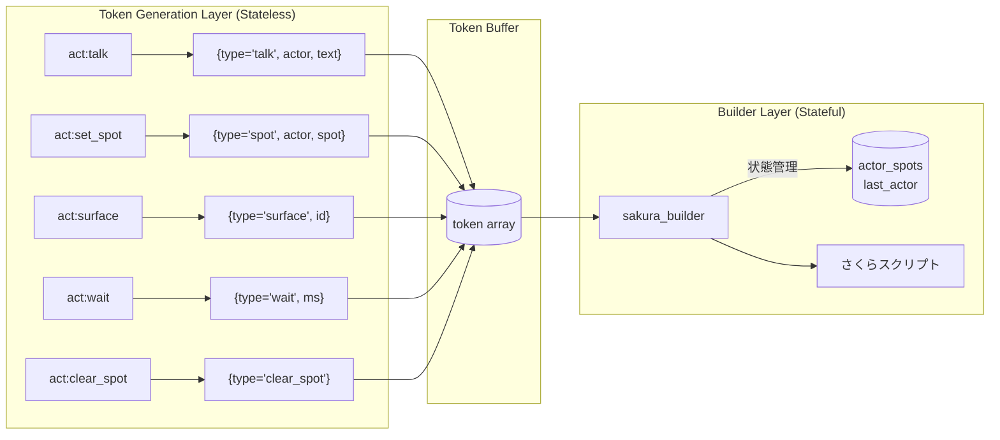
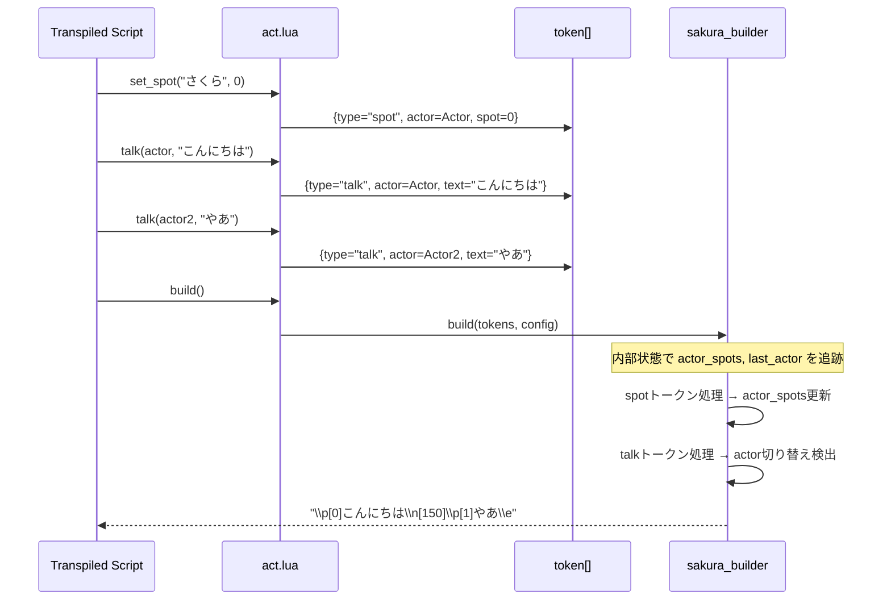
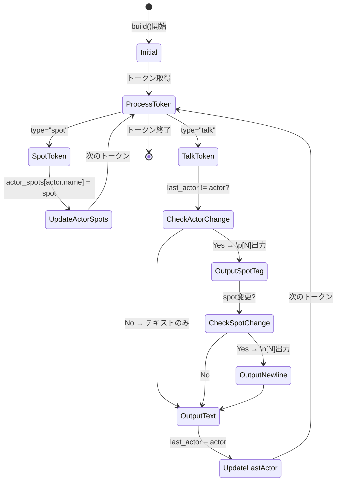
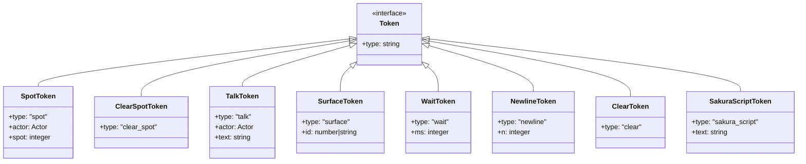

# Design Document: actor-spot-refactoring

## Overview

**Purpose**: トークン生成層（`pasta.act`）と変換層（`sakura_builder`）の責務を明確に分離し、状態管理をビルダー層に集約することで、テスタビリティと保守性を向上させる。

**Users**: pastaエンジン開発者、ゴースト作成者

**Impact**: `act.lua`の状態管理コードを削除し、`sakura_builder.lua`に状態追跡ロジックを追加。トークン構造を刷新し、設定プロパティ名を更新。

### Goals
- トークン生成層（act）を状態レス化し、純粋なトークン生成に専念させる
- ビルダー層（sakura_builder）がactor位置追跡と切り替え検出を担当
- `set_spot()`をトークン化し、token-bufferパターンを完全適用
- 設定プロパティ名を役割に合わせて改名（`spot_switch_newlines` → `spot_newlines`）

### Non-Goals
- spot以外の新規トークンタイプ追加
- actorオブジェクト構造の変更
- 後方互換性のための旧プロパティ名サポート

## Architecture

### Existing Architecture Analysis

**現行パターンと制約**:
```
[act.lua] talk(actor, text)
    ↓ 状態管理 (now_actor, _current_spot)
    ↓ actor切り替え検出
[トークン配列]: actor, spot_switch, talk
    ↓
[sakura_builder] build(tokens, config)
    ↓ 純粋関数変換
[さくらスクリプト文字列]
```

**問題点**:
1. `act:talk()`内で`now_actor`/`_current_spot`状態管理 → 責務混在
2. `set_spot()`がトークン生成せず直接状態変更 → token-bufferパターン違反
3. `spot_switch`トークンがspot情報を持たない → 意味不明瞭

### Architecture Pattern & Boundary Map



**Architecture Integration**:
- **Selected pattern**: 責務分離（Separation of Concerns）
- **Domain boundaries**: 
  - act層: トークン生成のみ（状態なし）
  - builder層: トークン解釈と状態管理
- **Existing patterns preserved**: token-bufferパターン、メソッドチェーン
- **New components rationale**: ビルダー内部状態（actor_spots, last_actor）
- **Steering compliance**: lua-coding.md準拠、MODULE/MODULE_IMPL分離

### Technology Stack

| Layer         | Choice / Version            | Role in Feature       | Notes      |
| ------------- | --------------------------- | --------------------- | ---------- |
| Runtime       | Lua 5.4 (mlua 0.10)         | スクリプト実行        | 既存       |
| Token Layer   | pasta.act                   | トークン生成          | 状態レス化 |
| Builder Layer | pasta.shiori.sakura_builder | トークン変換+状態管理 | 拡張       |

## System Flows

### Token Generation Flow (New)



### Builder State Management Flow



## Requirements Traceability

| Requirement | Summary                               | Components    | Interfaces            | Flows            |
| ----------- | ------------------------------------- | ------------- | --------------------- | ---------------- |
| 1.1         | set_spot()がspotトークン生成          | ACT_IMPL      | set_spot(actor, spot) | Token Generation |
| 1.2         | talk()がtalkトークン生成              | ACT_IMPL      | talk(actor, text)     | Token Generation |
| 1.3         | act層から状態フィールド削除           | ACT           | -                     | -                |
| 1.4         | actor切り替え検出をact層で行わない    | ACT_IMPL.talk | -                     | -                |
| 2.1         | spotトークンでactor位置記録           | BUILDER       | build()               | State Management |
| 2.2         | talkでactor切り替え時スポットタグ出力 | BUILDER       | build()               | State Management |
| 2.3         | spot変更時に段落改行出力              | BUILDER       | build()               | State Management |
| 2.4         | spot_newlines設定使用                 | BUILDER       | BuildConfig           | -                |
| 3.1         | spot_newlinesプロパティ定義           | BuildConfig   | -                     | -                |
| 3.2         | デフォルト値1.5維持                   | BUILDER       | build()               | -                |
| 4.1         | act_test.lua更新                      | Tests         | -                     | -                |
| 4.2         | sakura_builder_test.lua更新           | Tests         | -                     | -                |
| 4.3         | 既存シナリオカバレッジ維持            | Tests         | -                     | -                |
| 5.1         | set_spot()がspotトークン生成          | ACT_IMPL      | set_spot()            | Token Generation |
| 5.2         | set_spot()内で状態管理なし            | ACT_IMPL      | set_spot()            | -                |
| 5.3         | ビルダーでset_spot効果反映            | BUILDER       | build()               | State Management |
| 6.1         | clear_spot()がclear_spotトークン生成  | ACT_IMPL      | clear_spot()          | Token Generation |
| 6.2         | clear_spot()内で状態管理なし          | ACT_IMPL      | clear_spot()          | -                |
| 6.3         | clear_spotでactor_spots状態リセット   | BUILDER       | build()               | State Management |
| 6.4         | clear_spotでlast_actor状態リセット    | BUILDER       | build()               | State Management |

## Components and Interfaces

| Component   | Domain/Layer  | Intent                | Req Coverage                   | Key Dependencies | Contracts |
| ----------- | ------------- | --------------------- | ------------------------------ | ---------------- | --------- |
| ACT_IMPL    | Token Layer   | 状態レストークン生成  | 1.1-1.4, 5.1-5.2, 6.1-6.2      | ACTOR (P0)       | Service   |
| BUILDER     | Builder Layer | トークン変換+状態管理 | 2.1-2.4, 3.1-3.2, 5.3, 6.3-6.4 | -                | Service   |
| BuildConfig | Builder Layer | ビルダー設定          | 2.4, 3.1-3.2                   | -                | State     |

### Token Layer

#### ACT_IMPL

| Field        | Detail                                 |
| ------------ | -------------------------------------- |
| Intent       | 状態を持たず純粋にトークンを生成する   |
| Requirements | 1.1, 1.2, 1.3, 1.4, 5.1, 5.2, 6.1, 6.2 |

**Responsibilities & Constraints**
- トークン配列への追加のみを行う
- `now_actor`, `_current_spot`などの状態フィールドを持たない
- actor切り替え検出を行わない（ビルダーの責務）

**Dependencies**
- Inbound: TranspiledScript — シーン関数からの呼び出し (P0)
- Outbound: token[] — トークン配列への追加 (P0)

**Contracts**: Service [x]

##### Service Interface

```lua
--- @class ACT_IMPL
--- @field token table[] トークン配列

--- spotトークン生成
--- @param self Act アクションオブジェクト
--- @param name string アクター名
--- @param spot integer スポットID
--- @return nil
function ACT_IMPL.set_spot(self, name, spot)
    -- Preconditions: name は登録済みアクター名
    -- Postconditions: token配列に{type="spot", actor=Actor, spot=spot}が追加される
    -- Invariants: self.token以外の状態を変更しない
end

--- talkトークン生成
--- @param self Act アクションオブジェクト
--- @param actor Actor アクターオブジェクト
--- @param text string 発話テキスト
--- @return Act self メソッドチェーン用
function ACT_IMPL.talk(self, actor, text)
    -- Preconditions: actor は有効なActorオブジェクト
    -- Postconditions: token配列に{type="talk", actor=actor, text=text}が追加される
    -- Invariants: 状態変更なし、メソッドチェーン用にselfを返す
end

--- clear_spotトークン生成
--- @param self Act アクションオブジェクト
--- @return nil
function ACT_IMPL.clear_spot(self)
    -- Preconditions: なし
    -- Postconditions: token配列に{type="clear_spot"}が追加される
    -- Invariants: self.token以外の状態を変更しない、actorオブジェクトの状態も変更しない
end
```

**Implementation Notes**
- `set_spot()`: `self.actors[name]`でActorオブジェクトを取得し、`{type="spot", actor=actor, spot=spot}`トークン生成
- `talk()`: 引数のactorをそのまま使用して`{type="talk", actor=actor, text=text}`トークン生成
- `clear_spot()`: `{type="clear_spot"}`トークン生成のみ（actorオブジェクトの状態は変更しない）
- `now_actor`, `_current_spot`フィールドを削除
- `build()`での状態リセット処理も削除
- 既存のactorトークン生成ロジック（`{type="actor"}`）を削除

---

### Builder Layer

#### BUILDER

| Field        | Detail                                                 |
| ------------ | ------------------------------------------------------ |
| Intent       | トークン配列をさくらスクリプトに変換し、状態管理を行う |
| Requirements | 2.1, 2.2, 2.3, 2.4, 3.1, 3.2, 5.3, 6.3, 6.4            |

**Responsibilities & Constraints**
- トークン配列の解釈とさくらスクリプト生成
- actor位置の追跡（`actor_spots`）
- 最後に発言したactorの追跡（`last_actor`）
- actor切り替え時のスポットタグ出力判断
- spot変更時の段落改行出力

**Dependencies**
- Inbound: token[] — actからのトークン配列 (P0)
- Inbound: BuildConfig — 設定オブジェクト (P1)
- Outbound: string — さくらスクリプト文字列 (P0)

**Contracts**: Service [x] / State [x]

##### Service Interface

```lua
--- @class BUILDER

--- トークン配列をさくらスクリプト文字列に変換
--- @param tokens table[] トークン配列
--- @param config BuildConfig|nil 設定
--- @return string さくらスクリプト文字列
function BUILDER.build(tokens, config)
    -- Preconditions: tokensは有効なトークン配列
    -- Postconditions: 全トークンが処理され、\eで終端するさくらスクリプトを返す
    -- Invariants: 入力トークン配列を変更しない
end
```

##### State Management

**State model**:
```lua
-- build()内でのローカル状態
local actor_spots = {}    -- {[actor_name]: spot_id} actor位置マップ
local last_actor = nil    -- 最後に発言したActor
```

**Persistence & consistency**: 
- 状態はbuild()呼び出し内でのみ有効（呼び出しごとにリセット）
- 外部状態を持たない（純粋関数）
- `actor_spots`は毎回空テーブル`{}`から開始
- `last_actor`は毎回`nil`から開始

**Concurrency strategy**: 
- 単一スレッド実行を前提
- 状態はローカル変数のため競合なし

**Implementation Notes**
- spotトークン処理: `actor_spots[token.actor.name] = token.spot`
- clear_spotトークン処理: `actor_spots = {}`, `last_actor = nil`
- talkトークン処理: 
  1. spot解決: `local spot = actor_spots[token.actor.name] or 0` （未設定時は0=さくら）
  2. `last_actor ~= token.actor`なら`\p[spot]`出力
  3. spot変更があれば`\n[N]`出力（Nは`config.spot_newlines * 100`）
  4. テキスト出力
  5. `last_actor = token.actor`
- 既存のactorトークン処理を廃止（talkトークンに統合）
- spot_switchトークン処理を廃止

---

#### BuildConfig

| Field        | Detail                   |
| ------------ | ------------------------ |
| Intent       | ビルダーの動作設定を定義 |
| Requirements | 2.4, 3.1, 3.2            |

##### State Management

**State model**:
```lua
--- @class BuildConfig
--- @field spot_newlines number スポット変更時の改行量（デフォルト1.5）

-- 例
local config = {
    spot_newlines = 1.5  -- \n[150] を出力
}
```

**Persistence & consistency**: 
- 呼び出し側から渡される設定オブジェクト
- デフォルト値: `spot_newlines = 1.5`

## Data Models

### Domain Model

#### Token Types (Updated)



**Entity relationships**:
- Token → Actor: talkトークンとspotトークンはActorオブジェクトを参照
- Actor.name: actor_spotsマップのキーとして使用

**Business rules & invariants**:
- spotトークンのspot値は0以上の整数
- talkトークンのtextは任意の文字列（空文字列可）
- Actorオブジェクトは`name`プロパティを持つ

### Logical Data Model

**Deprecated Token Types**:
- `{type="actor", actor}` — talkトークンに統合
- `{type="spot_switch"}` — 廃止（ビルダー内部で判断）

**New Token Types**:
- `{type="spot", actor, spot}` — set_spot()から生成
- `{type="clear_spot"}` — clear_spot()から生成
- `{type="talk", actor, text}` — talk()から生成（既存構造にactor追加）

**Builder Internal State**:
```lua
-- build()内ローカル変数
local actor_spots = {
    ["さくら"] = 0,
    ["うにゅう"] = 1,
}
local last_actor = nil  -- or Actor object
```

### Migration Notes

**Breaking Changes**:
1. `config.spot_switch_newlines` → `config.spot_newlines`
2. `{type="actor"}` トークン廃止
3. `{type="spot_switch"}` トークン廃止

**Test Migration**:
- 既存テストのトークン期待値を新構造に更新
- 状態管理テストをact_test.luaからsakura_builder_test.luaに移動
