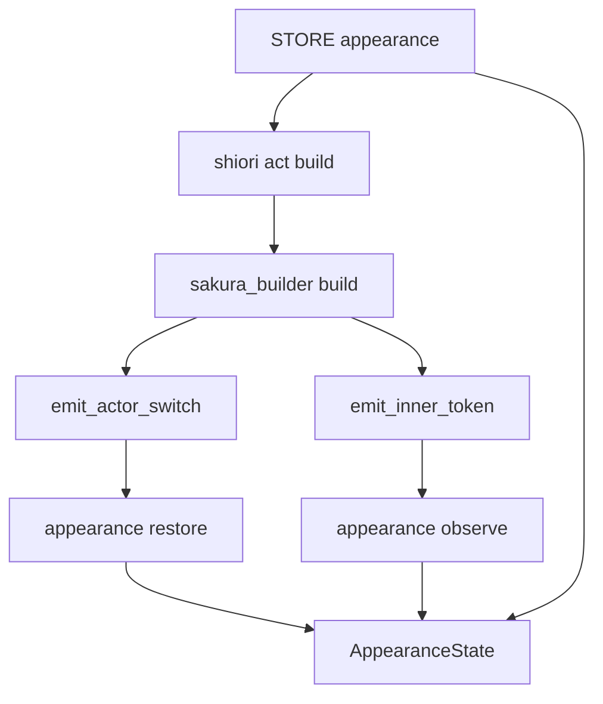
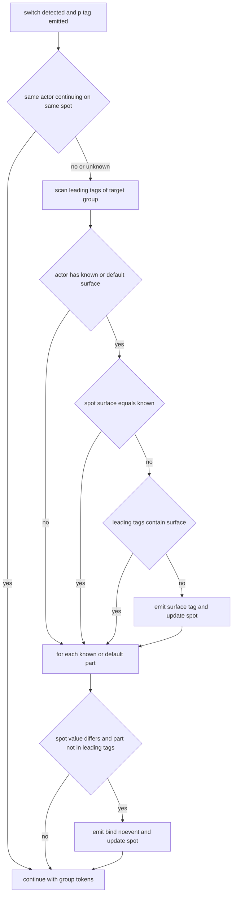

# Design Document: actor-surface-restore

## Overview

**Purpose**: 複数アクターが同一スポット（`\p[N]`）を共有して交代する会話で、切替先アクターが最後に取っていたサーフェス・着せ替え状態をスポットへ再出力（復旧）し、直前アクターの立ち絵が残る不整合を解消する。

**Users**: ゴースト作者。DSL・Lua のトーク記述は変更不要で、同一スポット多アクター会話を書くだけで復旧が働く。任意で `[actor."名前"]` に既定サーフェス／既定着せ替えを宣言できる。

**Impact**: `pasta.shiori.sakura_builder` のアクター切替点（`\p[spot]` 出力直後）に復旧タグ出力を、各トークン出力点に外見状態の観測を追加する。外見状態は `STORE` に常駐する新フィールドへ保持する。専用スポット構成・サーフェス未使用会話の出力は変えない。

### Goals
- アクター別「既知状態」とスポット別「表示中状態」を追跡し、食い違う場合のみ `\p[spot]` 直後に復旧タグを 1 回出力する（1.x, 2.x, 3.x）。
- 状態はセッション常駐・非永続、`clear_spot` では保持、再読込で破棄（4.x）。
- 専用スポット構成・既定未設定の出力をバイト等価に保つ（5.x）。
- サーフェス復旧（ステップ A）と着せ替え復旧（ステップ B）を独立に完結可能な 2 段で導入する。
- `BUILDER.build` の分岐を増やさない（既に複雑度 22・`luacheck: ignore 561`）。

### Non-Goals
- 段落区切り改行 `\n[N]` の判定・位置の変更（sakura-script-newline の領分）。
- `actor_spots` の内容・初期化・永続化の変更（persist-spot-position の領分）。
- スコープ切替タグ以降・生さくらスクリプト内のタグの帰属先スポット追跡（不明化のみ行う）。
- SSP 側だけで起きた状態変化（着せ替えメニュー・シェル変更・起動時既定サーフェス）の検知。
- ベースウェアのバージョン判定による出力切替、descript.txt / surfaces.txt の読み取り。
- カテゴリ単位 bind のうち `,,1`・トグルの確定状態化（`,,0` は確定状態として扱う。3.11）、タグ引数のクォート／エスケープの完全解釈。

## Boundary Commitments

### This Spec Owns
- 外見状態（アクター別既知サーフェス／着せ替え、スポット別表示中サーフェス／適用中着せ替え）のデータ構造とライフサイクル（`STORE.appearance`）。
- 出力文字列からのサーフェス変更・着せ替え指定・スコープ切替タグの検出規則（新モジュール `pasta.shiori.appearance`）。
- アクター切替時の復旧タグ（`\s[ID]`・`\![bind-noevent,...]`）の生成規則と出力位置（`\p[spot]` 直後）。
- アクター設定の任意キー `surface`（既定サーフェス）・`dressup`（既定着せ替え）の意味。

### Out of Boundary
- 段落区切り改行の状態機械（`spot_has_text` / `pending_break`）。本仕様は読まず・書かず・順序も変えない。
- スポット解決（`actor_spots`・スポット0フォールバック・警告ログ）と `\p[spot]` の出力そのもの。
- `talk_to_script`（Rust `@pasta_sakura_script`）のトークナイズ・ウェイト挿入・budoux 改行。
- `pasta/act.lua` のトークン蓄積・グループ化、トランスパイラ（`element_gen.rs`）。
- セーブデータ（`pasta.save`）・`pasta.toml` のパース（Rust 側は任意キーを素通しするため変更不要）。

### Allowed Dependencies
- `pasta.shiori.appearance` → `pasta.buf` のみ（復旧タグの組み立て）。`STORE`・`@pasta_*` を require しない（純関数＋引数で受けた状態テーブルの変更のみ）。
- `pasta.shiori.sakura_builder` → `pasta.shiori.appearance`（新規依存）。
- `pasta.shiori.act` → `STORE.appearance` を `BUILDER.build` へ渡す（`STORE.actor_spots` と同じ直接変更方式）。
- `pasta.store` は従来どおり他モジュールを require しない（プレーンテーブルのフィールド追加のみ）。
- 依存方向: `store` ← `shiori.act` → `sakura_builder` → `appearance`。逆方向の参照は禁止。

### Revalidation Triggers
- `BUILDER.build` のシグネチャ（第4引数 `appearance`）または `STORE.appearance` の形の変更。
- `emit_actor_switch` 以外で `\p[spot]` を出力する経路の追加（復旧の挿入点が単一でなくなる）。
- グループ化トークンの種別追加、または `talk` / `sakura_script` / `raw_script` の意味変更（観測対象の再確認が必要）。
- sakura-script-newline の has-text 判定が「非空 talk」以外を参照するようになる変更。
- アクター設定キー `surface` / `dressup` の改名・型変更（マニュアル・既存ゴーストに影響）。

## Architecture

### Existing Architecture Analysis
- 出力パイプライン: `act.lua`（蓄積・グループ化）→ `shiori/act.lua` `SHIORI_ACT_IMPL.build` → `sakura_builder.lua` `BUILDER.build`。`\p[spot]` の出力点は `emit_actor_switch` の 1 箇所、トークン→文字列変換は `emit_inner_token` と、トップレベル `raw_script` の 1 行。
- サーフェス変更の大半はテキスト内タグとして流れる（`ぱすた：＠通常　こんにちは` → talk テキスト `\s[0]こんにちは`）。構造化 `surface` トークンは Lua 明示呼び出し時のみ。**文字列走査が必須**。
- `talk_to_script` はタグを改変しない（ウェイト・改行タグを挿入するのみ）。したがって出力後文字列と入力テキストでタグ検出結果は一致する。
- `STORE.actor_spots` は `BUILDER.build` に直接変更方式で渡され、ビルドを跨いで常駐、VM 再生成（再読込）で破棄される。同じ方式で外見状態を保持できる。
- `STORE.actors[name]` は `CONFIG.actor[name]` テーブルそのもの。アクター設定の任意キーは `actor.surface` / `actor.dressup` として追加コードなしで読める（`spot`・`budoux`・`script_wait_*` と同じフラット配置）。
- `crates/pasta_shiori/tests/support/scripts/pasta/store.lua` は検索パス上位（`scripts/` > `profile/pasta/pasta_scripts/`）のため本番 `store.lua` を覆う旧コピーである。`STORE.appearance` が nil の環境が実在するため、ビルダーは nil を許容する。

### Architecture Pattern & Boundary Map



**Architecture Integration**:
- Selected pattern: ハイブリッド（ギャップ分析 Option C）。検出・差分計算は新モジュールの純ロジック、状態は `STORE` 常駐、ビルダーは既存 2 関数への最小フック。
- Domain/feature boundaries: 改行状態機械（ビルドローカル）と外見状態（セッション常駐）は互いを参照しない。復旧タグは `buffer:put` で直接出力し talk 経路を通らないため has-text・pending に影響しない（2.5, 3.6）。
- Existing patterns preserved: `actor_spots` の直接変更方式、`store.lua` の無依存ポリシー、`config.buffer_factory`、単一の `\p` 出力点。
- New components rationale: `appearance.lua` のみ新設。タグ走査と差分計算を単体テスト可能にし、ビルダーの複雑度を増やさないため。
- Steering compliance: さくらスクリプト描画は pasta_lua の Lua 層に集約（tech.md）。Rust 側変更なし。

### Technology Stack

| Layer | Choice / Version | Role in Feature | Notes |
|-------|------------------|-----------------|-------|
| Backend / Services | Lua（LuaJIT 2.1 / mlua 0.11） | 走査・状態更新・復旧タグ生成 | Lua パターンのみ使用。新規依存なし |
| Data / Storage | `STORE.appearance`（メモリ常駐） | 外見状態の保持 | ディスク永続化なし |
| Infrastructure / Runtime | SSP 2.8.23 以上 | `\![bind-noevent,...]` の解釈 | 着せ替え復旧のみの動作要件。未満では復旧が効かないことを許容（3.7） |

## File Structure Plan

### Directory Structure
```
crates/pasta_lua/pasta_scripts/pasta/
├── store.lua                    # 変更: STORE.appearance フィールドと reset() の初期化
└── shiori/
    ├── appearance.lua           # 新規: 外見状態の走査・観測・復旧（本仕様の中核）
    ├── sakura_builder.lua       # 変更: emit_actor_switch / emit_inner_token のフック、build 第4引数
    └── act.lua                  # 変更: BUILDER.build へ STORE.appearance を渡す 1 引数
crates/pasta_lua/tests/lua_specs/
├── appearance_test.lua          # 新規: 走査・観測・復旧の単体テスト
└── sakura_builder_test.lua      # 変更: 特性化テスト＋復旧の統合ケース追加
book/src/getting-started/first-ghost.md   # 変更: [actor] 任意キー surface / dressup と SSP 2.8.23 要件の記載
```

### Modified Files
- `crates/pasta_lua/pasta_scripts/pasta/store.lua` — `STORE.appearance = { actors = {}, spots = {}, owners = {}, last_spots = {} }` を追加し、`STORE.reset()` で同形へ初期化（4.1, 4.2）。
- `crates/pasta_lua/pasta_scripts/pasta/shiori/sakura_builder.lua` — (1) `emit_inner_token` の変換部を「文字列を返す」形へ振る舞い不変で整理し、出力後に `APPEARANCE.observe` を呼ぶ。(2) `emit_actor_switch` が `\p[spot]` 直後に `APPEARANCE.restore` の結果を出力。(3) トップレベル `raw_script` 出力後に `APPEARANCE.observe`。(4) `BUILDER.build` に第4引数 `appearance` を追加。`BUILDER.build` 本体のループに分岐を追加しない（引数の受け渡しのみ）。
- `crates/pasta_lua/pasta_scripts/pasta/shiori/act.lua` — `BUILDER.build(token, cfg, STORE.actor_spots, STORE.appearance)`。
- `crates/pasta_lua/tests/lua_specs/sakura_builder_test.lua` — 既存ケースのうちスポット0フォールバック共有で復旧が入るものは期待値を更新（5.6 による意図した変化）。
- `crates/pasta_lua/tests/lua_specs/init.lua` — テスト一覧へ `appearance_test` を登録（一覧方式のため必須）。
- `crates/pasta_shiori/tests/support/scripts/pasta/store.lua` — **変更しない**（nil 許容で吸収）。

## System Flows

アクター切替時の復旧判定（`emit_actor_switch` 内、`\p[spot]` 出力直後）:



- 出力順は `\p[spot]` → サーフェス復旧 → 着せ替え復旧 →（保留中の段落区切り改行は次の非空 talk 直前に従来どおり出力）→ 発話内容。2.6 の期待列 `\p[0]\s[0]\n[150]A2` はこの順序から自然に成立する。
- 「不明」は nil で表現し、nil は任意の既知値と不一致として扱う（4.4）。
- 「先頭タグ列」= 切替先グループのトークンを先頭から辿り、最初の一般文字（タグでない文字）・スコープ切替タグ・`raw_script` トークンのいずれかに達するまでの範囲。そこに含まれるサーフェス変更／明示 bind だけが復旧抑止の対象となる（2.4, 2.10, 3.10）。トグル・カテゴリ単位 bind は抑止の対象外で、復旧タグの後に作者の指定がそのまま効き、当該カテゴリは観測時に不明化される（設計ディスカッション #3）。

## Requirements Traceability

| Requirement | Summary | Components | Interfaces | Flows |
|-------------|---------|------------|------------|-------|
| 1.1 | 構造化 surface の記録 | Appearance, SakuraBuilder hook | `observe` | — |
| 1.2 | テキスト内 `\s[ID]`・`\sN` の記録 | Appearance | `observe`（タグ認識表） | — |
| 1.3 | 最後のサーフェス変更を採用 | Appearance | `observe`（出現順に上書き） | — |
| 1.4 | スポット表示中サーフェスの更新 | Appearance | `observe` | — |
| 1.5 | ID を解釈・正規化しない | Appearance | 文字列として保持・`\s[ID]` で再出力 | — |
| 1.6 | 記録元の出力文字列不変 | SakuraBuilder hook | `observe` は読み取りのみ | — |
| 1.7 | スコープ切替タグ以降は記録せず全スポット不明化 | Appearance | `observe` | — |
| 1.8 | 生スクリプトのタグで全スポット不明化 | Appearance, SakuraBuilder hook | `observe`（actor = nil） | — |
| 1.9 | 1.7・1.8 で出力文字列不変 | SakuraBuilder hook | `observe` は読み取りのみ | — |
| 2.1 | 不一致時に `\p` 直後へ `\s[ID]` | Appearance, SakuraBuilder hook | `restore` | 復旧判定 |
| 2.2 | 一致時は出力なし | Appearance | `restore` | 復旧判定 |
| 2.3 | 既知なしは出力なし・状態不変 | Appearance | `restore` | 復旧判定 |
| 2.4 | 先頭タグ列にサーフェス変更があれば抑止 | Appearance | `restore`（先頭タグ列走査） | 復旧判定 |
| 2.5 | 改行判定に影響しない | SakuraBuilder hook | `buffer:put` 直接出力 | — |
| 2.6 | A→B→A の同一ビルド列 | Appearance, SakuraBuilder hook | `observe` / `restore` | 復旧判定 |
| 2.7 | ビルド跨ぎの復旧 | StoreAppearance, ShioriAct | `STORE.appearance` 受け渡し | — |
| 2.8 | 既定サーフェスによるフォールバック | Appearance | `restore`（`actor.surface`） | 復旧判定 |
| 2.9 | 既定サーフェス未設定なら無出力 | Appearance | `restore` | 復旧判定 |
| 2.10 | 一般文字列より後のみのサーフェス変更 | Appearance | `restore` → `observe` | 復旧判定 |
| 2.11 | 同一アクターの継続なら復旧しない | Appearance | `restore`（`owners`・`last_spots`） | 復旧判定 |
| 3.1 | 明示 bind の記録 | Appearance | `observe` | — |
| 3.2 | 差分パーツのみ bind 再出力 | Appearance | `restore` | 復旧判定 |
| 3.3 | 全一致なら出力なし | Appearance | `restore` | 復旧判定 |
| 3.4 | トグル・カテゴリ単位着衣はカテゴリ不明化 | Appearance | `observe` | — |
| 3.5 | 未記録・既定なしパーツは触らない | Appearance | `restore`（アクター側の集合のみ走査） | — |
| 3.6 | 改行判定に影響しない | SakuraBuilder hook | `buffer:put` 直接出力 | — |
| 3.7 | `bind-noevent` 形式・SSP 2.8.23 以上 | Appearance, マニュアル | `restore` の出力形式 | — |
| 3.8 | 既定着せ替えのフォールバック | Appearance | `restore`（`actor.dressup`） | 復旧判定 |
| 3.9 | 既定着せ替え未設定なら無出力 | Appearance | `restore` | 復旧判定 |
| 3.10 | 先頭タグ列の明示 bind パーツのみ抑止（トグル・カテゴリ単位は抑止しない） | Appearance | `restore`（先頭タグ列走査） | 復旧判定 |
| 3.11 | カテゴリ全脱衣 `,,0` を確定状態として記録・復旧 | Appearance | `observe` / `restore`（パーツ名 `""`） | 復旧判定 |
| 4.1 | セッション内ビルド跨ぎ保持 | StoreAppearance | `STORE.appearance` | — |
| 4.2 | 再読込・全リセットで破棄 | StoreAppearance | `STORE.reset()`・VM 再生成 | — |
| 4.3 | ディスク非永続 | StoreAppearance | `pasta.save` に置かない | — |
| 4.4 | 不明は不一致扱い | Appearance | nil 比較 | 復旧判定 |
| 4.5 | `clear_spot` で保持 | SakuraBuilder | `clear_spot` 分岐を変更しない | — |
| 5.1 | 専用スポット・既定未設定はバイト等価 | Appearance, 特性化テスト | 不変条件（後述） | — |
| 5.2 | 同一アクター連続発話は無出力 | SakuraBuilder hook, Appearance | `restore` は切替検出時のみ呼ばれる。ビルド跨ぎの継続は `owners`・`last_spots` で無出力 | — |
| 5.3 | サーフェス・bind なし会話はバイト等価 | Appearance | 既知なし→無出力 | — |
| 5.4 | スポット解決・`\p`・改行・`\e` 不変 | SakuraBuilder | 既存処理を変更しない | — |
| 5.5 | スポット移動に追従 | Appearance | `restore`（解決後スポットで比較） | 復旧判定 |
| 5.6 | スポット0フォールバック共有も対象 | Appearance | `restore`（解決後スポットで比較） | 復旧判定 |

## Components and Interfaces

| Component | Domain/Layer | Intent | Req Coverage | Key Dependencies (P0/P1) | Contracts |
|-----------|--------------|--------|--------------|--------------------------|-----------|
| Appearance | pasta.shiori（新規 `appearance.lua`） | タグ走査・状態観測・復旧タグ生成 | 1.1–1.5, 1.7, 1.8, 2.1–2.4, 2.6, 2.8–2.11, 3.1–3.5, 3.7–3.11, 4.4, 5.1, 5.3, 5.5, 5.6 | pasta.buf (P1) | Service, State |
| SakuraBuilder hook | pasta.shiori（既存 `sakura_builder.lua`） | 切替点と出力点から Appearance を呼ぶ | 1.1, 1.6, 1.8, 1.9, 2.5, 3.6, 4.5, 5.2, 5.4 | Appearance (P0) | Service |
| StoreAppearance | pasta（既存 `store.lua`） | 外見状態のセッション常駐 | 2.7, 4.1, 4.2, 4.3 | なし | State |
| ShioriAct | pasta.shiori（既存 `act.lua`） | `STORE.appearance` をビルダーへ渡す | 2.7 | StoreAppearance (P0), SakuraBuilder (P0) | — |

### pasta.shiori

#### Appearance

| Field | Detail |
|-------|--------|
| Intent | 出力文字列から外見タグを検出して状態へ反映し、切替時に復旧タグ文字列を返す |
| Requirements | 1.1, 1.2, 1.3, 1.4, 1.5, 1.7, 1.8, 2.1, 2.2, 2.3, 2.4, 2.6, 2.8, 2.9, 2.10, 2.11, 3.1, 3.2, 3.3, 3.4, 3.5, 3.7, 3.8, 3.9, 3.10, 3.11, 4.4, 5.1, 5.3, 5.5, 5.6 |

**Responsibilities & Constraints**
- 状態テーブルは引数で受け取り、その場で変更する。モジュール自身は状態を保持しない（`STORE` を require しない）。
- 出力文字列を変更しない（読み取りのみ）。復旧タグは戻り値の文字列としてのみ返す。
- サーフェス ID は `tostring` した文字列で保持・比較し、解釈・正規化しない。再出力は常に `\s[ID]` 形式（1.5）。
- バックスラッシュを含まない文字列は即リターンする（走査コストを通常テキストに課さない）。

**Dependencies**
- Inbound: SakuraBuilder hook — `observe` / `restore` 呼び出し (P0)
- Outbound: pasta.buf — 復旧タグ連結 (P1)
- External: SSP 2.8.23 以上 — `bind-noevent` の解釈 (P1)

**Contracts**: Service [x] / API [ ] / Event [ ] / Batch [ ] / State [x]

##### Service Interface
```lua
--- @class AppearanceEntry
--- @field surface string|nil                                 -- nil = 不明／なし
--- @field binds table<string, table<string, integer>>        -- カテゴリ名 → パーツ名 → 0|1。パーツ名 "" = そのカテゴリの残り全パーツ（`,,0` 由来で値は 0 のみ）

--- @class AppearanceState
--- @field actors table<string, AppearanceEntry>              -- アクター名 → 既知状態
--- @field spots  table<integer, AppearanceEntry>             -- スポットID → 表示中状態
--- @field owners table<integer, string>                      -- スポットID → 直前発話アクター名（不明化では消さない）
--- @field last_spots table<string, integer>                 -- アクター名 → 前回発話したスポットID（不明化では消さない）

--- 空の状態を生成する（STORE.appearance が無い環境のビルドローカル代替）
--- @return AppearanceState
function APPEARANCE.new() end

--- 出力済み文字列を観測して状態へ反映する。text は変更しない。
--- @param state AppearanceState
--- @param actor table|nil   発話アクター。nil は「アクター未指定の生さくらスクリプト」
--- @param spot integer|nil  発話アクターの解決済みスポット（actor が nil のとき不使用）
--- @param text string       出力した文字列
function APPEARANCE.observe(state, actor, spot, text) end

--- アクター切替時の復旧タグ列を返し、スポットの表示中状態を更新する。
--- @param state AppearanceState
--- @param actor table       切替先アクター（name / surface / dressup を参照）
--- @param spot integer      解決済みスポットID
--- @param tokens table[]    切替先グループの内側トークン列（先頭タグ列の走査用・読み取りのみ）
--- @return string           復旧タグ列（復旧不要なら空文字列）
function APPEARANCE.restore(state, actor, spot, tokens) end
```

- Preconditions: `state` は `actors`・`spots` を持つテーブル。`restore` は `\p[spot]` 出力直後・グループ内トークン出力前に 1 回だけ呼ばれる。
- Postconditions（`observe`・actor 非 nil）:
  - サーフェス変更ごとに `actors[name].surface` と `spots[spot].surface` を同値へ更新（出現順に上書き＝最後が残る）。
  - 明示 bind（カテゴリ・パーツ・数値 0/1 がすべて明示）ごとに `actors[name].binds[cat][part]` と `spots[spot].binds[cat][part]` を更新。
  - カテゴリ全脱衣（パーツ名空・数値 `0`）: `spots[spot].binds[cat]` と発話アクターの `binds[cat]` を `{ [""] = 0 }` に置き換える（3.11）。
  - トグル（数値省略・空）またはカテゴリ単位着衣・トグル（パーツ名空・数値 `0` 以外）の bind: `spots[spot].binds[cat]` と**発話アクター**の `binds[cat]` を nil にする（3.4）。他アクターの `binds[cat]` は変更しない（設計ディスカッション #4）。
  - スコープ切替タグ: `state.spots` を空にし（全スポット不明）、その文字列の残りは記録しない（1.7）。
  - `actor.name` が nil の場合はアクター側を記録せずスポット側のみ更新する。
- Postconditions（`observe`・actor が nil）: サーフェス変更・bind・スコープ切替タグのいずれかを 1 つでも含めば `state.spots` を空にする。`state.actors` は変更しない（1.8）。
- Postconditions（`restore`）:
  - 最初に `owners[spot]` と `last_spots[name]` を読み、`owners[spot] = name`・`last_spots[name] = spot` へ更新する。読んだ値が `owners[spot] == name` かつ `last_spots[name] == spot`（同一アクターの継続）なら、状態を変えず空文字列を返す（2.11。不明状態でも復旧しない）。どちらかが不成立（別アクターとの交代、または別スポットから戻ってきた）なら以降の比較へ進む（5.5）。
  - 既知サーフェス = `actors[name].surface`、無ければ `actor.surface`（既定、`tostring`）。既知があり `spots[spot].surface` と不一致で、先頭タグ列にサーフェス変更が無いとき `\s[既知]` を返し `spots[spot].surface` を更新。
  - カテゴリ全脱衣の復旧（3.11）: アクター側 `binds[cat][""] == 0` かつスポット側 `binds[cat][""] ~= 0`（nil 含む）なら、そのカテゴリのパーツ単位復旧より前に `\![bind-noevent,cat,,0]` を返し、スポット側を `{ [""] = 0 }` に置き換える。アクター側が `""` を持つカテゴリでは既定着せ替えを使わない（全脱衣が既定より新しいため）。
  - パーツの実効値 = `t[part]`、無ければ `t[""]`（スポット・アクター共通）。
  - 既知着せ替え = `actor.dressup`（既定）を `actors[name].binds` で上書きした集合。各パーツについて `spots[spot].binds[cat][part]` と不一致で、先頭タグ列に同一（カテゴリ, パーツ）の明示 bind が無いとき `\![bind-noevent,cat,part,値]` を返し、スポット側を更新。
  - 着せ替え復旧タグの出力順はカテゴリ名→パーツ名のバイト昇順（出力の決定性）。サーフェス復旧が先、着せ替え復旧が後（3.2）。
  - スポット側にのみ存在するパーツは走査しない（自動解除しない。3.5）。
- Invariants:
  - 既定未設定のアクターが他と共有しない専用スポットで発話する限り、`restore` は空文字列を返す（5.1）。初回は既知なし、2 回目以降は `owners[spot]`・`last_spots[name]` がともに自分自身・同じスポットのため、不明化（1.7・1.8）の有無に依らない。
  - `owners`・`last_spots` はスコープ切替・生スクリプトによる不明化（`state.spots = {}`）では変更しない。`STORE.reset()`・VM 再生成でのみ消える。
  - サーフェス変更・bind を一度も出力せず既定も無いアクターは既知状態を持たず、`restore` は常に空文字列（5.3, 2.3, 2.9, 3.9）。

##### タグ認識規則

走査は文字列の先頭から `\` を順に辿る。`\\`（エスケープされたバックスラッシュ）は 2 文字読み飛ばす。タグ境界は Rust トークナイザ（`SAKURA_TAG_PATTERN`）と同じく「`\` ＋ 英数記号の名前 ＋ 任意の `[...]`」とし、名前の先頭で分類する。

| 形式 | 分類 | 備考 |
|------|------|------|
| `\s[ID]` | サーフェス変更（ID = 角括弧内の文字列そのまま） | 数値・エイリアス・`-1` を区別しない |
| `\s0`〜`\s9` | サーフェス変更（ID = 数字 1 文字） | |
| `\![bind,C,P,V]` / `\![bind-noevent,C,P,V]` | V が `0`/`1` かつ C・P 非空 → 明示 bind。P 空かつ V = `0` → カテゴリ全脱衣（3.11）。V 省略・空、または P 空かつ V ≠ `0` → 不確定 bind（カテゴリ C） | 作者が書いた `bind-noevent` も同じく記録 |
| `\0` `\1` `\h` `\u` `\p[N]` `\p0`〜`\p9` | スコープ切替 | |
| 上記以外のタグ | 無視（`[...]` ごと読み飛ばす） | `\_w[..]` `\n` `\![set,...]` 等 |

- bind 引数は `,` 区切りの単純分割で解釈する。**確定（設計ディスカッション #6）**: 引数に `"`・`\` を含む bind は解釈不能として、発話アクターの解決済みスポットの `binds` を空テーブルにする（全カテゴリ不明）。アクター既知状態・他スポットは変更しない。アクター未指定の生スクリプト中なら 1.8 どおり全スポット不明化。
- 他タグの引数内に入れ子で現れるタグ（例 `\![raise,OnX,\s[0]]`）は、外側タグの `[...]` を読み飛ばすため検出しない。

##### State Management
- State model: `AppearanceState`（上記）。不明＝nil。スポット全不明化は `state.spots = {}`（`owners`・`last_spots` は保持）、カテゴリ不明化は `binds[cat] = nil`。
- Persistence & consistency: メモリのみ。`state` テーブル自体の同一性は保ち、内部フィールドを差し替える（`STORE.appearance` の参照が切れない）。
- Concurrency strategy: 単一 Lua VM・単一スレッド（アクタースレッドに pin）。排他不要。

**Implementation Notes**
- Integration: ステップ A ではサーフェス変更・スコープ切替・（raw 判定用に）bind の存在検出までを実装し、`binds` の記録と復旧はステップ B で同じ 2 関数に追加する。A 単独で 1.x（bind 記録を除く）・2.x・4.x・5.x が完結する。
- Validation: `appearance_test.lua` で `observe` / `restore` を状態テーブル直渡しで検証（`@pasta_*` 不要）。
- Risks: タグ認識の誤検出（`\\s` の除外、入れ子タグ）。既定キー名や bind のパーツ名は検証せずそのまま出力するため、`,` `]` `"` `\` を含む名前は非対応（マニュアルに明記）。

#### SakuraBuilder hook

| Field | Detail |
|-------|--------|
| Intent | 切替点で `restore`、出力点で `observe` を呼ぶ最小フック |
| Requirements | 1.1, 1.6, 1.8, 1.9, 2.5, 3.6, 4.5, 5.2, 5.4 |

**Responsibilities & Constraints**
- `emit_actor_switch(buffer, actor_spots, actor, appearance, tokens)`: 既存のスポット解決と `\p[spot]` 出力の直後に `buffer:put(APPEARANCE.restore(appearance, actor, spot, tokens))` を行う。スポット解決・警告ログ・戻り値は不変（5.4）。
- `emit_inner_token(buffer, actor, inner, appearance, spot)`: 既存の変換結果を 1 つの文字列として得て `buffer:put` し、続けて `APPEARANCE.observe` を呼ぶ。`inner.type == "raw_script"` のときは actor に nil を渡す（1.8）。変換結果の文字列は現行と同一（1.6, 1.9）。構造化 `surface` トークンも `\s[ID]` 文字列として同じ経路で観測される（1.1）。
- トップレベル `raw_script`: `buffer:put(token.text)` の後に `APPEARANCE.observe(appearance, nil, nil, token.text)`。
- `BUILDER.build(grouped_tokens, config, input_actor_spots, appearance)`: `appearance` が nil なら `APPEARANCE.new()` をビルドローカルに使う（同一ビルド内の交代は復旧される。ビルド跨ぎは保持されない）。ループ内の分岐・改行状態機械・`clear_spot` 分岐・`\e` 付与は変更しない（4.5, 5.4）。`restore` は切替検出時のみ呼ばれる（5.2）。
- 復旧タグは `emit_inner_token` を経由しないため、非空 talk 判定（has-text）と `pending_break` に影響しない（2.5, 3.6）。

**Dependencies**
- Inbound: ShioriAct — `BUILDER.build` 呼び出し (P0)
- Outbound: Appearance — `observe` / `restore` (P0)

**Contracts**: Service [x] / API [ ] / Event [ ] / Batch [ ] / State [ ]

##### Service Interface
```lua
--- @param grouped_tokens table[]
--- @param config BuildConfig|nil
--- @param input_actor_spots table<string, integer>|nil  直接変更される
--- @param appearance AppearanceState|nil                直接変更される（nil はビルドローカル）
--- @return string さくらスクリプト文字列（\e 終端）
function BUILDER.build(grouped_tokens, config, input_actor_spots, appearance) end
```
- Preconditions: 既存と同じ。第4引数は省略可（既存呼び出し・既存テストは無変更で動く）。
- Postconditions: 復旧タグと状態更新を除き、出力は現行と同一。
- Invariants: `\p[spot]` の出力点は `emit_actor_switch` のみ。

**Implementation Notes**
- Integration: `emit_inner_token` の「文字列を返す形への整理」は振る舞い不変リファクタとして特性化テスト後に単独コミットで行い、フック追加と分ける。
- Validation: `luacheck` で `BUILDER.build` の複雑度が増えていないこと（`ignore 561` の対象拡大なし）を確認。
- Risks: 引数追加に伴う 3 箇所の `emit_inner_token` 呼び出しの渡し漏れ（テストで検出）。

### pasta

#### StoreAppearance

| Field | Detail |
|-------|--------|
| Intent | 外見状態をセッション常駐させる `STORE` フィールド |
| Requirements | 2.7, 4.1, 4.2, 4.3 |

**Contracts**: State [x]

##### State Management
- State model: `STORE.appearance = { actors = {}, spots = {}, owners = {}, last_spots = {} }`（プレーンテーブル。`store.lua` は他モジュールを require しない方針を維持）。
- Persistence & consistency: メモリ常駐のみ。`STORE.reset()` で同形の空テーブルへ再初期化。ゴースト再読込は Lua VM 再生成により破棄（4.2）。`pasta.save`・`@pasta_persistence` には置かない（4.3）。`CONFIG.actor` からの初期転送は行わない（既定値は `restore` が `actor.surface` / `actor.dressup` を都度参照する）。

#### ShioriAct
`SHIORI_ACT_IMPL.build` が `BUILDER.build` の第4引数に `STORE.appearance` を渡す 1 行の変更のみ（2.7）。新しい境界は導入しない。

## Data Models

### Domain Model
- **アクター既知状態**（キー: アクター名）: そのアクターの発話で最後に出力されたサーフェス ID と、明示 bind の（カテゴリ, パーツ）→ 0/1。
- **スポット表示中状態**（キー: スポット ID）: pasta が把握する限りで、そのスポットへ最後に出力されたサーフェス ID と bind 状態。
- **不変条件**: 状態は pasta 自身の出力のみから導出する。帰属を確定できない出力（スコープ切替後・生スクリプト・不確定 bind）は「不明」へ倒す。

### Data Contracts & Integration

アクター設定（`pasta.toml`）の任意キー。いずれも未設定時は一切の出力に影響しない（2.9, 3.9）。

| キー | 型 | 意味 | 例 |
|------|----|------|----|
| `surface` | 整数 または 文字列 | 既定サーフェス ID。既知サーフェスが無いときのフォールバック（2.8） | `surface = 0` |
| `dressup` | テーブル（カテゴリ名 → { パーツ名 → 0 または 1 }） | 既定着せ替え。未記録パーツのフォールバック（3.8） | 下記 |

```toml
[actor."女の子"]
spot = 0
surface = 0

[actor."女の子".dressup."帽子"]
"リボン" = 1
"麦わら" = 0
```

- **確定（設計ディスカッション #2）**: キー名は `surface` / `dressup`。`dressup` の入れ子順（カテゴリ→パーツ→0/1）は bind タグの引数順に揃える。
- 既知の副作用: 既存の `spot` と同様、これらのキーはアクター単語検索からも見えるため、トーク中の `＠surface` は値に解決される。マニュアルに注記する。
- キー名は既存の `spot`・`budoux` と同じくアクターテーブル直下のフラット配置とする。Rust 側は TOML を Lua テーブルへ素通しするため変更不要。
- **仮定**: 不確定 bind（3.4）でアクターのカテゴリ既知状態が不明化された後は、そのカテゴリの既定着せ替えが再び有効になる（「一度も記録していない」と同じ扱い。OQ-6）。

## Error Handling

### Error Strategy
- 本機能はエラーを送出しない。解釈できない入力は「不明」へ倒して出力は変えない（Graceful Degradation）。
- `appearance` 引数が nil → ビルドローカル状態で継続（テスト用旧 `store.lua` 環境）。
- `actor.name` が nil → アクター側の記録・復旧をスキップ。
- `actor.surface` / `actor.dressup` の型が想定外（`dressup` が非テーブル、値が 0/1 以外）→ 当該項目を無視する。
- SSP 2.8.23 未満 → `bind-noevent` が解釈されず着せ替え復旧が効かない。検出・フォールバックは行わない（3.7）。

### Monitoring
- 新規ログは追加しない（復旧は通常動作であり、トークごとに出るログはノイズとなる）。出力されたさくらスクリプトは既存のレスポンスログで観測できる。

## Testing Strategy

実装順序: ①特性化 → ②ステップ A（サーフェス）→ ③ステップ B（着せ替え）。各ステップは独立にテストがグリーンで完結する。

### Unit Tests（`appearance_test.lua`）
- `observe`: `\s[5]`・`\s3`・エイリアス・`-1` をそのまま記録し、複数あるとき最後を採用する。`\\s[5]` は記録しない（1.2, 1.3, 1.5）。
- `observe`: スコープ切替タグ（`\1` `\p[2]` 等）で全スポット不明化し、以降の `\s` をアクターへ記録しない（1.7）。
- `observe`（actor = nil）: サーフェス・bind・スコープ切替を含む生スクリプトで全スポット不明化、アクター状態不変。タグを含まない生スクリプト（`\![set,property,...]`）では不明化しない（1.8）。
- `observe`: 明示 bind の記録、`,,0` でスポットと発話アクターの当該カテゴリが `{ [""] = 0 }` になり後続の明示パーツがその上に記録される（3.11）。トグル／`,,1` でスポットと発話アクターの当該カテゴリが不明化され、他アクターの既知状態は残り、後続の明示 bind で再記録される（3.1, 3.4）。
- `restore`: 同一アクターの継続なら、スポット不明でも空文字列（2.11）。`owners`・`last_spots` は不明化で消えない。
- `restore`: A がスポット0（`\s[0]`）→スポット1（`\s[5]`）→スポット0と戻ったとき、スポット0で `\s[5]` を返す（継続に当たらない。5.5）。
- `restore`: 一致→空文字列、不明／不一致→`\s[ID]`、既知なし→空文字列、既定サーフェスのフォールバック、先頭タグ列にサーフェス変更があれば抑止・一般文字列より後なら抑止しない（2.1–2.4, 2.8–2.10, 4.4）。
- `restore`: 差分パーツのみ `bind-noevent` をカテゴリ→パーツ昇順で出力、スポット側のみのパーツに触れない、既定着せ替え、先頭タグ列の明示 bind パーツのみ抑止し、先頭タグ列のトグル・カテゴリ単位 bind では抑止しない（3.2, 3.3, 3.5, 3.7–3.10）。
- `observe`: 引数に `"` を含む bind で、発話スポットの `binds` のみ空になり、他スポットと発話アクターの既知状態は変わらない（設計ディスカッション #6）。
- `restore`: 全脱衣したアクターが戻ると、パーツ単位より先に `\![bind-noevent,cat,,0]` を返す。スポットが既に全脱衣なら返さない（3.11）。

### Integration Tests（`sakura_builder_test.lua`）
- 2.6 の列: A(`\s[0]A1`)→B(`\s[10]B1`)→A(`A2`) を同一スポットでビルドし `\p[0]\s[0]A1\p[0]\n[150]\s[10]B1\p[0]\s[0]\n[150]A2\e` と等価な順序を検証（ウェイトタグは既存テストと同じ方式で除外）。
- 2.7 ビルド跨ぎ: 同一 `appearance` を 2 回の `BUILDER.build` に渡し、後続ビルドの `\p[0]` 直後に `\s[10]` が出る。`shiori_act` 経由で `STORE.appearance` が更新される。
- 5.1 / 2.11: 専用スポットのアクターが `\s[0]…\1\s[10]…\0\s[5]…` を発話した次のビルドで、`\p[0]` 直後に `\s[0]` が出ない（巻き戻り防止）。
- 5.1 / 5.3 特性化: 専用スポット（`actor_spots` 明示）・既定未設定の複数ビルド、およびサーフェスなし会話で、復旧タグが出ず現行出力と一致する（フック追加前に固定）。
- 5.5 / 5.6: `spot` トークンでの移動後、およびスポット未設定アクターのスポット0共有で復旧が出る。
- 4.5 / 5.2: `clear_spot` 後も状態が保持される。同一アクター連続グループでは復旧が出ない。
- 2.5 / 3.6: 復旧タグのみが出た切替で has-text が立たず、段落区切り改行の有無が復旧なしの場合と一致する。

### Regression
- 既存 `sakura_builder_test.lua`・`shiori_act_test.lua`・`persist_spot_position_test.lua` 全ケース。スポット0フォールバック共有で復旧が入るケースのみ期待値更新を許可し、それ以外の差分は不具合として扱う。
- `crates/pasta_shiori/tests/byte_invariant_test.rs`（ゴールデン不変）・`cargo test --workspace`・`luacheck`。
- 4.2: `STORE.reset()` 後に `STORE.appearance` が空になる。

## Open Questions（設計ディスカッションへの申し送り）

| ID | 論点 | 本設計の仮定 | 関連 |
|----|------|--------------|------|
| OQ-1 | 専用スポット構成でも、不明化（1.7・1.8）後の最初の切替で既知サーフェスが再出力され、作者が直接変えた表示が巻き戻る | **確定（設計ディスカッション #1）**: スポットごとの直前発話アクター（`owners`）とアクターごとの前回発話スポット（`last_spots`）を覚え、同一アクターの継続以外（別アクターとの交代、別スポットからの戻り）でのみ復旧する。5.1 は不明化の有無に依らず成立（要件 2.11 を追加） | 5.1, 2.11 と 1.7・1.8・2.1 |
| OQ-2 | アクター設定キー名と `dressup` の形 | **確定（設計ディスカッション #2）**: `surface` / `dressup`（カテゴリ→パーツ→0/1 の入れ子テーブル） | 2.8, 3.8 |
| OQ-3 | 先頭タグ列のトグル／カテゴリ単位 bind | **確定（設計ディスカッション #3）**: 復旧を抑止しない（復旧後の状態に対して作者のトグルが作用し、その後カテゴリ不明化） | 3.10, 3.4 |
| OQ-4 | カテゴリ単位 `,,0`（全脱衣）を確定状態として扱うか | **確定（設計ディスカッション #5）**: 扱う。パーツ名 `""` = 0 で記録し、`\![bind-noevent,cat,,0]` で復旧（要件 3.11 を追加）。`,,1` は ukadoc 未定義のため 3.4 どおり不明化 | 3.4, 3.11 |
| OQ-5 | 引数に `"`・`\` を含む bind の扱い | **確定（設計ディスカッション #6）**: 出力したスポットの着せ替えのみ全カテゴリ不明化、アクター既知状態は不変。名前に `,` `]` `"` `\` を含むものは非対応とマニュアルに明記し、既定名・記録名は無検証で出力 | 3.1, 3.4 |
| OQ-6 | 不確定 bind による不明化後に既定着せ替えが再適用される | **仮定**: 再適用する | 3.4, 3.8 |
| OQ-7 | 既存テストのうちスポット0フォールバック共有のケースで期待値が変わる | **仮定**: 5.6 による意図した変化として期待値を更新 | 5.6 |
