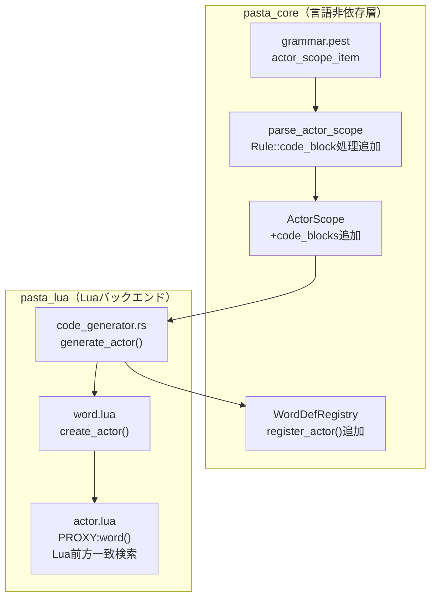

# Design Document: actor-word-dictionary

## Overview

**Purpose**: アクター単語辞書機能により、DSL作成者はアクター定義内に複数値属性とLua関数を記述し、ランダムトーク生成時に多様な出力を実現できる。

**Users**: Pasta DSLでデスクトップマスコットの会話スクリプトを記述するゴースト作成者。

**Impact**: 既存のアクター属性（1対1キー・バリュー）を配列形式に拡張し、ランタイムでのランダム選択とフォールバック検索を追加する。

### Goals

- アクター属性の複数値定義とLua配列形式出力を実現
- 6レベルのフォールバック検索（関数=完全一致、辞書=前方一致）を実装
- アクター定義内へのLua関数埋め込みをサポート
- 後方互換性を維持（既存スクリプトが変更なしで動作）

### Non-Goals

- シーン単語辞書の変更（既存機能）
- Rune言語対応（現状はLuaバックエンドのみ）
- Rust FFI前方一致検索（アクター辞書はLua側で実装）

---

## Architecture

### Existing Architecture Analysis

**現行アーキテクチャ**:
- `pasta_core`: 言語非依存層（PEG パーサー、AST定義）
- `pasta_lua`: Luaバックエンド（トランスパイラ、ランタイム）

**既存ドメイン境界**:
- パーサー/AST（`pasta_core/src/parser/`）
- コード生成（`pasta_lua/src/code_generator.rs`）
- ランタイム（`pasta_lua/scripts/pasta/`）

**維持すべき統合ポイント**:
- `ActorScope` → `generate_actor()` → `actor.lua` の変換フロー
- `GlobalSceneScope`/`LocalSceneScope` での `code_blocks` パターン

### Architecture Pattern & Boundary Map



**Architecture Integration**:
- 選択パターン: **既存拡張**（Option A）- `GlobalSceneScope` と同じ `code_blocks` パターンを踏襲
- ドメイン境界: パーサー/AST変更は `pasta_core`、コード生成/ランタイム変更は `pasta_lua`
- 既存パターン維持: `CodeBlock` 型、`generate_*` メソッド群、`PROXY:*` メソッド群
- Steering準拠: 2パス変換、Yield型出力、日本語フレンドリー

### Technology Stack

| Layer | Choice / Version | Role in Feature | Notes |
|-------|------------------|-----------------|-------|
| Parser | Pest 2.8 | `actor_scope_item` に `code_block` サポート | 既存対応済み |
| AST | Rust struct | `ActorScope.code_blocks` 追加 | 新規フィールド |
| Transpiler | code_generator.rs | 配列形式出力 + コードブロック展開 | 修正 |
| Runtime | Lua 5.4 (mlua) | フォールバック検索 + ランダム選択 + 前方一致検索 | actor.lua, word.lua 拡張 |
| Registry | WordDefRegistry | アクター単語辞書登録 | register_actor() 追加 |

---

## System Flows

### 単語置換フロー

```mermaid
sequenceDiagram
    participant Script as Pasta Script
    participant Transpiler as code_generator.rs
    participant WordRegistry as WordDefRegistry
    participant Actor as actor.lua
    participant Word as word.lua
    
    Note over Script,Transpiler: トランスパイル時
    Script->>Transpiler: ActorScope (words, code_blocks)
    Transpiler->>WordRegistry: register_actor(name, values)
    Transpiler->>Transpiler: 配列形式でLua出力
    Transpiler->>Transpiler: code_blocks展開
    
    Note over Actor,Rust: ランタイム時
    Actor->>Actor: PROXY:word(key) 呼び出し
    Actor->>Actor: 1. アクター関数検索（完全一致）
    Actor->>Rust: 2. アクター辞書検索（前方一致）
    Rust-->>Actor: 候補配列
    Actor->>Actor: ランダム選択
    alt 見つからない場合
        Actor->>Actor: 3. シーン関数検索
        Actor->>Rust: 4. シーン辞書検索
        Actor->>Actor: 5. グローバル関数検索
        Actor->>Rust: 6. グローバル辞書検索
    end
    Actor-->>Script: 選択された値
```

---

## Requirements Traceability

| Requirement | Summary | Components | Interfaces | Flows |
|-------------|---------|------------|------------|-------|
| 1 | DSL構文 - 複数値アクター属性 | grammar.pest (既存) | - | - |
| 2 | トランスパイル - Lua配列出力 | code_generator.rs | generate_actor | トランスパイル時 |
| 3 | ランタイム - ランダム選択 | actor.lua | PROXY:word | ランタイム時 |
| 4 | 単語置換優先順位とフォールバック検索 | actor.lua, Rustヘルパー | PROXY:word, search_word_prefix | ランタイム時 |
| 4.関数定義 | アクター内Lua関数定義 | ActorScope, parse_actor_scope, code_generator.rs | generate_actor | トランスパイル時 |
| 5 | グローバル単語定義 | word.lua (既存) | - | - |
| 6 | 後方互換性 | 全コンポーネント | - | - |

---

## Components and Interfaces

### コンポーネントサマリー

| Component | Domain/Layer | Intent | Req Coverage | Key Dependencies | Contracts |
|-----------|--------------|--------|--------------|------------------|-----------|
| ActorScope | pasta_core/AST | アクター定義のAST表現 | 4.関数定義 | CodeBlock (P0) | State |
| parse_actor_scope | pasta_core/Parser | アクタースコープのパース | 4.関数定義 | Rule::code_block (P0) | Service |
| generate_actor | pasta_lua/Transpiler | アクター定義のLua出力 | 2, 4.関数定義 | ActorScope (P0), StringLiteralizer (P1) | Service |
| PROXY:word | pasta_lua/Runtime | 単語置換とフォールバック検索 | 3, 4 | search_word_prefix (P1) | Service |
| search_word_prefix | pasta_lua/FFI | 前方一致検索ヘルパー | 4 | WordDefRegistry (P0) | Service |

---

### pasta_core/AST

#### ActorScope（修正）

| Field | Detail |
|-------|--------|
| Intent | アクター定義をAST構造体として保持し、コードブロックを含む |
| Requirements | 4.関数定義 |

**Responsibilities & Constraints**
- アクター名、属性、単語定義、変数設定、コードブロックを保持
- `GlobalSceneScope`/`LocalSceneScope` と同じ `code_blocks` パターンを踏襲

**Dependencies**
- Inbound: parse_actor_scope — パース結果の構築 (P0)
- Outbound: generate_actor — Lua出力生成 (P0)

**Contracts**: State [x]

##### State Management

```rust
/// アクター定義スコープ（修正版）
#[derive(Debug, Clone)]
pub struct ActorScope {
    /// アクター名
    pub name: String,
    /// アクターの属性
    pub attrs: Vec<Attr>,
    /// アクターの単語定義（表情など）
    pub words: Vec<KeyWords>,
    /// アクターの変数設定
    pub var_sets: Vec<VarSet>,
    /// コードブロック（Lua関数定義）【新規】
    pub code_blocks: Vec<CodeBlock>,
    /// ソース位置
    pub span: Span,
}
```

**Implementation Notes**
- 既存の `GlobalSceneScope.code_blocks` と同じ型・パターンを使用
- `new()` メソッドに `code_blocks: Vec::new()` 初期化を追加

---

### pasta_core/Parser

#### parse_actor_scope（修正）

| Field | Detail |
|-------|--------|
| Intent | actor_scope をパースし、code_block を含む ActorScope を構築 |
| Requirements | 4.関数定義 |

**Responsibilities & Constraints**
- `Rule::code_block` を処理し、`code_blocks` ベクタに追加
- 既存の `parse_global_scene_scope` と同じパターンを踏襲

**Dependencies**
- Inbound: parse_file — ファイルパース時に呼び出し (P0)
- Outbound: ActorScope — 構築結果 (P0)
- Internal: parse_code_block — コードブロックパース (P0)

**Contracts**: Service [x]

##### Service Interface

```rust
/// parse_actor_scope の修正箇所
fn parse_actor_scope(pair: Pair<Rule>) -> Result<ActorScope, ParseError> {
    // ...existing code...
    let mut code_blocks = Vec::new();  // 【新規】
    
    for inner in pair.into_inner() {
        match inner.as_rule() {
            // ...existing cases...
            Rule::code_block => {  // 【新規】
                code_blocks.push(parse_code_block(inner)?);
            }
            _ => {}
        }
    }
    
    Ok(ActorScope {
        name,
        attrs,
        words,
        var_sets,
        code_blocks,  // 【新規】
        span,
    })
}
```

- Preconditions: `pair` は `Rule::actor_scope` である
- Postconditions: `ActorScope` に全 `code_block` が含まれる
- Invariants: パースエラー時は `ParseError` を返す

---

### pasta_lua/Transpiler

#### generate_actor（修正）

| Field | Detail |
|-------|--------|
| Intent | ActorScope をLua配列形式 + コードブロック展開で出力 |
| Requirements | 2, 4.関数定義 |

**Responsibilities & Constraints**
- 単語定義を `{ [=[値1]=], [=[値2]=] }` 配列形式で出力
- コードブロックをアクター定義ブロック内に展開
- 文字列リテラルは `StringLiteralizer` を使用

**Dependencies**
- Inbound: transpile — トランスパイル時に呼び出し (P0)
- Outbound: Luaファイル — 生成結果 (P0)
- Internal: StringLiteralizer — 文字列リテラル化 (P1)

**Contracts**: Service [x]

##### Service Interface

```rust
/// generate_actor の修正箇所
pub fn generate_actor(&mut self, actor: &ActorScope) -> Result<(), TranspileError> {
    self.writeln("do")?;
    self.indent();
    
    self.writeln(&format!(
        "local ACTOR = PASTA.create_actor(\"{}\")",
        actor.name
    ))?;
    
    // 【修正】配列形式で全値を出力
    for word_def in &actor.words {
        let values: Vec<String> = word_def.words.iter()
            .map(|w| StringLiteralizer::literalize_with_span(w, &word_def.span))
            .collect::<Result<Vec<_>, _>>()?;
        
        if !values.is_empty() {
            let array_literal = format!("{{ {} }}", values.join(", "));
            self.writeln(&format!("ACTOR.{} = {}", word_def.name, array_literal))?;
        }
    }
    
    // 【新規】コードブロック展開
    for code_block in &actor.code_blocks {
        if code_block.language == "lua" {
            self.write_blank_line()?;
            for line in code_block.code.lines() {
                self.writeln(line)?;
            }
        }
    }
    
    self.dedent();
    self.writeln("end")?;
    self.write_blank_line()?;
    
    Ok(())
}
```

- Preconditions: `actor` は有効な `ActorScope`
- Postconditions: Lua配列形式 + コードブロックが出力される
- Invariants: 空の `words` は出力しない

**出力例**

```lua
do
    local ACTOR = PASTA.create_actor("さくら")
    ACTOR.通常 = { [=[\s[0]]=], [=[\s[100]]=] }
    ACTOR.照れ = { [=[\s[1]]=] }
    
    function ACTOR.時刻(act, ...)
        local hour = os.date("%H")
        if hour < 12 then return "おはよう"
        elseif hour < 18 then return "こんにちは"
        else return "こんばんは"
        end
    end
end
```

---

### pasta_lua/Runtime

#### PROXY:word（修正）

| Field | Detail |
|-------|--------|
| Intent | 6レベルフォールバック検索とランダム選択を実行 |
| Requirements | 3, 4 |

**Responsibilities & Constraints**
- 関数検索（完全一致）→ 辞書検索（前方一致）の順序を各スコープで実行
- アクター → シーン → グローバル の順でスコープ検索
- 配列からのランダム選択に `math.random()` を使用

**Dependencies**
- Inbound: シーン実行 — 単語参照時に呼び出し (P0)
- Outbound: search_word_prefix — 前方一致検索 (P1)

**Contracts**: Service [x]

##### Service Interface

```lua
--- 値を解決（関数なら実行、その他はそのまま返す）
--- @param value any 検索結果
--- @param act Act アクションオブジェクト
--- @return any 解決後の値
local function resolve_value(value, act)
    if value == nil then
        return nil
    elseif type(value) == "function" then
        return value(act)
    elseif type(value) == "table" then
        -- 配列なら最初の要素を返す（完全一致の場合は辞書ではなく直接値として扱う）
        if #value > 0 then
            return value[1]
        end
        return nil
    else
        return tostring(value)
    end
end

--- 単語置換（6レベルフォールバック検索）
--- @param name string 単語名（＠なし）
--- @return string|nil 見つかった単語、またはnil
function PROXY:word(name)
    local WORD = require("pasta.word")
    local GLOBAL = require("pasta.global")
    
    -- Level 1: アクター完全一致（関数 or 値）
    local actor_value = self.actor[name]
    if actor_value ~= nil then
        return resolve_value(actor_value, self.act)
    end
    
    -- Level 2: アクター辞書（前方一致）
    local actor_dict = WORD.get_actor_words(self.actor.name)
    if actor_dict then
        local candidates = search_prefix_lua(actor_dict, name)
        if candidates and #candidates > 0 then
            return candidates[math.random(#candidates)]
        end
    end
    
    -- Level 3: シーン完全一致（関数 or 値）
    local scene = self.act.current_scene
    if scene then
        local scene_value = scene[name]
        if scene_value ~= nil then
            return resolve_value(scene_value, self.act)
        end
        
        -- Level 4: シーン辞書（前方一致）
        local scene_dict = WORD.get_local_words(scene.name)
        if scene_dict then
            local candidates = search_prefix_lua(scene_dict, name)
            if candidates and #candidates > 0 then
                return candidates[math.random(#candidates)]
            end
        end
    end
    
    -- Level 5: グローバル完全一致（関数 or 値）
    local global_value = GLOBAL[name]
    if global_value ~= nil then
        return resolve_value(global_value, self.act)
    end
    
    -- Level 6: グローバル辞書（前方一致）
    local global_dict = WORD.get_global_words()
    local candidates = search_prefix_lua(global_dict, name)
    if candidates and #candidates > 0 then
        return candidates[math.random(#candidates)]
    end
    
    return nil
end

--- Lua側前方一致検索ヘルパー（ローカル関数）
local function search_prefix_lua(dict, prefix)
    local results = {}
    for key, value_arrays in pairs(dict) do
        if key:sub(1, #prefix) == prefix then
            -- value_arrays は [[値1, 値2], [値3]] 形式
            for _, values in ipairs(value_arrays) do
                for _, v in ipairs(values) do
                    table.insert(results, v)
                end
            end
        end
    end
    return #results > 0 and results or nil
end
```

- Preconditions: `name` は空でない文字列
- Postconditions: 見つかった場合は文字列、見つからない場合は nil
- Invariants: 検索順序は常に 1→2→3→4→5→6

---

### pasta_lua/word.lua

#### create_actor / get_actor_words（新規）

| Field | Detail |
|-------|--------|
| Intent | アクター単語辞書の登録と取得 |
| Requirements | R2, R4 |

**Responsibilities & Constraints**
- グローバル/シーン単語辞書と同じビルダーパターンを踏襲
- アクター名でスコープ分離
- 前方一致検索はactor.lua側で実装

**Dependencies**
- Inbound: generate_actor — トランスパイル結果から呼び出し (P0)
- Outbound: PROXY:word — 辞書取得 (P0)

**Contracts**: Service [x]

##### Service Interface

```lua
--- アクター単語レジストリ（actor_name → {key → values[][]}）
local actor_words = {}

--- アクター単語ビルダーを作成
--- @param actor_name string アクター名
--- @param key string 単語キー
--- @return WordBuilder ビルダーオブジェクト
function MOD.create_actor(actor_name, key)
    if not actor_words[actor_name] then
        actor_words[actor_name] = {}
    end
    return create_builder(actor_words[actor_name], key)
end

--- アクター単語辞書を取得
--- @param actor_name string アクター名
--- @return table|nil {key → values[][]} 形式の辞書
function MOD.get_actor_words(actor_name)
    return actor_words[actor_name]
end
```

**Implementation Notes**
- `create_global` / `create_local` と同じビルダーパターンを使用
- アクター辞書は小規模（1アクターあたり数十件程度）なのでLua側ループ検索で十分
- 既存のword.luaパターンを踏襲

---

### pasta_lua/global.lua（新規）

| Field | Detail |
|-------|--------|
| Intent | グローバル関数を格納するモジュール |
| Requirements | R4 (L5グローバル関数検索) |

**Responsibilities & Constraints**
- 空の `GLOBAL` テーブルを提供
- ユーザーが自由に関数を追加可能（main.lua等から）
- 本仕様ではDSL構文によるグローバル関数定義は対象外

**Dependencies**
- Inbound: PROXY:word — L5検索時に参照 (P0)
- Outbound: なし（ユーザー定義）

**Contracts**: State [x]

##### State Management

```lua
--- @module pasta.global
--- グローバル関数モジュール
---
--- ユーザー定義のグローバル関数を格納するテーブル。
--- main.lua等から関数を追加することで、単語参照時にL5で検索される。

local GLOBAL = {}

-- 使用例（ユーザーがmain.lua等で定義）:
-- local GLOBAL = require("pasta.global")
-- function GLOBAL.時報(act)
--     return "正午です"
-- end

return GLOBAL
```

**Implementation Notes**
- 最小限の実装（空テーブルを返すのみ）
- グローバル関数の定義方法はユーザー責任
- テスト時は手動で関数を追加してテスト

---

## Data Models

### Domain Model


### Logical Data Model

**Lua側のデータ構造**:

```lua
-- アクター属性（配列形式）
ACTOR.通常 = { [=[\s[0]]=], [=[\s[100]]=] }
ACTOR.照れ = { [=[\s[1]]=] }

-- アクター関数（完全一致で呼び出し）
function ACTOR.時刻(act, ...)
    return "こんにちは"
end
```

**検索用インデックス**（Rust側）:
- アクター辞書: `actor_name -> key_prefix -> values[]`
- シーン辞書: `scene_name -> key_prefix -> values[]`（既存）
- グローバル辞書: `key_prefix -> values[]`（既存）

---

## Error Handling

### Error Categories and Responses

| Category | Error | Response |
|----------|-------|----------|
| パースエラー | 不正なコードブロック構文 | `ParseError::InvalidCodeBlock` |
| トランスパイルエラー | 文字列リテラル化失敗 | `TranspileError::StringLiteral` |
| ランタイムエラー | 単語が見つからない | `nil` を返す（エラーではない） |

---

## Testing Strategy

### Unit Tests

| テスト | 対象 | 検証内容 |
|--------|------|----------|
| parse_actor_scope_with_code_block | parse_actor_scope | code_block を含む actor_scope が正しくパースされる |
| generate_actor_array_output | generate_actor | 複数値が配列形式で出力される |
| generate_actor_code_block | generate_actor | コードブロックが展開される |

### Integration Tests

| テスト | 対象 | 検証内容 |
|--------|------|----------|
| actor_word_random_selection | トランスパイル + ランタイム | 配列からランダム選択が動作する |
| actor_fallback_6_levels | PROXY:word | 6レベル検索が優先順位通りに動作する |
| actor_function_exact_match | PROXY:word | 関数が完全一致で呼び出される |
| actor_dictionary_prefix_match | PROXY:word + Rustヘルパー | 辞書が前方一致で検索される |

### 網羅テストケース（設計詳細）

以下のテストケースで6レベル検索を完全網羅する：

**テストフィクスチャ: `comprehensive_fallback_test.pasta`**

```pasta
# グローバル単語定義
＠天気：雨、雪、台風
＠天気予報：晴れのち曇り
＠挨拶：こんにちは、おはよう

# アクター定義
％さくら
　＠天気：晴れ、曇り
　＠表情：\s[0]、\s[1]
　＠単一：固定値
```lua
function ACTOR.時刻(act)
    return "朝"
end
function ACTOR.天気(act)
    return "アクター関数の天気"
end
```

％うにゅう
　＠表情：\s[10]、\s[11]

# シーン定義
```lua
function SCENE.日付(ctx)
    return "1月1日"
end
```

＊テスト
　＠季節：春、夏
　＠季節感：暖かい、涼しい
　％さくら、うにゅう
　　さくら：テスト
```

**テストマトリクス（6レベル検索 + エッジケース）**:

#### 基本検索テスト（各レベルの確認）

| テストID | 呼び出し | 期待レベル | 期待結果 | 検証ポイント |
|----------|----------|------------|----------|--------------|
| T1 | さくら.word("時刻") | L1 アクター関数 | "朝" | 完全一致関数呼び出し |
| T2 | さくら.word("表情") | L2 アクター辞書 | "\s[0]" or "\s[1]" | 完全一致キー |
| T3 | さくら.word("日付") | L3 シーン関数 | "1月1日" | シーン関数呼び出し |
| T4 | さくら.word("季節") | L4 シーン辞書 | "春" or "夏" | 完全一致キー |
| T5 | さくら.word("時報") | L5 グローバル関数 | "正午です" | グローバル関数呼び出し（※1） |
| T6 | さくら.word("挨拶") | L6 グローバル辞書 | "こんにちは" or "おはよう" | 完全一致キー |

**※1**: T5のグローバル関数はDSLではなく、テストセットアップで直接Luaに定義：
```lua
-- テストセットアップ
local GLOBAL = require("pasta.global")
function GLOBAL.時報(act)
    return "正午です"
end
```

#### フォールスルー確認テスト

| テストID | 呼び出し | 期待レベル | 期待結果 | 検証ポイント |
|----------|----------|------------|----------|--------------|
| T7 | うにゅう.word("天気") | L6 グローバル辞書 | "雨" or "雪" or "台風" | アクター辞書なし→グローバルへ |
| T8 | うにゅう.word("表情") | L2 アクター辞書 | "\s[10]" or "\s[11]" | 別アクターの辞書 |

#### 前方一致テスト

| テストID | 呼び出し | 期待レベル | 期待結果 | 検証ポイント |
|----------|----------|------------|----------|--------------|
| T9 | さくら.word("表") | L2 前方一致 | "\s[0]" or "\s[1]" | アクター辞書前方一致 |
| T10 | さくら.word("季") | L4 前方一致 | "春" or "夏" or "暖かい" or "涼しい" | シーン辞書前方一致（複数キーマッチ） |
| T11 | うにゅう.word("天") | L6 前方一致 | "雨" or "雪" or "台風" or "晴れのち曇り" | グローバル辞書前方一致 |

#### 関数優先テスト（オーバーライド）

| テストID | 呼び出し | 期待レベル | 期待結果 | 検証ポイント |
|----------|----------|------------|----------|--------------|
| T12 | さくら.word("天気") | L1 アクター関数 | "アクター関数の天気" | 同名関数が辞書より優先 |

#### エッジケーステスト

| テストID | 呼び出し | 期待レベル | 期待結果 | 検証ポイント |
|----------|----------|------------|----------|--------------|
| T13 | さくら.word("存在しない") | - | nil | 全レベル検索失敗 |
| T14 | さくら.word("単一") | L2 アクター辞書 | "固定値" | 単一値配列（後方互換） |
| T15 | さくら.word("") | - | nil | 空文字キー |

#### 網羅性確認チェックリスト

| 検証項目 | テストID | 状態 |
|----------|----------|------|
| L1: アクター関数（完全一致） | T1, T12 | ✅ |
| L2: アクター辞書（完全一致） | T2, T8, T14 | ✅ |
| L2: アクター辞書（前方一致） | T9 | ✅ |
| L3: シーン関数（完全一致） | T3 | ✅ |
| L4: シーン辞書（完全一致） | T4 | ✅ |
| L4: シーン辞書（前方一致） | T10 | ✅ |
| L5: グローバル関数（完全一致） | T5 | ✅ |
| L6: グローバル辞書（完全一致） | T6, T7 | ✅ |
| L6: グローバル辞書（前方一致） | T11 | ✅ |
| 関数優先（同名存在時） | T12 | ✅ |
| フォールスルー | T7, T8 | ✅ |
| 検索失敗→nil | T13, T15 | ✅ |
| 単一値配列（後方互換） | T14 | ✅ |

**注意**: テストの省略は禁止。全テストケースを実装完了すること。

---

## 改訂履歴

| 日付 | 内容 |
|------|------|
| 2026-01-23 | 設計ドキュメント初版作成 |
| 2026-01-23 | 議題1決定: Lua側前方一致検索、WordDefRegistry拡張（`:__actor_{name}__:{word}`形式） |
| 2026-01-23 | テストケース拡充: 9件→15件（L5グローバル関数、前方一致網羅、関数優先オーバーライド追加） |
| 2026-01-23 | 議題2決定: L5グローバル関数はpasta.globalモジュール方式（DSL構文なし、ユーザー定義） |
| 2026-01-23 | 議題3決定: 完全一致検索を統一（SCOPE[key]でnil以外なら使用、関数なら実行・値ならそのまま） |
