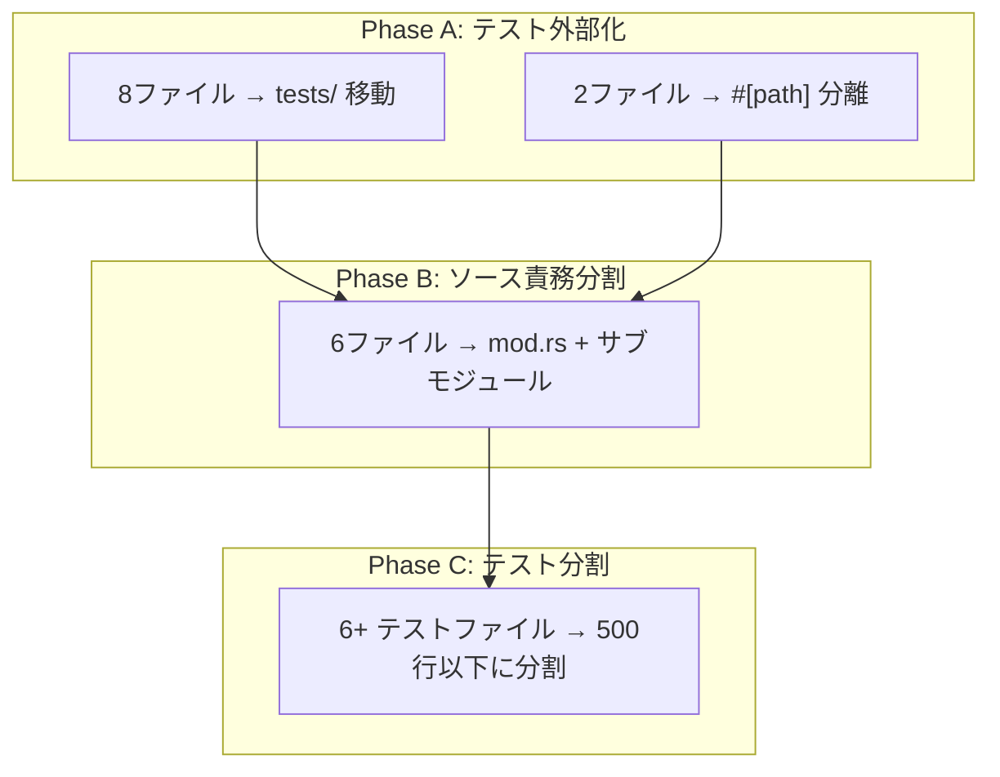
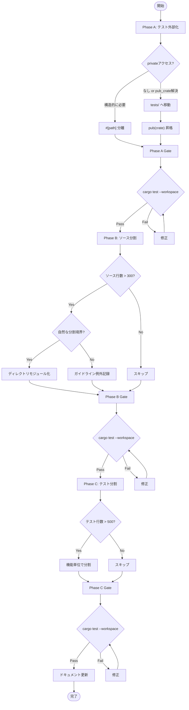

# Design Document: ai-friendly-file-split

## Overview

**Purpose**: pastaワークスペースの全クレート（pasta_dsl, pasta_core, pasta_lua, pasta_lsp, pasta_shiori）を対象に、ソースファイルをAIコーディングアシスタントが効率的に処理できるサイズ（ソース300行以下、テスト500行以下）へ分割するリファクタリング。根本原因分析により、ソースファイル肥大化の最大要因がインラインテスト（ファイル全体の11〜67%）であることが判明しており、テスト外部化を第一フェーズとして実行する。

**Users**: AIコーディングアシスタント（LLM）を活用してpastaプロジェクトの開発・保守を行う開発者。

**Impact**: 内部モジュール構造のみを変更し、外部APIは一切変更しない。10個のソースファイル（合計11,189行）に散在する3,634行のインラインテストを外部化し、残った大規模ソースファイルを責務単位で分割する。

### Goals
- Phase A: 10ファイルのインラインテストを外部化（8ファイル→`tests/`、2ファイル→`#[path]`）
- Phase B: テスト外部化後も300行を超える6ファイルを責務単位で分割
- Phase C: 500行を超えるテストファイルを機能単位で分割
- 全クレートの公開APIを完全に維持（`pub(crate)` 昇格は許容）
- steering（structure.md）を分割後の構造に同期

### Non-Goals
- 機能追加・バグ修正（純粋な構造リファクタリングのみ）
- コードロジックの変更・最適化
- クレート間の依存関係変更
- pest文法ファイル（`.pest`）の分割
- 300行以下のソースファイルの分割

## Architecture

### Existing Architecture Analysis

**ワークスペースレイヤー構成**:

```
pasta_dsl (Parser層) → pasta_core (Registry層) → pasta_lua (Backend層)
                                                 → pasta_lsp (LSP層)
                                                 → pasta_shiori (DLL層)
```

**既存の分割パターン**:
- ディレクトリモジュール: `parser/`, `registry/`, `runtime/`, `loader/`, `stdlib/`
- フラットモジュール: `error.rs`, `config.rs`, `context.rs`
- テスト配置: インライン `#[cfg(test)]`（10ファイル）+ 外部 `tests/`（4クレート）

**テスト資産の現状（設計時実測値）**:

| # | ファイル | クレート | 総行数 | テスト行数 | ソース行数 | テスト割合 |
|---|---|---|---:|---:|---:|---:|
| 1 | parser/mod.rs | pasta_dsl | 1,405 | 267 | 1,138 | 19% |
| 2 | ast.rs | pasta_dsl | 885 | 126 | 759 | 14% |
| 3 | analysis.rs | pasta_lsp | 1,283 | 138 | 1,145 | 11% |
| 4 | runtime/mod.rs | pasta_lua | 1,174 | 343 | 831 | 29% |
| 5 | code_generator.rs | pasta_lua | 1,002 | 224 | 778 | 22% |
| 6 | config.rs | pasta_lua | 850 | 423 | 427 | 50% |
| 7 | cache.rs | pasta_lua | 701 | 314 | 387 | 45% |
| 8 | scene_table.rs | pasta_core | 1,053 | 604 | 449 | 57% |
| 9 | word_table.rs | pasta_core | 649 | 402 | 247 | 62% |
| 10 | shiori.rs | pasta_shiori | 1,187 | 793 | 394 | 67% |
| | **合計** | | **11,189** | **3,634** | **7,555** | **32%** |

### Architecture Pattern & Boundary Map



**Architecture Integration**:
- 選択パターン: 既存のディレクトリモジュール方式（`mod.rs` + サブモジュール）を踏襲
- 境界: 各クレートの公開API（`lib.rs` の `pub use`）は不変
- テスト配置: `tests/` ディレクトリを原則とし、既存慣例に統一
- ステアリング準拠: structure.md の命名規則に従う

### Technology Stack

| Layer | Choice / Version | Role in Feature | Notes |
|-------|------------------|-----------------|-------|
| Language | Rust 2024 edition | モジュールシステムによるファイル分割 | `pub use`, `pub(crate)`, `#[path]` |
| Build | Cargo workspace | 分割検証 | `cargo test --workspace` |
| Testing | `#[cfg(test)]` + `tests/` | テスト移行先 | 既存パターンに統一 |

## System Flows

### 3フェーズ実行フロー



**レイヤー処理順序**（各フェーズ内共通、5.5）:

```
pasta_dsl → pasta_core → pasta_lua → pasta_lsp → pasta_shiori
```

## Requirements Traceability

| Requirement | Summary | Phase | Components | Key Mechanism |
|---|---|---|---|---|
| 1.1–1.2 | ファイルサイズ基準 | 全Phase | 全コンポーネント | 300行(src)/500行(test)ガイドライン |
| 1.3–1.5 | テスト配置ポリシー | A | TestExternalizer | tests/移動 or #[path]分離 |
| 1.6–1.8 | 除外基準 | 全Phase | 判定ロジック | 300行以下・自動生成・.pest除外 |
| 2.1–2.5 | ソース責務分割 | B | SrcSplitter | ディレクトリモジュール化 |
| 3.1–3.6 | テストファイル分割 | C | TestSplitter | 機能単位分割 |
| 4.1–4.6 | API互換性維持 | 全Phase | 検証 | pub use re-export, cargo test |
| 5.1–5.6 | 実行フェーズ・順序 | 全Phase | フロー制御 | Phase A→B→C, レイヤー順 |
| 6.1–6.5 | ドキュメント更新 | 最終 | DocUpdater | structure.md, README, TEST_COVERAGE |

## Components and Interfaces

### コンポーネント概要

| Component | Domain/Layer | Intent | Req Coverage | Phase |
|---|---|---|---|---|
| DslTestExternalizer | pasta_dsl | parser, ast のテスト外部化 | 1.3–1.5, 5.1 | A |
| CoreTestExternalizer | pasta_core | scene_table, word_table のテスト外部化 | 1.3–1.5, 5.1–5.2 | A |
| LuaTestExternalizer | pasta_lua | runtime, code_gen, config, cache のテスト外部化 | 1.3–1.5, 5.1 | A |
| LspTestExternalizer | pasta_lsp | analysis のテスト外部化 | 1.3–1.5, 5.1 | A |
| ShioriTestExternalizer | pasta_shiori | shiori のテスト外部化 | 1.3–1.5, 5.1–5.2 | A |
| DslSrcSplitter | pasta_dsl | parser/mod.rs, ast.rs の責務分割 | 2.1–2.5 | B |
| CoreSrcSplitter | pasta_core | scene_table.rs の型分離 | 2.1–2.4 | B |
| LuaSrcSplitter | pasta_lua | runtime, code_gen の責務分割 | 2.1–2.5 | B |
| LspSrcSplitter | pasta_lsp | analysis.rs の責務分割 | 2.1–2.5 | B |
| TestSplitter | 全クレート | 500行超テストファイルの分割 | 3.1–3.6 | C |
| DocUpdater | steering | structure.md, README, TEST_COVERAGE | 6.1–6.5 | 最終 |

---

### Phase A: テスト外部化

#### pasta_dsl — DslTestExternalizer

| ファイル | テスト行数 | 外部化先 | pub(crate) 昇格 |
|---|---:|---|---|
| parser/mod.rs | 267 | `tests/parser_test.rs` | `normalize_number_str()` |
| ast.rs | 126 | `tests/ast_test.rs` | なし |

**parser/mod.rs**:
- `#[cfg(test)] mod tests`（L1139–L1405）を `crates/pasta_dsl/tests/parser_test.rs` に移動
- `normalize_number_str()` を `pub(crate)` に昇格（15/18テストは変更不要）
- テストファイルで `use pasta_dsl::parser::*;`

**ast.rs**:
- `#[cfg(test)] mod tests`（L760–L885）を `crates/pasta_dsl/tests/ast_test.rs` に移動
- 全14テストがpub型コンストラクタのみ使用。変更不要

#### pasta_core — CoreTestExternalizer

| ファイル | テスト行数 | 外部化先 | pub(crate) 昇格 |
|---|---:|---|---|
| scene_table.rs | 604 | `src/registry/scene_table_tests.rs` (#[path]) | なし |
| word_table.rs | 402 | `tests/word_table_test.rs` | なし（getter使用に1行変更） |

**scene_table.rs（#[path] パターン — 例外）**:
- privateフィールド（`labels`, `prefix_index`, `cache`, `random_selector`, `shuffle_enabled`）への直接アクセスが構造的に必要
- テストブロックを `src/registry/scene_table_tests.rs` に移動
- `scene_table.rs` に `#[cfg(test)] #[path = "scene_table_tests.rs"] mod tests;` 追加
- **例外理由**: SceneTableの全privateフィールドを直接構築してテスト。pub化するとRadixMapやキャッシュ内部構造が露出

**word_table.rs**:
- テストブロック（L248–L649）を `crates/pasta_core/tests/word_table_test.rs` に移動
- `table.entries.len()` → `table.entries().len()` の1行変更（既存getter使用）
- **前提**: `crates/pasta_core/tests/` ディレクトリを新規作成

#### pasta_lua — LuaTestExternalizer

| ファイル | テスト行数 | 外部化先 | pub(crate) 昇格 |
|---|---:|---|---|
| runtime/mod.rs | 343 | `tests/runtime_test.rs` | なし |
| code_generator.rs | 224 | `tests/code_generator_test.rs` | `generate_action()`, `generate_var_set()` |
| config.rs | 423 | `tests/config_test.rs` | `from_str()`※, `default_log_file_path()`, `default_lua_search_paths()` |
| cache.rs | 314 | `tests/cache_test.rs` | `CURRENT_VERSION` 定数 |

**runtime/mod.rs**: 29テスト全てがpub APIのみ使用。変更なしで外部化可能

**code_generator.rs**: `generate_action()`, `generate_var_set()` を `pub(crate)` に昇格

**config.rs（※要注意）**:
- L125の `#[cfg(test)] fn from_str()` はテストモジュール外の `#[cfg(test)]` 付きメソッド
- 統合テスト（`tests/`）ではライブラリが `cfg(test)` なしでコンパイルされるため利用不可
- **対策**: `from_str()` を `pub(crate)` に変更し `#[cfg(test)]` を除去（設定パーサーとして正当なAPI）
- テストモジュール（L428–L850）を `tests/config_test.rs` に移動

**cache.rs**: `CURRENT_VERSION` 定数を `pub(crate)` に昇格

#### pasta_lsp — LspTestExternalizer

| ファイル | テスト行数 | 外部化先 | pub(crate) 昇格 |
|---|---:|---|---|
| analysis.rs | 138 | `tests/analysis_test.rs` | `get_line_text()`, `line_byte_offset()` |

9/12テストはpub API使用で変更不要。`get_line_text()`, `line_byte_offset()` を `pub(crate)` に昇格

#### pasta_shiori — ShioriTestExternalizer

| ファイル | テスト行数 | 外部化先 | pub(crate) 昇格 |
|---|---:|---|---|
| shiori.rs | 793 | `src/shiori_tests.rs` (#[path]) | なし |

**shiori.rs（#[path] パターン — 例外）**:
- PastaShioriの6つのprivateフィールド（`hinst`, `load_dir`, `runtime`, `load_fn`, `request_fn`, `unload_fn`）への直接アクセスが構造的に必要
- テストブロックを `src/shiori_tests.rs` に移動
- `shiori.rs` に `#[cfg(test)] #[path = "shiori_tests.rs"] mod tests;` 追加
- **例外理由**: SHIORI DLLインターフェースのカプセル化。フィールドpub化はDLLの安全性を損なう

---

### Phase A完了後の状態評価

| ファイル | Phase A後(src) | 300超? | Phase B判定 |
|---|---:|---|---|
| parser/mod.rs | ~1,138 | ✅ | **要分割** |
| analysis.rs | ~1,145 | ✅ | **要分割** |
| runtime/mod.rs | ~831 | ✅ | **要分割** |
| code_generator.rs | ~778 | ✅ | **要分割** |
| ast.rs | ~759 | ✅ | **要分割** |
| scene_table.rs | ~449 | ✅ | **要分割**（型分離可能） |
| config.rs | ~427 | ✅ | ガイドライン例外（6 struct凝集） |
| shiori.rs | ~394 | ✅ | ガイドライン例外（trait+struct+impl） |
| cache.rs | ~387 | ✅ | ガイドライン例外（単一CacheManager） |
| word_table.rs | ~247 | ❌ | **不要** |

---

### Phase B: ソース責務分割

#### pasta_dsl — DslSrcSplitter

##### parser/mod.rs 分割設計（~1,138行 → 4ファイル）

| Field | Detail |
|-------|--------|
| Intent | パーサーの巨大エントリファイルを機能カテゴリ別に分割 |
| Requirements | 2.1, 2.2, 2.4, 2.5 |

**分割後の構造**:

```
parser/
├── mod.rs           # PastaParser2 struct, parse_str/parse_file公開API,
│                    #   build_ast(), parse_file_scope(), parse_actor_scope(),
│                    #   mod宣言 (~300行)
├── parse_scene.rs   # parse_global_scene_scope(), parse_global_scene_start(),
│                    #   parse_scene_actors_line(), parse_actors_item(),
│                    #   parse_local_start_scene_scope(),
│                    #   parse_local_scene_scope() (~280行)
├── parse_action.rs  # parse_call_scene(), parse_action_line(),
│                    #   parse_continue_action_line(), parse_actions(),
│                    #   parse_fn_call_inner(), parse_args(),
│                    #   parse_expr_from_parts(), parse_key_arg(),
│                    #   try_parse_expr() (~400行)
└── parse_elements.rs # parse_attr(), parse_key_words(),
                      #   parse_code_block(), parse_var_set(),
                      #   normalize_number_str() (~160行)
```

**実装ノート**:
- 全パース関数はモジュールレベル関数であり、サブモジュールへの移動が容易
- 可視性: `pub(crate)` で `mod.rs` から参照
- `parse_action.rs` が ~400行で目標超過の可能性あり。実装時に `parse_expr.rs` への更なる分割を検討
- `mod.rs` は `mod parse_scene; mod parse_action; mod parse_elements;` で宣言（外部非公開）

##### ast.rs → ast/ ディレクトリモジュール化（~759行 → 4ファイル）

| Field | Detail |
|-------|--------|
| Intent | AST型定義を意味カテゴリ別にサブモジュール化 |
| Requirements | 2.1, 2.2, 2.4, 2.5 |

**分割後の構造**:

```
parser/ast/
├── mod.rs     # FileItem, PastaFile, ActorScope, FileScope,
│              #   pub use re-exports (~260行)
├── span.rs    # Span struct, SpanError enum, Display/From impl (~160行)
├── scene.rs   # SceneActorItem, GlobalSceneScope, LocalSceneScope,
│              #   LocalSceneItem, ActionLine, ContinueAction (~170行)
└── action.rs  # Action, CodeBlock, VarSet, CallScene, Attr, AttrValue,
               #   KeyWords, Args, Arg, Expr, SetValue, VarScope,
               #   FnScope, BinOp (~170行)
```

**API互換性**:
- `mod.rs` にて `pub use span::*; pub use scene::*; pub use action::*;` で全型をre-export
- 外部クレート（pasta_lua, pasta_lsp）からの `pasta_dsl::parser::ast::Expr` 等のパスが維持

#### pasta_core — CoreSrcSplitter

##### scene_table.rs 型分離（~449行 → 2ファイル）

| Field | Detail |
|-------|--------|
| Intent | 公開型定義を独立モジュールに分離し、scene_table本体を軽量化 |
| Requirements | 2.1, 2.2, 2.4 |

**分割後の構造**:

```
registry/
├── scene_types.rs       # SceneId, SceneScope, SceneInfo (~60行)
├── scene_table.rs       # SceneTable struct + impl, private types (~390行)
└── scene_table_tests.rs # #[path] テスト (~604行)
```

**実装ノート**:
- `SceneCacheKey`, `CachedSelection` はprivateのまま `scene_table.rs` に残す
- `scene_types.rs` の公開型は `registry/mod.rs` から `pub use scene_types::*;` でre-export
- scene_table.rs は ~390行で300行超だが、SceneTable単一structの凝集した実装であり自然な分割境界なし → ガイドライン例外（2.3）

#### pasta_lua — LuaSrcSplitter

##### runtime/mod.rs 分割設計（~831行 → mod.rs + 2新規ファイル）

| Field | Detail |
|-------|--------|
| Intent | RuntimeConfig分離とモジュール登録の独立化 |
| Requirements | 2.1, 2.2, 2.4 |

**分割後の構造**:

```
runtime/
├── mod.rs               # PastaLuaRuntime struct + コアメソッド,
│                        #   Drop impl, re-exports (~400行)
├── runtime_config.rs    # RuntimeConfig struct + impl + Default +
│                        #   From<LuaConfig>, lua_require() (~250行)
├── module_registry.rs   # register_*_module() 群,
│                        #   toml_to_lua() (~180行)
├── enc.rs               # (既存)
├── finalize.rs          # (既存)
├── log.rs               # (既存)
└── persistence.rs       # (既存)
```

**実装ノート**:
- `RuntimeConfig` は独立した設定structであり、自然な分離対象
- モジュール登録関数は `impl PastaLuaRuntime` の分割implとして `module_registry.rs` に配置
- `mod.rs` は `pub(crate) use runtime_config::RuntimeConfig;` でre-export
- `mod.rs` が ~400行で目標超過の可能性あり → 実装時にさらなる分割を検討

##### code_generator.rs → code_gen/ ディレクトリモジュール化（~778行 → 3ファイル）

| Field | Detail |
|-------|--------|
| Intent | コード生成関数群をカテゴリ別にサブモジュール化 |
| Requirements | 2.1, 2.2, 2.4, 2.5 |

**分割後の構造**:

```
code_gen/
├── mod.rs          # LuaCodeGenerator struct, new(), with_line_ending(),
│                   #   write_header(), ユーティリティ, re-exports (~250行)
├── scope_gen.rs    # generate_actor(), generate_global_scene(),
│                   #   generate_local_scene(), is_callable_item(),
│                   #   generate_local_scene_items() (~250行)
└── element_gen.rs  # generate_var_set(), generate_call_scene(),
                    #   generate_action_line(), generate_action(),
                    #   generate_expr(), generate_args_string(),
                    #   generate_code_block(), generate_*_word() (~280行)
```

**実装ノート**:
- 分割impl: `impl<'a, W: Write> LuaCodeGenerator<'a, W>` を3ファイルで定義
- `mod scope_gen; mod element_gen;` 宣言（内部モジュール、外部非公開）
- `lib.rs` 更新: `pub mod code_generator;` → `pub mod code_gen;`、`pub use code_gen::LuaCodeGenerator;` に変更
- `transpiler.rs` 更新: `use super::code_generator::` → `use super::code_gen::`
- **re-export不要**: 外部クレートからの `pasta_lua::code_generator::*` 直接参照はゼロ（実測済み）。Req4 AC3の義務は発生しない

#### pasta_lsp — LspSrcSplitter

##### analysis.rs → analysis/ ディレクトリモジュール化（~1,145行 → 4ファイル）

| Field | Detail |
|-------|--------|
| Intent | 巨大なAnalysisEngine implをvisitor群とユーティリティに分離 |
| Requirements | 2.1, 2.2, 2.4, 2.5 |

**分割後の構造**:

```
analysis/
├── mod.rs          # AnalysisResult, AnalysisEngine struct,
│                   #   analyze() エントリポイント, re-exports (~250行)
├── token_types.rs  # TOKEN_TYPES, TOKEN_MODIFIERS, token_type mod,
│                   #   RawToken, semantic_tokens_legend(),
│                   #   UTF変換ヘルパー, encode_tokens() (~150行)
├── visitors.rs     # impl AnalysisEngine の全visit/tokenize系メソッド
│                   #   visit_file_items(), visit_global_scene(),
│                   #   visit_action_line() 等 (~550行)
└── text_utils.rs   # get_line_text(), line_byte_offset(),
                    #   memchr_newline(), find_number_literal(),
                    #   find_binary_op() 等 (~200行)
```

**実装ノート**:
- `visitors.rs` は ~550行で目標超過だが、30+の小さなvisitor関数が密に連携しており分割は凝集度を損なう → ガイドライン例外
- `token_type` インラインモジュール（L44付近）は `token_types.rs` に移行
- 将来的に `visit_scene_*.rs` / `visit_action_*.rs` への細分化を検討可能

---

### Phase B ガイドライン例外

300行ガイドラインを超えるが、自然な分割境界が存在しないためガイドライン例外として記録（2.3）:

| ファイル | Phase A後行数 | 例外理由 |
|---|---:|---|
| config.rs | ~427 | 6つの設定struct（PastaConfig, LoaderConfig, LoggingConfig, PersistenceConfig, LuaConfig, TalkConfig）が密結合。分割は相互参照増加で逆効果 |
| shiori.rs | ~394 | Shiori trait + PastaShiori struct + impl + Drop。単一責務の凝集した実装 |
| cache.rs | ~387 | 単一CacheManager structの凝集した実装 |
| scene_table.rs | ~390 | 型分離後もSceneTable単一structの凝集した実装が残る |
| runtime/mod.rs | ~400 | 分割後のmod.rs。PastaLuaRuntime struct + コアメソッド + Drop |
| parse_action.rs | ~400 | 式パースと文パースが密に連携。parse_expr.rs分離を将来検討 |
| visitors.rs | ~550 | 30+のvisitor関数が密に連携。visit_scene/actionへの細分化を将来検討 |

---

### Phase C: テスト分割

#### #[path] テストファイル（500行超、ガイドライン例外）

| ファイル | 行数 | 判定 |
|---|---:|---|
| `src/shiori_tests.rs` | ~793 | 例外（テスト間共有ヘルパー多数、分割は重複を招く）|
| `src/registry/scene_table_tests.rs` | ~604 | 例外（#[path]内分割は言語仕様上複雑）|

`#[path]` で分離されたテストファイルはソースモジュールの一部としてコンパイルされるため、更なる分割は通常のテストファイル分割より複雑。テスト500行ガイドライン例外として記録（1.5, 3.3）。

#### 既存テストファイル（tests/ 配下、500行超）

| ファイル | クレート | 行数 | 分割方針 |
|---|---|---:|---|
| transpiler_integration_test.rs | pasta_lua | ~1,086 | テスト対象機能別に2〜3ファイル |
| shiori_event_test.rs | pasta_lua | ~933 | イベントカテゴリ別に2ファイル |
| loader_integration_test.rs | pasta_lua | ~612 | ローダー機能別に2ファイル |
| runtime_e2e_test.rs | pasta_lua | ~565 | ランタイム機能別に2ファイル |
| sakura_script_integration_test.rs | pasta_lua | ~559 | さくらスクリプト機能別に2ファイル |
| virtual_event_dispatcher_test.rs | pasta_lua | ~519 | イベントディスパッチ機能別に2ファイル |

**共通方針**:
- 共通ヘルパーは既存の `tests/common/mod.rs` に集約
- 分割後のファイル名は `<feature>_<aspect>_test.rs` 形式
- 各テストファイルに `mod common;` 宣言を追加

**Phase A由来のテストファイル**: 全て500行以下のためPhase C対象外

| 新規テストファイル | 行数 | 500行超? |
|---|---:|---|
| config_test.rs | ~423 | ❌ |
| word_table_test.rs | ~402 | ❌ |
| runtime_test.rs | ~343 | ❌ |
| cache_test.rs | ~314 | ❌ |
| parser_test.rs | ~267 | ❌ |
| code_generator_test.rs | ~224 | ❌ |
| analysis_test.rs | ~138 | ❌ |
| ast_test.rs | ~126 | ❌ |

## Error Handling

### Error Strategy

- **分割エラー**: `cargo test --workspace` 失敗時は該当ファイルの分割をロールバック
- **API互換性エラー**: `pub use` re-export漏れはコンパイルエラーとして即座に検出
- **インポートパス不整合**: `cargo build --workspace` で全クレートの依存解決を検証
- **pub(crate) 不足**: テスト外部化後、統合テストから参照できない場合はコンパイルエラーで検出

## Testing Strategy

### ビルド検証
- `cargo build --workspace` がワーニングなしで成功すること
- `cargo build --workspace --release` がリリースビルドでも成功すること

### テスト検証
- 各フェーズ完了時に `cargo test --workspace` が全テストパスであること
- テスト数が分割前後で変化しないこと（テストの追加・削除なし）
- 各クレート個別の `cargo test -p <crate>` が成功すること

### API互換性検証
- `cargo doc --workspace` でドキュメント生成が成功すること（公開APIパス変更なしの間接検証）

## pub(crate) 昇格対象一覧

テスト外部化（Phase A）に伴い `pub(crate)` へ昇格する項目の完全リスト:

| クレート | ファイル | 対象 | 種別 | 備考 |
|---|---|---|---|---|
| pasta_dsl | parser/mod.rs | `normalize_number_str()` | 関数 | |
| pasta_lua | code_generator.rs | `generate_action()` | メソッド | |
| pasta_lua | code_generator.rs | `generate_var_set()` | メソッド | |
| pasta_lua | loader/config.rs | `from_str()` | メソッド | `#[cfg(test)]` 除去も同時に |
| pasta_lua | loader/config.rs | `default_log_file_path()` | 関数 | |
| pasta_lua | loader/config.rs | `default_lua_search_paths()` | 関数 | |
| pasta_lua | loader/cache.rs | `CURRENT_VERSION` | 定数 | |
| pasta_lsp | analysis.rs | `get_line_text()` | 関数 | |
| pasta_lsp | analysis.rs | `line_byte_offset()` | 関数 | |

## 例外記録

### インラインテスト例外（1.5）

privateフィールドへの直接アクセスが構造的に必要なため `#[path]` パターンで分離:

| ファイル | 例外理由 |
|---|---|
| shiori.rs | PastaShioriの6privateフィールドへの直接アクセス。DLLカプセル化が崩壊 |
| scene_table.rs | SceneTableの5privateフィールドでの直接構築。RadixMap内部構造が露出 |

### ソースサイズ例外（2.3）

| ファイル | Phase後行数 | 例外理由 |
|---|---:|---|
| config.rs | ~427 | 6設定structの凝集度が高く分割は相互参照増加で逆効果 |
| shiori.rs | ~394 | Shiori trait + PastaShiori struct + impl + Drop の単一責務 |
| cache.rs | ~387 | 単一CacheManager structの凝集した実装 |
| scene_table.rs | ~390 | 型分離後も単一struct実装、自然な分割境界なし |
| runtime/mod.rs | ~400 | 分割後のコア。PastaLuaRuntime + Drop + コアメソッド |
| parse_action.rs | ~400 | 式パースと文パースの密連携。将来のparse_expr.rs分離を検討 |
| visitors.rs | ~550 | 30+のvisitor関数の密連携。将来の細分化を検討 |

### テストサイズ例外（3.3）

| ファイル | 行数 | 例外理由 |
|---|---:|---|
| shiori_tests.rs (#[path]) | ~793 | テスト間共有ヘルパー多数。#[path]内分割は言語仕様上複雑 |
| scene_table_tests.rs (#[path]) | ~604 | 同上 |
