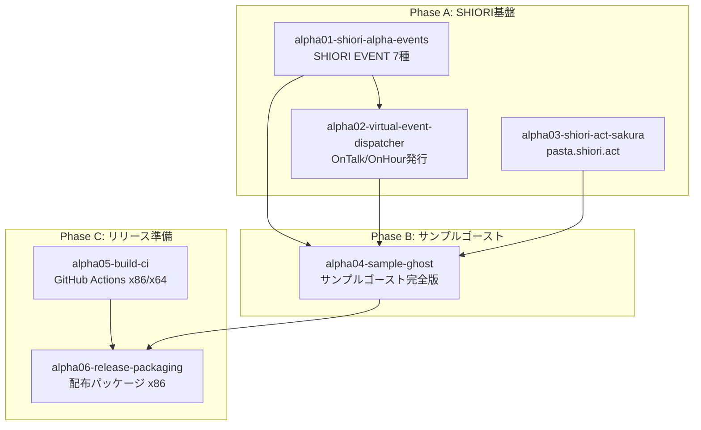
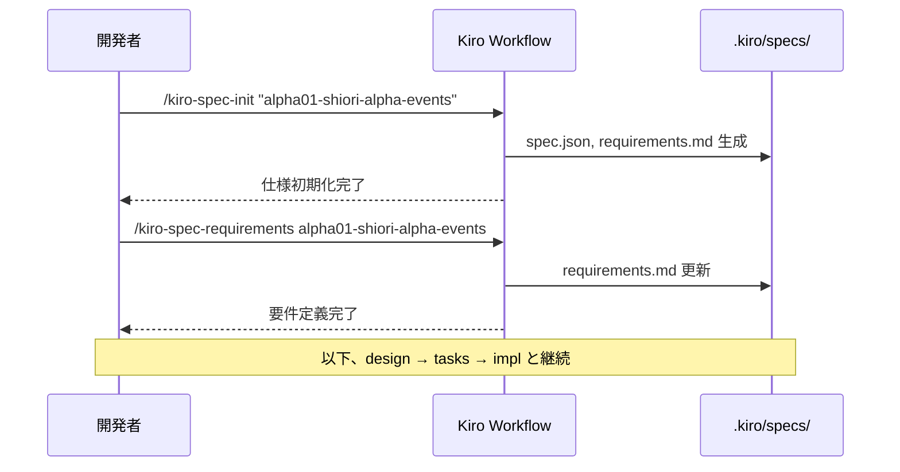

# Design Document

## Overview

**Purpose**: 本仕様は pasta アルファバージョンリリースに向けた**計画・組織仕様**である。6つの子仕様 `alpha01-` ～ `alpha06-` を体系的に立ち上げ、開発ロードマップを確立する。

**Users**: 開発リーダー、実装者、プロジェクトマネージャーが子仕様の立ち上げ・追跡に使用。

**Impact**: 本仕様完了後、6つの子仕様が `.kiro/specs/` に作成され、各子仕様で実装作業が開始可能となる。

**重要**: 本仕様の成果物は**子仕様の立ち上げ（ドキュメント生成）**であり、実際のコード実装は行わない。

### Goals
- 6子仕様の体系的な立ち上げ
- 子仕様間の依存関係の明確化
- Phase A/B/C ロードマップの確立
- 各子仕様の `/kiro-spec-init` コマンド提供

### Non-Goals
- Rust/Lua コードの実装
- SHIORI EVENT の完全サポート
- 複雑な会話ロジック
- SAORI/MAKOTO 等の外部連携

---

## Architecture

### Architecture Pattern & Boundary Map

本仕様は**組織・計画仕様**のため、コンポーネントアーキテクチャではなく**子仕様の構造と依存関係**を定義する。



**依存関係サマリー**:
- `alpha02` は `alpha01` に依存（OnSecondChange がトリガー）
- `alpha04` は `alpha01`, `alpha02`, `alpha03` に依存
- `alpha06` は全子仕様に依存（最終パッケージ）
- `alpha05` は独立進行可能（CI構築）

### Technology Stack

| Layer | Choice / Version | Role in Feature | Notes |
|-------|------------------|-----------------|-------|
| Planning | Kiro Spec-Driven | 仕様管理・進捗追跡 | 既存ワークフロー活用 |
| Documentation | Markdown | 子仕様ドキュメント | `.kiro/specs/` 配下 |
| Automation | `/kiro-spec-init` | 子仕様立ち上げ | コマンド例を提供 |

---

## System Flows

### 子仕様立ち上げフロー



---

## Requirements Traceability

| Requirement | Summary | Components | Interfaces | Flows |
|-------------|---------|------------|------------|-------|
| 1.1 | 命名規則 `alpha<2桁>-<機能名>` | 全子仕様 | - | - |
| 1.2 | 3カテゴリ分類 | 子仕様定義 | - | - |
| 1.3 | 依存関係明示 | 依存グラフ | - | 立ち上げフロー |
| 1.4 | 規模見積もり (S/M/L) | 子仕様定義 | - | - |
| 2.1 | SHIORI EVENT 7種 | alpha01 | REG/EVENT | - |
| 2.2 | 既存機構活用 | alpha01 | REG/EVENT | - |
| 2.3 | 仮想イベント発行 | alpha02 | 状態管理API | OnSecondChange |
| 2.4-2.5 | pasta.shiori.act | alpha03 | act:talk() | - |
| 2.6-2.7 | スタブ応答・Reference | alpha01 | - | - |
| 3.1 | サンプルゴースト立ち上げ | alpha04 | - | - |
| 3.2 | 最低限機能 | alpha04 | - | - |
| 3.3 | ディレクトリ構成 | alpha04 | pasta.toml | - |
| 3.4 | シンプルシェル | alpha04 | PNG画像 | - |
| 4.1 | ビルドCI | alpha05 | GitHub Actions | - |
| 4.2 | リリースワークフロー | alpha06 | - | タグ→ビルド→アップロード |
| 4.3 | バージョン体系 | alpha06 | - | - |
| 5.1 | Phase A/B/C グループ化 | ロードマップ | - | - |
| 5.2 | 完了条件 (DoD) | ロードマップ | - | - |
| 5.3 | コマンド例提示 | 立ち上げガイド | - | - |
| 6.1-6.3 | 既存仕様整合性 | 整合性チェック | - | - |

---

## Components and Interfaces

### 子仕様定義一覧

| 子仕様 | カテゴリ | Intent | Req Coverage | 規模 | 依存 |
|--------|---------|--------|--------------|------|------|
| alpha01-shiori-alpha-events | SHIORI基盤 | SHIORI EVENT 7種のハンドラ実装 | 2.1, 2.2, 2.6, 2.7 | M | - |
| alpha02-virtual-event-dispatcher | SHIORI基盤 | OnTalk/OnHour 仮想イベント発行 | 2.3 | M | alpha01 |
| alpha03-shiori-act-sakura | SHIORI基盤 | pasta.shiori.act さくらスクリプト組み立て | 2.4, 2.5 | M | - |
| alpha04-sample-ghost | サンプルゴースト | 動作するサンプルゴースト | 3.1, 3.2, 3.3, 3.4 | M | alpha01, alpha02, alpha03 |
| alpha05-build-ci | リリース準備 | GitHub Actions x86/x64 ビルド | 4.1 | S | - |
| alpha06-release-packaging | リリース準備 | x86 配布パッケージ + ドキュメント | 4.2, 4.3 | M | all |

---

### SHIORI基盤

#### alpha01-shiori-alpha-events

| Field | Detail |
|-------|--------|
| Intent | SHIORI EVENT 7種のハンドラ登録・スタブ応答実装 |
| Requirements | 2.1, 2.2, 2.6, 2.7 |

**Responsibilities & Constraints**
- 7種イベント: OnFirstBoot, OnBoot, OnClose, OnGhostChanged, OnSecondChange, OnMinuteChange, OnMouseDoubleClick
- 既存 `REG` / `EVENT` モジュール機構を活用
- Reference0〜Reference7 の解析・利用方法を仕様に含める

**Dependencies**
- Inbound: ベースウェア（SSP等）— SHIORI EVENT 送信 (P0)
- Outbound: RES モジュール — レスポンス組み立て (P0)

**Contracts**: Event [x]

##### Event Contract
- Subscribed events: OnFirstBoot, OnBoot, OnClose, OnGhostChanged, OnSecondChange, OnMinuteChange, OnMouseDoubleClick
- Published events: なし（RES でレスポンス返却）
- Ordering: ベースウェアからのシーケンシャル呼び出し

**Implementation Notes**
- Integration: `REG.OnBoot = function(req) ... end` パターンで登録
- Validation: `req.Reference0` 等の解析
- Risks: 特になし（既存機構活用）

---

#### alpha02-virtual-event-dispatcher

| Field | Detail |
|-------|--------|
| Intent | OnTalk/OnHour 仮想イベントの条件判定・発行 |
| Requirements | 2.3 |

**Responsibilities & Constraints**
- OnSecondChange をトリガーとして仮想イベント発行判定
- 状態管理: 前回トーク時刻、前回時報時刻、トーク中フラグ
- 設定読み込み: `pasta.toml` の `[ghost]` セクション
- 時刻判定: Rust提供の `req.date` テーブル使用

**Dependencies**
- Inbound: alpha01 — OnSecondChange イベント (P0)
- Outbound: EVENT — 仮想イベント fire (P0)
- External: pasta.toml — 設定値取得 (P1)

**Contracts**: State [x] / Event [x]

##### State Management
- State model:
  - `last_talk_time`: 前回トーク発行時刻（unix timestamp）
  - `last_hour_time`: 前回時報発行時刻（unix timestamp）
  - `is_talking`: トーク中フラグ（boolean）
- Persistence: メモリ内（セッション中のみ）
- Concurrency: シングルスレッド（SHIORI はシーケンシャル）

##### Event Contract
- Subscribed events: OnSecondChange
- Published events: OnTalk, OnHour（仮想）
- Ordering:
  - OnHour 判定優先（正時 + 非トーク中）
  - OnTalk 判定（非トーク中 + 経過時間 + 時報マージン）

**Implementation Notes**
- Integration: OnSecondChange ハンドラ内で判定ロジック実行
- Validation: `req.date.sec`, `req.date.min`, `req.date.hour` 等で時刻判定
- Risks: 状態管理の複雑さ（独立子仕様化で軽減）

---

#### alpha03-shiori-act-sakura

| Field | Detail |
|-------|--------|
| Intent | pasta.shiori.act モジュールによるさくらスクリプト組み立て |
| Requirements | 2.4, 2.5 |

**Responsibilities & Constraints**
- `pasta.act` モジュールを継承
- `act:talk()` 等によるさくらスクリプト生成インターフェース
- `\0`, `\s[0]`, `\e` 等のさくらスクリプトタグ生成

**Dependencies**
- Inbound: Pasta DSL トランスパイル結果 — act オブジェクト (P0)
- Outbound: RES モジュール — さくらスクリプト文字列 (P0)

**Contracts**: Service [x]

##### Service Interface
```lua
-- pasta.shiori.act モジュール
local ShioriAct = {}
ShioriAct.__index = ShioriAct
setmetatable(ShioriAct, { __index = require("pasta.act") })

function ShioriAct:talk(text)
  -- さくらスクリプト組み立て
  -- return self で連鎖可能
end

function ShioriAct:surface(id)
  -- \s[id] タグ追加
end

function ShioriAct:wait(ms)
  -- \w[ms] タグ追加
end

function ShioriAct:build()
  -- 最終さくらスクリプト文字列を返却
end
```
- Preconditions: act オブジェクトが初期化済み
- Postconditions: さくらスクリプト文字列が生成される
- Invariants: `\e` で終端

**Implementation Notes**
- Integration: `pasta.act` の継承パターン遵守
- Validation: さくらスクリプトタグの適切なエスケープ
- Risks: さくらスクリプト仕様の理解が必要

---

### サンプルゴースト

#### alpha04-sample-ghost

| Field | Detail |
|-------|--------|
| Intent | 動作するサンプルゴーストの完全実装 |
| Requirements | 3.1, 3.2, 3.3, 3.4 |

**Responsibilities & Constraints**
- 最低限機能: 起動挨拶、ダブルクリック反応、終了挨拶
- ディレクトリ構成テンプレート定義
- シンプルシェル（ピクトグラム風PNG）独自作成

**Dependencies**
- Inbound: alpha01 — SHIORI EVENT ハンドラ (P0)
- Inbound: alpha02 — 仮想イベント発行 (P0)
- Inbound: alpha03 — さくらスクリプト組み立て (P0)

**Contracts**: なし（成果物はファイル群）

**ディレクトリ構成テンプレート**
```
ghost/master/
├── pasta.toml              # 設定ファイル
├── dic/                    # Pasta DSL スクリプト
│   ├── boot.pasta          # 起動・終了トーク
│   ├── talk.pasta          # ランダムトーク
│   └── click.pasta         # クリック反応
├── scripts/pasta/shiori/   # Lua カスタムハンドラ（任意）
│   └── custom.lua
└── shell/master/           # シェル素材
    ├── descript.txt        # シェル設定
    ├── surface0.png        # メインキャラ
    ├── surface1.png        # サブキャラ（任意）
    └── surfaces.txt        # サーフェス定義
```

**Implementation Notes**
- Integration: alpha01/02/03 完了後に実装
- Validation: SSP での動作確認
- Risks: シェル素材作成の工数

---

### リリース準備

#### alpha05-build-ci

| Field | Detail |
|-------|--------|
| Intent | GitHub Actions による x86/x64 DLL ビルド |
| Requirements | 4.1 |

**Responsibilities & Constraints**
- Windows ターゲット: `i686-pc-windows-msvc`, `x86_64-pc-windows-msvc`
- `pasta.dll` 生成確認
- テスト実行（`cargo test --all`）

**Dependencies**
- External: GitHub Actions — Windows Runner (P0)
- External: Rust toolchain — 1.83+ (P0)

**Contracts**: Batch [x]

##### Batch / Job Contract
- Trigger: push to main, pull_request
- Input: ソースコード
- Output: `pasta.dll` (x86, x64)
- Validation: ビルド成功、テストパス

**Implementation Notes**
- Integration: `.github/workflows/build.yml` 作成
- Validation: `cargo build --target i686-pc-windows-msvc --release`
- Risks: クロスコンパイル設定の複雑さ

---

#### alpha06-release-packaging

| Field | Detail |
|-------|--------|
| Intent | x86 配布パッケージ + ドキュメント作成 |
| Requirements | 4.2, 4.3 |

**Responsibilities & Constraints**
- x86（32bit）版 `pasta.dll` のみ配布
- サンプルゴースト同梱
- README（インストール手順、動作確認方法）
- バージョン番号: `0.1.0-alpha.1` 形式

**Dependencies**
- Inbound: alpha01-05 — 全成果物 (P0)
- External: GitHub Releases — 配布チャネル (P1)

**Contracts**: Batch [x]

##### Batch / Job Contract
- Trigger: タグ push (`v0.1.0-alpha.*`)
- Input: ビルド成果物、サンプルゴースト
- Output: ZIP アーカイブ（GitHub Releases）
- Validation: ダウンロード・展開・動作確認

**Implementation Notes**
- Integration: release workflow 追加
- Validation: SSP でのインストール確認
- Risks: アーカイブ構成の互換性

---

## Data Models

本仕様はコード実装を伴わないため、データモデル定義は対象外。各子仕様の設計フェーズで個別に定義する。

---

## Error Handling

本仕様は計画・組織仕様のため、エラーハンドリング定義は対象外。

---

## Testing Strategy

### 本仕様のテスト

本仕様は子仕様の立ち上げが成果物のため、以下を検証：

1. **子仕様生成確認**: 6つの `alpha0X-*` ディレクトリが `.kiro/specs/` に存在
2. **依存関係検証**: 各 `spec.json` に依存情報が記載
3. **コマンド実行確認**: `/kiro-spec-init` が正常動作

### 各子仕様のテスト（子仕様設計フェーズで詳細化）

| 子仕様 | テスト重点 |
|--------|-----------|
| alpha01 | イベントハンドラ登録・発火、RES 生成 |
| alpha02 | 状態管理、時刻判定、仮想イベント発火 |
| alpha03 | さくらスクリプト生成、タグエスケープ |
| alpha04 | SSP 動作確認、E2E テスト |
| alpha05 | CI ビルド成功、テストパス |
| alpha06 | アーカイブ展開・動作確認 |

---

## Phase ロードマップ

### Phase A: SHIORI基盤（最優先）

**対象子仕様**: alpha01, alpha02, alpha03

**並行作業可能**: alpha01/alpha03 は並行可能、alpha02 は alpha01 完了後

**完了条件 (DoD)**:
- [ ] 7種 SHIORI EVENT のハンドラ登録完了
- [ ] OnTalk/OnHour 仮想イベント発行動作確認
- [ ] pasta.shiori.act によるさくらスクリプト生成確認
- [ ] 関連ユニットテストパス

### Phase B: サンプルゴースト（Phase A 完了後）

**対象子仕様**: alpha04

**完了条件 (DoD)**:
- [ ] サンプルゴーストディレクトリ構成完成
- [ ] SSP での起動・終了確認
- [ ] ダブルクリック反応確認
- [ ] シンプルシェル画像配置

### Phase C: リリース準備（Phase A/B 完了後）

**対象子仕様**: alpha05, alpha06

**並行作業可能**: alpha05 は Phase A/B と並行可能

**完了条件 (DoD)**:
- [ ] GitHub Actions で x86/x64 ビルド成功
- [ ] x86 配布 ZIP アーカイブ生成
- [ ] GitHub Releases へのアップロード確認
- [ ] README ドキュメント完成

---

## 子仕様立ち上げコマンド一覧

### Phase A

```powershell
# alpha01: SHIORI EVENT
/kiro-spec-init "SHIORI EVENT 7種（OnFirstBoot, OnBoot, OnClose, OnGhostChanged, OnSecondChange, OnMinuteChange, OnMouseDoubleClick）のハンドラ登録・スタブ応答実装。既存 REG/EVENT 機構を活用。" alpha01-shiori-alpha-events

# alpha02: 仮想イベント発行機構
/kiro-spec-init "OnSecondChange をトリガーとした仮想イベント発行機構。OnTalk（定期ランダムトーク）、OnHour（時報）の条件判定・発行。状態管理（前回トーク時刻等）、pasta.toml 設定読み込み、req.date による時刻判定を実装。" alpha02-virtual-event-dispatcher

# alpha03: pasta.shiori.act
/kiro-spec-init "pasta.act を継承した pasta.shiori.act モジュール。act:talk()、act:surface()、act:wait() 等によるさくらスクリプト組み立てインターフェースを提供。" alpha03-shiori-act-sakura
```

### Phase B

```powershell
# alpha04: サンプルゴースト
/kiro-spec-init "動作するサンプルゴースト完全版。起動挨拶（OnBoot）、ダブルクリック反応、終了挨拶（OnClose）、ランダムトーク（OnTalk）。ディレクトリ構成テンプレート、シンプルシェル（ピクトグラム風PNG）を含む。" alpha04-sample-ghost
```

### Phase C

```powershell
# alpha05: ビルドCI
/kiro-spec-init "GitHub Actions による Windows x86/x64 DLL ビルド CI。i686-pc-windows-msvc、x86_64-pc-windows-msvc 両ターゲット。cargo test 実行。" alpha05-build-ci

# alpha06: リリースパッケージ
/kiro-spec-init "x86 配布パッケージ作成。pasta.dll + サンプルゴースト同梱 ZIP アーカイブ。GitHub Releases へのタグ駆動アップロード。README ドキュメント（インストール手順、動作確認方法）。バージョン体系 0.1.0-alpha.1。" alpha06-release-packaging
```

---

## 既存仕様との整合性

### lua55-manual-consistency
- **関係**: 並行作業可能、依存なし
- **影響**: ドキュメント整備のみ

### ukagaka-desktop-mascot
- **関係**: 本仕様はサブセット的先行実装
- **方針**: 重複許容、アルファリリースに集中
- **将来**: メタ仕様への統合は後続検討

### 完了済み仕様の再利用
- `shiori-event-module`: EVENT/REG 機構 → alpha01 で活用
- `shiori-res-module`: RES 機構 → alpha01/03 で活用
- `shiori-entry`: エントリーポイント → そのまま使用

---

*Generated by kiro-spec-design command*

