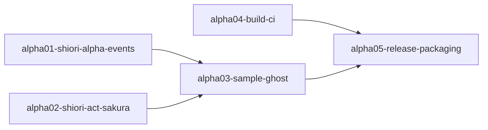

# Gap Analysis Report

| 項目 | 内容 |
|------|------|
| **Feature** | alpha-release-planning |
| **Date** | 2026-01-30 |
| **Status** | Analysis Complete |

---

## Executive Summary

本仕様は**計画・組織仕様**であり、成果物は子仕様の立ち上げ（ドキュメント生成）である。コード実装は行わないため、従来のギャップ分析とは性質が異なる。本分析では、子仕様立ち上げに必要な**既存資産の棚卸し**と**子仕様スコープ策定の材料**を提供する。

### Key Findings

1. ✅ **SHIORI基盤は高い完成度** - EVENT/REG/RESモジュール実装済み、ハンドラ登録機構稼働中
2. ✅ **DLLビルド設定済み** - `pasta_shiori` は `cdylib` 出力対応、Windows依存設定完備
3. ⚠️ **GitHub Actions未構築** - `.github/workflows/` が存在しない（CI/CD子仕様で新規作成）
4. ⚠️ **サンプルゴースト不在** - テスト用fixtureはあるが配布可能なサンプル未作成
5. 📋 **ukagaka-desktop-mascot との関係整理が必要** - 32子仕様の巨大メタ仕様が存在

---

## 1. Current State Investigation

### 1.1 SHIORI基盤の現状

| コンポーネント | ファイル | 状態 | 備考 |
|---------------|---------|------|------|
| SHIORI Protocol | [shiori.rs](../../../crates/pasta_shiori/src/shiori.rs) | ✅ 完成 | load/request/unload 実装済み |
| Request Parser | [lua_request.rs](../../../crates/pasta_shiori/src/lua_request.rs) | ✅ 完成 | Reference0〜n 解析済み |
| EVENT Module | [event/init.lua](../../../crates/pasta_lua/scripts/pasta/shiori/event/init.lua) | ✅ 完成 | fire() / no_entry() 実装済み |
| REG Module | [event/register.lua](../../../crates/pasta_lua/scripts/pasta/shiori/event/register.lua) | ✅ 完成 | ハンドラ登録テーブル |
| RES Module | [res.lua](../../../crates/pasta_lua/scripts/pasta/shiori/res.lua) | ✅ 完成 | ok() / no_content() / err() |
| Default Boot | [event/boot.lua](../../../crates/pasta_lua/scripts/pasta/shiori/event/boot.lua) | ✅ 完成 | デフォルトOnBoot |
| Entry Point | [entry.lua](../../../crates/pasta_lua/scripts/pasta/shiori/entry.lua) | ✅ 完成 | SHIORI.request() → EVENT.fire() |

**完了済み仕様**:
- `shiori-event-module` - イベントディスパッチ機構
- `shiori-res-module` - レスポンス組み立て
- `shiori-entry` - SHIORIエントリーポイント

### 1.2 ビルド・配布基盤の現状

| コンポーネント | 状態 | 備考 |
|---------------|------|------|
| DLL出力設定 | ✅ 完成 | `crate-type = ["cdylib", "rlib"]`, `name = "pasta"` |
| Windows依存 | ✅ 完成 | `windows-sys 0.59` 設定済み |
| pasta.toml設定 | ✅ 完成 | `PastaConfig` / `LoaderConfig` 実装済み |
| GitHub Actions | ❌ 未作成 | `.github/workflows/` ディレクトリ不在 |
| リリースワークフロー | ❌ 未作成 | タグ駆動ビルド未設定 |
| サンプルゴースト | ❌ 未作成 | テスト fixture のみ |

### 1.3 テスト資産

| カテゴリ | ファイル数 | 備考 |
|---------|-----------|------|
| SHIORI Event Tests | 470+ lines | `shiori_event_test.rs` - 包括的テスト |
| Loader Tests | 多数 | `loader_integration_test.rs` |
| Lua Specs | 多数 | `tests/lua_specs/` |
| Total Tests | 340+ | 全パス確認済み |

### 1.4 既存仕様との関係

#### lua55-manual-consistency（進行中）
- **関係**: 並行作業可能、依存なし
- **影響**: ドキュメント整備のみ、機能実装に影響なし

#### ukagaka-desktop-mascot（完了・保留）
- **関係**: 本仕様は `ukagaka-desktop-mascot` の**サブセット的先行実装**
- **32子仕様の内訳**:
  - `wintf-*`: 7件（UIウィジェット基盤）
  - `areka-*`: 多数（MCPサーバー基盤）
  - `pasta-*`: スクリプトエンジン関連
- **影響**: 本仕様の子仕様は `ukagaka-desktop-mascot` の一部を先行実装する形
- **方針**: 重複は許容（本仕様はアルファ最小限、メタ仕様は完全版）

---

## 2. Requirements Feasibility Analysis

### 2.1 Requirement → 既存資産マッピング

| 要件 | 既存資産 | Gap | 備考 |
|------|---------|-----|------|
| **Req 1**: 子仕様体系設計 | - | N/A | 新規ドキュメント作成 |
| **Req 2**: SHIORI基盤子仕様 | EVENT/REG/RES完成 | **Medium** | ハンドラ実装 + pasta.shiori.act新規作成 |
| **Req 3**: サンプルゴースト子仕様 | テストfixture参考可 | **Medium** | 配布用構成新規作成 |
| **Req 4**: リリース準備子仕様 | DLLビルド設定済み | **Medium** | CI/CD新規構築 |
| **Req 5**: ロードマップ作成 | - | N/A | 新規ドキュメント作成 |
| **Req 6**: 既存仕様整合性 | 完了仕様26件、進行中2件 | **Low** | 整理・参照のみ |

### 2.2 SHIORI EVENT サポート状況

| イベント | 既存実装 | 子仕様でのスコープ |
|---------|---------|-------------------|
| OnFirstBoot | ❌ 未実装 | 新規ハンドラ追加 |
| OnBoot | ✅ デフォルト実装あり（204返却） | カスタム応答追加 |
| OnClose | ❌ 未実装 | 新規ハンドラ追加 |
| OnGhostChanged | ❌ 未実装 | 新規ハンドラ追加 |
| OnSecondChange | ❌ 未実装 | 仮想イベント発行機構（OnTalk/OnHour判定） |
| OnMinuteChange | ❌ 未実装 | 新規ハンドラ追加 |
| OnMouseDoubleClick | ❌ 未実装 | 新規ハンドラ追加 |
| OnTalk（仮想） | ❌ 未実装 | 定期トーク発行機構 |
| OnHour（仮想） | ❌ 未実装 | 時報発行機構 |

**備考**: 既存のEVENT機構により、ハンドラ追加は `REG.EventName = function(req) ... end` で簡潔に実装可能。

### 2.3 ゴーストディレクトリ構成（既存仕様）

```
ghost/master/                    # load_dir
├── pasta.toml                   # ✅ 設定読み込み実装済み
├── dic/                         # ✅ パターン設定済み (dic/*/*.pasta)
│   └── *.pasta
├── scripts/pasta/shiori/        # ✅ Luaモジュール検索パス設定済み
│   └── (カスタムハンドラ)
└── profile/pasta/               # ✅ ランタイム生成
    ├── save/                    # ✅ 永続化実装済み
    ├── cache/                   # ✅ キャッシュ実装済み
    └── logs/                    # ✅ ロギング実装済み
```

---

## 3. Implementation Approach Options

### 3.1 子仕様構成案

#### Option A: 最小構成（3子仕様）

| 子仕様 | スコープ | 規模 |
|--------|---------|------|
| alpha01-shiori-minimum-events | OnBoot/OnClose/OnMouseDoubleClick のみ | S |
| alpha02-sample-ghost-basic | 最小限のサンプルゴースト | M |
| alpha03-release-workflow | CI/CD + 配布パッケージ | M |

**Trade-offs**:
- ✅ 最短でアルファリリース到達
- ✅ 子仕様管理が容易
- ❌ 各子仕様が大きくなりがち

#### Option B: 機能分割構成（5-6子仕様）

| 子仕様 | スコープ | 規模 |
|--------|---------|------|
| alpha01-shiori-lifecycle-events | OnFirstBoot/OnBoot/OnClose/OnGhostChanged | S |
| alpha02-shiori-user-events | OnMouseDoubleClick | S |
| alpha03-sample-ghost-structure | ディレクトリ構成・pasta.toml | S |
| alpha04-sample-ghost-scripts | Pasta DSL サンプルスクリプト | M |
| alpha05-github-actions-build | Windows x64 DLLビルドCI | S |
| alpha06-release-package | 配布アーカイブ・ドキュメント | M |

**Trade-offs**:
- ✅ 責務分離が明確
- ✅ 並行作業しやすい
- ❌ 子仕様間の依存管理が複雑

#### Option C: 推奨構成（5子仕様）

| 子仕様 | スコープ | 規模 | 依存 |
|--------|---------|------|------|
| alpha01-shiori-alpha-events | 必要最低限SHIORI EVENT（6種） | M | - |
| alpha02-shiori-act-sakura | pasta.shiori.act モジュール（さくらスクリプト組み立て） | M | - |
| alpha03-sample-ghost | サンプルゴースト完全版 | M | alpha01, alpha02 |
| alpha04-build-ci | GitHub Actions + DLLビルド（x86/x64） | S | - |
| alpha05-release-packaging | 配布パッケージ（x86） + README | M | alpha01, alpha02, alpha03, alpha04 |

**Trade-offs**:
- ✅ 適度な粒度で管理しやすい
- ✅ pasta.shiori.act を独立した子仕様として実装
- ✅ 依存関係が明確
- ✅ Phase A/B/Cに自然にマッピング

---

## 4. Effort & Risk Assessment

### 4.1 子仕様別見積もり

| 子仕様カテゴリ | 規模 | リスク | 根拠 |
|---------------|------|--------|------|
| SHIORI EVENT | **M** | **Medium** | ハンドラ追加 + 仮想イベント発行機構（OnTalk/OnHour） |
| pasta.shiori.act | **M** | **Medium** | 新規モジュール、さくらスクリプト仕様理解必要 |
| サンプルゴースト | **M** | **Medium** | 新規コンテンツ作成、動作検証必要 |
| ビルドCI | **S** | **Low** | x86/x64両ビルド確認、標準的なGitHub Actions設定 |
| リリースパッケージ | **M** | **Medium** | x86版DLL + アーカイブ構成・ドキュメント作成 |

### 4.2 全体見積もり

| 項目 | 見積もり |
|------|---------|
| 総子仕様数 | 5件（推奨Option C） |
| 総工数 | **3-4週間**（1人作業想定） |
| クリティカルパス | alpha01, alpha02 → alpha03 → alpha05 |
| 並行可能 | alpha04（CI構築）は独立して進行可能 |

---

## 5. Research Needed (Design Phase)

以下の項目は設計フェーズで詳細調査が必要：

1. **GitHub Actions Windows ビルド環境**
   - `i686-pc-windows-msvc` (x86) + `x86_64-pc-windows-msvc` (x64) 両ターゲット
   - リリース配布は x86 のみ（伺かゴースト互換性）
   - Cross-compilation vs Native Windows Runner

2. **配布アーカイブ形式**
   - ZIP vs 7z vs NARアーカイブ
   - SSP互換インストーラー要否

3. **サンプルゴーストシェル素材** ✅ 決定
   - 記号的シンプルシェル（男の子・女の子のピクトグラム風）を独自作成
   - 最小限PNG画像で実装（設計/実装フェーズで素材作成）

4. **バージョン番号体系**
   - `0.1.0-alpha.1` vs `0.0.1-alpha` vs `0.1.0-alpha1`

---

## 6. Recommendations

### 6.1 推奨アプローチ

**Option C（5子仕様構成）を推奨**。以下の理由による:

1. **既存資産を最大活用**: EVENT/REG機構にハンドラ追加で SHIORI EVENT完成
2. **pasta.shiori.act を独立子仕様化**: さくらスクリプト組み立て機能を明確に分離
3. **依存関係が明確**: Phase A（基盤）→ Phase B（ゴースト）→ Phase C（リリース）
4. **並行作業可能**: alpha04（CI）は独立進行

### 6.2 子仕様立ち上げ順序



### 6.3 ukagaka-desktop-mascot との関係

- **本仕様はサブセット**: 32子仕様の巨大メタ仕様から最小限を先行抽出
- **重複許容**: 将来的な統合は考慮せず、アルファリリースに集中
- **参照活用**: `areka-P0-script-engine` 等の設計思想は参考に

---

## 7. Conclusion

### ギャップ評価サマリー

| カテゴリ | ギャップ | 対応難易度 |
|---------|---------|-----------|
| SHIORI EVENT機構 | ✅ 完成済み | - |
| イベントハンドラ | ⚠️ 個別実装必要 | Low || 仮想イベント発行 | ❌ 未実装 | Medium || pasta.shiori.act | ❌ 未実装 | Medium |
| DLLビルド設定 | ✅ 完成済み | - |
| CI/CD | ❌ 未構築 | Low |
| サンプルゴースト | ❌ 未作成 | Medium |
| 配布パッケージ | ❌ 未作成 | Medium |

### 次のステップ

1. 要件定義を承認し、設計フェーズへ進む
2. 設計フェーズで4子仕様の詳細スコープを確定
3. `/kiro-spec-init` で各子仕様を順次立ち上げ

---

*Generated by kiro-validate-gap command*
