# Technical Design: SHIORI EVENT ハンドラ登録・スタブ応答

## 1. Overview

### 1.1 Summary
SHIORI/3.0 プロトコルにおける 7 種の主要イベント（OnFirstBoot, OnBoot, OnClose, OnGhostChanged, OnSecondChange, OnMinuteChange, OnMouseDoubleClick）のハンドラ登録機構とスタブ応答生成を実現する。既存の EVENT/REG/RES モジュールを活用し、シーン関数フォールバックを追加することで、ゴースト開発者が直感的にイベント処理を記述できる環境を提供する。

### 1.2 Goals
- ゴースト開発者が 7 種の SHIORI イベントを Lua 関数で処理可能にする
- REG テーブルへのハンドラ登録による明示的なイベントハンドリング
- シーン関数フォールバックによる暗黙的なイベントハンドリング
- LUA_API.md への包括的なドキュメント提供

### 1.3 Non-Goals
- さくらスクリプト組み立て（alpha03 スコープ）
- 他の SHIORI イベント種別のサポート
- パフォーマンス最適化

### 1.4 Requirements Traceability

| Requirement ID | Design Section | Status |
|---------------|----------------|--------|
| REQ-01 | 3.1 EVENT.fire | 既存実装で充足 |
| REQ-02 | 3.2 REG テーブル | 既存実装で充足 |
| REQ-03 | 3.3 RES モジュール | 既存実装で充足 |
| REQ-04 | 3.1 EVENT.fire | 既存実装で充足 |
| REQ-05 | 2.2 OnBoot デフォルトハンドラ | 既存実装で充足 |
| REQ-06 | 4.2 テスト戦略 | テスト拡張 |
| REQ-07 | 3.4 シーン関数フォールバック | **新規実装** |
| REQ-08 | 4.3 ドキュメント | ドキュメント追加 |

## 2. Architecture

### 2.1 System Context

```mermaid
graph TB
    subgraph "SSP (ベースウェア)"
        SSP[SSP Process]
    end
    
    subgraph "pasta_shiori.dll (SHIORI)"
        SHIORI[SHIORI Entrypoint]
        LUA[Lua Runtime]
    end
    
    subgraph "Lua Modules"
        EVENT[pasta.shiori.event]
        REG[pasta.shiori.event.register]
        RES[pasta.shiori.res]
        SCENE[pasta.scene]
    end
    
    SSP -->|"SHIORI/3.0 request"| SHIORI
    SHIORI -->|"parse & dispatch"| LUA
    LUA --> EVENT
    EVENT --> REG
    EVENT --> SCENE
    EVENT --> RES
    RES -->|"SHIORI/3.0 response"| SSP
```



### 2.2 イベントディスパッチフロー


### 2.3 モジュール依存関係


## 3. Component Design

### 3.1 EVENT.fire（既存・変更なし）

**責務**: SHIORI リクエストを受け取り、適切なハンドラにディスパッチ

```lua
-- 既存実装（変更なし）
function EVENT.fire(req)
    local handler = REG[req.id] or EVENT.no_entry
    local ok, result = xpcall(handler, debug.traceback, req)
    if not ok then
        return RES.err(result)
    end
    return result or RES.no_content()
end
```

**設計判断**: fire 関数はハンドラ選択とエラーハンドリングに専念。シーン関数フォールバックは no_entry に委譲。

### 3.2 REG テーブル（既存・変更なし）

**責務**: イベント ID からハンドラ関数へのマッピング

```lua
-- 使用例
local REG = require("pasta.shiori.event.register")

REG.OnBoot = function(req)
    return RES.ok("\\h\\s[0]起動しました。\\e")
end

REG.OnClose = function(req)
    return RES.ok("\\h\\s[0]終了します。\\e")
end
```

**サポートイベント ID**:
- `OnFirstBoot` — 初回起動
- `OnBoot` — 通常起動
- `OnClose` — 終了
- `OnGhostChanged` — ゴースト切り替え
- `OnSecondChange` — 毎秒
- `OnMinuteChange` — 毎分
- `OnMouseDoubleClick` — ダブルクリック

### 3.3 RES モジュール（既存・変更なし）

**責務**: SHIORI/3.0 レスポンス文字列の生成

| 関数 | 説明 | HTTP相当 |
|------|------|----------|
| `RES.ok(value)` | 200 OK + Value | 200 |
| `RES.ok_with(headers)` | 200 OK + 複数ヘッダ | 200 |
| `RES.no_content()` | 204 No Content | 204 |
| `RES.err(message)` | 500 Internal Server Error | 500 |

### 3.4 EVENT.no_entry（拡張）

**責務**: 未登録イベントのフォールバック処理（シーン関数検索を追加）

**現在の実装**:
```lua
function EVENT.no_entry(req)
    return RES.no_content()
end
```

**拡張後の実装**:
```lua
function EVENT.no_entry(req)
    -- シーン関数をイベント名で検索
    local SCENE = require("pasta.scene")
    local scene_result = SCENE.search(req.id, nil, nil)
    
    if scene_result then
        -- シーン関数が見つかった場合、呼び出し
        -- alpha01: 戻り値は無視、204 返却
        -- alpha03: act オブジェクト生成、さくらスクリプト変換
        local ok, err = pcall(scene_result)
        if not ok then
            return RES.err(err)
        end
    end
    
    return RES.no_content()
end
```

**設計判断**:
- `SCENE.search` は遅延ロード（循環参照回避）
- alpha01 では act オブジェクト未生成（alpha03 で統合）
- シーン関数の戻り値は無視し、204 No Content 固定

### 3.5 OnBoot デフォルトハンドラ（既存・変更なし）

**ファイル**: `pasta.shiori.event.boot.lua`

```lua
local REG = require("pasta.shiori.event.register")
local RES = require("pasta.shiori.res")

REG.OnBoot = function(req)
    return RES.ok("\\h\\s[0]Hello, World!\\e")
end
```

## 4. Implementation Strategy

### 4.1 変更ファイル一覧

| ファイル | 変更種別 | 説明 |
|---------|---------|------|
| `pasta/shiori/event/init.lua` | 修正 | `EVENT.no_entry` にシーン関数フォールバック追加 |
| `tests/shiori_event_test.rs` | 拡張 | 7 種イベントテスト追加 |
| `LUA_API.md` | 追加 | SHIORI EVENT セクション追加 |

### 4.2 テスト戦略

**単体テスト**（Lua）:
- `EVENT.fire` の REG ハンドラ呼び出し確認
- `EVENT.no_entry` のシーン関数フォールバック確認
- 各 RES 関数の出力形式確認

**統合テスト**（Rust: `shiori_event_test.rs`）:
- 7 種イベント個別のハンドラ登録・呼び出し
- シーン関数フォールバックの動作確認
- エラーハンドリング（xpcall）の確認

**受入テスト**:
- SSP からの SHIORI/3.0 リクエスト処理（手動）

### 4.3 ドキュメント構成

`LUA_API.md` セクション 2 に追加:

```markdown
## 2. SHIORI EVENT ハンドラ

### 2.1 概要
SHIORI/3.0 プロトコルのイベントハンドリング機構の説明

### 2.2 REG テーブルへの登録
ハンドラ関数の登録方法とサンプルコード

### 2.3 サポートイベント一覧
7種のイベント（OnFirstBoot, OnBoot, OnClose, OnGhostChanged, OnSecondChange, OnMinuteChange, OnMouseDoubleClick）の詳細

各イベントごとに以下を記載:
- 発火タイミング
- Reference パラメータの意味（Requirement 3 の仕様を反映）
- 応答サンプルコード

### 2.4 RES レスポンス生成
RES.ok(), RES.no_content(), RES.err() の使用方法

### 2.5 シーン関数フォールバック
Pastaスクリプトでのイベントハンドリング（＊OnBoot 等のグローバルシーン利用）

### 2.6 エラーハンドリング
xpcall によるエラーキャッチと RES.err() の使用
```

## 5. Data Models

### 5.1 Request オブジェクト

```lua
--- @class ShioriRequest
--- @field id string イベント ID（例: "OnBoot"）
--- @field reference table Reference ヘッダのテーブル（0始まりインデックス）
--- @field raw string 生の SHIORI リクエスト文字列
```

**Reference パラメータ仕様**:
- `req.reference[0]` ～ `req.reference[7]` で各イベント固有パラメータにアクセス
- 存在しない Reference にアクセスした場合は `nil` を返す
- 各イベントの Reference 意味は以下の通り:

| イベント | Reference0 | Reference1 | その他 |
|---------|-----------|-----------|--------|
| **OnFirstBoot** | バニッシュ復帰フラグ ("0" or "1") | - | - |
| **OnBoot** | シェル名 | - | Reference6: シェルパス, Reference7: ゴーストパス |
| **OnClose** | 終了理由 ("user", "shutdown" 等) | - | - |
| **OnGhostChanged** | 切り替え先ゴースト名 | 切り替え元ゴースト名 | - |
| **OnSecondChange** | 現在秒 | 累積秒 | - |
| **OnMinuteChange** | 現在分 | 現在時 | - |
| **OnMouseDoubleClick** | スコープ (0: sakura, 1: kero) | - | Reference4: 当たり判定 ID |

### 5.2 Response 文字列

```
SHIORI/3.0 200 OK
Charset: UTF-8
Value: \h\s[0]Hello, World!\e

```

### 5.3 シーン検索結果

```lua
--- @class SceneResult
--- @field [1] string グローバルシーン名
--- @field [2] string ローカルシーン名
--- @field [3] function シーン関数
--- __call メタメソッド: function(act, ...) -> any
```

## 6. Error Handling

### 6.1 エラー種別

| エラー | 発生箇所 | 対処 |
|--------|---------|------|
| ハンドラ実行時例外 | EVENT.fire xpcall | RES.err(traceback) |
| シーン関数実行時例外 | EVENT.no_entry pcall | RES.err(message) |
| REG テーブル未登録 | EVENT.fire | no_entry フォールバック |
| シーン関数未発見 | SCENE.search | 204 No Content |

### 6.2 エラーレスポンス形式

```
SHIORI/3.0 500 Internal Server Error
Charset: UTF-8
Value: error message with traceback

```

## 7. Security Considerations

- **入力検証**: `req.id` はパースされた SHIORI ヘッダから取得、Rust 側で検証済み
- **サンドボックス**: Lua 実行環境は mlua のサンドボックス機能で制限
- **エラー情報漏洩**: traceback は開発時のみ有用、プロダクションでは簡略化を検討（将来）

## 8. Future Considerations

### 8.1 alpha03 統合

シーン関数フォールバック時の act オブジェクト生成:

```lua
function EVENT.no_entry(req)
    local SCENE = require("pasta.scene")
    local ACT = require("pasta.act")
    local CTX = require("pasta.ctx")
    
    local scene_result = SCENE.search(req.id, nil, nil)
    
    if scene_result then
        local ctx = CTX.new(req)
        local act = ACT.new(ctx)
        local ok, err = pcall(scene_result, act)
        if not ok then
            return RES.err(err)
        end
        -- alpha03: act.token からさくらスクリプト生成
        return RES.ok(act:finalize())
    end
    
    return RES.no_content()
end
```

### 8.2 追加イベントサポート

優先度順:
1. `OnKeyPress` — キー入力
2. `OnSurfaceChange` — サーフェス変更
3. `OnAnchorSelect` — 選択肢クリック
4. `OnCommunicate` — ゴースト間通信
