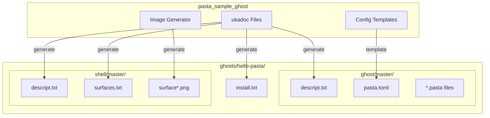
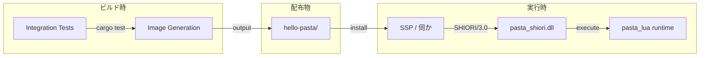
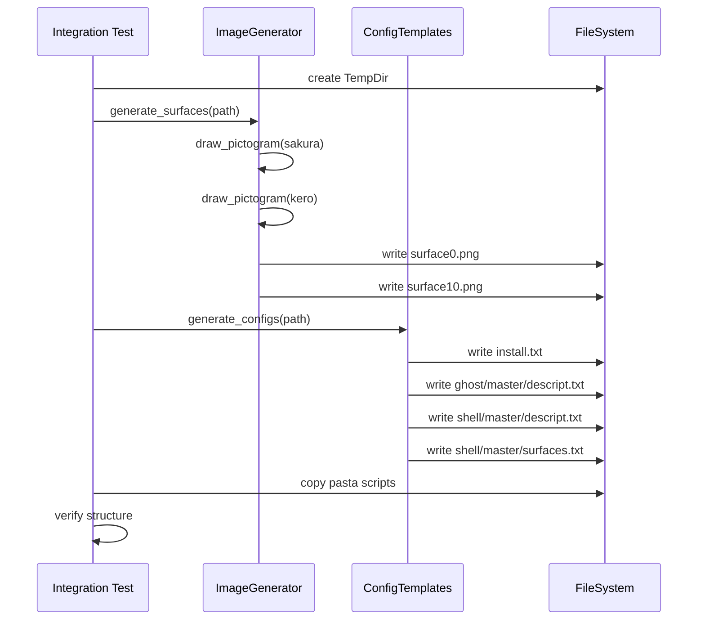
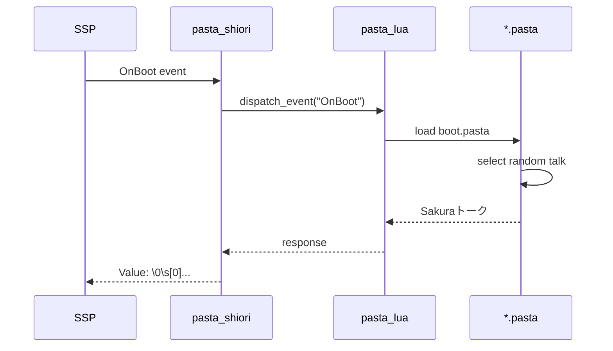
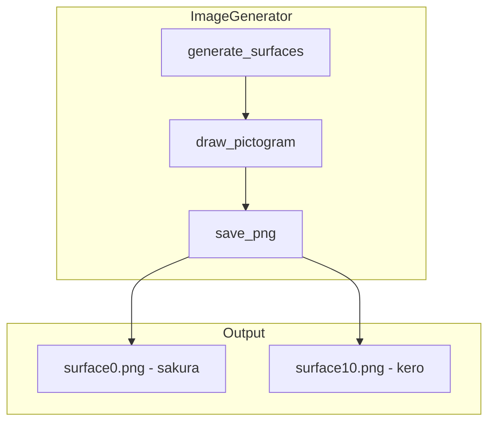
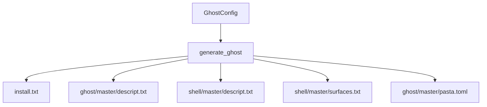
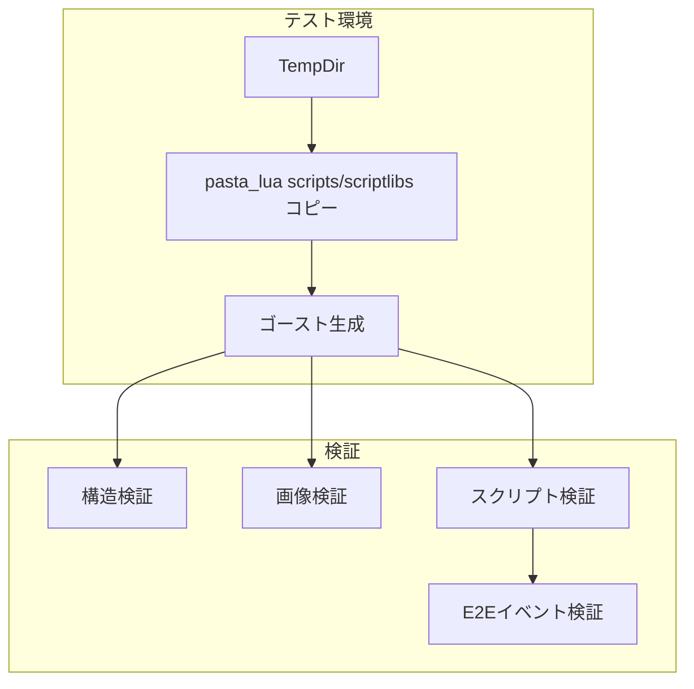

# Technical Design: alpha04-sample-ghost

## Overview

### 機能概要

hello-pasta ゴーストは、pasta システムの入門者向けサンプルとして、SHIORI/3.0 プロトコルで動作するミニマルなゴーストを提供する。画像生成を含む自己完結型ゴーストとして、インストール直後から動作可能な状態を実現する。

### 技術的アプローチ



### ユーザーストーリーマッピング

| ユーザーストーリー | 実現方法 |
|-------------------|---------|
| pasta入門者がすぐに動くゴーストを体験 | 自己完結型ディストリビューション |
| DSL学習のリファレンス取得 | イベント別に分離されたスクリプト |
| カスタマイズの出発点 | コメント付きの pasta.toml テンプレート |

---

## Architecture

### 高レベルアーキテクチャ



### クレート構成

```
crates/pasta_sample_ghost/
├── Cargo.toml              # 依存: image 0.25, imageproc 0.25, pasta_lua (dev)
├── README.md               # クレートドキュメント
├── src/
│   ├── lib.rs              # 公開API: generate_ghost()
│   ├── image_generator.rs  # ピクトグラム画像生成
│   ├── config_templates.rs # pasta.toml/ukadocテンプレート
│   └── scripts.rs          # 埋め込みpastaスクリプト
├── tests/
│   └── integration_test.rs # 統合テスト
└── ghosts/                 # 配布物テンプレート（テスト時に生成）
    └── hello-pasta/        # ゴーストID
        ├── install.txt
        ├── ghost/master/
        │   ├── descript.txt
        │   ├── pasta.toml
        │   └── *.pasta
        └── shell/master/
            ├── descript.txt
            ├── surfaces.txt
            └── surface*.png
```

**配布物の生成方針**:
- テスト実行時に `ghosts/hello-pasta/` 配下へファイル生成
- 画像ファイル（surface*.png）は `image_generator.rs` で動的生成
- 設定ファイル（*.txt, pasta.toml）は `config_templates.rs` で生成
- pastaスクリプト（*.pasta）は `scripts.rs` から出力

### 依存関係

| 依存 | バージョン | 用途 | 種別 |
|-----|-----------|------|------|
| `image` | 0.25 | PNG画像生成 | runtime |
| `imageproc` | 0.25 | 図形描画（円、楕円） | runtime |
| `pasta_lua` | workspace | テスト用トランスパイラ | dev-dependencies |
| `tempfile` | 3.x | テスト用一時ディレクトリ | dev-dependencies |

---

## System Flows

### シーケンス: ゴースト生成フロー



### シーケンス: イベント処理フロー



---

## Requirements Traceability

| Req ID | 要件 | 設計要素 | 検証方法 |
|--------|-----|---------|---------|
| REQ-001 | ディレクトリ構造 | `config_templates.rs::generate_structure()` | `test_directory_structure()` |
| REQ-002 | 起動/終了トーク | `scripts.rs` (boot.pasta) | `test_boot_close_events()` |
| REQ-003 | ダブルクリック | `scripts.rs` (click.pasta) | `test_doubleclick_event()` |
| REQ-004 | ランダムトーク | `scripts.rs` (talk.pasta) | `test_random_talk()` |
| REQ-005 | 時報 | `scripts.rs` (talk.pasta OnHour) | `test_hourly_chime()` |
| REQ-006 | シェル画像 | `image_generator.rs` | `test_shell_images()` |
| REQ-007 | pasta.toml | `config_templates.rs::pasta_toml()` | `test_pasta_toml()` |
| REQ-008 | 結合テスト | `tests/integration_test.rs` | CI成功 |
| REQ-009 | ukadoc準拠 | `config_templates.rs::ukadoc_*()` | `test_ukadoc_compliance()` |

---

## Components

### Component 1: ImageGenerator

**責務**: ピクトグラムスタイルのシェル画像生成

**インターフェース**:

```rust
/// シェル画像を生成し、指定パスに出力
pub fn generate_surfaces(output_dir: &Path) -> Result<(), ImageError>;

/// 個別サーフェス生成（テスト用）
pub fn generate_surface(
    width: u32,
    height: u32,
    character: Character,
) -> RgbaImage;
```

**設計詳細**:



**ピクトグラム仕様**:

| 要素 | sakura (surface0) | kero (surface10) |
|-----|-------------------|------------------|
| サイズ | 256x512 px | 256x512 px |
| 頭部 | 円（半径40px） | 円（半径40px） |
| 胴体 | 台形 | 台形 |
| 装飾 | なし | 三角形の耳 |
| 色 | ライトブルー (#4A90D9) | ライトグリーン (#4AD98A) |
| 背景 | 透明 | 透明 |

**実装方針**:

```rust
use image::{RgbaImage, Rgba};
use imageproc::drawing::{draw_filled_circle_mut, draw_polygon_mut};

pub fn draw_pictogram(img: &mut RgbaImage, character: Character) {
    let color = match character {
        Character::Sakura => Rgba([74, 144, 217, 255]),
        Character::Kero => Rgba([74, 217, 138, 255]),
    };
    
    // 頭部（円）
    draw_filled_circle_mut(img, (128, 80), 40, color);
    
    // 胴体（台形 - ポリゴンとして描画）
    let body = [
        Point::new(88, 150),
        Point::new(168, 150),
        Point::new(180, 350),
        Point::new(76, 350),
    ];
    draw_polygon_mut(img, &body, color);
    
    // keroの場合は耳を追加
    if matches!(character, Character::Kero) {
        draw_ear(img, color);
    }
}
```

---

### Component 2: ConfigTemplates

**責務**: ukadoc準拠の設定ファイル生成

**インターフェース**:

```rust
/// ゴースト配布構造全体を生成
pub fn generate_ghost(output_dir: &Path, config: &GhostConfig) -> Result<()>;

/// 個別ファイル生成
pub fn generate_install_txt(config: &GhostConfig) -> String;
pub fn generate_ghost_descript(config: &GhostConfig) -> String;
pub fn generate_shell_descript(config: &GhostConfig) -> String;
pub fn generate_surfaces_txt() -> String;
pub fn generate_pasta_toml(config: &GhostConfig) -> String;
```

**GhostConfig構造**:

```rust
pub struct GhostConfig {
    pub name: String,           // "hello-pasta"
    pub sakura_name: String,    // "Pasta"
    pub kero_name: String,      // "Lua"
    pub craftman: String,       // "pasta-team"
    pub craftman_w: String,     // "pasta開発チーム"
    pub shiori: String,         // "pasta.dll"
}
```

**ファイル生成フロー**:



---

### Component 3: Scripts（埋め込みpastaスクリプト）

**責務**: サンプルイベントハンドラの提供

**ファイル構成**:

| ファイル | イベント | 内容 |
|---------|---------|------|
| `boot.pasta` | OnFirstBoot, OnBoot, OnClose | 起動/終了トーク |
| `talk.pasta` | OnTalk, OnHour | ランダムトーク、時報 |
| `click.pasta` | OnMouseDoubleClick | ダブルクリック反応 |

**boot.pasta 設計**:

```pasta
# 初回起動
@OnFirstBoot
  初めまして！
  私は Pasta、よろしくね。

# 通常起動
@OnBoot
  - おはよう！今日も頑張ろう！
  - やあ、また会えたね。
  - 起動完了。準備OKだよ。

# 終了
@OnClose
  - またね！
  - お疲れ様！
  - See you!
```

**talk.pasta 設計**:

```pasta
# ランダムトーク（2分間隔）
@OnTalk
  - 何か用？
  - 暇だなあ...
  - Pasta DSL、使ってみてね。
  - ねえねえ、聞いてる？
  - うーん、眠くなってきた...

# 時報（毎時0分）
@OnHour
  今 {hour} 時だよ！
```

**click.pasta 設計**:

```pasta
# ダブルクリック
@OnMouseDoubleClick
  @if p0 == 0  # sakura側
    - なになに？
    - はいはい。
    - ダブルクリックされた！
  @else  # kero側
    - 呼んだ？
    - ん？
```

---

## Data Models

### ディレクトリ構造モデル

**配布物構造**（`crates/pasta_sample_ghost/ghosts/hello-pasta/`）:

```
ghosts/hello-pasta/
├── install.txt                     # REQ-009
├── ghost/
│   └── master/
│       ├── descript.txt            # REQ-009
│       ├── pasta.toml              # REQ-007
│       ├── boot.pasta              # REQ-002
│       ├── talk.pasta              # REQ-004, REQ-005
│       └── click.pasta             # REQ-003
└── shell/
    └── master/
        ├── descript.txt            # REQ-009
        ├── surfaces.txt            # REQ-009
        ├── surface0.png            # REQ-006 (sakura)
        └── surface10.png           # REQ-006 (kero)
```

**配置ルール**:
- 基準パス: `crates/pasta_sample_ghost/ghosts/`
- 配布時: ZIP圧縮して `hello-pasta.zip` として配布
- テスト時: この構造を TempDir に再現して検証

### pasta.toml 設定モデル

```toml
# hello-pasta ゴースト設定ファイル
# pasta alpha04 サンプル

[loader]
# スクリプトファイルパターン
patterns = ["**/*.pasta"]
# 起動時自動ロード
auto_load = true

[logging]
# ログレベル: off, error, warn, info, debug, trace
level = "info"
# ログ出力先（ベースシェルのログフォルダ）
output = "log"

[persistence]
# 永続化ファイル名
filename = "save.lua"
# 自動保存間隔（秒）- OnCloseでも保存
auto_save_interval = 300

[lua]
# メモリ制限（MB）- 0で無制限
memory_limit = 128
# 追加モジュール検索パス
module_path = ["./scripts", "./lib"]

# [package] セクション（将来の拡張用サンプル）
# 議題 #1 で決定: 省略可能だが将来的な拡張サンプルとして含める
[package]
name = "hello-pasta"
version = "1.0.0"
authors = ["pasta-team"]
description = "pasta入門用サンプルゴースト"
```

---

## Error Handling

### エラー種別

| エラー | 発生箇所 | 処理方法 |
|--------|---------|---------|
| `ImageError` | 画像生成 | `Result` で伝播、テスト失敗 |
| `IoError` | ファイル書き込み | `Result` で伝播 |
| `TemplateError` | 設定生成 | コンパイル時検証（定数埋め込み） |

### エラー型定義

```rust
#[derive(Debug, thiserror::Error)]
pub enum SampleGhostError {
    #[error("画像生成エラー: {0}")]
    Image(#[from] image::ImageError),
    
    #[error("IO エラー: {0}")]
    Io(#[from] std::io::Error),
    
    #[error("ディレクトリ作成失敗: {path}")]
    DirectoryCreation { path: PathBuf },
}
```

---

## Testing Strategy

### テスト環境構成



### テストケース一覧

| テスト | 対象 | 検証内容 |
|--------|-----|---------|
| `test_directory_structure` | REQ-001 | 必須ディレクトリ/ファイル存在 |
| `test_boot_close_events` | REQ-002 | OnBoot/OnClose トーク出力 |
| `test_doubleclick_event` | REQ-003 | OnMouseDoubleClick 反応 |
| `test_random_talk` | REQ-004 | OnTalk ランダム選択 |
| `test_hourly_chime` | REQ-005 | OnHour 時報出力 |
| `test_shell_images` | REQ-006 | PNG 存在/サイズ/透過背景 |
| `test_pasta_toml` | REQ-007 | 設定パース可能/キー存在 |
| `test_ukadoc_compliance` | REQ-009 | 必須フィールド存在 |

### テストパターン（TempDir + コピー方式）

```rust
// 議題 #3 で決定: 既存パターン踏襲
#[test]
fn test_sample_ghost_generation() {
    let temp = tempfile::tempdir().unwrap();
    let ghost_root = temp.path().join("hello-pasta");
    
    // ワークスペースルートから pasta_lua のランタイムをコピー
    let manifest_dir = Path::new(env!("CARGO_MANIFEST_DIR"));
    let workspace_root = manifest_dir.parent().unwrap().parent().unwrap();
    let scripts_src = workspace_root.join("crates/pasta_lua/scripts");
    let scriptlibs_src = workspace_root.join("crates/pasta_lua/scriptlibs");
    
    copy_dir_all(&scripts_src, &ghost_root.join("ghost/master/scripts")).unwrap();
    copy_dir_all(&scriptlibs_src, &ghost_root.join("ghost/master/scriptlibs")).unwrap();
    
    // ゴースト生成（画像、設定ファイル、pastaスクリプト）
    pasta_sample_ghost::generate_ghost(&ghost_root, &default_config()).unwrap();
    
    // 検証
    assert!(ghost_root.join("install.txt").exists());
    assert!(ghost_root.join("ghost/master/descript.txt").exists());
    assert!(ghost_root.join("ghost/master/pasta.toml").exists());
    assert!(ghost_root.join("shell/master/surface0.png").exists());
    assert!(ghost_root.join("shell/master/surface10.png").exists());
}
```

**パス解決の信頼性向上**:
- `env!("CARGO_MANIFEST_DIR")` → クレートルート
- `.parent().unwrap().parent().unwrap()` → ワークスペースルート
- 明示的な `crates/pasta_lua/` パスでワークスペース構成に依存

### CI/CD統合

```yaml
# .github/workflows/test.yml（既存に追加）
- name: Test sample ghost
  run: cargo test -p pasta_sample_ghost --all-features
```

---

## 付録: 議題決定事項

### 議題 #1: [package] セクション仕様

- **決定**: 省略可能だが、将来的な拡張用サンプルとして含める
- **根拠**: 入門者がパッケージメタデータの書き方を学べる
- **コミット**: `e462fb1`

### 議題 #2: 画像生成クレート選定

- **決定**: `image` 0.25 + `imageproc` 0.25
- **根拠**: フォント依存なし、トイレマーク風ピクトグラムで十分
- **コミット**: `9617a76`

### 議題 #3: テスト環境構築

- **決定**: TempDir + コピー方式（既存 pasta_lua パターン踏襲）
- **根拠**: 実績あるパターン、依存関係の明確化
- **コミット**: `595d868`
