# Design Document: alpha05-build-ci

## Overview

**Purpose**: GitHub Actions による x86/x64 DLL ビルド CI を提供し、push/PR 時の自動ビルド・テスト・アーティファクト保存を実現する。

**Users**: 開発者（ビルド検証）、配布担当者（成果物取得）が利用。

**Impact**: 新規ワークフロー追加。既存コードへの変更なし。

### Goals

- push/PR 時に自動ビルドが実行される
- x86/x64 両アーキテクチャで pasta.dll がビルドされる
- 全テストがパスすることを確認
- ビルド成果物が 7 日間ダウンロード可能

### Non-Goals

- ビルド成果物のリポジトリコミット（.gitignore 対象）
- リリースパッケージ作成（alpha06 で実装）
- Linux/macOS 向けビルド
- コード署名・自動リリース

---

## Architecture

### Existing Architecture Analysis

- 対象: グリーンフィールド（`.github/workflows/` 未存在）
- 既存パターン: Cargo ワークスペース構成、`pasta_shiori` クレートが cdylib 出力
- 統合点: リポジトリルート、Cargo.toml/Cargo.lock

### Architecture Pattern & Boundary Map

```mermaid
flowchart LR
    subgraph GitHub["GitHub Repository"]
        Push[push/PR]
        Workflow[".github/workflows/build.yml"]
    end
    
    subgraph Runner["windows-latest Runner"]
        Checkout[actions/checkout@v6]
        Toolchain[dtolnay/rust-toolchain@stable]
        Cache[Swatinem/rust-cache@v2]
        Build["cargo build --release"]
        Test["cargo test --all"]
        Upload[actions/upload-artifact@v4]
    end
    
    subgraph Artifacts["GitHub Artifacts"]
        DLL_x86["pasta-dll-x86"]
        DLL_x64["pasta-dll-x64"]
    end
    
    Push --> Workflow --> Checkout --> Toolchain --> Cache --> Build --> Test --> Upload
    Upload --> DLL_x86
    Upload --> DLL_x64
```

**Architecture Integration**:

- **Selected pattern**: 単一ワークフロー + マトリックスビルド
- **Domain boundaries**: CI/CD 専用、既存コードへの変更なし
- **Existing patterns preserved**: Cargo ワークスペース構成を活用
- **New components**: `.github/workflows/build.yml` のみ
- **Steering compliance**: tech.md の「CI/CD: GitHub Actions」に準拠

### Technology Stack

| Layer | Choice / Version | Role in Feature | Notes |
|-------|------------------|-----------------|-------|
| CI/CD Platform | GitHub Actions | ワークフロー実行環境 | windows-latest ランナー |
| Checkout | actions/checkout@v6 | リポジトリ取得 | 最新バージョン |
| Rust Toolchain | dtolnay/rust-toolchain@stable | Rust インストール | stable チャンネル |
| Build Cache | Swatinem/rust-cache@v2 | ビルド高速化 | v2.8.2 (2025-11) |
| Artifact Upload | actions/upload-artifact@v4 | 成果物保存 | 7日間保持 |

---

## System Flows

### ビルドワークフローフロー

```mermaid
sequenceDiagram
    participant Dev as Developer
    participant GH as GitHub
    participant Runner as windows-latest
    participant Artifacts as GitHub Artifacts
    
    Dev->>GH: push to main / PR
    GH->>Runner: trigger workflow (x2: matrix)
    
    par x86 Build
        Runner->>Runner: checkout
        Runner->>Runner: install toolchain + i686 target
        Runner->>Runner: restore cache
        Runner->>Runner: cargo build --release --target i686-pc-windows-msvc
        Runner->>Runner: cargo test --all
        Runner->>Artifacts: upload pasta-dll-x86
    and x64 Build
        Runner->>Runner: checkout
        Runner->>Runner: install toolchain + x86_64 target
        Runner->>Runner: restore cache
        Runner->>Runner: cargo build --release --target x86_64-pc-windows-msvc
        Runner->>Runner: cargo test --all
        Runner->>Artifacts: upload pasta-dll-x64
    end
    
    GH->>Dev: build status notification
```



---

## Requirements Traceability

| Requirement | Summary | Components | Interfaces | Flows |
|-------------|---------|------------|------------|-------|
| 1.1-1.5 | ワークフロー定義 | build.yml | on: push/pull_request | ビルドワークフロー |
| 2.1-2.4 | Rust ツールチェーン | rust-toolchain step | targets input | ツールチェーン設定 |
| 3.1-3.5 | DLL ビルド | build step | cargo build | ビルド実行 |
| 4.1-4.5 | テスト実行 | test step | cargo test | テスト実行 |
| 5.1-5.5 | アーティファクト保存 | upload step | upload-artifact | アーティファクト |
| 6.1-6.5 | ビルドキャッシュ | rust-cache step | cache config | キャッシュ |
| 7.1-7.5 | マトリックス構成 | strategy.matrix | matrix.target | 並列ビルド |
| 8.1-8.4 | ワークフロー品質 | build.yml 全体 | YAML 構造 | 全体 |

---

## Components and Interfaces

| Component | Domain/Layer | Intent | Req Coverage | Key Dependencies | Contracts |
|-----------|--------------|--------|--------------|------------------|-----------|
| build.yml | CI/CD | ビルドワークフロー定義 | 1-8 | GitHub Actions (P0) | YAML |

### CI/CD Layer

#### build.yml

| Field | Detail |
|-------|--------|
| Intent | GitHub Actions ワークフロー定義ファイル |
| Requirements | 1.1-8.4 |
| Owner | プロジェクト管理者 |

**Responsibilities & Constraints**

- push/PR トリガーでビルドジョブを開始
- マトリックスによる x86/x64 並列ビルド
- テスト実行とアーティファクト保存
- キャッシュによるビルド高速化

**Dependencies**

- External: actions/checkout@v6 — リポジトリ取得 (P0)
- External: dtolnay/rust-toolchain@stable — Rust インストール (P0)
- External: Swatinem/rust-cache@v2 — キャッシュ管理 (P1)
- External: actions/upload-artifact@v4 — アーティファクト保存 (P0)

**Contracts**: YAML Configuration

##### Workflow Configuration Contract

```yaml
# .github/workflows/build.yml
name: Build

on:
  push:
    branches: [main]
  pull_request:
    branches: [main]
  workflow_dispatch:  # 手動実行（オプション）

jobs:
  build:
    name: build-${{ matrix.target }}
    runs-on: windows-latest
    strategy:
      fail-fast: false
      matrix:
        target:
          - i686-pc-windows-msvc
          - x86_64-pc-windows-msvc

    steps:
      - name: Checkout repository
        uses: actions/checkout@v6

      - name: Install Rust toolchain
        uses: dtolnay/rust-toolchain@stable
        with:
          targets: ${{ matrix.target }}

      - name: Setup Rust cache
        uses: Swatinem/rust-cache@v2
        with:
          key: ${{ matrix.target }}

      - name: Build pasta_shiori
        run: cargo build --release --target ${{ matrix.target }} -p pasta_shiori

      - name: Run tests
        run: cargo test --all

      - name: Upload artifact
        uses: actions/upload-artifact@v4
        with:
          name: pasta-dll-${{ matrix.target == 'i686-pc-windows-msvc' && 'x86' || 'x64' }}
          path: target/${{ matrix.target }}/release/pasta.dll
          retention-days: 7
```

**Implementation Notes**

- **Integration**: リポジトリルートに `.github/workflows/` ディレクトリ作成
- **Validation**: GitHub Actions の YAML lint、実際の push でテスト
- **Risks**: アクションバージョン更新時の互換性（低リスク）

---

## Testing Strategy

### CI/CD Testing

- **ワークフロー構文検証**: `actionlint` または GitHub UI での事前確認
- **push テスト**: 実際の push でワークフロー実行確認
- **PR テスト**: PR 作成時のトリガー確認
- **アーティファクト検証**: ダウンロードした pasta.dll の存在確認
- **キャッシュ動作確認**: 2回目以降のビルド時間短縮確認

---

## Security Considerations

- **秘密情報**: 本ワークフローでは secrets を使用しない
- **権限**: デフォルトの `GITHUB_TOKEN` 権限で十分（read リポジトリ、write artifacts）
- **サードパーティアクション**: 広く使用されている信頼性の高いアクションのみ使用

---

## Performance & Scalability

- **ビルド時間目標**: 初回 10 分以内、キャッシュヒット時 5 分以内
- **並列実行**: マトリックスにより x86/x64 が並列ビルド
- **キャッシュ効果**: `Swatinem/rust-cache` により依存クレート再ダウンロード不要
- **スケーリング**: ターゲット追加は matrix 配列への要素追加のみ
