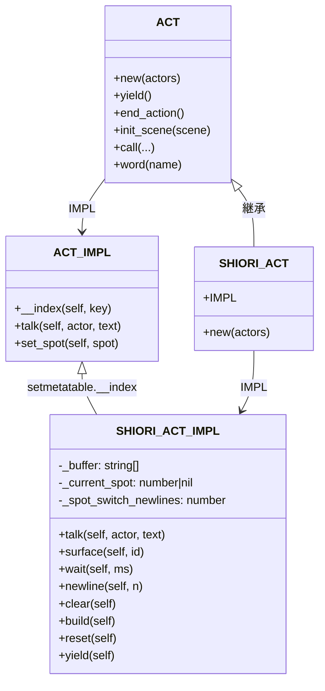

# Technical Design Document

## Introduction

本設計書は、**pasta.shiori.act モジュールのyield制御・設定管理・総合テスト機能**（alpha05-shiori-act-yield）の技術設計を定義する。

### 設計スコープ

- **Requirements R1, R1.1, R1.2**: SHIORI_ACT用yieldメソッド、build()自動リセット、newline()引数対応
- **Requirement R2**: pasta.toml スポット切り替え改行設定（`spot_switch_newlines`）
- **Requirement R3**: pasta.config モジュール（@pasta_config のLuaラッパー）
- **Requirements R4, R5**: 総合フィーチャーテスト・既存テスト拡充
- **Requirement R6**: SOUL.md スポット概念の定義

### 設計原則

- **最小変更原則**: 既存の継承構造（ACT → SHIORI_ACT）を維持
- **「1 yield = 1 build」**: yield()はbuild()を1回呼び、自動リセットで次の構築に備える
- **\p[ID] 統一**: SSP ukadoc仕様に従い、すべてのスポットタグを`\p[ID]`形式で統一

---

## Architecture Overview

### 全体アーキテクチャ

```mermaid
graph TB
    subgraph "Lua Layer"
        SCENE[シーン関数<br/>pasta/*.pasta]
        CONFIG[pasta.config<br/>設定ラッパー]
        SHIORI_ACT[pasta.shiori.act<br/>SHIORI専用アクション]
        ACT[pasta.act<br/>基底アクション]
        CO[pasta.co<br/>コルーチンユーティリティ]
    end
    
    subgraph "Rust Layer"
        PASTA_CONFIG[@pasta_config<br/>TOML設定モジュール]
        RUNTIME[PastaLuaRuntime<br/>Lua VM管理]
    end
    
    subgraph "External"
        TOML[pasta.toml<br/>設定ファイル]
        SSP[SSP/ベースウェア<br/>さくらスクリプト解釈]
    end
    
    SCENE --> SHIORI_ACT
    SHIORI_ACT --> ACT
    SHIORI_ACT --> CONFIG
    CONFIG --> PASTA_CONFIG
    PASTA_CONFIG --> TOML
    RUNTIME --> PASTA_CONFIG
    SHIORI_ACT -->|yield: さくらスクリプト| SSP
    
    %% テスト用
    CO -.->|safe_wrap| SHIORI_ACT
```

### 継承構造



---

## Component Design

### Component 1: SHIORI_ACT_IMPL.yield() [R1]

**責務**: さくらスクリプトをビルドしてコルーチンyieldする

**設計決定**:
- `ACT_IMPL.yield()` をオーバーライド
- トークンオブジェクトではなく、さくらスクリプト文字列を直接yield
- `build()` が自動リセットするため、yield後は次の構築準備完了

```lua
--- さくらスクリプトをyield（SHIORI専用オーバーライド）
--- @param self ShioriAct
--- @return nil (コルーチン中断)
function SHIORI_ACT_IMPL.yield(self)
    -- build()は自動リセット込み
    coroutine.yield(self:build())
end
```

**ACT_IMPL.yield()との違い**:
| 項目 | ACT_IMPL.yield() | SHIORI_ACT_IMPL.yield() |
|------|------------------|-------------------------|
| yield値 | `{type="yield", token=token}` | さくらスクリプト文字列 |
| 用途 | トークンベース処理 | SHIORI会話フロー |
| リセット | なし | build()内で自動実行 |

---

### Component 2: build()自動リセット [R1.1]

**責務**: さくらスクリプト構築後にバッファを自動クリア

**設計決定**:
- `build()` の最後で `reset()` を呼び出し
- 「1 yield = 1 build」原則を強制
- チェイントーク対応: 次の会話は初期化状態から開始

```lua
function SHIORI_ACT_IMPL.build(self)
    local script = table.concat(self._buffer)
    local result = script .. "\\e"
    self:reset()  -- 自動リセット
    return result
end
```

**破壊的変更の影響**:
- 既存テストで `build()` を複数回呼ぶケースは修正が必要
- 新しい期待: `build()` 後は `_buffer` が空、`_current_spot` が nil

---

### Component 3: フィールド名変更 [R1.1]

**責務**: 用語統一（scope → spot）

**変更対象**:
| 旧名 | 新名 | 用途 |
|------|------|------|
| `_current_scope` | `_current_spot` | 現在のスポット番号 |
| `spot_to_scope()` | `spot_to_id()` | スポット値→ID変換 |
| `scope_to_tag()` | `spot_to_tag()` | スポットID→タグ変換 |

---

### Component 4: spot_to_tag() SSP仕様準拠 [R1.1, R2]

**責務**: すべてのスポットで `\p[ID]` 形式を使用

**現行実装（非準拠）**:
```lua
local function scope_to_tag(scope)
    if scope == 0 then return "\\0"
    elseif scope == 1 then return "\\1"
    else return string.format("\\p[%d]", scope)
    end
end
```

**新実装（SSP ukadoc準拠）**:
```lua
local function spot_to_tag(spot_id)
    return string.format("\\p[%d]", spot_id)
end
```

**理由**: `\0`, `\1` は別機能との衝突リスクがあり、`\p[ID]` が公式推奨形式

---

### Component 5: スポット切り替え改行設定 [R2]

**責務**: `pasta.toml` の `spot_switch_newlines` 設定を読み込み、段落区切りに適用

**設定スキーマ**:
```toml
[ghost]
spot_switch_newlines = 1.5  # デフォルト: 1.5行改行
```

**実装設計**:

1. **SHIORI_ACT.new()** で設定読み込み:
```lua
function SHIORI_ACT.new(actors)
    local base = ACT.new(actors)
    base._buffer = {}
    base._current_spot = nil
    
    -- 設定読み込み
    local config = require("pasta.config")
    base._spot_switch_newlines = config.get("ghost", "spot_switch_newlines", 1.5)
    
    return setmetatable(base, SHIORI_ACT_IMPL)
end
```

2. **talk()** でスポット復帰時に改行挿入:
```lua
function SHIORI_ACT_IMPL.talk(self, actor, text)
    local spot_id = spot_to_id(actor.spot)
    
    if self._current_spot ~= spot_id then
        -- スポット復帰時の段落区切り改行
        if self._current_spot ~= nil and self._spot_switch_newlines > 0 then
            local percent = math.floor(self._spot_switch_newlines * 100)
            table.insert(self._buffer, string.format("\\n[%d]", percent))
        end
        -- スポットタグ
        table.insert(self._buffer, spot_to_tag(spot_id))
        self._current_spot = spot_id
    end
    
    table.insert(self._buffer, escape_sakura(text))
    table.insert(self._buffer, "\\n")
    ACT.IMPL.talk(self, actor, text)
    return self
end
```

**出力例**:
| 設定値 | 出力タグ | 改行幅 |
|--------|----------|--------|
| 0 | なし | 改行なし |
| 1.0 | `\n[100]` | 1行 |
| 1.5 | `\n[150]` | 1.5行 |
| 2.0 | `\n[200]` | 2行 |

---

### Component 6: pasta.config モジュール [R3]

**責務**: `@pasta_config` のLuaラッパー、セクション・キー指定でのアクセス

**ファイル**: `crates/pasta_lua/scripts/pasta/config.lua`

**インターフェース設計**:
```lua
--- @module pasta.config
--- pasta.toml設定へのアクセスを提供

local raw_config = require("@pasta_config")

local PASTA_CONFIG = {}

--- 設定値を取得
--- @param section string|nil セクション名（nilでトップレベル）
--- @param key string キー名
--- @param default any デフォルト値
--- @return any 設定値またはデフォルト
function PASTA_CONFIG.get(section, key, default)
    local target
    if section then
        target = raw_config[section]
        if type(target) ~= "table" then
            return default
        end
    else
        target = raw_config
    end
    
    local value = target[key]
    if value == nil then
        return default
    end
    return value
end

return PASTA_CONFIG
```

**使用例**:
```lua
local config = require("pasta.config")

-- セクション指定
local newlines = config.get("ghost", "spot_switch_newlines", 1.5)

-- トップレベル
local ghost_name = config.get(nil, "ghost_name", "DefaultGhost")
```

---

### Component 7: newline()引数対応 [R1.2]

**責務**: 任意個数の改行タグ挿入

**現行実装**: 既に `n` 引数対応済み（確認）

```lua
function SHIORI_ACT_IMPL.newline(self, n)
    n = n or 1
    if n >= 1 then
        for _ = 1, n do
            table.insert(self._buffer, "\\n")
        end
    end
    return self
end
```

**確認事項**: 既存実装が要件を満たしている。変更不要。

---

## Data Models

### ShioriAct インスタンス構造

```lua
{
    -- ACTから継承
    _actors = { sakura = Actor, kero = Actor, ... },
    _tokens = {},
    sakura = ActorProxy,
    kero = ActorProxy,
    
    -- SHIORI_ACT固有
    _buffer = {},          -- string[] さくらスクリプト蓄積
    _current_spot = nil,   -- number|nil 現在のスポットID
    _spot_switch_newlines = 1.5,  -- number 段落区切り改行数
}
```

### pasta.toml スキーマ拡張

```toml
# 既存フィールド
ghost_name = "MyGhost"
version = "1.0.0"

# 新規セクション
[ghost]
spot_switch_newlines = 1.5  # float, デフォルト: 1.5
```

---

## Interface Definitions

### Lua Public API

```lua
-- pasta.shiori.act
SHIORI_ACT.new(actors: table<string, Actor>) -> ShioriAct
SHIORI_ACT_IMPL.talk(self, actor: Actor, text: string) -> ShioriAct
SHIORI_ACT_IMPL.surface(self, id: number|string) -> ShioriAct
SHIORI_ACT_IMPL.wait(self, ms: number) -> ShioriAct
SHIORI_ACT_IMPL.newline(self, n?: number) -> ShioriAct
SHIORI_ACT_IMPL.clear(self) -> ShioriAct
SHIORI_ACT_IMPL.build(self) -> string  -- ★自動リセット
SHIORI_ACT_IMPL.reset(self) -> ShioriAct
SHIORI_ACT_IMPL.yield(self) -> nil     -- ★新規

-- pasta.config
PASTA_CONFIG.get(section: string|nil, key: string, default: any) -> any
```

### さくらスクリプト出力形式

```
\p[0]\s[0]こんにちは！\n
\n[150]\p[1]\s[10]やあ。\n
\n[150]\p[0]元気？\n
\e
```

**タグ説明**:
- `\p[ID]`: スポット切り替え
- `\s[ID]`: サーフェス変更
- `\n`: 改行（通常）
- `\n[percent]`: 改行（パーセント指定）
- `\w[ms]`: 待機
- `\c`: クリア
- `\e`: 終端

---

## Error Handling

### エラーケース一覧

| 状況 | 対処 | メッセージ |
|------|------|------------|
| コルーチン外でyield() | Luaネイティブエラー | `attempt to yield from outside a coroutine` |
| actor引数なしでtalk() | error()呼び出し | `actor is required` |
| 無効なspot値 | デフォルト0を使用 | なし（サイレント） |
| 設定ファイル未存在 | デフォルト値使用 | なし（サイレント） |

---

## Testing Strategy

### 単体テスト [R5]

**ファイル**: `crates/pasta_lua/tests/lua_specs/shiori_act_test.lua`

```lua
-- pasta.co.safe_wrap()を使用したyieldテスト
local co = require("pasta.co")
local act = require("pasta.shiori.act")

describe("SHIORI_ACT.yield", function()
    it("yields sakura script string", function()
        local actors = { sakura = { spot = 0 } }
        local a = act.new(actors)
        
        local wrapped = co.safe_wrap(function()
            a:talk(actors.sakura, "Hello")
            a:yield()
        end)
        
        local err, result = wrapped()
        assert.is_nil(err)
        assert.equals("\\p[0]Hello\\n\\e", result)
    end)
    
    it("resets buffer after yield", function()
        -- yield後のバッファ状態検証
    end)
end)
```

### 総合テスト [R4]

**ファイル**: `crates/pasta_lua/tests/lua_specs/shiori_act_integration_test.lua`

**シナリオ**:
1. 会話開始時の初期化状態
2. 複数アクター会話（sakura ↔ kero）
3. 表情変更 + テキスト
4. yield後の継続会話
5. 設定による改行数変更

### Fixture

**パス**: `crates/pasta_lua/tests/fixtures/loader/with_ghost_config/pasta.toml`

```toml
ghost_name = "TestGhost"
version = "1.0.0"

[ghost]
spot_switch_newlines = 2.0
```

---

## Implementation Notes

### 既存テスト修正が必要なケース

1. **build()を複数回呼ぶテスト**:
   - 現行: 同じスクリプトが返る
   - 変更後: 2回目は空文字列+`\e`

2. **バッファ状態検証テスト**:
   - 現行: build()後もバッファに値がある前提
   - 変更後: build()後は空

### パフォーマンス考慮

- `pasta.config` は各 `new()` 呼び出しで `require()` するが、Luaのモジュールキャッシュにより問題なし
- 設定値は `new()` 時に1回だけ読み込み、インスタンスに保持

### 将来拡張ポイント

- `spot_switch_newlines` 以外のghostセクション設定（初期サーフェス等）
- ノベルゲーム対応時のspot構造拡張（座標、向き、レイヤー）

---

## Requirements Traceability

| 要件 | コンポーネント | テスト |
|------|---------------|--------|
| R1 | SHIORI_ACT_IMPL.yield() | shiori_act_test.lua |
| R1.1 | build()自動リセット | shiori_act_test.lua |
| R1.2 | newline(n) | 既存テストで確認 |
| R2 | spot_switch_newlines設定 | shiori_act_integration_test.lua |
| R3 | pasta.config モジュール | shiori_act_test.lua |
| R4 | 総合テスト | shiori_act_integration_test.lua |
| R5 | 既存テスト拡充 | shiori_act_test.lua |
| R6 | SOUL.md更新 | ドキュメントレビュー |

---

## Appendix

### SSP ukadoc スポットタグ仕様

```
\p[ID]
  キャラクター（スポット）を切り替える
  ID: 0=sakura, 1=kero, 2以降=追加キャラクター
  
\n[percent]
  改行（パーセント指定）
  percent: 100=1行, 150=1.5行, 200=2行
```

### 関連ファイル一覧

| ファイル | 変更内容 |
|----------|----------|
| `crates/pasta_lua/scripts/pasta/shiori/act.lua` | yield(), build(), 変数名変更、設定読み込み |
| `crates/pasta_lua/scripts/pasta/config.lua` | 新規作成 |
| `crates/pasta_lua/tests/lua_specs/shiori_act_test.lua` | テスト追加 |
| `crates/pasta_lua/tests/lua_specs/shiori_act_integration_test.lua` | 新規作成 |
| `crates/pasta_lua/tests/fixtures/loader/with_ghost_config/pasta.toml` | 新規作成 |
| `SOUL.md` | スポット概念追記 |
