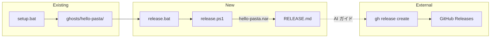
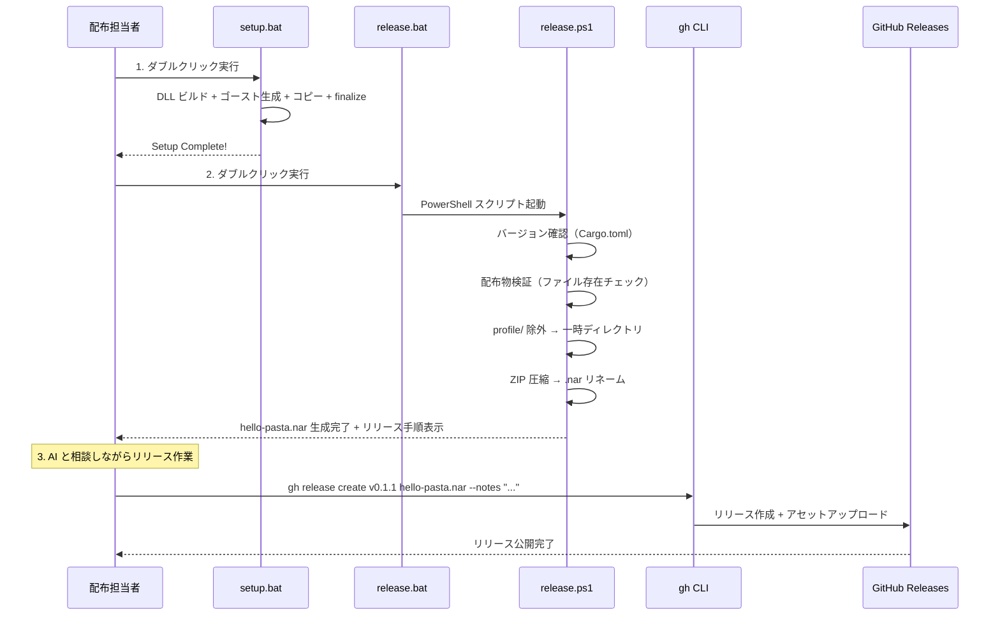

# Design Document

## Overview

**Purpose**: hello-pasta ゴーストを `.nar` 形式で GitHub Releases に公開するための手動リリースワークフローを提供する。

**Users**: 配布担当者（開発者本人）がリリース作業を実施し、テスターが GitHub Releases からダウンロードする。

### Goals
- `setup.bat` 生成済みのゴーストを `.nar` に変換する手順の確立
- `gh release create` による GitHub Releases 公開手順の確立
- リリース前の配布物検証手順の確立

### Non-Goals
- GitHub Actions による自動リリース
- x64 版リリース
- SSP ネットワーク更新（自動更新）
- crates.io 公開

## Architecture

### Architecture Pattern & Boundary Map

**Architecture Integration**:
- **Selected pattern**: リニアパイプライン（setup.bat → release.bat → release.ps1 → AI ガイド付き手動リリース）
- **Domain boundaries**: ゴースト生成（setup.bat）、パッケージング（release.ps1）、リリース公開（手動）を分離
- **Existing patterns preserved**: `setup.bat` の 4 ステップワークフローに変更なし
- **New components rationale**: 
  - `release.bat` — PowerShell スクリプト起動ラッパー（実行の利便性）
  - `release.ps1` — .nar 生成と検証
  - `RELEASE.md` — AI ガイド付きリリース手順書
- **Steering compliance**: 既存のスクリプト配置規約（`crates/pasta_sample_ghost/` 配下）に従う

### Technology Stack

| Layer | Choice / Version | Role in Feature | Notes |
|-------|------------------|-----------------|-------|
| CLI | PowerShell 5.1+ | release.ps1 実行環境 | Windows 標準搭載 |
| CLI | GitHub CLI 2.x | リリース公開 | `gh release create` |
| Tool | robocopy | profile/ 除外コピー | Windows 標準搭載 |
| Tool | Compress-Archive | ZIP 圧縮 | PowerShell 標準コマンドレット |

## System Flows

### リリースワークフロー全体

## Requirements Traceability

| Requirement | Summary | Components | Interfaces | Flows |
|-------------|---------|------------|------------|-------|
| 1.1 | ZIP 圧縮 → .nar 変換 | release.ps1 | PackageNar | リリースワークフロー Step 2 |
| 1.2 | .nar 内部構成 | release.ps1（検証） | ValidateGhost | リリースワークフロー Step 2 |
| 1.3 | setup.bat 後の手動操作 | release.bat | — | リリースワークフロー Step 1→2 |
| 2.1 | gh release create 実行 | RELEASE.md（手順書） | — | リリースワークフロー Step 3 |
| 2.2 | v\<version\> タグ形式 | release.ps1（表示）、RELEASE.md | — | — |
| 2.3 | Cargo.toml バージョン一致 | release.ps1（表示）、RELEASE.md | — | — |
| 2.4 | .nar アセット添付 | RELEASE.md（手順書） | — | リリースワークフロー Step 3 |
| 2.5 | リリース本文 | RELEASE.md（テンプレート） | — | — |
| 3.1–3.4 | リリースノート + インストール手順 | RELEASE.md（テンプレート） | — | — |
| 4.1 | ファイル存在チェック | release.ps1 | ValidateGhost | リリースワークフロー Step 2 |
| 4.2 | 検証失敗時の中断 | release.ps1 | ValidateGhost | — |

## Components and Interfaces

| Component | Domain/Layer | Intent | Req Coverage | Key Dependencies | Contracts |
|-----------|------------|--------|--------------|-----------------|-----------|
| release.bat | ラッパー | release.ps1 起動 | — | release.ps1 (P0) | Batch |
| release.ps1 | パッケージング | ゴースト検証・.nar 生成 | 1.1, 1.2, 4.1, 4.2 | setup.bat 生成物 (P0) | Batch |
| RELEASE.md | ドキュメント | リリース手順書（AI ガイド付き） | 2.1–2.5, 3.1–3.4 | — | — |

### パッケージング

#### release.bat

| Field | Detail |
|-------|--------|
| Intent | release.ps1 を起動するラッパースクリプト |
| Requirements | — |

**Responsibilities & Constraints**
- PowerShell スクリプト（release.ps1）の起動
- ダブルクリックで実行可能

**Dependencies**
- Outbound: `release.ps1` — PowerShell スクリプト (P0)

**Contracts**: Batch [x]

##### Batch / Job Contract

- **Trigger**: 配布担当者がダブルクリック実行
- **Input / validation**: なし
- **Output / destination**: release.ps1 を起動
- **Idempotency & recovery**: 単純なラッパーのため常に冪等

**Implementation Notes**
- **Integration**: `setup.bat` 実行完了後にダブルクリック実行
- **Command**: `powershell.exe -ExecutionPolicy Bypass -File "%~dp0release.ps1"`

---

#### release.ps1

| Field | Detail |
|-------|--------|
| Intent | setup.bat 生成済みゴーストの検証・.nar 生成 |
| Requirements | 1.1, 1.2, 1.3, 4.1, 4.2 |

**Responsibilities & Constraints**
- `ghosts/hello-pasta/` の検証（必須ファイル存在確認）
- `profile/` 除外、`*.bak`, `*.tmp` 除外付き ZIP 圧縮 → `.nar` リネーム
- `Cargo.toml` からバージョン読み取り → タグ名生成
- リリース手順の表示（次のステップガイド）

**Dependencies**
- Inbound: `ghosts/hello-pasta/` — setup.bat 生成物 (P0)
- External: `Compress-Archive` — ZIP 圧縮 (P0)
- External: `robocopy` — profile 除外コピー (P0)

**Contracts**: Batch [x]

##### Batch / Job Contract

- **Trigger**: release.bat 経由で起動
- **Input / validation**:
  - `ghosts/hello-pasta/` が存在すること
  - 必須ファイルの存在確認（4.1 のチェックリスト）
  - `Cargo.toml` の `workspace.package.version` が読み取り可能であること
- **Output / destination**:
  - `hello-pasta.nar` — `crates/pasta_sample_ghost/` に生成
  - リリース手順の表示（バージョン、gh コマンド例、RELEASE.md への誘導）
- **Idempotency & recovery**:
  - 既存の `hello-pasta.nar` は上書き
  - 一時ディレクトリは処理完了後にクリーンアップ

**Implementation Notes**
- **Integration**: `setup.bat` 実行完了後に `release.bat` 経由で実行
- **Validation**: ファイル存在チェック（`Test-Path`）。TOML パースは不要（存在確認のみ）
- **Exclusion**: `robocopy /MIR /XD profile /XF *.bak *.tmp` で実行時生成物を除外
- **Risks**: `Compress-Archive` の ZIP 形式が SSP と非互換の可能性（初回検証で確認）

---

### ドキュメント

#### RELEASE.md

| Field | Detail |
|-------|--------|
| Intent | AI ガイド付きリリース作業手順書 |
| Requirements | 2.1, 2.2, 2.3, 2.4, 2.5, 3.1, 3.2, 3.3, 3.4 |

**Responsibilities & Constraints**
- リリース作業の全体手順を記載
- リリースノート本文のテンプレート（バージョン、概要、コンポーネント、環境、インストール手順、動作確認、問題報告先）
- `gh release create` コマンドの実行例
- AI と相談しながら進めるためのガイド文言

**Implementation Notes**
- `crates/pasta_sample_ghost/RELEASE.md` に配置
- リリースの度に、開発者が AI と相談しながらリリースノート本文を編集
- バージョン番号は手動で挿入（または release.ps1 が表示したバージョンをコピー）

## Data Models

該当なし（ファイルシステム操作のみ）。

## Error Handling

### Error Strategy
- `release.ps1` はエラー発生時に即時中断（`$ErrorActionPreference = 'Stop'`）
- 各ステップでエラーメッセージを表示し、原因と対処法を提示

### Error Categories and Responses

| エラー | 原因 | 対処 |
|--------|------|------|
| 配布物不完全 | `setup.bat` 未実行 or 失敗 | `setup.bat` を再実行 |
| Cargo.toml 読み取り失敗 | ワークスペースルートで実行していない | 正しいディレクトリで実行 |
| `gh` CLI 未認証 | GitHub CLI 未ログイン | `gh auth login` を実行 |
| ZIP 圧縮失敗 | ディスク容量不足 or 権限不足 | ディスク確認 / 管理者権限で実行 |
| リリース公開失敗 | ネットワークエラー or タグ重複 | ネットワーク確認 / タグ名変更 |

## Testing Strategy

### 手動テスト
- `setup.bat` 実行後に `release.ps1` を実行し、`hello-pasta.nar` が生成されることを確認
- `.nar` ファイルを SSP にドラッグ＆ドロップしてインストール・動作確認
- `--dry-run` オプションで GitHub Releases 公開をスキップした状態でのパッケージング確認

### 検証チェックリスト
- `hello-pasta.nar` 内に `profile/` が含まれていないこと
- `.nar` のファイルサイズが妥当であること（数 MB 程度）
- SSP でのインストール成功 → ゴースト切り替え → 会話動作確認
