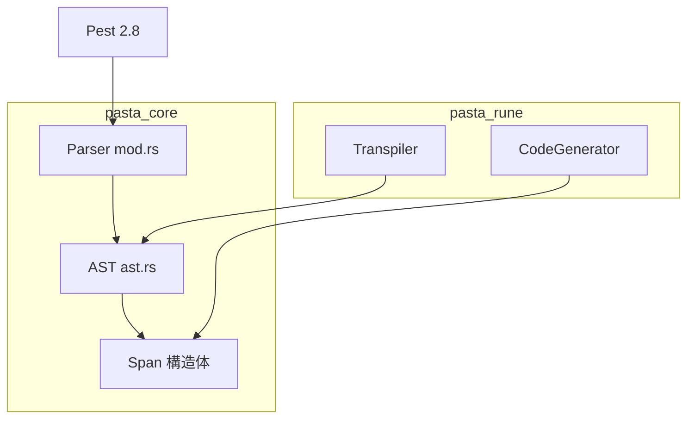
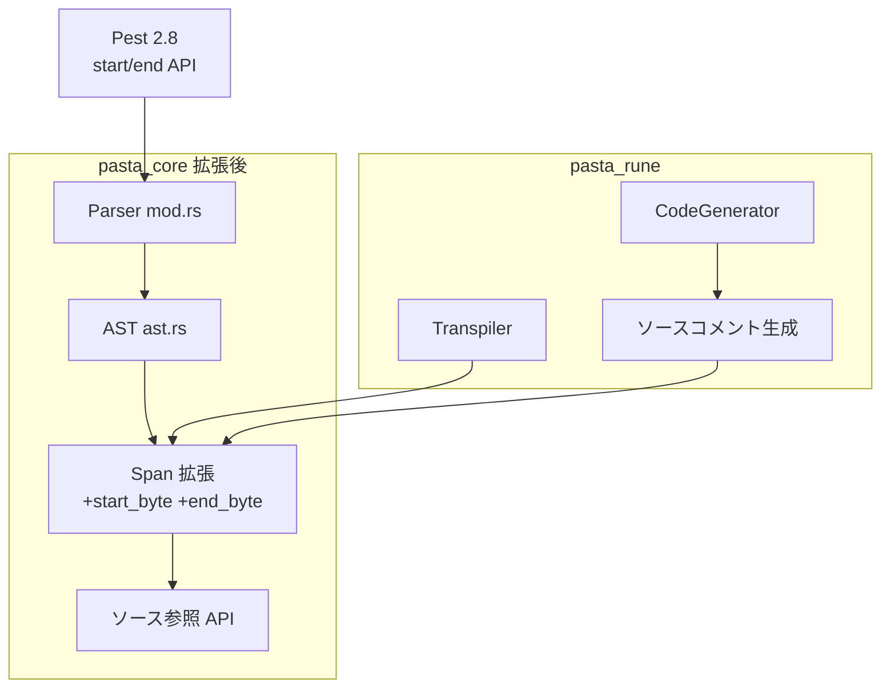
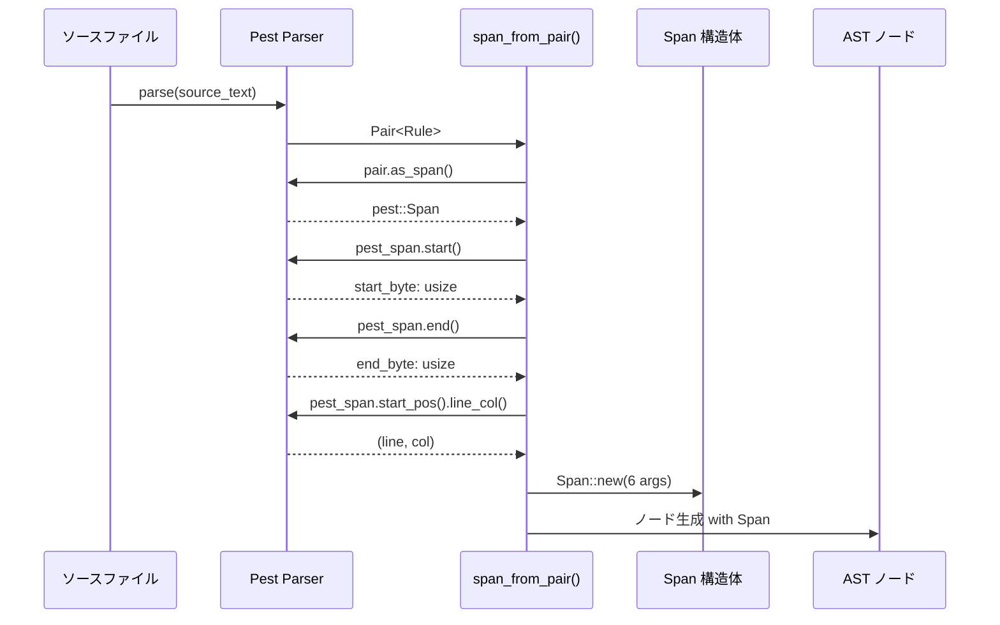
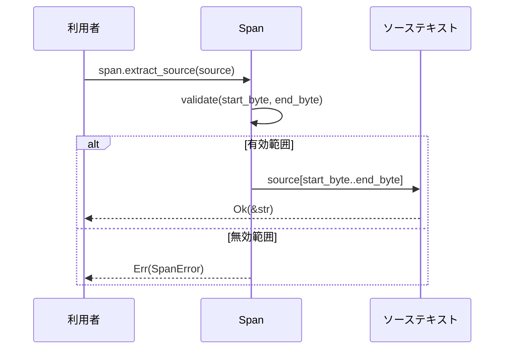
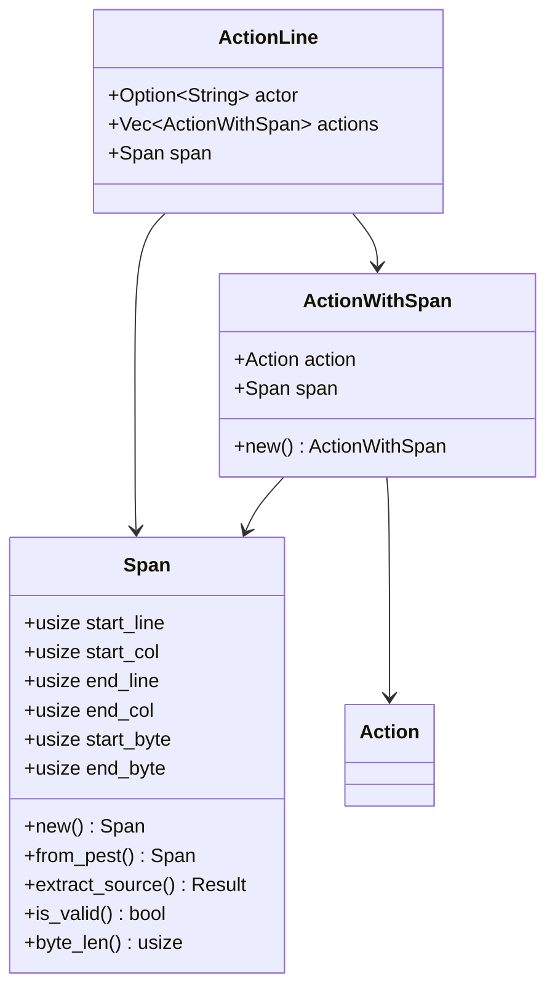

# 技術設計ドキュメント

## 概要

**目的**: AST ノードから元ソースコードへの正確な参照を確立し、デバッグ情報表示、エラー報告、トランスパイラのソースマッピングコメント生成を可能にする。

**ユーザー**: 
- パーサー利用者（AST からソース位置を取得）
- トランスパイラ（Rune/Lua コード生成時のソースコメント挿入）
- デバッグツール（スタックトレースからソース位置特定）

**影響**: 既存 Span 構造体を拡張し、バイトオフセット情報を追加。破壊的変更として 41 箇所の呼び出し修正が必要。

### ゴール
- Span 構造体に絶対バイトオフセット（`start_byte`, `end_byte`）を追加
- 全 AST ノード（行レベル項目 + Action）でバイト位置追跡
- ソースコード参照用の公開 API 提供
- UTF-8 マルチバイト文字の正確なバイト計算

### 非ゴール
- IDE 統合プロトコル（LSP）の実装
- ソースマップファイル（.map）の生成
- 既存の行/列ベースエラー報告形式の変更

## アーキテクチャ

### 既存アーキテクチャ分析



**現行制約**:
- Span は 4 フィールド（start_line, start_col, end_line, end_col）のみ
- `span_from_pair()` で Pest の行/列情報を抽出（バイト情報未使用）
- トランスパイラはソース位置コメントを生成できない

### アーキテクチャパターン

**選択パターン**: 既存構造体拡張（Option A）



**アーキテクチャ統合**:
- 既存パターン維持: pasta_core → pasta_rune 依存方向
- 新規コンポーネント: ソース参照 API（Span メソッド拡張）
- Steering 準拠: 型安全、yield 型エンジン互換

### 技術スタック

| レイヤー | 選択/バージョン | 機能における役割 | 備考 |
|---------|----------------|-----------------|------|
| Parser | Pest 2.8 | バイトオフセット提供 | `Span::start()`, `Span::end()` |
| AST | Rust 2024 | Span 構造体定義 | 6 フィールドに拡張 |
| Runtime | - | 変更なし | - |

## システムフロー

### パース時のバイトオフセット取得フロー



### ソースコード参照フロー



## 要件トレーサビリティ

| 要件 | 概要 | コンポーネント | インターフェース | フロー |
|------|------|--------------|-----------------|--------|
| 1 | Span 構造拡張 | Span | Span::new(), from_pest() | - |
| 2 | パーサー層での位置追跡 | span_from_pair() | - | パースフロー |
| 3.1 | 行レベル項目への統合 | VarSet, CallScene, ActionLine, ContinueAction | - | - |
| 3.2 | Action への Span 統合 | ActionWithSpan | - | - |
| 4 | ソース参照 API | Span | extract_source() | 参照フロー |
| 5 | テスト検証 | テストスイート | - | - |
| 6 | 後方互換性・エラー処理 | Span, Parser | - | - |
| 7 | トランスパイルコメント | CodeGenerator | - | - |

## コンポーネントとインターフェース

| コンポーネント | ドメイン/レイヤー | 目的 | 要件カバレッジ | 依存関係 | 契約 |
|--------------|-----------------|------|---------------|---------|------|
| Span | pasta_core/Parser | ソース位置情報保持 | 1, 4, 6 | - | Service |
| span_from_pair | pasta_core/Parser | Pest→Span 変換 | 2 | Pest (P0) | - |
| ActionWithSpan | pasta_core/Parser | Action+Span ラッパー | 3.2, 7 | Span (P0) | - |

### pasta_core/Parser

#### Span

| フィールド | 詳細 |
|-----------|------|
| 目的 | ソースファイル内の位置情報を保持し、ソースコード参照を可能にする |
| 要件 | 1, 4, 6 |

**責務と制約**
- ソースファイル内の開始/終了位置を行/列およびバイト単位で保持
- 不変データ（Copy trait）
- 無効な Span（default）も許容（テスト用途）

**依存関係**
- 外部: なし

**契約**: Service [x]

##### サービスインターフェース

```rust
/// ソースファイル内の位置情報。
/// 全 AST ノードがエラー報告とデバッグのために保持。
#[derive(Debug, Clone, Copy, PartialEq, Eq, Default)]
pub struct Span {
    /// 1-based 開始行番号
    pub start_line: usize,
    /// 1-based 開始列番号
    pub start_col: usize,
    /// 1-based 終了行番号
    pub end_line: usize,
    /// 1-based 終了列番号
    pub end_col: usize,
    /// ファイル先頭からの開始バイトオフセット（0-based）
    pub start_byte: usize,
    /// ファイル先頭からの終了バイトオフセット（0-based, exclusive）
    pub end_byte: usize,
}

impl Span {
    /// 全座標を指定して Span を生成。
    pub fn new(
        start_line: usize,
        start_col: usize,
        end_line: usize,
        end_col: usize,
        start_byte: usize,
        end_byte: usize,
    ) -> Self;

    /// Pest の位置タプルから Span を生成。
    /// バイトオフセットは別途指定。
    pub fn from_pest(
        start: (usize, usize),
        end: (usize, usize),
        start_byte: usize,
        end_byte: usize,
    ) -> Self;

    /// 指定されたソーステキストから該当部分を抽出。
    /// 
    /// # 引数
    /// - `source`: 元のソーステキスト全体
    /// 
    /// # 戻り値
    /// - `Ok(&str)`: 該当部分の文字列スライス
    /// - `Err(SpanError)`: バイトオフセットが範囲外または無効
    pub fn extract_source<'a>(&self, source: &'a str) -> Result<&'a str, SpanError>;

    /// Span が有効な値を持つか確認。
    /// `start_byte == 0 && end_byte == 0` の場合は無効とみなす。
    pub fn is_valid(&self) -> bool;

    /// バイト長を取得。
    pub fn byte_len(&self) -> usize;
}
```

- 前提条件: `start_byte <= end_byte`
- 事後条件: `extract_source()` は UTF-8 境界で正しくスライス
- 不変条件: `start_line <= end_line`（同一行の場合は `start_col <= end_col`）

#### span_from_pair

| フィールド | 詳細 |
|-----------|------|
| 目的 | Pest の Pair から Span を生成 |
| 要件 | 2 |

**責務と制約**
- Pest の `Pair::as_span()` から全位置情報を抽出
- 行/列（1-based）とバイトオフセット（0-based）を統合

**依存関係**
- 外部: Pest 2.8 (P0)

##### サービスインターフェース

```rust
/// Pest の Pair から Span を生成。
/// バイトオフセットと行/列情報の両方を抽出。
fn span_from_pair(pair: &Pair<Rule>) -> Span {
    let pest_span = pair.as_span();
    let (start_line, start_col) = pest_span.start_pos().line_col();
    let (end_line, end_col) = pest_span.end_pos().line_col();
    let start_byte = pest_span.start();
    let end_byte = pest_span.end();
    Span::new(start_line, start_col, end_line, end_col, start_byte, end_byte)
}
```

#### ActionWithSpan

| フィールド | 詳細 |
|-----------|------|
| 目的 | Action に Span 情報を付加 |
| 要件 | 3.2, 7 |

**責務と制約**
- Action enum のラッパーとして Span を保持
- トランスパイラがアクション単位でソース位置を参照可能に

**依存関係**
- 内部: Span (P0), Action (P0)

##### サービスインターフェース

```rust
/// Action とその Span 情報を保持するラッパー。
#[derive(Debug, Clone)]
pub struct ActionWithSpan {
    pub action: Action,
    pub span: Span,
}

impl ActionWithSpan {
    pub fn new(action: Action, span: Span) -> Self;
}
```

**実装ノート**
- ActionLine の actions フィールドを `Vec<Action>` から `Vec<ActionWithSpan>` に変更
- 既存の Action パターンマッチは `.action` 経由でアクセス

## データモデル

### ドメインモデル



**ビジネスルール**:
- Span の `start_byte <= end_byte` は常に成立
- バイトオフセットは UTF-8 文字境界に整列

## エラーハンドリング

### エラー戦略

**SpanError 型の導入**:

```rust
#[derive(Debug, Clone, thiserror::Error)]
pub enum SpanError {
    #[error("byte offset out of bounds: {start}..{end} (source length: {source_len})")]
    OutOfBounds {
        start: usize,
        end: usize,
        source_len: usize,
    },
    
    #[error("invalid UTF-8 boundary at byte offset {offset}")]
    InvalidUtf8Boundary { offset: usize },
    
    #[error("span is not valid (default span)")]
    InvalidSpan,
}
```

### エラーカテゴリと対応

| エラー種別 | 条件 | 対応 |
|-----------|------|------|
| OutOfBounds | `end_byte > source.len()` | Err 返却、パニックしない |
| InvalidUtf8Boundary | バイトオフセットが文字境界外 | Err 返却 |
| InvalidSpan | `is_valid() == false` | Err 返却 |

## テスト戦略

### ユニットテスト
- `Span::new()` が 6 フィールドを正しく設定
- `Span::extract_source()` が正確なスライスを返却
- `Span::is_valid()` が default Span を無効と判定
- `span_from_pair()` が Pest から全情報を抽出

### 統合テスト
- ASCII のみのスクリプトでバイトオフセット検証
- UTF-8 マルチバイト（日本語、絵文字）でオフセット正確性確認
- ネスト構造（シーン内アクション）での Span 伝播確認
- ActionWithSpan を通じたトランスパイラアクセス

### E2E テスト
- 完全なパーススクリプトから Span 抽出→ソース参照のラウンドトリップ
- エラー報告でバイトオフセット情報が含まれることの確認

### パフォーマンス
- Span サイズ増加（32→48 bytes）によるパース速度への影響測定
- 大規模スクリプト（1000行以上）でのメモリ使用量確認

## セキュリティ考慮事項

この機能はセキュリティに影響しない純粋な内部データ構造拡張です。

- 外部入力の検証: Pest が UTF-8 検証済み
- 信頼境界: pasta_core 内で完結
- データ保護: 該当なし

## パフォーマンスとスケーラビリティ

### ターゲットメトリクス
- Span サイズ: 32 bytes → 48 bytes（50% 増加、許容範囲）
- パース速度: 5% 以内の劣化

### 最適化
- Span は Copy trait により値渡し（ヒープ割り当てなし）
- バイトオフセットは Pest から直接取得（再計算なし）
