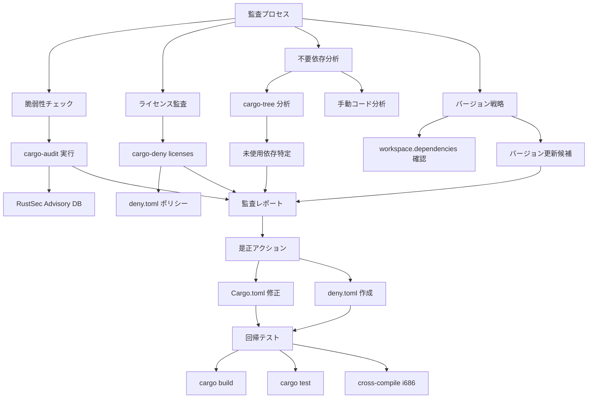
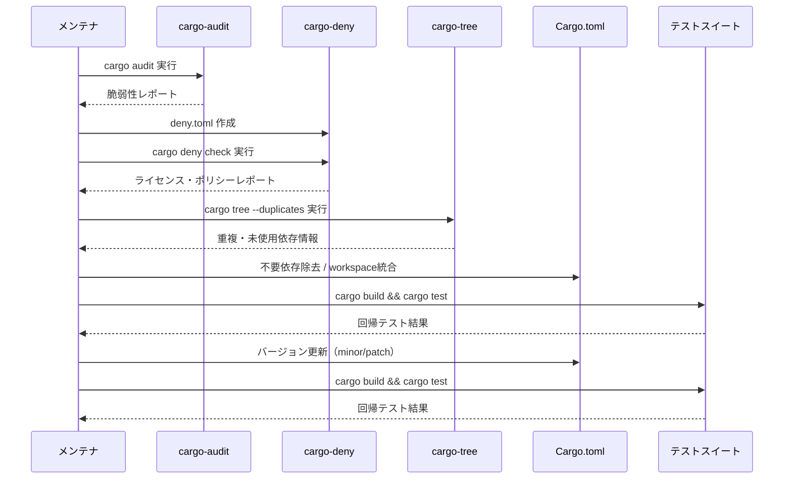

# Design Document: audit-dependency-supply-chain

## Overview

**Purpose**: pastaワークスペース全体の外部依存クレートに対するサプライチェーンセキュリティ監査を実施し、既知脆弱性・ライセンス互換性・不要依存・バージョン戦略の4軸で安全性を確認・改善する。

**Users**: プロジェクトメンテナが依存関係の安全性を体系的に検証し、将来の監査を効率化するための基盤を構築する。

**Impact**: cargo-deny設定の導入により再現可能な依存ポリシーを確立し、workspace.dependenciesの統合強化でバージョン管理の一貫性を向上させる。

### Goals
- RustSec Advisory DBに基づく全依存の脆弱性クリアランス達成
- 全依存のライセンスがMIT OR Apache-2.0と互換であることの確認
- 不要依存の特定・除去によるアタックサーフェス削減
- workspace.dependencies統合によるバージョン管理の一元化
- deny.toml導入による再現可能な依存ポリシーの確立

### Non-Goals
- 依存クレートの内部コード修正・フォーク
- メジャーバージョンアップグレード（破壊的変更を伴うもの）
- CI/CDパイプラインの構築（別spec範囲）
- Rustツールチェイン自体の更新

## Boundary Commitments

### This Spec Owns
- 全Cargo.toml/Cargo.lockに記載される外部依存クレートの安全性監査
- deny.toml設定ファイルの作成・管理
- workspace.dependenciesへの依存統合
- 不要依存の特定・Cargo.tomlからの除去
- マイナー/パッチバージョンの安全な更新
- MD5クレート用途の統合的な適切性評価
- 監査結果の文書化（research.mdへの統合）

### Out of Boundary
- 依存クレートのフォーク・パッチ・内部修正
- メジャーバージョンアップ（例: pest 2→3, mlua 0.11→1.0）
- Rustツールチェインの更新
- CI/CD自動化パイプライン構築
- 各クレート内部のコード修正（Wave 1各specの責務）
- audit-workspace-patternsの横断パターン抽出

### Allowed Dependencies
- cargo-audit CLI（開発ツール、ランタイム依存なし）
- cargo-deny CLI（開発ツール、ランタイム依存なし）
- 既存の外部依存クレート（除去・更新のみ、新規追加なし）

### Revalidation Triggers
- 新しい外部依存がworkspaceに追加された場合
- 既存依存のメジャーバージョンアップグレードが実施された場合
- RustSec Advisory DBに新しいadvisoryが登録された場合
- deny.tomlのポリシーが変更された場合

## Architecture

### Architecture Pattern & Boundary Map



**Architecture Integration**:
- 選択パターン: 監査パイプライン（調査→分析→是正→検証）
- 既存パターン維持: Cargo workspaceのworkspace.dependencies管理方式
- 新規コンポーネント: deny.toml（依存ポリシー設定ファイル）のみ
- ステアリング準拠: 外部振る舞い不変、既存テスト全パス

### Technology Stack

| Layer | Choice / Version | Role in Feature | Notes |
|-------|------------------|-----------------|-------|
| 脆弱性スキャン | cargo-audit (latest) | RustSec Advisory DBチェック | 開発ツール |
| ライセンス・ポリシー | cargo-deny (latest) | ライセンス監査・依存ポリシー | deny.toml設定ファイル |
| 依存ツリー分析 | cargo-tree (built-in) | 依存構造可視化 | Rust標準ツール |
| バージョン管理 | Cargo workspace | バージョン一元管理 | workspace.dependencies |

## File Structure Plan

### New Files
```
deny.toml                          # cargo-deny設定ファイル（ライセンス・ban・重複ポリシー）
```

### Modified Files
- `Cargo.toml`（ルート） — workspace.dependenciesに未統合の依存を追加（lexopt, md5, zip, tower-lsp, image, imageproc等）
- `crates/pasta_check/Cargo.toml` — workspace.dependencies参照に統合、不要依存があれば除去
- `crates/pasta_lsp/Cargo.toml` — workspace.dependencies参照に統合
- `crates/pasta_sample_ghost/Cargo.toml` — workspace.dependencies参照に統合
- `.kiro/specs/audit-dependency-supply-chain/research.md` — 監査結果の追記

## System Flows

### 監査実行フロー



## Requirements Traceability

| Requirement | Summary | Components | Interfaces | Flows |
|-------------|---------|------------|------------|-------|
| 1.1-1.4 | 既知脆弱性チェック | cargo-audit実行 | RustSec Advisory DB | 監査実行フロー |
| 2.1-2.4 | ライセンス互換性監査 | deny.toml, cargo-deny | ライセンスポリシー | 監査実行フロー |
| 3.1-3.4 | 不要依存の特定と除去 | cargo-tree, Cargo.toml修正 | — | 監査実行フロー |
| 4.1-4.4 | バージョン固定戦略 | workspace.dependencies統合 | — | 監査実行フロー |
| 5.1-5.3 | MD5用途適切性 | 監査レポート | — | — |
| 6.1-6.4 | 監査結果文書化 | research.md | — | — |
| 7.1-7.4 | 回帰安全性 | cargo build/test | — | 監査実行フロー |

## Components and Interfaces

### 監査ツール層

#### cargo-audit 脆弱性スキャン

| Field | Detail |
|-------|--------|
| Intent | RustSec Advisory DBに基づく既知脆弱性の検出 |
| Requirements | 1.1, 1.2, 1.3, 1.4 |

**Responsibilities & Constraints**
- Cargo.lockの全エントリを対象にRustSec Advisory DBと照合
- 直接依存・間接依存の両方を検査
- advisory検出時はID・深刻度・影響範囲・推奨対処を報告

**Dependencies**
- External: RustSec Advisory DB — 脆弱性データソース (P0)

#### cargo-deny ポリシーチェック

| Field | Detail |
|-------|--------|
| Intent | ライセンス互換性・依存ポリシーの自動チェック |
| Requirements | 2.1, 2.2, 2.3, 2.4 |

**Responsibilities & Constraints**
- deny.toml設定に基づくライセンス許可リスト管理
- ban対象クレートの管理
- 重複依存の検出

**Dependencies**
- Inbound: deny.toml — ポリシー設定 (P0)

##### deny.toml 設定仕様

```toml
[licenses]
allow = [
    "MIT",
    "Apache-2.0",
    "BSD-2-Clause",
    "BSD-3-Clause",
    "ISC",
    "Unicode-3.0",
    "Zlib",
    "BSL-1.0",
]
confidence-threshold = 0.8

[bans]
multiple-versions = "warn"
wildcards = "allow"

[advisories]
db-path = "~/.cargo/advisory-db"
db-urls = ["https://github.com/rustsec/advisory-db"]
vulnerability = "deny"
unmaintained = "warn"
yanked = "warn"

[sources]
unknown-registry = "warn"
unknown-git = "warn"
allow-registry = ["https://github.com/rust-lang/crates.io-index"]
allow-git = []
```

### 設定管理層

#### workspace.dependencies 統合

| Field | Detail |
|-------|--------|
| Intent | 依存バージョンの一元管理 |
| Requirements | 4.1, 4.2, 4.3, 4.4 |

**Responsibilities & Constraints**
- 全外部依存をworkspace.dependenciesに統合
- 各クレートのCargo.tomlを`.workspace = true`参照に変更
- バージョン番号の一元管理

**対象依存（現在workspace管理外）**:

| 依存クレート | 現在の指定 | 使用クレート | workspace統合 |
|-------------|-----------|-------------|--------------|
| lexopt | 0.3 | pasta_check | ○ |
| md5 | 0.8 | pasta_check | ○ |
| zip | 8.6 (features指定あり) | pasta_check | ○ |
| tower-lsp | 0.20 (features指定あり) | pasta_lsp | ○ |
| image | 0.25 | pasta_sample_ghost | ○ |
| imageproc | 0.26 | pasta_sample_ghost | ○ |
| wasm-bindgen | 0.2 | pasta_lsp | ○ |
| wasm-bindgen-futures | 0.4 | pasta_lsp | ○ |
| js-sys | 0.3 | pasta_lsp | ○ |
| serde-wasm-bindgen | 0.6 | pasta_lsp | ○ |
| tokio | 1 (dev) | pasta_lsp | ○ |

### 監査レポート層

#### 監査レポート（research.md統合）

| Field | Detail |
|-------|--------|
| Intent | 監査結果の構造化された文書化 |
| Requirements | 5.1, 5.2, 5.3, 6.1, 6.2, 6.3, 6.4 |

**Responsibilities & Constraints**
- 各監査カテゴリの結果を構造化して記録
- 是正アクションと実施結果を追跡
- Wave 1知見の統合
- 再現可能な形式で文書化

### 回帰検証層

#### ビルド・テスト検証

| Field | Detail |
|-------|--------|
| Intent | 依存変更による回帰がないことの保証 |
| Requirements | 3.3, 3.4, 7.1, 7.2, 7.3, 7.4 |

**Responsibilities & Constraints**
- `cargo build` 全クレート成功
- `cargo test` 全テスト（950+件）パス
- i686-pc-windows-msvcクロスコンパイル成功
- 外部振る舞い不変の確認

## Testing Strategy

### 回帰テスト
- **要件 3.3, 3.4, 7.1-7.4**: 依存変更の各ステップで`cargo build && cargo test`を実行し全テストパスを確認
- **要件 7.3**: i686-pc-windows-msvcターゲットでの`cargo build --target i686-pc-windows-msvc`成功を確認
- **要件 7.4**: CLIツール（pasta_check）の出力形式不変を目視確認

### ポリシーチェック
- **要件 1.1-1.4**: `cargo audit`実行でadvisory 0件（または既知・許容済み）を確認
- **要件 2.1-2.4**: `cargo deny check licenses`実行でエラー0件を確認
- **要件 4.1-4.2**: 全直接依存がworkspace.dependenciesに統合されていることを確認

## Security Considerations

### MD5用途の安全性
- **要件 5.1-5.3**: MD5はpasta_checkでのファイル変更検出（updates.txt生成）にのみ使用。SSP仕様で要求されるプロトコル準拠のハッシュであり、暗号学的用途ではない。Wave 1 audit-pasta-checkで既に文書化済み
- 本specでは統合的に再確認し、deny.tomlでの明示的許可として記録

### サプライチェーンリスク
- vendoredソース（mlua/LuaJIT）は外部リポジトリからのソースコード同梱。ライセンス（MIT）は互換だが、vendoredバージョンの追跡性に注意
- 未知のレジストリ・Gitソースからの依存は`deny.toml`で警告レベルに設定
