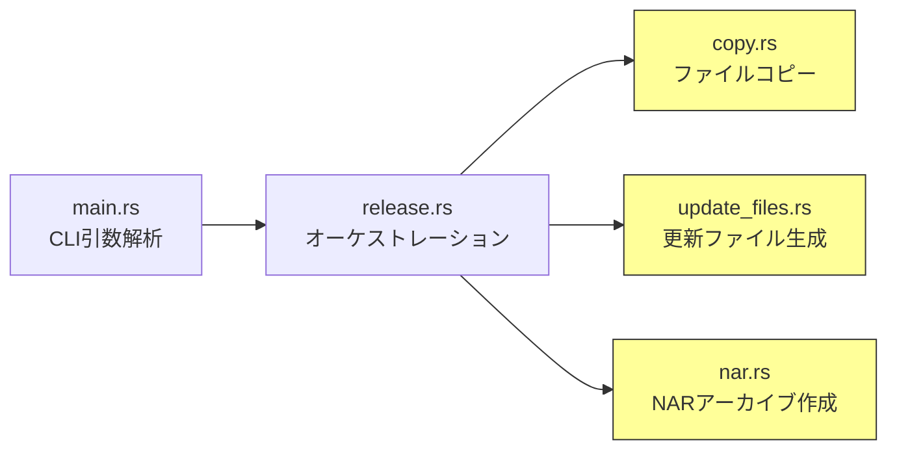

# Design Document: audit-pasta-check

## Overview
pasta_check CLIツール（~500行、5ファイル）に対する脆弱性監査・コード簡素化の技術設計。ファイルI/Oパス操作のパストラバーサル安全性強化、シンボリックリンク防御、デッドコード除去、冗長表現削減を実施する。外部振る舞い（CLI出力・生成ファイル・NAR互換性）は不変。

### Goals
- パストラバーサルおよびシンボリックリンク追跡に対する防御的チェックを追加
- MD5使用箇所の用途を明文化
- デッドコード（`generate_updates2_dau`）を除去
- 冗長表現を簡潔化
- 全テストパス・外部振る舞い不変を保証

### Non-Goals
- CLI引数の変更・追加
- NARフォーマット仕様の変更
- updates.txt出力形式の変更
- 新サブコマンドの追加
- MD5から別ハッシュアルゴリズムへの変更（SSP仕様がMD5を要求）

## Boundary Commitments

### This Spec Owns
- `crates/pasta_check/src/` 配下5ファイルの脆弱性修正・コード簡素化
- シンボリックリンクスキップロジックの追加
- パストラバーサル防御チェックの追加
- デッドコード除去
- MD5用途のコードコメント追記

### Out of Boundary
- NARフォーマット仕様（SSP側の仕様）
- updates.txt/updates2.dau出力形式（SSP仕様準拠）
- release-workflow spec（リリース手順全体）
- pasta_luaとの統合（将来のLuaテスト基盤）
- 他クレートの監査（audit-pasta-core, audit-pasta-dsl等が担当）

### Allowed Dependencies
- 既存依存のみ: `lexopt`, `md5`, `zip`, `thiserror`
- 標準ライブラリ: `std::fs`, `std::io`, `std::path`
- 新規外部依存は追加しない

### Revalidation Triggers
- `copy_dir_recursive`のシグネチャ変更
- `create_nar`のシグネチャ変更
- `generate_update_files`のシグネチャ変更
- `execute_release`の処理ステップ変更

## Architecture

### Existing Architecture Analysis
pasta_checkは直線的パイプラインアーキテクチャ:
```
CLI引数解析(main.rs) → リリース実行(release.rs) → コピー(copy.rs) → 更新ファイル生成(update_files.rs) → NAR作成(nar.rs)
```

各モジュールは独立した責務を持ち、`release.rs`がオーケストレーターとして機能する。この構造は変更しない。

### Architecture Pattern & Boundary Map



黄色: 安全性チェック追加対象モジュール

### Technology Stack

| Layer | Choice / Version | Role in Feature | Notes |
|-------|------------------|-----------------|-------|
| Language | Rust 2024 edition | 実装言語 | 既存 |
| CLI | lexopt 0.3 | 引数解析 | 変更なし |
| Archive | zip 8.4 | NAR作成 | 変更なし |
| Hash | md5 0.8 | ファイル変更検出 | 使用継続、コメント追記 |
| Error | thiserror 2 | エラー型 | 変更なし |

## File Structure Plan

### Modified Files
- `crates/pasta_check/src/copy.rs` — シンボリックリンクスキップ追加、パストラバーサルチェック追加
- `crates/pasta_check/src/nar.rs` — シンボリックリンクスキップ追加、ZIPエントリ名のパストラバーサルチェック追加
- `crates/pasta_check/src/update_files.rs` — シンボリックリンクスキップ追加、`generate_updates2_dau`除去、MD5用途コメント追記、冗長表現削減
- `crates/pasta_check/src/main.rs` — 変更なし（引数解析は安全、`lexopt`が検証済み）
- `crates/pasta_check/src/release.rs` — 変更なし（オーケストレーションのみ、I/O操作は各モジュールに委譲）

### Created Files
なし

## System Flows

変更なし。既存のリリースパイプラインフローは維持される。

## Requirements Traceability

| Requirement | Summary | Components | Interfaces | Flows |
|-------------|---------|------------|------------|-------|
| 1.1 | 相対パスがルート外を指さない | copy.rs, nar.rs, update_files.rs | — | — |
| 1.2 | strip_prefix失敗時エラー | nar.rs, update_files.rs | — | — |
| 1.3 | ZIPエントリ名に`..`なし | nar.rs | — | — |
| 1.4 | コピー先パスが範囲外を指さない | copy.rs | — | — |
| 2.1 | シンボリックリンクスキップ/検証 | copy.rs, nar.rs, update_files.rs | — | — |
| 2.2 | NARでのシンボリックリンク処理 | nar.rs | — | — |
| 3.1 | MD5は変更検出のみ | update_files.rs | — | — |
| 3.2 | MD5用途コメント | update_files.rs | — | — |
| 4.1 | dead_code属性の解消 | update_files.rs | — | — |
| 4.2 | 未使用コードなし | 全ファイル | — | — |
| 5.1 | エラー変換の簡潔化 | nar.rs, update_files.rs | — | — |
| 5.2 | 中間変数削減 | 全ファイル | — | — |
| 5.3 | Rustイディオム準拠 | 全ファイル | — | — |
| 6.1 | 既存テスト全パス | 全ファイル | — | — |
| 6.2 | CLI引数解析不変 | main.rs | — | — |
| 6.3 | updates.txt不変 | update_files.rs | — | — |
| 6.4 | NARアーカイブ不変 | nar.rs | — | — |
| 6.5 | 出力メッセージ不変 | release.rs | — | — |

## Components and Interfaces

| Component | Domain/Layer | Intent | Req Coverage | Key Dependencies | Contracts |
|-----------|-------------|--------|--------------|-----------------|-----------|
| copy.rs | ファイルI/O | ディレクトリ再帰コピー | 1.1, 1.4, 2.1 | std::fs | — |
| nar.rs | アーカイブ | NAR (ZIP) 作成 | 1.1, 1.2, 1.3, 2.1, 2.2, 5.1 | zip crate | — |
| update_files.rs | 更新ファイル | updates.txt生成 | 1.1, 1.2, 2.1, 3.1, 3.2, 4.1, 5.1 | md5 crate | — |
| main.rs | CLI | 引数解析 | 4.2, 6.2 | lexopt | — |
| release.rs | オーケストレーション | リリースパイプライン | 6.5 | copy, nar, update_files | — |

### ファイルI/O層

#### copy.rs

| Field | Detail |
|-------|--------|
| Intent | ディレクトリ再帰コピーとリリースフォルダー初期化 |
| Requirements | 1.1, 1.4, 2.1, 5.2, 5.3 |

**変更内容**
- `copy_dir_inner`: `entry.file_type()?.is_symlink()` チェック追加。シンボリックリンクをスキップ
- `copy_dir_inner`: `dst_path`が`dst`の配下であることの防御的チェック追加
- 冗長表現があれば簡潔化

### アーカイブ層

#### nar.rs

| Field | Detail |
|-------|--------|
| Intent | リリースディレクトリからNAR (ZIP) アーカイブを作成 |
| Requirements | 1.1, 1.2, 1.3, 2.1, 2.2, 5.1, 5.3 |

**変更内容**
- `add_dir_to_zip`: シンボリックリンクスキップ追加
- `add_dir_to_zip`: `relative`パスに`..`コンポーネントが含まれないことのアサーション追加
- `map_err`パターンの簡潔化

### 更新ファイル生成層

#### update_files.rs

| Field | Detail |
|-------|--------|
| Intent | updates.txt生成（SSPネットワーク更新用） |
| Requirements | 1.1, 1.2, 2.1, 3.1, 3.2, 4.1, 4.2, 5.1, 5.2, 5.3 |

**変更内容**
- `collect_files_recursive`: シンボリックリンクスキップ追加
- `generate_updates2_dau`関数と`#[allow(dead_code)]`の除去
- `calculate_md5`: 用途（非暗号学的ファイル変更検出、SSP仕様準拠）のコメント追記
- `map_err`パターンの簡潔化
- 冗長な中間変数の削減

## Error Handling

### Error Strategy
既存のエラー戦略（`io::Result`伝搬）を維持する。新たなエラー型は追加しない。

### 追加されるエラーケース
- シンボリックリンク: エラーではなくサイレントスキップ（警告もなし — CLIの外部振る舞い不変のため）
- パストラバーサル検出時: `io::Error`（`ErrorKind::InvalidInput`）を返して処理中断

## Testing Strategy

### Unit Tests
1. **copy.rs**: シンボリックリンクを含むディレクトリのコピーでシンボリックリンクがスキップされることを検証（1.1, 2.1）
2. **nar.rs**: シンボリックリンクを含むディレクトリからのNAR作成でシンボリックリンクが除外されることを検証（2.2）
3. **nar.rs**: ZIPエントリ名に`..`が含まれないことを検証（1.3）
4. **update_files.rs**: シンボリックリンクを含むディレクトリのファイル収集でシンボリックリンクがスキップされることを検証（2.1）
5. **update_files.rs**: `generate_updates2_dau`除去後もupdates.txt生成が正常動作することを検証（4.1, 6.3）

### Integration Tests
1. **release.rs**: 既存の`test_execute_release_full_pipeline`が変更後もパスすることを検証（6.1-6.5）
2. **release.rs**: 既存の`test_execute_release_with_copy`が変更後もパスすることを検証（6.1-6.5）

### Regression
- `cargo test -p pasta_check` で全既存テストがパスすること

## Security Considerations

- **パストラバーサル**: `strip_prefix` + `..`コンポーネントチェックによる二重防御
- **シンボリックリンク**: `is_symlink()`によるスキップで情報漏洩防止
- **MD5**: 暗号学的用途ではなくファイル変更検出用途のため、MD5の使用は適切。SSP仕様要件。
- **入力検証**: CLIパス引数はユーザーが明示指定するため、追加検証不要（ファイルシステムがバリデーション）
