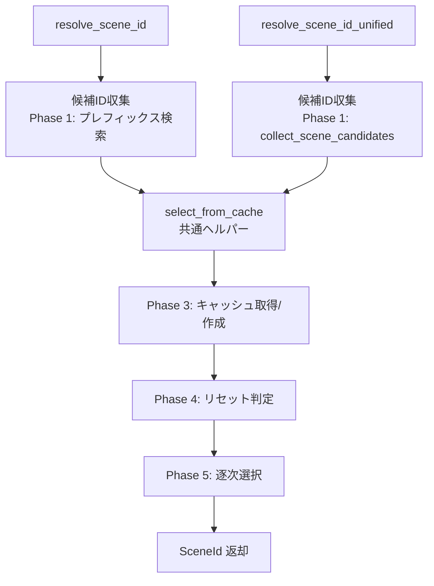

# 設計書

## 概要

**目的**: pasta_coreクレートの内部実装を脆弱性回避・コード簡素化の観点で改善し、堅牢性と保守性を向上させる。

**対象ユーザー**: pasta_coreに依存する下流クレート開発者（pasta_dsl, pasta_lua, pasta_shiori）。

**影響**: 内部実装のみ変更。公開APIのシグネチャ・振る舞いは不変。

### ゴール
- 非テストコードからの `unwrap()` / `expect()` / `panic!` 完全排除
- 入力検証の強化（空文字列・範囲外アクセス）
- 重複ロジック（キャッシュ処理）の共通化
- エラーメッセージ言語の統一（英語）
- コンパイラ警告0件

### 非ゴール
- 公開APIシグネチャの変更
- 新機能追加
- 他クレートのコード変更
- `fast_radix_trie` ライブラリの内部変更
- パフォーマンスベンチマーク整備

## 境界コミットメント

### 本仕様の責任範囲
- `crates/pasta_core/src/` 配下の全ソースファイルの内部実装改善
- パニック安全性の確保（非テストコード）
- 入力検証の追加（公開メソッドの境界チェック）
- 重複ロジックの共通化
- エラーメッセージの統一
- デッドコード除去
- 対応するテストの更新

### 対象外
- 公開API（`pub` シグネチャ）の変更
- 他クレート（`pasta_dsl`, `pasta_lua`, `pasta_shiori`, `pasta_check`, `pasta_lsp`）への変更
- 新しいデータ構造やテーブル型の追加
- `fast_radix_trie` クレートの内部動作変更
- ビルド設定や依存バージョンの変更

### 許可される依存
- `thiserror`: エラー型定義（既存依存）
- `fast_radix_trie`: プレフィックス検索（既存依存）
- `rand`: ランダム選択（既存依存）
- `tracing`: ログ出力（既存依存）
- 新規外部依存の追加は禁止

### 再検証トリガー
- `SceneTableError` / `WordTableError` のバリアント追加・削除時、下流クレートのエラーハンドリングを再確認
- 共通ヘルパー抽出後のメソッドシグネチャが内部的に変わった場合、`scene_table_tests.rs` を再確認

## アーキテクチャ

### 既存アーキテクチャ分析

```
pasta_core (言語非依存レジストリ層)
├── error.rs          # エラー型定義 (SceneTableError, WordTableError)
├── lib.rs            # クレートエントリーポイント + re-export
└── registry/
    ├── mod.rs              # レジストリAPI公開
    ├── random.rs           # RandomSelector トレイト + 実装
    ├── scene_registry.rs   # SceneRegistry (トランスパイル時)
    ├── scene_table.rs      # SceneTable (ランタイム検索)
    ├── scene_table_tests.rs # SceneTable テスト (#[path]パターン)
    ├── scene_types.rs      # SceneId, SceneScope, SceneInfo
    ├── word_registry.rs    # WordDefRegistry (トランスパイル時)
    └── word_table.rs       # WordTable (ランタイム検索)
```

**パターン**: Vec + RadixMap によるID管理、キャッシュベース逐次選択、トレイトによるランダム選択抽象化。

### アーキテクチャパターン

変更パターン: **内部リファクタリング（アーキテクチャ不変）**

既存のモジュール構成・公開APIは一切変更せず、各モジュール内の実装詳細のみを修正する。

### 技術スタック

| レイヤー | 選択 / バージョン | 本機能での役割 | 備考 |
|---------|------------------|---------------|------|
| 言語 | Rust 2024 edition | 全実装 | 既存 |
| エラー型 | thiserror 2 | エラーメッセージ修正 | 既存依存 |

## ファイル構造計画

### 変更ファイル

- `crates/pasta_core/src/registry/scene_table.rs` — キャッシュ処理共通化ヘルパー抽出、`unwrap()` 排除、インデックスアクセス安全化
- `crates/pasta_core/src/registry/word_table.rs` — インデックスアクセス安全化、冗長イテレータ簡素化
- `crates/pasta_core/src/error.rs` — `WordTableError::WordNotFound` メッセージ英語化、未使用バリアント調査
- `crates/pasta_core/src/registry/scene_registry.rs` — 不要パターン確認・簡素化
- `crates/pasta_core/src/registry/word_registry.rs` — 不要パターン確認・簡素化
- `crates/pasta_core/src/registry/random.rs` — デッドコード確認
- `crates/pasta_core/src/registry/scene_types.rs` — デッドコード確認
- `crates/pasta_core/src/registry/mod.rs` — 未使用re-export確認
- `crates/pasta_core/src/lib.rs` — 未使用re-export確認
- `crates/pasta_core/src/registry/scene_table_tests.rs` — テストの更新（リファクタリング後の整合性）
- `crates/pasta_core/tests/word_table_test.rs` — エラーメッセージ変更に伴うテスト更新

## システムフロー

### キャッシュ処理共通化



## 要件トレーサビリティ

| 要件 | 概要 | コンポーネント | 変更内容 |
|------|------|--------------|---------|
| 1 | パニック安全性 | scene_table, word_table | `unwrap()` 排除、インデックス安全化 |
| 2 | 入力検証 | scene_table, word_table, scene_registry | 空文字列・範囲外チェック追加 |
| 3 | デッドコード除去 | 全ファイル | コンパイラ警告調査、未使用コード除去 |
| 4 | 冗長表現削減 | scene_table, word_table | キャッシュ処理共通化、イテレータ簡素化 |
| 5 | エラーハンドリング改善 | error.rs | メッセージ言語統一、未使用バリアント除去 |
| 6 | 外部振る舞い不変 | 全ファイル | 公開API不変、テスト全パス |
| 7 | 性能維持 | scene_table, word_table | 不要クローン削減、計算量維持 |

## コンポーネントとインターフェース

### レジストリ層

#### SceneTable（scene_table.rs）

| フィールド | 詳細 |
|----------|------|
| 意図 | シーンのランタイム検索とキャッシュベース逐次選択 |
| 要件 | 1, 2, 4, 6, 7 |

**責任と制約**
- `resolve_scene_id` / `resolve_scene_id_unified` のキャッシュ処理ロジックを内部ヘルパー `select_from_cache` に抽出
- 全 `unwrap()` を安全パターンに置換
- `candidates[next_index]` を `.get(next_index)` + エラーハンドリングに置換

**変更詳細**

1. **`select_from_cache` ヘルパー抽出**:
   - シグネチャ: `fn select_from_cache(&mut self, cache_key: SceneCacheKey, filtered_ids: Vec<SceneId>) -> Result<SceneId, SceneTableError>`
   - Phase 3-5（キャッシュ取得/作成、リセット、逐次選択）を統合
   - `resolve_scene_id` と `resolve_scene_id_unified` の両方がこのヘルパーを呼び出す

2. **パニック安全化**:
   - `cache.get_mut(&cache_key).unwrap()` → `cache.get_mut(&cache_key).ok_or(SceneTableError::RandomSelectionFailed)?` または構造的に安全なパターン
   - `candidates[next_index]` → `candidates.get(next_index).copied().ok_or(SceneTableError::RandomSelectionFailed)?`

#### WordTable（word_table.rs）

| フィールド | 詳細 |
|----------|------|
| 意図 | 単語のランタイム検索とキャッシュベース逐次選択 |
| 要件 | 1, 2, 6, 7 |

**責任と制約**
- `search_word` 内の `shuffled_words[0]` を `.first()` + エラーハンドリングに置換
- 冗長なイテレータチェーンの簡素化

**変更詳細**
- `shuffled_words[0].clone()` → `shuffled_words.first().cloned().ok_or(WordTableError::WordNotFound { key })?`
- `entries.get(*id)` のパターンは既に安全（`.get()` 使用済み）

#### エラー型（error.rs）

| フィールド | 詳細 |
|----------|------|
| 意図 | レジストリ関連エラー型の定義 |
| 要件 | 5 |

**変更詳細**
- `WordTableError::WordNotFound` のメッセージを英語に統一: `"単語定義 @{key} が見つかりません"` → `"Word not found: @{key}"`
- `SceneTableError` の全バリアントの使用状況を確認し、未使用バリアントを除去

#### SceneRegistry / WordDefRegistry / random.rs / scene_types.rs

| フィールド | 詳細 |
|----------|------|
| 意図 | 調査対象（デッドコード・冗長表現の確認） |
| 要件 | 3, 6 |

**変更詳細**
- デッドコードの有無をコンパイラ警告で確認し、存在すれば除去
- `scene_registry.rs`: `sanitize_name` の実装確認（`replace` クロージャの効率性）
- `random.rs`: `DefaultRandomSelector::select` / `shuffle` ジェネリックメソッドの使用状況確認

## テスト戦略

### 既存テスト回帰確認
- `cargo test -p pasta_core` — pasta_core内全テストパス
- `cargo test` — ワークスペース全体テスト（950+）全パス

### 修正に伴うテスト更新
- `scene_table_tests.rs`: キャッシュ処理共通化後のテスト整合性確認
- `word_table_test.rs`: エラーメッセージ変更に伴う文字列比較テストの更新
- 下流クレートのテスト: エラーメッセージ文字列を比較しているテストがあれば更新

### コンパイラ検証
- `cargo clippy -p pasta_core -- -W warnings` で新規警告0件を確認
