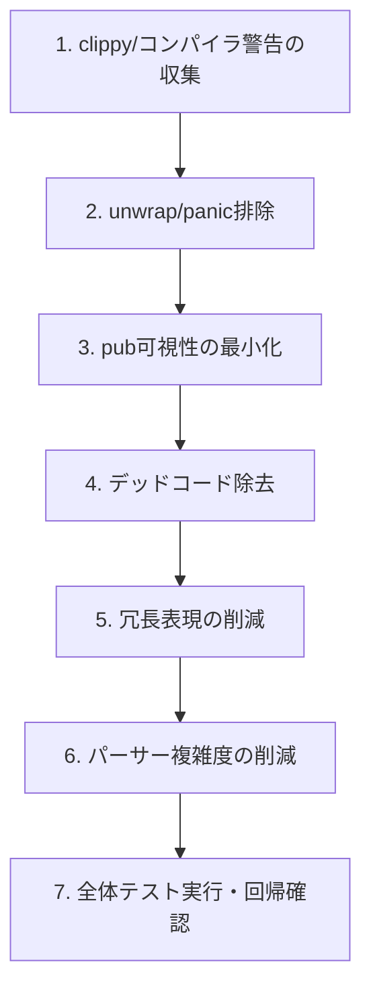

# 設計ドキュメント

## 概要

**目的**: pasta_dslクレート（約2,500行、13ソースファイル）の脆弱性監査・コード簡素化を実施し、外部入力の堅牢性向上、デッドコード除去、冗長表現削減、パーサー複雑度の低減を達成する。

**ユーザー**: pasta_dslの下流クレート開発者（pasta_lua、pasta_lsp）とゴースト制作者が、より堅牢で保守しやすいパーサー層の恩恵を受ける。

**影響**: 内部実装の簡素化のみ。公開API・AST型・パース結果は不変。

### ゴール
- 外部入力パスにおけるパニックリスクの排除
- デッドコード・未使用pub項目の除去
- 冗長パターンの統合・簡素化
- パーサーモジュール全体の認知的複雑度削減

### 非ゴール
- Pest文法定義（grammar.pest）の変更
- AST型の公開インターフェース変更
- 新しいDSL構文の追加
- パフォーマンス最適化（性能劣化禁止だが、積極的な高速化は行わない）
- pasta_core、pasta_lua、pasta_lsp への変更

## 境界コミットメント

### 本Specの責任範囲
- `crates/pasta_dsl/src/` 配下の全13ソースファイルの内部実装の監査・簡素化
- `unwrap()`/`expect()`/`panic!()`のResult型への置換（外部入力パス）
- 未使用コード・import・到達不能分岐の除去
- `pub`可視性の最小化（`pub(crate)` への縮小）
- 冗長パターンの統合
- 大規模関数の分割によるパーサー複雑度削減

### 対象外
- `grammar.pest` — 文法定義は変更しない
- `crates/pasta_dsl/tests/` — テストファイル自体は監査対象外（テストは実行・維持する）
- 公開API署名（`parse_str`, `parse_file`, `parse_str_partial` 等）の変更
- AST型（`PastaFile`, `FileItem`, `SceneScope` 等）の公開フィールド・バリアント変更
- 上流クレート（pasta_core）への変更
- 下流クレート（pasta_lua, pasta_lsp）への変更

### 許可される依存
- `pest`, `pest_derive` — 既存依存（変更なし）
- `thiserror` — 既存依存（変更なし）
- Rustの標準ライブラリ（std）のみ使用可能、新しい外部依存の追加は不可

### 再バリデーショントリガー
- 公開API署名の変更（本Specでは禁止だが、万一変更した場合）
- AST型の構造変更（同上）
- エラー型のバリアント追加・削除

## アーキテクチャ

### 既存アーキテクチャ分析

pasta_dslは以下のレイヤー構成を持つ：

```
pasta_dsl/src/
├── lib.rs                 # クレートエントリーポイント（re-export）
├── error.rs               # ParseError / ParseErrorInfo / ParseResult
├── partial.rs             # パーシャルパース（3フェーズフォールバック）
└── parser/
    ├── mod.rs             # PastaParser2, parse_str, parse_file, build_file_ast
    ├── parse_scene.rs     # シーン解析（build_scene_scope等）
    ├── parse_action.rs    # アクション行解析（build_action_line等）
    ├── parse_elements.rs  # 要素解析（変数・リテラル・シンボル等）
    ├── grammar.pest       # Pest PEG文法定義（変更不可）
    └── ast/
        ├── mod.rs         # AST型再エクスポート
        ├── span.rs        # Span型（ソース位置追跡）
        ├── scene.rs       # シーン関連AST型
        ├── action.rs      # アクション関連AST型
        └── cue.rs         # キューコマンドAST型
```

依存方向: `lib.rs → parser/mod.rs → parse_scene.rs / parse_action.rs / parse_elements.rs → ast/*`

### アーキテクチャパターン

監査は既存アーキテクチャを維持したまま、ファイル単位で内部実装を改善する「インプレースリファクタリング」パターンを採用する。新しいモジュール分割やファイル追加は行わない（大規模関数の分割はファイル内ヘルパー関数として実施）。

### 技術スタック

| レイヤー | 選択 / バージョン | 役割 | 備考 |
|---------|-----------------|------|------|
| パーサー生成 | Pest 2.8.6 | PEG文法 → パーサーコード生成 | 変更なし |
| エラー型 | thiserror 2 | derive(Error) マクロ | 変更なし |
| 言語 | Rust 2024 edition | メイン実装言語 | 変更なし |

## ファイル構造計画

### 変更対象ファイル

本監査では新規ファイル作成は行わない。全変更は既存ファイルの修正のみ。

- `crates/pasta_dsl/src/parser/parse_scene.rs` — unwrap排除（L388）、大規模関数の分割、冗長パターン統合
- `crates/pasta_dsl/src/parser/parse_action.rs` — 大規模関数の分割、冗長パターン統合、デッドコード除去
- `crates/pasta_dsl/src/parser/mod.rs` — pub可視性の最小化、冗長パターン統合
- `crates/pasta_dsl/src/parser/parse_elements.rs` — 冗長パターン統合、デッドコード除去
- `crates/pasta_dsl/src/parser/ast/mod.rs` — 未使用re-exportの除去
- `crates/pasta_dsl/src/parser/ast/span.rs` — 未使用メソッドの可視性縮小
- `crates/pasta_dsl/src/parser/ast/scene.rs` — 冗長パターン統合
- `crates/pasta_dsl/src/parser/ast/action.rs` — 冗長パターン統合
- `crates/pasta_dsl/src/parser/ast/cue.rs` — デッドコード除去
- `crates/pasta_dsl/src/partial.rs` — 冗長パターン統合、防御的コーディング強化
- `crates/pasta_dsl/src/error.rs` — 必要に応じてpub可視性の検証
- `crates/pasta_dsl/src/lib.rs` — 必要に応じてre-exportの整理

## システムフロー

監査プロセスフロー（実装順序）:



## 要件トレーサビリティ

| 要件 | サマリ | コンポーネント | 検証方法 |
|------|-------|-------------|---------|
| 1 | 入力検証の堅牢性 | parse_scene.rs, partial.rs | unwrap排除確認、エッジケーステスト |
| 2 | エラーハンドリングの一貫性 | error.rs, mod.rs | Display/Debug実装確認 |
| 3 | デッドコード除去 | 全ファイル | clippy warnings = 0 |
| 4 | 冗長表現の削減 | parse_scene.rs, parse_action.rs, parse_elements.rs | コード行数削減、重複排除確認 |
| 5 | パーサー複雑度の削減 | parse_scene.rs, parse_action.rs | 関数サイズ検証（概ね50行以下） |
| 6 | 外部振る舞いの不変性 | 全ファイル | cargo test --workspace 全パス |
| 7 | partial.rs堅牢性 | partial.rs | 空入力・不完全入力テスト |

## コンポーネントとインターフェース

### パーサーレイヤー

#### parse_scene.rs（シーン解析）

| フィールド | 詳細 |
|-----------|------|
| 意図 | Pestパースツリーからシーン関連ASTノードを構築する |
| 要件 | 1, 3, 4, 5, 6 |

**責務と制約**
- グローバルシーンスコープとローカルシーンの解析
- シーン内のアクターアイテム・属性・単語定義の構築
- `unwrap()` 1箇所の排除（L388: `raw[colon_pos..].chars().next().unwrap()`）

**変更方針**
- unwrapをmatch/if-letに置換
- 50行超の関数をファイル内ヘルパーに分割
- 重複する属性マージパターンの統合

#### parse_action.rs（アクション行解析）

| フィールド | 詳細 |
|-----------|------|
| 意図 | アクション行（発話者：内容）のASTノードを構築する |
| 要件 | 3, 4, 5, 6 |

**変更方針**
- 50行超の関数をファイル内ヘルパーに分割
- 重複するパターンマッチングの統合
- 未使用のヘルパー関数除去

#### parse_elements.rs（要素解析）

| フィールド | 詳細 |
|-----------|------|
| 意図 | 変数参照・リテラル・さくらスクリプトシンボル等の基本要素を解析する |
| 要件 | 3, 4, 6 |

**変更方針**
- 冗長パターンの統合
- 未使用のpub関数のpub(crate)化

#### mod.rs（パーサーエントリーポイント）

| フィールド | 詳細 |
|-----------|------|
| 意図 | parse_str/parse_file公開API、Pestパーサー駆動、ASTトップレベル構築 |
| 要件 | 2, 3, 4, 6 |

**変更方針**
- 内部ヘルパー関数のpub可視性縮小
- build_file_ast等の大規模関数の簡素化

### AST型レイヤー

#### ast/mod.rs, scene.rs, action.rs, cue.rs, span.rs

| フィールド | 詳細 |
|-----------|------|
| 意図 | AST型定義と再エクスポート |
| 要件 | 3, 4, 6 |

**変更方針**
- 未使用re-exportの除去
- 未使用メソッドのpub可視性縮小
- 冗長なimpl定義の統合
- **公開フィールド・バリアントは不変**

### サポートレイヤー

#### partial.rs（パーシャルパース）

| フィールド | 詳細 |
|-----------|------|
| 意図 | 不完全なソースコードに対する3フェーズフォールバックパース |
| 要件 | 4, 6, 7 |

**変更方針**
- 防御的コーディングの強化（空入力、境界条件）
- 冗長パターンの統合

#### error.rs（エラー型）

| フィールド | 詳細 |
|-----------|------|
| 意図 | ParseError/ParseErrorInfo型定義 |
| 要件 | 2, 6 |

**変更方針**
- Display/Debugトレイト実装の検証
- 必要に応じてpub可視性の確認

## テスト戦略

### 回帰テスト
- `cargo test -p pasta_dsl` — クレート内テスト全パス（12テストファイル）
- `cargo test --workspace` — ワークスペース全体テスト全パス
- 各変更ステップ後にテスト実行して回帰を即座に検出

### 静的解析
- `cargo clippy -p pasta_dsl -- -D warnings` — 警告ゼロを確認
- `unwrap()`/`expect()`/`panic!()`のgrep検索 — 外部入力パスでの使用ゼロを確認

### 性能回帰
- 変更前後でパース時間の比較（大規模な.pastaファイルでの手動確認）
- 性能劣化がないことの確認
