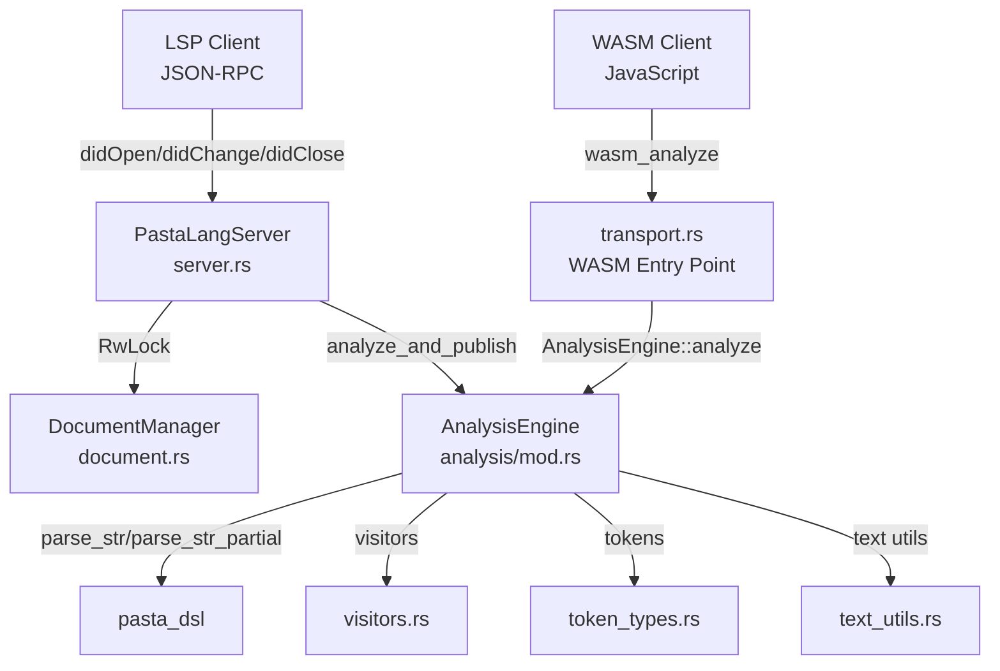

# 設計書

## 概要

**目的**: pasta_lsp クレート（~400行、6ソースファイル）に対するクレート内完結型セキュリティ監査・コード簡素化を実施する。JSON-RPC 入力処理の安全性強化、WASM 境界の安全性確認、デッドコード除去、冗長表現削減を通じて、外部振る舞いを不変に保ちつつコード品質を向上させる。

**ユーザー**: LSP サーバー運用者（エディタ拡張利用者）と pasta メンテナ。

### 目標

- JSON-RPC リクエストハンドラにおける `unwrap()` パニックリスクの解消
- WASM 境界の入力検証確認
- 未使用コードの除去によるコードベースの簡素化
- 冗長な式・パターンのリファクタリング

### 非目標

- LSP プロトコル仕様の変更や新機能追加
- tower-lsp クレート内部の変更
- VS Code 拡張のコード変更
- pasta_dsl パーサーのバグ修正

## 境界コミットメント

### 本 Spec の責務

- `crates/pasta_lsp/src/` 配下の全ソースファイル（6ファイル + `analysis/` サブモジュール4ファイル）の脆弱性調査と修正
- `RwLock::write().unwrap()` のパニックリスク対応
- document.rs の `line_col_to_offset` 境界チェック
- transport.rs の WASM 型変換の冗長性削減
- error.rs の未使用バリアント調査
- 既存テスト 11 ファイル全パスの維持

### 対象外

- tower-lsp の JSON-RPC デシリアライズ処理（tower-lsp 側の責務）
- pasta_dsl パーサーの内部バグ（`audit-pasta-dsl` の責務）
- VS Code 拡張コード（`editors/vscode/`）
- 新しい LSP 機能（completion、hover 等）の追加
- 外部依存クレートのサプライチェーン監査（`audit-dependency-supply-chain` の責務）

### 許可される依存

- `pasta_dsl`: パーサー API（`parse_str`, `parse_str_partial`）の消費のみ
- `tower-lsp`: LSP プロトコル型と `LanguageServer` トレイト
- `serde`, `serde_json`: シリアライゼーション（WASM 境界）
- `thiserror`: エラー型定義
- `wasm-bindgen`, `js-sys`, `serde-wasm-bindgen`: WASM ターゲットのみ

### 再検証トリガー

- tower-lsp のメジャーバージョン更新
- `RwLock` から別の同期プリミティブへの変更
- WASM エントリポイントのシグネチャ変更
- 新しい LSP ハンドラの追加

## アーキテクチャ

### 既存アーキテクチャ分析



**現在のアーキテクチャパターン**:
- tower-lsp ベースの LSP サーバー（`PastaLangServer`）
- `RwLock<DocumentManager>` によるスレッドセーフなドキュメント管理
- `AnalysisEngine::analyze()` による同期的な解析（`catch_unwind` でパニック捕捉済み）
- `transport.rs` による WASM エントリポイント（`cfg(wasm32)` 条件コンパイル）

**既存パターンの尊重**:
- `catch_unwind` + `AssertUnwindSafe` パターンは維持
- `DocumentManager` の HashMap ベース管理は維持
- セマンティックトークンのデルタエンコーディングは維持

### 技術スタック

| レイヤー | 選択 / バージョン | 本機能での役割 | 備考 |
|---------|------------------|--------------|------|
| LSP フレームワーク | tower-lsp 0.20 | LSP プロトコルハンドリング | 変更なし |
| パーサー | pasta_dsl (workspace) | AST 生成 | API 消費のみ |
| WASM | wasm-bindgen 0.2 | JS 連携 | cfg(wasm32) のみ |
| エラー型 | thiserror 2 | エラー定義 | 変更なし |

## ファイル構成計画

### 修正ファイル

- `crates/pasta_lsp/src/server.rs` — `RwLock::write().unwrap()` を安全なエラーハンドリングに置換、不要な `.clone()` 除去
- `crates/pasta_lsp/src/document.rs` — `line_col_to_offset` の境界外アクセス防御確認、冗長パターン簡素化
- `crates/pasta_lsp/src/transport.rs` — WASM 型変換の冗長性削減、WASM エントリポイントの入力検証確認
- `crates/pasta_lsp/src/error.rs` — 未使用バリアントの調査と必要に応じた除去
- `crates/pasta_lsp/src/analysis/mod.rs` — `catch_unwind` + `AssertUnwindSafe` の安全性コメント追加
- `crates/pasta_lsp/src/analysis/visitors.rs` — 冗長パターンの簡素化（該当箇所がある場合）

### 変更なし

- `crates/pasta_lsp/src/lib.rs` — pub re-export のみ、変更不要
- `crates/pasta_lsp/src/analysis/token_types.rs` — 定数定義のみ、変更不要
- `crates/pasta_lsp/src/analysis/text_utils.rs` — ユーティリティ関数、安全性確認のみ

## コンポーネントとインターフェース

### 監査対象コンポーネント一覧

| コンポーネント | レイヤー | 監査内容 | 要件カバレッジ | 主要リスク |
|-------------|---------|---------|-------------|----------|
| PastaLangServer | LSP ハンドラ | RwLock パニック、入力検証 | 1.1-1.6, 3.1-3.3 | `unwrap()` パニック |
| DocumentManager | ドキュメント管理 | 境界チェック、冗長パターン | 1.3-1.4, 5.2 | 範囲外アクセス |
| transport.rs | WASM 境界 | 入力検証、型変換簡素化 | 2.1-2.4, 5.3 | 不正入力 |
| error.rs | エラー定義 | デッドコード調査 | 4.3 | 未使用バリアント |
| AnalysisEngine | 解析エンジン | パニック耐性確認 | 3.1-3.3 | パーサーパニック |
| visitors.rs | AST ビジター | 冗長パターン | 5.2 | 冗長性 |

### LSP ハンドラ層

#### PastaLangServer（server.rs）

| フィールド | 詳細 |
|----------|------|
| 意図 | LSP リクエストの安全な処理 |
| 要件 | 1.1, 1.2, 1.3, 1.4, 1.5, 1.6, 3.1, 3.2 |

**責務と制約**
- `RwLock::write().unwrap()` → `RwLock::write().ok()` またはエラーログ + 早期リターンに変更
- `RwLock::read().unwrap()` → 同様の安全なハンドリング
- `params.text_document.uri.clone()` / `params.text_document.text.clone()` の不要な clone 調査
- `analyze_and_publish` 内の `catch_unwind` パターンは維持（安全性コメント追加）

**修正方針**:
```
// Before (パニックリスク)
let mut docs = self.documents.write().unwrap();

// After (安全)
let Ok(mut docs) = self.documents.write() else {
    // RwLock がポイズニングした場合はログ出力して早期リターン
    return;
};
```

#### DocumentManager（document.rs）

| フィールド | 詳細 |
|----------|------|
| 意図 | ドキュメントテキストの安全な管理 |
| 要件 | 1.3, 1.4, 5.2 |

**責務と制約**
- `change()` メソッドの `line_col_to_offset` 返却値が `None` の場合は変更をスキップ（既に実装済み — 確認のみ）
- 未登録ドキュメントへの `change` は `if let Some(doc)` でガード済み（確認のみ）
- 冗長な `if change.range.is_some() { if let Some(range) = &change.range` パターンの簡素化

### WASM 境界層

#### transport.rs

| フィールド | 詳細 |
|----------|------|
| 意図 | WASM エントリポイントの安全性と型変換の簡素化 |
| 要件 | 2.1, 2.2, 2.3, 2.4, 5.3 |

**責務と制約**
- `wasm_analyze()` 関数の入力検証確認（空文字列、不正入力）
- `WasmAnalysisResult::from_analysis()` の冗長な個別フィールドマッピングの簡素化検討
- `DiagnosticSeverity` マッチの `_ => 1` デフォルトケースの妥当性確認

### エラー定義層

#### LangServerError（error.rs）

| フィールド | 詳細 |
|----------|------|
| 意図 | エラー型の使用状況確認 |
| 要件 | 4.3 |

**責務と制約**
- 3バリアント（`Parse`, `DocumentNotFound`, `Internal`）の使用箇所を調査
- 未使用バリアントがあれば除去（ただし pub API として公開されているため慎重に判断）

## 要件トレーサビリティ

| 要件 | 概要 | コンポーネント | 修正内容 |
|-----|------|-------------|---------|
| 1.1 | 不正 URI の安全処理 | PastaLangServer | tower-lsp 側でハンドル済み確認 |
| 1.2 | 空テキストの安全処理 | PastaLangServer, AnalysisEngine | 既存パス確認 |
| 1.3 | 範囲外行番号・列番号 | DocumentManager | line_col_to_offset 境界チェック確認 |
| 1.4 | didOpen 前の didChange | DocumentManager | HashMap ガード確認 |
| 1.5 | RwLock ポイズニング | PastaLangServer | unwrap() → 安全なハンドリング |
| 1.6 | 既存テスト全パス | 全体 | テスト実行 |
| 2.1 | WASM 空文字列 | transport.rs | 入力検証確認 |
| 2.2 | WASM 不正 UTF-8 | transport.rs | 入力検証確認 |
| 2.3 | serde-wasm-bindgen 型安全 | transport.rs | シリアライズ確認 |
| 2.4 | WASM コンパイル互換性 | transport.rs | ビルド確認 |
| 3.1 | パーサーパニック捕捉 | AnalysisEngine | catch_unwind 確認 |
| 3.2 | 他ドキュメント継続 | PastaLangServer | 独立性確認 |
| 3.3 | AssertUnwindSafe 文書化 | AnalysisEngine | コメント追加 |
| 4.1 | 未使用 pub アイテム除去 | 全体 | コンパイラ警告確認 |
| 4.2 | 未使用 import 除去 | 全体 | コンパイラ警告確認 |
| 4.3 | LangServerError 使用確認 | error.rs | 使用箇所調査 |
| 4.4 | 外部 API 不変 | 全体 | pub API 保持 |
| 5.1 | 不要 clone 除去 | server.rs | clone 調査 |
| 5.2 | 冗長パターン簡素化 | document.rs, visitors.rs | パターン改善 |
| 5.3 | 重複型変換簡素化 | transport.rs | WASM 変換改善 |
| 5.4 | 外部振る舞い不変 | 全体 | LSP レスポンス保持 |
| 5.5 | テスト全パス | 全体 | テスト実行 |

## テスト戦略

### ユニットテスト
- `RwLock` ポイズニング時の安全なフォールバック動作（server.rs）
- `line_col_to_offset` の境界外入力に対する防御（document.rs）
- `WasmAnalysisResult::from_analysis()` の空入力・エッジケース（transport.rs）

### 統合テスト
- 既存テスト 11 ファイル全パス確認（リグレッション防止）
- 空ドキュメント・大量ドキュメントの LSP ライフサイクル
- パーサーパニック時のエラーログ出力とサーバー継続

### ビルド検証
- `cargo build` でネイティブターゲットのコンパイル成功
- `cargo build --target wasm32-unknown-unknown`（WASM ツールチェーンがある場合）でコンパイル成功

## エラーハンドリング

### エラー戦略

本監査では、既存の `panic!` リスクを安全なエラーハンドリングに置換する。新しいエラー型の導入は行わず、既存の `LangServerError` 型の利用状況を確認する。

### エラーカテゴリ

| カテゴリ | 現状 | 修正後 |
|---------|------|--------|
| RwLock ポイズニング | `unwrap()` → パニック | `ok()` / `let-else` → ログ + 早期リターン |
| 範囲外オフセット | `None` チェック済み | 確認のみ（変更不要） |
| パーサーパニック | `catch_unwind` 済み | 確認 + コメント追加 |
| 未登録ドキュメント | `if let Some` ガード済み | 確認のみ（変更不要） |
