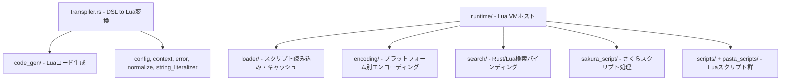

# 設計ドキュメント

## 概要

本設計は、pasta_luaクレート（約8,000行、37ソースファイル）の脆弱性監査・コード簡素化の技術的アプローチを定義する。監査はモジュール単位で段階的に進め、各モジュールで（1）セキュリティ検証、（2）デッドコード除去、（3）冗長表現削減、（4）回帰テスト検証の4ステップを実行する。

**ユーザー**: pasta開発者（監査実施者）が各モジュールの安全性と品質を体系的に改善する。

**影響**: 外部API不変のまま内部実装を改善し、総行数を削減する。

### ゴール
- 全 `unsafe` ブロックにSAFETYコメントを付与し安全性を検証する
- Lua実行パスの安全性を確認しインジェクションリスクをゼロにする
- 複雑度ホットスポット（上位10ファイル）のデッドコード・冗長表現を削減する
- Luaスクリプト群の安全性を検証する
- 全既存テストをパスし性能劣化なしを保証する

### 非ゴール
- mlua/LuaJIT内部実装の修正
- 公開APIシグネチャの変更
- 新機能追加やアーキテクチャの大幅な変更
- ファイル分割の強制（400行は努力目標）

## 境界コミットメント

### 本仕様が所有するもの
- pasta_lua/src/ 配下の全Rustソースファイルの内部実装改善
- pasta_lua/ 配下のLuaスクリプト群（scripts/, pasta_scripts/）の安全性検証
- `unsafe` ブロックへのSAFETYコメント付与
- デッドコード除去・冗長表現削減

### 境界外
- mlua/LuaJITクレートの内部修正
- pasta_core/pasta_dslの公開型やインターフェースの変更
- pasta_shioriのコード修正
- 外部依存クレートのバージョン変更やサプライチェーン監査（audit-dependency-supply-chainが担当）
- scriptlibs/（開発ツール: luacheck, lua_test）の修正

### 許可される依存関係
- pasta_core の公開型（Registry, SceneTable, WordTable等）への読み取り参照
- pasta_dsl の AST型（FileItem, PastaFile等）への読み取り参照
- mlua 0.11 の公開API
- 標準ライブラリ（std::io, std::fs, std::path等）

### 再検証トリガー
- pasta_core/pasta_dsl の公開型が変更された場合
- mlua のメジャーバージョンが変更された場合
- `unsafe` に関するRustコンパイラの安全性ルールが変更された場合

## アーキテクチャ

### 既存アーキテクチャ分析

pasta_luaは以下の6層で構成される:

### アーキテクチャパターンと境界マップ

**選択パターン**: 既存アーキテクチャ維持（内部改善のみ）

監査はモジュール境界に沿って実施し、各モジュールの独立性を尊重する。モジュール間のインターフェースは変更しない。

**監査優先順序**:
1. code_gen/（コード生成） — 最も複雑度が高く他モジュールへの影響が小さい
2. runtime/（ランタイム） — unsafe使用箇所を含み安全性検証が必要
3. transpiler（トランスパイラ） — code_genとの境界確認後に実施
4. loader/（ローダー） — ファイルI/Oセキュリティ検証
5. sakura_script/（さくらスクリプト） — 正規表現安全性検証
6. Luaスクリプト群 — グローバル汚染と危険関数検査

### テクノロジースタック

| レイヤー | 選択 / バージョン | 機能内の役割 | 備考 |
|---------|------------------|-------------|------|
| 言語 | Rust 2024 edition | 監査対象のメイン言語 | 変更なし |
| Luaランタイム | LuaJIT 2.1 (mlua 0.11) | Lua VM管理 | unsafe_new_with必須 |
| テスト | insta 1.46 | スナップショットテスト | 回帰検出に使用 |
| 静的解析 | luacheck v1.2.0 | Luaスクリプト検査 | scriptlibs/ |

## ファイル構造計画

本仕様はファイルの新規作成を行わない。全て既存ファイルの修正のみ。

### 変更対象ファイル

**code_gen/ モジュール（コード生成）**:
- `src/code_gen/element_gen.rs` — デッドコード除去、冗長分岐の簡素化、unreachable!()検証
- `src/code_gen/scope_gen.rs` — 重複パターン共通化
- `src/code_gen/mod.rs` — 必要に応じた共通ヘルパーの追加

**runtime/ モジュール（ランタイム）**:
- `src/runtime/mod.rs` — SAFETYコメント付与（unsafe_new_with）、冗長コード削減
- `src/runtime/enc.rs` — SAFETYコメント付与（テスト用unsafe）
- `src/runtime/finalize.rs` — Luaレジストリ収集ロジックの簡素化
- `src/runtime/persistence.rs` — ファイルI/Oエラーハンドリング検証
- `src/runtime/module_registry.rs` — モジュール登録重複パターン共通化
- `src/runtime/runtime_config.rs` — 設定検証ロジック確認

**transpiler/ モジュール**:
- `src/transpiler.rs` — フェーズ責務分離の改善、デッドコード除去

**loader/ モジュール（ローダー）**:
- `src/loader/mod.rs` — パス検証のセキュリティ確認
- `src/loader/cache.rs` — キャッシュ管理の簡素化
- `src/loader/config.rs` — 設定解析の冗長性削減
- `src/loader/context.rs` — コンテキスト管理確認
- `src/loader/discovery.rs` — ファイル検出パスの安全性検証

**encoding/ モジュール**:
- `src/encoding/windows.rs` — SAFETYコメント付与（Windows FFI unsafe）

**sakura_script/ モジュール**:
- `src/sakura_script/tokenizer.rs` — 正規表現ReDoS検証
- `src/sakura_script/wait_inserter.rs` — unreachable!()検証
- `src/sakura_script/line_breaker.rs` — 冗長パターン確認
- `src/sakura_script/mod.rs` — 全体構造確認

**その他ユーティリティ**:
- `src/context.rs` — 冗長性確認
- `src/normalize.rs` — デッドコード確認
- `src/string_literalizer.rs` — 冗長性確認
- `src/logging/` — 機密情報ログ検査

**Luaスクリプト群**:
- `pasta_scripts/` — グローバル汚染・危険関数検査
- `scripts/` — ユーザースクリプトテンプレート安全性確認

## 要件トレーサビリティ

| 要件 | サマリ | コンポーネント | 検証方法 |
|------|--------|--------------|---------|
| 1.1 | unsafe検査・SAFETYコメント付与 | runtime/mod.rs, runtime/enc.rs | コードレビュー、SAFETYコメント存在確認 |
| 1.2 | Lua VM初期化の最小権限検証 | runtime/mod.rs, runtime_config.rs | StdLibパラメータ確認 |
| 1.3 | Windows FFI安全性検証 | encoding/windows.rs | バッファ検証ロジック確認 |
| 1.4 | SAFETYコメント統一付与 | 全unsafeブロック | grep検索で網羅確認 |
| 2.1 | ハードコードrequireの安全性 | runtime/finalize.rs | コードレビュー |
| 2.2 | 外部データ入力検証 | runtime/mod.rs | 入力パス追跡 |
| 2.3 | ディレクトリトラバーサル防止 | loader/ | パス検証ロジック確認 |
| 2.4 | eval戻り値エラーハンドリング | runtime/ 全体 | unwrap使用箇所のgrep確認 |
| 3.1 | element_gen.rs簡素化 | code_gen/element_gen.rs | 行数比較、スナップショットテスト |
| 3.2 | unreachable!()検証 | code_gen/element_gen.rs | 到達可能性分析 |
| 3.3 | code_gen重複共通化 | code_gen/ 全体 | コードレビュー |
| 3.4 | トランスパイル出力不変 | code_gen/ 全体 | instaスナップショット |
| 4.1 | finalize.rs簡素化 | runtime/finalize.rs | 行数比較 |
| 4.2 | persistence.rsエラーハンドリング | runtime/persistence.rs | I/Oパス検証 |
| 4.3 | module_registry.rs共通化 | runtime/module_registry.rs | 重複削減確認 |
| 4.4 | ランタイムテスト全パス | runtime/ 全体 | cargo test |
| 5.1 | transpiler.rsフェーズ分離 | transpiler.rs | コードレビュー |
| 5.2 | transpiler冗長コード削除 | transpiler.rs | 行数比較 |
| 5.3 | トランスパイラテスト全パス | transpiler.rs | cargo test |
| 6.1 | loader/パス安全性 | loader/ | セキュリティレビュー |
| 6.2 | sakura_script正規表現安全性 | sakura_script/ | ReDoS分析 |
| 6.3 | logging機密情報検査 | logging/ | ログ出力レビュー |
| 6.4 | ユーティリティデッドコード除去 | 全ユーティリティ | dead_code警告確認 |
| 7.1 | Luaグローバル汚染検査 | pasta_scripts/ | luacheck実行 |
| 7.2 | 危険関数使用検査 | pasta_scripts/, scripts/ | grep検索 |
| 7.3 | Lua依存関係・循環参照検査 | pasta_scripts/ | 依存グラフ分析 |
| 7.4 | Luaテスト全パス | Luaスクリプト群 | lua_test実行 |
| 8.1 | pasta_luaテスト全パス | 全体 | cargo test -p pasta_lua |
| 8.2 | 下流クレートテスト全パス | pasta_shiori等 | cargo test --workspace |
| 8.3 | 性能劣化なし確認 | ホットパス | ベンチマーク（必要に応じ） |
| 8.4 | 総行数削減 | 全体 | wc -l比較 |

## コンポーネントとインターフェース

| コンポーネント | ドメイン/レイヤー | 意図 | 要件カバレッジ | 主要依存 | 監査項目 |
|--------------|-----------------|------|-------------|---------|---------|
| code_gen | コード生成 | AST→Lua変換 | 3.1-3.4 | pasta_dsl AST (P0) | デッドコード、冗長分岐、unreachable |
| runtime | ランタイム | Lua VMホスト | 1.1-1.4, 2.1-2.4, 4.1-4.4 | mlua (P0) | unsafe, eval, エラーハンドリング |
| transpiler | トランスパイラ | マルチフェーズ変換 | 5.1-5.3 | code_gen (P0) | フェーズ分離、冗長コード |
| loader | ローダー | スクリプト読み込み | 6.1 | std::fs (P0) | パストラバーサル |
| sakura_script | さくらスクリプト | テキスト処理 | 6.2 | regex (P1) | ReDoS |
| encoding | エンコーディング | 文字変換 | 1.3 | windows-sys (P0) | FFI unsafe |
| logging | ロギング | ログ管理 | 6.3 | tracing (P1) | 機密情報漏洩 |
| lua_scripts | Luaスクリプト | ランタイムスクリプト | 7.1-7.4 | LuaJIT (P0) | グローバル汚染、危険関数 |

### コード生成レイヤー

#### code_gen モジュール

| フィールド | 詳細 |
|-----------|------|
| 意図 | Pasta AST要素からLuaソースコードを生成する |
| 要件 | 3.1, 3.2, 3.3, 3.4 |

**責務と制約**
- element_gen.rs: 各AST要素（Talk, Action, Variable等）のLua変換
- scope_gen.rs: スコープ（シーン、アクター）レベルのLua構造生成
- 変更後のトランスパイル出力はバイト単位で同一でなければならない

**依存関係**
- Inbound: transpiler.rs — トランスパイルパイプラインからの呼び出し (P0)
- Outbound: pasta_dsl AST型 — 入力データ構造 (P0)

**監査アプローチ**
- `unreachable!()` の到達可能性を型システムとテストカバレッジで検証
- 繰り返しwrite!マクロパターンの共通ヘルパー化検討
- デッドコード（未使用の分岐、到達しないマッチアーム）の除去

### ランタイムレイヤー

#### runtime モジュール

| フィールド | 詳細 |
|-----------|------|
| 意図 | LuaJIT VMの初期化・管理・スクリプト実行 |
| 要件 | 1.1, 1.2, 1.3, 1.4, 2.1, 2.2, 2.3, 2.4, 4.1, 4.2, 4.3, 4.4 |

**責務と制約**
- mod.rs: PastaLuaRuntime構造体、VM初期化、スクリプト実行
- finalize.rs: Luaレジストリからシーン・単語テーブルを収集しSearchContextを構築
- persistence.rs: SAVE/LOADテーブルのファイル永続化
- module_registry.rs: pasta_*モジュールのLua登録
- enc.rs: エンコーディングモジュールのLua登録
- runtime_config.rs: StdLib構成の解析と検証

**依存関係**
- Inbound: pasta_shiori — SHIORI DLL経由の呼び出し (P0)
- Outbound: mlua — Lua VMバインディング (P0)
- Outbound: pasta_core — レジストリ型 (P0)
- Outbound: loader/ — スクリプト読み込み (P1)

**監査アプローチ**
- 全 `unsafe` ブロックに `// SAFETY:` コメント付与
- `lua.load().eval()` の入力源を追跡し安全性文書化
- finalize.rsのネストテーブル走査ロジック簡素化
- persistence.rsのファイルI/Oエラーパス検証

## エラーハンドリング

### エラー戦略

本監査では新しいエラー型の追加は行わない。既存の `TranspileError` および `mlua::Error` の使用パターンを検証し、以下を確認する:

- `.unwrap()` がテストコード以外で使用されていないこと
- エラー伝播（`?` 演算子）が一貫して使用されていること
- エラーメッセージが十分な文脈情報を含むこと

## テスト戦略

### 回帰テスト
- `cargo test -p pasta_lua` で全既存テストがパスすること
- `cargo test --workspace` で下流クレートを含む全テストがパスすること
- instaスナップショットテストでトランスパイル出力が不変であること

### セキュリティ検証テスト
- `unsafe` ブロックの `// SAFETY:` コメント存在をgrepで確認
- `unwrap()` 使用箇所のテストコード外での不在をgrepで確認
- loader/のパストラバーサルテストケース確認

### Luaスクリプトテスト
- luacheckによる静的解析（グローバル汚染、未使用変数）
- lua_testフレームワークによるBDDテスト全パス
- 危険関数（os.execute, io.popen, loadstring）の不在をgrepで確認

### 性能テスト
- コード簡素化後にホットパスの性能劣化がないことを確認
- 必要に応じてベンチマーク実施（大規模な変更がある場合のみ）

## セキュリティ考慮事項

### unsafe安全性

| unsafe箇所 | ファイル | 目的 | リスクレベル |
|-----------|--------|------|------------|
| `Lua::unsafe_new_with(std_lib, ...)` | runtime/mod.rs:101 | VM初期化 | 低（mlua API制約） |
| `Lua::unsafe_new_with(ALL_SAFE, ...)` | runtime/enc.rs:146 | テスト用VM | 低（テスト限定） |
| Windows API呼び出し | encoding/windows.rs:112 | Shift_JIS変換 | 中（バッファ管理） |
| Windows API呼び出し | encoding/windows.rs:168 | UTF-8変換 | 中（バッファ管理） |

### Lua実行安全性

- ハードコードされた `require` 呼び出し → インジェクションリスクなし
- トランスパイラ生成コードの実行 → 入力はpasta_dslパーサーを通過済み
- ファイルからのスクリプト読み込み → ローダーのパス検証に依存

### ファイルI/O安全性

- loader/のファイルパス操作 → ディレクトリトラバーサル検証必要
- persistence.rsのSAVE/LOAD → ファイルパスの検証確認必要
