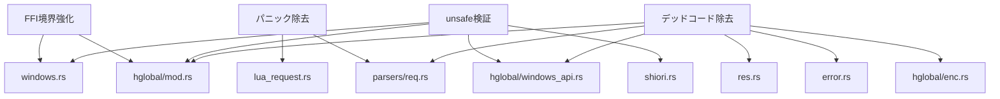

# Design Document

## Overview

**Purpose**: pasta_shiori クレートの脆弱性監査・コード簡素化を実施し、外部振る舞い不変のまま、メモリ安全性・堅牢性・保守性を向上させる。

**Users**: ゴースト作者（不正リクエストへの耐性向上）、メンテナー（コード品質・可読性向上）

**Impact**: unsafeブロックの安全性ドキュメント化、FFI境界の防御強化、パニック除去、デッドコード除去により、約1,500行のコードベースの品質を監査基準に引き上げる。

### Goals
- 全unsafeブロックにSAFETYコメントを付与し、安全性の根拠を明文化する
- FFI境界でのNULLポインタ・不正入力への防御を追加する
- プロダクションコードからパニック可能性を排除する
- デッドコードを除去してコードベースを簡素化する

### Non-Goals
- SHIORIプロトコル仕様の変更
- Windows API呼び出しパターンの設計変更
- 新しいSHIORI機能の追加
- パフォーマンス最適化（性能不変が目標）

## Boundary Commitments

### This Spec Owns
- pasta_shiori/src/ 配下の全ソースファイルの修正
- unsafeブロックのSAFETYコメント付与
- FFI関数の入力検証ロジック追加
- プロダクションコード内のunwrap()/panic!()のResult伝搬変換
- `#[allow(dead_code)]`の精査と除去・置換
- 空ファイル（res.rs）の除去
- 冗長なコードの簡潔化

### Out of Boundary
- windows-sys クレートの内部実装
- pasta_lua / pasta_core の公開API変更
- SHIORIプロトコル自体の仕様変更
- テストコード内のunwrap()使用（テスト内では許容）
- req_parser.pest 文法ファイルの変更

### Allowed Dependencies
- 既存の依存クレート（pest, time, tracing, thiserror, windows-sys）のみ
- pasta_core, pasta_lua の公開API（読み取り専用、変更なし）
- 新しい外部依存の追加は不可

### Revalidation Triggers
- MyError列挙型のバリアント変更（From実装への影響）
- ShioriString APIの変更（windows.rsのFFI関数への影響）
- SHIORIリクエストパーサーのエラー型変更（lua_request.rsへの影響）

## Architecture

### Existing Architecture Analysis

pasta_shioriの現在のアーキテクチャは以下のレイヤー構造:

```
windows.rs (extern "C" FFI境界)
  └── RawShiori<T> (SHIORI DLLプロトコル管理)
       └── PastaShiori (Shiori trait実装)
            ├── lua_request.rs (SHIORIリクエスト → Lua Table変換)
            │    └── parsers/req_parser.rs (Pest PEG文法)
            ├── error.rs (MyError型)
            └── util/
                 ├── hglobal/ (HGLOBALメモリ管理)
                 │    ├── mod.rs (ShioriString)
                 │    ├── enc.rs (ANSI/OEM エンコーディング)
                 │    └── windows_api.rs (MultiByteToWideChar等)
                 ├── parsers/ (SHIORIプロトコルパーサー)
                 │    ├── mod.rs
                 │    ├── req.rs (ShioriRequest — テスト専用)
                 │    ├── req_parser.rs (Pest派生パーサー)
                 │    └── req_parser.pest (PEG文法)
                 └── res.rs (空ファイル)
```

### Architecture Pattern & Boundary Map

本監査は既存アーキテクチャを維持し、4つの改善領域に分けて適用する:



### Technology Stack

| Layer | Choice / Version | Role in Feature | Notes |
|-------|------------------|-----------------|-------|
| Backend | Rust 2024 edition | 全修正対象 | 既存 |
| FFI | windows-sys 0.61 | Windows DLL API | 変更なし |
| Parser | pest 2.8.6 | SHIORIプロトコルパース | 文法変更なし |
| Error | thiserror 2 | エラー型定義 | バリアント変更あり |

## File Structure Plan

### Modified Files
- `crates/pasta_shiori/src/windows.rs` — FFI関数にNULLチェック追加、SAFETYコメント追加
- `crates/pasta_shiori/src/shiori.rs` — `unsafe impl Send/Sync`のSAFETYコメント充実
- `crates/pasta_shiori/src/lua_request.rs` — unwrap()/panic!()をResult伝搬に変換、`#[allow(dead_code)]`精査
- `crates/pasta_shiori/src/error.rs` — MyError::Others除去、script_error()のdead_code精査、From実装簡潔化
- `crates/pasta_shiori/src/util/mod.rs` — `pub mod res;`の除去
- `crates/pasta_shiori/src/util/hglobal/mod.rs` — SAFETYコメント追加、`#[allow(dead_code)]`の精査・置換
- `crates/pasta_shiori/src/util/hglobal/enc.rs` — ファイルレベル`#![allow(dead_code)]`の精査、個別指定への変換
- `crates/pasta_shiori/src/util/hglobal/windows_api.rs` — SAFETYコメント追加、ファイルレベル`#![allow(dead_code)]`の精査、未使用定数の除去
- `crates/pasta_shiori/src/util/parsers/req.rs` — `#[cfg(test)]`化またはデッドコード除去、unwrap()/panic!()の変換
- `crates/pasta_shiori/src/util/parsers/req_parser.rs` — `#[allow(dead_code)]`の理由コメント追加

### Deleted Files
- `crates/pasta_shiori/src/util/res.rs` — 空ファイル、除去

## Requirements Traceability

| Requirement | Summary | Components | Interfaces | Flows |
|-------------|---------|------------|------------|-------|
| 1.1, 1.2, 1.3 | unsafe安全性検証 | windows.rs, shiori.rs, hglobal/mod.rs, windows_api.rs | — | — |
| 2.1, 2.2, 2.3, 2.4 | FFI入力検証 | windows.rs, hglobal/mod.rs | extern "C" 関数群 | load/request フロー |
| 3.1, 3.2, 3.3, 3.4, 3.5 | パニック除去 | lua_request.rs, req.rs | parse_request, ShioriRequest::parse | リクエストパースフロー |
| 4.1, 4.2, 4.3, 4.4 | デッドコード除去 | res.rs, error.rs, req.rs, hglobal/mod.rs, enc.rs, windows_api.rs | — | — |
| 5.1, 5.2, 5.3 | 冗長表現削減 | req.rs, lua_request.rs, error.rs | — | — |
| 6.1, 6.2, 6.3, 6.4 | テスト全パス | 全ファイル | cargo test, cargo clippy | — |

## Components and Interfaces

| Component | Domain/Layer | Intent | Req Coverage | Key Dependencies | Contracts |
|-----------|--------------|--------|--------------|------------------|-----------|
| windows.rs | FFI境界 | DLLエクスポート関数のNULL防御 | 1, 2 | hglobal (P0) | Service |
| hglobal/mod.rs | メモリ管理 | HGLOBAL安全操作 | 1, 2 | windows-sys (P0) | State |
| hglobal/enc.rs | エンコーディング | ANSI/OEM変換 | 4 | windows_api.rs (P1) | Service |
| hglobal/windows_api.rs | Windows API | 文字コード変換 | 1, 4 | windows-sys (P0) | Service |
| shiori.rs | コア | SHIORI実装 | 1 | pasta_lua (P0) | Service |
| lua_request.rs | パーサー | リクエスト→Luaテーブル | 3, 5 | pest (P0) | Service |
| error.rs | エラー型 | MyError定義 | 4, 5 | thiserror (P1) | State |
| parsers/req.rs | テスト支援 | ShioriRequest構造体 | 3, 4 | pest (P1) | — |

### FFI境界層

#### windows.rs

| Field | Detail |
|-------|--------|
| Intent | extern "C" 関数にNULLポインタ・ゼロ長チェックを追加 |
| Requirements | 1.1, 1.2, 2.1, 2.2, 2.3, 2.4 |

**Responsibilities & Constraints**
- DLLMain, load, unload, request の4関数が対象
- NULLポインタとゼロ長入力の早期検出・安全なリターン
- SAFETYコメントの追加（各関数の安全性前提条件）

**Contracts**: Service [x]

##### Service Interface
```rust
// load: NULLチェック追加
pub extern "C" fn load(hdir: HGLOBAL, len: usize) -> bool {
    // SAFETY: hdir is provided by SHIORI host and must be a valid HGLOBAL.
    // Null check added for defensive programming.
    if hdir.is_null() || len == 0 { return false; }
    // ...existing logic
}

// request: NULLチェック追加
pub extern "C" fn request(req: HGLOBAL, len: &mut usize) -> HGLOBAL {
    // SAFETY: req is provided by SHIORI host.
    if req.is_null() { *len = 0; return ptr::null_mut(); }
    // ...existing logic
}
```

### メモリ管理層

#### hglobal/mod.rs

| Field | Detail |
|-------|--------|
| Intent | ShioriString のunsafeブロックにSAFETYコメント追加、dead_code精査 |
| Requirements | 1.1, 1.2, 1.3, 4.1, 4.2 |

**Responsibilities & Constraints**
- capture, clone_from_slice_impl, as_bytes のunsafeブロックに安全性コメント追加
- `unsafe impl Send/Sync` に安全性の根拠を詳述
- `#[allow(dead_code)]`付きメソッド7箇所の使用状況を検証し、テスト専用は`#[cfg(test)]`化、FFI用は理由コメント付与

#### hglobal/windows_api.rs

| Field | Detail |
|-------|--------|
| Intent | Windows API unsafeブロックのSAFETYコメント追加、未使用定数除去 |
| Requirements | 1.1, 4.1 |

**Responsibilities & Constraints**
- multi_byte_to_wide_char, wide_char_to_multi_byte のunsafeブロックにSAFETYコメント追加
- 未使用の定数（MB_COMPOSITE, MB_USEGLYPHCHARS, WC_DISCARDNS等）を除去

### パーサー層

#### lua_request.rs

| Field | Detail |
|-------|--------|
| Intent | parse_key_value内のunwrap()/panic!()をResult伝搬に変換 |
| Requirements | 3.1, 3.2, 3.3 |

**Responsibilities & Constraints**
- `it.next().unwrap()` → `it.next().ok_or(...)?`
- `pair.as_str().parse().unwrap()` → `pair.as_str().parse().map_err(...)?`
- `panic!()` → `return Err(...)`
- lua_date関数の`#[allow(dead_code)]`精査

#### parsers/req.rs

| Field | Detail |
|-------|--------|
| Intent | テスト専用化、unwrap()/panic!()のResult伝搬変換 |
| Requirements | 3.4, 4.1, 4.2, 5.1 |

**Responsibilities & Constraints**
- ShioriRequest構造体全体を`#[cfg(test)]`で囲む
- parse1, parse_key_value内のunwrap()/panic!()をResult伝搬に変換

### エラー型

#### error.rs

| Field | Detail |
|-------|--------|
| Intent | 未使用バリアント除去、From実装の簡潔化 |
| Requirements | 4.4, 5.2 |

**Responsibilities & Constraints**
- MyError::Others バリアント除去
- script_error() メソッドの使用状況検証
- パニック除去で追加されるエラーバリアント（不正パースエラー等）の定義

## Error Handling

### Error Strategy
- FFI境界: パニックではなくbool/NULLリターン
- パーサー: Result<T, MyError>を一貫して使用
- unsafeブロック: 前提条件チェック → 早期リターン

### Error Categories and Responses
- **不正入力**（FFI境界）: NULLポインタ → false / null_mut()、tracing::errorでログ出力
- **パースエラー**（リクエスト処理）: MyError::ParseRequest → SHIORI 500応答
- **エンコーディングエラー**: MyError::EncodeAnsi / EncodeUtf8 → SHIORI 500応答

## Testing Strategy

### Unit Tests
- 既存テスト全パス（req_parser.rs内24テスト、req.rsテスト、hglobal/mod.rsテスト）
- NULLチェック追加後のFFI関数テスト（windows.rsは#[cfg(windows)]のためCIでは限定的）

### Integration Tests
- pasta_shiori/tests/ 配下の全テストパス
- pasta_shiori/src/shiori_tests.rs の全テストパス

### Regression Tests
- `cargo test` ワークスペース全体でリグレッションなし
- `cargo clippy -p pasta_shiori` で新規警告なし
