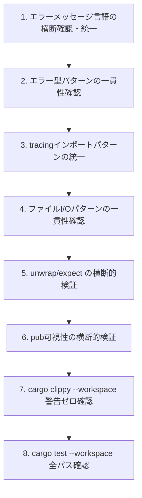

# 設計書

## 概要

**目的**: Wave 1監査完了後の7クレートに対して、クレート横断のエラーハンドリングパターン・コーディング規約・共通パターンの一貫性を確保する。2箇所以上の重複に限定して共通化を行い、外部振る舞い不変を維持する。

**ユーザー**: pasta開発者（メンテナ）が、統一されたパターンと規約に従うことでコードベースの保守性・可読性を向上させる。

**影響**: 各クレートの内部実装のうち、横断的に不一致なパターンのみを修正する。公開APIシグネチャ・外部振る舞いは不変。

### ゴール
- 全7クレートのエラーメッセージ言語を英語に統一する
- エラー型定義パターンの一貫性を確保する
- ファイルI/Oエラーハンドリングの重複パターンを確認し、一貫性を確保する
- tracing インポートパターンをワイルドカードから明示的インポートに統一する
- `unwrap()`/`expect()` の使用を横断的に検証する
- `pub` 可視性を横断的に検証する
- `cargo clippy --workspace` 警告ゼロを保証する

### 非ゴール
- 新しい共通クレートの新設
- クレート間の依存関係の再構成
- 個別クレートの内部ロジック改善（Wave 1で完了済み）
- 公開APIシグネチャの変更
- 新機能追加やアーキテクチャ変更
- 過度な共通化（1箇所のみの使用パターンのヘルパー化）

## 境界コミットメント

### 本仕様の責任範囲
- 全7クレートの `error.rs` / エラー型定義ファイルのエラーメッセージ言語・パターン統一
- tracing インポートパターンの統一（ワイルドカード → 明示的）
- ファイルI/O パターンの一貫性確認と必要最小限の共通化
- `unwrap()`/`expect()` の横断的最終検証
- `pub` 可視性の横断的検証
- `cargo clippy --workspace` 警告ゼロの確認
- `cargo test --workspace` 全パスの確認

### 対象外
- 新しい共通クレートの作成（共通化はクレート内ヘルパーまたは既存クレートへの配置のみ）
- 個別クレート内部の新規ロジック改善
- 外部依存クレートの変更・更新（audit-dependency-supply-chain が担当）
- ビルド設定やCI/CDパイプラインの変更
- ドキュメント・コメントの大規模追記
- Wave 1各specで対応済みの改善の重複実施

### 許可される依存
- 各クレートの既存依存のみ（新規外部依存の追加なし）
- `thiserror 2` — 全クレートで既存使用中
- `tracing 0.1` — pasta_core, pasta_lua, pasta_shiori で既存使用中
- Rust標準ライブラリ

### 再検証トリガー
- エラー型のバリアント追加・削除（クレート横断の一貫性に影響）
- 新しいクレートのワークスペース追加
- tracing依存の追加・削除

## アーキテクチャ

### 既存アーキテクチャ分析

**エラー型の現状**:

| クレート | エラー型 | メッセージ言語 | 問題点 |
|---------|---------|-------------|--------|
| pasta_core | `SceneTableError`, `WordTableError` | 英語（一部日本語残存） | `WordTableError::WordNotFound` に日本語残存の可能性 |
| pasta_dsl | `ParseError` | 英語 | 一貫性あり |
| pasta_lua | `TranspileError` | 英語 | 一貫性あり |
| pasta_shiori | `MyError` | 英語 | 命名が汎用的（`MyError`） |
| pasta_lsp | `LangServerError` | 英語 | 一貫性あり |
| pasta_check | `io::Error` 直接使用 | N/A | 独自エラー型なし（`thiserror` 使用あり） |
| pasta_sample_ghost | `GhostError` | 英語 | 一貫性あり |

**tracingインポートの現状**:

| ファイル | パターン | 問題点 |
|---------|---------|--------|
| `pasta_shiori/src/windows.rs` | `use tracing::*` | ワイルドカード — 明示的に統一すべき |
| `pasta_shiori/src/shiori.rs` | `use tracing::{debug, error, info, trace, warn}` | 明示的（適切） |
| `pasta_lua/src/loader/mod.rs` | `use tracing::{debug, error, info, warn}` | 明示的（適切） |
| `pasta_lua/src/loader/cache.rs` | `use tracing::{debug, info, warn}` | 明示的（適切） |

**ファイルI/Oパターンの現状**:
- `pasta_check` (copy.rs, nar.rs, update_files.rs): ディレクトリ再帰走査 + シンボリックリンクスキップ + パストラバーサル防御
- `pasta_sample_ghost` (main.rs): `std::fs::read_dir` によるディレクトリ走査
- `pasta_lua` (loader/): スクリプトファイル検出・キャッシュ管理
- `pasta_dsl` (parser/mod.rs): `std::fs::read_to_string` によるファイル読み込み
- 各クレートの用途が異なるため、共通化の余地は限定的。一貫性確認が主目的。

### アーキテクチャパターン

**変更パターン**: 横断的インプレースリファクタリング（アーキテクチャ不変）

既存のモジュール構成・クレート境界・公開APIを一切変更せず、各クレート内の実装詳細のパターン一貫性のみを修正する。新しいモジュールやクレートの作成は行わない。

### 技術スタック

| レイヤー | 選択 / バージョン | 本機能での役割 | 備考 |
|---------|------------------|---------------|------|
| 言語 | Rust 2024 edition | 全修正対象 | 既存 |
| エラー型 | thiserror 2 | エラーメッセージ修正 | 既存依存 |
| ログ | tracing 0.1 | インポートパターン統一 | 既存依存 |

## ファイル構造計画

本仕様では新規ファイルの作成は行わない。全て既存ファイルのインプレース修正のみ。

### 変更ファイル

**エラーメッセージ言語統一（要件 1）**:
- `crates/pasta_core/src/error.rs` — `WordTableError::WordNotFound` の日本語メッセージ英語化（Wave 1で対応済みの場合は確認のみ）

**エラー型パターン一貫性（要件 2）**:
- `crates/pasta_shiori/src/error.rs` — `MyError` の命名確認（命名変更は公開API変更に該当する可能性があるため慎重に判断）
- 全クレートの `error.rs` — `#[from]` 使用パターンの一貫性確認

**ファイルI/Oパターン一貫性（要件 3）**:
- `crates/pasta_check/src/copy.rs` — パストラバーサル防御パターンの確認
- `crates/pasta_check/src/nar.rs` — 同上
- `crates/pasta_check/src/update_files.rs` — 同上
- `crates/pasta_lua/src/loader/discovery.rs` — ファイル検出パスの安全性パターン確認

**tracingインポートパターン統一（要件 4）**:
- `crates/pasta_shiori/src/windows.rs` — `use tracing::*` → `use tracing::{debug, error, info, trace, warn}` への明示的インポート化

**`unwrap()`/`expect()` 横断的検証（要件 5）**:
- 全クレートの `src/` 配下 — 横断的 grep 検索による最終検証、発見次第修正

**`pub` 可視性横断的検証（要件 6）**:
- 全クレートの `src/` 配下 — 不必要な `pub` の `pub(crate)` 化（発見次第修正）

**コンパイラ警告ゼロ（要件 7）**:
- 全クレートの `src/` 配下 — `cargo clippy --workspace` 警告ゼロの確認、発見次第修正

## システムフロー

本仕様はリファクタリングのみであり、システムフローの変更はない。

監査プロセスフロー（実施順序）:



## 要件トレーサビリティ

| 要件 | 概要 | コンポーネント | 検証方法 |
|------|------|--------------|---------|
| 1 | エラーメッセージ言語統一 | 全クレート error.rs | `#[error("...")] の言語確認` |
| 2 | エラー型パターン一貫性 | 全クレート error.rs | パターン比較、命名規約確認 |
| 3 | ファイルI/Oパターン共通化 | pasta_check, pasta_lua, pasta_sample_ghost | パターン比較、一貫性確認 |
| 4 | tracingインポート統一 | pasta_shiori/windows.rs | ワイルドカードインポートの排除確認 |
| 5 | unwrap/expect 横断検証 | 全クレート src/ | `grep -r "unwrap()\|expect("` |
| 6 | pub可視性横断検証 | 全クレート src/ | 不必要な `pub` の確認 |
| 7 | コンパイラ警告ゼロ | 全ワークスペース | `cargo clippy --workspace` |
| 8 | 外部振る舞い不変 | 全ワークスペース | `cargo test --workspace` |

## コンポーネントとインターフェース

| コンポーネント | レイヤー | 意図 | 要件カバレッジ | 主要変更 |
|-------------|---------|------|-------------|---------|
| error.rs (全クレート) | エラー定義 | メッセージ言語・パターン統一 | 1, 2 | メッセージ英語化、パターン確認 |
| windows.rs (pasta_shiori) | FFI境界 | tracingインポート統一 | 4 | ワイルドカード → 明示的 |
| copy/nar/update_files (pasta_check) | ファイルI/O | パターン一貫性確認 | 3 | 確認のみ（Wave 1で対応済み） |
| loader/ (pasta_lua) | ローダー | ファイルI/Oパターン確認 | 3 | 確認のみ |
| src/ (全クレート) | 横断 | unwrap/pub 検証 | 5, 6 | 発見次第修正 |

### エラー定義レイヤー

#### 全クレート error.rs

| フィールド | 詳細 |
|----------|------|
| 意図 | エラーメッセージ言語の英語統一とパターン一貫性確保 |
| 要件 | 1, 2 |

**責務と制約**
- 全 `#[error("...")]` メッセージが英語であることを確認
- 日本語メッセージが残存していれば英語に置換
- エラーメッセージの文体: 文頭大文字、末尾ピリオドなし、コロン区切りでコンテキスト付与
- `#[from]` 自動変換の使用パターンが一貫していることを確認
- 未使用バリアントが残存していないことを確認

**確認観点**:
```
// 統一パターン（英語、文頭大文字、末尾ピリオドなし）
#[error("Word not found: @{key}")]

// 不適切パターン（日本語）
#[error("単語定義 @{key} が見つかりません")]

// 不適切パターン（文体不一致: 小文字始まり）
#[error("others error")]
```

### ログ出力レイヤー

#### pasta_shiori/src/windows.rs

| フィールド | 詳細 |
|----------|------|
| 意図 | tracing ワイルドカードインポートの明示的インポートへの変換 |
| 要件 | 4 |

**変更内容**:
```rust
// Before
use tracing::*;

// After
use tracing::{debug, error, info, trace, warn};
```

実際に使用されているマクロのみをインポートする。未使用のマクロはインポートしない。

## エラーハンドリング

本仕様はエラーハンドリング自体の統一が主目的であり、新しいエラーフローの追加は行わない。

### エラーメッセージ統一ルール
1. 言語: 英語
2. 文頭: 大文字
3. 末尾: ピリオドなし
4. コンテキスト: コロン区切り（例: `"Scene not found: {scene}"`）
5. 技術用語: そのまま使用（例: `"ANSI encoding error"`）

## テスト戦略

### 回帰テスト
1. `cargo test --workspace` — ワークスペース全テストパス確認
2. `cargo clippy --workspace` — 全警告ゼロ確認

### 検証手順
1. エラーメッセージ: `grep -r '#\[error(' crates/*/src/` で日本語残存チェック
2. tracing: `grep -r 'use tracing::\*' crates/*/src/` でワイルドカード残存チェック
3. unwrap: `grep -rn '\.unwrap()' crates/*/src/ --include='*.rs'` で非テストコードのunwrap確認
4. pub可視性: `cargo clippy --workspace` の可視性関連警告確認
