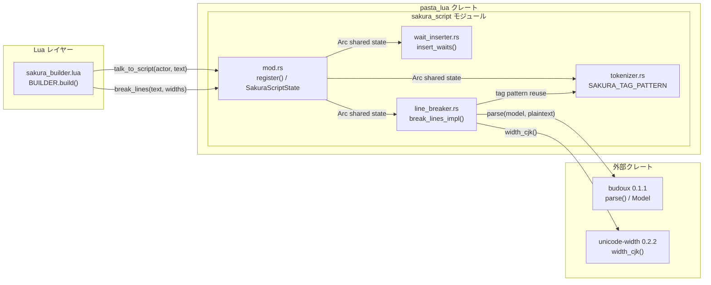
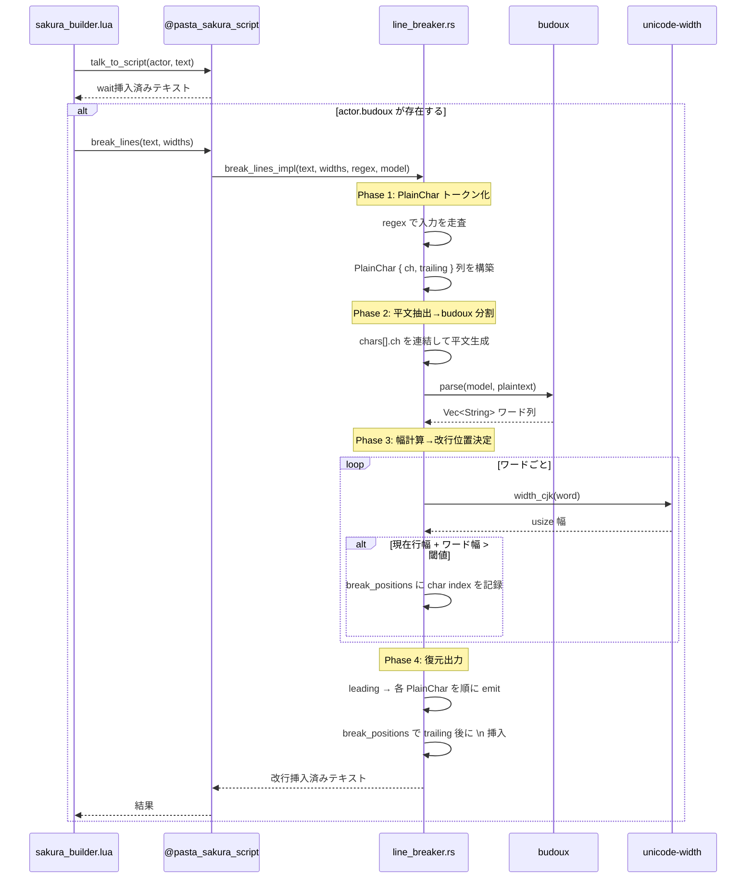
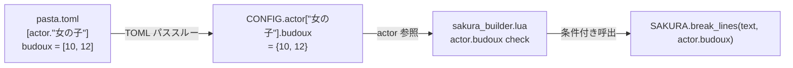

# Design Document: budoux-line-breaker

## Overview

**Purpose**: さくらスクリプトを含む日本語テキストに対して、budoux による自然な分割位置判定と unicode-width による CJK 文字幅計算を組み合わせ、指定幅閾値で自動的にさくらスクリプト改行タグ（`\n`）を挿入する機能を `pasta_lua` クレートに追加する。

**Users**: ゴースト作者は `pasta.toml` のアクター設定に `budoux = [10, 12]` を追加するだけで、バルーン上の自然な日本語改行を自動化できる。エンジン開発者にとっては、既存の `@pasta_sakura_script` モジュールに新関数 `break_lines` が追加される形で統合される。

**Impact**: 既存の `talk_to_script` 関数およびパイプラインには変更を加えない。`sakura_builder.lua` に条件付き後処理呼出を追加する形で統合する。

### Goals
- budoux 日本語モデルによる自然な改行位置判定
- さくらスクリプトタグを透過的に扱う改行挿入
- 行ごとの幅閾値スライスによるきめ細かいレイアウト制御
- `pasta.toml` アクター設定による宣言的な有効化

### Non-Goals
- HTML やリッチテキストの改行処理（budoux は平文のみ対応）
- 縦書きテキストのレイアウト制御
- `talk_to_script` 内部への組み込み（独立関数として提供）
- budoux モデルのカスタマイズ（デフォルト日本語モデル固定）

## Architecture

### Existing Architecture Analysis

現在の `sakura_script` モジュールは以下の責務を持つ：

- `tokenizer.rs` — さくらスクリプトタグ検出・文字分類（`SAKURA_TAG_PATTERN` 正規表現）
- `wait_inserter.rs` — トークン列へのウェイトタグ（`\_w[ms]`）挿入
- `mod.rs` — Lua モジュール登録（`@pasta_sakura_script` テーブル作成、`talk_to_script` 関数公開）

パイプライン順序: `text → Tokenizer::tokenize() → insert_waits() → talk_to_script result`

既存 `SakuraScriptState`（`Arc` 共有）は `Tokenizer` と `WaitValues` を保持し、Lua 関数クロージャからアクセスされる。

### Architecture Pattern & Boundary Map



**Architecture Integration**:
- **Selected pattern**: ハイブリッドアプローチ — ロジックは独立ファイル `line_breaker.rs`、Lua 公開は既存 `@pasta_sakura_script` モジュールへの関数追加
- **Domain/feature boundaries**: 改行ロジックは `line_breaker.rs` に自己完結。`mod.rs` は Lua バインディングのみ担当。タグ正規表現パターンは `tokenizer.rs` から定数として参照
- **Existing patterns preserved**: `Arc<SakuraScriptState>` 共有パターン、`register()` → テーブル関数追加パターン
- **New components rationale**: `line_breaker.rs` は改行挿入ロジックが `wait_inserter.rs` とは独立した関心事（幅計算+budoux分割）であるため分離
- **Steering compliance**: pasta_lua レイヤーの SakuraScript 責務に合致。ファイル命名規約 `<feature>.rs` 準拠

### Technology Stack

| Layer | Choice / Version | Role in Feature | Notes |
|-------|------------------|-----------------|-------|
| Core Logic | Rust 2024 edition | 改行挿入アルゴリズム実装 | `line_breaker.rs` |
| Japanese Segmentation | budoux 0.1.1 | 日本語テキスト分割位置判定 | Apache-2.0、O(n) |
| Width Calculation | unicode-width 0.2.2 | CJK 文字幅計算 | MIT/Apache-2.0、Unicode Annex #11 |
| Tag Detection | regex 1.x（既存） | さくらスクリプトタグ分離 | `SAKURA_TAG_PATTERN` 再利用 |
| Runtime Binding | mlua 0.11（既存） | Lua 関数公開 | `Arc` 共有パターン |
| Configuration | TOML パススルー（既存） | `actor.budoux` 設定伝搬 | 追加コード不要 |

## System Flows

### 改行挿入処理フロー



### pasta.toml 設定伝搬フロー



## Requirements Traceability

| Requirement | Summary | Components | Interfaces | Flows |
|-------------|---------|------------|------------|-------|
| 1.1, 1.2, 1.3 | クレート依存関係追加 | Cargo.toml | — | — |
| 2.1, 2.2, 2.3, 2.4 | さくらスクリプト透過処理 | LineBreaker | `break_lines_impl()` | 改行挿入フロー Phase 1/4 |
| 3.1, 3.2, 3.3 | budoux 日本語分割 | LineBreaker | `budoux::parse()` | 改行挿入フロー Phase 2 |
| 4.1, 4.2, 4.3, 4.4, 4.5 | 行幅閾値改行挿入 | LineBreaker | `break_lines_impl()` | 改行挿入フロー Phase 3 |
| 5.1, 5.2, 5.3, 5.4 | pasta.toml 設定 | TOML パススルー（既存） | CONFIG テーブル | 設定伝搬フロー |
| 6.1, 6.2, 6.3, 6.4 | Lua API 公開 | SakuraScriptModule | `break_lines` Lua 関数 | 改行挿入フロー |
| 7.1, 7.2, 7.3 | パイプライン統合 | SakuraBuilder（Lua） | — | 改行挿入フロー |
| 8.1, 8.2, 8.3, 8.4 | テスト | UnitTests, IntegrationTests | — | — |

## Components and Interfaces

| Component | Domain/Layer | Intent | Req Coverage | Key Dependencies | Contracts |
|-----------|-------------|--------|--------------|------------------|-----------|
| LineBreaker | SakuraScript / Rust | さくらスクリプト透過の改行挿入ロジック | 2, 3, 4 | budoux (P0), unicode-width (P0), Tokenizer::SAKURA_TAG_PATTERN (P0) | Service |
| SakuraScriptModule | SakuraScript / Rust-Lua | `break_lines` Lua 関数の登録と公開 | 6 | LineBreaker (P0), mlua (P0), SakuraScriptState (P0) | API |
| SakuraBuilder | Shiori / Lua | パイプライン統合（条件付き呼出） | 7 | @pasta_sakura_script (P0) | — |
| Cargo.toml | Build | クレート依存関係定義 | 1 | — | — |

### SakuraScript / Rust

#### LineBreaker

| Field | Detail |
|-------|--------|
| Intent | さくらスクリプトタグを透過的に扱いながら、budoux 分割と幅閾値に基づいて `\n` を挿入する |
| Requirements | 2.1, 2.2, 2.3, 2.4, 3.1, 3.2, 3.3, 4.1, 4.2, 4.3, 4.4, 4.5 |

**Responsibilities & Constraints**
- さくらスクリプトタグの分離・復元（正規表現ベース）
- budoux モデルによる平文分割
- unicode-width CJK 幅による行幅計算
- 幅閾値スライスに基づく `\n` 挿入（行ごとに異なる閾値対応）
- 処理は純粋関数として実装し、外部状態に依存しない（モデルと正規表現は引数で受け取る）

**Dependencies**
- Inbound: SakuraScriptModule — Lua 関数からの呼出 (P0)
- External: budoux — 日本語分割 (P0)
- External: unicode-width — CJK 幅計算 (P0)
- Inbound: Tokenizer::SAKURA_TAG_PATTERN — タグ正規表現パターン (P0)

**Contracts**: Service [x]

##### Service Interface

```rust
/// さくらスクリプトタグを透過的に扱いながら、budoux 分割と幅閾値に基づいて
/// 改行タグ `\n` を挿入する。
///
/// # Arguments
/// * `input` - さくらスクリプトタグを含む可能性のある入力文字列
///   （典型的には `wait_inserter` 処理済みテキスト）
/// * `widths` - 行幅閾値スライス。`widths[0]` が1行目、`widths[1]` が2行目、
///   3行目以降は末尾値を使用。空の場合は入力をそのまま返す
/// * `tag_regex` - さくらスクリプトタグ検出用正規表現（`SAKURA_TAG_PATTERN`）
/// * `model` - budoux 日本語モデル参照
///
/// # Returns
/// 改行タグ挿入済みの文字列。タグの位置関係は保持される。
///
/// # Performance
/// O(n) ここで n は入力文字列長。budoux 分割 O(n) + 幅計算 O(n) + タグ復元 O(n)。
fn break_lines_impl(
    input: &str,
    widths: &[usize],
    tag_regex: &Regex,
    model: &budoux::Model,
) -> String;
```

- **Preconditions**: `widths` は非負整数のスライス。空の場合は no-op
- **Postconditions**: 出力には入力の全さくらスクリプトタグが元の相対位置を保って含まれる
- **Invariants**: 出力の平文部分（タグ除去後）の文字集合は入力と同一（`\n` 追加を除く）

**Internal Data Structures**

```rust
/// 平文1文字と直後に続くさくらスクリプトタグ群を紐付けるトークン。
struct PlainChar<'a> {
    ch: char,           // 平文1文字
    trailing: &'a str,  // この文字の直後に続くタグ群（0文字以上）
}

/// タグ分離済みトークン列。
struct Tokens<'a> {
    leading: &'a str,           // 最初の平文文字より前のタグ群
    chars: Vec<PlainChar<'a>>,  // 平文文字列（タグ紐付き）
}
```

**Implementation Notes**

*Phase 1: PlainChar トークン化*
- `Regex::find_iter` で入力文字列中のタグ位置を走査
- タグとタグの間の平文を `chars()` で1文字ずつ `PlainChar` に分解
- 各 `PlainChar` の `trailing` は「この文字の直後から次の平文文字（または末尾）まで」のスライス（`&'a str` 参照、ゼロアロケーション）
- 最初の平文文字より前にタグがある場合は `leading` に格納

*Phase 2: 平文抽出 → budoux 分割*
- `chars` の `ch` を連結して平文 `String` を生成（唯一のアロケーション）
- `budoux::parse(model, &plaintext)` でワード分割列を取得

*Phase 3: 幅計算 → 改行位置決定*
- budoux ワード列を先頭から走査し、`UnicodeWidthStr::width_cjk()` で幅加算
- 閾値超過時にワード先頭の平文 char index を `break_positions: Vec<usize>` に記録
- 行カウンタ進行、次行の閾値は `widths[min(line, widths.len()-1)]`
- 1ワードが閾値を超える場合はそのまま出力（強制分割しない）

*Phase 4: 復元出力*
- 出力バッファ `String` を確保し、`leading` を emit
- `chars` を走査。`break_positions` に該当する char index に到達したら、直前の `PlainChar` の `trailing` 出力後（=現在の char の emit 前）に `\n` を挿入
- 改行は必ず「trailing の後、次の plain char の前」に入るため、ウェイトタグは元の行に残る

*既存 `\n` の扱い*
- 入力中の `\n` は `SAKURA_TAG_PATTERN` にマッチするため Tag として扱われる
- 主要パイプライン（`talk_to_script` → `wait_inserter`）では `\n` が出力に含まれないため、行幅リセットは不要
- v1 では `\n` を他のタグと同様に透過処理する

---

#### SakuraScriptModule（mod.rs 拡張）

| Field | Detail |
|-------|--------|
| Intent | `break_lines` 関数を `@pasta_sakura_script` Lua テーブルに登録する |
| Requirements | 6.1, 6.2, 6.3, 6.4 |

**Responsibilities & Constraints**
- `SakuraScriptState` に budoux モデルを追加保持
- `register()` 内で `break_lines` Lua 関数を作成し、モジュールテーブルに登録
- Lua 引数（文字列、幅閾値テーブル）を Rust 型に変換して `break_lines_impl` に委譲

**Dependencies**
- Inbound: module_registry.rs — モジュール登録フロー (P0)
- Outbound: LineBreaker — `break_lines_impl()` 呼出 (P0)
- External: mlua — Lua バインディング (P0)
- External: budoux — モデル初期化 (P0)

**Contracts**: API [x]

##### API Contract

Lua 関数シグネチャ:

```lua
--- さくらスクリプトタグを透過的に扱い、budoux 改行を挿入する
--- @param text string 処理対象テキスト（wait_inserter 処理済み）
--- @param widths integer[] 行幅閾値配列（例: {10, 12}）
--- @return string 改行挿入済みテキスト
SAKURA.break_lines(text, widths)
```

| 引数 | 型 | 説明 |
|------|----|------|
| `text` | `string` | 処理対象テキスト |
| `widths` | `table` (integer array) | 行幅閾値。`widths[1]` = 1行目、`widths[2]` = 2行目、以降末尾値 |
| 戻り値 | `string` | 改行挿入済みテキスト |

エラー時（nil text、空 widths）は入力をそのまま返す。

##### State Management

- **State model**: `SakuraScriptState` に `budoux_model: budoux::Model` フィールドを追加
- **Persistence & consistency**: モデルはイミュータブル。`Arc` 共有で全 Lua 関数クロージャから参照
- **Concurrency strategy**: `Arc` 不変共有。スレッドセーフ（`Model` は `HashMap` で `Send + Sync`）

---

### Shiori / Lua

#### SakuraBuilder（sakura_builder.lua 拡張）

| Field | Detail |
|-------|--------|
| Intent | `talk_to_script` 結果に対してアクター設定に基づき `break_lines` を条件付き呼出する |
| Requirements | 7.1, 7.2, 7.3 |

**Responsibilities & Constraints**
- `actor.budoux` フィールドの存在チェック
- 存在する場合のみ `SAKURA_SCRIPT.break_lines(result, actor.budoux)` を呼出
- `talk` type と `sakura_script` type の両方の処理パスに適用

**Dependencies**
- Outbound: @pasta_sakura_script — `break_lines()` 呼出 (P0)

**Implementation Notes**
- 変更箇所は `BUILDER.build()` 内の2箇所（`talk` / `sakura_script` type 処理）
- `actor.budoux` が `nil` の場合は `break_lines` 呼出をスキップ（要件 7.3）
- ヘルパー関数 `apply_budoux(actor, text)` を定義して重複を排除

---

### Build

#### Cargo.toml

| Field | Detail |
|-------|--------|
| Intent | `budoux` と `unicode-width` クレートを `pasta_lua` の依存関係に追加する |
| Requirements | 1.1, 1.2, 1.3 |

**Implementation Notes**
- `budoux = "0.1"` — セマンティックバージョニングでマイナーバージョン互換
- `unicode-width = "0.2"` — 同上

## Testing Strategy

### Unit Tests（line_breaker.rs 内 `#[cfg(test)]`）

1. **平文改行挿入**: タグなし日本語テキストに対して、budoux 分割 + 幅閾値で正しく `\n` が挿入されることを検証（8.1）
2. **さくらスクリプトタグ透過**: `\_w[50]` 等のタグを含むテキストで、タグが幅計算から除外され、出力に保持されることを検証（8.2）
3. **複数行幅閾値**: `[w1, w2]` で1行目と2行目で異なる幅が適用され、3行目以降に末尾値が適用されることを検証（8.3）
4. **空入力/空幅**: 空文字列や空の幅スライスで入力がそのまま返ることを検証
5. **1ワードが閾値超過**: 単一ワードが閾値より長い場合に強制分割されず、後続ワードとの間で正しく改行されることを検証
   - 5a. 先頭ワードのみ超過 → 改行なし、そのまま出力
   - 5b. 超過ワード＋後続通常ワード → 超過ワードと後続の間で改行
   - 5c. 連続する超過ワード → 各ワード間で改行（無限ループしない）
   - 5d. 通常→超過→通常 → 超過ワードの前後で改行
6. **既存 `\n` との共存**: 入力に元々 `\n` が含まれる場合の処理が正しいことを検証

### Integration Tests（tests/sakura_script/budoux_test.rs）

1. **Lua 経由の `break_lines` 呼出**: `SAKURA.break_lines(text, {10, 12})` が期待結果を返すことを検証（6.1, 6.2, 6.3）
2. **nil/空引数処理**: nil text や空テーブルで安全に動作することを検証
3. **`talk_to_script` + `break_lines` パイプライン**: ウェイト挿入済みテキストに対して改行が正しく挿入されることを検証（7.1）
4. **`cargo test -p pasta_lua`**: 全テスト成功を確認（8.4）
