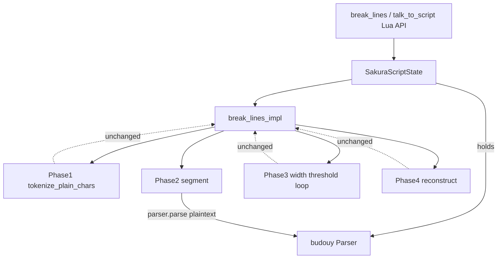

# Design Document

## Overview

**Purpose**: ゴーストの日本語トーク自動改行（`@pasta_sakura_script` の `break_lines` / `talk_to_script`）が内部で使用する分かち書きクレートを、保守停滞中の `budoux 0.1.1` から後継 `budouy 0.2.2`（`vendored-models` feature）へ差し替える。後継ライブラリの保守・バグ修正の恩恵を受け、技術的負債を解消する。

**Users**: pasta workspace の保守者（依存健全性）と、ゴースト辞書作成者（改行挙動が破綻しないこと）。

**Impact**: 改行の分割呼び出し1点が `budoux::parse(model, text)` から `parser.parse(text)` へ変わるのみ。docs.rs ソース確認により budouy の `Parser::parse` は budoux と同じ `Vec<String>` を返すため、幅計算・タグ保持・再構築ロジックは完全に再利用される。公開 API（Lua 関数・`actor.budoux` プロパティ）と外部機構名「budoux / BudouX」は不変。

### Goals
- workspace 依存から `budoux` を（`Cargo.lock` 含め）完全除去し、`budouy 0.2.2` + `vendored-models` へ置換する。
- `crates/pasta_lua` の分かち書きライブラリ保持・初期化・呼び出しを、**クレート差し替えでコンパイルが通らなくなった箇所のみ**新 API へ最小修正する。
- 既存テストを新 API へ適合させ、`cargo build / clippy / test --workspace` を緑化する。
- 内部依存クレート名の記載（`tech.md` 依存一覧）を `budouy 0.2.2` へ同期更新する。

### Non-Goals
- 改行アルゴリズム（幅閾値ロジック・タグ保持処理）の挙動変更・改善・チューニング。
- 公開 API（`break_lines` / `talk_to_script` の引数・戻り値）および公開設定キー `actor.budoux` の変更・改称。
- 外部機構名「budoux / BudouX」の改称、利用者マニュアル `book/`・完了 spec 名 `budoux-line-breaker` の機構名記載の更新。
- budouy の追加機能（多言語モデル・HTML 処理・WASM・`parse_boundaries` 等）の採用。
- 付随的なリファクタリング・設計改善・命名整理（コンパイルに不要な変更）。

## Boundary Commitments

### This Spec Owns
- workspace 依存定義における分かち書きクレートの選定（`budouy 0.2.2` + `vendored-models`）。
- `crates/pasta_lua/src/sakura_script/` 内の分かち書きライブラリ保持・初期化・呼び出しの内部実装（`mod.rs` の状態保持と `line_breaker.rs` の分割呼び出し）。
- 上記実装に対応する既存テストの API 適合。
- `tech.md` 依存一覧の内部クレート名・バージョン記載。

### Out of Boundary
- `break_lines` / `talk_to_script` の Lua 公開 API シグネチャ、および `actor.budoux` 設定キー／フィールド名（公開設定 API として不変維持）。
- 改行アルゴリズム本体（`tokenize_plain_chars`・幅閾値判定 Phase 3・再構築 Phase 4）の挙動。
- 外部機構名「budoux / BudouX」の表記（`book/`・スキルの使用例・完了 spec 名を含む）。
- Lua スクリプト側（`pasta_scripts` 等）の利用コード。

### Allowed Dependencies
- `budouy 0.2.2`（`vendored-models` feature）— Apache-2.0、`deny.toml` 許可済み、GPL 非該当。
- 既存の `unicode-width`（幅計算）・`regex`（タグ検出）はそのまま使用。
- workspace 集中依存管理（`[workspace.dependencies]`）の既存パターンに従う。

### Revalidation Triggers
- `Parser::parse` の戻り値型が想定（`Vec<String>`）と異なる場合 → 幅計算ループの再評価。
- `break_lines` / `talk_to_script` の公開シグネチャに変更が生じた場合 → `@pasta_sakura_script` 利用 Lua スクリプト全般の再検証。
- 模型差により既存テストの分割位置が変化した場合 → 当該テスト期待値の妥当性個別判断（Req 3.3）。

## Architecture

### Existing Architecture Analysis

分かち書き処理は `crates/pasta_lua/src/sakura_script/` に局所化されている。budoux への依存は次の3点のみ:

1. `mod.rs`: `SakuraScriptState.budoux_model: budoux::Model` を保持し、`budoux::models::default_japanese_model().clone()` で初期化。`break_lines` / `talk_to_script` 経路の2箇所から `&state.budoux_model` を `break_lines_impl` へ渡す。
2. `line_breaker.rs`: `break_lines_impl(input, widths, tag_regex, model: &budoux::Model)` 内の Phase 2 で `budoux::parse(model, &plaintext)` を1回呼び、`Vec<String>` を取得。Phase 3（幅閾値ループ）・Phase 4（再構築）は分割結果の文字列のみを扱い、budoux 型には非依存。
3. テスト: `line_breaker.rs` 内ユニットテストの `model()` ヘルパが `budoux::models::default_japanese_model()`（`&'static`）を返す。統合テスト `tests/sakura_script/budoux_test.rs` は Lua API 経由で budoux 型に非依存。

**保持すべき統合点**: Lua 公開 API（文字列 in/out）・`actor.budoux` プロパティ・改行アルゴリズム本体。これらは budoux 型を露出しないため、ライブラリ差し替えの影響を受けない。

### Architecture Pattern & Boundary Map

差し替えは「分割ライブラリ呼び出し」という単一シームに閉じる。下図のとおり、budouy が触れるのは Phase 2 の1点のみ。



**Architecture Integration**:
- Selected pattern: 単一シーム差し替え（依存逆転や抽象化は導入しない）。最小変更原則（Req 2.7）に従う。
- Domain boundaries: 分割ライブラリ呼び出しのみが変更対象。トークン化・幅判定・再構築は不変。
- Existing patterns preserved: workspace 集中依存管理、`SakuraScriptState` を `Arc` で Lua クロージャへ共有、`Vec<String>` ベースの幅計算。
- New components rationale: 新規コンポーネントなし（型差し替えのみ）。
- Steering compliance: `MIT OR Apache-2.0` 互換（tech.md ライセンス方針）、Rust 2024 edition・stable toolchain（MSRV 1.88.0 充足）。

### Technology Stack

| Layer | Choice / Version | Role in Feature | Notes |
|-------|------------------|-----------------|-------|
| Data / Storage | budouy 0.2.2 (`vendored-models`) | 日本語分かち書き分割（既定モデル同梱） | Apache-2.0。`load_default_japanese_parser()` は `vendored-models` gate 下。`Parser: Send+Sync+Clone` |
| Backend / Runtime | Rust 2024 edition / stable toolchain | `crates/pasta_lua` ビルド | budouy MSRV 1.88.0 を CI `dtolnay/rust-toolchain@stable` が充足 |
| Data / Storage | unicode-width 0.2.2（既存） | CJK 幅計算（変更なし） | `Vec<String>` 出力に対し従来どおり動作 |

> budouy の API 詳細（`parse` 戻り値型・feature gate・auto-trait）の調査結果は `research.md` §9 を参照。

## File Structure Plan

新規ファイルなし。すべて既存ファイルの最小修正。

### Modified Files
- `Cargo.toml` — `[workspace.dependencies]` の `budoux = "0.1.1"` を `budouy = { version = "0.2.2", features = ["vendored-models"] }` へ置換。
- `crates/pasta_lua/Cargo.toml` — `budoux.workspace = true`（29行目）を `budouy.workspace = true` へ置換。
- `crates/pasta_lua/src/sakura_script/mod.rs` — `SakuraScriptState` のフィールドを `budoux_model: budoux::Model` から `budoux_parser: budouy::Parser` へ変更し、初期化を `budouy::model::load_default_japanese_parser()` へ変更。`break_lines_impl` への2つの参照渡し箇所（`apply_budoux_if_configured` / `break_lines_lua_impl`）を新フィールドへ更新。
- `crates/pasta_lua/src/sakura_script/line_breaker.rs` — `break_lines_impl` のシグネチャ引数 `model: &budoux::Model` を `parser: &budouy::Parser` へ変更し、`budoux::parse(model, &plaintext)` を `parser.parse(&plaintext)` へ変更。Phase 3/4（幅計算ループ・再構築）は無変更。テストヘルパ `fn model() -> &'static budoux::Model` を `fn parser() -> budouy::Parser` へ適合し、呼び出し側を参照渡し（`&parser()`）へ追従。
- `Cargo.lock` — 再生成し `budoux` エントリを除去、`budouy` とその依存を反映。
- `.kiro/steering/tech.md` — 依存一覧（43行目）の `budoux 0.1.1` 記載を `budouy 0.2.2` 反映へ更新。

> **命名方針（内部識別子）**: 内部識別子は明瞭性のため改名する（型変更と同時に触れる行に限る）: フィールド `budoux_model` → `budoux_parser`、引数 `model` → `parser`、ヘルパ `model()` → `parser()`、および分割対象を指す doc コメントの "model" 記述。「budoux」は**改行機構の名称として保持**し、`model` → `parser` の意味ズレのみを正す。**公開 API 名・プロパティに現れる `budoux` キーワード（`actor.budoux`、Lua 公開 API）は機構名として機能するため改名しない**（Boundary Out of Boundary・要件 2.4/2.6 準拠）。

> 各ファイルは単一責務。`mod.rs`（状態保持）と `line_breaker.rs`（分割呼び出し）は一緒に変更される。テストは同一ファイル内ヘルパの適合のみ。

## Requirements Traceability

| Requirement | Summary | Components | Interfaces | Flows |
|-------------|---------|------------|------------|-------|
| 1.1, 1.2, 1.3 | budoux 除去・budouy 0.2.2 + vendored-models 追加 | Cargo.toml, pasta_lua/Cargo.toml | workspace 依存定義 | — |
| 1.4 | Cargo.lock から budoux 除去 | Cargo.lock | — | — |
| 1.5 | vendored-models 同梱模型の使用 | mod.rs（初期化） | `load_default_japanese_parser()` | Phase2 |
| 2.1, 2.2 | 機能的同等の改行挿入 | line_breaker.rs | `break_lines_impl` | Phase2→3→4 |
| 2.3 | タグを幅計算除外・相対位置保持 | line_breaker.rs（Phase1/4・無変更） | `tokenize_plain_chars` | Phase1, Phase4 |
| 2.4, 2.6 | 公開 API 関数・プロパティ維持 | mod.rs（Lua register） | `break_lines` / `talk_to_script` / `actor.budoux` | LuaAPI |
| 2.5 | 空幅・空入力で入力をそのまま返す | mod.rs, line_breaker.rs（無変更ガード） | 早期 return | — |
| 2.7 | コンパイル不通箇所のみ修正 | 全変更ファイル | — | — |
| 3.1, 3.2, 3.3 | 既存テスト適合・緑化・模型差は個別判断 | line_breaker.rs tests, budoux_test.rs | テストヘルパ | — |
| 4.1, 4.2, 4.3 | build / clippy / test 健全 | workspace 全体 | `cargo` コマンド | — |
| 5.1, 5.2 | 内部クレート名更新・外部機構名維持 | tech.md | 依存一覧記載 | — |
| 6.1, 6.2 | Apache-2.0 互換・MSRV 1.88.0 | Cargo.toml, CI | deny.toml, toolchain | — |

## Components and Interfaces

| Component | Domain/Layer | Intent | Req Coverage | Key Dependencies (P0/P1) | Contracts |
|-----------|--------------|--------|--------------|--------------------------|-----------|
| SakuraScriptState | pasta_lua / SakuraScript | 分かち書きパーサーを保持・共有 | 1.5, 2.4, 2.6 | budouy Parser (P0) | State |
| break_lines_impl | pasta_lua / SakuraScript | 分割結果を幅閾値で改行挿入 | 2.1, 2.2, 2.3, 2.5 | budouy Parser (P0), unicode-width (P1) | Service |
| 依存定義 | workspace | budouy 依存の宣言 | 1.1–1.3, 1.5, 6.1, 6.2 | budouy (P0) | — |

### pasta_lua / SakuraScript

#### SakuraScriptState

| Field | Detail |
|-------|--------|
| Intent | 分かち書きパーサー（および tokenizer・wait 既定値）を保持し、Lua クロージャへ `Arc` で共有 |
| Requirements | 1.5, 2.4, 2.6 |

**Responsibilities & Constraints**
- フィールド `budoux_model: budoux::Model` を `budoux_parser: budouy::Parser` へ置換し、`budouy::model::load_default_japanese_parser()` で初期化する。
- `Parser` は `Send + Sync + Clone`（research.md §9）のため、既存の `Arc<SakuraScriptState>` 共有パターンを変更せず維持する。
- フィールドは private（`pub` でない）であり公開 API ではない。型変更・改名は内部実装に閉じる（命名方針は File Structure Plan の注記参照）。

**Dependencies**
- External: budouy `Parser` / `model::load_default_japanese_parser()` — 既定日本語パーサー取得（P0、`vendored-models` gate）。

**Contracts**: State [x]

##### State Management
- State model: 不変パーサーをモジュール登録時に1回構築し共有保持（従来の Model 保持と同形）。
- Concurrency: `Arc` 共有・`&self` parse 呼び出しのみ。`Send + Sync` により従来の共有戦略を維持。

**Implementation Notes**
- Integration: `register()` 内の初期化式のみ差し替え。`talk_to_script` / `break_lines` クロージャの構造は不変。
- Validation: `load_default_japanese_parser()` の戻りが `Result` の場合は `expect` で吸収（コンパイラ指摘の最小修正）。
- Risks: なし（型差し替えに閉じる）。

#### break_lines_impl

| Field | Detail |
|-------|--------|
| Intent | 平文を分割し、幅閾値に従って改行タグ `\n` を挿入。タグは幅計算から除外し相対位置を保持 |
| Requirements | 2.1, 2.2, 2.3, 2.5 |

**Responsibilities & Constraints**
- 引数 `model: &budoux::Model` を `parser: &budouy::Parser` へ変更し、Phase 2 の `budoux::parse(model, &plaintext)` を `parser.parse(&plaintext)` へ変更する。
- `parse` は `Vec<String>` を返す（research.md §9 で確定）ため、Phase 3 の `word.as_str()` / `word.chars().count()` を含む幅計算ループ・Phase 4 再構築は**変更しない**。
- 空入力・空幅の早期 return ガード（Req 2.5）は維持する。

**Dependencies**
- External: budouy `Parser::parse(&self, &str) -> Vec<String>` — 分かち書き分割（P0）。
- Outbound: `unicode-width` `UnicodeWidthStr::width_cjk` — CJK 幅計算（P1、無変更）。

**Contracts**: Service [x]

##### Service Interface
```rust
// 変更後シグネチャ（公開はクレート内 pub）
pub fn break_lines_impl(
    input: &str,
    widths: &[usize],
    tag_regex: &Regex,
    parser: &budouy::Parser,
) -> String;
```
- Preconditions: `input` はさくらスクリプトタグを含みうる文字列。`widths` は行ごとの CJK 幅閾値（空なら入力を不変返却）。
- Postconditions: 自然な分かち書き位置に `\n` を挿入し、タグを相対位置に保持した文字列を返す（機能的同等：Req 2.1/2.2 の注記参照、分割位置の文字単位一致は要さない）。
- Invariants: 平文文字とさくらスクリプトタグは欠落・重複なく保持される。

**Implementation Notes**
- Integration: 呼び出し元（`mod.rs` の `apply_budoux_if_configured` / `break_lines_lua_impl`）は引数名・参照渡しのみ追従。
- Validation: 既存ユニットテストの大半は「`\n` を含む／平文保持」の不変条件検査であり、機能的同等基準で通過見込み。
- Risks: 模型差で `test_*` の厳密な分割位置依存箇所が変化しうる（Req 3.3 で個別判断・期待値更新）。

## Error Handling

### Error Strategy
本移行は新規エラー経路を導入しない。`load_default_japanese_parser()` がパース失敗を `Result` で返す設計の場合のみ、モジュール登録時に `expect`（致命・即時失敗）で扱う。これは既定 vendored モデルの埋め込みデータに対する初期化であり、実行時ユーザー入力には依存しない。既存の空入力・空幅ガード（Req 2.5）は不変。

### Monitoring
新規の監視・ロギングは不要。既存の `@pasta_log` 経路は変更しない。

## Testing Strategy

### Unit Tests（`line_breaker.rs` 内、既存流用 + ヘルパ適合）
- `test_plain_japanese_text_breaks_at_word_boundary`: 平文に `\n` が挿入され、タグ除去後の平文が入力と一致すること（2.1, 2.3）。
- `test_tags_excluded_from_width_and_preserved`: `\_w[50]` タグ5個がすべて保持され、改行が挿入されること（2.3）。
- `test_empty_input_returns_empty` / `test_empty_widths_returns_input_unchanged`: 空入力・空幅で入力を不変返却すること（2.5）。
- `test_last_width_repeats_for_subsequent_lines`: 幅配列の最終値が後続行に繰り返されるロジックが不変であること（2.1）。

### Integration Tests（`tests/sakura_script/budoux_test.rs`、Lua API 経由・コード無変更）
- `test_break_lines_basic_japanese` / `test_break_lines_with_wait_tags`: `SAKURA.break_lines` が改行を挿入しタグを保持すること（2.1, 2.2, 2.3）。
- `test_talk_to_script_with_budoux_actor_inserts_line_breaks`: `actor.budoux` プロパティ経由で `talk_to_script` が自動改行を適用すること（2.2, 2.4, 2.6）。
- `test_break_lines_nil_text_returns_empty` / `test_break_lines_empty_table_returns_input`: 空系ガードの維持（2.5）。

### Build / Static Analysis（Req 4）
- `cargo build --workspace`: エラーなく完了すること（4.1）。
- `cargo clippy --workspace`: 本移行起因の新規警告／エラーを出さないこと（4.2）。
- `cargo test --workspace`: 全テスト緑化（4.3, 3.1）。模型差で割れたテストは期待値の妥当性を個別判断のうえ更新（3.3）。

### 依存・ライセンス検証（Req 1, 6）
- `Cargo.lock` に `budoux` エントリが存在しないこと（1.4、grep 確認）。
- `cargo deny check licenses`: budouy（Apache-2.0）が許可リストで通過すること（6.1）。
