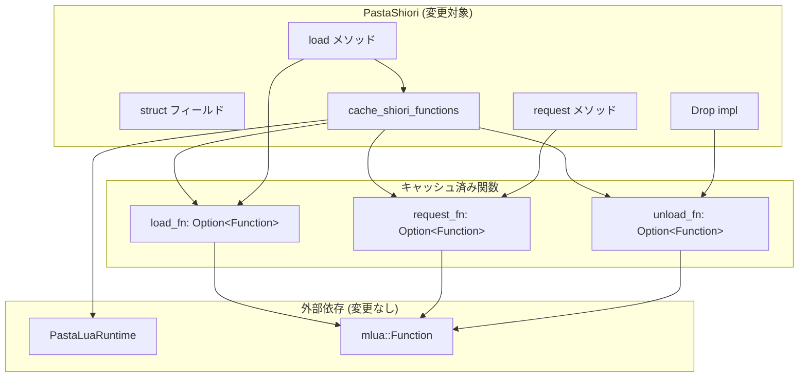
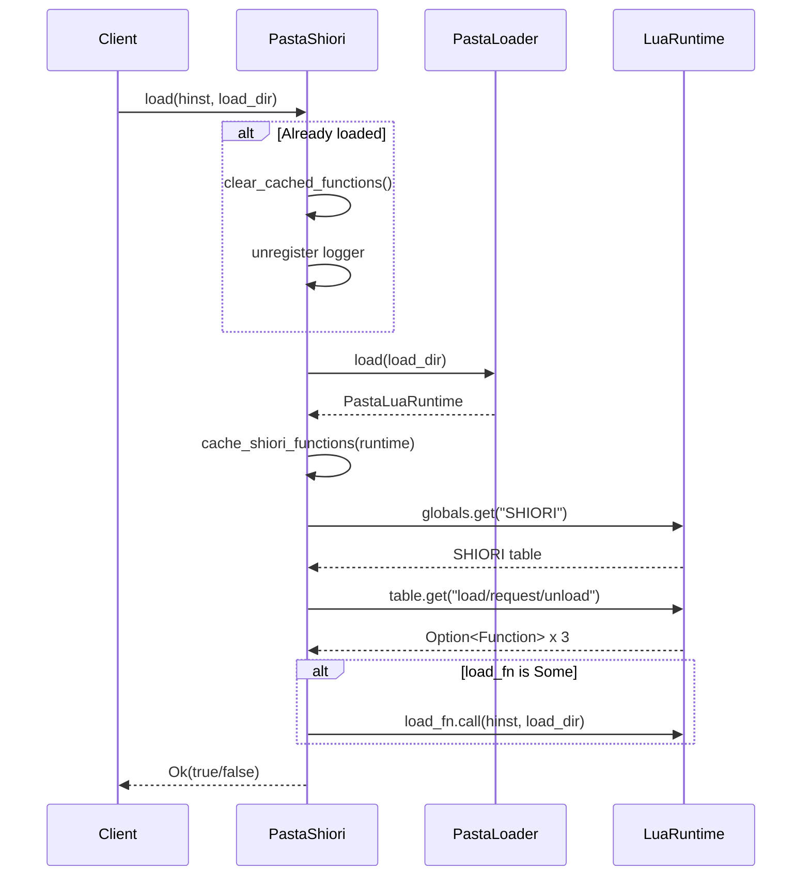
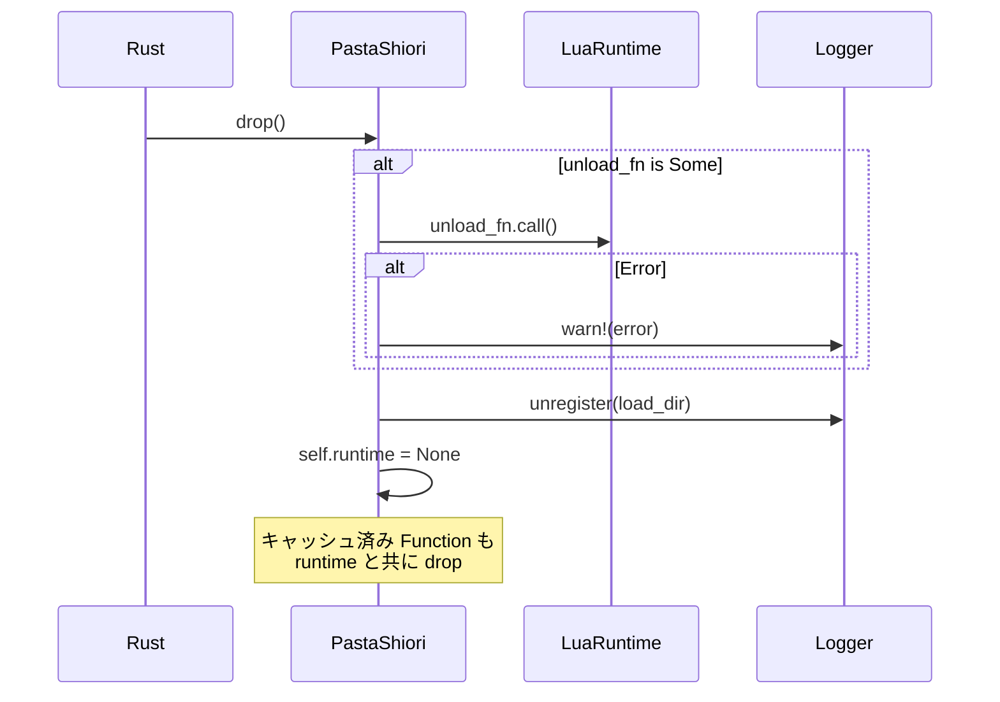

# Technical Design Document

## Overview

**Purpose**: PastaShiori における SHIORI Lua 関数呼び出しの最適化。`load()` 時に `SHIORI.load`, `SHIORI.request`, `SHIORI.unload` 関数への参照をキャッシュし、`request()` 処理時のパフォーマンスを向上させる。

**Users**: pasta_shiori 開発者および SHIORI クライアント（伺かベースウェア）がこの最適化の恩恵を受ける。

**Impact**: PastaShiori 構造体のフィールド変更（boolean フラグ → Option<Function>）、Drop impl の拡張（unload 呼び出し追加）。

### Goals
- 関数キャッシュによるリクエスト処理時のハッシュテーブルルックアップ削減
- 冗長な boolean フラグを Option<Function> に統合
- SHIORI.unload 関数のサポート追加（Drop 時呼び出し）
- 既存テストの互換性維持

### Non-Goals
- SHIORI プロトコル自体の拡張
- pasta_lua クレートへの変更
- 新規公開 API の追加

## Architecture

### Existing Architecture Analysis

**現在の PastaShiori 構造**:
```rust
pub(crate) struct PastaShiori {
    hinst: isize,
    load_dir: Option<PathBuf>,
    runtime: Option<PastaLuaRuntime>,
    has_shiori_load: bool,      // 冗長フラグ
    has_shiori_request: bool,   // 冗長フラグ
}
```

**既存パターン**:
- `check_shiori_functions()`: 関数存在確認のみ（boolean 設定）
- `request()`: 毎回 `globals.get("SHIORI")` → `shiori_table.get("request")` を実行
- `call_shiori_load()`: 毎回関数取得

**制約**:
- 外部 API（Shiori trait）は不変
- unsafe impl Send / Sync 維持

### Architecture Pattern & Boundary Map



**Architecture Integration**:
- **Selected pattern**: 既存コンポーネント拡張
- **Domain boundaries**: PastaShiori 内で完結、pasta_lua への依存は既存のまま
- **Existing patterns preserved**: Shiori trait、エラーハンドリングパターン、ロギング規約
- **New components rationale**: 新規コンポーネントなし（フィールド変更のみ）
- **Steering compliance**: Rust コーディング規約、テスト戦略維持

### Technology Stack

| Layer | Choice / Version | Role in Feature | Notes |
|-------|------------------|-----------------|-------|
| Backend | Rust 2024 edition | PastaShiori 実装 | 既存 |
| Runtime | mlua (via pasta_lua) | Lua 関数参照保持 | Function struct 使用 |
| Logging | tracing 0.1 | unload エラーログ | 既存パターン踏襲 |

## System Flows

### load() フロー（変更後）



### Drop フロー（変更後）



**Key Decisions**:
- unload 呼び出しは runtime drop 前に実行
- unload エラーは warn ログのみで伝播させない

## Requirements Traceability

| Requirement | Summary | Components | Interfaces | Flows |
|-------------|---------|------------|------------|-------|
| 1.1 | Option<Function> フィールド追加 | PastaShiori struct | - | - |
| 1.2 | load() でキャッシュ取得 | cache_shiori_functions | - | load() flow |
| 1.3 | 関数未発見時 None 設定 | cache_shiori_functions | - | - |
| 1.4 | reload 時キャッシュクリア | clear_cached_functions | - | load() flow |
| 2.1 | request() キャッシュ利用 | request() | - | - |
| 2.2 | None 時 204 応答 | request() | - | - |
| 2.3 | globals.get 削除 | request() | - | - |
| 3.1 | call_shiori_load() キャッシュ利用 | call_shiori_load | - | load() flow |
| 3.2 | None 時スキップ | call_shiori_load | - | - |
| 4.1 | Drop で unload 呼び出し | Drop impl | - | Drop flow |
| 4.2 | unload エラーログのみ | Drop impl | - | Drop flow |
| 4.3 | unload 後 runtime drop | Drop impl | - | Drop flow |
| 5.1 | boolean フラグ削除 | PastaShiori struct | - | - |
| 5.2 | is_some() で判定 | 各メソッド | - | - |
| 6.1 | 既存テスト合格 | テスト修正 | - | - |
| 6.2 | 複数 load() 対応 | cache/clear | - | - |
| 6.3 | 複数インスタンス独立 | PastaShiori | - | - |

## Components and Interfaces

| Component | Domain/Layer | Intent | Req Coverage | Key Dependencies | Contracts |
|-----------|--------------|--------|--------------|------------------|-----------|
| PastaShiori | SHIORI/Runtime | SHIORI プロトコル実装 | 1-6 全て | PastaLuaRuntime (P0), mlua::Function (P0) | State |

### SHIORI Layer

#### PastaShiori

| Field | Detail |
|-------|--------|
| Intent | SHIORI プロトコルを pasta_lua エンジンで実装 |
| Requirements | 1.1-1.4, 2.1-2.3, 3.1-3.2, 4.1-4.3, 5.1-5.2, 6.1-6.3 |

**Responsibilities & Constraints**
- SHIORI load/request/unload ライフサイクル管理
- Lua 関数キャッシュの取得・保持・クリア
- unsafe impl Send/Sync の安全性保証（シングルスレッド使用）

**Dependencies**
- Inbound: SHIORI DLL エントリポイント — load/request 呼び出し (P0)
- Outbound: PastaLuaRuntime — Lua VM アクセス (P0)
- External: mlua::Function — 関数参照保持 (P0)

**Contracts**: State [x]

##### State Management

**変更後の struct 定義**:
```rust
pub(crate) struct PastaShiori {
    /// DLL module handle
    hinst: isize,
    
    /// Base directory for ghost scripts
    load_dir: Option<PathBuf>,
    
    /// Pasta Lua runtime instance
    runtime: Option<PastaLuaRuntime>,
    
    /// Cached SHIORI.load function
    load_fn: Option<Function>,
    
    /// Cached SHIORI.request function  
    request_fn: Option<Function>,
    
    /// Cached SHIORI.unload function
    unload_fn: Option<Function>,
}
```

**State Invariants**:
- `runtime` が `None` のとき、`load_fn`, `request_fn`, `unload_fn` も `None`
- `runtime` が `Some` のとき、キャッシュは取得済み（None または Some）
- キャッシュは `runtime` の Lua VM 内の関数を参照

**Consistency**:
- reload 時: キャッシュクリア → 新規取得 の順序厳守
- Drop 時: unload 呼び出し → runtime drop の順序厳守

##### Method Specifications

**`cache_shiori_functions(&mut self, runtime: &PastaLuaRuntime) -> ()`**
- **責務**: Lua グローバルから SHIORI テーブルを取得し、load/request/unload 関数をキャッシュ
- **呼び出しタイミング**: load() 内で runtime 取得直後
- **エラーハンドリング**: 
  - SHIORI テーブル未存在時: warn! ログ + 全キャッシュ None 設定
  - 個別関数取得失敗時: 該当フィールドのみ None 設定（パニックしない）
- **トレーサビリティ**: Requirement 1.2, 1.3

**`clear_cached_functions(&mut self)`**
- **責務**: load_fn, request_fn, unload_fn の3フィールドを None に設定
- **呼び出しタイミング**: reload 時（runtime クリア前）
- **トレーサビリティ**: Requirement 1.4, 6.2

**Implementation Notes**
- **Integration**: mlua::Function は ValueRef で内部参照管理、Clone/Send/Sync 実装済み
- **Validation**: 関数取得失敗時は None 設定（パニックしない）
- **Risks**: キャッシュクリア忘れ → reload テストで検証
- **Drop Safety Pattern**: unload 呼び出し前に runtime と unload_fn の両方を確認
  ```rust
  // Drop impl での推奨パターン:
  if let (Some(unload_fn), Some(runtime)) = (&self.unload_fn, &self.runtime) {
      if let Err(e) = unload_fn.call::<()>(()) {
          tracing::warn!("SHIORI.unload failed: {}", e);
      }
  }
  ```

## Data Models

### Domain Model

本機能はデータモデル変更なし。PastaShiori struct のフィールド変更のみ。

**Entity: PastaShiori** (変更)
- 削除: `has_shiori_load: bool`, `has_shiori_request: bool`
- 追加: `load_fn: Option<Function>`, `request_fn: Option<Function>`, `unload_fn: Option<Function>`

**Invariants**:
- runtime と関数キャッシュのライフサイクル一致
- Option::is_some() による関数存在判定

## Error Handling

| Error Scenario | Detection | Response | Recovery |
|----------------|-----------|----------|----------|
| SHIORI テーブル取得失敗 | globals.get("SHIORI") Err | warn! ログ + 全キャッシュ None | 正常続行 |
| 関数取得失敗 | table.get() Err | None 設定（個別） | 正常続行 |
| request_fn 呼び出し失敗 | call() Err | MyError 返却 | クライアント処理 |
| unload_fn 呼び出し失敗 | call() Err | warn! ログ | 続行（Drop 完了） |
| runtime 未初期化 | runtime.is_none() | NotInitialized エラー | クライアント処理 |

## Testing Strategy

### 既存テスト修正

| Test Name | Change Required |
|-----------|-----------------|
| test_load_sets_shiori_flags_when_main_lua_exists | `has_shiori_load` → `load_fn.is_some()` |
| test_load_flags_false_without_main_lua | `has_shiori_*` → `*_fn.is_some()` |

### 新規テスト

| Test Name | Purpose | Validation |
|-----------|---------|------------|
| test_unload_called_on_drop | Drop で unload 呼び出し確認 | Lua 側でフラグ設定、drop 後に確認 |
| test_unload_error_does_not_panic | unload エラー時の resilience | エラーを返す unload でパニックしないこと |
| test_cached_functions_cleared_on_reload | reload 時のキャッシュクリア | 2回 load() 後に正しいキャッシュ確認 |

## Performance Considerations

### 最適化効果

| Operation | Before | After | Improvement |
|-----------|--------|-------|-------------|
| request() | 2x table lookup | 0x lookup | ~100% 削減 |
| call_shiori_load() | 2x table lookup | 0x lookup | ~100% 削減 |

### メモリ影響

| Change | Memory Impact |
|--------|---------------|
| boolean x 2 削除 | -2 bytes |
| Option<Function> x 3 追加 | +24 bytes (3 x 8byte pointer) |
| **Net change** | +22 bytes per instance |

評価: 無視可能なオーバーヘッド、パフォーマンス改善が優先

## Implementation Phases

1. **Phase 1**: struct フィールド変更と cache_shiori_functions() 実装
2. **Phase 2**: request() と call_shiori_load() 簡素化
3. **Phase 3**: Drop impl への unload サポート追加
4. **Phase 4**: 既存テスト修正と新規テスト追加
5. **Phase 5**: 統合テストと検証
