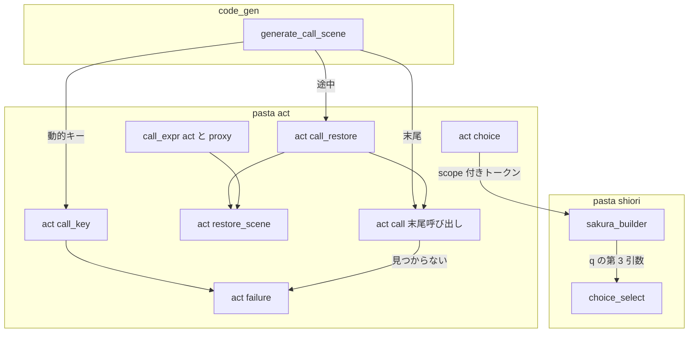
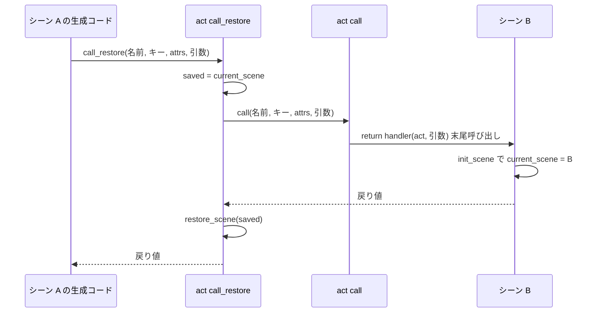
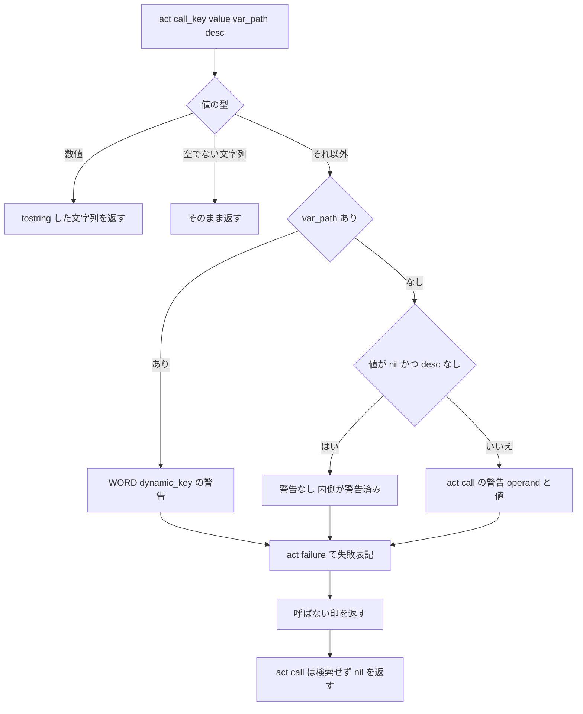
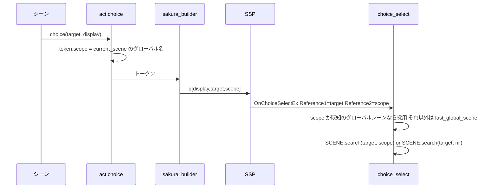

# Design Document: call-execution-correctness

## Overview

**Purpose**: Call 行（`＞シーン`・`＞式`）の実行にある 2 つの不具合を直す。(1) 別のグローバルシーンを途中の Call（または式の関数呼び出し）で実行して戻った後、続きの行が呼ばれた側のシーンとして名前を解決してしまう。(2) 動的コールの値が nil のとき `"nil"` という名前を検索してしまう。あわせて、失敗した Call をバルーンに見える失敗表記で示し、選択肢を「その選択肢行を出したグローバルシーン」から探すようにする。

**Users**: Pasta DSL で辞書を書くゴースト作者と、後続 spec（`scene-attribute-store`・`call-attribute-filter`・`failure-output-unification`）で Call の実行を触るコントリビュータ。

**Impact**: 生成コードのうち「途中の Call」と「動的コールのキーの式」の形が変わる。ランタイム（`pasta/act.lua`）に 4 つのメソッドが増える。選択肢のさくらスクリプトに第 3 引数（出したグローバルシーン名）が付く。末尾の静的コールの生成コードと `act:call` の引数の並びは変えない。

### Goals

- 途中の Call・式の関数呼び出しから戻った後、`act.current_scene` が呼び出し前の値に戻っている（要件 1・3）。
- 選択肢ごとに、出したグローバルシーンが選択時の探索範囲になる（要件 2）。
- 動的コールの値が nil・空文字列・文字列でも数値でもない値のとき、検索せず、警告と失敗表記を出して次の行へ進む（要件 5・6）。
- Call の失敗表記の出力が 1 つの関数にまとまっている（`failure-output-unification` がそのまま載せ替えられる）。
- 末尾の Call の性質（深さが増えない・生成コード不変）を保つ（要件 4）。

### Non-Goals

- シーン検索アルゴリズム、Call の属性フィルター、アクション行・式のコード生成の形の変更。
- Call 行以外の失敗をバルーンへ出すこと、既存の警告箇所の載せ替え（`failure-output-unification`）。
- 文脈を字句的な引数として渡す全面的な作り替え（research 6.3 の案 D）。

## Boundary Commitments

### This Spec Owns

- 途中の Call の生成形（`act:call_restore(…)`）と、動的コールのキーの式の生成形（`act:call_key(…)`）。
- ランタイムの新しい口: `act:call_restore`・`act:restore_scene`・`act:call_key`・`act:failure`。
- `act:call` の「見つからない」分岐での失敗表記の出力。
- 式の関数呼び出しの口（`call_expr`。`act.lua` と `actor.lua` の 2 か所）での文脈の保存と復元。
- 選択肢トークンの `scope` フィールド、`\q` の第 3 引数、`OnChoiceSelectEx` 既定ハンドラが最初に探すグローバルシーンの決め方。
- 上記を固定するテスト、スナップショットの更新、マニュアルの該当章の更新と生成スキルの再生成。

### Out of Boundary

- `act:call(global_scene_name, key, attrs, ...)` の引数の並びと、末尾呼び出しであること。`attrs` の中身（`call-attribute-filter`）。
- `ACT_IMPL.init_scene` の動作（`current_scene` と `STORE.last_global_scene` を上書きする）。
- `STORE.last_global_scene` の書き手と意味（`init_scene` だけが書く。記録の無い選択 ID の探索範囲として残す）。
- 選択肢の自動ルーティングの手順（明示シーン優先 → ローカル → グローバル）。
- `WORD.dynamic_key` の挙動、既存の警告の文言。
- `crates/pasta_shiori/tests/support/scripts/pasta/` の古いランタイムの写し（変更しない。新しい E2E は埋め込みの標準ランタイムを使う）。

### Allowed Dependencies

- `pasta/act.lua` → `pasta.word`（`WORD.dynamic_key`）・`pasta.store`・`pasta.scene`・`@pasta_log`（すべて既存の依存）。
- `pasta/actor.lua` → プロキシが持つ `self.act` のメソッド（`act:restore_scene`）。`actor.lua` から `pasta.act` を require しない（循環を作らない）。
- `pasta/shiori/event/choice_select.lua` → `pasta.scene`（`SCENE.search`・`SCENE.get_global_table`）・`pasta.store`。
- コード生成: `element_gen.rs` → `expr_gen.rs` の `operand_desc`・`dynamic_ref_args`（既存の部品）。
- SSP の `\q[タイトル,ID,r2,…]`: 第 3 引数以降が `OnChoiceSelectEx` の Reference2 以降に入る（ukadoc「`\q[タイトル,ID,r2,r3...]`」「OnChoiceSelectEx」）。

### Revalidation Triggers

- `act:call`・`act:call_restore` の引数の並び、または `act:call_key` の戻り値（検索キーか「呼ばない」印）の変更 → `call-attribute-filter`。
- `act:failure(text, warning)` の引数と積むトークンの型の変更 → `failure-output-unification`。
- 選択肢トークンのフィールド、`\q` の引数の並びの変更 → `pasta/shiori/sakura_builder.lua`・`choice_select.lua`・`presentation/marker.rs` の利用者。
- `init_scene` が `current_scene` 以外の文脈を持つようになった場合 → `act:restore_scene` の復元対象。

## Architecture

### Existing Architecture Analysis

- シーン文脈は `act.current_scene` の 1 か所で、書き手は `init_scene` だけである。名前解決（`find_act_handler` の 1・2 段目）は 3 モード（単語・シーン・式）ともこれを読む。
- `ACT_IMPL.call` は `return handler(self, ...)` で終わり、生成コードは最後の項目の Call にだけ `return` を付ける。この 2 つがそろって末尾の Call の連鎖が深くならない。
- 動的コールは `tostring(式)` を生成コードが付けるため、ランタイムの nil ガードに届かない。空文字列は `SCENE.search` が `@pasta_search` のエラー（`Invalid scene name: ''`）をそのまま Lua のエラーにする（実行で確認済み。research 8.1）。
- 選択肢は `{ type="choice", target, display }` のトークンで、`sakura_builder` が `\![*]\q[display,target]` にする。選択は後の別リクエスト（`OnChoiceSelectEx`）で届き、既定ハンドラは `STORE.last_global_scene` を 1 つだけ見る。
- 失敗をさくらスクリプトへ出す仕組みは無いが、`act:actor_proxy` が未登録アクターで `talk` トークン（`【未登録アクター：名前】`）を直接積む前例がある。

### Architecture Pattern & Boundary Map

採用: **ランタイムの「呼んで戻す」口（research 3.1 の案 B）＋ 動的キーの前処理（3.3 の案 N1 の変形）＋ 選択肢に探索範囲を載せて往復させる（状態を持たない）**。



**Architecture Integration**:

- 途中か末尾かは「呼ぶメソッド」で分け（`act:call_restore` / `return act:call`）、静的か動的かは「キーの式」で分ける（文字列リテラル / `act:call_key(…)`）。4 通りが直交し、`generate_call_scene` の 1 か所に収まる。
- `act:call` の引数の並びは変えない。`attrs` は静的・動的・途中・末尾のすべてで同じ位置にあり、`call-attribute-filter` はそのまま使える。
- Call 1 行 = Lua 1 行のまま。ソースマップの記録点と、デバッガのステップ（マップされない `act.lua` のフレームは飛ばす。`debug/session/stepping.rs`）に変更は要らない。
- 選択肢の探索範囲はランタイムに記録を置かない。記録の寿命・破棄の時点・同じジャンプ先名の衝突という問題そのものが無くなる。
- 新しい部品の理由: `restore_scene`（Call と式の 2 経路で共有する復元）、`call_restore`（1 行のまま戻すための口）、`call_key`（生値と説明を受ける口。`act:call` の 4 番目以降は呼ばれた側の引数なので足せない）、`failure`（失敗表記の唯一の出口）。

### Technology Stack

| Layer | Choice / Version | Role in Feature | Notes |
|-------|------------------|-----------------|-------|
| コード生成 | Rust（`pasta_lua::code_gen`） | Call の生成形の切り替え | 新しい依存なし |
| ランタイム | Lua（LuaJIT 2.1、`pasta_scripts/pasta/`） | 文脈の復元、キーの判定、失敗表記、選択肢の scope | 新しいモジュールなし |
| ベースウェア連携 | SSP `\q[タイトル,ID,r2]` | 探索範囲の往復 | Reference2 が無いベースウェアでは現行の仕組みにフォールバック |
| マニュアル | mdBook（`book/`）＋ `book/tools/gen-skill-refs.mjs` | 章の更新と `references/` の再生成 | `--check` と `link-check.mjs` |

## File Structure Plan

### Modified Files

コード:

- `crates/pasta_lua/src/code_gen/element_gen.rs` — `generate_call_scene`: 途中の Call は `act:call_restore(…)`、動的ターゲットのキーは `act:call_key(…)`。
- `crates/pasta_lua/src/code_gen/expr_gen.rs` — `operand_desc` を `pub(super)` にする（中身は変えない）。
- `crates/pasta_lua/pasta_scripts/pasta/act.lua` — `restore_scene`・`call_restore`・`call_key`・`failure` を追加。`call` に「呼ばない」印の早期リターンと、見つからないときの `failure`。`call_expr` で復元。`choice` が `scope` を記録。
- `crates/pasta_lua/pasta_scripts/pasta/actor.lua` — プロキシの `call_expr` で復元。
- `crates/pasta_lua/pasta_scripts/pasta/shiori/sakura_builder.lua` — `choice` トークンの `scope` を `\q` の第 3 引数に出す。
- `crates/pasta_lua/pasta_scripts/pasta/shiori/event/choice_select.lua` — Reference2 が既知のグローバルシーン名ならそれを、そうでなければ `STORE.last_global_scene` を探索範囲にする。

テスト（既存の更新）:

- `crates/pasta_lua/src/code_gen/element_gen_tests.rs`、`crates/pasta_lua/tests/transpiler/dynamic_call_test.rs`（`tostring(…)` の検証を新しい形へ）、`crates/pasta_lua/tests/transpiler/snapshots/`（途中の Call と動的コールを含むものだけ）、`crates/pasta_lua/tests/fixtures/sample.expected.lua`、`crates/pasta_lua/tests/transpiler/scene_test.rs`（途中の Call の形を見ている箇所）。
- `crates/pasta_lua/tests/lua_specs/act_impl_call_test.lua`・`act_choice_test.lua`・`choice_select_test.lua`・`sakura_builder_test.lua`・`act_word_expr_test.lua`・`proxy_find_handler_test.lua`（該当の追加）。

テスト（新規）:

- `crates/pasta_lua/tests/lua_specs/act_call_restore_test.lua` — `restore_scene`・`call_restore`・`call_key`・`failure` の単体。
- `crates/pasta_shiori/tests/call_execution_correctness_e2e_test.rs` と `crates/pasta_shiori/tests/fixtures/call_execution_correctness/`（`pasta.toml`・`dic/*.pasta`）— 辞書を読み込んで SHIORI 経由で実行する通しのテスト。`pasta.toml` は `codegen_runtime_safety` フィクスチャと同じく `lua_search_paths` から `scripts` を外し、埋め込みの標準ランタイムを通す。

マニュアル（更新後に `node book/tools/gen-skill-refs.mjs` で `references/` を再生成）:

- `book/src/grammar/call-jump.md` — 動的ターゲットの値の扱い（34・38 行）、見つからない場合（154 行）、「任意の式の呼び出しと nil」節の書き直し、戻った後の文脈、失敗表記。
- `book/src/grammar/block-structure.md`（選択肢行の出力形）、`book/src/lua/script-api.md`（`call`・`call_restore`・`call_key`・`failure`・`restore_scene`・`choice`）、`book/src/lua/shiori-events.md`（最初に探すグローバルシーン）。
- `book/src/internals/internal-modules.md`・`transpiler.md`・`shiori.md`・`execution-model.md`・`talk-output.md`（`choice` の出力形）・`registry-search.md`（記述が変わる場合）。

## System Flows

### 途中の Call と文脈の復元



- 復元は「呼び出しの後」に 1 回だけ行う。呼ばれた側が中断（yield）しても、再開して戻った時点で実行される（要件 1.5）。
- 呼ばれた側が何であっても（シーン・Lua の関数・act のメソッド・見つからない・キーが「呼ばない」印）、同じ経路で復元する（要件 1.6・1.10）。
- 末尾の Call は `return act:call(…)` のままで、`call_restore` を通らない（要件 4.1・4.2・4.9）。途中の Call の中で末尾の Call が連なっても、外側の `call_restore` が 1 回復元する（要件 4.3）。

### 動的コールのキーの判定



### 選択肢の探索範囲



## Requirements Traceability

| Requirement | Summary | Components | Interfaces | Flows |
|-------------|---------|------------|------------|-------|
| 1.1, 1.2, 1.3 | 途中の Call 後の単語・Call・式の解決 | CallCodeGen, ActCallRestore | `act:call_restore`, `act:restore_scene` | 途中の Call |
| 1.4 | 入れ子 | ActCallRestore | 各段の `call_restore` が自分の保存値に戻す | 途中の Call |
| 1.5 | 中断をはさむ | ActCallRestore | 復元は呼び出しの後 | 途中の Call |
| 1.6, 1.10 | 呼んだものの種類・結果によらない | ActCallRestore | `call_restore` は常に復元 | 途中の Call |
| 1.7 | 呼ばれた側の実行中は呼ばれた側の文脈 | （変更なし）`init_scene` | — | — |
| 1.8 | 静的・動的とも同じ | CallCodeGen | メソッドとキーの式が直交 | — |
| 1.9 | `act:call` は変えない | ActCall | `act:call` は末尾呼び出しのまま。戻す口は `act:call_restore` として公開 | — |
| 1.11 | U28 の再現手順 | ActCallRestore | E2E | 途中の Call |
| 2.1, 2.2, 2.3, 2.4, 2.5, 2.6, 2.8 | 選択肢は出したシーンから探す | ChoiceScope | トークン `scope`、`\q` 第 3 引数、Reference2 | 選択肢 |
| 2.7 | ルーティングの手順は不変 | ChoiceScope | `choice_select` は最初の探索範囲だけを変える | 選択肢 |
| 2.9 | 記録の無い選択 ID | ChoiceScope | `STORE.last_global_scene` へフォールバック | 選択肢 |
| 3.1, 3.2 | 式の関数呼び出し後の文脈 | ExprCallRestore | `call_expr`（act・proxy）→ `act:restore_scene` | — |
| 3.3 | 検索順・引数・戻り値は不変 | ExprCallRestore | `restore_scene` は戻り値をそのまま通す | — |
| 3.4 | `＠＊関数`・単語の関数ハンドラの後の文脈 | ExprCallRestore | `act:global_fn`・`word`（act・proxy）→ `act:restore_scene` | — |
| 4.1, 4.2, 4.8, 4.9 | 末尾の Call | CallCodeGen, ActCall | `return act:call(…)` 不変 | — |
| 4.3 | 途中の Call の中の末尾の Call | ActCallRestore | 外側が復元 | 途中の Call |
| 4.4, 4.5, 4.7 | 既存挙動の維持 | ActCall, ActCallRestore | 検索・引数・変数共有・中断は不変 | — |
| 4.6 | 見つからないとき警告＋失敗表記 | ActCall, ActFailure | `act:failure` | — |
| 5.1, 5.2, 5.3, 5.7 | nil は検索しない・警告・失敗表記 | DynamicCallKey, ActFailure | `act:call_key` | キーの判定 |
| 5.4 | 変数の表記 | DynamicCallKey | `WORD.dynamic_key(value, var_path, "act:call")` | キーの判定 |
| 5.5 | 関数の表記 | DynamicCallKey | `operand='@名前()'` | キーの判定 |
| 5.6 | 演算の結果は重ねて警告しない | DynamicCallKey | 値 nil かつ説明なしは黙る | キーの判定 |
| 5.8 | 末尾でもエラーにしない | ActCall | 「呼ばない」印で nil を返す | — |
| 5.9 | 引数の評価順は不変 | CallCodeGen | 引数は従来どおり呼び出し式の中 | — |
| 5.10 | Lua からの nil キー | ActCall | 既存の nil ガード不変 | — |
| 5.11, 6.6 | 500 にしない | DynamicCallKey | 空文字列を検索へ渡さない | キーの判定 |
| 6.1, 6.2, 6.4, 6.5 | 値のある動的コール・静的コールは不変 | DynamicCallKey, CallCodeGen | 数値は `tostring`、文字列はそのまま | — |
| 6.3 | 名前に使えない値 | DynamicCallKey, ActFailure | `WORD.dynamic_key` と同じ分類 | キーの判定 |
| 7.1, 7.2, 7.3, 7.4, 7.5, 7.6, 7.7 | マニュアルと生成スキル | Manual | File Structure Plan のマニュアル節 | — |
| 8.1, 8.2, 8.3, 8.4, 8.5 | テスト | Tests | Testing Strategy | — |

## Components and Interfaces

| Component | Layer | Intent | Req Coverage | Key Dependencies | Contracts |
|-----------|-------|--------|--------------|------------------|-----------|
| CallCodeGen | code_gen | Call の生成形を 4 通りに切り替える | 1.8, 4.9, 5.9, 6.5, 8.4 | `operand_desc`・`dynamic_ref_args` (P0) | Service |
| ActCall | runtime | 既存の `act:call`。印の早期リターンと見つからないときの失敗表記だけ足す | 1.9, 4.1, 4.5, 4.6, 5.8, 5.10 | ActFailure (P0) | Service |
| ActCallRestore | runtime | 呼んで文脈を戻す | 1.1–1.6, 1.10, 1.11, 4.3 | ActCall (P0) | Service, State |
| ExprCallRestore | runtime | 式の関数呼び出し・`＠＊関数`・単語の関数ハンドラの前後で文脈を戻す | 3.1–3.4 | `act:restore_scene` (P0) | Service |
| DynamicCallKey | runtime | 動的コールの値を検索キーにする。使えない値は警告＋失敗表記 | 5.1–5.7, 5.11, 6.1–6.3, 6.6 | `WORD.dynamic_key` (P0), ActFailure (P0) | Service |
| ActFailure | runtime | 失敗表記の唯一の出口 | 4.6, 5.1, 6.3 | `@pasta_log` (P1) | Service |
| ChoiceScope | runtime / shiori | 選択肢に出したシーンを載せ、選択時に使う | 2.1–2.9, 3.2 | SSP の Reference2 (P0) | Event, State |
| Manual | docs | 章の更新と再生成 | 7.1–7.7 | `gen-skill-refs.mjs` (P0) | — |

### code_gen

#### CallCodeGen（`generate_call_scene`）

| Field | Detail |
|-------|--------|
| Intent | 末尾／途中 × 静的／動的の 4 通りの生成形を出す |
| Requirements | 1.8, 4.9, 5.9, 6.5, 8.4 |

生成形（`<引数>` は現行と同じ `明示した引数…, table.unpack(args)`）:

| | 静的 `＞名前` | 動的 `＞式` |
|-|---------------|-------------|
| 末尾 | `return act:call(SCENE.__global_name__, "名前", {}, <引数>)`（不変） | `return act:call(SCENE.__global_name__, <キー>, {}, <引数>)` |
| 途中 | `act:call_restore(SCENE.__global_name__, "名前", {}, <引数>)` | `act:call_restore(SCENE.__global_name__, <キー>, {}, <引数>)` |

`<キー>` の形:

| 式 | `<キー>` |
|----|----------|
| 変数参照 1 つ（`＄x`・`＄＊x`・`＄０`） | `act:call_key(var.x, "var.x")`（`dynamic_ref_args` を使う） |
| 関数呼び出し 1 つ（`＠f（）`・`＠＊f（）`・`＠＄v（）`。括弧で囲んだものを含む） | `act:call_key(<式>, nil, "@f()")`（説明は `operand_desc`） |
| それ以外（文字列・数値・算術・連結） | `act:call_key(<式>)` |

- `tostring(…)` は生成しない。数値の文字列化は `act:call_key` が行う（表記は現行と同じ `tostring`）。
- キーの式は引数の式より左にあり、評価順は現行と同じである（要件 5.9・6.5）。
- 1 行 1 文のまま。`record_span` の位置は変えない。

### runtime（`pasta/act.lua`・`pasta/actor.lua`）

#### ActCallRestore

| Field | Detail |
|-------|--------|
| Intent | 呼び出し前の `current_scene` を保存し、戻った後に書き戻す |
| Requirements | 1.1, 1.2, 1.3, 1.4, 1.5, 1.6, 1.10, 1.11, 4.3 |

```lua
--- 実行中のシーンを scene に戻し、残りの引数をそのまま返す
--- @param scene SceneTable|nil 戻す先（呼び出し前の act.current_scene）
--- @param ... any そのまま返す値
--- @return any ...
function ACT_IMPL.restore_scene(self, scene, ...) end

--- act:call と同じ引数で呼び、戻った後に実行中のシーンを呼び出し前のものへ戻す
--- @param global_scene_name string|nil 未使用（act:call と同じ）
--- @param key string|table 検索キー、または act:call_key が返した「呼ばない」印
--- @param attrs table|nil act:call へそのまま渡す
--- @param ... any 呼ばれた側へ渡す引数
--- @return any ... 呼ばれた側の戻り値
function ACT_IMPL.call_restore(self, global_scene_name, key, attrs, ...) end
```

- Preconditions: なし（`current_scene` が nil でもよい）。
- Postconditions: 正常に戻ったとき `self.current_scene` は呼び出し直前の値。`STORE.last_global_scene` は触らない。
- Invariants: `call_restore` の中の `self:call(…)` は末尾位置ではない（1 フレーム増える）。呼ばれた側の中の末尾の Call の連鎖は増えない。
- 実装の形: `local scene = self.current_scene` の後に `return self:restore_scene(scene, self:call(global_scene_name, key, attrs, ...))`。
- 呼ばれた側が Lua のエラーで抜けた場合は復元しない。エラーはコルーチンごと失敗して 500 になり、その `act` は捨てられるため影響は無い。
- Lua からも呼べる公開の口とする（要件 1.9 の「戻す呼び出し口」）。`act:call` は変えない。

#### ExprCallRestore（`call_expr` 2 か所）

| Field | Detail |
|-------|--------|
| Intent | 式の関数呼び出しが別のグローバルシーンを実行しても、戻った後の文脈を保つ |
| Requirements | 3.1, 3.2, 3.3, 3.4 |

- `act.lua` の `call_expr`: `return handler(self, ...)` を、`local scene = self.current_scene` の後の `return self:restore_scene(scene, handler(self, ...))` にする。
- `actor.lua` の `call_expr`: `drop_self(self, handler(self.act, ...))` の内側を `self.act:restore_scene(scene, handler(self.act, ...))` にする（`scene` は `self.act.current_scene`）。
- `＠＊関数（…）`（`act.lua` の `act:global_fn` の `f(self, ...)`）と、単語参照で見つかった関数ハンドラ（`act.lua` の `act:word` の `handler(self)`、`actor.lua` のプロキシの `word` の `handler(receiver)`）も、同じ形で `restore_scene` に通す（要件 3.4。関数の中から `act:call` で別のグローバルシーンを呼ぶと同じ取り違えが起きるため。設計ディスカッションで追加）。
- 検索・引数・戻り値（複数の戻り値を含む）・`drop_self` の正規化は変えない。生成コードは変えない。

#### DynamicCallKey

| Field | Detail |
|-------|--------|
| Intent | 動的コールの式の値を検索キーにする。名前に使えない値は警告と失敗表記を出し、「呼ばない」印を返す |
| Requirements | 5.1, 5.2, 5.3, 5.4, 5.5, 5.6, 5.7, 5.11, 6.1, 6.2, 6.3, 6.6 |

```lua
--- @param value any 動的コールの式の値（生値）
--- @param var_path string|nil 式が変数参照 1 つのときの Lua パス（"var.x" / "save.x" / "args[1]"）
--- @param desc string|nil 式が関数呼び出し 1 つのときの表記（"@名前()" / "@*名前()" / "@$パス()"）
--- @return string|table 検索キー、または「呼ばない」印（act.lua のモジュールローカルな一意の表）
function ACT_IMPL.call_key(self, value, var_path, desc) end
```

| 値 | 戻り値 | 警告（ログ） | 失敗表記 |
|----|--------|--------------|----------|
| 空でない文字列（`"nil"` を含む） | その文字列 | なし | なし |
| 数値 | `tostring(value)` | なし | なし |
| nil・`var_path` あり | 印 | `act:call - undefined variable: 'var.x'` | `【Call失敗：var.x が nil】` |
| 空文字列・`var_path` あり | 印 | `act:call - empty variable: 'var.x'` | `【Call失敗：var.x が空文字列】` |
| その他の型・`var_path` あり | 印 | `act:call - unsupported value type: 'var.x' (boolean)` | `【Call失敗：var.x が boolean】` |
| nil・`desc` あり | 印 | `act:call - key is not a string or number: operand='@f()', value=nil` | `【Call失敗：@f() が nil】` |
| nil・説明なし（演算の結果） | 印 | なし（内側の演算が警告済み。要件 5.6） | `【Call失敗：値が nil】` |
| 空文字列・その他の型（`var_path` なし） | 印 | `act:call - key is not a string or number: [operand='…', ]value=…`（値の表記は `act:arith`・`act:concat` と同じ `arith_value_text`） | `【Call失敗：〈説明または「値」〉が〈空文字列または型名〉】` |

- `var_path` があるときの警告は `WORD.dynamic_key(value, var_path, "act:call")` に任せる（動的単語参照と同じ分類・同じ文言。要件 5.4・6.3）。
- `act:call`・`act:call_restore` は、キーが印なら検索も警告もせずに nil を返す。印は外へ公開しない一意の表で、文字列 `"nil"` や `false` と衝突しない。
- 失敗表記は `call_key` の中で積む。キーの式は引数の式より先に評価されるため、引数の式がトークンを積む場合は失敗表記がその前に来る。
- **仮定（Open Questions 2）**: 文言は上表の案。

#### ActCall（既存 `act:call` への追加）

| Field | Detail |
|-------|--------|
| Intent | 末尾呼び出しのまま、「呼ばない」印の早期リターンと、見つからないときの失敗表記を足す |
| Requirements | 1.9, 4.1, 4.5, 4.6, 5.8, 5.10 |

- `key == nil`（Lua からの直接呼び出し）: 現行どおり。警告 `act:call - nil key (undefined variable?), skipping scene search` を出して nil。失敗表記は出さない（要件 5.10）。
- `key` が印: 何も出さずに nil。
- ハンドラが関数: `return handler(self, ...)`（不変。末尾位置）。
- それ以外（見つからない・関数でない値）: 現行の警告 `act:call - handler not found: key='…', mode='scene', via=act` を `act:failure` 経由で出し、失敗表記 `【Call失敗：「名前」が見つからない】` を積んで nil を返す。
- 末尾の静的コールの生成コードは手書きの `act:call(nil, "名前", nil)` と区別できないため、Lua から直接呼んで見つからない場合も同じ失敗表記を出す。

#### ActFailure

| Field | Detail |
|-------|--------|
| Intent | 失敗をログとバルーンへ出す唯一の関数 |
| Requirements | 4.6, 5.1, 6.3 |

```lua
--- @param text string 失敗表記の中身（【】は関数が付ける）
--- @param warning string|nil ログに出す警告文。nil なら出さない（呼び出し側か内側が警告済み）
--- @return nil
function ACT_IMPL.failure(self, text, warning) end
```

- `warning` があれば `log.warn(warning)`。続けて `{ type = "talk", actor = nil, text = "【" .. text .. "】" }` を `self.token` に積む。
- アクター nil の `talk` トークンは、`group_by_actor` がアクター未指定のグループに入れ、`sakura_builder` はスコープ切替タグを出さずにその位置へ文字を出す。直前に話したアクターのバルーンに続けて表示され、次の発言が同じアクターなら切替タグも増えない。
- まだ誰も話していない位置（出力の先頭、yield の直後）では、切替タグなしで現在のスコープ（応答の先頭なら `\0`）のバルーンに出る。
- 新しいトークン型は作らない（`sakura_builder`・`presentation` に手を入れない）。
- `failure-output-unification` は、この関数の呼び出し元を増やす形で載せ替える。本 spec の呼び出し元は `act:call` と `act:call_key` の 2 か所だけである。

### runtime / shiori

#### ChoiceScope

| Field | Detail |
|-------|--------|
| Intent | 選択肢ごとに、出したグローバルシーンを選択時の探索範囲にする |
| Requirements | 2.1, 2.2, 2.3, 2.4, 2.5, 2.6, 2.7, 2.8, 2.9, 3.2 |

##### Event Contract

- `act:choice(target, display)`: トークンに `scope = self.current_scene and self.current_scene.__global_name__` を足す。引数は変えない。Lua から直接呼んだ場合も、呼んだ時点の実行中のシーンが入る（シーンの外なら nil）。
- `sakura_builder`: `scope` が文字列で、`target` が `On`・`script:` で始まらないとき `\![*]\q[display,target,scope]`（`scope` も `escape_choice` でエスケープ）。それ以外は現行の `\![*]\q[display,target]`。`On`・`script:` で始まる ID は SSP が `OnChoiceSelectEx` を起こさず、第 3 引数以降を別の意味（イベントの Reference0〜）で使うため、付けない。
- `choice_select`: `local scope = ref[2]`。`type(scope) == "string"` かつ `SCENE.get_global_table(scope)` が非 nil なら採用し、そうでなければ `STORE.last_global_scene`。その後は現行の `SCENE.search(choice_id, scope) or SCENE.search(choice_id, nil)`。

##### State Management

- 記録はランタイムに置かない。探索範囲は応答のさくらスクリプトに載り、選択時に SSP から戻る。破棄の処理は無い。
- 1 つの応答で複数のシーンが同じジャンプ先名の選択肢を出しても、それぞれの `\q` が自分の scope を持つ（要件 2.4）。
- `STORE.last_global_scene` は「Reference2 が無い、または既知のグローバルシーン名でない選択 ID」の探索範囲としてだけ残る（要件 2.9）。途中の Call の後に `last_global_scene` は戻さない（`init_scene` だけが書く現行の仕組みのまま）。
- **仮定（Open Questions 1）**: 選択肢を含む応答のさくらスクリプトは `\q` の第 3 引数の分だけ現行と文字列が変わる。表示と選択後の動作は変わらない。

## Error Handling

### Error Strategy

失敗した Call はエラーにしない。ログの警告とバルーンの失敗表記を出し、Call 行の次の行へ進む（末尾なら、そのシーンを終える）。

| 状況 | ログ | バルーン | 続行 |
|------|------|----------|------|
| ターゲットが見つからない（静的・値のある動的） | 現行の `handler not found` | `【Call失敗：「名前」が見つからない】` | 次の行 |
| 動的コールの値が nil・空文字列・使えない型 | DynamicCallKey の表 | 同左 | 次の行 |
| Lua から `act:call(…, nil, …)` | 現行の `nil key` | なし | nil を返す |
| 呼ばれた側の中の Lua のエラー | 現行どおり 500（`X-ERROR-REASON`） | なし | 文脈は戻さない（act ごと破棄） |

### Monitoring

既存の `@pasta_log` の warn だけを使う。新しいログの経路は足さない。

## Testing Strategy

進め方: 先に現行の挙動を固定する特性化テスト（末尾の Call の連鎖、同じグローバルシーンの中の Call、選択肢の現行ルーティング）を足し、その後に 1 変更 = 1 検証で進める。

### Unit Tests（`tests/lua_specs/`）

1. `act:call_restore`: 呼ばれた関数が `init_scene(別シーン)` しても、戻った後の `current_scene` が呼び出し前の表である。見つからない・印・Lua の関数でも同じ。戻り値（複数）がそのまま返る（1.1–1.6, 1.10, 4.8）。
2. `act:call_key`: 上の表の 8 行それぞれの戻り値・警告の文言と件数・積まれる `talk` トークン。文字列 `"nil"` はキーとして返る（5.1–5.7, 6.1–6.3）。
3. `act:call`: 印で nil・警告なし。nil キーは現行の警告だけでトークンなし。見つからないと警告＋失敗表記トークン（4.6, 5.8, 5.10）。
4. `call_expr`（act・proxy）・`act:global_fn`・`word`（act・proxy）の関数ハンドラ: ハンドラが `init_scene(別シーン)` した後に `current_scene` が戻る。戻り値・`drop_self` は不変（3.1, 3.3, 3.4）。
5. `act:choice` の `scope`、`sakura_builder` の `\q` 第 3 引数（`On`・`script:` 始まりと scope なしは 2 引数）、`choice_select` の Reference2 採用・未知の名前と欠落時の `last_global_scene` フォールバック（2.1–2.9）。
6. `act:failure` のトークンを `group_by_actor` → `sakura_builder` に通し、発言の後・出力の先頭のどちらでも切替タグが増えずに文字が出る。

### Code Generation Tests

1. `element_gen_tests.rs`: 4 通りの生成形と、キーの 3 つの形（8.4, 4.9）。
2. スナップショット: 途中の Call を含むもの（`tail_call_optimization`・`fixture_sample`）と `dynamic_call_*` だけが変わり、ほかは変わらない（8.4, 8.5）。
3. `source_map_seam_test.rs`・`record_wiring_element_test.rs`: Call 1 行 = 出力 1 行が保たれる。

### E2E Tests（`pasta_shiori/tests/call_execution_correctness_e2e_test.rs`、辞書から SHIORI 経由）

1. U28: A が `＞挨拶` → `＞別グローバル` → `＞挨拶`。2 回とも A のローカルシーン（1.11）。戻った後の `＠単語`・アクター付きの `＠単語`・`＠関数（）`・動的コールが A で解決される（1.1–1.3, 1.8）。
2. 入れ子（A→B→C）、B の中の `＞チェイントーク` をはさむ再開、Lua の関数ターゲットの中から別グローバルを呼ぶ場合（1.4, 1.5, 1.10）。
3. 末尾の Call: 動的コール `＞＠次（）` と Lua のカウンタで 10 万回つなぎ、エラーにならない（4.1）。A→B の末尾遷移後は B の文脈（4.2）。G→A→(末尾)B→G（4.3）。同じグローバルの中の Call は現行の出力（4.4）。
4. 選択肢: 要件 2.1–2.6・2.8 の 7 つの並びで、応答の `\q[…,…,scope]` を確かめた後、`OnChoiceSelectEx`（Reference0〜2）を送ってジャンプ先の出力を確かめる。Reference2 なしの送信で 2.9。
5. 動的コールの失敗: `＞＄未代入`・`＞＠値なし（）`・`＞＄未代入＆「x」`・`＞「nil」`・空文字列・真偽値・引数リスト付き・末尾位置。応答が 200 で、失敗表記が Call 行の位置にあり、ログの警告が表のとおりの文言・件数である（5.1–5.9, 5.11, 6.3, 6.6）。`＊nil…` のシーンが呼ばれない（5.2）。
6. 式の関数呼び出しが 5 段目で別グローバルを実行した後の、同じ行の残りと次の行の解決（3.1, 3.2）。

### 既存テスト

`cargo test --workspace` と `luacheck` が、生成形・検索キーの検証を書き換えた箇所を除いて変更なしで通る（8.5）。選択肢の応答文字列を完全一致で見ている既存のテストがあれば、`\q` の第 3 引数の分だけ更新する（Open Questions 1）。

## Migration Strategy

- 破壊的変更（戻った後の文脈、nil の検索をやめる、失敗表記、選択肢の探索範囲）はコミット種別 `fix!` とリリースノートで扱う。データの移行は無い。
- マニュアルは同じ変更で更新し、`node book/tools/gen-skill-refs.mjs --check` と `node book/tools/link-check.mjs` を完了条件にする。
- 実装時の確認: `crates/pasta_sample_ghost` などの同梱の辞書に、戻った後に呼ばれた側のローカルが見えることへ依存した書き方と、「あれば呼ぶ」つもりの存在しないシーンへの Call が無いこと。

## Open Questions（設計ディスカッションで確定する）

1. **選択肢の `\q` に第 3 引数を足す方式でよいか**。応答のさくらスクリプトが選択肢の分だけ現行と変わる（表示・動作は同じ）。代案は `STORE` に選択 ID → シーンの表を持つ方式だが、破棄の時点と同じジャンプ先名の衝突を別に決める必要がある。手書きの `\q[タイトル,ID,任意の値]` は、第 3 引数が既知のグローバルシーン名と一致した場合だけ探索範囲として読まれる。
2. **失敗表記の文言**。`【Call失敗：「名前」が見つからない】`・`【Call失敗：var.x が nil】` ほか DynamicCallKey の表の案でよいか。

## 設計ディスカッションで議題にせず確定したもの（2026-10-05）

- **Lua から `act:call` を直接呼んで見つからない場合も失敗表記を出す**。末尾の静的コールの生成コードは手書きの `act:call(nil, "名前", nil)` と区別できないため、こうなる。nil キーの直接呼び出しは要件 5.10 のとおり現行のまま（警告だけ）。`lua/script-api.md` に書く。
- **`＠＊関数（…）` と単語参照で見つかった関数ハンドラの後も文脈を戻す**。要件ディスカッション #2（同じ原因の経路を残さない）に従い、要件 3.4 として足した。
- **`STORE.last_global_scene` は途中の Call の後に戻さない**。`init_scene` だけが書く現行の仕組みのまま、出したシーンの記録が無い選択 ID の探索範囲としてだけ使う（要件 2.9）。
- **失敗表記はアクター nil の `talk` トークンで積む**。直前のアクターのバルーンに続けて出る。そのアクターの `budoux`・ウェイトの設定は失敗表記には適用されない。
- **`On`・`script:` で始まるジャンプ先には scope を付けない**。SSP の `\q` がこれらの ID で第 3 引数以降を別の意味に使うため。
- **失敗表記はキーの式の評価時に積む**。引数の式がトークンを積む場合、失敗表記がその前に来る。
- **公開メソッド名**: `act:call_restore`・`act:restore_scene`・`act:call_key`・`act:failure`。`call_restore` を Lua から使える「戻す呼び出し口」として `lua/script-api.md` に書く（要件 1.9）。既存の act のメソッドと同じく、5 段の検索のメソッドの段から名前で届く。
