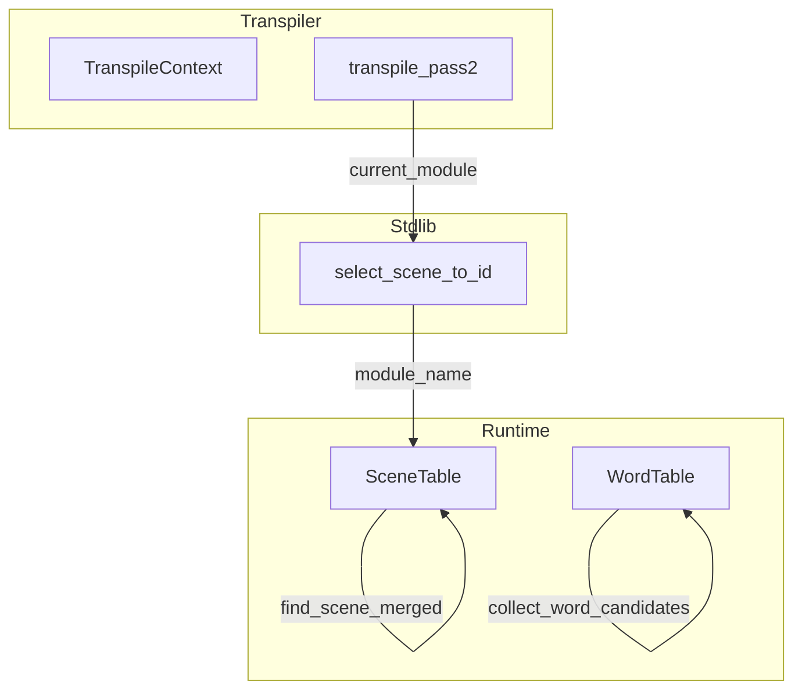
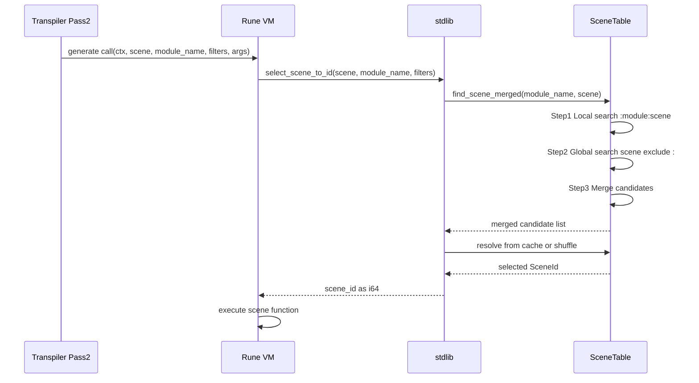

# Design Document: Call Unified Scope Resolution

## Overview

**Purpose**: Call 文（＞シーン）のシーン解決スコープを単語検索（＠単語）と同一の「ローカル＋グローバル統合検索」に統一し、利用者の学習コスト削減と記述簡潔化を実現する。

**Users**: パスタスクリプト利用者が `＞シーン名` のみで、現在のグローバルシーン内のローカルシーン＋全グローバルシーンから前方一致候補を収集し、ランダムに1つ選択する。

**Impact**: SceneTable、Transpiler、stdlib の3レイヤーにわたるスコープ解決ロジックを変更。既存の `＞＊シーン名` 構文は非推奨だが互換性のためサポート継続。

### Goals
- Call 文と単語検索で同一のスコープ解決ロジック（ローカル＋グローバル統合検索）を適用
- `＞シーン名` のみで全候補からランダム選択可能にする
- 既存テストの互換性維持

### Non-Goals
- フィルター機能の拡張（既存仕様のまま）
- JumpTarget 列挙型の変更（パーサー層は維持）
- 検索優先順位の導入（完全ランダムマージ、ローカル優先なし）

## Architecture

### Existing Architecture Analysis

**現在の実装**:
- SceneTable.resolve_scene_id() は単純な前方一致検索（module_name 引数なし）
- Transpiler は JumpTarget::Local/Global を search_key に変換し、module_name を渡していない
- stdlib の select_scene_to_id() は module_name 引数を受け取らない

**既存パターン**:
- WordTable.collect_word_candidates() が 2段階検索＋マージを実装済み
- TranspileContext に current_module 管理機能が既存
- RadixMap による前方一致検索が両テーブルで共通

### Architecture Pattern & Boundary Map



**Architecture Integration**:
- Selected pattern: 既存コンポーネント拡張（WordTable パターンの適用）
- Domain boundaries: Runtime 層でスコープ解決、Transpiler 層でコンテキスト伝播
- Existing patterns preserved: RadixMap 前方一致、キャッシュベース選択
- New components rationale: 新規コンポーネントなし（既存拡張のみ）
- Steering compliance: yield 型エンジン、2パス変換の原則維持

### Technology Stack

| Layer | Choice / Version | Role in Feature | Notes |
|-------|------------------|-----------------|-------|
| Runtime | Rust 2024 + fast_radix_trie 1.1.0 | SceneTable 拡張 | 既存 RadixMap 活用 |
| Transpiler | Rust 2024 | module_name 伝播 | TranspileContext 既存機能使用 |
| Stdlib | Rune 0.14 | 関数シグネチャ変更 | 内部 API のみ |
| Specification | SPECIFICATION.md | Section 4 更新 | 破壊的変更の明記 |

## System Flows

### Call 文実行フロー（変更後）



**Key Decisions**:
- module_name は Transpiler から Rune コード生成時に埋め込み
- 2段階検索はランタイムで実行（コンパイル時解決ではない）

## Requirements Traceability

| Requirement | Summary | Components | Interfaces | Flows |
|-------------|---------|------------|------------|-------|
| 1.1, 1.2, 1.4 | スコープ統合検索 | SceneTable | find_scene_merged() | Call 実行フロー |
| 2.1, 2.2, 2.3 | グローバルプレフィックス廃止 | Transpiler, stdlib | Call 生成コード変更 | Pass2 処理 |
| 3.1, 3.2, 3.3, 3.4 | ランタイム解決一貫性 | SceneTable | find_scene_merged(), resolve_scene_id() | 2段階検索 |
| 4.1, 4.2, 4.3, 4.4 | 既存テスト互換性 | 全コンポーネント | 既存 API 維持 | 回帰テスト |
| 5.1, 5.2, 5.3, 5.4 | SPECIFICATION.md 更新 | ドキュメント | - | - |

## Components and Interfaces

| Component | Domain/Layer | Intent | Req Coverage | Key Dependencies | Contracts |
|-----------|--------------|--------|--------------|------------------|-----------|
| SceneTable | Runtime | シーン検索とランダム選択 | 1, 3 | RadixMap (P0) | Service |
| Transpiler | Transpiler | Call 文 Rune コード生成 | 2 | TranspileContext (P0) | - |
| stdlib | Runtime/Rune | シーン解決関数 | 2, 3 | SceneTable (P0) | API |

### Runtime Layer

#### SceneTable

| Field | Detail |
|-------|--------|
| Intent | シーン検索とスコープ統合によるランダム選択を提供 |
| Requirements | 1.1, 1.2, 1.4, 3.1, 3.2, 3.3, 3.4 |

**Responsibilities & Constraints**
- ローカル＋グローバルシーンの統合検索を実行
- キャッシュベースの順次消費（重複なし）でシーン選択
- module_name によるスコープコンテキストを管理

**Dependencies**
- Inbound: stdlib select_scene_to_id — シーン解決要求 (P0)
- External: fast_radix_trie RadixMap — 前方一致検索 (P0)

**Contracts**: Service [x] / State [x]

##### Service Interface

```rust
impl SceneTable {
    /// Collect all scene candidates using 2-stage search + merge.
    ///
    /// # Algorithm
    /// 1. Local search: `:module_name:prefix` で前方一致
    /// 2. Global search: `prefix` で前方一致（`:` で始まるキーを除外）
    /// 3. Merge: 両方の SceneId をマージ
    ///
    /// # Arguments
    /// * `module_name` - 現在のグローバルシーン名（sanitized）
    /// * `prefix` - 検索プレフィックス
    ///
    /// # Returns
    /// Ok(Vec<SceneId>) マージされた候補リスト
    /// Err(SceneNotFound) 候補なし
    pub fn find_scene_merged(
        &self,
        module_name: &str,
        prefix: &str,
    ) -> Result<Vec<SceneId>, PastaError>;

    /// Resolve scene ID with unified scope search.
    ///
    /// 既存の resolve_scene_id() を拡張し、内部で find_scene_merged() を使用。
    ///
    /// # Arguments
    /// * `module_name` - 現在のグローバルシーン名
    /// * `search_key` - 検索キー
    /// * `filters` - 属性フィルター
    pub fn resolve_scene_id_unified(
        &mut self,
        module_name: &str,
        search_key: &str,
        filters: &HashMap<String, String>,
    ) -> Result<SceneId, PastaError>;
}
```

- Preconditions: prefix は空でないこと
- Postconditions: 返却される SceneId は有効なインデックス
- Invariants: ローカル候補は `:module:` プレフィックスで区別

##### State Management

```rust
/// Cache key for scene resolution (module_name + search_key + filters).
#[derive(Debug, Clone, PartialEq, Eq, Hash)]
struct SceneCacheKey {
    module_name: String,
    search_key: String,
    filters: Vec<(String, String)>,
}
```

- State model: HashMap<SceneCacheKey, CachedSelection>
- Persistence: メモリ内キャッシュ（セッション中のみ）
- Concurrency: Mutex による排他制御（既存パターン維持）

**Implementation Notes**
- Integration: WordTable.collect_word_candidates() の実装パターンを流用
- Validation: prefix が空の場合は InvalidScene エラー
- Risks: キャッシュキー拡張によるメモリ使用量微増（許容範囲）

### Transpiler Layer

#### Transpiler (Call Statement Processing)

| Field | Detail |
|-------|--------|
| Intent | Call 文を Rune コードに変換し、module_name を引数に含める |
| Requirements | 2.1, 2.2 |

**Responsibilities & Constraints**
- Call 文の Rune コード生成時に `context.current_module()` を埋め込む
- JumpTarget::Local/Global を統一的に処理

**Dependencies**
- Inbound: Pass2 処理 — Statement::Call 変換 (P0)
- Outbound: TranspileContext — current_module 取得 (P0)

**Implementation Notes**
- Integration: 既存の `transpile_statement_pass2_to_writer()` 内の Call 処理を変更
- 生成コード変更:
  ```rust
  // Before
  crate::pasta::call(ctx, "{search_key}", #{filters}, [args])
  // After
  crate::pasta::call(ctx, "{search_key}", "{module_name}", #{filters}, [args])
  ```

### Stdlib Layer

#### select_scene_to_id

| Field | Detail |
|-------|--------|
| Intent | Rune VM から呼び出されるシーン解決関数 |
| Requirements | 2.2, 3.1 |

**Contracts**: API [x]

##### API Contract

| Method | Signature | Request | Response | Errors |
|--------|-----------|---------|----------|--------|
| select_scene_to_id | fn(String, String, Value, &Mutex<SceneTable>) | scene, module_name, filters | i64 | String |

**変更点**:
```rust
// Before
fn select_scene_to_id(
    scene: String,
    filters: rune::runtime::Value,
    scene_table: &Mutex<SceneTable>,
) -> Result<i64, String>

// After
fn select_scene_to_id(
    scene: String,
    module_name: String,  // 新規引数
    filters: rune::runtime::Value,
    scene_table: &Mutex<SceneTable>,
) -> Result<i64, String>
```

**Implementation Notes**
- Integration: `SceneTable::resolve_scene_id_unified()` を呼び出し
- Validation: module_name が空の場合はグローバルのみ検索

## Data Models

### Domain Model

**SceneCacheKey（新規）**:
- module_name: 現在のグローバルシーン名
- search_key: 検索プレフィックス
- filters: 属性フィルター（ソート済み Vec）

**既存モデルへの影響**:
- SceneTable: cache フィールドのキー型を CacheKey → SceneCacheKey に変更
- SceneInfo: 変更なし（fn_name 形式維持）

### Logical Data Model

**prefix_index への登録**（Option A: WordTable 統一形式）:
- グローバルシーン: `{name}_{counter}::__start__`（変更なし）
- ローカルシーン: `:{parent}_{parent_counter}:{local}_{local_counter}`（**キー変換**）

**キー変換ロジック** (SceneTable::from_scene_registry 内):
```rust
let search_key = if scene.parent.is_some() {
    // fn_name "会話_1::選択肢_1" → ":会話_1:選択肢_1"
    let parts: Vec<_> = scene.fn_name.split("::").collect();
    format!(":{}", parts.join(":"))
} else {
    // グローバルは変換なし
    scene.fn_name.clone()
};
```

**検索時のキー構築** (find_scene_merged 内):
- ローカル検索: `:{sanitized_module}:{prefix}` で前方一致
- グローバル検索: `{prefix}` で前方一致（`:` で始まるキーを除外）

**WordTable との完全統一**: 両者のキー形式・検索ロジックが `:module:name` パターンで一致

## Error Handling

**新規エラーケース**: なし（既存エラー型で対応）
- SceneNotFound: 候補なし
- NoMatchingScene: フィルター条件で候補なし
- NoMoreScenes: キャッシュ枯渇

**既存との差異**: module_name 追加により、同一 search_key でも異なるエラー発生パターンが生じる可能性あり（ローカル候補の有無による）

## Testing Strategy

### Unit Tests

| Test Case | Component | Requirement |
|-----------|-----------|-------------|
| find_scene_merged_local_only | SceneTable | 3.1, 3.2 |
| find_scene_merged_global_only | SceneTable | 3.1, 3.2 |
| find_scene_merged_local_and_global | SceneTable | 1.1, 1.2, 3.3 |
| find_scene_merged_prefix_match | SceneTable | 1.1 |
| resolve_scene_id_unified_with_cache | SceneTable | 3.4 |

### Integration Tests

| Test Case | Scope | Requirement |
|-----------|-------|-------------|
| call_local_scene_from_global_context | Engine E2E | 1.4, 4.2 |
| call_global_scene_with_local_fallback | Engine E2E | 1.2, 4.1 |
| call_deprecated_global_prefix | Engine E2E | 2.3, 4.1 |

### Regression Tests

- 既存の `cargo test --all` が全て成功すること（4.4）
- fixtures 内の `＞＊` 構文使用箇所: 0件（調査済み）

## Migration & Deployment

**破壊的変更**:
- stdlib select_scene_to_id 関数シグネチャ変更（内部 API）
- 既存生成 Rune コードは再生成が必要

**移行手順**:
1. SceneTable 拡張（find_scene_merged 追加）
2. stdlib シグネチャ変更
3. Transpiler Call 生成コード変更
4. テスト更新・回帰確認
5. SPECIFICATION.md 更新

**ロールバック**: Git revert で対応可能（単一 PR 内で完結）

## Supporting References

詳細な調査結果は [research.md](research.md) を参照:
- WordTable 2段階検索パターンの詳細
- prefix_index 登録キー形式の分析
- TranspileContext module 管理の確認
