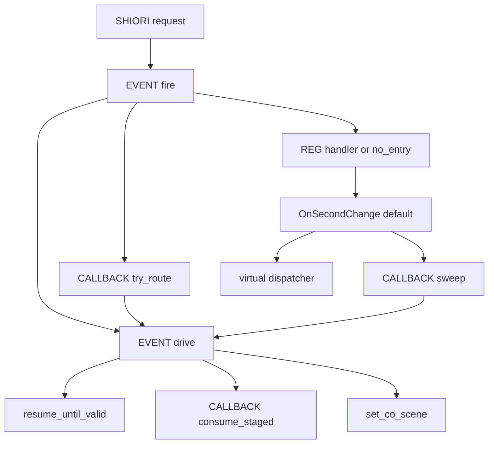
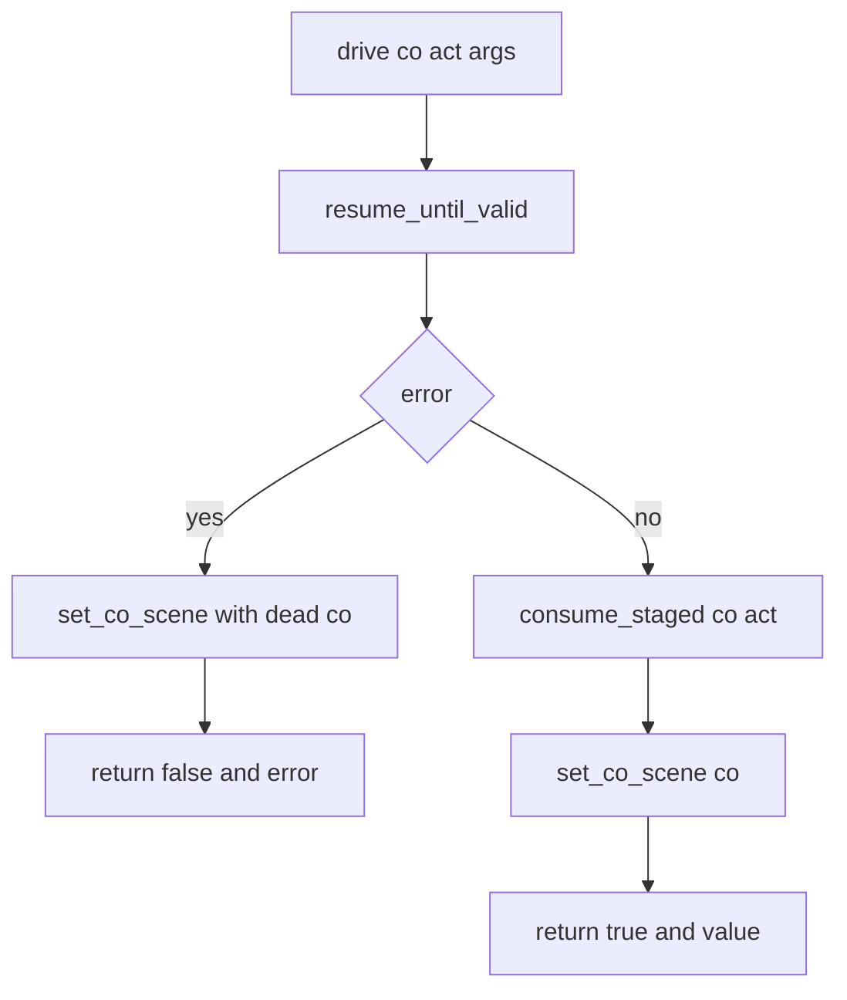
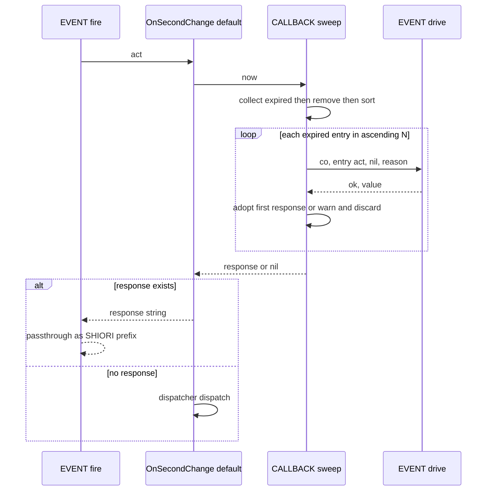

# Design Document: callback-resume-unification

## Overview

**Purpose**: 非同期コールバック（`act:get_property`）で再開したシーンと、タイムアウトの掃引で再開したシーンを、通常のイベントと同じ再開の手順（出力が出るまで再開 → 予約の消費 → 継続の更新）に通す。あわせて、`REG` ハンドラが返した `SHIORI/` で始まる文字列を包まずに返す。

**Users**: `act:get_property` を使うシーンや `REG` ハンドラを書くゴースト作者と、その応答を受け取るベースウェア。

**Impact**: 現在は、再開の手順が `EVENT.fire` の中にだけあり、`CALLBACK.try_route` と `CALLBACK.sweep` は `coroutine.resume` を 1 回呼ぶだけである。本設計は、この手順を 1 つの関数 `EVENT.drive` に切り出し、3 つの呼び出し元（`EVENT.fire`・`try_route`・`sweep`）がすべてそれを使う形にする。`EVENT.fire` の文字列分岐には接頭辞の判定を 1 つ足す。

### Goals
- コールバックの再開・掃引の再開が、通常のイベントと同じ規則で出力・中断・継続される（1.1–1.8、2.1–2.9）。
- タイムアウトが 500 応答として届き、どの戻り値でも応答が二重に包まれない（3.1–3.5、4.1–4.7）。
- 4 つの不具合を、`EVENT.fire`・`SHIORI.request` を通す回帰テストで固定する（6.1–6.6）。
- マニュアル・生成 references・ソース内の説明を新しい挙動にそろえる（7.1–7.5）。

### Non-Goals
- `act:get_property` の引数・戻り値・タグの形の変更（`pasta/shiori/act.lua` は触らない）。
- 継続を 1 つしか持てないことによる消失の解消（コールバックに固有でないため対象外）。
- 選択肢の自動ルーティング（`choice_select.lua`）、仮想ディスパッチャ（`virtual_dispatcher.lua`）、キック（`kick.lua`）の変更。
- 静かなタイムアウト（`timeout_message` に文字列以外を渡す経路）のマニュアルへの記載。
- `STORE.co_callback` の印の削除（「設計判断」の (c) を参照）。

## Boundary Commitments

### This Spec Owns
- `EVENT.fire` の戻り値の応答化の規則（文字列・`SHIORI/` 接頭辞・コルーチン・`nil`）。
- シーンコルーチンの再開の手順（`EVENT.drive`）と、その 3 つの呼び出し元での使い方。
- `CALLBACK.try_route`・`CALLBACK.sweep` の振る舞い（戻り値の型は現行のまま「応答文字列または `nil`」）。
- OnSecondChange の既定ハンドラの説明（コードの形は変えない）。
- 上記を検査するテスト（`crates/pasta_lua/tests/lua_specs/`・`crates/pasta_lua/tests/shiori/`・`crates/pasta_shiori/tests/async_callback_*`）。
- マニュアルの該当章（`book/src/lua/shiori-events.md`・`book/src/internals/execution-model.md`・`book/src/internals/shiori.md`・`book/src/internals/internal-modules.md`）と、そこから生成するスキル references。

### Out of Boundary
- `crates/pasta_lua/pasta_scripts/pasta/act.lua`・`pasta/shiori/act.lua`・`crates/pasta_lua/src/**/element_gen.rs`（`dsl-codegen-runtime-safety` が持つ）。
- `crates/pasta_lua/pasta_scripts/pasta/shiori/event/choice_select.lua`。
- `event/` ディレクトリの外のソース（`pasta/store.lua`・`pasta/shiori/res.lua`・`pasta/shiori/entry.lua` を含む）。コメントも変えない。
- `CALLBACK.stage_pending`・`consume_staged`・`next_event_id`・`reset` の契約。

### Allowed Dependencies
- `event/init.lua` → `event/callback.lua`・`event/register.lua`・`pasta.shiori.res`・`pasta.store`（現行どおり、読み込み時の `require`）。
- `event/callback.lua` → `pasta.shiori.event`（`EVENT.drive`）。**呼び出し時の `require` に限る**（読み込み時に `require` すると循環する）。この向きの依存は本設計で新しく加わる唯一のもの。
- `event/second_change.lua` → `event/callback.lua`・`event/virtual_dispatcher.lua`（現行どおり）。
- 新しいモジュール・設定・外部依存は追加しない。

### Revalidation Triggers
- `EVENT.drive` のシグネチャまたは事後条件の変更。
- `CALLBACK.try_route`・`CALLBACK.sweep` の戻り値の型の変更。
- `act:get_property` が中断・再開で受け渡す値（`refs`、`nil, reason`）の変更（`pasta/shiori/act.lua` 側の仕様）。
- `RES.build` が作る応答の先頭（`SHIORI/3.0 `）の変更（素通しの判定が依存する）。
- `set_co_scene` の規則の変更（仮想ディスパッチャの OnTalk 継続・キックの preempt が依存する）。

## Architecture

### Existing Architecture Analysis

パスは `crates/pasta_lua/pasta_scripts/pasta/shiori/event/` 基準。

- `init.lua` の `EVENT.fire` は、ハンドラがコルーチンを返したとき「`resume_until_valid` → 失敗なら `set_co_scene` して `error` → `CALLBACK.consume_staged` → `set_co_scene` → `RES.ok`」を行う。`resume_until_valid` と `set_co_scene` は `init.lua` のローカル関数である。
- `callback.lua` の `try_route` は `coroutine.resume` を 1 回だけ呼び、`set_co_scene` を通らない。`sweep` は `pairs(pending)` の走査中に `coroutine.resume` を呼び、戻り値を捨てる。
- `init.lua` は読み込み時に `callback.lua` を `require` する。逆向きの `require` は無い。
- `EVENT.fire` は、ハンドラが返した文字列をすべて `RES.ok` で包む。
- `second_change.lua` は `CALLBACK.sweep(os.time())` が応答を返せばそれを返し、そうでなければ `dispatcher.dispatch(act)` の結果を返す。利用者はこのハンドラを変数に取っておき、上書きしたハンドラから呼ぶ（マニュアルに載っている使い方）。
- Lua テストの多くは `pasta.store` と `pasta.shiori.event` を `package.loaded` から外して読み直すが、`pasta.shiori.event.callback` は読み直さない。`set_co_scene` を `callback.lua` へ移すと、古い `STORE` を書き換えることになり、これらのスイートが壊れる。

### Architecture Pattern & Boundary Map



**Architecture Integration**:
- **Selected pattern**: 共通の駆動ルーチン（research.md のオプション B）。再開の手順を `EVENT.drive` の 1 箇所に置き、`EVENT.fire`・`try_route`・`sweep` が呼ぶ。
- **責務の分け方**: `init.lua` は「再開の手順と継続（`STORE.co_scene`）の更新」「戻り値の応答化」を持つ。`callback.lua` は「待機の表（`pending`）と予約（`_staged`）」「待機の取り出し（一致・期限切れ）と、取り出した待機の応答化」を持つ。
- **保つ既存パターン**: `resume_until_valid`・`set_co_scene`・`consume_staged` の中身、`try_route`・`sweep` の戻り値の型、`second_change.lua` のコードの形、呼び出し時の `require` による循環の回避（`EVENT.no_entry`・`virtual_dispatcher.lua` と同じ書き方）。
- **新しい要素**: 公開関数 `EVENT.drive` 1 つ。新しいモジュールは作らない。

### 設計判断

要件ディスカッションから持ち越した 3 点を次のとおり決める。比較の詳細は `research.md` に記す。

**(a) 再開の一本化の形 — オプション B（共通の駆動ルーチン）を採る。**
- `EVENT.drive` を `init.lua` に置き、`callback.lua` は呼び出し時の `require("pasta.shiori.event")` で使う。
- 理由 1: 判断 (b) により、掃引はハンドラの中で応答まで作る必要がある。したがって `callback.lua` から再開の手順に届く経路はどのみち要る。`try_route` だけを `EVENT.fire` 駆動（オプション A・C）にしても、`try_route` の戻り値の契約と既存テストが変わるだけで、得るものが無い。
- 理由 2: `resume_until_valid`・`set_co_scene` を動かさずに済む。`callback.lua` へ移す案は、`callback` を読み直さないテスト群で `STORE` の取り違えを起こす（上記の既存分析）。
- 理由 3: `try_route`・`sweep` の戻り値の型が変わらないため、`EVENT.fire` の冒頭と `second_change.lua` のコードは現行のままでよい。

**(b) 掃引の結果の運び方 — 掃引が SHIORI 応答の全文を作り、ハンドラの戻り値（文字列）として `EVENT.fire` へ返す。**
- 出力は `RES.ok(出力)`、理由付きタイムアウトのエラーは `RES.err(timeout_message)` にする。`EVENT.fire` は `SHIORI/` で始まる文字列を包まずに返す（要件で決定済みの素通し）ため、そのままその回の応答になる。
- 理由: ハンドラの戻り値の型（文字列・コルーチン・`nil`）を増やさない。利用者が既定ハンドラを包んで呼ぶ使い方も、戻り値をそのまま返すだけで動き続ける。掃引を `EVENT.fire` へ移す案は、「`REG.OnSecondChange` を上書きすると掃引が止まる」という既存の規則（マニュアル記載）を変えてしまうため採らない。

**(c) `STORE.co_callback` の印 — 残す。**
- 一本化の後は、`consume_staged` の直後に必ず `set_co_scene` が呼ばれるため、「印が残る」現象は起きなくなる。印は論理上 `consume_staged` の戻り値で代用できる。
- それでも残す理由: 印の説明は `pasta/store.lua` のコメント（編集範囲の外）にあり、削除すると食い違う記述が範囲外に残る。削除しても挙動は変わらない。`consume_staged` を直接呼ぶ既存テストの検査も変えずに済む。

### Technology Stack

| Layer | Choice / Version | Role in Feature | Notes |
|-------|------------------|-----------------|-------|
| Runtime | LuaJIT 2.1（mlua） | イベント配送・コルーチンの再開 | `coroutine.close` が無い。破棄は参照を外すだけ |
| Test | `lua_test`（Lua の BDD）・cargo test | 回帰テスト | 新しい依存なし |
| Docs | mdBook・`book/tools/gen-skill-refs.mjs`・`link-check.mjs` | マニュアルと references の同期 | 既存ツールのみ |

## File Structure Plan

新しいファイルは作らない（テストは既存ファイルへの追加を基本とする）。

### Modified Files — ソース（`crates/pasta_lua/pasta_scripts/pasta/shiori/event/`）
- `init.lua` — `EVENT.drive` を追加する。`EVENT.fire` のコルーチン分岐を `EVENT.drive` の呼び出しに置き換える。文字列分岐に `SHIORI/` 接頭辞の素通しを足す。冒頭の doc コメント（戻り値の規則・使用例）を改める。
- `callback.lua` — `try_route` の再開を `EVENT.drive` に置き換える。`sweep` を「集める → 外す → 並べる → 順に `EVENT.drive`」に書き換える。モジュールと各関数の doc コメントを改める。
- `second_change.lua` — コードは変えない。doc コメント（戻り値の説明）を改める。
- `register.lua` — コードは変えない。doc コメント（ハンドラの戻り値の規則と使用例）を改める。

### Modified Files — テスト
- `crates/pasta_lua/tests/lua_specs/callback_module_test.lua` — 読み直しの補助関数に `pasta.shiori.event` を加える。`try_route`・`sweep` の検査を新しい挙動に改め、順序・予約・継続の検査を足す。
- `crates/pasta_lua/tests/lua_specs/shiori_entry_test.lua` — `EVENT.fire`・`SHIORI.request` を通す回帰テスト（4 つの不具合）を足す。`REG.OnSecondChange` を直接呼んで部分一致で見ている既存の検査を、入口を通す厳密な検査に改める。
- `crates/pasta_lua/tests/lua_specs/event_coroutine_test.lua` — `SHIORI/` 接頭辞の素通しと、コルーチンの出力には適用しないことの検査を足す。
- `crates/pasta_lua/tests/shiori/event_dispatch_test.rs`・`event_handler_test.rs` — `RES.ok(…)` などを返すハンドラの検査を、二重包みを見逃さない形に改める。
- `crates/pasta_shiori/tests/async_callback_chain_test.rs` — タイムアウトの応答を 500 に改める。「`get_property` → チェイントーク」の継続のシナリオを足す。
- `crates/pasta_shiori/tests/fixtures/async_callback/scripts/pasta/shiori/entry.lua` — 上のシナリオ用のハンドラを足す。

### Modified Files — マニュアルと生成物
- `book/src/lua/shiori-events.md` — 戻り値の表、RES の節の末尾の 1 文、OnSecondChange、OnPastaCallBack。
- `book/src/internals/execution-model.md` — モジュール表、コルーチンの持ち主、`EVENT.fire` の流れ、再開のループ、`co_scene` の更新、コールバック待ちとの関係。
- `book/src/internals/shiori.md` — `EVENT.fire` の振り分け、既定ハンドラの表、非同期トーク。
- `book/src/internals/internal-modules.md` — `co_callback` の行（印が残らなくなったことに合わせる）。
- `.claude/skills/pasta-lua-coding/references/shiori-events.md`・`internal-modules.md` — `node book/tools/gen-skill-refs.mjs` で再生成する（手で編集しない）。

## System Flows

### 再開の手順（3 つの呼び出し元で共通）



`set_co_scene` の結果は現行の規則のままである。

| 再開後のコルーチン | 予約 | 行き先 |
| ---- | ---- | ---- |
| suspended | あり（`get_property` で中断） | `CALLBACK.pending` に登録。`STORE.co_scene` は空にする |
| suspended | なし（チェイントークで中断） | `STORE.co_scene` に保存（既存の継続を置き換える） |
| dead（終了またはエラー） | — | どこにも残さない。`STORE.co_scene` は空にする |

### 掃引（OnSecondChange の既定ハンドラ）



- 期限切れの収集と `pending` からの取り外しを、再開より前に済ませる。再開中に登録された待機は収集済みの一覧に入らないため、同じ回では扱われない（2.3）。走査中の表への挿入も起きない。
- 応答が 1 つでも生まれた回は、仮想ディスパッチャを呼ばない（2.6）。継続が同じ回の OnTalk で二重に出力されることはない。

## Requirements Traceability

| Requirement | Summary | Components | Interfaces | Flows |
|-------------|---------|------------|------------|-------|
| 1.1 | 一致したコールバックの再開と応答 | try_route・drive | `CALLBACK.try_route` | 再開の手順 |
| 1.2 | 出力の無い中断を同じイベント内で進める | drive | `EVENT.drive`（`resume_until_valid`） | 再開の手順 |
| 1.3 | 出力付きの中断を継続に保存 | drive | `EVENT.drive`（`set_co_scene`） | 再開の手順 |
| 1.4 | 再度の `get_property` を待機に登録 | drive | `EVENT.drive`（`consume_staged`） | 再開の手順 |
| 1.5 | エラー時は残さず 500 | try_route・drive | `try_route` が `error` で伝える | 再開の手順 |
| 1.6 | 一致しない ID は通常イベント | try_route | `nil` を返す（現行） | — |
| 1.7 | 既存の継続を置き換える | drive | `set_co_scene` の現行規則 | 再開の手順 |
| 1.8 | 最後まで終われば継続を空にする | drive | `set_co_scene` の現行規則 | 再開の手順 |
| 2.1 | 期限切れを漏れなく 1 回ずつ処理 | sweep | `CALLBACK.sweep` | 掃引 |
| 2.2 | 再予約を待機に登録 | sweep・drive | `EVENT.drive` | 掃引 |
| 2.3 | 処理中に登録された待機は次回以降 | sweep | 収集を再開より前に行う | 掃引 |
| 2.4 | 後続のイベントに影響しない | sweep・drive | 予約を必ず消費する | 掃引 |
| 2.5 | 出力付きの中断を継続に保存 | sweep・drive | `EVENT.drive` | 掃引 |
| 2.6 | 出力をその回の応答にし、仮想イベントは出さない | sweep・second_change・fire | `RES.ok` → 素通し | 掃引 |
| 2.7 | 登録順・最初の応答を採用・残りは警告して捨てる | sweep | 番号の昇順 | 掃引 |
| 2.8 | 遅れて届いた結果は待っていないイベント | try_route | `pending` から外し済み → `nil` | — |
| 2.9 | エラーでも残さず、残りを続ける | sweep・drive | `EVENT.drive` の `ok=false` を受けて続行 | 掃引 |
| 3.1 | 500 と `timeout_message` そのものの理由 | sweep | `RES.err(entry.on_timeout)` | 掃引 |
| 3.2 | 200 の `Value` に包まない | fire | `SHIORI/` 接頭辞の素通し | — |
| 3.3 | イベント名と理由の警告ログ | sweep | `log.warn`（現行） | 掃引 |
| 3.4 | シーンを理由のエラーで終わらせる | sweep | `EVENT.drive(co, act, nil, reason)` | 掃引 |
| 3.5 | 静かなタイムアウトは 500 を返さない | sweep | `EVENT.drive(co, act, nil, nil)` | 掃引 |
| 4.1 | 普通の文字列は `Value` の 200（空なら 204） | fire | `RES.ok`（現行） | — |
| 4.2 | `nil` は 204 | fire | 現行 | — |
| 4.3 | コルーチンは再開して応答 | fire・drive | `EVENT.drive` | 再開の手順 |
| 4.4 | `SHIORI/` で始まる文字列は包まない | fire | 接頭辞の判定 | — |
| 4.5 | `RES.*` の応答をそのステータスで届ける | fire | 接頭辞の判定 | — |
| 4.6 | `Value` に応答全文を入れない | fire | 接頭辞の判定 | — |
| 4.7 | コルーチンの出力は常に `Value` | fire・try_route・sweep | 出力は必ず `RES.ok` で包む | — |
| 5.1 | `get_property` の API を変えない | —（`act.lua` を触らない） | 再開で渡す値は現行と同じ | — |
| 5.2 | コールバックが関わらないイベントを変えない | fire・drive | 手順は現行の `EVENT.fire` と同じ | — |
| 5.3 | 継続の再開は OnTalk だけ | —（`virtual_dispatcher.lua` を触らない） | — | — |
| 5.4 | 待機中の他のイベントは通常どおり | try_route | 現行 | — |
| 6.1 | 入口を通す検査 | テスト | Testing Strategy | — |
| 6.2 | 二重包みを見逃さない検査 | テスト | Testing Strategy（検査の形） | — |
| 6.3 | 修正前に戻すと失敗する | テスト | Testing Strategy | — |
| 6.4 | `RES.ok` を返す既存テストの整理 | テスト | Testing Strategy | — |
| 6.5 | `async_callback_chain_test.rs` を 500 に改める | テスト | Testing Strategy | — |
| 6.6 | 全テストと luacheck が通る | テスト | Testing Strategy（関門） | — |
| 7.1 | 戻り値の表と `SHIORI/` の規則 | マニュアル | マニュアルの更新 | — |
| 7.2 | OnPastaCallBack の継続とタイムアウト応答 | マニュアル | マニュアルの更新 | — |
| 7.3 | 内部設計の章の書き改め | マニュアル | マニュアルの更新 | — |
| 7.4 | references の再生成と検証 | マニュアル | マニュアルの更新 | — |
| 7.5 | ソース内の説明の同期 | fire・callback・second_change・register | doc コメント | — |

## Components and Interfaces

| Component | Domain/Layer | Intent | Req Coverage | Key Dependencies | Contracts |
|-----------|--------------|--------|--------------|------------------|-----------|
| `EVENT.drive`（`init.lua`） | イベント配送 | シーンコルーチンを再開し、予約と継続を更新する | 1.2–1.5, 1.7, 1.8, 2.2, 2.4, 2.5, 2.9, 4.3, 5.2 | `CALLBACK.consume_staged`（P0）、`STORE`（P0） | Service, State |
| `EVENT.fire`（`init.lua`） | イベント配送 | ハンドラの戻り値を応答にする | 3.2, 4.1–4.7 | `EVENT.drive`（P0）、`RES`（P0） | Service |
| `CALLBACK.try_route`（`callback.lua`） | コールバック管理 | 一致した待機を取り出して再開し、応答にする | 1.1, 1.5, 1.6, 2.8, 5.4 | `EVENT.drive`（P0） | Service |
| `CALLBACK.sweep`（`callback.lua`） | コールバック管理 | 期限切れの待機をタイムアウトとして再開し、その回の応答を作る | 2.1–2.9, 3.1, 3.3–3.5 | `EVENT.drive`（P0）、`RES`（P0）、`@pasta_log`（P1） | Service, Batch |
| OnSecondChange 既定ハンドラ（`second_change.lua`） | 定期イベント | 掃引の応答があれば返し、無ければ仮想ディスパッチャへ進む | 2.6 | `CALLBACK.sweep`（P0） | —（コード変更なし） |

### イベント配送（`init.lua`）

#### EVENT.drive

| Field | Detail |
|-------|--------|
| Intent | シーンコルーチンを、出力が得られるか終わるまで再開し、予約の消費と継続の更新までを 1 回で行う |
| Requirements | 1.2, 1.3, 1.4, 1.5, 1.7, 1.8, 2.2, 2.4, 2.5, 2.9, 4.3, 5.2 |

**Responsibilities & Constraints**
- 現行の `EVENT.fire` のコルーチン分岐の手順を、順序を変えずに切り出したものである。新しい規則は持たない。
- 応答文字列は作らない。エラーを投げるか続けるかも決めない（呼び出し元が決める）。
- `resume_until_valid` と `set_co_scene` は `init.lua` のローカル関数のまま使う。

**Contracts**: Service [x] / State [x]

##### Service Interface
```lua
--- @param co thread            再開するシーンコルーチン（suspended）
--- @param act table            このコルーチンに紐づく ACT（待機を登録するときに使う）
--- @param ... any              最初の resume に渡す引数
--- @return boolean ok          false ならシーンがエラーで終わった
--- @return string|nil value    ok=true: 出力（nil は出力の無いまま終了）／ok=false: エラーの値
function EVENT.drive(co, act, ...)
```

| 呼び出し元 | `act` | 最初の resume の引数 |
| ---- | ---- | ---- |
| `EVENT.fire`（ハンドラが返したコルーチン） | そのイベントの ACT | そのイベントの ACT |
| `CALLBACK.try_route` | `entry.act`（待機を登録したときの ACT） | `refs`（Reference の 1 始まりの配列） |
| `CALLBACK.sweep` | `entry.act` | `nil, reason`（`reason` は `on_timeout` が文字列のときだけ。それ以外は `nil`） |

- Preconditions: `co` は suspended。`co` は `CALLBACK.pending` に入っていない（呼び出し元が先に外す）。
- Postconditions（`ok=true`）: 予約は消費済み。`co` は「`pending` に登録」「`STORE.co_scene` に保存」「どこにも無い（dead）」のどれか 1 つ。`STORE.co_callback` は `nil`。
- Postconditions（`ok=false`）: `co` は dead でどこにも残らない。`STORE.co_scene` は `nil`（通常のイベントのエラーと同じ）。
- Invariants: 最初の resume 以外は引数なしで再開する（現行の `resume_until_valid`）。

##### State Management
- 扱う状態: `STORE.co_scene`（継続）、`CALLBACK.pending`（待機）、`callback.lua` の `_staged`（予約）、`STORE.co_callback`（印）。
- 更新は `consume_staged` → `set_co_scene` の順で、間に他の処理を挟まない。
- 並行性: 1 つの VM を 1 スレッドで順に処理するため、排他は不要。

**Implementation Notes**
- Integration: `EVENT._resume_until_valid`（テスト用の公開）は現行のまま残す。
- Risks: シーンが `stage_pending` の後、中断の前にエラーで終わると予約が残る。これは現行の `EVENT.fire` にもある経路で、`get_property` の中（`act.lua`）でしか起きないため、本設計では扱わない（Open Questions 1）。

#### EVENT.fire

| Field | Detail |
|-------|--------|
| Intent | ハンドラの戻り値の型に応じて SHIORI 応答を返す |
| Requirements | 3.2, 4.1, 4.2, 4.3, 4.4, 4.5, 4.6, 4.7 |

**Contracts**: Service [x]

##### Service Interface
```lua
--- @param req table   SHIORI リクエスト
--- @return string     SHIORI 応答の全文
function EVENT.fire(req)
```

戻り値の応答化の規則（変わるのは 2 行目だけ）。

| ハンドラの戻り値 | 応答 |
| ---- | ---- |
| コルーチン | `EVENT.drive(co, act, act)`。失敗なら `error(value)`、成功なら `RES.ok(value)`（出力は接頭辞にかかわらず常に `Value`） |
| `SHIORI/` で始まる文字列 | その文字列をそのまま返す |
| それ以外の文字列 | `RES.ok(文字列)`（空文字列は 204） |
| その他（`nil`） | `RES.no_content()` |

- 冒頭の `CALLBACK.try_route(req)` の呼び出しと、応答があればそれを返す分岐は変えない。
- 接頭辞の判定は「先頭 7 文字が `SHIORI/` と等しい」とする。

### コールバック管理（`callback.lua`）

#### CALLBACK.try_route

| Field | Detail |
|-------|--------|
| Intent | 待っているイベント名と一致したら、その待機を再開して応答を返す |
| Requirements | 1.1, 1.5, 1.6, 2.8, 5.4 |

**Contracts**: Service [x]

##### Service Interface
```lua
--- @param req table           SHIORI リクエスト
--- @return string|nil         一致したら SHIORI 応答、一致しなければ nil
function CALLBACK.try_route(req)
```
- 一致の判定、`pending` からの取り外し、Reference の 1 始まり配列への変換は現行のまま。
- 再開は `EVENT.drive(entry.co, entry.act, refs)` に置き換える。`ok=false` なら `error(value)`（`SHIORI.request` の `xpcall` が 500 にする）。`ok=true` なら `RES.ok(value)`。
- 自前の `consume_staged` の呼び出しは無くなる（`EVENT.drive` が行う）。

#### CALLBACK.sweep

| Field | Detail |
|-------|--------|
| Intent | 期限を過ぎた待機をタイムアウトとして再開し、その回の応答を 1 つ作る |
| Requirements | 2.1, 2.2, 2.3, 2.4, 2.5, 2.6, 2.7, 2.9, 3.1, 3.3, 3.4, 3.5 |

**Contracts**: Service [x] / Batch [x]

##### Service Interface
```lua
--- @param now number          現在時刻（os.time() の値）
--- @return string|nil         その回の応答（SHIORI 応答の全文）。応答が生まれなければ nil
function CALLBACK.sweep(now)
```

##### Batch / Job Contract
- Trigger: OnSecondChange の既定ハンドラが毎回呼ぶ。
- 手順:
  1. `pending` を走査し、`now > timeout_at` の待機を一覧に集める（この間は再開しない）。
  2. 集めた待機を `pending` から外す。
  3. 一覧をイベント名の番号（`OnPastaCallBack{N}` の `N`）の小さい順に並べる。番号を持たない名前は末尾に置き、名前の文字列順にする。
  4. 一覧の順に、待機ごとに次を行う。
     - `on_timeout` が文字列なら、イベント名と理由を警告ログに出す（現行の書式）。
     - `EVENT.drive(entry.co, entry.act, nil, reason)` を呼ぶ。
     - 結果から応答の候補を決める（下表）。
     - まだ応答が無ければ候補を採用する。既に応答があれば、候補を捨てて警告ログ（イベント名と、捨てたこと）を出す。
  5. 採用した応答、または `nil` を返す。

| `EVENT.drive` の結果 | `on_timeout` | 応答の候補 |
| ---- | ---- | ---- |
| `ok=false` | 文字列 | `RES.err(on_timeout)`（シーン内のエラー文字列は使わない） |
| `ok=false` | 文字列以外 | なし（エラーの値を警告ログに出す） |
| `ok=true`、出力あり | どちらでも | `RES.ok(出力)` |
| `ok=true`、出力なし（`nil` または空文字列） | どちらでも | なし |

- Idempotency & recovery: 待機は再開の前に `pending` から外すため、1 つの待機が 2 回処理されることはない。途中の待機がエラーで終わっても、残りの処理を続ける。

**Implementation Notes**
- Integration: `EVENT` は関数の中で `require("pasta.shiori.event")` して得る（読み込み時に `require` しない）。
- Validation: 応答を捨てた待機も、`EVENT.drive` を通っているため、予約と継続は規則どおりに更新されている。
- Risks: 2 番目以降の待機が「再度の `get_property`」で中断した場合、その出力（get タグ）は捨てられるため、その待機は結果が届かず次の期限でタイムアウトする（Open Questions 3）。

### 定期イベント（`second_change.lua`）

コードは変えない。`CALLBACK.sweep` が返す値が「500 の応答文字列」から「その回の応答（200 または 500 の全文）」に広がるため、doc コメントの戻り値の説明だけを改める。

## Data Models

変更なし。`CALLBACK.pending` のエントリ（`co`・`act`・`timeout_at`・`on_timeout`）と `STORE` のフィールドは現行のまま使う。

## Error Handling

### Error Strategy

| 起きること | 扱い | 応答 |
| ---- | ---- | ---- |
| コールバックで再開したシーンのエラー | `try_route` が `error` で伝える。`pending`・継続に残さない | `SHIORI.request` が 500（理由はエラーの 1 行目） |
| 理由付きタイムアウトでシーンが終わる | 掃引が候補にする。残りの待機の処理を続ける | 500。`X-Error-Reason` は `timeout_message` そのもの |
| 静かなタイムアウトで再開したシーンのエラー | 警告ログに出し、残りの待機の処理を続ける | その待機からは応答を作らない |
| ハンドラ自体のエラー | 現行どおり `xpcall` が捕まえる | 500 |

- コールバック・掃引で再開したシーンがエラーで終わると、通常のイベントと同じく、既存の継続（`STORE.co_scene`）も空になる。現行の `try_route` は継続に触れなかったため、ここは挙動が変わる（一本化の帰結）。
- 理由付きの待機は、シーンがどのエラーで終わっても 500 の理由に `timeout_message` を使う（3.1 の「掃引側で保持した理由から応答を作る」）。

### Monitoring
- 警告ログ（`@pasta_log` の `warn`）: 理由付きタイムアウト（イベント名と理由、現行）、捨てた応答（イベント名）、静かなタイムアウトのシーンのエラー。

## Testing Strategy

検査の形（6.2）: 応答は「先頭行がステータス行と完全に一致する」「`SHIORI/3.0` が応答の中に 1 回だけ現れる」「`Value`・`X-Error-Reason` の行が期待値と完全に一致する」で確かめる。部分一致だけの検査は新しいテストでは使わない。

### 回帰テスト（Lua、`EVENT.fire` または `SHIORI.request` を通す）
`crates/pasta_lua/tests/lua_specs/shiori_entry_test.lua` に足す。どれも修正前のコードでは失敗する（6.3）。
1. コールバックの後のチェイントーク: シーンが `get_property` → トーク → `act:yield()` → トークの順に進む。コールバックの応答が 1 つ目のトークの 200 で、`STORE.co_scene` にそのコルーチンが残り、次の OnTalk の機会に 2 つ目のトークが出る（1.1, 1.3）。
2. 出力の無い最初の中断: `get_property` の直後にトークを積まずに `act:yield()` し、その後トークを出す。コールバックの応答が 204 ではなくトークの 200 になる（1.2）。
3. コールバックの後の再度の `get_property`: 応答が get タグの 200、新しい番号の待機が登録され、`STORE.co_scene` と `STORE.co_callback` が `nil`（1.4）。
4. 既存の継続との関係: 別のシーンの継続がある状態で、コールバック側のシーンが中断すれば置き換わり、終われば空になる（1.7, 1.8）。
5. タイムアウトの応答: 理由付きの待機を期限切れにして OnSecondChange を `SHIORI.request` で送る。ステータス行が 500、`X-Error-Reason` が `timeout_message` と完全に一致、`Value` 行が無い（3.1, 3.2, 3.4）。仮想ディスパッチャが呼ばれない（2.6）。
6. 掃引の後のイベント: タイムアウトを捕まえて再度 `get_property` するシーンを掃引した後、コルーチンを返す別のイベントを送る。「multiple staging」にならず、別のシーンが古いイベント名で登録されない（2.2, 2.4）。
7. ハンドラの戻り値: `RES.ok("x")`・`RES.no_content()`・`RES.warn("r")`・`RES.not_enough()`・`RES.advice()`・`RES.err("r")` を返すハンドラの応答が、返した文字列と完全に一致する（4.4, 4.5, 4.6）。普通の文字列・空文字列・`nil` は 200・204・204（4.1, 4.2）。`SHIORI/` で始まる文字列を出力するコルーチンは 200 の `Value` になる（4.7、`event_coroutine_test.lua`）。

### モジュール単位のテスト（Lua、`callback_module_test.lua`）
1. 掃引の順序: 番号 2・10・1 の 3 つを期限切れにし、1 → 2 → 10 の順に再開される。最初に応答を生んだ待機の応答が返り、残りは警告ログが出る（2.1, 2.7）。
2. 処理中の登録: 掃引で再開したシーンが期限 0 秒の `get_property` を呼んでも、同じ回では再開されず `pending` に残る（2.3）。
3. 掃引での継続: 出力付きで中断したシーンが `STORE.co_scene` に入る（2.5）。静かなタイムアウトの出力が 200 の応答になる（3.5）。
4. エラーで終わる待機と続行: 1 つ目がエラーで終わっても 2 つ目が処理される（2.9）。警告ログにイベント名と理由が出る（3.3）。
5. 遅れて届いた結果: 掃引済みのイベント名で `try_route` が `nil` を返す（2.8）。一致しない名前も `nil`（1.6）。
6. `try_route` のエラー: 再開したシーンがエラーなら `error` が伝わり、`pending` にも `STORE.co_scene` にも残らない（1.5）。

読み直しの補助関数（`reload_callback_modules`）に `package.loaded["pasta.shiori.event"] = nil` を加える。`callback.lua` が呼び出し時に `require` する `EVENT` が、読み直した `CALLBACK`・`STORE` を使うようにするためである。 `callback.lua` を使う他の Lua スイート（`shiori_entry_test.lua`・`second_change_thread_test.lua` など）も、読み直すモジュールの組が `EVENT`・`CALLBACK`・`STORE` でそろっているかを実装時に確かめ、そろっていなければ同じ行を足す。

### E2E（Rust、`crates/pasta_shiori/tests/`）
1. `async_callback_chain_test.rs` の `test_timeout_sweep_releases_coroutine`: 2 回目の応答を 500 と `X-Error-Reason: callback timeout: get_property` に改める。「二重包みは既知の挙動」のコメントを消す（6.5, 3.1）。3 回目（遅れて届いた結果が 204）は現行のまま（2.8）。
2. 新しいシナリオ「`get_property` → チェイントーク」: コールバックの応答に前半のトーク、次の OnTalk の機会に後半のトークが出る（1.3、6.1）。OnTalk を確実に起こす手段は、既存のチェイントークの E2E（`scene_kick_multibeat_e2e_test.rs` など）の方法に合わせる。
3. `async_callback_simple_test.rs` のシナリオ 4（待機中の無関係なイベント）は変えずに通ることを確かめる（5.4）。

### 既存テストの整理（6.4）
- `event_dispatch_test.rs`・`event_handler_test.rs` の `return RES.ok(…)`・`return RES.no_content()` は、素通しにより正しい書き方になるため残す。検査を「`200 OK` と `Value: …` の部分一致」から、上の「検査の形」に改める。
- `shiori_entry_test.lua` の「`REG.OnSecondChange` を直接呼んで部分一致で見る」検査は、回帰テスト 5 に置き換える。

### 関門（6.6, 5.1, 5.2, 5.3）
- `cargo test --workspace`（Lua のスイートを含む）。`virtual_dispatcher_*`・`kick_*`・`global_chaintalk_*`・`get_property_test`・`choice_select_test` が変更なしで通ることを、既存挙動の維持の根拠にする。
- `cargo clippy --all-targets --workspace -- -D warnings`、luacheck。
- `node book/tools/gen-skill-refs.mjs --check`、`node book/tools/link-check.mjs`（7.4）。

## マニュアルの更新（7.1–7.5）

回避レシピ（書けない形の代わりの書き方）は載せない。規則と部品の能力だけを書く。

| ファイル | 箇所 | 改める内容 |
| ---- | ---- | ---- |
| `lua/shiori-events.md` | REG の戻り値の表と箇条書き | 「`SHIORI/` で始まる文字列 → 応答全体として、包まずにそのまま返す」の行を足す。`RES` の関数で作った応答を返せば、204（理由付き）・311・312・500 をそのステータスで返せることを書く。「`SHIORI/` で始まる文字列は応答全体として扱う」規則を 1 行で示す。コルーチンの出力にはこの規則が適用されないことを書く（7.1） |
| `lua/shiori-events.md` | RES の節の末尾「`REG` のハンドラは、応答全体ではなく `Value` にする文字列を返す」 | 上の規則に合わせて書き改める（7.1） |
| `lua/shiori-events.md` | OnSecondChange | 既定ハンドラの 1 番目の処理が応答を生んだ回は、その応答を返し、OnHour・OnTalk を発行しないことを書く（7.2） |
| `lua/shiori-events.md` | OnPastaCallBack | 再開したシーンが通常のイベントと同じ規則で扱われること（出力の無い中断は同じイベントの中で進む、チェイントークで中断した続きは次の OnTalk の機会に出る、再度 `get_property` すれば新しい待機になる）と、タイムアウト時の応答（`timeout_message` を `X-Error-Reason` に持つ 500、OnSecondChange の応答として返る、遅れて届いた結果は待っていないイベントとして扱う）を書く（7.2） |
| `internals/execution-model.md` | モジュール表・コルーチンの持ち主 | `EVENT.drive` を再開の手順の持ち主として書く。「`try_route` の経路では印が残る」の記述を消す（7.3） |
| `internals/execution-model.md` | `EVENT.fire` の流れ | コルーチン分岐を `EVENT.drive` に、文字列分岐を素通しの規則に書き改める（7.3） |
| `internals/execution-model.md` | 再開のループ | 「このループは `EVENT.fire` だけが使う。コールバックの再開は `resume` を 1 回だけ行う」を消し、3 つの呼び出し元と最初の resume の引数の表に置き換える（7.3） |
| `internals/execution-model.md` | `co_scene` の更新・コールバック待ちとの関係 | `set_co_scene` を呼ぶのが `EVENT.drive` であること、コールバック・掃引の再開でも継続が同じ規則で更新されること、掃引の手順（集める → 外す → 並べる → 再開）と応答の決め方を書く（7.3） |
| `internals/shiori.md` | `EVENT.fire` の振り分け・既定ハンドラの表・非同期トーク | 手順 4 の「文字列なら `RES.ok` で包み」を素通しの規則に、`REG.OnSecondChange` の行と期限切れの流れを新しい掃引に書き改める（7.3） |
| `internals/internal-modules.md` | STORE の `co_callback` の行 | 「`consume_staged` が書き、直後の `set_co_scene` が `nil` に戻す」と書き、参照先の記述と食い違わないようにする（7.3） |
| `.claude/skills/pasta-lua-coding/references/` | 生成物 | `node book/tools/gen-skill-refs.mjs` で再生成する（7.4） |
| `event/init.lua`・`register.lua`・`callback.lua`・`second_change.lua` | doc コメント | 「返した文字列は `EVENT.fire` が `RES.ok` で包む」を戻り値の規則どおりに改める。`try_route`・`sweep` の説明を新しい手順に合わせる（7.5） |

## Open Questions / Risks

### 確定済み（開発者の確認が要らないもの）

- **`STORE.co_callback` の印は残す**（Architecture › 設計判断 (c)）。削除しても挙動は変わらず、印の説明が編集範囲の外（`pasta/store.lua` のコメント）にあるため、削除する理由が無い。
- **コールバック・掃引のシーンのエラーで既存の継続も空になる**（Error Handling）。要件ディスカッションで決めた「通常のイベントと同じ規則」（1.7・1.8）の帰結であり、現行からの挙動の変化として記録する。
- **`RES.ok(…)` を返す既存テストは書き方を残し、検査だけ厳密にする**（Testing Strategy、6.4）。素通しにより正しい書き方になり、素通しの回帰テストを兼ねる。
- **`EVENT.drive` は `init.lua` に置き、`callback.lua` は呼び出し時の `require` で使う**（Architecture › 設計判断 (a)、設計ディスカッション #1 で決定）。動かすコードとテストが最も少ない。再開の手順ごと `callback.lua` へ移す案と、`EVENT.fire` 側で駆動する案（オプション A）は採らない。

### 設計ディスカッションで確認する項目

どれも、本設計では「採った案」で書いてある。

1. **予約したまま中断の前にエラーで終わったシーンの予約**（EVENT.drive）。現行にもある経路で、`get_property` の中でしか起きない。採った案: 扱わない。代案: `EVENT.drive` の失敗時に予約を捨てる関数を `callback.lua` に足す。推奨: 扱わない（要件に無い）。
2. **静かなタイムアウトで再開したシーンがエラーで終わったとき**（Error Handling）。採った案: 応答は作らず、警告ログだけ出す（3.5 の「500 応答を返さず」と 2.9 から）。代案: エラーの 1 行目を理由に 500 を返す。あわせて、理由付きの待機はシーンがどのエラーで終わっても理由に `timeout_message` を使う。推奨: 採った案。
3. **複数の待機が同時にタイムアウトしたとき、2 番目以降の出力が get タグでも捨てる**（CALLBACK.sweep）。2.7 の決定どおりだが、捨てられた get タグの待機は必ず次の期限でタイムアウトする。代案: 応答の採用で get タグを優先する（規則が増える）。推奨: 2.7 のまま受け入れ、警告ログで分かるようにする。

リスク:
- 掃引の出力は、ベースウェアの状態（トーク中など）を見ずにその回の応答になる。現行のタイムアウト 500 も同じ扱いであり、要件も条件を付けていないため、そのままとする。
- `callback.lua` から `pasta.shiori.event` を読み込み時に `require` すると循環する。呼び出し時の `require` に限ることを doc コメントに書く。
