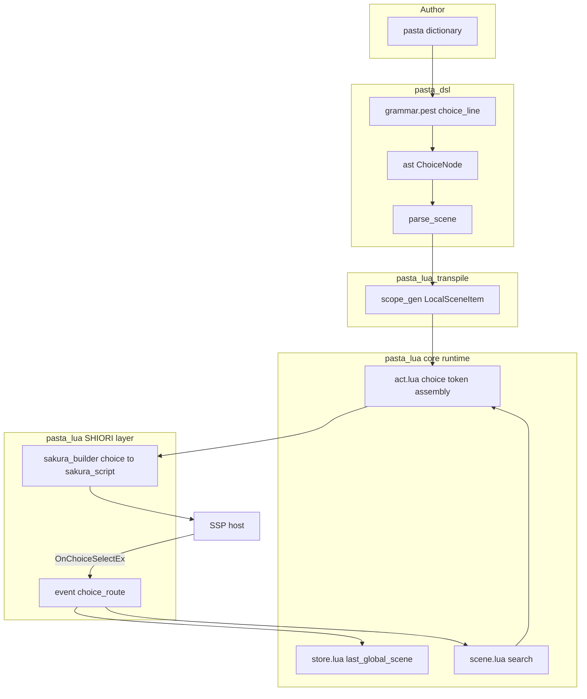
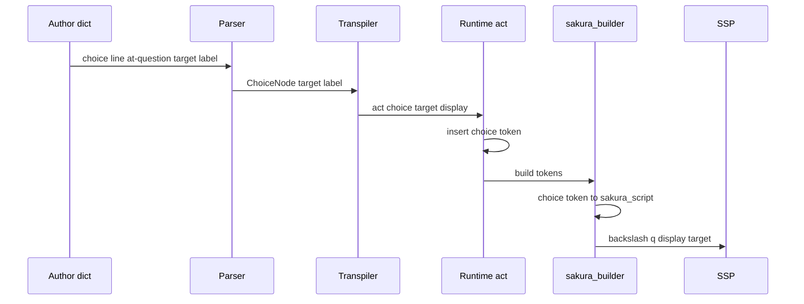
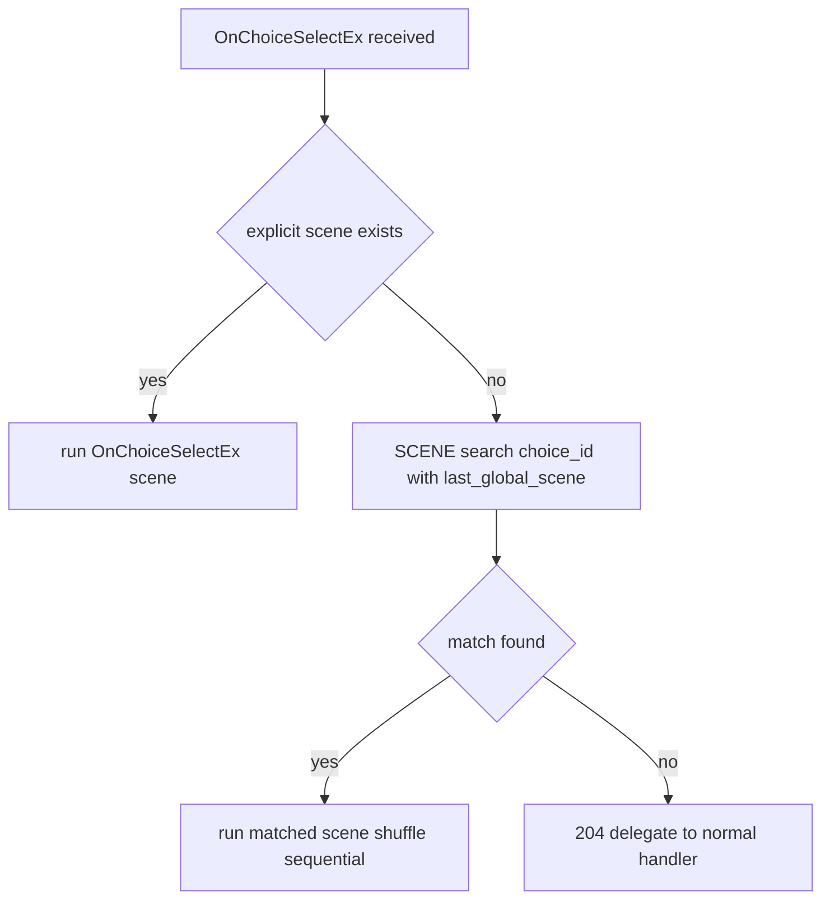

# Design Document

## Overview

**Purpose**: 本機能はPasta DSLに選択肢定義マーカー `＠？` を追加し、ゴースト作者がさくらスクリプト（`\q[...]`/`\![*]`）やLuaイベントハンドラを手書きせずに対話分岐メニューを宣言的に記述できるようにする。

**Users**: ゴースト作者が `.pasta` 辞書ファイル内で選択肢を記述し、SSP上でユーザーがクリックした選択肢に応じてシーンが自動実行される。

**Impact**: 既存のPastaパイプライン（PEGパーサ → AST → Lua トランスパイラ → Luaランタイム → SHIORI）に対し、選択肢という新しい行種別を追加する。文法・AST・トランスパイラ・Luaランタイムの各層を最小限拡張し、選択結果ルーティングを `OnChoiceSelectEx` イベントハンドラとして追加する。

### Goals
- `＠？target` / `＠？target「表示テキスト」` の2形式を新しい行種別としてパースする
- 選択肢マーカーから SHIORI 非依存の構造化 `choice` トークンを生成し、SHIORI 層（sakura_builder）でさくらスクリプト `\![*]\q[display,target]` へ変換する
- `OnChoiceSelectEx` 受信時に選択IDと同名シーンを既存のスコープ解決規則で自動実行する
- `!select(秒数)` による選択タイムアウト指定をサポートする
- サンプルゴースト hello-pasta に選択肢デモを追加する

### Non-Goals
- 条件付き選択肢（`＠？target if 条件`）、入れ子選択肢、コロン形式（`＠？target：text`）
- 選択肢専用シーンマーカー（`＊？`）— 通常シーン（`＊`/`・`）をコールバック先とする
- アクター非依存の選択肢DSL構文（`＠？` をトーク行外に配置する文法）— Luaランタイムはハイブリッド対応するが、DSL文法は現行スコープ外
- LSP補完・ジャンプ先候補表示、選択肢のスタイリング

## Boundary Commitments

### This Spec Owns
- 選択肢行の文法規則（`choice_line`）と AST ノード（`ChoiceNode`）の定義
- 選択肢行 → 構造化 `choice` トークンへのトランスパイル規則（SHIORI非依存）
- `choice` トークン → さくらスクリプト `\![*]\q[display,target]` への変換規則（SHIORI層）
- `!select(秒数)` cue コマンドの `choice_timeout` トークン生成と、そのさくらスクリプト変換
- `OnChoiceSelectEx` の既定ルーティングハンドラ（選択ID → シーン検索 → 実行）
- 自動ルーティング用の「最後に実行したグローバルシーン名」の記録機構（`STORE.last_global_scene`）
- サンプルゴーストへの選択肢デモ辞書

### Out of Boundary
- さくらスクリプト `\q[...]` / `\![*]` / `choicetimeout` の解釈・描画（SSP が所有）
- `OnChoiceSelectEx` イベントの発火（SSP が所有）
- シーン前方一致検索・シャッフル＆順次消費アルゴリズムそのもの（既存 `SCENE.search` / Call文機構が所有。本specは利用のみ）
- 条件分岐・入れ子等の将来構文（`doc/spec/12-future.md` 領域）

### Allowed Dependencies
- `pasta_dsl`: 既存 PEG パーサ（Pest 2.8.x）、`LocalSceneItem` AST、`cue_cmd_line` パターン
- `pasta_lua`: 既存トランスパイラ（`code_gen/scope_gen.rs` / `element_gen.rs`）、Luaランタイム（`act.lua` / `store.lua` / `scene.lua` / `shiori/event/`）、`@pasta_sakura_script` モジュール
- 既存 `SCENE.search(name, global_scene_name)` の第2引数フォールバック（ローカル → グローバル前方一致検索）

### Revalidation Triggers
- `LocalSceneItem` enum または `local_scene_item` 文法の構造変更
- `act.lua` のトークン蓄積形式（`token` テーブルのスキーマ）変更
- `SCENE.search` / `SCENE.co_exec` のシグネチャ変更
- `EVENT.fire` / `REG` ハンドラ登録規約の変更
- `OnChoiceSelectEx` の Reference インデックス規約（後述 Open Questions）の確定・変更

## Architecture

### Existing Architecture Analysis
Pastaは declarative flow（Call/Jump、if/while/for なし）を採用し、UI非依存（マーカーのみ）でyield型出力を行う。本機能は既存の行種別追加パターンに完全準拠する：

- **文法層** (`grammar.pest`): `local_scene_item` / グローバルシーン行に新規行規則を追加
- **AST層** (`ast/scene.rs`, `parse_scene.rs`): `LocalSceneItem` enum バリアント追加＋パース関数
- **トランスパイル層** (`code_gen/scope_gen.rs`): `LocalSceneItem` 分岐に新規ハンドラ追加
- **コアランタイム層** (`pasta_scripts/pasta/*.lua`): act トークン蓄積メソッド追加、STORE フィールド追加
- **SHIORIランタイム層** (`pasta_scripts/pasta/shiori/`): sakura_builder にトークン→さくらスクリプト変換追加、イベントハンドラ追加

既存の `cue_cmd_line`（`!name(args)`）が選択肢行と最も近い構造であり、文法・AST・パースの参照実装とする。

### Architecture Pattern & Boundary Map



**Architecture Integration**:
- 選択パターン: 既存の行種別追加パターン（4層貫通）を踏襲
- ドメイン境界: 3層分離を維持。トランスパイラ（DSL→Lua）はさくらスクリプトを知らない。コアランタイム（`act.lua`）は構造化トークンを蓄積するのみでさくらスクリプトを知らない。SHIORI層（`sakura_builder`/`event/`）がさくらスクリプト生成とイベントルーティングを担当
- 既存パターン保持: `cue_cmd_line` パース、`REG` ハンドラ登録、`SCENE.search` スコープ解決
- 新規コンポーネント根拠: `ChoiceNode`（新行種別表現）、`choice`/`choice_timeout` 構造化トークン（SHIORI非依存の選択肢概念）、`OnChoiceSelectEx` ルータ（選択結果→シーン）
- Steering準拠: declarative flow（条件分岐なし）、UI非依存（選択肢はトークン概念、表示形式はSHIORI層に委譲）、yield型出力を維持

### Technology Stack

| Layer        | Choice / Version               | Role in Feature                                              | Notes                            |
| ------------ | ------------------------------ | ------------------------------------------------------------ | -------------------------------- |
| DSL / Parser | Pest 2.8.x (pasta_dsl)         | `choice_line` 文法・`ChoiceNode` AST                         | 既存 `cue_cmd_line` パターン踏襲 |
| Transpiler   | Rust 2024 (pasta_lua code_gen) | 選択肢 → `act:choice()` Lua呼び出し生成                      | `LocalSceneItem` 分岐拡張        |
| Runtime      | LuaJIT 2.1 / mlua 0.11         | `choice`/`choice_timeout` 構造化トークン蓄積、ルーティング   | 構造化トークン・`REG` 利用       |
| Host (外部)  | SSP さくらスクリプト           | `\q[]`/`\![*]`/`choicetimeout` 解釈、`OnChoiceSelectEx` 発火 | 本specの境界外                   |

## File Structure Plan

### Modified Files
- `crates/pasta_dsl/src/parser/grammar.pest` — `choice_line` 規則と `question_marker` を追加し、`local_scene_item` および グローバルシーン行の選択肢に組み込む
- `crates/pasta_dsl/src/parser/ast/scene.rs` — `LocalSceneItem` に `Choice(ChoiceNode)` バリアント、`ChoiceNode` 構造体（`target: String`, `label: Option<String>`）を追加
- `crates/pasta_dsl/src/parser/parse_scene.rs` — `Rule::choice_line` 分岐を `local_scene_item` / グローバルシーンの両ループに追加、`parse_choice_line()` を実装（`parse_cue_cmd_line` を参考）
- `crates/pasta_lua/src/code_gen/scope_gen.rs` — `LocalSceneItem::Choice` 分岐で `act:choice(target, display)` を生成。`LocalSceneItem::CueCommand` 分岐で cue 名が `select` の場合に `act:choice_timeout(秒)` を生成（それ以外の cue は従来どおり無視）
- `crates/pasta_lua/pasta_scripts/pasta/act.lua` — `ACT_IMPL.choice(self, target, display)`（構造化 `choice` トークン挿入）、`ACT_IMPL.choice_timeout(self, seconds)`（構造化 `choice_timeout` トークン挿入）、`ACT_IMPL.init_scene` に `STORE.last_global_scene = scene.__global_name__` 記録を追加
- `crates/pasta_lua/pasta_scripts/pasta/shiori/sakura_builder.lua` — `choice` トークン → `\![*]\q[display,target]`、`choice_timeout` トークン → `\![set,choicetimeout,ms]` の変換を追加
- `crates/pasta_lua/pasta_scripts/pasta/store.lua` — `STORE.last_global_scene = nil` フィールドを追加
- `crates/pasta_lua/pasta_scripts/pasta/shiori/event/init.lua` — `OnChoiceSelectEx` ルーティング処理を組み込む（既定ハンドラ登録、または `EVENT.fire` 内ルーティング）

### New Files
- `crates/pasta_lua/pasta_scripts/pasta/shiori/event/choice_select.lua` — `OnChoiceSelectEx` 既定ハンドラ。明示的 `＊OnChoiceSelectEx` シーン優先 → 選択ID前方一致検索（`STORE.last_global_scene` スコープ）→ マッチ実行 / 非マッチ時 204。`boot.lua` を参考実装とする
- `crates/pasta_sample_ghost/ghosts/hello-pasta/ghost/master/dic/choice.pasta` — 選択肢デモ辞書（`＠？` 2形式、コールバックシーン、`!select` を含む）

### Dependency Direction
`grammar.pest` → `ast/scene.rs` → `parse_scene.rs`（DSL層）→ `scope_gen.rs`（トランスパイル層）→ `act.lua`/`store.lua`（コアランタイム層、SHIORI非依存）→ `sakura_builder.lua`/`choice_select.lua`（SHIORIランタイム層）。コアランタイム層はSHIORIランタイム層に依存しない（逆方向禁止）。SHIORI層内では `event/*` が `scene`/`store`/`act`（コア）に依存し、`sakura_builder` はトークンスキーマのみに依存する。

## System Flows

### 選択肢定義 → さくらスクリプト出力（コンパイル時 + 実行時）



### 選択結果ルーティング（OnChoiceSelectEx 受信）



ルーティングは `REG.OnChoiceSelectEx` 既定ハンドラとして実行される。`EVENT.fire` 内の `CALLBACK.try_route` は yield 継続専用であり本イベントをインターセプトしない。明示的ハンドラ優先（3.5）→ スコープ付き前方一致検索（3.1/3.4）→ シャッフル＆順次消費（3.2）→ 非マッチ時委譲（3.3）の順。記録機構: `ACT_IMPL.init_scene` がシーン実行開始時に `scene.__global_name__` を `STORE.last_global_scene` へ書き込む（`co_exec` 結果はプレイバック後 nil になるため、実行開始時記録が必須）。

## Requirements Traceability

| Requirement | Summary                           | Components                                       | Interfaces                                 | Flows              |
| ----------- | --------------------------------- | ------------------------------------------------ | ------------------------------------------ | ------------------ |
| 1.1         | `＠？target` 省略形認識           | grammar.pest, ChoiceNode, parse_choice_line      | `choice_line` rule                         | 定義フロー         |
| 1.2         | `＠？target「text」` 括弧形認識   | grammar.pest, ChoiceNode, parse_choice_line      | `choice_label` rule                        | 定義フロー         |
| 1.3         | 全角/半角等価 (`＠？`/`@?`)       | grammar.pest `question_marker`                   | `word_marker ~ question_marker`            | 定義フロー         |
| 1.4         | グローバル/ローカル配置           | grammar.pest, parse_scene.rs                     | `local_scene_item` + global lines          | 定義フロー         |
| 1.5         | target欠落時パースエラー          | grammar.pest, parse_scene.rs                     | `choice_line` 必須 `id`                    | 定義フロー         |
| 2.1         | 省略形 → `\![*]\q[target,target]` | scope_gen.rs, act.lua choice, sakura_builder     | `ACT_IMPL.choice`, `BUILDER.build`         | 出力フロー         |
| 2.2         | 括弧形 → `\![*]\q[text,target]`   | scope_gen.rs, act.lua choice, sakura_builder     | `ACT_IMPL.choice`, `BUILDER.build`         | 出力フロー         |
| 2.3         | 複数行を個別出力                  | scope_gen.rs ループ                              | per-item生成                               | 出力フロー         |
| 3.1         | Reference → シーン前方一致実行    | choice_select.lua, scene.lua                     | `SCENE.search`/`co_exec`                   | ルーティングフロー |
| 3.2         | シャッフル＆順次消費              | scene.lua（既存）                                | `SCENE.search`                             | ルーティングフロー |
| 3.3         | 非マッチ時委譲                    | choice_select.lua                                | 204 / no_entry                             | ルーティングフロー |
| 3.4         | グローバルスコープ記憶            | act.lua init_scene, store.lua, choice_select.lua | `STORE.last_global_scene`                  | ルーティングフロー |
| 3.5         | 明示ハンドラ優先                  | choice_select.lua                                | explicit scene check                       | ルーティングフロー |
| 4.1         | `!select(秒)` タイムアウト設定    | scope_gen.rs, act.lua, sakura_builder            | `ACT_IMPL.choice_timeout`, `BUILDER.build` | 出力フロー         |
| 4.2         | 正の数値引数                      | scope_gen.rs（cue引数）                          | cue_arg                                    | 出力フロー         |
| 4.3         | 引数なし=無制限                   | act.lua, sakura_builder                          | `choice_timeout` seconds=nil → ms=0        | 出力フロー         |

## Components and Interfaces

| Component                       | Domain/Layer | Intent                  | Req Coverage      | Key Dependencies (P0/P1)                       | Contracts  |
| ------------------------------- | ------------ | ----------------------- | ----------------- | ---------------------------------------------- | ---------- |
| choice_line grammar             | DSL/Parser   | 選択肢行をパース        | 1.1-1.5           | Pest grammar (P0)                              | State(AST) |
| ChoiceNode + parse_choice_line  | DSL/AST      | 選択肢のAST表現         | 1.1, 1.2          | LocalSceneItem (P0)                            | State      |
| Choice transpile                | Transpiler   | 選択肢→Lua呼び出し      | 2.1-2.3, 4.1-4.2  | scope_gen (P0)                                 | Service    |
| act:choice / act:choice_timeout | Core Runtime | 構造化トークン蓄積      | 2.1-2.3, 4.1, 4.3 | token schema (P0)                              | Service    |
| sakura_builder choice convert   | SHIORI Layer | choice→さくらスクリプト | 2.1-2.2, 4.1, 4.3 | @pasta_sakura_script (P0), act token (P0)      | Service    |
| choice_select router            | SHIORI/Event | 選択結果ルーティング    | 3.1-3.5           | SCENE.search (P0), STORE (P0), EVENT.fire (P0) | Event      |
| init_scene global記録           | Core Runtime | グローバルシーン名記憶  | 3.4               | STORE (P0)                                     | State      |

### DSL / Parser

#### choice_line 文法規則

| Field        | Detail                                       |
| ------------ | -------------------------------------------- |
| Intent       | `＠？target` / `＠？target「text」` をパース |
| Requirements | 1.1, 1.2, 1.3, 1.4, 1.5                      |

**Responsibilities & Constraints**
- `word_marker`（`＠`/`@`）+ `question_marker`（`？`/`?`）+ 必須 `id` + 任意 `「」` ラベル
- target `id` 欠落時は Pest パースエラー（1.5）
- `local_scene_item` および グローバルシーン行の両方に組み込む（1.4）

**Contracts**: State [x]

```pest
question_marker = _{ "？" | "?" }
choice_label    =  { slfence_ja1 ~ string_contents ~ strclose }   // 「表示テキスト」、既存フェンス文字列規則を再利用
choice_line     =  { pad ~ word_marker ~ question_marker ~ id ~ choice_label? ~ or_comment_eol }
```
- Preconditions: `word_marker ~ question_marker` の直後に有効な `id`
- Postconditions: `ChoiceNode { target, label }` を生成可能なペア列
- Invariants: `question_marker` は出力に含めない（サイレント）

#### ChoiceNode / parse_choice_line

**Contracts**: State [x]

```rust
pub struct ChoiceNode {
    pub target: String,
    pub label: Option<String>,
}
// LocalSceneItem に追加
// Choice(ChoiceNode)
```
- `parse_cue_cmd_line` を参考に `parse_choice_line(pair) -> Result<ChoiceNode, ParseError>` を実装
- `label` は `「」` 内文字列（`slfence_ja1` 抽出）、省略時 `None`

### Transpiler

#### Choice transpile（scope_gen.rs）

| Field        | Detail                                        |
| ------------ | --------------------------------------------- |
| Intent       | `ChoiceNode` を `act:choice()` 呼び出しへ変換 |
| Requirements | 2.1, 2.2, 2.3, 4.1, 4.2                       |

**Contracts**: Service [x]

- `LocalSceneItem::Choice(node)`: `display = node.label.unwrap_or(node.target)` として `act:choice("<target>", "<display>")` を1呼び出し生成（2.1/2.2）。複数行は各々個別生成（2.3）
- `LocalSceneItem::CueCommand(cmd)`: `cmd.name == "select"` のとき `act:choice_timeout(<秒>)` を生成（4.1/4.2）。引数なしは `act:choice_timeout(nil)`。それ以外の cue は従来どおり無視（dola委譲）
- Preconditions: `target`/`display` 文字列は Lua 文字列リテラルとして安全にエスケープ（`\`/`"` 等）
- Invariants: 選択肢は他の行種別と独立。DSLレベルではトーク行内に記述されるため自然にアクターに紐づくが、Luaトークン自体はアクター非依存（B1解決）

> **設計判断 B1（アクター問題解決）**: 選択肢は行レベル要素でありアクター文脈に属さない。`choice` トークンはアクター非依存の構造化データとして蓄積する。

### Runtime

#### act:choice / act:choice_timeout（act.lua — コアランタイム層）

**Contracts**: Service [x]

```lua
-- 構造化トークンを挿入（さくらスクリプトの知識を持たない）
function ACT_IMPL.choice(self, target, display)
    table.insert(self.token, { type = "choice", target = target, display = display or target })
end

function ACT_IMPL.choice_timeout(self, seconds)
    table.insert(self.token, { type = "choice_timeout", seconds = seconds })
end
```
- `act.lua` はさくらスクリプトタグを組み立てない。構造化データ（`target`/`display`/`seconds`）をトークンとして蓄積するのみ
- `choice` トークンはアクター非依存（`actor` フィールドなし）。`group_by_actor` では `raw_script` と同様にハイブリッド分類（アクターグループ内 or トップレベル）。DSLレベルではトーク行内に記述するため自然にアクターグループに属するが、Luaランタイムとしてはトップレベル配置も許容する（SHIORI以外の用途、例: ノベルゲームではアクターに紐づかない選択肢がありうる）
- `seconds` は生の数値（変換は SHIORI 層に委譲）。`nil` = 引数なし（4.3）

> **設計判断 B1（アクター問題解決）**: Luaランタイムでは `choice` トークンをアクター非依存の構造化データとして蓄積し、`group_by_actor` ではハイブリッド分類（アクターグループ内 or トップレベル）とする。DSLレベルではトーク行内に記述するため自然にアクター紐づきとなる。SHIORI層（sakura_builder）ではアクター紐づき前提で処理してよい。アクター非依存のDSL構文は現行スコープ外とする。

> **設計判断 B2（`!select` 委譲規約）**: `!select` は cue コマンド構文を再利用するが、タイムアウト設定は出力に反映する必要があるため、トランスパイラで特例的に `act:choice_timeout` へ変換する（research.md 案 B2-A）。他の cue コマンドの dola 委譲ポリシーは変更しない。

#### sakura_builder choice 変換（sakura_builder.lua — SHIORI層）

**Contracts**: Service [x]

```lua
-- choice トークン → さくらスクリプトタグ（SHIORI層の責務）
elseif inner_type == "choice" then
    local d = SAKURA_SCRIPT.escape_choice(inner.display)
    local t = SAKURA_SCRIPT.escape_choice(inner.target)
    table.insert(buffer, "\\![*]\\q[" .. d .. "," .. t .. "]")
elseif inner_type == "choice_timeout" then
    local ms = inner.seconds and math.floor(inner.seconds * 1000) or 0
    table.insert(buffer, "\\![set,choicetimeout," .. ms .. "]")
```
- `SAKURA_SCRIPT.escape_choice()`: `\q[...]` 内のデリミタ（`,` `]` `\`）をエスケープ。`@pasta_sakura_script` に追加（**設計判断 B3**）
- target は文法 `id` 規則によりデリミタを含まない想定だが、SHIORI層で一律エスケープして安全性を保証
- トップレベル `choice`/`choice_timeout` トークンも同様に処理（`group_by_actor` のハイブリッド分類による）

#### init_scene グローバル記録（act.lua）

**Contracts**: State [x]

- `ACT_IMPL.init_scene(self, scene)` の冒頭で、`scene.__global_name__` が存在する場合 `STORE.last_global_scene = scene.__global_name__` を記録（3.4）
- 記録タイミング根拠: `co_exec`/`find_scene` の戻り値はプレイバック完了後に nil 化するため、シーン実行開始時の `init_scene` で記録する

#### OnChoiceSelectEx ルータ（choice_select.lua）

| Field        | Detail                                   |
| ------------ | ---------------------------------------- |
| Intent       | 選択結果を選択ID同名シーンへルーティング |
| Requirements | 3.1, 3.2, 3.3, 3.4, 3.5                  |

**Contracts**: Event [x]

- Subscribed event: `OnChoiceSelectEx`（SSP発火）
- 処理順:
  1. 明示的 `＊OnChoiceSelectEx` シーンが存在すれば優先実行（3.5）
  2. 選択ID（Reference、後述 Open Questions）を `SCENE.search(choice_id, STORE.last_global_scene)` で前方一致検索（3.1/3.4：ローカル→グローバル）
  3. 複数マッチ時はシャッフル＆順次消費（既存 `SCENE.search`/`co_exec` 機構、3.2）
  4. 非マッチ時は 204 / 通常ハンドラへ委譲（3.3）
- 実装配置: `boot.lua` を参考に `REG.OnChoiceSelectEx` として既定ハンドラを登録する。`EVENT.fire` の `CALLBACK.try_route`（yield-continuation-token spec 由来）は yield 継続専用であり `OnChoiceSelectEx` をインターセプトしないため、`EVENT.fire` 自体の改修は不要。`EVENT.no_entry` の既定検索（イベント名＝`OnChoiceSelectEx` でのシーン検索）を上書きする形で明示ハンドラ優先を実現

**Implementation Notes**
- Integration: `require` 遅延ロードで循環参照回避（既存 `event/*` 慣習）。`STORE`/`SCENE`/`RES` に依存
- Validation: 選択IDが空文字/未定義の場合は 204 委譲
- Risks: `OnChoiceSelectEx` の Reference インデックス規約が要確認（Open Questions 参照）

## Testing Strategy

### Unit (pasta_dsl)
- `＠？target` / `＠？target「text」` / `@?target`（半角）/ グローバル・ローカル配置のパース成功（1.1-1.4）
- target欠落 `＠？` のパースエラー（1.5）

### Unit (pasta_lua transpile)
- 省略形 → `act:choice("target","target")`、括弧形 → `act:choice("target","表示テキスト")`（2.1/2.2）
- 複数選択肢行 → 個別 `act:choice` 呼び出し（2.3）
- `!select(5)` → `act:choice_timeout(5)`、`!select()` → `act:choice_timeout(nil)`（4.1-4.3）

### Unit (Lua runtime, lua_test)
- `act:choice` が `{ type="choice", target, display }` 構造化トークンを生成（2.1/2.2）
- `act:choice_timeout(5)` → `{ type="choice_timeout", seconds=5 }`、`choice_timeout(nil)` → `{ seconds=nil }`（4.1/4.3）
- `sakura_builder` が `choice` → `\![*]\q[display,target]`、`choice_timeout` → `\![set,choicetimeout,ms]` へ変換
- display エスケープ（`]`/`,`/`\` を含む表示テキスト）は `sakura_builder` 内で実施（B3）
- `init_scene` で `STORE.last_global_scene` が更新される（3.4）
- `choice_select` ルータ: マッチ実行（3.1）、複数マッチのシャッフル消費（3.2）、非マッチ204（3.3）、ローカル→グローバル検索（3.4）、明示ハンドラ優先（3.5）

### Integration (sample ghost)
- `choice.pasta` デモ: 選択肢表示 → クリック相当の `OnChoiceSelectEx` → 対応シーン実行のラウンドトリップ

## Open Questions / Research Needed

- **`OnChoiceSelectEx` の Reference インデックス**: 要件は「Reference1＝選択ID」と記述するが、SSP/ukadoc 仕様では `\q[title,id]` に対し `Reference0＝id`・`Reference1＝title` の可能性がある。実装時に SSP 実機 or ukadoc で確定し、`choice_select.lua` 内で参照する Reference インデックスを定数化して吸収する（要件意図「選択IDでシーン検索」は不変）。
- **`choicetimeout` タグ仕様**: `\![set,choicetimeout,ミリ秒]`（0＝無制限）を前提とするが、SSP 実機で単位・0挙動を確認する。
- **`\![*]` メニューマーク挙動**: 各 `\q` 直前に `\![*]` を付与する出力形を採用。SSP 実機で連続選択肢の表示崩れがないか検証する。
