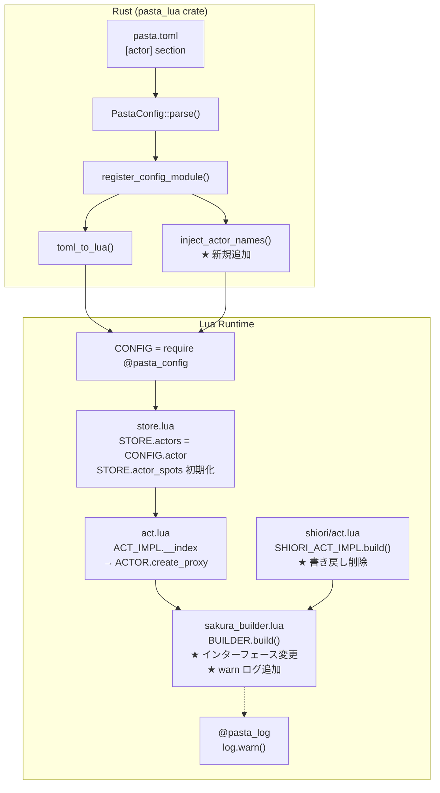
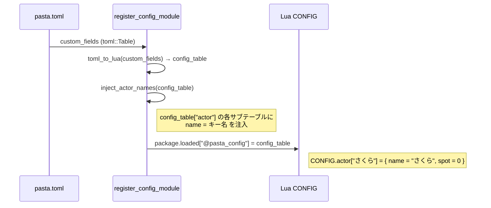
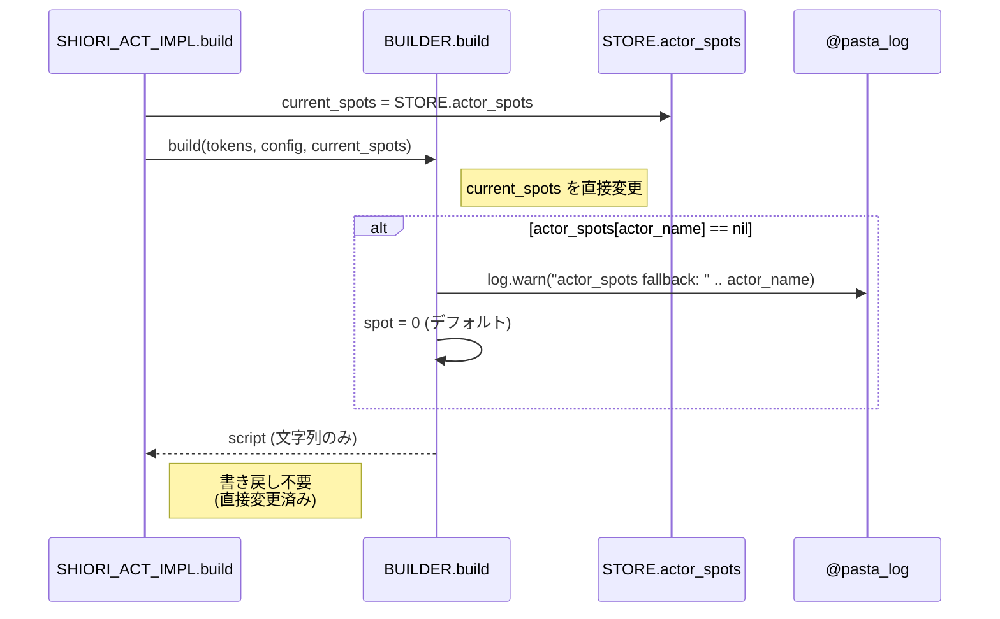

# Technical Design: co-exec-actor-init

## Overview

**Purpose**: CONFIG由来アクター（`pasta.toml` の `[actor]` セクション）に `name` フィールドが欠落している問題を修正し、`％` アクター宣言なしシーンでもスコープ継承が正しく動作するようにする。併せて `BUILDER.build` のインターフェースを簡素化し、スコープ未設定アクターに対する診断ログを追加する。

**Users**: ゴースト作者が `％` 行を省略したシーンを記述する際に、イベント経路によらず正しく動作することを保証する。

**Impact**: Rust 側のCONFIG モジュール登録処理に `[actor]` 専用の後処理を追加し、Lua 側の `BUILDER.build` インターフェースを簡素化する。

### Goals

- CONFIG由来アクターに `name` フィールドを注入し、`actor_spots[actor.name]` のルックアップを正常化する
- `BUILDER.build` のシャローコピー＋第2返却値＋書き戻しパターンを廃止し、直接変更方式に移行する
- `actor_spots` フォールバック発動時の warn ログを追加する

### Non-Goals

- `[actor]` 以外のCONFIGセクションへの `name` 注入汎用化
- `ACTOR.get_or_create` や `store.lua` の正規化ロジック追加（Rust 側で解決するため不要）
- `％` 関連のパーサー変更

## Architecture

### Existing Architecture Analysis

現行のアクターデータフローは以下の通り：

```
pasta.toml [actor."さくら"] spot=0
  → Rust: PastaConfig::parse()
    → custom_fields["actor"]["さくら"] = { spot: 0 }
  → Rust: register_config_module() → toml_to_lua()
    → Lua: CONFIG.actor["さくら"] = { spot = 0 }  ← name 欠落
  → Lua: store.lua
    → STORE.actors = CONFIG.actor  (直接参照共有)
    → STORE.actor_spots["さくら"] = 0
  → Lua: act.lua ACT_IMPL.__index
    → self.actors["さくら"] → { spot = 0 }  ← name = nil
    → ACTOR.create_proxy({ spot = 0 }, act)
  → Lua: BUILDER.build
    → actor.name → nil
    → actor_spots[nil] or 0 → 0  ← STORE.actor_spots["さくら"] 参照不可
```

**維持すべきパターン**:
- `STORE.actors = CONFIG.actor` の直接参照共有
- `STORE.actor_spots` の初期化ロジック（`store.lua` L88-92）
- `scope_gen.rs` の `％` 行コード生成（変更不要）

### Architecture Pattern & Boundary Map



**Architecture Integration**:
- **Selected pattern**: データソース修正 — Rust 側で正しいデータ構造を生成し、Lua 側のワークアラウンドを不要にする
- **Domain/feature boundaries**: Rust 側は CONFIG データ構築、Lua 側はランタイム利用。境界は `@pasta_config` モジュール
- **Existing patterns preserved**: `toml_to_lua` 汎用関数は変更しない。`[actor]` 固有の後処理として分離
- **Steering compliance**: Pure Virtual Workspace 構成、`pasta_lua` クレート内で完結

### Technology Stack

| Layer | Choice / Version | Role in Feature | Notes |
|-------|------------------|-----------------|-------|
| Backend | Rust 2024 / mlua 0.11 | `register_config_module` でname注入 | `toml_to_lua` は変更しない |
| Runtime | Lua 5.5 | `BUILDER.build` 簡素化 + warn ログ | `@pasta_log` 既存モジュール利用 |
| Testing | Rust `#[test]` / insta | 既存テスト更新 + 新規テスト追加 | `config_actors_initialization_test.rs` |
| Testing | lua_test | `sakura_builder_test.lua` 大規模更新 | 第2返却値検証テスト → 直接変更検証へ書き換え・「純粋関数性」テスト削除（後述）|

## System Flows

### name 注入フロー（修正後）



### BUILDER.build フロー（修正後）



## Requirements Traceability

| Requirement | Summary | Components | Interfaces | Flows |
|-------------|---------|------------|------------|-------|
| 1.1 | スコープ継承 | module_registry.rs, sakura_builder.lua | inject_actor_names | name注入フロー |
| 1.2 | 初期スコープ適用 | store.lua (既存) | — | 既存で充足 |
| 1.3 | `％` あり既存動作維持 | scope_gen.rs (既存) | — | 変更なし |
| 1.4 | イベント経路非依存 | module_registry.rs | inject_actor_names | name注入フロー |
| 1.5 | 有効プロキシ返却 | module_registry.rs | inject_actor_names | name注入フロー |
| 2.1 | フォールバック warn ログ | sakura_builder.lua | @pasta_log | BUILDER.buildフロー |
| 2.2 | `％` 省略は合法 | scope_gen.rs (既存) | — | 変更なし |

## Components and Interfaces

| Component | Domain/Layer | Intent | Req Coverage | Key Dependencies | Contracts |
|-----------|-------------|--------|--------------|------------------|-----------|
| module_registry.rs | Rust/Runtime | `[actor]` サブテーブルに `name` 注入 | 1.1, 1.4, 1.5 | mlua (P0) | Service |
| sakura_builder.lua | Lua/SHIORI | インターフェース簡素化 + warn ログ | 1.1, 2.1 | @pasta_log (P1) | Service |
| shiori/act.lua | Lua/SHIORI | 書き戻し処理削除 | 1.1 | sakura_builder (P0) | Service |
| sakura_builder.lua (sample ghost copy) | Lua/SHIORI | `pasta_sample_ghost` 同期更新 | 1.1, 2.1 | — | Sync |
| shiori/act.lua (sample ghost copy) | Lua/SHIORI | `pasta_sample_ghost` 同期更新 | 1.1 | — | Sync |

> **注**: `crates/pasta_sample_ghost/ghosts/hello-pasta/ghost/master/scripts/pasta/shiori/` に `sakura_builder.lua` と `act.lua` の独立コピーが存在する。`pasta_lua/scripts/` と同一の変更を適用する必要がある（build.rs はファイルを自動コピーしない）。

### Rust 層

#### module_registry.rs — `inject_actor_names`

| Field | Detail |
|-------|--------|
| Intent | `register_config_module` 内で `[actor]` サブテーブルに `name` フィールドを注入する |
| Requirements | 1.1, 1.4, 1.5 |

**Responsibilities & Constraints**
- `toml_to_lua` 変換後の `config_table` に対して後処理を行う
- `config_table["actor"]` がテーブルの場合のみ処理する
- 各サブテーブル（`config_table["actor"][key]`）がテーブルの場合、`name = key` を設定する
- `toml_to_lua` 関数自体は変更しない（汎用関数の責務分離）

**Dependencies**
- Inbound: `register_config_module` — 呼び出し元 (P0)
- Outbound: Lua CONFIG テーブル — 変換結果の格納先 (P0)

**Contracts**: Service [x]

##### Service Interface

```rust
// register_config_module 内に追加する内部ロジック（独立関数としてもインライン実装としても可）
// config_table: toml_to_lua で生成済みの Lua テーブル
fn inject_actor_names(lua: &Lua, config_table: &Table) -> LuaResult<()>;
```

- **Preconditions**: `config_table` は `toml_to_lua` で正常に生成されたテーブル
- **Postconditions**: `config_table["actor"]` 配下の各サブテーブルに `name` フィールドが設定される。既存の `name` フィールドがあっても **キー名で上書きする**（TOML キーが正規のアクター名として権威的）。`name` 以外の既存フィールドは保持される
- **Invariants**: `config_table["actor"]` が存在しない場合、またはテーブルでない場合は何もしない

### Lua 層

#### sakura_builder.lua — `BUILDER.build` 簡素化

| Field | Detail |
|-------|--------|
| Intent | シャローコピー廃止・直接変更・スクリプトのみ返却・フォールバック warn ログ |
| Requirements | 1.1, 2.1 |

**Responsibilities & Constraints**
- `input_actor_spots` を直接変更する（コピーを作成しない）
- 返却値はスクリプト文字列のみ（第2返却値 `actor_spots` を削除）
- `actor_spots[actor_name]` が `nil` の場合、`@pasta_log` の `warn` でログ出力後にデフォルト値 `0` を使用
- `input_actor_spots` が `nil` の場合は空テーブルを新規作成（既存動作維持）

**Dependencies**
- Inbound: `shiori/act.lua` SHIORI_ACT_IMPL.build — 呼び出し元 (P0)
- Outbound: `@pasta_log` — warn ログ出力 (P1)
- Outbound: `@pasta_sakura_script` — talk_to_script 変換 (P0)

**Contracts**: Service [x]

##### Service Interface

```lua
--- 変更後のシグネチャ
--- @param grouped_tokens table[] グループ化されたトークン配列
--- @param config BuildConfig|nil 設定
--- @param input_actor_spots table<string, integer>|nil アクターごとのスポット位置マップ（直接変更される）
--- @return string さくらスクリプト文字列（\e終端）
function BUILDER.build(grouped_tokens, config, input_actor_spots)
```

- **Preconditions**: `grouped_tokens` は `group_by_actor` + `merge_consecutive_talks` で生成されたトークン配列
- **Postconditions**: `input_actor_spots` が直接変更される。`spot` / `clear_spot` トークンに応じてエントリが更新・クリアされる
- **Invariants**: `input_actor_spots` が `nil` の場合、内部で空テーブルを作成し使用する（外部への影響なし）

#### shiori/act.lua — `SHIORI_ACT_IMPL.build` 書き戻し削除

| Field | Detail |
|-------|--------|
| Intent | `BUILDER.build` の直接変更方式に合わせて書き戻し処理を削除する |
| Requirements | 1.1 |

**Responsibilities & Constraints**
- `BUILDER.build` の返却値を `script` のみで受け取る
- `STORE.actor_spots` への書き戻し処理（`if updated_spots then STORE.actor_spots = updated_spots end`）を削除する
- `STORE.actor_spots` を直接 `BUILDER.build` に渡す（直接変更されるため書き戻し不要）

**Dependencies**
- Inbound: SHIORI イベントハンドラ — build 呼び出し (P0)
- Outbound: `BUILDER.build` — さくらスクリプト生成 (P0)
- Outbound: `STORE.actor_spots` — スコープ状態参照 (P0)

**Contracts**: Service [x]

##### Service Interface

```lua
--- 変更後
function SHIORI_ACT_IMPL.build(self)
    local token = ACT.IMPL.build(self)
    if token == nil then return nil end
    local script = BUILDER.build(token, {
        spot_newlines = self._spot_newlines
    }, STORE.actor_spots)
    return script
end
```

- **Preconditions**: `self` は有効な SHIORI_ACT オブジェクト
- **Postconditions**: `STORE.actor_spots` は `BUILDER.build` 内で直接更新される
- **Invariants**: `token` が `nil` の場合は `nil` を返す（既存動作維持）

## テスト更新計画

### `sakura_builder_test.lua` — 変更の影響と対応

`BUILDER.build` のインターフェース変更（直接変更方式、第2返却値削除）により、テストの大規模更新が必要。

#### 削除するテスト

| テスト名 | 削除理由 |
|---------|----------|
| `入力テーブルがclear_spotで変更されないことを確認` | 「純粋関数性」を明示検証するテスト。直接変更方式への移行により動作が逆転するため削除 |

#### 書き換えるテスト（`updated_spots` → `input_spots` 直接参照）

以下のテストは `local result, updated_spots = BUILDER.build(...)` パターンで第2返却値を検証している。
直接変更方式では第2返却値が存在しないため、`updated_spots` の参照を `input_spots`（渡したテーブル自体）に変更する。

| テスト名 | 変更点 |
|---------|--------|
| `第2戻り値としてactor_spotsテーブルが返されることを確認` | `updated_spots["さくら"]` → `input_spots["さくら"]`、第2返却値の型チェック削除 |
| `後方互換性: actor_spots省略時も正常動作` | `type(updated_spots)` チェック削除。`nil` 入力時は内部で空テーブル生成（外部から検証不可）→ result の内容のみ検証 |
| `clear_spotトークンで入力のactor_spotsがリセットされる` | `updated_spots` → `input_spots` に変更。クリア後 `input_spots["さくら"] == nil` を検証 |
| `spotトークンで入力のactor_spotsが正しく更新される` | `updated_spots` → `input_spots` |
| `入力actor_spotsの値を引き継いでスポットタグが出力される` | `updated_spots` → `input_spots` |
| `nilを渡した場合のactor_spots動作確認` | `type(updated_spots):toBe("table")` 削除。result の `\p[0]` 含有のみ検証 |

#### 追加するテスト

| テスト名 | 目的 |
|---------|------|
| `直接変更: clear_spotで入力テーブルのエントリがクリアされる` | 直接変更方式の確認（旧「純粋関数性」テストの逆） |

---

## Data Models

### Domain Model

変更対象のデータ構造（修正前後の対比）:

| データ | 修正前 | 修正後 |
|--------|--------|--------|
| `CONFIG.actor["さくら"]` | `{ spot = 0 }` | `{ name = "さくら", spot = 0 }` |
| `STORE.actors` | `CONFIG.actor` と同一参照 | 同上（参照共有のため自動反映） |
| `BUILDER.build` 返却値 | `(script, actor_spots)` | `script` のみ |
| `BUILDER.build` の `input_actor_spots` | コピーして使用 | 直接変更 |
