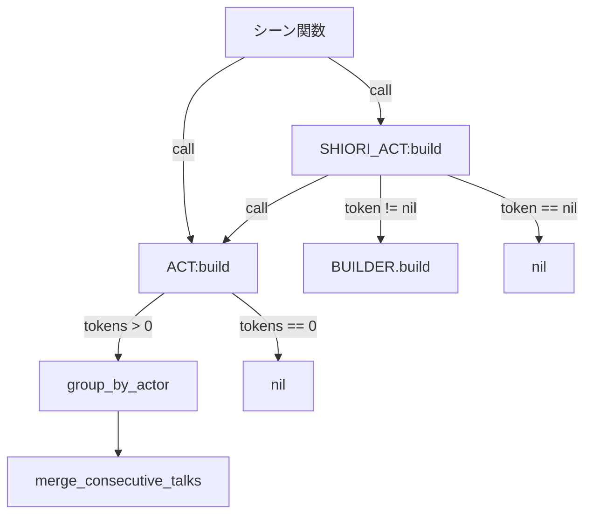
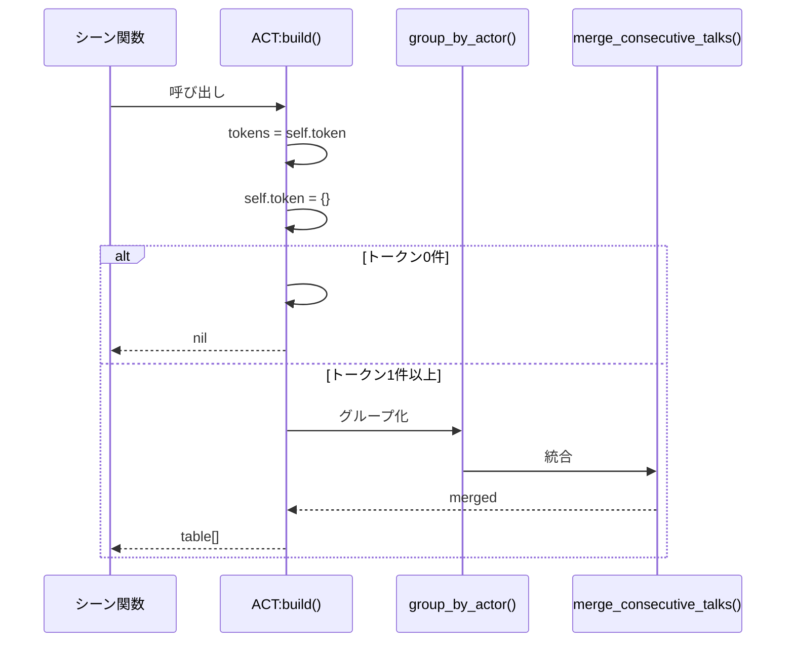
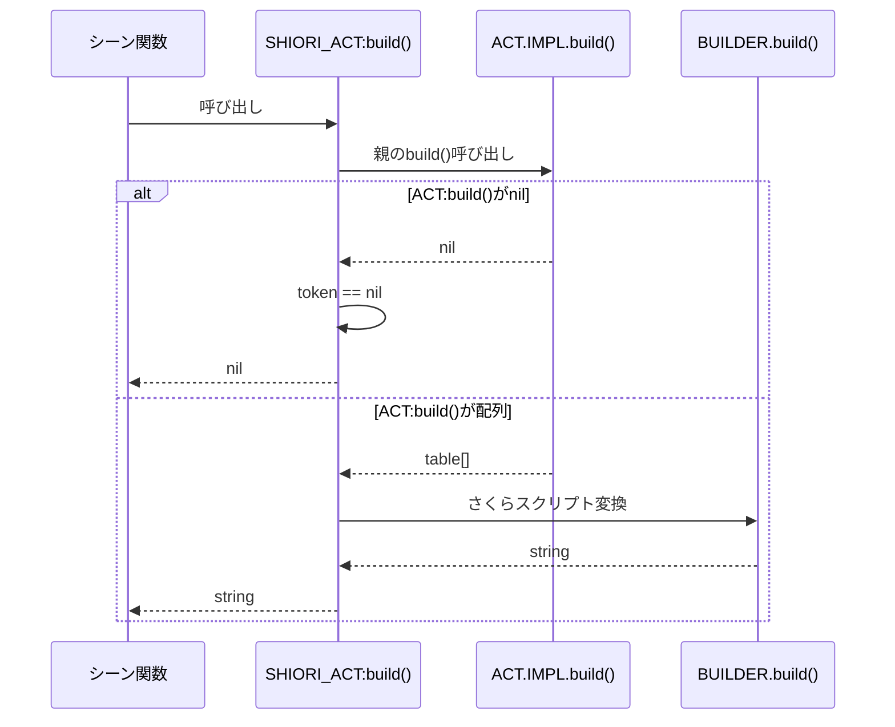

# 設計書: act-build-early-return

## Overview

本機能は、ACT:build()とSHIORI_ACT:build()に早期リターンパターンを導入し、撮影トークンが0件の場合にnilを返すことで、会話未作成の検出とパフォーマンス最適化を実現します。

**目的**: 撮影トークン0件時に不要なグループ化処理・さくらスクリプト生成をスキップし、シーン関数内部で会話未作成を検出可能にする。

**ユーザー**: シーン作者（Pastaスクリプト開発者）が、act:build()の戻り値がnilとなる可能性を考慮してシーン関数を実装できるようになります。

**影響**: 既存のbuild()メソッドの戻り値型が`table[]` → `table[]|nil`、`string` → `string|nil`に変更されます。実質的な後方互換性リスクはテストリグレッションのみ（build()呼び出しロジックが未実装のため）。

### Goals
- 撮影トークン0件時にACT:build()がnilを返す
- ACT:build()がnilを返した場合、SHIORI_ACT:build()もnilを返す
- 型アノテーション（LuaLS形式）を更新し、型安全性を確保
- 既存テストケースの互換性を維持しつつ、新規テストケースを追加

### Non-Goals
- イベントハンドラ（OnTalk/OnHour）のnil処理実装（イベントハンドラはコルーチンを返すのみでbuild()を呼ばない）
- シーン関数内のnil処理実装（シーン作者の責任、設計ガイドラインとして記載）
- パフォーマンスベンチマーク（実装時のパフォーマンステストで確認）

## Architecture

### Existing Architecture Analysis

**現在のアーキテクチャパターン:**
- ACT_IMPL.build(): トークン取得 → グループ化（group_by_actor） → 統合（merge_consecutive_talks） → 返却
- SHIORI_ACT_IMPL.build(): ACT.IMPL.build()呼び出し → BUILDER.build()でさくらスクリプト変換 → 返却
- 既存の戻り値型: `table[]`（ACT）、`string`（SHIORI_ACT）

**保持すべきパターン:**
- ドット構文 + 明示的self（`function IMPL.method(self, arg)`）
- LuaLS形式の型アノテーション（`--- @return type`）
- トークンリセットの一貫性維持（`self.token = {}`）

**技術的制約:**
- Lua 5.5（mlua 0.11）の型システム制約
- LuaLSの型チェック機能の活用
- 既存テストケース（act_test.lua: 20件以上、shiori_act_test.lua: 22件）の互換性

### Architecture Pattern & Boundary Map

**選択パターン**: Extension（既存コンポーネント拡張）

**ドメイン/機能境界:**


**統合判断:**
- 既存パターン保持: ACT_IMPL.build()とSHIORI_ACT_IMPL.build()に早期リターンロジック追加
- 新規コンポーネント不要: 既存メソッドの拡張で要件達成可能
- ステアリング準拠: Single Responsibility Principle維持（早期リターンは責務に含まれる）

### Technology Stack

| Layer       | Choice / Version    | Role in Feature            | Notes                              |
| ----------- | ------------------- | -------------------------- | ---------------------------------- |
| Runtime     | Lua 5.5 (mlua 0.11) | スクリプト実行環境         | 既存環境、変更なし                 |
| Type System | LuaLS               | 型アノテーション・静的解析 | `table[]                           | nil`, `string | nil`形式で型安全性確保 |
| Testing     | lua_test (BDD)      | テストフレームワーク       | 既存テスト継続パス、新規テスト追加 |

## System Flows

### ACT:build()早期リターンフロー



### SHIORI_ACT:build()早期リターンフロー



**フロー判断:**
- トークン0件判定は`#self.token == 0`で実施（R1要件）
- nil検証は`== nil`で明示的に実施（R2要件、Lua型システム制約対応）

## Requirements Traceability

| Requirement | Summary                        | Components                                | Interfaces           | Flows                        |
| ----------- | ------------------------------ | ----------------------------------------- | -------------------- | ---------------------------- |
| 1.1 (R1)    | ACT:build()早期リターン        | ACT_IMPL.build()                          | build()              | ACT早期リターンフロー        |
| 1.2 (R2)    | SHIORI_ACT:build()早期リターン | SHIORI_ACT_IMPL.build()                   | build()              | SHIORI_ACT早期リターンフロー |
| 1.3 (R3)    | 会話未作成検出可能性           | -                                         | 型アノテーション更新 | -                            |
| 2.1 (NFR1)  | パフォーマンス最適化           | ACT_IMPL.build(), SHIORI_ACT_IMPL.build() | -                    | 早期リターンによるスキップ   |
| 2.2 (NFR2)  | テストリグレッション対応       | -                                         | -                    | -                            |

## Components and Interfaces

### Summary

| Component               | Domain/Layer      | Intent                       | Req Coverage | Key Dependencies (P0/P1)                          | Contracts |
| ----------------------- | ----------------- | ---------------------------- | ------------ | ------------------------------------------------- | --------- |
| ACT_IMPL.build()        | Runtime/Act       | 撮影トークン取得・グループ化 | 1.1, 2.1     | group_by_actor (P1), merge_consecutive_talks (P1) | Service   |
| SHIORI_ACT_IMPL.build() | Runtime/ShioriAct | さくらスクリプト生成         | 1.2, 2.1     | ACT.IMPL.build (P0), BUILDER.build (P1)           | Service   |

### Runtime/Act

#### ACT_IMPL.build()

| Field        | Detail                                             |
| ------------ | -------------------------------------------------- |
| Intent       | 撮影トークンのグループ化・統合、0件時はnilリターン |
| Requirements | 1.1, 2.1                                           |

**Responsibilities & Constraints**
- 撮影トークン（self.token）の取得・リセット
- トークン0件時にnilリターン（早期リターン）
- トークン1件以上時はグループ化・統合処理を実行
- トランザクションスコープ: self.tokenの状態管理（リセットの一貫性維持）

**Dependencies**
- Inbound: なし（パブリックAPI）
- Outbound: group_by_actor() — アクター切り替え境界でグループ化 (P1)
- Outbound: merge_consecutive_talks() — 連続talkを統合 (P1)

**Contracts**: [x] Service [ ] API [ ] Event [ ] Batch [ ] State

##### Service Interface
```lua
--- トークン取得とリセット（グループ化・統合済み）
--- @param self Act アクションオブジェクト
--- @return table[]|nil グループ化されたトークン配列、またはnil
function ACT_IMPL.build(self)
```

**Preconditions:**
- `self.token`が有効なテーブルであること

**Postconditions:**
- `self.token`が空テーブル`{}`にリセットされること
- トークン0件時はnilを返す
- トークン1件以上時はグループ化・統合されたテーブル配列を返す

**Invariants:**
- `self.token`は常にテーブル型を維持（nilにならない）

**Implementation Notes**
- **Integration**: 既存のbuild()メソッドに3行追加のみ（`if #tokens == 0 then return nil end`）
- **Validation**: トークン数判定条件は`#tokens == 0`（R1要件）
- **Risks**: 既存テストケース（act_test.lua: L438等）がtable[]前提のため、リグレッション確認必要（NFR2）

### Runtime/ShioriAct

#### SHIORI_ACT_IMPL.build()

| Field        | Detail                                                         |
| ------------ | -------------------------------------------------------------- |
| Intent       | ACT:build()の結果をさくらスクリプトに変換、nil時は早期リターン |
| Requirements | 1.2, 2.1                                                       |

**Responsibilities & Constraints**
- 親のACT.IMPL.build()呼び出し
- ACT:build()がnilを返した場合、BUILDER.build()をスキップしてnilリターン
- ACT:build()が配列を返した場合、BUILDER.build()でさくらスクリプト変換
- トランザクションスコープ: ACT:build()の結果に依存（状態管理なし）

**Dependencies**
- Inbound: なし（パブリックAPI）
- Outbound: ACT.IMPL.build() — 撮影トークン取得 (P0)
- Outbound: BUILDER.build() — さくらスクリプト変換 (P1)

**Contracts**: [x] Service [ ] API [ ] Event [ ] Batch [ ] State

##### Service Interface
```lua
--- build()オーバーライド: さくらスクリプト生成
--- 親のbuild()でトークン取得＆リセット後、sakura_builderで変換
--- @param self ShioriAct アクションオブジェクト
--- @return string|nil さくらスクリプト文字列、またはnil
function SHIORI_ACT_IMPL.build(self)
```

**Preconditions:**
- `self`がShioriActオブジェクトであること

**Postconditions:**
- ACT.IMPL.build()がnilを返した場合、nilを返す
- ACT.IMPL.build()が配列を返した場合、さくらスクリプト文字列を返す
- BUILDER.build()はtoken != nilの場合のみ呼び出される（NFR1: パフォーマンス最適化）

**Invariants:**
- ACT.IMPL.build()の呼び出しは必ず実施される（状態リセットのため）

**Implementation Notes**
- **Integration**: 既存のbuild()メソッドに3行追加（`if token == nil then return nil end`）
- **Validation**: nil検証は`== nil`で明示的に実施（R2要件、Lua型システム制約対応）
- **Risks**: 既存テストケース（shiori_act_test.lua: L70-380）がstring前提のため、リグレッション確認必要（NFR2）

## Data Models

本機能はデータモデルの変更を伴わないため、このセクションは省略します。

## Testing Strategy

### Unit Tests

**act_test.lua（新規追加）:**
```lua
describe("ACT - build() nil return", function()
    test("トークン0件時にnilを返す", function()
        local ACT = require("pasta.act")
        local act = ACT.new({})
        
        local result = act:build()
        
        expect(result):toBe(nil)
    end)
    
    test("nilリターン後にself.tokenが空テーブルである", function()
        local ACT = require("pasta.act")
        local act = ACT.new({})
        
        local _ = act:build()
        
        expect(type(act.token)):toBe("table")
        expect(#act.token):toBe(0)
    end)
end)
```

**shiori_act_test.lua（新規追加）:**
```lua
describe("SHIORI_ACT - build() nil return", function()
    test("ACT:build()がnilを返した場合、nilを返す", function()
        local SHIORI_ACT = require("pasta.shiori.act")
        local act = SHIORI_ACT.new({})
        
        local result = act:build()
        
        expect(result):toBe(nil)
    end)
    
    test("BUILDER.build()がnilリターン時に呼び出されない", function()
        -- パフォーマンステストで確認（AC2）
        -- BUILDER.build()のモックまたは呼び出し回数カウントで検証
    end)
end)
```

### Integration Tests

**既存テストの互換性確認（AC4）:**
- act_test.lua: L410-442の既存テストケースが引き続きパス（トークンありケース）
- shiori_act_test.lua: L70-380の既存テストケースが引き続きパス（トークンありケース）
- cargo test --workspace実行でリグレッション検出

### Acceptance Criteria Mapping

| AC  | Test Type   | Test Location               | Coverage                                                                         |
| --- | ----------- | --------------------------- | -------------------------------------------------------------------------------- |
| AC1 | Unit        | act_test.lua（新規）        | トークン0件時nilリターン、トークン1件以上時table[]リターン、self.tokenリセット   |
| AC2 | Unit        | shiori_act_test.lua（新規） | ACT:build()がnil時nilリターン、配列時stringリターン、BUILDER.build()スキップ確認 |
| AC3 | Static      | LuaLS型チェック             | @return型アノテーション検証（`table[]                                            | nil`, `string | nil`） |
| AC4 | Integration | 既存テスト全件              | 既存テストケースが引き続きパス                                                   |
| AC5 | Doc         | init.lua:40                 | ドキュメント例でnil処理パターン記載                                              |

## Error Handling

### Error Scenarios

**シーン関数でnil非対応のコードがある場合:**
- 現象: `local script = act:build(); script:match(...)`でnil連結エラー
- 責任: シーン作者の責任（本機能のスコープ外）
- 緩和策: init.lua:40のドキュメント例でnil処理パターンを示す（AC5）

**型アノテーション更新漏れ:**
- 現象: LuaLS型チェックでエラー検出されない
- 検証: AC3でACT_IMPL.build()とSHIORI_ACT_IMPL.build()の両方を確認

## Performance Considerations

### Optimization Strategy

**早期リターンによる処理スキップ（NFR1）:**
- トークン0件時にスキップされる処理:
  1. group_by_actor() — アクター切り替え境界でグループ化
  2. merge_consecutive_talks() — 連続talkを統合
  3. BUILDER.build() — さくらスクリプト生成

**パフォーマンステスト（実装時）:**
- トークン0件時のbuild()実行時間を測定
- BUILDER.build()呼び出し回数をカウント（AC2）
- ベンチマーク結果はresearch.mdに記録

## Security Considerations

本機能はセキュリティ要件に直接関与しません。既存のセキュリティポリシーを維持します。

## Migration & Rollout

### Migration Path

**型アノテーション更新のみ（コード変更なし）:**
- 既存のbuild()呼び出しコードは変更不要（トークンありケースは既存動作維持）
- シーン作者は将来的にnil処理を考慮することが推奨される（設計ガイドライン）

### Rollback Strategy

**実装内容が最小限のため、ロールバック容易:**
- 早期リターン条件（`if #tokens == 0 then return nil end`）を削除
- 型アノテーション（`|nil`）を削除
- 既存テストが引き続きパス（トークンありケース）

## Documentation Updates

### Code Documentation

**act.lua（L281）:**
```lua
--- トークン取得とリセット（グループ化・統合済み）
--- @param self Act アクションオブジェクト
--- @return table[]|nil グループ化されたトークン配列、トークン0件時はnil
function ACT_IMPL.build(self)
```

**shiori/act.lua（L55-56）:**
```lua
--- build()オーバーライド: さくらスクリプト生成
--- 親のbuild()でトークン取得＆リセット後、sakura_builderで変換
--- @param self ShioriAct アクションオブジェクト
--- @return string|nil さくらスクリプト文字列、トークン0件時はnil
function SHIORI_ACT_IMPL.build(self)
```

### User Documentation

**init.lua（L40ドキュメント例更新）:**
```lua
--- 使用例（ハンドラ登録）:
--- ```lua
--- local REG = require("pasta.shiori.event.register")
--- local RES = require("pasta.shiori.res")
---
--- REG.OnBoot = function(act)
---     act.sakura:talk("こんにちは")
---     local script = act:build()
---     
---     -- nil処理（トークン0件時）
---     if script == nil then
---         return RES.no_content()  -- 204 No Content
---     end
---     
---     return RES.ok(script)
--- end
--- ```
```

## Open Questions / Risks

### Open Questions
なし（設計判断は全て完了、research.mdで記録済み）

### Risks
1. **既存テストケースのリグレッション**: 実装前にcargo test --workspace実行、新規テストケース追加でカバレッジ維持
2. **シーン関数でnil非対応のコードがクラッシュ**: ドキュメント（init.lua:40）でnil処理例を示し、将来的な設計ガイドラインとして記載（AC5）
3. **型アノテーション更新漏れ**: ACT_IMPL.build()とSHIORI_ACT_IMPL.build()の両方を確認、AC3でテスト
