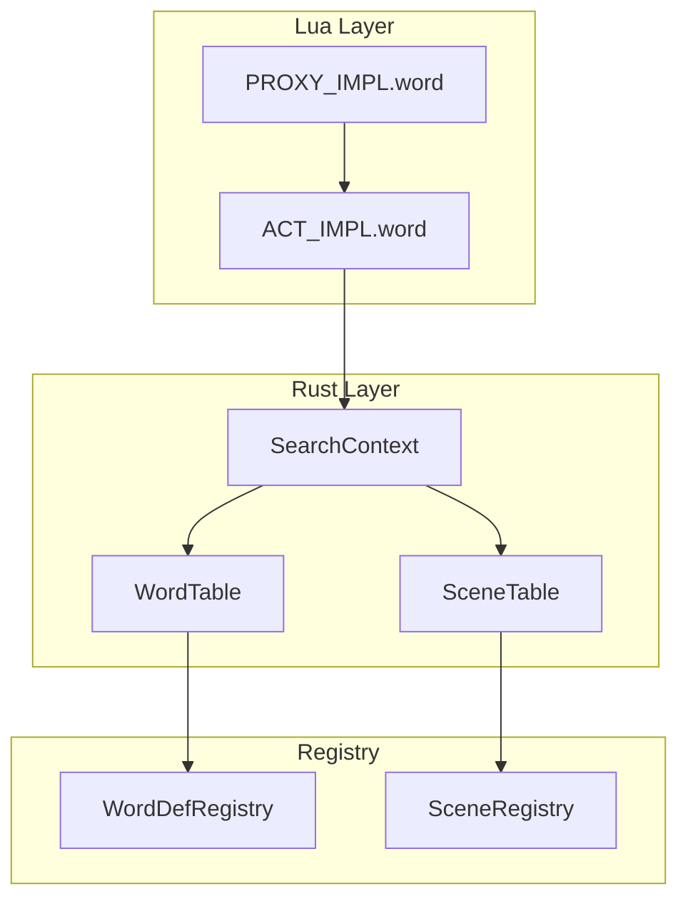
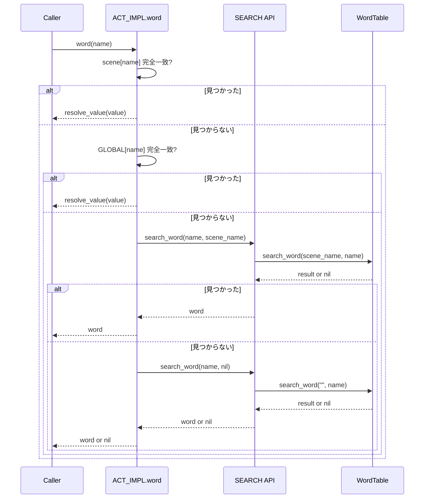
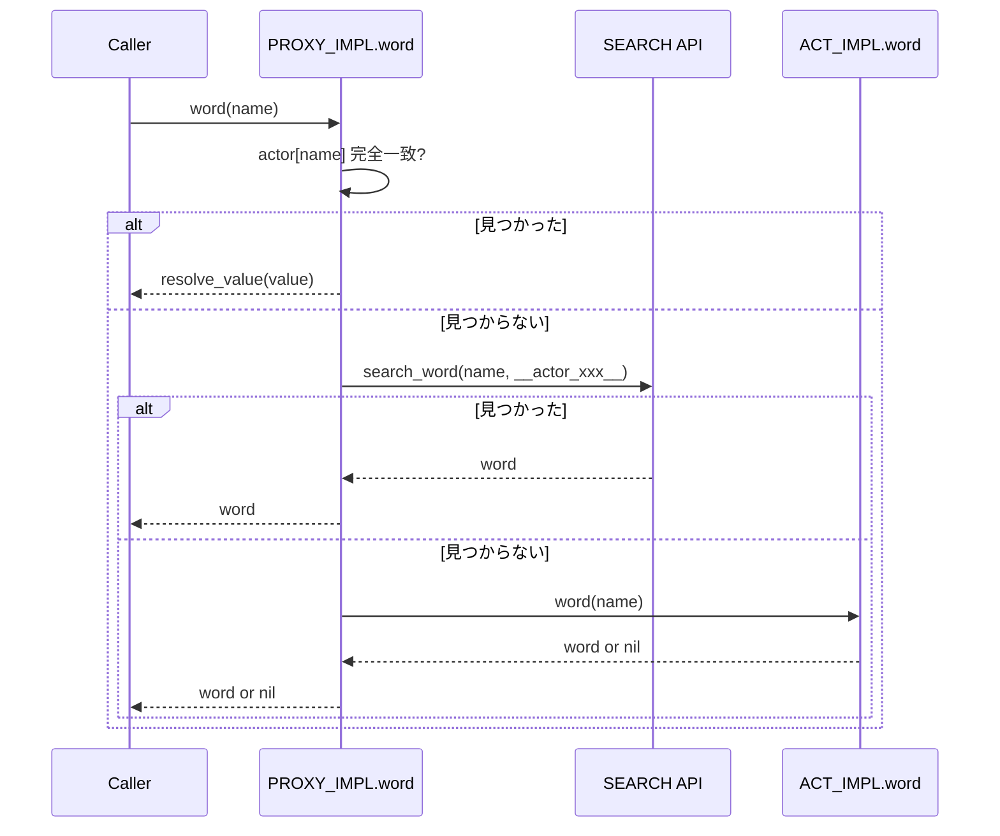

# Technical Design Document

## Overview

**Purpose**: 本機能は、PASTAスクリプトエンジンにおける単語・シーン検索アーキテクチャを整理し、検索責務をRust側に統一する。

**Users**: PASTAスクリプト開発者が `act:word(name)` および `proxy:word(name)` を使用して単語検索を行う際、一貫した動作と高いパフォーマンスを得られる。

**Impact**: Rust側の自動フォールバック仕様を廃止し、Lua側で個別スコープ指定によるフォールバック制御に変更。既存の `PROXY_IMPL.word()` 内Lua検索ロジックを削除。

### Goals
- Rust側の自動フォールバック（ローカル→グローバル）を廃止
- Lua側でスコープ明示指定による検索API呼び出し
- アクター単語辞書のRust側収集を追加
- 後方互換性の維持

### Non-Goals
- `search_scene` APIの大幅な機能追加
- 新しい単語スコープの追加（ファイルレベル等）
- パフォーマンス最適化（キャッシュ戦略変更等）

---

## Architecture

### Existing Architecture Analysis

**現在のアーキテクチャパターン:**
- Rust側 (`WordTable`, `SceneTable`) が検索・シャッフル・キャッシュを担当
- Lua側 (`PROXY_IMPL.word`) に重複した検索ロジック（`search_prefix_lua`, `math.random`）が存在
- `finalize.rs` でLua側レジストリをRust側に収集

**問題点:**
- Rust側 `collect_*_candidates()` が自動フォールバックを実装
- アクター辞書検索時にグローバルへの意図しないフォールバックが発生
- Lua側とRust側で検索ロジックが重複

### Architecture Pattern & Boundary Map



**Architecture Integration:**
- 選択パターン: Lua側フォールバック制御（Option A）
- ドメイン境界: Lua側は完全一致検索とフォールバック制御、Rust側は前方一致検索・シャッフル・キャッシュ
- 既存パターン維持: `@pasta_search` モジュールによるLua-Rust FFI
- Steering準拠: `tech.md` の責務分離原則に従う

### Technology Stack

| Layer     | Choice / Version    | Role in Feature          | Notes              |
| --------- | ------------------- | ------------------------ | ------------------ |
| Backend   | Rust 2024 edition   | WordTable/SceneTable修正 | フォールバック廃止 |
| Scripting | Lua 5.4 (mlua 0.10) | ACT_IMPL/PROXY_IMPL修正  | フォールバック制御 |
| Registry  | pasta_core          | WordDefRegistry          | アクター辞書登録   |

---

## System Flows

### act:word(name) 検索フロー



### proxy:word(name) 検索フロー



---

## Requirements Traceability

| Requirement | Summary                         | Components  | Interfaces                         | Flows             |
| ----------- | ------------------------------- | ----------- | ---------------------------------- | ----------------- |
| 1.1-1.4     | search_word フォールバック廃止  | WordTable   | collect_word_candidates            | -                 |
| 1.5-1.8     | search_scene フォールバック廃止 | SceneTable  | collect_scene_candidates           | -                 |
| 2.1-2.7     | ACT_IMPL.word 実装              | act.lua     | ACT_IMPL.word                      | act:word フロー   |
| 3.1-3.9     | PROXY_IMPL.word 修正            | actor.lua   | PROXY_IMPL.word                    | proxy:word フロー |
| 4.1-4.2     | アクター辞書収集                | finalize.rs | collect_words, build_word_registry | -                 |
| 5.1-5.6     | WORD.resolve_value() 実装       | word.lua    | WORD.resolve_value                 | -                 |
| 6.1-6.3     | 後方互換性                      | 全体        | -                                  | -                 |

---

## Components and Interfaces

### Summary

| Component          | Domain/Layer        | Intent                       | Req Coverage | Key Dependencies           | Contracts |
| ------------------ | ------------------- | ---------------------------- | ------------ | -------------------------- | --------- |
| WordTable          | pasta_core/Registry | 単語前方一致検索             | 1.1-1.4      | RadixMap (P0)              | Service   |
| SceneTable         | pasta_core/Registry | シーン前方一致検索           | 1.5-1.8      | RadixMap (P0)              | Service   |
| ACT_IMPL.word      | pasta_lua/Lua       | 単語検索（シーンスコープ）   | 2.1-2.7      | SEARCH (P0), GLOBAL (P1)   | -         |
| PROXY_IMPL.word    | pasta_lua/Lua       | 単語検索（アクタースコープ） | 3.1-3.9      | SEARCH (P0), ACT_IMPL (P0) | -         |
| finalize.rs        | pasta_lua/Runtime   | Lua→Rust辞書収集             | 4.1-4.2      | WordDefRegistry (P0)       | -         |
| WORD.resolve_value | pasta_lua/Lua       | 完全一致検索時の値解決       | 5.1-5.6      | -                          | Service   |

---

### pasta_core/Registry

#### WordTable

| Field        | Detail                                         |
| ------------ | ---------------------------------------------- |
| Intent       | 単語の前方一致検索、シャッフル、キャッシュ管理 |
| Requirements | 1.1, 1.2, 1.3, 1.4                             |

**Responsibilities & Constraints**
- 前方一致検索（RadixMap使用）
- フォールバックなし（スコープ指定に従う）
- 検索結果のシャッフルとキャッシュ

**Dependencies**
- External: fast_radix_trie (P0)

**Contracts**: Service [x]

##### Service Interface

```rust
impl WordTable {
    /// 単語候補を収集（フォールバックなし）
    ///
    /// # Arguments
    /// * `module_name` - 空文字: グローバルのみ、非空: ローカルのみ
    /// * `key` - 検索キー
    ///
    /// # Returns
    /// * `Ok(Vec<String>)` - 候補リスト
    /// * `Err(WordNotFound)` - 候補なし
    pub fn collect_word_candidates(
        &self,
        module_name: &str,
        key: &str,
    ) -> Result<Vec<String>, WordTableError>;
}
```

- Preconditions: `key` が空でないこと
- Postconditions: 
  - `module_name` が空の場合、グローバルエントリのみを返す
  - `module_name` が非空の場合、ローカルエントリのみを返す
  - フォールバックは行わない
- Invariants: キャッシュ状態は検索によって変更されない

**Implementation Notes**
- 既存のフォールバックロジック（Step 2のグローバル検索分岐）を削除
- `module_name` 空の場合: グローバル検索のみ実行
- `module_name` 非空の場合: ローカル検索のみ実行、結果0件でもグローバルにフォールバックしない

---

#### SceneTable

| Field        | Detail                                           |
| ------------ | ------------------------------------------------ |
| Intent       | シーンの前方一致検索、シャッフル、キャッシュ管理 |
| Requirements | 1.5, 1.6, 1.7, 1.8                               |

**Responsibilities & Constraints**
- 前方一致検索（RadixMap使用）
- フォールバックなし（スコープ指定に従う）
- 検索結果のシャッフルとキャッシュ

**Dependencies**
- External: fast_radix_trie (P0)

**Contracts**: Service [x]

##### Service Interface

```rust
impl SceneTable {
    /// シーン候補を収集（フォールバックなし）
    ///
    /// # Arguments
    /// * `module_name` - 空文字: グローバルのみ、非空: ローカルのみ
    /// * `prefix` - 検索プレフィックス
    ///
    /// # Returns
    /// * `Ok(Vec<SceneId>)` - 候補リスト
    /// * `Err(SceneNotFound)` - 候補なし
    /// * `Err(InvalidScene)` - prefix が空
    pub fn collect_scene_candidates(
        &self,
        module_name: &str,
        prefix: &str,
    ) -> Result<Vec<SceneId>, SceneTableError>;
}
```

- Preconditions: `prefix` が空でないこと
- Postconditions:
  - `module_name` が空の場合、グローバルシーンのみを返す
  - `module_name` が非空の場合、ローカルシーンのみを返す
  - フォールバックは行わない
- Invariants: キャッシュ状態は検索によって変更されない

**Implementation Notes**
- 既存のフォールバックロジック（Step 2のグローバル検索分岐）を削除
- WordTableと同様の修正パターン

---

### pasta_lua/Runtime

#### finalize.rs

| Field        | Detail                                |
| ------------ | ------------------------------------- |
| Intent       | Lua側レジストリからRust側への辞書収集 |
| Requirements | 4.1, 4.2                              |

**Responsibilities & Constraints**
- `WORD.get_all_words()` の全スコープ（global, local, actor）を収集
- `WordDefRegistry` への適切なAPI呼び出し

**Dependencies**
- Inbound: Lua pasta.word モジュール (P0)
- Outbound: WordDefRegistry (P0)

**Contracts**: Service [x]

##### Service Interface

```rust
/// アクター単語を含む収集エントリ
pub struct WordCollectionEntry {
    pub key: String,
    pub values: Vec<String>,
    pub is_local: bool,
    pub scene_name: Option<String>,
    pub actor_name: Option<String>,  // 新規追加
}

/// 単語収集（アクター辞書対応）
pub fn collect_words(lua: &Lua) -> LuaResult<Vec<WordCollectionEntry>>;

/// レジストリ構築（アクター辞書対応）
fn build_word_registry(entries: &[WordCollectionEntry]) -> WordDefRegistry;
```

- Preconditions: `pasta.word` モジュールがロード済み
- Postconditions: アクター単語が `register_actor()` で登録される

**Implementation Notes**
- `all_words.actor` の処理を追加（`global`, `local` と同様のパターン）
- `actor_name` フィールドを追加して収集
- `build_word_registry()` で `register_actor()` 呼び出し

---

### pasta_lua/Lua Scripts

#### WORD.resolve_value (word.lua)

| Field        | Detail                                                 |
| ------------ | ------------------------------------------------------ |
| Intent       | 完全一致検索時の値解決（関数実行、配列選択、文字列化） |
| Requirements | 5.1, 5.2, 5.3, 5.4, 5.5, 5.6                           |

**Responsibilities & Constraints**
- 関数値の場合、actを引数として実行
- 配列値の場合、最初の要素を返す
- その他の値は文字列化
- ACT_IMPL.word と PROXY_IMPL.word から共通利用

**Dependencies**
- Outbound: なし

**Contracts**: Service [x]

##### Service Interface

```lua
--- 値を解決（関数なら実行、配列なら最初の要素、その他はそのまま）
--- @param value any 検索結果
--- @param act Act アクションオブジェクト
--- @return any 解決後の値
function WORD.resolve_value(value, act)
    if value == nil then
        return nil
    elseif type(value) == "function" then
        return value(act)
    elseif type(value) == "table" then
        if #value > 0 then
            return value[1]
        end
        return nil
    else
        return tostring(value)
    end
end
```

- Preconditions: なし
- Postconditions:
  - 関数値 → 実行結果
  - 配列値 → `value[1]`
  - その他 → `tostring(value)`
- Invariants: 副作用なし（関数呼び出しを除く）

**Implementation Notes**
- actor.lua の `resolve_value()` ローカル関数を移植
- エクスポート用に WORD テーブルに登録
- ACT_IMPL.word と PROXY_IMPL.word から呼び出し

---

#### ACT_IMPL.word (act.lua)

| Field        | Detail                                         |
| ------------ | ---------------------------------------------- |
| Intent       | シーンスコープの単語検索（フォールバック制御） |
| Requirements | 2.1, 2.2, 2.3, 2.4, 2.5, 2.6, 2.7              |

**Responsibilities & Constraints**
- 完全一致検索（scene, GLOBAL）はLua側で実行
- 前方一致検索はSEARCH API委譲
- フォールバック順序: scene → GLOBAL → SEARCH(local) → SEARCH(global)

**Dependencies**
- Outbound: SEARCH API (P0)
- Outbound: GLOBAL モジュール (P1)

**Implementation Notes**

**Rust側SearchContext APIシグネチャ:**
```rust
pub fn search_word(
    &mut self,
    name: &str,
    global_scene_name: Option<&str>,
) -> Result<Option<String>, SearchError>
```
- Lua側から `nil` → Rust側 `None` にマッピング（mlua自動変換）
- Lua側から文字列 → Rust側 `Some(&str)` にマッピング

**Lua実装例:**
```lua
function ACT_IMPL.word(self, name)
    local WORD = require("pasta.word")

    -- 1. シーンテーブル完全一致
    if self.current_scene and self.current_scene[name] then
        local value = self.current_scene[name]
        return WORD.resolve_value(value, self)
    end

    -- 2. GLOBAL完全一致
    local GLOBAL = require("pasta.global")
    if GLOBAL[name] then
        local value = GLOBAL[name]
        return WORD.resolve_value(value, self)
    end

    -- 3. シーンローカル辞書（前方一致）
    local SEARCH = require("@pasta_search")
    local scene_name = self.current_scene and self.current_scene.__global_name__
    if scene_name then
        local result = SEARCH:search_word(name, scene_name)
        if result then
            return result  -- 既に文字列
        end
    end

    -- 4. グローバル辞書（前方一致）
    local result = SEARCH:search_word(name, nil)
    if result then
        return result  -- 既に文字列
    end

    return nil
end
```

**注**: SEARCH API は文字列を返すため、resolve_value() は不要

---

#### PROXY_IMPL.word (actor.lua)

| Field        | Detail                                     |
| ------------ | ------------------------------------------ |
| Intent       | アクタースコープの単語検索（ACT_IMPL委譲） |
| Requirements | 3.1, 3.2, 3.3, 3.4, 3.5, 3.6, 3.7          |

**Responsibilities & Constraints**
- 完全一致検索（actor）のみLua側で実行
- アクター辞書の前方一致検索はSEARCH API委譲
- シーン・グローバル検索は `act:word()` に委譲
- 削除対象: `search_prefix_lua()`, `math.random`, `WORD.get_*_words()` 呼び出し

**Dependencies**
- Outbound: SEARCH API (P0)
- Outbound: ACT_IMPL.word (P0)

**Implementation Notes**

```lua
function PROXY_IMPL.word(self, name)
    if not name or name == "" then
        return nil
    end

    local WORD = require("pasta.word")

    -- 1. アクター完全一致
    local actor_value = self.actor[name]
    if actor_value ~= nil then
        return WORD.resolve_value(actor_value, self.act)
    end

    -- 2. アクター辞書（前方一致）
    local SEARCH = require("@pasta_search")
    local actor_scope = "__actor_" .. self.actor.name .. "__"
    local result = SEARCH:search_word(name, actor_scope)
    if result then
        return WORD.resolve_value(result, self.act)
    end

    -- 3. act:word() に委譲（シーン→グローバル検索）
    return self.act:word(name)
end
```

**削除対象コード:**
- `search_prefix_lua()` 関数全体
- `resolve_value()` ローカル関数（pasta.word に移動）
- L2-L6 の検索ロジック

---

## Testing Strategy

### Unit Tests
- `WordTable::collect_word_candidates` - グローバルのみ/ローカルのみ検索
- `SceneTable::collect_scene_candidates` - グローバルのみ/ローカルのみ検索
- `finalize::collect_words` - アクター単語収集

### Integration Tests
- `ACT_IMPL.word` - 4レベルフォールバック動作
- `PROXY_IMPL.word` - 3レベルフォールバック動作
- 後方互換性テスト - 既存スクリプトの動作検証

### Existing Test Modifications

**フォールバック関連テスト（新仕様に修正）:**

1. `test_collect_word_candidates_fallback_to_global`
   - **旧**: ローカル検索失敗時、グローバルにフォールバック
   - **新**: `module_name="別のモジュール"` でグローバルのみ検索してエラー確認
   - **削除**: このテストは削除し、新規に `test_collect_word_candidates_global_only` 追加

2. `test_collect_word_candidates_local_takes_priority`
   - **旧**: ローカル検索成功時、グローバルを含まない
   - **新**: `module_name="会話_1"` でローカルのみ検索、グローバルは検索されないことを確認
   - **修正**: アサーション維持、テスト名を `test_collect_word_candidates_local_only` に変更

3. `test_collect_scene_candidates_fallback_to_global`
   - **削除**: 同様にグローバルのみテストに置き換え

4. `test_collect_scene_candidates_fallback_local_takes_priority`
   - **修正**: ローカルのみ検索テストに変更

**新規追加テスト:**
- `test_collect_word_candidates_global_only` - `module_name=""` でグローバルのみ検索
- `test_collect_word_candidates_local_only` - `module_name` 指定でローカルのみ検索
- `test_collect_scene_candidates_global_only`
- `test_collect_scene_candidates_local_only`

---

## Error Handling

### Error Strategy
- `WordNotFound` / `SceneNotFound` エラーはLua側で `nil` に変換
- フォールバック失敗は正常な `nil` 返却として処理

### Error Categories and Responses
| Error         | Category | Response                     |
| ------------- | -------- | ---------------------------- |
| WordNotFound  | Business | `nil` 返却、次のスコープ検索 |
| SceneNotFound | Business | `nil` 返却、次のスコープ検索 |
| InvalidScene  | User     | 空プレフィックス時のエラー   |

---

## Migration Strategy

### Phase 1: Rust側修正
1. `collect_word_candidates` フォールバック削除
2. `collect_scene_candidates` フォールバック削除
3. 関連テスト修正

### Phase 2: finalize.rs修正
1. `WordCollectionEntry` に `actor_name` 追加
2. `collect_words` にアクター辞書収集追加
3. `build_word_registry` でアクター登録

### Phase 3: Lua側修正
1. `ACT_IMPL.word` 実装
2. `PROXY_IMPL.word` 修正・削除
3. 統合テスト

### Rollback Triggers
- 既存テスト失敗率が10%を超える場合
- パフォーマンス劣化が測定された場合
