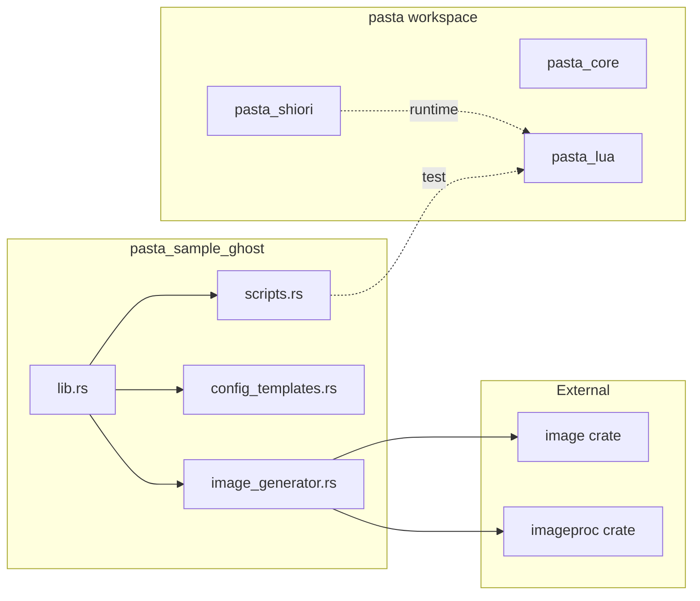
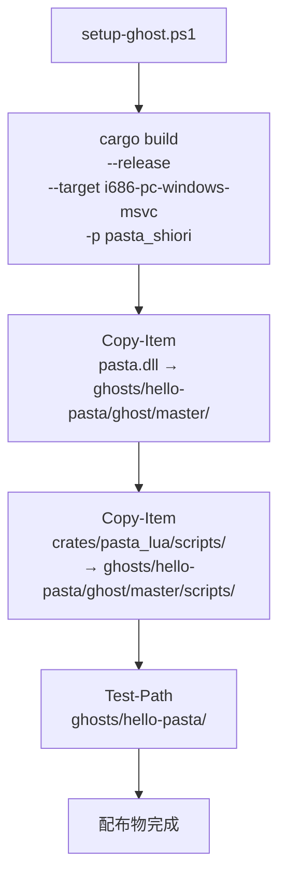

# Technical Design: alpha04-sample-ghost

**最優先目的（憲法）**: pasta.dll を使った**実働する**サンプルゴースト配布物を作ること

---

## 1. Overview

### 1.1 Design Mission

hello-pasta ゴーストは、**SSPにインストールして即座に動作する完全な配布物**として設計される。「参考資料」や「サンプルコード」ではなく、**実働する製品**である。

### 1.2 Success Criteria

| 基準 | 検証方法 |
|------|----------|
| **実働性** | SSPにインストール後、起動・トーク・終了が動作する |
| **完全性** | 配布物（`ghosts/hello-pasta/`）に欠けているファイルがない |
| **再現性** | `cargo test` + `scripts/setup-ghost.ps1` で配布物が完成する |
| **品質** | 全統合テストがパスする（pasta.dll 動作確認を含む） |

### 1.3 Non-Goals

- 高度な会話ロジック（コンテキスト保持、学習等）
- SAORI/MAKOTO 連携
- ネットワーク更新機能
- 複雑なシェルアニメーション

---

## 2. Architecture Pattern & Boundary Map

### 2.1 Architectural Style

**Code Generation + Asset Pipeline** パターン

```mermaid
flowchart TB
    subgraph Sources["ソース（crates/pasta_sample_ghost）"]
        direction TB
        SCRIPTS[src/scripts.rs<br/>pasta DSL templates]
        IMAGES[src/image_generator.rs<br/>Surface generator]
        CONFIG[src/config_templates.rs<br/>ukadoc templates]
    end
    
    subgraph Build["ビルドプロセス"]
        direction TB
        GEN[generate_ghost\(\)]
        DLL_BUILD[cargo build<br/>pasta_shiori.dll]
        LUA_COPY[scripts/ copy]
    end
    
    subgraph Dist["配布物（ghosts/hello-pasta）"]
        direction TB
        GHOST[ghost/master/<br/>pasta.dll, pasta.toml, dic/*.pasta]
        SHELL[shell/master/<br/>surface*.png, surfaces.txt]
        UKADOC[install.txt,<br/>descript.txt]
    end
    
    subgraph Runtime["実行時（SSP）"]
        direction TB
        SSP[SSP/伺か]
        SHIORI[pasta.dll<br/>SHIORI/3.0]
        LUA[pasta_lua runtime<br/>script execution]
    end
    
    SCRIPTS --> GEN
    IMAGES --> GEN
    CONFIG --> GEN
    DLL_BUILD --> GHOST
    LUA_COPY --> GHOST
    GEN --> SHELL
    GEN --> UKADOC
    
    GHOST --> SSP
    SHELL --> SSP
    UKADOC --> SSP
    SSP --> SHIORI
    SHIORI --> LUA
```

### 2.2 Boundary Contracts

| 境界 | インターフェース | 責務 |
|------|-----------------|------|
| **ソース → ビルド** | `generate_ghost(output_dir, config)` | 配布物生成 |
| **ビルド → 配布物** | ファイルシステム | 完全な配布物出力 |
| **配布物 → SSP** | ukadoc 準拠設定ファイル | SSP 認識 |
| **SSP → pasta.dll** | SHIORI/3.0 プロトコル | イベント処理 |
| **pasta.dll → Lua** | pasta_lua API | スクリプト実行 |

### 2.3 Critical Constraints

| 制約 | 理由 | 検証方法 |
|------|------|----------|
| **ukadoc 完全準拠** | SSP が認識する必要がある | 統合テスト `test_ukadoc_files()` |
| **pasta DSL 正規文法** | パーサーが解釈できる必要がある | 統合テスト `test_pasta_scripts()` |
| **32bit DLL** | SSP は 32bit プロセス | ビルドターゲット `i686-pc-windows-msvc` |
| **UTF-8 BOM なし** | SSP/pasta_lua の読み込み互換性 | ファイル生成時に BOM 除外 |

---

## 3. Technology Stack & Alignment

### 3.1 Core Technologies

| 技術 | バージョン | 用途 | 選定理由 |
|------|-----------|------|---------|
| **Rust** | 2024 edition | ビルドツール、画像生成 | Type safety, CI 再現性 |
| **image** | 0.25 | PNG 画像生成 | Pure Rust, 外部依存なし |
| **imageproc** | 0.25 | 図形描画（円、ポリゴン） | image クレート互換 |
| **mlua** | 0.10 (pasta_lua) | Lua VM 実行 | pasta_lua 依存 |
| **PowerShell** | 7+ | ビルド自動化 | Windows 標準、クロスプラットフォーム |

### 3.2 Steering Alignment

| Steering 原則 | 実装 |
|---------------|------|
| **Pure Virtual Workspace** (structure.md) | クレート `crates/pasta_sample_ghost/` に配置 |
| **pasta DSL 文法準拠** (grammar.md) | `＊` `＠` `・` マーカーを正しく使用 |
| **Type Safety** (tech.md) | `GhostConfig`, `GhostError` で型安全 |
| **DoD Gate** (workflow.md) | 全テストパス、ドキュメント整合性確認 |

### 3.3 Dependency Graph



---

## 4. Components & Interface Contracts

### 4.1 Component: ImageGenerator

**責務**: 配布可能なシェル画像（surface0-8, surface10-18）を生成する

**公開 API**:

```rust
/// シェル画像を生成し、指定パスに出力
/// 
/// # Arguments
/// * `output_dir` - 出力先ディレクトリ（shell/master/ 想定）
/// 
/// # Returns
/// * `Ok(())` - 全18画像生成成功
/// * `Err(ImageError)` - 画像生成失敗
pub fn generate_surfaces(output_dir: &Path) -> Result<(), ImageError>;

/// 個別サーフェス生成（テスト用）
///
/// # Arguments
/// * `width` - 画像幅（128 固定）
/// * `height` - 画像高さ（256 固定）
/// * `character` - キャラクター種別
/// * `expression` - 表情種別
///
/// # Returns
/// * `RgbaImage` - 透過 PNG 画像データ
pub fn generate_surface(
    width: u32,
    height: u32,
    character: Character,
    expression: Expression,
) -> RgbaImage;

pub enum Character {
    Sakura,  // 女の子（赤 #DC3545）
    Kero,    // 男の子（青 #007BFF）
}

pub enum Expression {
    Smile,      // ^ ^
    Normal,     // - -
    Shy,        // > <
    Surprised,  // o o
    Crying,     // ; ;
    Confused,   // @ @
    Sparkle,    // * *
    Sleepy,     // = =
    Angry,      // # #
}
```

**実装詳細**:

```rust
// 3頭身ピクトグラム定数
const WIDTH: u32 = 128;
const HEIGHT: u32 = 256;
const HEAD_RADIUS: i32 = 42;         // 頭部（全体の約1/3）
const HEAD_CENTER_Y: i32 = 47;       // HEAD_RADIUS + 5
const BODY_TOP: i32 = 94;            // HEAD_CENTER_Y + HEAD_RADIUS + 5
const BODY_BOTTOM: i32 = 246;        // HEIGHT - 10
const BODY_WIDTH: i32 = 100;
const EYE_LINE_WIDTH: u32 = 3;       // 表情線の太さ
const EYE_SPACING: i32 = 36;         // 目の間隔

// 女の子（sakura）: ○ + △
// 男の子（kero）: ○ + ▽
fn draw_pictogram(img: &mut RgbaImage, character: Character) {
    let color = match character {
        Character::Sakura => Rgba([220, 53, 69, 255]),   // 赤
        Character::Kero => Rgba([0, 123, 255, 255]),     // 青
    };
    
    // 頭部（円）
    draw_filled_circle_mut(
        img, 
        (WIDTH as i32 / 2, HEAD_CENTER_Y), 
        HEAD_RADIUS, 
        color
    );
    
    // 胴体（三角形）
    let body_polygon = match character {
        Character::Sakura => vec![
            Point::new(WIDTH as i32 / 2, BODY_TOP),
            Point::new(WIDTH as i32 / 2 - BODY_WIDTH / 2, BODY_BOTTOM),
            Point::new(WIDTH as i32 / 2 + BODY_WIDTH / 2, BODY_BOTTOM),
        ],
        Character::Kero => vec![
            Point::new(WIDTH as i32 / 2 - BODY_WIDTH / 2, BODY_TOP),
            Point::new(WIDTH as i32 / 2 + BODY_WIDTH / 2, BODY_TOP),
            Point::new(WIDTH as i32 / 2, BODY_BOTTOM),
        ],
    };
    draw_polygon_mut(img, &body_polygon, color);
}

// 表情（線描画）
fn draw_expression(img: &mut RgbaImage, expression: Expression) {
    let line_color = Rgba([0, 0, 0, 255]);  // 黒
    let center_x = WIDTH as i32 / 2;
    let eye_y = HEAD_CENTER_Y;
    
    match expression {
        Expression::Smile => {
            // ^ ^ (上向き弧)
            draw_line_segment_mut(
                img,
                (center_x - EYE_SPACING / 2 - 5, eye_y),
                (center_x - EYE_SPACING / 2, eye_y - 5),
                line_color
            );
            // ... (右目も同様)
        },
        // ... (他の表情も同様)
    }
}
```

**要件トレーサビリティ**:
- **6.1**: サイズ 128×256, 3頭身, 透過 PNG
- **6.2**: トイレマーク風ピクトグラム（○ + △/▽）
- **6.3**: 表情9種、線の太さ3px、目の間隔36px
- **6.5**: CI 再現可能（Pure Rust、外部依存なし）

---

### 4.2 Component: ConfigTemplates

**責務**: ukadoc 準拠の設定ファイル群を生成する

**公開 API**:

```rust
/// ディレクトリ構造と設定ファイルを生成
///
/// # Arguments
/// * `output_dir` - 出力先ディレクトリ（hello-pasta/ のルート）
/// * `config` - ゴースト設定
///
/// # Returns
/// * `Ok(())` - 全ファイル生成成功
/// * `Err(io::Error)` - ファイル生成失敗
pub fn generate_structure(
    output_dir: &Path, 
    config: &GhostConfig
) -> Result<(), io::Error>;

/// 個別ファイル生成関数（テスト用）
pub fn generate_install_txt(config: &GhostConfig) -> String;
pub fn generate_ghost_descript_txt(config: &GhostConfig) -> String;
pub fn generate_shell_descript_txt(config: &GhostConfig) -> String;
pub fn generate_surfaces_txt() -> String;
pub fn generate_pasta_toml(config: &GhostConfig) -> String;
```

**テンプレート例**:

```rust
pub fn generate_install_txt(config: &GhostConfig) -> String {
    format!(
        "charset,UTF-8\n\
         type,ghost\n\
         directory,{}\n\
         name,{}\n",
        config.name, config.name
    )
}

pub fn generate_ghost_descript_txt(config: &GhostConfig) -> String {
    format!(
        "charset,UTF-8\n\
         type,ghost\n\
         shiori,{}\n\
         name,{}\n\
         craftman,{}\n\
         craftmanw,{}\n\
         sakura.name,{}\n\
         kero.name,{}\n\
         homeurl,{}\n",
        config.shiori,
        config.name,
        config.craftman,
        config.craftman_w,
        config.sakura_name,
        config.kero_name,
        config.homeurl
    )
}

pub fn generate_pasta_toml(config: &GhostConfig) -> String {
    format!(
        "# pasta.toml - pasta ゴースト設定ファイル\n\
         #\n\
         # このファイルは pasta システムの動作を設定します。\n\
         # 必須項目は [package] と [loader] のみです。\n\
         \n\
         [package]\n\
         name = \"{}\"\n\
         version = \"{}\"\n\
         edition = \"2024\"\n\
         \n\
         [loader]\n\
         pasta_patterns = [\"dic/*.pasta\"]\n\
         lua_search_paths = [\n\
         \    \"profile/pasta/save/lua\",\n\
         \    \"scripts\",\n\
         \    \"profile/pasta/cache/lua\",\n\
         \    \"scriptlibs\",\n\
         ]\n\
         transpiled_output_dir = \"profile/pasta/cache/lua\"\n\
         \n\
         [ghost]\n\
         random_talk_interval = 180\n\
         \n\
         [persistence]\n\
         data_dir = \"profile/pasta/save\"\n",
        config.name,
        config.version
    )
}
```

**要件トレーサビリティ**:
- **9.1**: install.txt（charset, type, name, directory）
- **9.2**: ghost/master/descript.txt（type, shiori, sakura.name, kero.name）
- **9.3**: shell/master/descript.txt（type, name, balloon offset）
- **7.1**: pasta.toml（[package], [loader], [ghost], [persistence]）

---

### 4.3 Component: Scripts

**責務**: pasta DSL スクリプトテンプレートを文字列定数として提供する

**公開 API**:

```rust
/// スクリプトファイルを生成
///
/// # Arguments
/// * `dic_dir` - 出力先ディレクトリ（ghost/master/dic/ 想定）
///
/// # Returns
/// * `Ok(())` - 全スクリプト生成成功
/// * `Err(io::Error)` - ファイル生成失敗
pub fn generate_scripts(dic_dir: &Path) -> Result<(), io::Error>;

/// pasta DSL テンプレート（文字列定数）
pub const ACTORS_PASTA: &str = "...";  // アクター辞書（共通定義）
pub const BOOT_PASTA: &str = "...";     // 起動・終了イベント
pub const TALK_PASTA: &str = "...";     // ランダムトーク・時報
pub const CLICK_PASTA: &str = "...";    // ダブルクリック反応
```

**BOOT_PASTA テンプレート**:

```rust
/// アクター辞書（actors.pasta で共通定義）
pub const ACTORS_PASTA: &str = r#"＃ actors.pasta - アクター辞書（共通定義）
＃ 全ての .pasta ファイルで共有されるアクター定義

＃ 女の子（sakura）- 赤色ピクトグラム
％女の子
　＠通常：\s[1]
　＠笑顔：\s[0]
　＠照れ：\s[2]
　＠驚き：\s[3]
　＠泣き：\s[4]
　＠困惑：\s[5]
　＠キラキラ：\s[6]
　＠眠い：\s[7]
　＠怒り：\s[8]

＃ 男の子（kero）- 青色ピクトグラム
％男の子
　＠通常：\s[11]
　＠笑顔：\s[10]
　＠照れ：\s[12]
　＠驚き：\s[13]
　＠泣き：\s[14]
　＠困惑：\s[15]
　＠キラキラ：\s[16]
　＠眠い：\s[17]
　＠怒り：\s[18]
"#;

pub const BOOT_PASTA: &str = r#"＃ boot.pasta - 起動/終了イベント用シーン定義
＃ pasta DSL では「シーン関数フォールバック」機能を利用
＃ シーン名とSHIORIイベント名を一致させることで、自動ディスパッチされる
＃ ※アクター辞書は actors.pasta で共通定義

＃ グローバル単語定義（ランダム選択用）
＠起動挨拶：おはよう！今日もよろしくね！、やっほー、また会えたね！、起動完了！準備OKだよ。
＠終了挨拶：またね～！、お疲れ様！、ばいばーい！

＃ OnBoot イベント - 通常起動時（シーン関数フォールバックで呼び出し）
＊OnBoot
　女の子：＠笑顔　＠起動挨拶
　男の子：＠元気　へえ、また来たんだ。

＃ OnBoot イベント - 別パターン（同名シーンでランダム選択）
＊OnBoot
　女の子：＠通常　起動したよ～。
　男の子：＠通常　さあ、始めようか。

＃ OnFirstBoot イベント - 初回起動時
＊OnFirstBoot
　女の子：＠笑顔　初めまして！\nわたしたち、pasta システムのサンプルゴーストです。\n\n[half]よろしくね！
　男の子：＠元気　ぼくは男の子。ちゃんと使ってよね。

＃ OnClose イベント - 終了時
＊OnClose
　女の子：＠通常　＠終了挨拶
　男の子：＠通常　また呼んでよね。

＃ OnClose イベント - 別パターン
＊OnClose
　女の子：＠眠い　おやすみなさい...
　男の子：＠通常　じゃあね。
"#;
```

**TALK_PASTA テンプレート**:

```rust
pub const TALK_PASTA: &str = r#"＃ talk.pasta - ランダムトーク/時報用シーン定義
＃ OnSecondChange (毎秒) → 仮想イベントディスパッチャ → ランダムトーク/時報
＃ ※アクター辞書は actors.pasta で共通定義

＃ ランダムトーク用単語（ランダム選択）
＠雑談：何か用？、暇だなあ...、ねえねえ、聞いてる？、うーん、眠くなってきた...

＃ ランダムトーク - 仮想イベント OnTalk
＊OnTalk
　女の子：＠通常　＠雑談

＊OnTalk
　女の子：＠笑顔　Pasta DSL、使ってみてね！
　男の子：＠元気　Lua 側も触ってみなよ。

＊OnTalk
　女の子：＠考え　今日は何しようかな...
　男の子：＠通常　宿題やったの？

＊OnTalk
　女の子：＠通常　ねえ、今日の天気どう思う？
　男の子：＠考え　さあ、外見てないからわかんないや。

＊OnTalk
　女の子：＠笑顔　一緒にお話しよう！
　男の子：＠元気　しょうがないなあ。

＊OnTalk
　女の子：＠眠い　ふわあ...ちょっと眠いかも。
　男の子：＠通常　寝てていいよ、ぼくが見てるから。

＃ 時報 - 仮想イベント OnHour
＃ ＄時１２ 変数は onhour-date-var-transfer により自動設定される（12時間表記）
＊OnHour
　女の子：＠笑顔　＄時１２　だよ！時報だよ～。
　男の子：＠元気　もう　＄時１２　か、早いね。

＊OnHour
　女の子：＠通常　今　＄時１２　だって。
　男の子：＠通常　へえ、そうなんだ。

＊OnHour
　女の子：＠考え　＄時１２　...時間が経つのって不思議だね。
　男の子：＠考え　哲学的だね。
"#;
```

**CLICK_PASTA テンプレート**:

```rust
pub const CLICK_PASTA: &str = r#"＃ click.pasta - ダブルクリック反応用シーン定義
＃ OnMouseDoubleClick イベントに反応
＃ ※アクター辞書は actors.pasta で共通定義

＃ ダブルクリック反応（ランダム選択）7種以上
＊OnMouseDoubleClick
　女の子：＠驚き　わっ、びっくりした！
　男の子：＠元気　どうしたの？

＊OnMouseDoubleClick
　女の子：＠笑顔　なあに？呼んだ？
　男の子：＠通常　こっちに用があるんじゃない？

＊OnMouseDoubleClick
　女の子：＠照れ　え、なに？
　男の子：＠元気　照れてるの？

＊OnMouseDoubleClick
　男の子：＠驚き　うわっ！なに！？
　女の子：＠笑顔　反応してくれたね。

＊OnMouseDoubleClick
　男の子：＠怒り　ちょっと、やめてよ！
　女の子：＠通常　あはは、ごめんね。

＊OnMouseDoubleClick
　女の子：＠笑顔　わ〜い、遊んでくれるの？
　男の子：＠通常　まあ、暇だしね。

＊OnMouseDoubleClick
　男の子：＠元気　ふふん、ぼくのことが気になる？
　女の子：＠驚き　えっ？そんなんじゃないよ！
"#;
```

**要件トレーサビリティ**:
- **2**: OnFirstBoot, OnBoot, OnClose イベント
- **3**: OnMouseDoubleClick 反応（7種）
- **4**: OnTalk ランダムトーク（6種）
- **5**: OnHour 時報（`＄時１２` 使用、3種）
- **grammar.md**: `＊` `＠` `％` `・` マーカー使用

---

### 4.4 Component: generate_ghost

**責務**: 配布物全体を生成する統合 API

**公開 API**:

```rust
/// ゴースト配布物を生成
///
/// # Arguments
/// * `output_dir` - 出力先ディレクトリ（hello-pasta/ が作成される）
/// * `config` - ゴースト設定
///
/// # Returns
/// * `Ok(())` - 配布物生成成功
/// * `Err(GhostError)` - 生成失敗
///
/// # Generated Structure
/// ```
/// {output_dir}/
/// ├── install.txt
/// ├── readme.txt
/// ├── ghost/master/
/// │   ├── descript.txt
/// │   ├── pasta.toml
/// │   └── dic/
/// │       ├── actors.pasta
/// │       ├── boot.pasta
/// │       ├── talk.pasta
/// │       └── click.pasta
/// └── shell/master/
///     ├── descript.txt
///     ├── surfaces.txt
///     └── surface*.png (18 files)
/// ```
pub fn generate_ghost(
    output_dir: &Path, 
    config: &GhostConfig
) -> Result<(), GhostError>;
```

**実装フロー**:

```rust
pub fn generate_ghost(
    output_dir: &Path, 
    config: &GhostConfig
) -> Result<(), GhostError> {
    // Step 1: ディレクトリ構造と設定ファイル生成
    config_templates::generate_structure(output_dir, config)?;
    
    // Step 2: シェル画像生成（18ファイル）
    let shell_dir = output_dir.join("shell/master");
    image_generator::generate_surfaces(&shell_dir)?;
    
    // Step 3: pasta スクリプト生成
    let dic_dir = output_dir.join("ghost/master/dic");
    scripts::generate_scripts(&dic_dir)?;
    
    Ok(())
}
```

**要件トレーサビリティ**:
- **1.1**: 配布物構成（`ghosts/hello-pasta/`）
- **1.2**: build.rs による動的ファイル生成
- **1.5**: 静的ファイル + 動的ファイル生成

---

## 5. Data & State Management

### 5.1 Configuration Data

```rust
#[derive(Debug, Clone)]
pub struct GhostConfig {
    pub name: String,           // "hello-pasta"
    pub version: String,        // "1.0.0"
    pub sakura_name: String,    // "女の子"
    pub kero_name: String,      // "男の子"
    pub craftman: String,       // "ekicyou"
    pub craftman_w: String,     // "どっとステーション駅長"
    pub shiori: String,         // "pasta.dll"
    pub homeurl: String,        // "https://github.com/ekicyou/pasta"
}

impl Default for GhostConfig {
    fn default() -> Self {
        Self {
            name: "hello-pasta".to_string(),
            version: "1.0.0".to_string(),
            sakura_name: "女の子".to_string(),
            kero_name: "男の子".to_string(),
            craftman: "ekicyou".to_string(),
            craftman_w: "どっとステーション駅長".to_string(),
            shiori: "pasta.dll".to_string(),
            homeurl: "https://github.com/ekicyou/pasta".to_string(),
        }
    }
}
```

### 5.2 Error Handling

```rust
#[derive(Debug, Error)]
pub enum GhostError {
    #[error("画像生成エラー: {0}")]
    ImageError(#[from] image::ImageError),
    
    #[error("IOエラー: {0}")]
    IoError(#[from] std::io::Error),
    
    #[error("設定エラー: {0}")]
    ConfigError(String),
}
```

### 5.3 File Output

| ファイル | 生成元 | フォーマット | エンコーディング |
|---------|--------|------------|----------------|
| `install.txt` | config_templates | CSV形式 | UTF-8 (BOM なし) |
| `ghost/master/descript.txt` | config_templates | CSV形式 | UTF-8 (BOM なし) |
| `shell/master/descript.txt` | config_templates | CSV形式 | UTF-8 (BOM なし) |
| `shell/master/surfaces.txt` | config_templates | SERIKO形式 | UTF-8 (BOM なし) |
| `ghost/master/pasta.toml` | config_templates | TOML形式 | UTF-8 (BOM なし) |
| `ghost/master/dic/*.pasta` | scripts | pasta DSL | UTF-8 (BOM なし) |
| `shell/master/surface*.png` | image_generator | PNG | Binary |

---

## 6. Build & Deployment Process

### 6.1 ヘルパースクリプト: `scripts/setup-ghost.ps1`

**目的**: pasta.dll と Lua ランタイムを ghosts/hello-pasta/ に配置する（オプション）

**注意**: `.pasta` と `.png` ファイルは `build.rs` で自動生成される。このスクリプトは `pasta.dll` と `scripts/` の配置のみを担当する。

**フロー**:



**スクリプト実装**:

```powershell
# scripts/setup-ghost.ps1
param(
    [switch]$SkipDllBuild
)

$ErrorActionPreference = "Stop"
$GhostDir = "crates/pasta_sample_ghost/ghosts/hello-pasta"

Write-Host "=== pasta サンプルゴースト セットアップ ===" -ForegroundColor Cyan

# Step 1: SHIORI DLL ビルド（32bit Windows）
if (-not $SkipDllBuild) {
    Write-Host "[1/3] pasta.dll をビルド中..." -ForegroundColor Yellow
    cargo build --release --target i686-pc-windows-msvc -p pasta_shiori
    if ($LASTEXITCODE -ne 0) { throw "DLL ビルド失敗" }
} else {
    Write-Host "[1/3] DLL ビルドをスキップ" -ForegroundColor Gray
}

# Step 2: DLL コピー
Write-Host "[2/3] pasta.dll をコピー中..." -ForegroundColor Yellow
$DllSrc = "target/i686-pc-windows-msvc/release/pasta.dll"
$DllDest = Join-Path $GhostDir "ghost/master/pasta.dll"
Copy-Item $DllSrc $DllDest -Force

# Step 3: Lua ランタイムコピー
Write-Host "[3/3] Lua ランタイムをコピー中..." -ForegroundColor Yellow
$LuaSrc = "crates/pasta_lua/scripts"
$LuaDest = Join-Path $GhostDir "ghost/master/scripts"
if (Test-Path $LuaDest) {
    Remove-Item -Recurse -Force $LuaDest
}
Copy-Item -Recurse $LuaSrc $LuaDest -Force

# 検証
Write-Host "=== セットアップ完了 ===" -ForegroundColor Green
Write-Host "配布物: $GhostDir" -ForegroundColor Cyan

# 必須ファイル検証（動的ファイルは build.rs で生成済み）
$RequiredFiles = @(
    "install.txt",
    "ghost/master/descript.txt",
    "ghost/master/pasta.toml",
    "ghost/master/pasta.dll",
    "ghost/master/dic/actors.pasta",
    "ghost/master/dic/boot.pasta",
    "ghost/master/dic/talk.pasta",
    "ghost/master/dic/click.pasta",
    "ghost/master/scripts/pasta/init.lua",
    "shell/master/descript.txt",
    "shell/master/surfaces.txt",
    "shell/master/surface0.png",
    "shell/master/surface10.png"
)

$Missing = @()
foreach ($File in $RequiredFiles) {
    $Path = Join-Path $GhostDir $File
    if (-not (Test-Path $Path)) {
        $Missing += $File
    }
}

if ($Missing.Count -gt 0) {
    Write-Host "警告: 以下のファイルが見つかりません:" -ForegroundColor Red
    $Missing | ForEach-Object { Write-Host "  - $_" -ForegroundColor Red }
    exit 1
}

Write-Host "全ファイル検証完了 ✓" -ForegroundColor Green
```

**要件トレーサビリティ**:
- **10.1**: PowerShell スクリプト提供
- **10.2**: DLL ビルド、テンプレートコピー、成果物配置、Lua ランタイムコピー
- **10.3**: `pasta.dll` コピー（手動 or スクリプト）
- **10.4**: `crates/pasta_lua/scripts/` コピー（手動 or スクリプト）
- **10.5**: `ghosts/hello-pasta/` が完成形

### 6.2 Binary: `generate-surfaces`

**目的**: テストや手動ビルド時に画像・スクリプトを生成する

**実装**:

```rust
// src/bin/generate-surfaces.rs
use pasta_sample_ghost::{generate_ghost, GhostConfig};
use std::path::PathBuf;

fn main() {
    let args: Vec<String> = std::env::args().collect();
    if args.len() < 2 {
        eprintln!("Usage: generate-surfaces <output-dir>");
        std::process::exit(1);
    }
    
    let output_dir = PathBuf::from(&args[1]);
    let config = GhostConfig::default();
    
    match generate_ghost(&output_dir, &config) {
        Ok(()) => {
            println!("Done! Generated ghost at: {}", output_dir.display());
        }
        Err(e) => {
            eprintln!("Error: {}", e);
            std::process::exit(1);
        }
    }
}
```

---

## 7. Testing Strategy

### 7.1 Test Pyramid

```
        ┌──────────────┐
        │  E2E Tests   │ ← 実SSP不要、SHIORI/Lua統合
        ├──────────────┤
        │ Integration  │ ← 配布物生成・検証
        ├──────────────┤
        │   Unit       │ ← コンポーネント単体
        └──────────────┘
```

### 7.2 Test Coverage

| レイヤー | テストケース | 検証内容 |
|---------|------------|---------|
| **Unit** | `image_generator::tests::test_generate_surface()` | 個別サーフェス生成 |
| **Unit** | `config_templates::tests::test_install_txt()` | install.txt 内容 |
| **Unit** | `scripts::tests::test_boot_pasta_contains_events()` | pasta DSL 文法 |
| **Integration** | `test_directory_structure()` | 配布物ディレクトリ構成 |
| **Integration** | `test_shell_images()` | 全18画像生成確認 |
| **Integration** | `test_ukadoc_files()` | ukadoc 準拠確認 |
| **Integration** | `test_pasta_scripts()` | pasta DSL パース可能性 |
| **E2E** | `test_shiori_lifecycle()` (将来) | OnBoot → OnTalk → OnClose |

### 7.3 Key Test Cases

#### Test: `test_pasta_scripts()`

**目的**: 生成された pasta DSL が正しく解釈されることを保証

```rust
#[test]
fn test_pasta_scripts() {
    let temp = TempDir::new().unwrap();
    let ghost_root = temp.path().join("hello-pasta");
    let config = GhostConfig::default();
    
    generate_ghost(&ghost_root, &config).unwrap();
    
    let dic_dir = ghost_root.join("ghost/master/dic");
    
    // actors.pasta
    let actors = std::fs::read_to_string(dic_dir.join("actors.pasta")).unwrap();
    assert!(actors.contains("％女の子"), "女の子アクターがありません");
    assert!(actors.contains("％男の子"), "男の子アクターがありません");
    
    // boot.pasta
    let boot = std::fs::read_to_string(dic_dir.join("boot.pasta")).unwrap();
    assert!(boot.contains("＊OnBoot"), "OnBoot シーンがありません");
    assert!(boot.contains("＊OnFirstBoot"), "OnFirstBoot シーンがありません");
    assert!(boot.contains("＊OnClose"), "OnClose シーンがありません");
    
    // talk.pasta
    let talk = std::fs::read_to_string(dic_dir.join("talk.pasta")).unwrap();
    assert!(talk.contains("＊OnTalk"), "OnTalk シーンがありません");
    assert!(talk.contains("＊OnHour"), "OnHour シーンがありません");
    assert!(talk.contains("＄時１２"), "時刻変数参照がありません");
    
    // click.pasta
    let click = std::fs::read_to_string(dic_dir.join("click.pasta")).unwrap();
    assert!(click.contains("＊OnMouseDoubleClick"), "OnMouseDoubleClick シーンがありません");
    
    // パターン数確認
    let talk_count = talk.matches("＊OnTalk").count();
    assert!(talk_count >= 5, "OnTalk パターンが5種未満: {}", talk_count);
    
    let click_count = click.matches("＊OnMouseDoubleClick").count();
    assert!(click_count >= 5, "OnMouseDoubleClick パターンが5種未満: {}", click_count);
}
```

**要件トレーサビリティ**:
- **2**: OnFirstBoot, OnBoot, OnClose
- **3**: OnMouseDoubleClick 5種以上
- **4**: OnTalk 5〜10種
- **5**: OnHour + `＄時１２`

#### Test: `test_ukadoc_files()`

**目的**: ukadoc 準拠の設定ファイルが生成されることを保証

```rust
#[test]
fn test_ukadoc_files() {
    let temp = TempDir::new().unwrap();
    let ghost_root = temp.path().join("hello-pasta");
    let config = GhostConfig::default();
    
    generate_ghost(&ghost_root, &config).unwrap();
    
    // install.txt
    let install = std::fs::read_to_string(ghost_root.join("install.txt")).unwrap();
    assert!(install.contains("type,ghost"));
    assert!(install.contains("name,hello-pasta"));
    assert!(install.contains("directory,hello-pasta"));
    
    // ghost/master/descript.txt
    let ghost_desc = std::fs::read_to_string(
        ghost_root.join("ghost/master/descript.txt")
    ).unwrap();
    assert!(ghost_desc.contains("charset,UTF-8"));
    assert!(ghost_desc.contains("type,ghost"));
    assert!(ghost_desc.contains("shiori,pasta.dll"));
    assert!(ghost_desc.contains("sakura.name,女の子"));
    assert!(ghost_desc.contains("kero.name,男の子"));
    
    // shell/master/descript.txt
    let shell_desc = std::fs::read_to_string(
        ghost_root.join("shell/master/descript.txt")
    ).unwrap();
    assert!(shell_desc.contains("type,shell"));
    assert!(shell_desc.contains("name,master"));
    assert!(shell_desc.contains("sakura.balloon.offsetx,64"));
}
```

**要件トレーサビリティ**:
- **9.1**: install.txt 必須フィールド
- **9.2**: ghost/master/descript.txt 必須フィールド
- **9.3**: shell/master/descript.txt 必須フィールド

#### Test: `test_shell_images()`

**目的**: 全18画像が正しく生成されることを保証

```rust
#[test]
fn test_shell_images() {
    let temp = TempDir::new().unwrap();
    let ghost_root = temp.path().join("hello-pasta");
    let config = GhostConfig::default();
    
    generate_ghost(&ghost_root, &config).unwrap();
    
    let shell_dir = ghost_root.join("shell/master");
    
    // sakura サーフェス (0-8)
    for i in 0..=8 {
        let path = shell_dir.join(format!("surface{}.png", i));
        assert!(path.exists(), "surface{}.png が存在しません", i);
        
        // 画像サイズ検証
        let img = image::open(&path).unwrap();
        assert_eq!(img.width(), 128, "surface{}.png の幅が不正", i);
        assert_eq!(img.height(), 256, "surface{}.png の高さが不正", i);
    }
    
    // kero サーフェス (10-18)
    for i in 10..=18 {
        let path = shell_dir.join(format!("surface{}.png", i));
        assert!(path.exists(), "surface{}.png が存在しません", i);
        
        let img = image::open(&path).unwrap();
        assert_eq!(img.width(), 128);
        assert_eq!(img.height(), 256);
    }
}
```

**要件トレーサビリティ**:
- **6.1**: サイズ 128×256, surface0-8, surface10-18

---

## 8. Requirements Traceability Matrix

| Req | 要件 | 設計コンポーネント | テスト |
|-----|-----|------------------|-------|
| **1.1** | 配布物構成 | `generate_ghost()` | `test_directory_structure()` |
| **1.2** | build.rs 動的生成 | `build.rs` | `cargo build` |
| **1.3** | crates/pasta_sample_ghost/ 配置 | Cargo.toml | - |
| **1.4** | pasta_lua から独立 | Cargo.toml dependencies | - |
| **1.5** | テンプレート + 動的生成 | `generate_ghost()` | `test_directory_structure()` |
| **2.1** | OnFirstBoot | `BOOT_PASTA` | `test_pasta_scripts()` |
| **2.2** | OnBoot | `BOOT_PASTA` | `test_pasta_scripts()` |
| **2.3** | OnClose | `BOOT_PASTA` | `test_pasta_scripts()` |
| **2.4** | pasta.shiori.act 使用 | `BOOT_PASTA` (OnClose[act]) | - |
| **3.1** | OnMouseDoubleClick | `CLICK_PASTA` | `test_pasta_scripts()` |
| **3.2** | pasta DSL のみ | `CLICK_PASTA` | `test_pasta_scripts()` |
| **3.3** | 5種以上バリエーション | `CLICK_PASTA` (7種) | `test_pasta_scripts()` |
| **3.4** | シンプル実装 | `CLICK_PASTA` | コードレビュー |
| **4.1** | OnTalk | `TALK_PASTA` | `test_pasta_scripts()` |
| **4.2** | 5〜10種パターン | `TALK_PASTA` (6種) | `test_random_talk_patterns()` |
| **4.3** | sakura/kero 掛け合い | `TALK_PASTA` | `test_pasta_scripts()` |
| **5.1** | OnHour | `TALK_PASTA` | `test_pasta_scripts()` |
| **5.2** | `＄時１２` 使用 | `TALK_PASTA` | `test_hour_chime_patterns()` |
| **5.3** | onhour-date-var-transfer | pasta_lua 依存 | - |
| **6.1** | サイズ・比率・形式 | `image_generator.rs` | `test_shell_images()` |
| **6.2** | ピクトグラム | `draw_pictogram()` | `test_sakura_triangle_up_kero_triangle_down()` |
| **6.3** | 表情9種 | `draw_expression()` | `test_all_expressions()` |
| **6.4** | surfaces.txt | `generate_surfaces_txt()` | `test_ukadoc_files()` |
| **6.5** | CI 再現性 | image/imageproc クレート | CI |
| **7.1** | pasta.toml | `generate_pasta_toml()` | `test_pasta_toml_content()` |
| **7.2** | lua_search_paths | `generate_pasta_toml()` | `test_pasta_toml_content()` |
| **7.3** | 教育的コメント | `generate_pasta_toml()` | `test_pasta_toml_content()` |
| **7.4** | pasta.toml 仕様準拠 | `generate_pasta_toml()` | - |
| **8.1-8** | テスト要件 | `tests/integration_test.rs` | 全テスト |
| **9.1** | install.txt | `generate_install_txt()` | `test_ukadoc_files()` |
| **9.2** | ghost/descript.txt | `generate_ghost_descript_txt()` | `test_ukadoc_files()` |
| **9.3** | shell/descript.txt | `generate_shell_descript_txt()` | `test_ukadoc_files()` |
| **9.4** | ukadoc 準拠 | config_templates | `test_ukadoc_files()` |
| **10.1** | build-ghost.ps1 | `scripts/build-ghost.ps1` | 手動検証 |
| **10.2-5** | ビルド自動化 | `scripts/build-ghost.ps1` | 手動検証 |
| **10.6** | Rust + PowerShell のみ | - | - |

---

## 9. Risks & Mitigation

| リスク | 影響 | 確率 | 緩和策 |
|--------|------|------|--------|
| **pasta.dll 不在** | テスト失敗 | 中 | テストヘルパーで明確なエラーメッセージ |
| **SSP 互換性問題** | 動作しない | 低 | ukadoc 厳密準拠、手動検証 |
| **pasta DSL パースエラー** | ロード失敗 | 低 | 統合テストで事前検証 |
| **画像生成失敗** | シェル表示エラー | 低 | Pure Rust実装、CI検証 |
| **Lua ランタイム不在** | スクリプト実行不可 | 中 | ビルドスクリプトで自動コピー |

---

## 10. Future Enhancements

以下は Out of Scope だが、将来の拡張として検討可能：

1. **当たり判定 (collision)** - surfaces.txt に collision 領域定義
2. **瞬きアニメーション** - サーフェスアニメーション追加
3. **icon（タスクトレイ）** - アイコン画像生成
4. **balloon 推奨設定** - バルーン設定テンプレート
5. **E2E テスト** - 実 SHIORI/Lua 統合テスト

---

## 11. Glossary

| 用語 | 説明 |
|------|------|
| **hello-pasta** | サンプルゴーストのゴーストID |
| **sakura** | メインキャラクター（女の子、赤色） |
| **kero** | サブキャラクター（男の子、青色） |
| **サーフェス** | キャラクターの表情画像 |
| **descript.txt** | ukadoc 設定ファイル |
| **pasta.toml** | pasta ゴースト設定ファイル |
| **SHIORI/3.0** | SSP と DLL の通信プロトコル |
| **ukadoc** | SSP 標準の設定ファイル仕様 |
| **ピクトグラム** | トイレマーク風の人型アイコン |
| **配布物** | SSP にインストール可能なゴースト一式 |

---

## Appendix A: File List

### A.1 Generated Files (Build Output)

```
crates/pasta_sample_ghost/ghosts/hello-pasta/
├── install.txt                # インストール設定（ukadoc）
├── readme.txt                 # 説明ファイル
├── ghost/
│   └── master/
│       ├── descript.txt       # ゴースト設定（ukadoc）
│       ├── pasta.toml         # pasta 設定
│       ├── pasta.dll          # SHIORI DLL（32bit）
│       ├── scripts/           # Lua ランタイム
│       │   ├── pasta/         # pasta 標準モジュール
│       │   └── hello.lua      # サンプルスクリプト
│       └── dic/               # pasta DSL スクリプト
│           ├── actors.pasta   # アクター辞書（共通定義）
│           ├── boot.pasta     # 起動・終了イベント
│           ├── talk.pasta     # ランダムトーク・時報
│           └── click.pasta    # ダブルクリック反応
└── shell/
    └── master/                # シェル（見た目）
        ├── descript.txt       # シェル設定（ukadoc）
        ├── surfaces.txt       # サーフェス定義（SERIKO）
        ├── surface0.png       # sakura - 笑顔
        ├── surface1.png       # sakura - 通常
        ├── surface2.png       # sakura - 照れ
        ├── surface3.png       # sakura - 驚き
        ├── surface4.png       # sakura - 泣き
        ├── surface5.png       # sakura - 困惑
        ├── surface6.png       # sakura - キラキラ
        ├── surface7.png       # sakura - 眠い
        ├── surface8.png       # sakura - 怒り
        ├── surface10.png      # kero - 元気
        ├── surface11.png      # kero - 通常
        ├── surface12.png      # kero - 照れ
        ├── surface13.png      # kero - 驚き
        ├── surface14.png      # kero - 泣き
        ├── surface15.png      # kero - 困惑
        ├── surface16.png      # kero - キラキラ
        ├── surface17.png      # kero - 眠い
        └── surface18.png      # kero - 怒り
```

### A.2 Source Files

```
crates/pasta_sample_ghost/
├── Cargo.toml
├── README.md
├── src/
│   ├── lib.rs                 # 公開API
│   ├── image_generator.rs     # 画像生成
│   ├── config_templates.rs    # 設定ファイルテンプレート
│   ├── scripts.rs             # pasta DSL テンプレート
│   └── bin/
│       └── generate-surfaces.rs # 画像生成バイナリ
├── tests/
│   ├── common/
│   │   └── mod.rs             # テストヘルパー
│   └── integration_test.rs    # 統合テスト
└── ghosts/
    └── hello-pasta/           # テンプレート（静的ファイルのみ）
        ├── install.txt
        ├── readme.txt
        ├── ghost/master/
        │   ├── descript.txt
        │   ├── pasta.toml
        │   └── dic/           # 空ディレクトリ（build時生成）
        └── shell/master/
            └── descript.txt
```

---

**設計承認後のアクション**:
1. `/kiro-validate-design alpha04-sample-ghost` で設計レビュー
2. `/kiro-spec-tasks alpha04-sample-ghost -y` でタスク生成
3. タスク実装・テスト実行
4. DoD Gate 通過確認

**最終確認事項**:
- [ ] 全テストパス（`cargo test --package pasta_sample_ghost`）
- [ ] ビルドスクリプト動作確認（`./scripts/build-ghost.ps1`）
- [ ] SSP で実働確認（手動検証）
- [ ] ドキュメント整合性（SOUL.md, README.md, TEST_COVERAGE.md）

---

**設計書バージョン**: 2.0  
**最終更新**: 2025-02-01  
**承認状態**: 未承認
