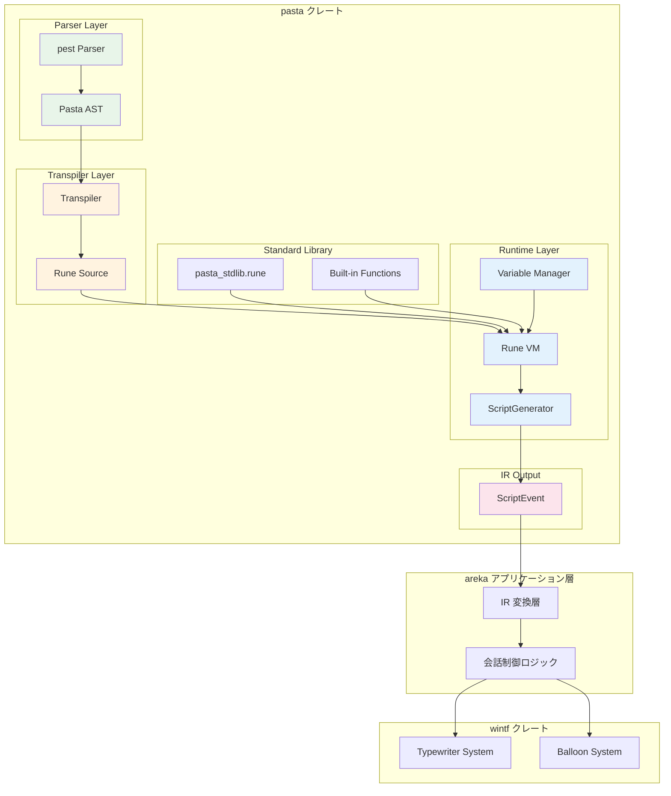
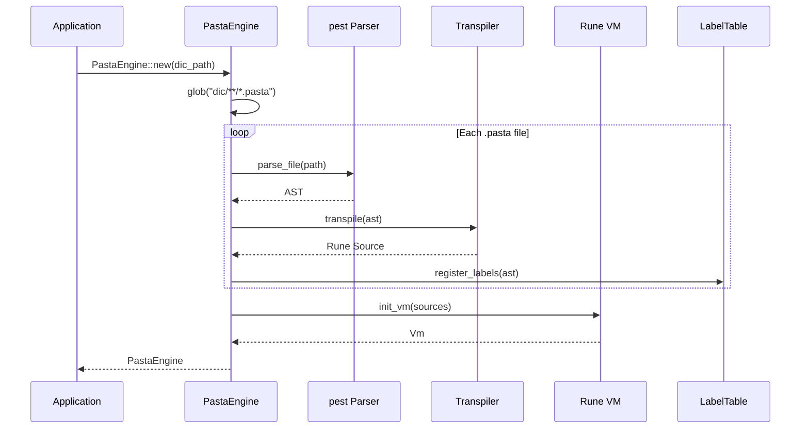
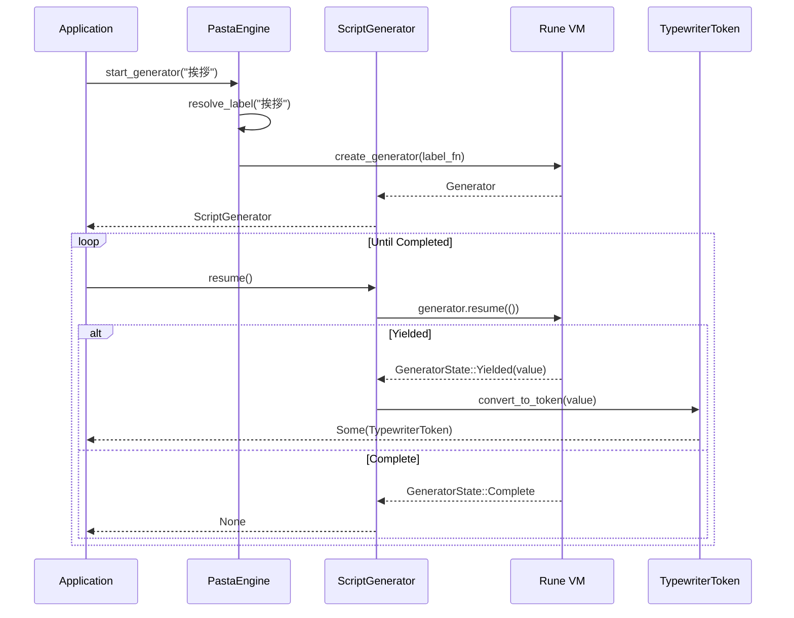
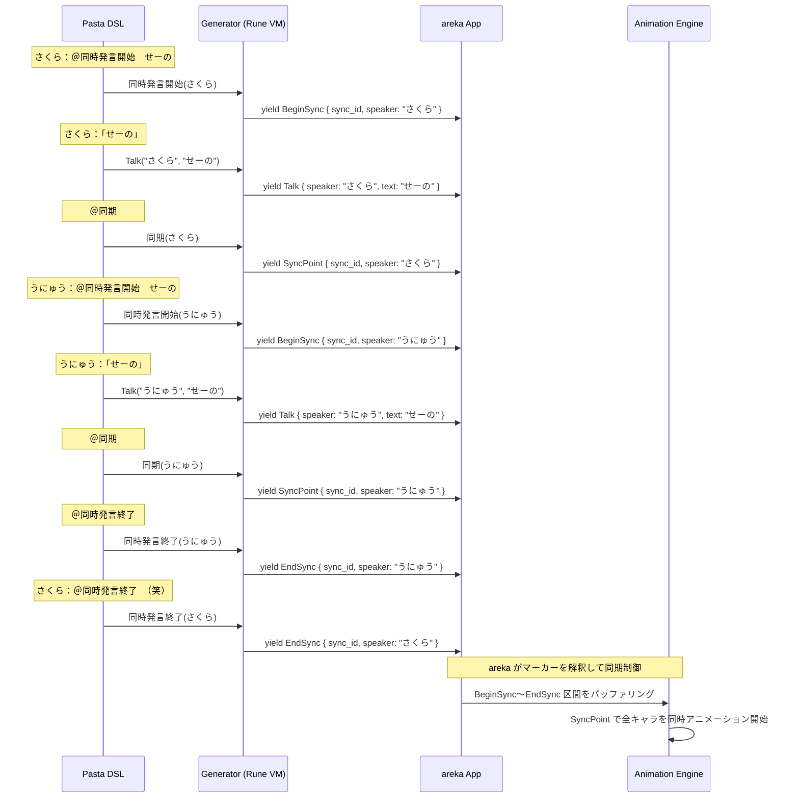
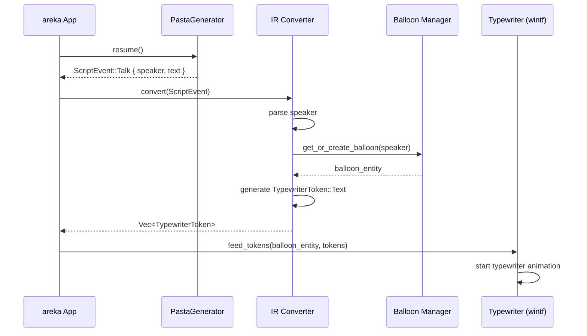
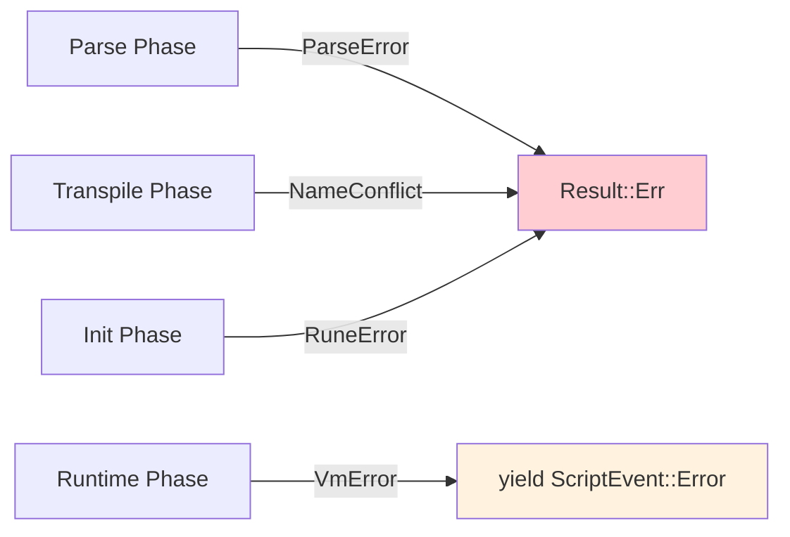

# Design Document: areka-P0-script-engine

| 項目 | 内容 |
|------|------|
| **Version** | 1.0 |
| **Date** | 2025-12-09 |
| **Status** | Approved |
| **Requirements** | v1.0 |

---

## Overview

**Purpose**: 本機能はサブクレート `pasta` として Pasta DSL スクリプトエンジンを提供し、areka アプリケーションにおけるキャラクター対話の実行基盤を構築する。

**Users**: ゴースト制作者が Pasta DSL で対話スクリプトを記述し、areka アプリケーション層が pasta の ScriptEvent IR を TypewriterToken に変換して wintf で表示する。

**Impact**: 新規サブクレート追加。pasta 独自の ScriptEvent IR 型を定義し、areka アプリケーション層で TypewriterToken への変換を行う。wintf への直接依存なし。

**Test Strategy**: pasta は完全にユニットテスト可能な純粋関数的コンポーネント。入力（DSL 文字列）→ 出力（ScriptEvent 列）の変換のみを担当し、UI・アニメーション・時間制御を一切含まないため、ユーザーテスト不要。

### Goals

- 里々インスパイアの対話記述 DSL（Pasta）の解釈・実行
- Rune Generators ベースの状態マシンによる中断・再開機能
- ScriptEvent IR の出力（会話制御情報を含む上位レベル IR）
- 複数キャラクター会話制御マーカーの生成（同期セクション含む）
- さくらスクリプト互換コマンドのサポート
- **完全なユニットテスト可能性**（ユーザーテスト不要）

### Non-Goals

- **時間制御・アニメーション制御**（areka の責務）
- **バッファリング・同期判定**（areka の責務）
- **UI レンダリング・バルーン表示**（wintf の責務）
- LLM 連携（areka-P2-llm-integration の責務）
- ゴーストパッケージ管理（areka-P0-package-manager の責務）
- タイプライター表示アニメーション（wintf-P0-typewriter の責務）
- DirectComposition/Direct2D 等のグラフィックス機能（wintf の責務）
- **ユーザーテスト・視覚的検証が必要な全ての機能**

### Key Design Decisions

| 決定項目 | 選択 | 理由 |
|----------|------|------|
| パーサー | pest (PEG) | Unicode 対応、文法可視性、DSL 親和性 |
| スクリプトランタイム | Rune Generators | 中断・再開、yield による段階的 IR 生成 |
| エラー型 | thiserror | 構造化エラー、要件仕様準拠 |
| IR 出力方式 | ScriptEvent（独自 IR） | wintf 非依存、会話制御に特化、疎結合 |
| yield 戦略 | IR 単位 | 柔軟な中断ポイント、応答性向上 |
| ランダム生成 | trait ベース DI | テスト時のモック置き換え可能性、決定的動作保証 |
| 時間制御 | なし（マーカーのみ） | 純粋関数的、完全ユニットテスト可能 |
| 責務範囲 | スクリプト生成のみ | UI/アニメーション依存なし、決定的動作 |

---

## Architecture

### Existing Architecture Analysis

本設計は新規サブクレートのため、wintf との統合点のみ分析:

| 層 | wintf パターン | pasta での活用 |
|----|---------------|---------------|
| IR 型 | `TypewriterToken` | 変換層経由で間接利用（pasta は非依存） |
| 描画 | `draw_typewriters` | 変換層経由で間接利用 |
| 時刻 | `FrameTime` | 直接参照不要（areka アプリ層が管理） |

### Architecture Overview



### Module Structure

```
crates/pasta/
├── Cargo.toml
├── src/
│   ├── lib.rs              # 公開 API
│   ├── error.rs            # PastaError 定義
│   ├── parser/
│   │   ├── mod.rs          # パーサーエントリポイント
│   │   ├── pasta.pest      # PEG 文法定義
│   │   ├── ast.rs          # AST 型定義
│   │   └── visitor.rs      # AST 走査
│   ├── transpiler/
│   │   ├── mod.rs          # トランスパイラ
│   │   └── codegen.rs      # Rune コード生成
│   ├── runtime/
│   │   ├── mod.rs          # ランタイムエントリ
│   │   ├── generator.rs    # ScriptGenerator
│   │   ├── variables.rs    # 変数管理
│   │   └── labels.rs       # ラベル管理
│   ├── ir/
│   │   ├── mod.rs          # IR エクスポート
│   │   └── script_event.rs # ScriptEvent 型定義
│   └── stdlib/
│       ├── mod.rs          # 標準ライブラリ登録
│       └── pasta_stdlib.rune  # 組み込み関数
└── tests/
    ├── parser_tests.rs
    ├── transpiler_tests.rs
    └── generator_tests.rs
```

### Technology Stack

| Layer | Choice / Version | Role in Feature | Notes |
|-------|------------------|-----------------|-------|
| Parser | pest 2.8 | DSL 文法解析 | PEG ベース |
| Runtime | rune 0.14 | スクリプト実行 | Generators |
| Error | thiserror 2 | エラー型 | 構造化 |
| File | glob 0.3 | ファイル探索 | dic/ 配下 |

---

## System Flows

### Initialization Flow



### Script Execution Flow



### Synchronized Section Flow

**実行モデル**: マーカーベース（pasta は時間制御なし）



**キーポイント**:
1. **pasta の責務**: ScriptEvent マーカーを生成するだけ（時間制御なし）
2. **Generator の動作**: DSL を順次解釈し、ScriptEvent を yield（バッファリングなし）
3. **areka の責務**: BeginSync～EndSync 区間を検出し、SyncPoint で同期制御

### State Diagram

```mermaid
stateDiagram-v2
    [*] --> Initialized: PastaEngine::new()
    Initialized --> Running: start_generator()
    Running --> Suspended: yield (ScriptEvent)
    Suspended --> Running: resume()
    Running --> Completed: generator complete
    Suspended --> Completed: skip()
    Completed --> [*]
    
    Running --> Error: runtime error
    Error --> [*]
```

### IR Conversion Layer (areka Application Responsibility)

**責務**: pasta の `ScriptEvent` を wintf の `TypewriterToken` に変換し、キャラクター毎のバルーンとタイプライターを制御する。

#### Conversion Flow



#### Conversion Rules

| ScriptEvent | areka での処理 | TypewriterToken 出力 |
|-------------|---------------|---------------------|
| `Talk { speaker, content }` | **同期セクション外**: 即座にバルーンへ供給<br>**同期セクション内**: バッファに蓄積（SyncPoint まで待機）<br>ContentPart::Text → Text, ContentPart::SakuraScript → そのまま保持 | `[Text(text)]` または SakuraScript 付き |
| `Wait { duration }` | アニメーションエンジンで duration 秒待機<br>全アクティブバルーンのタイムラインに Wait を追加 | `[Wait(duration)]` |
| `ChangeSpeaker { name }` | 次の Talk で使用する発言者を内部状態に記憶 | なし（内部状態のみ） |
| `ChangeSurface { character, surface_id }` | 該当キャラクターの Entity にサーフェス変更コマンド発行 | なし（ECS コマンド経由） |
| `BeginSync { sync_id }` | sync_id のバッファを作成（存在しない場合）<br>BeginSync～EndSync 間の Talk から参加者を自動判定 | なし（内部状態のみ） |
| `SyncPoint { sync_id }` | 各スピーカーの進行を追跡し、全参加者が SyncPoint に到達<br>**全員到達**: バッファ内容を各バルーンに同時供給<br>全バルーンの show_at を同一時刻に設定 | 複数バルーンに `[Text(text)]` を分配 |
| `EndSync { sync_id }` | 同期セクション終了、バッファクリア、通常モード復帰 | なし（内部状態のみ） |
| `Error { message }` | エラーバルーンを表示（赤文字等） | `[Text(error_formatted)]` |
| `FireEvent { event_name, params }` | イベントシステムに通知 | `[FireEvent { ... }]` |

#### Implementation Notes

- **IR Converter**: areka アプリケーション内のモジュール（`areka/src/script/ir_converter.rs` 等）
- **Balloon Manager**: バルーンの生成・管理・ライフサイクル制御
- **状態管理**: 現在の発言者、同期セクションバッファ等を保持
- **エラー処理**: ScriptEvent::Error は UI エラー表示として処理し、スクリプト実行は継続可能

#### Synchronized Section Implementation

**Rune 標準ライブラリ側（pasta）**:
```rune
// pasta は純粋なマーカー生成のみ（制御ロジックなし）
// 参加者は BeginSync～EndSync 間の Talk から areka が自動判定

pub fn 同時発言開始() {
    let sync_id = generate_sync_id();
    yield BeginSync { sync_id };
}

pub fn 同期() {
    let sync_id = current_sync_id();
    yield SyncPoint { sync_id };
}

pub fn 同時発言終了() {
    let sync_id = current_sync_id();
    yield EndSync { sync_id };
}
```

**pasta の責務**: マーカー ScriptEvent を生成するだけ。時間制御・バッファリング・同期判定は一切行わない。

**areka アプリケーション側**:
```rust
// 同期セクション管理（areka の責務）
struct SyncSectionManager {
    buffers: HashMap<String, SyncBuffer>,
    current_sync_id: Option<String>,
}

struct SyncBuffer {
    sync_id: String,
    participants: HashSet<String>,      // 参加者リスト（Talk から自動判定）
    reached_sync_point: HashSet<String>, // SyncPoint 到達者
    buffered_talks: Vec<(String, String)>, // (speaker, text)
}

impl SyncSectionManager {
    fn handle_event(&mut self, event: ScriptEvent, balloon_mgr: &mut BalloonManager) {
        match event {
            ScriptEvent::BeginSync { sync_id } => {
                self.current_sync_id = Some(sync_id.clone());
                self.buffers.entry(sync_id)
                    .or_insert(SyncBuffer::new());
            },
            
            ScriptEvent::Talk { speaker, content } => {
                if let Some(sync_id) = &self.current_sync_id {
                    // 同期セクション内: バッファに蓄積し、参加者を自動登録
                    if let Some(buffer) = self.buffers.get_mut(sync_id) {
                        buffer.participants.insert(speaker.clone());
                        buffer.buffered_talks.push((speaker, content));
                    }
                } else {
                    // 同期セクション外: 即座に表示
                    let balloon = balloon_mgr.get_or_create(&speaker);
                    balloon.feed_content(content); // ContentPart のリストを供給
                }
            },
            
            ScriptEvent::SyncPoint { sync_id } => {
                if let Some(buffer) = self.buffers.get_mut(&sync_id) {
                    // 全参加者が SyncPoint に到達したか判定
                    // （実装: 各スピーカーの進行状況を Talk の順序で追跡）
                    let all_reached = self.check_all_participants_reached(&sync_id);
                    
                    if all_reached {
                        // 一斉にアニメーション開始
                        let current_time = frame_time.current();
                        for (spk, text) in &buffer.buffered_talks {
                            let balloon = balloon_mgr.get_or_create(spk);
                            balloon.feed_text_at(text, current_time);
                        }
                        buffer.buffered_talks.clear();
                        buffer.reached_sync_point.clear();
                    }
                }
            },
            
            ScriptEvent::EndSync { sync_id } => {
                // 同期セクション終了: バッファクリア、通常モード復帰
                self.buffers.remove(&sync_id);
                if self.current_sync_id.as_ref() == Some(&sync_id) {
                    self.current_sync_id = None;
                }
            },
            
            // ... 他の ScriptEvent 処理
        }
    }
}
```

**キーポイント**:
- **pasta**: マーカーを順次 yield するだけ（純粋なスクリプト生成）
- **areka**: マーカーを解釈してバッファリング・同期制御・時間管理を実行
- **責務分離**: スクリプト生成（pasta）とアニメーション制御（areka）が完全に分離

---

## Requirements Traceability

| Requirement | Summary | Components | Interfaces | Flows |
|-------------|---------|------------|------------|-------|
| 1.1-1.5 | 対話記述DSL | Parser, AST | parse_file() | Initialization |
| 2.1-2.7 | IR出力 | ScriptEvent | ScriptEvent enum | Execution |
| 3.1-3.6 | さくらスクリプト互換 | Transpiler | sakura_script_compat() | Transpile |
| 4.1-4.6 | 変数管理 | VariableManager | get/set_global() | Runtime |
| 5.1-5.6 | 制御構文 | Transpiler, Rune | - | Transpile |
| 6.1-6.7 | 複数キャラクター | SyncSection | BeginSync/EndSync | Sync Flow |
| 7.1-7.5 | イベントハンドリング | EventRegistry | register_event() | Event |
| 8.1-8.8 | Generators状態マシン | ScriptGenerator | resume() | Execution |

---

## Components and Interfaces

### Component Overview

| Component | Domain/Layer | Intent | Req Coverage | Key Dependencies | Contracts |
|-----------|--------------|--------|--------------|------------------|-----------|
| PastaError | Error | 構造化エラー型 | NFR-2 | thiserror | State |
| PastaParser | Parser | DSL 解析 | 1.1-1.5 | pest | Service |
| PastaAst | Parser | 抽象構文木 | 1.1-1.5 | - | State |
| Transpiler | Transpiler | Rune コード生成 | 3.1-3.6, 5.1-5.6 | - | Service |
| PastaEngine | Runtime | エンジン本体 | All | rune | Service |
| ScriptGenerator | Runtime | Generator 制御 | 8.1-8.8 | rune | Service |
| VariableManager | Runtime | 変数管理 | 4.1-4.6 | rune | Service |
| LabelTable | Runtime | ラベル管理 | 1.1-1.5 | - | State |
| ScriptEvent | IR | IR 型定義（会話制御） | 2.1-2.7, 6.1-6.7 | なし | State |
| StandardLibrary | Stdlib | 組み込み関数 | 6.1-6.7 | rune | Service |

---

### PastaError

| Field | Detail |
|-------|--------|
| Intent | 構造化エラー型（thiserror ベース） |
| Requirements | NFR-2.1-2.5 |
| Owner | pasta/error.rs |

**Contracts**: State [x]

##### State Management

```rust
// crates/pasta/src/error.rs
use thiserror::Error;

#[derive(Error, Debug)]
pub enum PastaError {
    /// パース時の構文エラー
    #[error("Parse error at {file}:{line}:{column}: {message}")]
    ParseError {
        file: String,
        line: usize,
        column: usize,
        message: String,
    },
    
    /// ラベル未定義エラー
    #[error("Label not found: {label}")]
    LabelNotFound { label: String },
    
    /// 名前空間重複エラー
    #[error("Name conflict: '{name}' is already defined as {existing_kind}")]
    NameConflict {
        name: String,
        existing_kind: String,
    },
    
    /// Rune ランタイムエラー
    #[error("Rune runtime error: {0}")]
    RuneError(#[from] rune::compile::Error),
    
    /// Rune VM エラー
    #[error("Rune VM error: {0}")]
    VmError(#[from] rune::runtime::VmError),
    
    /// IO エラー
    #[error("IO error: {0}")]
    IoError(#[from] std::io::Error),
    
    /// pest パースエラー
    #[error("Pest parse error: {0}")]
    PestError(String),
    
    /// 関数未発見エラー
    #[error("Function not found: {name}")]
    FunctionNotFound {
        name: String,
    },
}
```

---

### PastaParser

| Field | Detail |
|-------|--------|
| Intent | Pasta DSL の解析 |
| Requirements | 1.1-1.5 |
| Owner | pasta/parser/mod.rs |

**Contracts**: Service [x]

##### Service Interface

```rust
// crates/pasta/src/parser/mod.rs
use crate::error::PastaError;
use crate::parser::ast::PastaFile;

/// Pasta DSL パーサー
pub struct PastaParser;

impl PastaParser {
    /// ファイルパスから解析
    pub fn parse_file(path: &Path) -> Result<PastaFile, PastaError>;
    
    /// 文字列から解析
    pub fn parse_str(source: &str, filename: &str) -> Result<PastaFile, PastaError>;
}
```

---

### PastaAst

| Field | Detail |
|-------|--------|
| Intent | 抽象構文木の型定義 |
| Requirements | 1.1-1.5 |
| Owner | pasta/parser/ast.rs |

**Contracts**: State [x]

##### State Management

```rust
// crates/pasta/src/parser/ast.rs

/// Pasta ファイル全体
#[derive(Debug, Clone)]
pub struct PastaFile {
    pub path: PathBuf,
    pub labels: Vec<LabelDef>,
    pub global_vars: Vec<VarDef>,
}

/// ラベル定義
#[derive(Debug, Clone)]
pub struct LabelDef {
    pub name: String,
    pub scope: LabelScope,
    pub attributes: Vec<Attribute>,
    pub local_labels: Vec<LabelDef>,
    pub local_functions: Vec<RuneBlock>,
    pub statements: Vec<Statement>,
    pub span: Span,
}

/// ラベルスコープ
#[derive(Debug, Clone, Copy, PartialEq)]
pub enum LabelScope {
    Global,
    Local,
}

/// 属性定義
#[derive(Debug, Clone)]
pub struct Attribute {
    pub key: String,
    pub value: AttributeValue,
    pub span: Span,
}

/// 属性値
#[derive(Debug, Clone)]
pub enum AttributeValue {
    Literal(String),
    VarRef(String),
}

/// 文
#[derive(Debug, Clone)]
pub enum Statement {
    /// 発言
    Speech {
        speaker: String,
        content: Vec<SpeechPart>,
        span: Span,
    },
    /// call
    Call {
        target: JumpTarget,
        filters: Vec<Attribute>,
        args: Vec<Expr>,
        span: Span,
    },
    /// jump
    Jump {
        target: JumpTarget,
        filters: Vec<Attribute>,
        span: Span,
    },
    /// 変数代入
    VarAssign {
        name: String,
        scope: VarScope,
        value: Expr,
        span: Span,
    },
}

/// 発言内容の構成要素
#[derive(Debug, Clone)]
pub enum SpeechPart {
    Text(String),
    VarRef(String),
    FuncCall { name: String, args: Vec<Expr> },
    SakuraScript(String),
}

/// ジャンプ先
#[derive(Debug, Clone)]
pub enum JumpTarget {
    Local(String),
    Global(String),
    LongJump { global: String, local: String },
    Dynamic(String),
}

/// 変数スコープ
#[derive(Debug, Clone, Copy, PartialEq)]
pub enum VarScope {
    Local,
    Global,
}

/// 式
#[derive(Debug, Clone)]
pub enum Expr {
    Literal(Literal),
    VarRef { name: String, scope: VarScope },
    FuncCall { name: String, args: Vec<Expr> },
    BinaryOp { op: BinOp, lhs: Box<Expr>, rhs: Box<Expr> },
    Paren(Box<Expr>),
}

/// リテラル
#[derive(Debug, Clone)]
pub enum Literal {
    Number(f64),
    String(String),
}

/// 二項演算子
#[derive(Debug, Clone, Copy)]
pub enum BinOp {
    Add, Sub, Mul, Div, Mod,
}

/// ソース位置情報
#[derive(Debug, Clone)]
pub struct Span {
    pub start_line: usize,
    pub start_col: usize,
    pub end_line: usize,
    pub end_col: usize,
}
```

---

### Transpiler

| Field | Detail |
|-------|--------|
| Intent | Pasta AST から Rune コードへの変換 |
| Requirements | 3.1-3.6, 5.1-5.6, 9.1-9.5 |
| Owner | pasta/transpiler/mod.rs |

**Contracts**: Service [x]

##### Service Interface

```rust
// crates/pasta/src/transpiler/mod.rs

/// Pasta → Rune トランスパイラ
pub struct Transpiler;

impl Transpiler {
    /// AST から Rune ソースコードを生成
    pub fn transpile(file: &PastaFile) -> Result<String, PastaError>;
    
    /// ラベル関数名を生成
    fn label_to_fn_name(label: &LabelDef) -> String;
    
    /// 発言を Rune コードに変換
    fn transpile_speech(speech: &Statement) -> String;
    
    /// 関数呼び出しをスコープ解決して変換
    fn transpile_function_call(
        func_name: &str,
        args: &[Expr],
        scope: FunctionScope,
        context: &TranspileContext,
    ) -> Result<String, PastaError>;
}

/// 関数スコープ指定
#[derive(Debug, Clone, Copy, PartialEq)]
pub enum FunctionScope {
    /// ローカル→グローバルの自動検索（`＠関数名`）
    Auto,
    /// グローバルのみ検索（`＠＊関数名`）
    GlobalOnly,
}

/// トランスパイルコンテキスト（スコープ情報保持）
pub struct TranspileContext {
    /// 現在のラベル内で定義されたローカル関数名リスト
    local_functions: Vec<String>,
    /// グローバル関数名リスト（標準ライブラリ + ユーザー定義）
    global_functions: Vec<String>,
}

impl TranspileContext {
    /// 関数名を解決（ローカル→グローバルの順で検索）
    pub fn resolve_function(&self, func_name: &str, scope: FunctionScope) -> Result<String, PastaError> {
        match scope {
            FunctionScope::Auto => {
                // 1. ローカル関数を検索
                if self.local_functions.contains(&func_name.to_string()) {
                    Ok(func_name.to_string())
                }
                // 2. グローバル関数を検索
                else if self.global_functions.contains(&func_name.to_string()) {
                    Ok(func_name.to_string())
                } else {
                    Err(PastaError::FunctionNotFound {
                        name: func_name.to_string(),
                    })
                }
            }
            FunctionScope::GlobalOnly => {
                // グローバルのみ検索
                if self.global_functions.contains(&func_name.to_string()) {
                    Ok(func_name.to_string())
                } else {
                    Err(PastaError::FunctionNotFound {
                        name: func_name.to_string(),
                    })
                }
            }
        }
    }
}
```

**Generated Rune Code Example**:

```rune
// Pasta DSL:
// ＊挨拶
//   さくら：こんにちは

// Generated Rune:
pub fn 挨拶_1() {
    yield change_speaker("さくら");
    yield emit_text("こんにちは");
}
```

---

### PastaEngine

| Field | Detail |
|-------|--------|
| Intent | スクリプトエンジン本体 |
| Requirements | All |
| Owner | pasta/runtime/mod.rs |

**Contracts**: Service [x]

##### Service Interface

```rust
// crates/pasta/src/runtime/mod.rs
use crate::error::PastaError;
use crate::runtime::generator::ScriptGenerator;
use std::collections::HashMap;
use std::path::Path;

/// Pasta スクリプトエンジン
pub struct PastaEngine {
    vm: rune::Vm,
    labels: LabelTable,
    variables: VariableManager,
    events: EventRegistry,
}

impl PastaEngine {
    /// 新しいエンジンを作成（デフォルトのランダム選択器）
    pub fn new(dic_path: &Path) -> Result<Self, PastaError>;
    
    /// seed 固定エンジンを作成（テスト用）
    pub fn with_seed(dic_path: &Path, seed: u64) -> Result<Self, PastaError>;
    
    /// カスタムランダム選択器でエンジンを作成（モックテスト用）
    pub fn with_random_selector(
        dic_path: &Path,
        random_selector: Box<dyn RandomSelector>,
    ) -> Result<Self, PastaError>;
    
    /// スクリプト実行（一括）
    pub fn execute_script(
        &mut self,
        label: &str,
        args: Vec<rune::Value>,
        filters: HashMap<String, String>,
    ) -> Result<Vec<TypewriterToken>, PastaError>;
    
    /// Generator を開始
    pub fn start_generator(
        &mut self,
        label: &str,
    ) -> Result<ScriptGenerator, PastaError>;
    
    /// グローバル変数取得
    pub fn get_global(&self, name: &str) -> Option<rune::Value>;
    
    /// グローバル変数設定
    pub fn set_global(&mut self, name: &str, value: rune::Value);
    
    /// イベントハンドラ登録
    pub fn register_event(
        &mut self,
        event_name: &str,
        handler_label: &str,
    ) -> Result<(), PastaError>;
}
```

---

### ScriptGenerator

| Field | Detail |
|-------|--------|
| Intent | Rune Generator のラッパー |
| Requirements | 8.1-8.8 |
| Owner | pasta/runtime/generator.rs |

**Contracts**: Service [x]

##### Service Interface

```rust
// crates/pasta/src/runtime/generator.rs
use crate::error::PastaError;
use crate::ir::ScriptEvent;

/// Generator の状態
#[derive(Debug, Clone, Copy, PartialEq)]
pub enum GeneratorState {
    Running,
    Suspended,
    Completed,
}

/// スクリプト Generator
pub struct ScriptGenerator {
    generator: rune::runtime::Generator,
    state: GeneratorState,
}

impl ScriptGenerator {
    /// Generator を再開し、次の ScriptEvent を取得
    pub fn resume(&mut self) -> Result<Option<ScriptEvent>, PastaError>;
    
    /// すべての ScriptEvent を取得（完了まで実行）
    pub fn resume_all(&mut self) -> Result<Vec<ScriptEvent>, PastaError>;
    
    /// 現在の状態を取得
    pub fn state(&self) -> GeneratorState;
    
    /// スキップ（即座に完了）
    pub fn skip(&mut self);
}
```

---

### ScriptEvent (IR)

| Field | Detail |
|-------|--------|
| Intent | Pasta スクリプトエンジンの IR 型定義（会話制御専用） |
| Requirements | 2.1-2.7, 6.1-6.7 |
| Owner | pasta/ir/script_event.rs |

**Contracts**: State [x]

##### State Management

```rust
// crates/pasta/src/ir/script_event.rs

/// 発言コンテンツの構成要素
#[derive(Debug, Clone, PartialEq)]
pub enum ContentPart {
    /// 通常テキスト
    Text(String),
    
    /// さくらスクリプトエスケープ（pasta 側で解釈せずそのまま保持）
    /// 例: "\\s[0]", "\\w8", "\\n[half]"
    /// SHIORI.DLL 層で IR→さくらスクリプト変換時にそのまま出力
    SakuraScript(String),
}

/// Pasta スクリプトエンジンの中間表現（IR）
/// 会話全体の制御情報を表現（1キャラ×1トークではなく、全体フロー）
/// 
/// **設計原則**: pasta は純粋なスクリプト生成エンジン
/// - 時間制御なし（Wait の解釈は areka 側）
/// - バッファリングなし（ScriptEvent を順次 yield）
/// - 同期制御なし（BeginSync/SyncPoint/EndSync はマーカーのみ）
/// - さくらスクリプト解釈なし（SakuraScript をそのまま IR に保持）
#[derive(Debug, Clone)]
pub enum ScriptEvent {
    /// 発言（発言者名 + コンテンツ）
    /// pasta: DSL の発言行を ContentPart のリストとして yield
    /// areka: 発言者のバルーンを取得/生成し、コンテンツを供給
    ///        SakuraScript を含む場合も pasta 側で解釈せずそのまま保持
    Talk {
        speaker: String,
        content: Vec<ContentPart>,
    },
    
    /// ウェイト（秒単位）
    /// pasta: DSL のウェイト指定をそのまま yield
    /// areka: アニメーションエンジンで duration 秒待機
    Wait {
        duration: f64,
    },
    
    /// 発言者切り替え（次の Talk の発言者を指定）
    /// pasta: DSL の発言者指定をマーカーとして yield
    /// areka: 次の Talk 処理時に使用する発言者を記憶
    ChangeSpeaker {
        name: String,
    },
    
    /// サーフェス切り替え（キャラクターの表情・ポーズ変更）
    /// pasta: DSL のサーフェス指定をそのまま yield
    /// areka: 該当キャラクターの Entity にサーフェス変更コマンド発行
    ChangeSurface {
        character: String,
        surface_id: u32,
    },
    
    /// 同期セクション開始マーカー
    /// pasta: DSL の＠同時発言開始をマーカーとして yield（制御なし）
    /// areka: sync_id でバッファを作成し、後続 Talk を蓄積開始
    ///        参加者は BeginSync～EndSync 間の Talk イベントから自動判定
    BeginSync {
        sync_id: String,
    },
    
    /// 同期ポイントマーカー
    /// pasta: DSL の＠同期をマーカーとして yield（制御なし）
    /// areka: 各スピーカーの進行状況を追跡し、全参加者が SyncPoint に到達したら
    ///        バッファ内容を一斉にアニメーション開始
    SyncPoint {
        sync_id: String,
    },
    
    /// 同期セクション終了マーカー
    /// pasta: DSL の＠同時発言終了をマーカーとして yield（制御なし）
    /// areka: 同期セクションを終了し、バッファクリア
    EndSync {
        sync_id: String,
    },
    
    /// 実行時エラー（スクリプト実行中のエラーを通知）
    Error {
        message: String,
    },
    
    /// イベント発火（指定エンティティに対するイベント通知）
    FireEvent {
        event_name: String,
        params: Vec<(String, String)>, // key-value pairs
    },
}
```

**設計方針**:
- **責務**: 会話制御情報のみを表現（UI レンダリング情報は含まない）
- **変換**: areka アプリケーション層が `ScriptEvent` → `TypewriterToken` 変換を実行
- **疎結合**: wintf への依存なし（SHIORI.DLL 化が容易）
- **拡張性**: 新しいイベント種別を追加しても wintf に影響なし

---

### RandomSelector (trait)

| Field | Detail |
|-------|--------|
| Intent | ランダム選択の抽象化（モック置き換え可能） |
| Requirements | 1.1-1.5 |
| Owner | pasta/runtime/random.rs |

**Contracts**: Service [x]

##### Service Interface

```rust
// crates/pasta/src/runtime/random.rs

/// ランダム選択の抽象化 trait（テスト時にモック可能）
pub trait RandomSelector: Send + Sync {
    /// スライスからランダムに1要素を選択
    fn select<'a, T>(&mut self, items: &'a [T]) -> Option<&'a T>;
    
    /// スライスをシャッフル（in-place）
    fn shuffle<T>(&mut self, items: &mut [T]);
}

/// デフォルト実装（rand クレート使用）
pub struct DefaultRandomSelector {
    rng: rand::rngs::StdRng,
}

impl DefaultRandomSelector {
    pub fn new() -> Self {
        Self {
            rng: rand::rngs::StdRng::from_entropy(),
        }
    }
    
    pub fn with_seed(seed: u64) -> Self {
        use rand::SeedableRng;
        Self {
            rng: rand::rngs::StdRng::seed_from_u64(seed),
        }
    }
}

impl RandomSelector for DefaultRandomSelector {
    fn select<'a, T>(&mut self, items: &'a [T]) -> Option<&'a T> {
        use rand::seq::SliceRandom;
        items.choose(&mut self.rng)
    }
    
    fn shuffle<T>(&mut self, items: &mut [T]) {
        use rand::seq::SliceRandom;
        items.shuffle(&mut self.rng);
    }
}

/// テスト用モック（決定的動作）
#[cfg(test)]
pub struct MockRandomSelector {
    sequence: Vec<usize>, // 選択インデックスのシーケンス
    index: usize,         // 現在位置
}

#[cfg(test)]
impl MockRandomSelector {
    pub fn new(sequence: Vec<usize>) -> Self {
        Self { sequence, index: 0 }
    }
}

#[cfg(test)]
impl RandomSelector for MockRandomSelector {
    fn select<'a, T>(&mut self, items: &'a [T]) -> Option<&'a T> {
        if items.is_empty() || self.sequence.is_empty() {
            return None;
        }
        let idx = self.sequence[self.index % self.sequence.len()] % items.len();
        self.index += 1;
        Some(&items[idx])
    }
    
    fn shuffle<T>(&mut self, _items: &mut [T]) {
        // テスト用: シャッフルしない（順序保持）
    }
}
```

---

### LabelTable

| Field | Detail |
|-------|--------|
| Intent | ラベル管理（ランダム選択対応） |
| Requirements | 1.1-1.5 |
| Owner | pasta/runtime/labels.rs |

**Contracts**: State [x]

##### State Management

```rust
// crates/pasta/src/runtime/labels.rs
use crate::runtime::random::RandomSelector;

/// ラベルエントリ
#[derive(Debug, Clone)]
pub struct LabelEntry {
    pub internal_name: String,  // 連番付き内部名（例: "挨拶_1"）
    pub display_name: String,   // 表示名（例: "挨拶"）
    pub scope: LabelScope,
    pub attributes: HashMap<String, String>,
    pub parent: Option<String>, // ローカルラベルの親
}

/// ラベルテーブル（RandomSelector を依存性注入）
pub struct LabelTable {
    entries: HashMap<String, LabelEntry>,
    by_display_name: HashMap<String, Vec<String>>,
    selection_cache: HashMap<String, VecDeque<String>>,
    random_selector: Box<dyn RandomSelector>, // trait オブジェクトで注入
}

impl LabelTable {
    /// 新規作成（デフォルトのランダム選択器を使用）
    pub fn new() -> Self {
        Self::with_random_selector(Box::new(DefaultRandomSelector::new()))
    }
    
    /// カスタムランダム選択器で作成（テスト時にモックを注入）
    pub fn with_random_selector(random_selector: Box<dyn RandomSelector>) -> Self {
        Self {
            entries: HashMap::new(),
            by_display_name: HashMap::new(),
            selection_cache: HashMap::new(),
            random_selector,
        }
    }
    
    /// ラベル登録（連番自動付与）
    pub fn register(&mut self, label: &LabelDef) -> String;
    
    /// ラベル解決（ランダム選択 + フィルタ）
    pub fn resolve(
        &mut self,
        pattern: &str,
        filters: &HashMap<String, String>,
    ) -> Option<String>;
    
    /// 選択キャッシュクリア
    pub fn clear_cache(&mut self, pattern: &str);
}
```

---

### VariableManager

| Field | Detail |
|-------|--------|
| Intent | 変数管理 |
| Requirements | 4.1-4.6 |
| Owner | pasta/runtime/variables.rs |

**Contracts**: Service [x]

##### Service Interface

```rust
// crates/pasta/src/runtime/variables.rs

/// 変数マネージャ（Rune VM と連携）
pub struct VariableManager {
    globals: HashMap<String, rune::Value>,
}

impl VariableManager {
    /// グローバル変数取得
    pub fn get(&self, name: &str) -> Option<&rune::Value>;
    
    /// グローバル変数設定
    pub fn set(&mut self, name: &str, value: rune::Value);
    
    /// Rune VM にグローバル変数を同期
    pub fn sync_to_vm(&self, vm: &mut rune::Vm);
    
    /// Rune VM からグローバル変数を同期
    pub fn sync_from_vm(&mut self, vm: &rune::Vm);
}
```

---

### StandardLibrary

| Field | Detail |
|-------|--------|
| Intent | 組み込み関数の提供 |
| Requirements | 6.1-6.7 |
| Owner | pasta/stdlib/mod.rs |

**Contracts**: Service [x]

##### Service Interface

```rust
// crates/pasta/src/stdlib/mod.rs

/// 標準ライブラリを Rune Context に登録
pub fn register_stdlib(context: &mut rune::Context) -> Result<(), PastaError>;
```

**Standard Library Functions (Rune)**:

```rune
// crates/pasta/src/stdlib/pasta_stdlib.rune

// 発言者制御
pub fn change_speaker(name) {
    yield ChangeSpeaker(name);
}

// テキスト出力
pub fn emit_text(text) {
    yield Text(text);
}

// ウェイト
pub fn W(ms) {
    yield Wait(ms / 1000.0);
}

pub fn ウェイト(seconds) {
    yield Wait(seconds);
}

// サーフェス制御
pub fn サーフェス(character, surface_id) {
    yield ChangeSurface { 
        character_name: character.name,
        surface_id 
    };
}

pub fn 笑顔(character) {
    let surface_id = character.surfaces.笑顔 ?? 0;
    yield ChangeSurface { 
        character_name: character.name,
        surface_id 
    };
}

pub fn 微笑み(character) {
    let surface_id = character.surfaces.微笑み ?? 0;
    yield ChangeSurface { 
        character_name: character.name,
        surface_id 
    };
}

// 同期セクション
let _current_sync_id = None;
let _sync_counter = 0;

pub fn 同時発言開始(character) {
    if _current_sync_id.is_none() {
        _sync_counter += 1;
        _current_sync_id = Some(`sync_${_sync_counter}`);
    }
    yield BeginSync { sync_id: _current_sync_id.unwrap() };
}

pub fn 同期(character) {
    if let Some(id) = _current_sync_id {
        yield SyncPoint { sync_id: id };
    }
}

pub fn 同時発言終了(character) {
    if let Some(id) = _current_sync_id {
        yield EndSync { sync_id: id };
        _current_sync_id = None;
    }
}

// エラー
pub fn error(message) {
    yield Error { message };
}
```

---

## Data Models

### pest Grammar

```pest
// crates/pasta/src/parser/pasta.pest

// ファイル全体
file = { SOI ~ (label_def | global_var | NEWLINE)* ~ EOI }

// ラベル定義
label_def = { global_label | local_label }

global_label = { 
    line_start ~ GLOBAL_MARK ~ identifier ~ comment? ~ NEWLINE ~
    attribute_block? ~
    label_body
}

local_label = {
    indent ~ LOCAL_MARK ~ identifier ~ comment? ~ NEWLINE ~
    attribute_block? ~
    label_body
}

// ラベル本体
label_body = { (rune_block | statement | NEWLINE)* }

// 属性ブロック
attribute_block = { (indent ~ attribute ~ NEWLINE)+ }
attribute = { AT_MARK ~ identifier ~ COLON ~ attribute_value }
attribute_value = { var_ref | string_literal | identifier }

// 文
statement = { speech | call_stmt | jump_stmt | var_assign }

// 発言
speech = { 
    indent ~ speaker_name ~ COLON ~ speech_content ~ NEWLINE ~
    continuation_lines?
}
speaker_name = @{ (!COLON ~ !WHITESPACE ~ ANY)+ }
speech_content = { speech_part* }
speech_part = { func_call | var_ref | sakura_script | text_segment }
continuation_lines = { (continuation_line ~ NEWLINE)* }
continuation_line = { deeper_indent ~ speech_content }

// call/jump
call_stmt = { indent ~ CALL_MARK ~ jump_target ~ filter_list? ~ arg_list? ~ NEWLINE }
jump_stmt = { indent ~ JUMP_MARK ~ jump_target ~ filter_list? ~ NEWLINE }

jump_target = { 
    long_jump_target | 
    global_target | 
    local_target | 
    dynamic_target 
}
long_jump_target = { GLOBAL_MARK ~ identifier ~ LOCAL_MARK ~ identifier }
global_target = { GLOBAL_MARK ~ identifier }
local_target = { identifier }
dynamic_target = { AT_MARK ~ identifier }

filter_list = { (AT_MARK ~ identifier ~ COLON ~ attribute_value)+ }
arg_list = { LPAREN ~ (expr ~ (SPACE+ ~ expr)*)? ~ RPAREN }

// 変数代入
var_assign = { indent ~ VAR_MARK ~ GLOBAL_MARK? ~ identifier ~ ASSIGN ~ expr ~ NEWLINE }

// Rune ブロック
rune_block = { indent ~ BACKTICK{3} ~ "rune" ~ NEWLINE ~ rune_content ~ indent ~ BACKTICK{3} ~ NEWLINE }
rune_content = { (!BACKTICK{3} ~ ANY)* }

// 式
expr = { term ~ (binop ~ term)* }
term = { func_call | var_ref | literal | paren_expr }
paren_expr = { LPAREN ~ expr ~ RPAREN }
func_call = { AT_MARK ~ identifier ~ LPAREN ~ (expr ~ (SPACE+ ~ expr)*)? ~ RPAREN }
var_ref = { AT_MARK ~ GLOBAL_MARK? ~ identifier }
literal = { number | string_literal }
number = @{ ASCII_DIGIT+ ~ ("." ~ ASCII_DIGIT+)? }
string_literal = { (LQUOTE ~ inner_string ~ RQUOTE) | (DQUOTE ~ inner_string_dq ~ DQUOTE) }
inner_string = @{ (!RQUOTE ~ ANY)* }
inner_string_dq = @{ (!DQUOTE ~ ANY)* }

binop = { "+" | "-" | "*" | "/" | "%" }

// さくらスクリプト
sakura_script = @{ "\\" ~ (!"\\s" ~ ASCII_ALPHANUMERIC | "[" ~ ASCII_DIGIT+ ~ "]")+ }

// 識別子
identifier = @{ XID_START ~ XID_CONTINUE* }

// 記号定義（全角・半角両対応）
GLOBAL_MARK = _{ "＊" | "*" }
LOCAL_MARK = _{ "ー" | "-" }
CALL_MARK = _{ "＞" | ">" }
JUMP_MARK = _{ "？" | "?" }
AT_MARK = _{ "＠" | "@" }
VAR_MARK = _{ "＄" | "$" }
COLON = _{ "：" | ":" }
ASSIGN = _{ "＝" | "=" }
LPAREN = _{ "（" | "(" }
RPAREN = _{ "）" | ")" }
LQUOTE = _{ "「" }
RQUOTE = _{ "」" }
DQUOTE = _{ "\"" }
BACKTICK = _{ "`" }
COMMENT_MARK = _{ "＃" | "#" }

// 空白・コメント
WHITESPACE = _{ " " | "\t" | "　" }
indent = _{ WHITESPACE+ }
deeper_indent = _{ WHITESPACE{2,} }
line_start = _{ "" }
comment = _{ COMMENT_MARK ~ (!NEWLINE ~ ANY)* }
NEWLINE = _{ "\r\n" | "\n" | "\r" }
```

---

## Testing Strategy

**設計原則**: pasta は完全にユニットテスト可能な純粋関数的コンポーネント

### テスト可能性の保証

pasta の全ての機能は以下の特性により完全にユニットテスト可能：

1. **入力**: DSL スクリプト（文字列）
2. **出力**: ScriptEvent 列（決定的）
3. **副作用なし**: ファイル I/O、ネットワーク、UI 依存なし
4. **時間非依存**: 時間制御なし（Wait は秒数を出力するだけ）
5. **決定的**: ランダム選択は seed 固定でテスト可能

**ユーザーテスト不要**: pasta にはレンダリング・アニメーション・タイミング制御が含まれないため、
視覚的検証やユーザー体験テストは不要。全てアサーションで検証可能。

### Unit Tests（pasta クレート内）

| Test Category | Target | Test Method | Coverage |
|---------------|--------|-------------|----------|
| **Parser Tests** | PastaParser | 入力 DSL → AST 検証 | 全文法構造（ラベル、発言、属性、制御フロー） |
| **AST Tests** | PastaAst | AST ノードの型・値検証 | 全ノード型、エッジケース |
| **Transpiler Tests** | Transpiler | AST → Rune コード文字列比較 | コード生成、最適化 |
| **Generator Tests** | ScriptGenerator | Rune 実行 → ScriptEvent 列比較 | 状態遷移、yield 順序 |
| **Label Tests** | LabelTable | ラベル解決ロジック検証 | ランダム選択（seed 固定/モック注入）、前方一致、キャッシュ |
| **Variable Tests** | VariableManager | get/set 動作検証 | スコープ、名前解決 |
| **Error Tests** | PastaError | 各種エラー発生条件検証 | ParseError, LabelNotFound, NameConflict |

### Integration Tests（pasta クレート内）

**Full Pipeline Tests**:
```rust
#[test]
fn test_simple_talk_pipeline() {
    let script = r#"
＊挨拶
　さくら：おはよう！
　うにゅう：おはよう～
"#;
    let events = pasta::execute_script(script).unwrap();
    
    assert_eq!(events, vec![
        ScriptEvent::Talk { speaker: "さくら".into(), text: "おはよう！".into() },
        ScriptEvent::Talk { speaker: "うにゅう".into(), text: "おはよう～".into() },
    ]);
}
```

**Sync Section Tests**:
```rust
#[test]
fn test_sync_section_markers() {
    let script = r#"
＊同時発言
　さくら：＠同時発言開始　せーの
　さくら：「せーの」
　　　　　＠同期
　うにゅう：＠同時発言開始　せーの
　うにゅう：「せーの」
　　　　　＠同期
　　　　　＠同時発言終了
　さくら：＠同時発言終了
"#;
    let events = pasta::execute_script(script).unwrap();
    
    assert_eq!(events[0], ScriptEvent::BeginSync { sync_id: "sync_1" });
    assert_eq!(events[1], ScriptEvent::Talk { 
        speaker: "さくら", 
        content: vec![ContentPart::Text("せーの".to_string())] 
    });
    assert_eq!(events[2], ScriptEvent::SyncPoint { sync_id: "sync_1" });
    assert_eq!(events[3], ScriptEvent::Talk { 
        speaker: "うにゅう", 
        content: vec![ContentPart::Text("いち".to_string())] 
    });
    assert_eq!(events[4], ScriptEvent::EndSync { sync_id: "sync_1" });
    // ... マーカー順序の検証
}
```

**Deterministic Random Tests**:
```rust
#[test]
fn test_label_random_selection_with_seed() {
    let script = r#"
＊挨拶
　さくら：パターン1
＊挨拶
　さくら：パターン2
＊挨拶
　さくら：パターン3
"#;
    // seed 固定によるテスト
    let mut engine = PastaEngine::with_seed(script, 42).unwrap();
    let events = engine.execute_label("挨拶").unwrap();
    
    // seed=42 では必ずパターン2が選択される（決定的）
    assert_eq!(events[0], ScriptEvent::Talk { speaker: "さくら", text: "パターン2" });
}

#[test]
fn test_label_random_selection_with_mock() {
    let script = r#"
＊挨拶
　さくら：パターン1
＊挨拶
　さくら：パターン2
＊挨拶
　さくら：パターン3
"#;
    // モック選択器によるテスト（常にインデックス1を選択）
    let mock = MockRandomSelector::new(vec![1, 1, 1]);
    let mut engine = PastaEngine::with_random_selector(script, Box::new(mock)).unwrap();
    let events = engine.execute_label("挨拶").unwrap();
    
    // 必ずパターン2が選択される（モックによる完全制御）
    assert_eq!(events[0], ScriptEvent::Talk { 
        speaker: "さくら", 
        content: vec![ContentPart::Text("パターン2".to_string())] 
    });
}

#[test]
fn test_sakura_script_escape() {
    let script = r#"
＊テスト
　さくら：こんにちは\\s[1]元気だよ\\w8\\n[half]
"#;
    let mut engine = PastaEngine::new(script).unwrap();
    let events = engine.execute_label("テスト").unwrap();
    
    // さくらスクリプトエスケープが ContentPart::SakuraScript として保持される
    assert_eq!(events[0], ScriptEvent::Talk {
        speaker: "さくら",
        content: vec![
            ContentPart::Text("こんにちは".to_string()),
            ContentPart::SakuraScript("\\s[1]".to_string()),
            ContentPart::Text("元気だよ".to_string()),
            ContentPart::SakuraScript("\\w8".to_string()),
            ContentPart::SakuraScript("\\n[half]".to_string()),
        ]
    });
}
```

### Test File Structure

```
crates/pasta/tests/
├── parser_tests.rs           # Parser 単体テスト
├── transpiler_tests.rs       # Transpiler 単体テスト
├── generator_tests.rs        # Generator 単体テスト
├── label_tests.rs            # LabelTable 単体テスト
├── variable_tests.rs         # VariableManager 単体テスト
├── error_tests.rs            # エラーハンドリングテスト
├── pipeline_tests.rs         # Full Pipeline 統合テスト
├── sync_section_tests.rs     # 同期セクションテスト
└── fixtures/
    ├── simple_talk.pasta     # 基本会話テスト用
    ├── sync_section.pasta    # 同期セクションテスト用
    ├── chain_talk.pasta      # チェイントークテスト用
    ├── random_select.pasta   # ランダム選択テスト用
    └── error_cases.pasta     # エラーケーステスト用
```

### Non-Functional Tests (pasta スコープ外)

以下は **areka アプリケーション層**の責務であり、pasta のテストスコープ外：

| Test Type | Responsibility | Why Not pasta |
|-----------|---------------|---------------|
| UI Tests | areka | バルーン表示、レイアウト検証 |
| Animation Tests | areka | タイムライン、同期制御検証 |
| Performance Tests | areka | フレームレート、メモリ使用量 |
| E2E Tests | areka | ユーザーインタラクション全体 |
| Visual Regression | areka | スクリーンショット比較 |

**pasta の責務**: ScriptEvent 列が正しく生成されることの検証のみ

---

## Error Handling

### Error Categories

| Category | Type | Handling |
|----------|------|----------|
| Parse Error | PastaError::ParseError | Result 返却 |
| Label Not Found | PastaError::LabelNotFound | Result 返却 |
| Name Conflict | PastaError::NameConflict | Result 返却 |
| Rune Error | PastaError::RuneError | Result 返却 |
| Runtime Error | ScriptEvent::Error | yield による動的エラー |

### Error Flow



### Error Handling Strategy

**静的エラー（Result::Err）**:
- **発生フェーズ**: Parse, Transpile, Init
- **処理**: スクリプト起動失敗、エラーメッセージをユーザーに表示
- **リカバリ**: 不可（スクリプト修正が必要）

**動的エラー（ScriptEvent::Error）**:
- **発生フェーズ**: Runtime（Generator 実行中）
- **処理**: エラーメッセージを会話バルーンに表示、スクリプト実行は継続可能
- **リカバリ**: 可（次の ScriptEvent から実行再開）
- **areka 責務**: ScriptEvent::Error を赤文字等で視覚的に区別して表示

---

## Dependencies

### Crate Dependencies

```toml
# crates/pasta/Cargo.toml
[package]
name = "pasta"
version = "0.1.0"
edition = "2024"

[dependencies]
rune = "0.14"
thiserror = "2"
pest = "2.8"
pest_derive = "2.8"
glob = "0.3"
tracing = "0.1"

[dev-dependencies]
# テスト専用（wintf 依存なし）
```

**重要**: pasta は wintf に依存しない（ScriptEvent IR が独立しているため）

### Dependency Graph

```
pasta (独立)
  ↓ (ScriptEvent 出力)
areka アプリケーション (変換層)
  ↓ (TypewriterToken 供給)
wintf (独立)
```

**利点**:
- pasta と wintf は完全に疎結合
- SHIORI.DLL 化が容易（pasta のみを FFI 経由で公開）
- 循環依存なし

### SHIORI.DLL 化の設計例

**FFI 境界**:
```rust
// crates/pasta/src/ffi.rs
use std::ffi::{CStr, CString, c_char, c_void};
use crate::{PastaEngine, ScriptEvent};

#[repr(C)]
pub struct PastaHandle {
    engine: Box<PastaEngine>,
}

#[repr(C)]
pub struct ScriptEventC {
    event_type: u32,  // 0: Talk, 1: Wait, 2: ChangeSpeaker, ...
    speaker: *const c_char,
    text: *const c_char,
    duration: f64,
    // ... 他のフィールド
}

#[no_mangle]
pub extern "C" fn pasta_create_engine(
    script_path: *const c_char
) -> *mut PastaHandle {
    // ...
}

#[no_mangle]
pub extern "C" fn pasta_resume(
    handle: *mut PastaHandle,
    event_out: *mut ScriptEventC
) -> i32 {
    // ScriptEvent を ScriptEventC に変換
    // 0: Success, 1: Completed, -1: Error
}

#[no_mangle]
pub extern "C" fn pasta_destroy(handle: *mut PastaHandle) {
    // ...
}
```

**C ヘッダー生成**:
```toml
# Cargo.toml
[build-dependencies]
cbindgen = "0.26"
```

**利点**:
- ScriptEvent は C FFI 境界でも表現可能（シンプルな enum）
- wintf 依存なしなので、他の SHIORI クライアントからも利用可能
- Rust の型安全性を維持したまま FFI 公開

---

## Migration Plan

### Phase 1: Foundation

1. `crates/pasta/` ディレクトリ構造作成
2. `Cargo.toml` 設定
3. `PastaError` 実装
4. pest 文法定義

### Phase 2: Parser

1. `PastaParser` 実装
2. `PastaAst` 型定義
3. パーサーテスト

### Phase 3: Transpiler

1. `Transpiler` 実装
2. Rune コード生成
3. トランスパイラテスト

### Phase 4: Runtime

1. `PastaEngine` 実装
2. `ScriptGenerator` 実装
3. `LabelTable` 実装
4. `VariableManager` 実装

### Phase 5: IR & Standard Library

1. `ScriptEvent` 型定義
2. `StandardLibrary` 実装（ScriptEvent を yield する関数群）
3. Generator が ScriptEvent を正しく yield することを検証

### Phase 6: Integration (areka Application Layer)

1. IR 変換層実装（`areka/src/script/ir_converter.rs`）
   - ScriptEvent → TypewriterToken 変換ロジック
   - Balloon Manager との統合
   - 同期セクション制御
2. 統合テスト（pasta + areka + wintf）
3. エンドツーエンドテスト（実際の会話スクリプト実行）

---

## Design Decisions

### Sakura Script Compatibility

**決定**: pasta はさくらスクリプトを解釈せず、`ContentPart::SakuraScript` として IR に保持する。

**理由**:
- pasta の責務は DSL パースと IR 生成のみ
- さくらスクリプト解釈はクライアント側（areka または SHIORI.DLL 層）の責務
- SHIORI.DLL 化時に IR→さくらスクリプト変換器を実装すればよい

**実装**:
- `ContentPart::SakuraScript(String)` としてエスケープシーケンスを保持
- areka 側で TypewriterToken 変換時に処理または無視
- SHIORI.DLL 層で IR→さくらスクリプト変換時にそのまま出力

### MCP Integration

**決定**: P0 フェーズでは MCP 連携を Non-Goal とする。

**理由**:
- MCP 連携は P2 (areka-P2-llm-integration) のスコープ
- pasta は純粋なスクリプトエンジンとして設計
- LLM 統合は areka アプリケーション層で実装

### Hot Reload

**決定**: P0 フェーズではホットリロードをサポートせず、`PastaEngine::drop` 時の永続化のみ実装。

**理由**:
- DSL の動的変更対応は実装ハードルが高い
- エンジンの drop 時に変数等を永続化すれば十分
- スクリプト再読み込みはエンジン再生成で対応

**実装**:
```rust
impl Drop for PastaEngine {
    fn drop(&mut self) {
        // グローバル変数、ラベルキャッシュ等を永続化
        self.variables.save_to_disk().ok();
        self.labels.save_cache().ok();
    }
}
```

---

## Revision History

| Version | Date | Author | Changes |
|---------|------|--------|---------|
| 1.0 | 2025-12-09 | AI | Initial design document |
