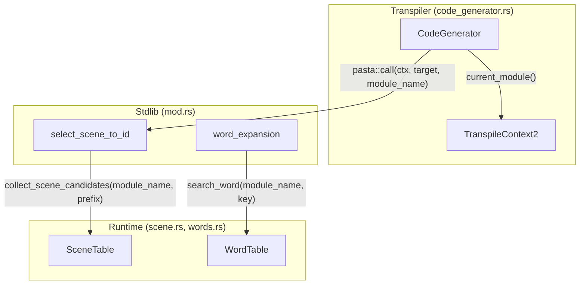
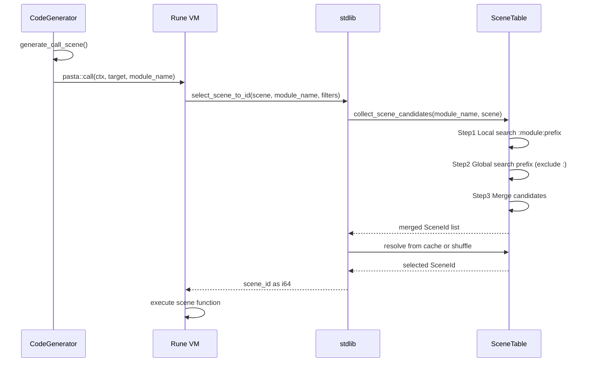

# Design Document: Call Unified Scope Resolution

**Updated**: 2025-12-24 (パーサー刷新に伴う再設計)

## Overview

**Purpose**: Call 文（＞シーン）のシーン解決スコープを単語検索（＠単語）と同一の「ローカル＋グローバル統合検索」に統一し、利用者の学習コスト削減と記述簡潔化を実現する。

**Users**: パスタスクリプト利用者が `＞シーン名` のみで、現在のグローバルシーン内のローカルシーン＋全グローバルシーンから前方一致候補を収集し、ランダムに1つ選択する。

**Impact**: SceneTable、CodeGenerator、stdlib の3レイヤーにわたるスコープ解決ロジックを変更。パーサー刷新により `JumpTarget` 列挙型は削除済み、`＊` 構文は非サポート。

### Goals
- Call 文と単語検索で同一のスコープ解決ロジック（ローカル＋グローバル統合検索）を適用
- `＞シーン名` のみで全候補からランダム選択可能にする
- 既存テストの互換性維持

### Non-Goals
- フィルター機能の拡張（既存仕様のまま）
- ~~JumpTarget 列挙型の変更~~ → **削除済み、対応不要**
- 検索優先順位の導入（完全ランダムマージ、ローカル優先なし）
- `＊` 構文の後方互換サポート → **新パーサーで非サポート、対応不要**

## Architecture

### Existing Architecture Analysis (2025-12-24 Updated)

**現在の実装**:
- **SceneTable**: `resolve_scene_id(search_key, filters)` は単純な前方一致検索（`module_name` 引数なし）
- **CodeGenerator**: `generate_call_scene()` は `pasta::call(ctx, "{target}")` を生成（`module_name` 未使用）
- **stdlib**: `select_scene_to_id(scene, filters)` は `module_name` 引数なし

**既存パターン（参照実装）**:
- **WordTable**: `collect_word_candidates(module_name, key)` が 2段階検索＋マージを実装済み
- **TranspileContext2**: `current_module()` / `set_current_module()` が既存（単語登録で使用中）
- **RadixMap**: 前方一致検索が両テーブルで共通

**✅ パーサー刷新による簡素化**:
- `JumpTarget` 列挙型は削除済み、`CallScene.target` は単純な `String` 型
- `＊` プレフィックス構文は非サポート（後方互換性対応不要）

### Architecture Pattern & Boundary Map



**Architecture Integration**:
- Selected pattern: 既存コンポーネント拡張（WordTable パターンの適用）
- Domain boundaries: Runtime 層でスコープ解決、Transpiler 層でコンテキスト伝播
- Existing patterns preserved: RadixMap 前方一致、キャッシュベース選択
- New components rationale: 新規コンポーネントなし（既存拡張のみ）
- Steering compliance: yield 型エンジン、2パス変換の原則維持

### Technology Stack

| Layer         | Choice / Version                  | Role in Feature        | Notes                   |
| ------------- | --------------------------------- | ---------------------- | ----------------------- |
| Runtime       | Rust 2024 + fast_radix_trie 1.1.0 | SceneTable 拡張        | 既存 RadixMap 活用      |
| Transpiler    | Rust 2024                         | code_generator.rs 修正 | `current_module()` 既存 |
| Stdlib        | Rune 0.14                         | 関数シグネチャ変更     | 内部 API のみ           |
| Specification | SPECIFICATION.md                  | Section 4 更新         | `＊` 構文削除           |

## System Flows

### Call 文実行フロー（変更後）



**Key Decisions**:
- `module_name` は CodeGenerator が `context.current_module()` から取得。常に **グローバルシーン名（親グローバルシーン）** を正確に反映
- 2段階検索はランタイムで実行（コンパイル時解決ではない）
- ローカルシーン内での Call 実行でも、`module_name` は親グローバルシーン名（`__start__` の場合、その親グローバルシーン名）

## Requirements Traceability

| Requirement             | Summary               | Components            | Interfaces                                     | Flows           |
| ----------------------- | --------------------- | --------------------- | ---------------------------------------------- | --------------- |
| 1.1, 1.2, 1.4           | スコープ統合検索      | SceneTable            | collect_scene_candidates()                     | Call 実行フロー |
| 2.2, 2.4                | シンプルなCall構文    | CodeGenerator, stdlib | generate_call_scene()                          | Pass2 処理      |
| 3.1, 3.2, 3.3, 3.4, 3.5 | ランタイム解決一貫性  | SceneTable            | collect_scene_candidates(), resolve_scene_id() | 2段階検索       |
| 4.2, 4.3, 4.4           | 既存テスト互換性      | 全コンポーネント      | 既存 API 維持                                  | 回帰テスト      |
| 5.1, 5.2, 5.3           | SPECIFICATION.md 更新 | ドキュメント          | -                                              | -               |

> **Note**: Requirement 2.1, 2.3, 4.1, 5.4 は「達成済み」または「不要」のため設計対象外

## Components and Interfaces

| Component          | Domain/Layer | Intent                   | Req Coverage | Key Dependencies       | Contracts      |
| ------------------ | ------------ | ------------------------ | ------------ | ---------------------- | -------------- |
| SceneTable         | Runtime      | シーン検索とランダム選択 | 1, 3         | RadixMap (P0)          | Service, State |
| CodeGenerator      | Transpiler   | Call 文 Rune コード生成  | 2            | TranspileContext2 (P0) | -              |
| select_scene_to_id | Stdlib       | シーン解決関数           | 2, 3         | SceneTable (P0)        | API            |

### Runtime Layer

#### SceneTable

| Field        | Detail                                           |
| ------------ | ------------------------------------------------ |
| Intent       | シーン検索とスコープ統合によるランダム選択を提供 |
| Requirements | 1.1, 1.2, 1.4, 3.1, 3.2, 3.3, 3.4, 3.5           |

**Responsibilities & Constraints**
- ローカル＋グローバルシーンの統合検索を実行
- キャッシュベースの順次消費（重複なし）でシーン選択
- module_name によるスコープコンテキストを管理

**Dependencies**
- Inbound: stdlib select_scene_to_id — シーン解決要求 (P0)
- External: fast_radix_trie RadixMap — 前方一致検索 (P0)

**Contracts**: Service [x] / State [x]

##### Service Interface

```rust
impl SceneTable {
    /// Collect all scene candidates using 2-stage search + merge.
    ///
    /// # Algorithm (WordTable.collect_word_candidates() と同一)
    /// 1. Local search: `:module_name:prefix` で前方一致
    /// 2. Global search: `prefix` で前方一致（`:` で始まるキーを除外）
    /// 3. Merge: 両方の SceneId をマージ
    ///
    /// # Arguments
    /// * `module_name` - グローバルシーン名
    /// * `prefix` - 検索プレフィックス
    ///
    /// # Returns
    /// Ok(Vec<SceneId>) マージされた候補リスト
    /// Err(SceneNotFound) 候補なし
    pub fn collect_scene_candidates(
        &self,
        module_name: &str,
        prefix: &str,
    ) -> Result<Vec<SceneId>, PastaError>;

    /// Resolve scene ID with unified scope search (local + global).
    ///
    /// 既存の resolve_scene_id() を拡張し、内部で collect_scene_candidates() を使用。
    ///
    /// # Arguments
    /// * `module_name` - グローバルシーン名（親グローバルシーン）
    /// * `search_key` - 検索キー
    /// * `filters` - 属性フィルター
    pub fn resolve_scene_id(
        &mut self,
        module_name: &str,
        search_key: &str,
        filters: &HashMap<String, String>,
    ) -> Result<SceneId, PastaError>;
}
```

- Preconditions: prefix は空でないこと
- Postconditions: 返却される SceneId は有効なインデックス
- Invariants: ローカル候補は `:module:` プレフィックスで区別

##### collect_scene_candidates Implementation Pattern (Pseudo-code)

```rust
pub fn collect_scene_candidates(
    &self,
    module_name: &str,
    prefix: &str,
) -> Result<Vec<SceneId>, PastaError> {
    if prefix.is_empty() {
        return Err(PastaError::InvalidScene { scene: prefix.to_string() });
    }

    let mut candidates = Vec::new();

    // Step 1: Local search with :{module_name}:{prefix} pattern
    let local_search_key = format!(":{module_name}:");
    for (_key, ids) in self.prefix_index.iter_prefix(local_search_key.as_bytes()) {
        candidates.extend(ids.iter().copied());
    }

    // Step 2: Global search with {prefix} pattern (exclude : prefix)
    for (key, ids) in self.prefix_index.iter_prefix(prefix.as_bytes()) {
        if !key.starts_with(b":") {
            candidates.extend(ids.iter().copied());
        }
    }

    // Step 3: Return merged candidate list
    if candidates.is_empty() {
        Err(PastaError::SceneNotFound { scene: prefix.to_string() })
    } else {
        Ok(candidates)
    }
}
```

**Algorithm Notes**:
- WordTable.collect_word_candidates() と完全同一パターン
- ローカル優先なし、完全ランダムマージ

##### State Management

```rust
/// Cache key for scene resolution (module_name + search_key + filters).
#[derive(Debug, Clone, PartialEq, Eq, Hash)]
struct SceneCacheKey {
    module_name: String,
    search_key: String,
    filters: Vec<(String, String)>,
}
```

- State model: HashMap<SceneCacheKey, CachedSelection>
- Persistence: メモリ内キャッシュ（セッション中のみ）
- Concurrency: Mutex による排他制御（既存パターン維持）
- **Cache Invalidation Strategy**: `module_name` 追加により、同一 `search_key` でも異なる `module_name` では異なるキャッシュキーが生成される。セッション終了時に自動クリア（既存 `clear()` メソッド継承）。モジュール再読み込みなどは現在未サポート（将来拡張候補）

**Implementation Notes**
- Integration: `WordTable.collect_word_candidates()` の実装パターンを完全継承（メソッド名も対称）
- Validation: prefix が空の場合は InvalidScene エラー
- Risks: キャッシュキー拡張によるメモリ使用量微増（許容範囲）

### Transpiler Layer

#### CodeGenerator (generate_call_scene)

| Field        | Detail                                                    |
| ------------ | --------------------------------------------------------- |
| Intent       | Call 文を Rune コードに変換し、module_name を引数に含める |
| Requirements | 2.2, 2.4                                                  |

**Responsibilities & Constraints**
- Call 文の Rune コード生成時に `self.context.current_module()` を埋め込む
- 単純な文字列 `target` を使用（`JumpTarget` 列挙型は削除済み）

**Dependencies**
- Inbound: generate_statement() — Statement::Call 変換 (P0)
- Outbound: TranspileContext2 — current_module() 取得 (P0)

**Implementation Notes**
- Integration: 既存の `generate_call_scene()` メソッドを1行変更
- 生成コード変更:
  ```rust
  // Before (L186-191)
  fn generate_call_scene(&mut self, call_scene: &CallScene) -> Result<(), TranspileError> {
      self.writeln(&format!(
          "for a in pasta::call(ctx, \"{}\") {{ yield a; }}",
          call_scene.target
      ))?;
      Ok(())
  }
  
  // After
  fn generate_call_scene(&mut self, call_scene: &CallScene) -> Result<(), TranspileError> {
      let module_name = self.context.current_module();
      self.writeln(&format!(
          "for a in pasta::call(ctx, \"{}\", \"{}\") {{ yield a; }}",
          call_scene.target,
          module_name
      ))?;
      Ok(())
  }
  ```

**Rune API Contract Details**:
- Rune VM が生成コードを実行時に `pasta::call(ctx, target, module_name)` を呼び出し
- `pasta::call()` は stdlib の `select_scene_to_id(scene, module_name, filters)` にルーティング
- `module_name` はグローバルシーン名（WordTable の `search_word(module_name, key)` と同一形式）

### Stdlib Layer

#### select_scene_to_id

| Field        | Detail                                 |
| ------------ | -------------------------------------- |
| Intent       | Rune VM から呼び出されるシーン解決関数 |
| Requirements | 2.2, 3.1                               |

**Contracts**: API [x]

##### API Contract

| Method             | Signature                                     | Request                     | Response | Errors |
| ------------------ | --------------------------------------------- | --------------------------- | -------- | ------ |
| select_scene_to_id | fn(String, String, Value, &Mutex<SceneTable>) | scene, module_name, filters | i64      | String |

**シグネチャ変更詳細**:
```rust
// Before (L91-94, stdlib/mod.rs)
pub fn select_scene_to_id(
    scene: String,
    filters: rune::runtime::Value,
    scene_table: &Mutex<SceneTable>,
) -> Result<i64, String>

// After (新シグネチャ)
pub fn select_scene_to_id(
    scene: String,
    module_name: String,        // 新規引数（位置: 2番目）
    filters: rune::runtime::Value,
    scene_table: &Mutex<SceneTable>,
) -> Result<i64, String> {
    let mut table = scene_table.lock().map_err(|e| e.to_string())?;
    
    // 統合スコープ検索を実行
    let filters_map = parse_filters(&filters)?;
    let scene_id = table.collect_scene_candidates(&module_name, &scene)?;
    
    // シーンID（1-based）を返却
    Ok((scene_id.0 + 1) as i64)
}
```

**実装上の注意点**:
- `module_name` は CodeGenerator が `context.current_module()` から取得（既実装）
- `collect_scene_candidates()` が2段階検索を実行（上記 pseudo-code 参照）
- 返却値は 1-based SceneId（既存慣例維持、Vec index + 1）
- 参照: `word_expansion()` 関数（stdlib/mod.rs）が同様に `module_name` を受け取り実装済み

## Data Models

### Domain Model

**SceneCacheKey（新規）**:
- module_name: 現在のグローバルシーン名
- search_key: 検索プレフィックス
- filters: 属性フィルター（ソート済み Vec）

**既存モデルへの影響**:
- SceneTable: cache フィールドのキー型を CacheKey → SceneCacheKey に変更
- SceneInfo: 変更なし（fn_name 形式維持）

### Logical Data Model

**prefix_index への登録**（WordTable 統一形式）:
- グローバルシーン: `{name}` 形式で登録（`::__start__` を除去）
- ローカルシーン: `:{parent}:{local}` 形式で登録（**キー変換**）

**キー変換ロジック** (SceneTable::from_scene_registry 内):
```rust
let search_key = if scene.parent.is_some() {
    // fn_name "会話_1::選択肢_1" → ":会話_1:選択肢_1"
    let parts: Vec<_> = scene.fn_name.split("::").collect();
    format!(":{}", parts.join(":"))
} else {
    // グローバル: "会話_1::__start__" → "会話_1"
    scene.fn_name.split("::").next().unwrap_or(&scene.fn_name).to_string()
};
```

**検索時のキー構築** (collect_scene_candidates 内):
- ローカル検索: `:{module_name}:{prefix}` で前方一致
- グローバル検索: `{prefix}` で前方一致（`:` で始まるキーを除外）

**WordTable との完全統一**: 両者のキー形式・検索ロジックが `:module:name` パターンで一致

## Error Handling

**新規エラーケース**: なし（既存エラー型で対応）
- SceneNotFound: 候補なし
- NoMatchingScene: フィルター条件で候補なし
- NoMoreScenes: キャッシュ枯渇

**既存との差異**: module_name 追加により、同一 search_key でも異なるエラー発生パターンが生じる可能性あり（ローカル候補の有無による）

## Testing Strategy

### Unit Tests

| Test Case                                 | Component  | Requirement   |
| ----------------------------------------- | ---------- | ------------- |
| collect_scene_candidates_local_only       | SceneTable | 3.1, 3.2      |
| collect_scene_candidates_global_only      | SceneTable | 3.1, 3.2      |
| collect_scene_candidates_local_and_global | SceneTable | 1.1, 1.2, 3.3 |
| collect_scene_candidates_prefix_match     | SceneTable | 1.1           |
| resolve_scene_id_with_cache               | SceneTable | 3.4           |

### Integration Tests

| Test Case                            | Scope      | Requirement |
| ------------------------------------ | ---------- | ----------- |
| call_local_scene_from_global_context | Engine E2E | 1.4, 4.2    |
| call_merged_local_and_global_scenes  | Engine E2E | 1.2, 3.3    |

### Regression Tests

- 既存の `cargo test --all` が全て成功すること（4.4）
- fixtures 内の `＞＊` 構文使用箇所: 0件（調査済み）

## Migration & Deployment

**破壊的変更**:
- stdlib select_scene_to_id 関数シグネチャ変更（内部 API）
- 既存生成 Rune コードは再生成が必要

**移行手順**:
1. SceneTable 拡張（collect_scene_candidates 追加）
2. stdlib シグネチャ変更
3. CodeGenerator generate_call_scene 変更
4. テスト更新・回帰確認
5. SPECIFICATION.md 更新

**ロールバック**: Git revert で対応可能（単一 PR 内で完結）

## Supporting References

詳細な調査結果は [research.md](research.md) を参照:
- WordTable 2段階検索パターンの詳細
- prefix_index 登録キー形式の分析
- TranspileContext2 current_module の確認
