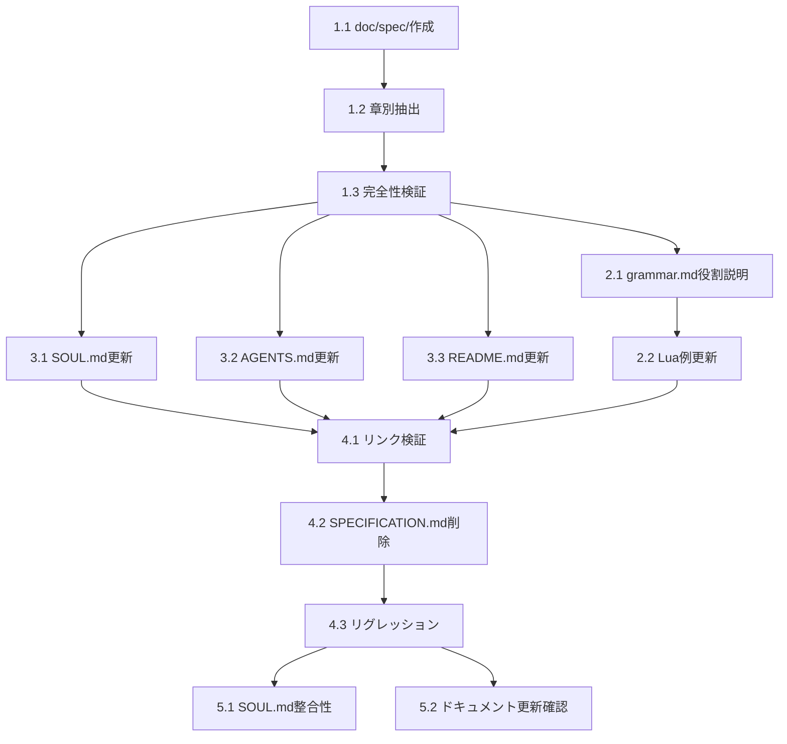

# Implementation Tasks

## Task Overview

**Feature**: doc-implementation-review  
**Total**: 4つの主要タスク（11サブタスク）  
**Target Requirements**: 1, 2, 3, 4, 6, 7, 8

---

## Task List

### Phase 1: SPECIFICATION.md分割準備

- [x] 1. doc/spec/ディレクトリの作成とインデックス構築 (P) ✅
- [x] 1.1 (P) doc/spec/ディレクトリを作成しREADME.mdを配置 ✅
  - doc/spec/ディレクトリを新規作成
  - README.md（インデックス）に章一覧と概要を記載
  - 各章へのナビゲーションリンク（相対パス）を追加
  - 「よくある参照パターン」セクションを含める（例: Call仕様→Chapter 4参照）
  - _Requirements: 3, 7_

- [x] 1.2 (P) SPECIFICATION.mdから章別ファイルを抽出 ✅
  - SPECIFICATION.mdの各章（1-12）を個別ファイル（01-12.md）にコピー
  - ファイル名: `01-grammar-model.md`, `02-markers.md`, ..., `12-future.md`
  - 章間参照を相対リンクに変換（`## 2.` → `[Chapter 2](02-markers.md)`）
  - 章13（参考資料）はREADME.mdに統合
  - _Requirements: 7_

- [x] 1.3 抽出内容の完全性検証 ✅
  - 全章ファイルを結合して仮想マージ版を生成
  - 元のSPECIFICATION.mdと差分比較（見出し番号除く）
  - 欠落・重複がないことを確認
  - 章間リンク変換の正確性を検証（`## 2.` → `[Chapter 2](02-markers.md)`）
  - _Requirements: 1, 7_

### Phase 2: steering/grammar.mdの役割明確化

- [x] 2. steering/grammar.mdをAI向け完全参照として再定義 (P) ✅
- [x] 2.1 (P) 役割説明セクションの追加 ✅
  - 冒頭に「このドキュメントの役割」セクションを追加
  - AI向け完全参照としてdoc/spec/準拠を明記
  - GRAMMAR.md（人間向け読みやすさ優先）との役割分離を記載
  - _Requirements: 2, 7_

- [x] 2.2 (P) Luaブロック例への更新 ✅
  - Runeブロック例をLuaブロック例に置換
  - 高頻度参照情報（マーカー一覧、基本パターン）を展開
  - 各セクションにdoc/spec/該当章への参照リンクを追加
  - _Requirements: 7_

### Phase 3: Level 1/Level 2ドキュメント更新

- [x] 3. Level 1ドキュメントのヒエラルキー再定義 ✅
- [x] 3.1 (P) SOUL.mdのLevel 2定義を更新 ✅
  - ドキュメントヒエラルキーセクションを再定義
  - Level 2を「実装層ドキュメント」として明記
  - クレートREADMEと品質管理ドキュメント（TEST_COVERAGE.md, OPTIMIZATION.md, SCENE_TABLE_REVIEW.md）を含める
  - _Requirements: 4_

- [x] 3.2 (P) AGENTS.mdのAI Context Loading Priorityを更新 ✅
  - AI Context Loading Priorityセクションを更新
  - SPECIFICATION.md参照をdoc/spec/README.mdへ変更
  - 「必要に応じて該当章のみ読み込み」の指針を追加
  - _Requirements: 1, 7_

- [x] 3.3 (P) README.mdのSPECIFICATION.md参照を更新 ✅
  - SPECIFICATION.md参照箇所をdoc/spec/README.mdへ置換
  - ドキュメントマップにdoc/spec/を追加
  - _Requirements: 1, 7_

- [x] 3.4 (P) TEST_COVERAGE.mdの数値確認 ✅
  - 総テスト数736, 日付2026-02-05の確認（更新済み）
  - pasta_luaテスト数230の確認（更新済み）
  - _Requirements: 6_

### Phase 4: 検証とクリーンアップ

- [x] 4. SPECIFICATION.md削除と最終検証 ✅
- [x] 4.1 全ドキュメントリンクの検証 ✅
  - doc/spec/内の相互リンクが有効か確認
  - steering/grammar.md → doc/spec/* への参照が機能するか確認
  - README.md, AGENTS.md等の参照が正しく更新されているか確認
  - _Requirements: 1, 7_

- [x] 4.2 SPECIFICATION.md削除 ✅
  - ルートのSPECIFICATION.mdを削除
  - doc/spec/README.mdが代替として機能することを確認
  - _Requirements: 7_

- [x] 4.3* doc/spec/構造のリグレッションテスト ✅
  - steering/*.md内のdoc/spec/参照が有効か確認
  - SOUL.mdのLevel 2定義が反映されているか確認
  - AGENTS.mdのAI Context Loading Priorityが更新されているか確認
  - cargo test --workspace: all tests passed
  - _Requirements: 1, 4, 7_

### 必須最終タスク: ドキュメント整合性確認

- [x] 5. ドキュメント整合性の確認と更新 ✅
- [x] 5.1 SOUL.mdとの整合性確認 ✅
  - コアバリュー（日本語フレンドリー、UNICODE識別子、yield型、宣言的フロー）への影響確認 → **影響なし**
  - 設計原則（行指向文法、前方一致、UI独立性）への影響確認 → **影響なし**
  - _Requirements: 1_

- [x] 5.2 該当ドキュメントの更新確認 ✅
  - SPECIFICATION.md → doc/spec/への移行が完了していることを確認 ✅
  - GRAMMAR.md の更新が不要であることを確認（人間向けマニュアル、役割分離維持） ✅
  - TEST_COVERAGE.md の更新が完了していることを確認 ✅
  - クレートREADMEの更新が不要であることを確認（API変更なし） ✅
  - steering/*.md の更新が完了していることを確認 ✅
  - _Requirements: 1, 7, 8_

---

## Task Dependencies

---

## Requirements Coverage

| Requirement                     | Tasks Covering                                        |
| ------------------------------- | ----------------------------------------------------- |
| 1: ドキュメント実装整合性評価   | 1.3, 3.2, 3.3, 4.1, 5.1, 5.2                          |
| 2: ドキュメント重複・冗長性検出 | 2.1                                                   |
| 3: 欠落ドキュメント特定         | 1.1                                                   |
| 4: ヒエラルキー整合性           | 3.1, 4.3, 5.1                                         |
| 6: 品質管理ドキュメント整合性   | 3.4                                                   |
| 7: Steeringドキュメント整合性   | 1.1, 1.2, 1.3, 2.1, 2.2, 3.2, 3.3, 4.1, 4.2, 4.3, 5.2 |
| 8: アクションプラン策定         | 5.2                                                   |

**Note**: Requirement 5（クレートREADME整合性）は既に整合済みのため、タスク不要（gap-analysis.mdで確認済み）

---

## Task Execution Notes

- **Parallel Tasks**: `(P)` マーク付きタスクは並列実行可能
- **Average Task Size**: 1-3 hours per sub-task
- **Testing Strategy**: 各フェーズ完了後にリンク検証・内容検証を実施
- **Migration Safety**: Phase 4までSPECIFICATION.mdを保持し、検証後に削除

---

## Next Steps

✅ **Implementation Complete** (2025-01-XX)

1. ~~タスクレビュー: 各タスクの粒度と順序を確認~~ ✅
2. ~~承認: `/kiro-spec-impl doc-implementation-review` で実装開始~~ ✅
3. ~~実装中: 各タスク完了時にチェックボックスを更新~~ ✅
4. ~~完了後: `cargo test --workspace` 実行、ドキュメント更新確認、仕様アーカイブ~~ ✅

### Implementation Summary

- **doc/spec/**: Created with README.md + 12 chapter files (01-12.md)
- **steering/grammar.md**: Complete rewrite with AI-first design, Lua examples, role clarification
- **SOUL.md**: Level 2 hierarchy updated with quality docs
- **AGENTS.md**: AI Context Loading Priority updated to reference doc/spec/
- **README.md**: SPECIFICATION.md references updated to doc/spec/
- **SPECIFICATION.md**: Deleted (replaced by doc/spec/)

### Test Results

- `cargo test --workspace`: All tests passed (3 passed, 0 failed, 9 ignored)
