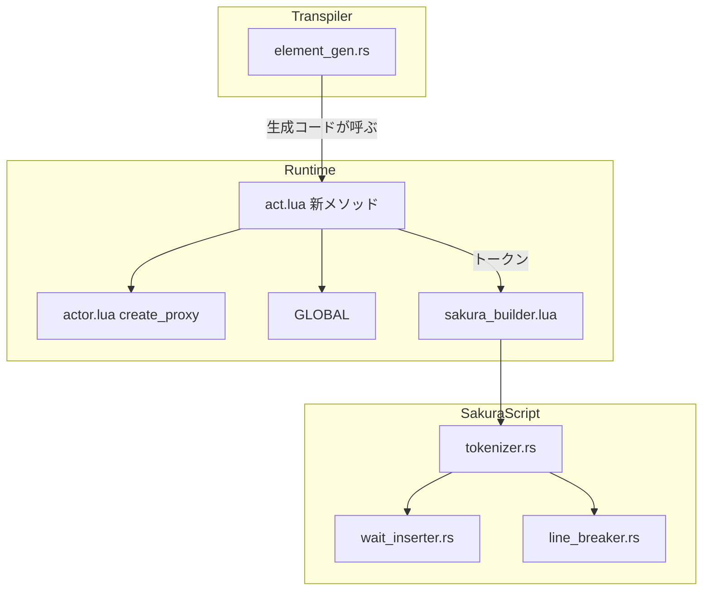

# Design Document: dsl-codegen-runtime-safety

## Overview

**Purpose**: Pasta DSL の書き間違い（未定義の `＠＊関数（）`・未登録アクター・act のメンバー名と同名のアクター・数値にできない算術）と、アクション行の `\\` が、イベント全体の実行時エラー（SHIORI 500）や壊れたさくらスクリプトにならないようにする。

**Users**: Pasta DSL で辞書を書くゴースト作者。書き間違えてもゴーストは黙らず、警告ログで原因（参照した名前）が分かる。

**Impact**: トランスパイラの出力形を「Lua の直接アクセス」から「act の存在確認付きメソッド経由」に変える。`act.lua` に 3 メソッドを足し、さくらスクリプトのトークナイザが `\\` を 1 単位として読むようにする。書き間違いを含まない辞書の最終出力（さくらスクリプト）は変わらない。生成コードの行数も変わらない（1 アクション＝1 行）。

### Goals
- U18・U19・U20・U22 の書き間違いで 500 にならず、「警告ログ＋既定の結果」で続く。
- アクション行の `\\` が `\` 1 文字の表示になり、ウェイト挿入・改行推定で割れない。
- 生成コードの形の変更後も、正常系の最終出力とソースマップの行対応が変わらない。
- マニュアルとスキル `references/` が新しい形と一致する。

### Non-Goals
- 文字列連結（`string-concat-operator`）。算術ヘルパーは数値専用で、連結を見越した引数・分岐を持たない。
- アクタープロキシが ACT 前提の関数に渡る問題（`actor-proxy-act-delegation`）、Call の生成形（`call-execution-correctness`）、文字列リテラル・単語値の `\\`（`dsl-literal-fixes`）。
- ロード時の静的検査、警告の重複抑止（同じ警告を 1 回にまとめる状態管理）、欠け全般をバルーンに出す機能。
- 手書き Lua の `act.名前` の解決規則の変更。

## Boundary Commitments

### This Spec Owns
- `element_gen.rs` の出力形: アクション行のアクター参照、`＠＊名前（…）`（アクション・式）、算術式（Binary）、`Action::Escape` の `\\`。
- `act.lua` の新メソッド 3 つ（`actor_proxy`・`global_fn`・`arith`）とその警告文。
- さくらスクリプトのタグパターン（`tokenizer.rs` の `SAKURA_TAG_PATTERN`）に `\\` を 1 単位として加えること。
- 上記を固定するテスト、生成形に依存する既存テスト・スナップショット・フィクスチャの更新。
- マニュアル該当章の更新、スキル `references/` の再生成、手書き `SKILL.md` の該当行。

### Out of Boundary
- `actor.lua`（`PROXY_IMPL`・`ACTOR.get_or_create`・`ACTOR.create_proxy`）の変更。呼ぶだけで変えない。
- `pasta_dsl` の文法・パーサ（式の AST が優先順位なしの左結合で組まれる点を含む。生成側で吸収する）。
- `shiori/event/*`、`sakura_builder.lua`、`appearance.lua`、`act.lua` のグループ化（`group_by_actor`・`merge_consecutive_talks`）、`ACT_IMPL.__index`、`find_act_handler`。
- `scope_gen.rs`（`％` 行の `set_spot`・Call・ファイルヘッダ）。
- `STORE.actors`・`STORE.actor_spots` への書き込み。

### Allowed Dependencies
- `act.lua` → `pasta.actor`（`ACTOR.create_proxy` の呼び出しのみ）、`pasta.global`（`GLOBAL` の読み取りのみ）、`@pasta_log`。いずれも既存の require。
- `element_gen.rs` → `StringLiteralizer`、`resolve_var_path`（既存）。`pasta_dsl` の AST は読むだけ。
- 依存の向き: 生成コード → act のメソッド → actor／GLOBAL。逆向き（actor.lua から act の新メソッドを呼ぶ等）は作らない。
- 新しいクレート・Lua モジュールは追加しない。

### Revalidation Triggers
- `act:actor_proxy`・`act:global_fn`・`act:arith` の名前・引数・戻り値の変更（`actor-proxy-act-delegation`・`string-concat-operator`・`call-execution-correctness` が前提にする）。
- アクション行の生成形（`act:actor_proxy("名前"):メソッド(…)`）の変更。
- その場限りのアクターの形（`{ name = 名前 }` のみ・未登録）の変更（`act-token-grouping-fix` のグループ化・`sakura_builder.lua` が読む）。
- `SAKURA_TAG_PATTERN` の再変更（`appearance.lua` のタグ読みと対で保つ）。
- `pasta_dsl` の式の AST の組み方（優先順位なしの左結合。`build_left_assoc_expr`）の変更。Wave 1 では `dsl-literal-fixes` がパーサを持つ。組み方が変わると生成側の優先順位の組み直しが結果を変えうるため、「変更前の平らな Lua 式と同じ値になる」テスト（Testing Strategy／Integration 1）を必須の関門とする。
- `PROXY_IMPL` が登録済みアクター固有のフィールド・メタテーブルを要求するようになった場合（`scene-search-key-normalization` が `actor.lua` を持つ）。

## Architecture

### Existing Architecture Analysis
- 生成コードは 1 アクション＝1 行。`generate_action` が `out_line` の差分で `record_span` を呼ぶ。式は `generate_expr_to_buffer` の 1 か所に集約され、代入・式文・引数・Call 引数・動的コール・プロパティ代入のすべてが通る。
- `act.名前` は `ACT_IMPL.__index`（メソッド → `self.actors[名前]` → nil）で解決する。U19 は nil、U20 はメソッド・実フィールドが先に返るのが原因。`％` 行は既に `act:set_spot("名前", n)` と名前を文字列で渡す。
- `ACTOR.create_proxy(actor, act)` は任意のテーブルを受ける。`PROXY_IMPL` が読むのは `actor.name` と `actor[key]`（単語の A1）だけで、メタテーブルも `STORE.actors` への登録も要求しない。→ `actor.lua` を変えずにその場限りのアクターを作れる。
- `SHIORI_ACT.new(STORE.actors, req)` のため、`self.actors` は `STORE.actors` そのもの。`self.actors[名前]` が「登録済み」の判定になる（`set_spot` と同じ基準）。
- 式の AST は `build_left_assoc_expr` が優先順位なしの左結合で組む（`1＋2＊3` は `(1＋2)＊3` の木）。現行は演算子を平らに出力して Lua の優先順位に任せている。**木のとおりに入れ子の呼び出しにすると結果が変わるため、生成側で優先順位を組み直す。**
- 最終組み立ては talk・sakura_script とも `talk_to_script` を通る。トークナイザは `\\` を知らないため、`\`（一般文字。直後にウェイトが入りうる）＋次の `\…` に割れる。`appearance.lua` の `next_tag`・`scan_leading_text` は既に `\\` を読み飛ばす・一般文字として扱う（変更不要）。

### Architecture Pattern & Boundary Map



**Architecture Integration**:
- Selected pattern: 既存コンポーネントの拡張（research.md の Option A）。`act:expr_fn`（警告＋nil）・`act:set_spot`（名前を文字列で受ける）・`dynamic_ref_args`（警告用の説明文字列を渡す）の前例に沿う。
- 変更するのは図の `ElementGen`・`ActSafety`・`Tokenizer` の 3 点だけ。`Actor`・`Builder`・`WaitInserter`・`LineBreaker` は無変更（`LineBreaker` は同じ正規表現を受け取るため自動的に効く）。
- 新コンポーネントなし。専用ランタイムモジュール（Option B）はファイルヘッダの変更でスナップショットの揺れが広がり、後続仕様の前提（act にプロキシ取得口がある）から外れるため採らない。

### Technology Stack

| Layer | Choice / Version | Role in Feature | Notes |
|-------|------------------|-----------------|-------|
| Transpiler | Rust（`pasta_lua::code_gen`） | 生成形の変更・算術の優先順位の組み直し | 新規依存なし |
| Runtime | Lua（LuaJIT 2.1 / mlua） | act の 3 メソッド | `tonumber` を使う |
| SakuraScript | Rust `regex` | `SAKURA_TAG_PATTERN` に選択肢を 1 つ追加 | 線形時間の保証は変わらない |
| Docs | mdBook・`book/tools/gen-skill-refs.mjs`・`link-check.mjs` | マニュアル更新・スキル再生成 | 既存ツールを使うだけ |

## File Structure Plan

### Modified Files
- `crates/pasta_lua/src/code_gen/element_gen.rs` — `generate_action` の全アームのアクター参照、`FnScope::Global` の 2 か所、`Expr::Binary`、`Action::Escape`。算術の優先順位の組み直しと被演算子の説明文字列を作る私的関数を足す。
- `crates/pasta_lua/src/code_gen/element_gen_tests.rs` — 上記の単体テスト（生成形・優先順位・Escape）。
- `crates/pasta_lua/pasta_scripts/pasta/act.lua` — `ACT_IMPL.actor_proxy`・`ACT_IMPL.global_fn`・`ACT_IMPL.arith` を追加。既存関数は変更しない。
- `crates/pasta_lua/src/sakura_script/tokenizer.rs` — `SAKURA_TAG_PATTERN` の先頭に `\\\\` の選択肢を追加、ドキュメントコメントと単体テスト。
- `crates/pasta_lua/src/sakura_script/line_breaker.rs` — テストのみ追加（`\\` の間・直前で壊れないこと）。本体は無変更。
- `crates/pasta_lua/tests/transpiler/snapshots/*.snap`（22 件前後）・`tests/transpiler/*.rs`（7 件）・`tests/fixtures/sample.expected.lua`・`sample.generated.lua`・`tests/property_scope_codegen_test.rs`・`tests/property_token_preservation_test.rs` — 生成形の期待値を新しい形に更新。行数・行対応の期待値は変えない。
- `book/src/grammar/action-line.md`・`grammar/variables.md`・`grammar/words.md`・`lua/script-api.md`・`lua/patterns.md`・`lua/modules/pasta-sakura-script.md`・`internals/internal-modules.md`・`internals/transpiler.md`・`internals/talk-output.md`・`internals/registry-search.md` — 生成形・挙動・`\\`・新メソッドの記述。
- `.claude/skills/pasta-ghost-authoring/references/*`・`.claude/skills/pasta-lua-coding/references/*` — 生成スクリプトで再生成（手で編集しない）。
- `.claude/skills/pasta-ghost-authoring/SKILL.md`（`＠＊func()` の展開先・エスケープ・算術）・`.claude/skills/pasta-lua-coding/SKILL.md` — 手書き部分をマニュアルにそろえる。

### New Files
- `crates/pasta_lua/tests/lua_specs/act_runtime_safety_test.lua` — 3 メソッドのランタイムテスト（既存 `act_test.lua` を膨らませないため分ける）。
- `crates/pasta_lua/tests/transpiler/runtime_safety_test.rs` ＋スナップショット — 5 件の書き間違いを含む `.pasta` の生成形と、生成コードを実行して例外にならないこと。
- `crates/pasta_shiori/tests/codegen_runtime_safety_e2e_test.rs` ＋ `tests/fixtures/codegen_runtime_safety/` — SHIORI リクエスト経由で 500 にならないこと。既存 E2E のハーネス（`common`・`support`）の流儀に合わせる。

### 触らないファイル（境界の確認用）
- `crates/pasta_lua/pasta_scripts/pasta/actor.lua`、`pasta/shiori/sakura_builder.lua`、`pasta/shiori/appearance.lua`、`pasta/shiori/event/*`、`crates/pasta_dsl/**`、`crates/pasta_lua/src/code_gen/scope_gen.rs`、`sakura_script/wait_inserter.rs`。

## System Flows

### 未登録アクターの行（U19）

```mermaid
sequenceDiagram
    participant Gen as 生成コード
    participant Act as act
    participant Actor as ACTOR
    participant Builder as sakura_builder
    Gen->>Act: actor_proxy 名前
    Act->>Act: self.actors に無い
    Act->>Act: 直前の話者が同じ未登録名か
    alt 同じ
        Act->>Act: その actor テーブルを再利用
    else 違う
        Act->>Act: 新しい actor テーブルを作る
        Act->>Act: 警告ログと目印の talk トークン
    end
    Act->>Actor: create_proxy
    Actor-->>Gen: プロキシ
    Gen->>Act: talk などは通常どおり
    Act->>Builder: build 時にスポット未設定で 0 と既存の警告
```

- 「直前の話者」は `self.token` を末尾から見て最初に当たる talk／sakura_script トークンの `actor`。その `name` が同じで `self.actors[名前]` が nil なら同じテーブルを返す。これで同じ話者の連続アクションが 1 つのグループになり（`group_by_actor` はテーブルの同一性で切り替えを判定する）、目印と警告は話者が未登録アクターに切り替わったときに 1 回だけ出る。
- 状態を act にも `STORE` にも持たない（キャッシュ用フィールドを足さない）。yield・build でトークンが空になれば、次の発言で目印が再び付く。

### 算術の生成（U22）
1. 左結合の Binary の連なりを、項と演算子の列に平らに戻す（`Paren` は 1 つの項）。
2. `＊`・`／`・`％` を左から畳み、次に `＋`・`－` を左から畳む（Lua の優先順位・結合と同じ）。
3. 畳んだ各ノードを `act:arith("op", 左, 右, 左の説明, 右の説明)` として入れ子に出力する。`Paren` は従来どおり `( … )` で囲む。

## Requirements Traceability

| Requirement | Summary | Components | Interfaces | Flows |
|-------------|---------|------------|------------|-------|
| 1.1 | アクション行の未定義 `＠＊` は空＋警告 | ElementGen, ActSafety | `act:global_fn` → nil、`talk(nil)` は何も積まない | — |
| 1.2 | 式の未定義 `＠＊` は値なし＋警告 | ElementGen, ActSafety | `act:global_fn` | — |
| 1.3 | 関数でない値も同じ | ActSafety | `type(f) == "function"` で判定 | — |
| 1.4 | 定義済みは従来どおり act を第 1 引数に | ActSafety | `f(self, ...)`。プロキシ経由にしない | — |
| 1.5 | 警告レベルをそろえる | ActSafety | `log.warn` | — |
| 2.1 | 登録済みアクターは同じ最終出力 | ElementGen, ActSafety | `act:actor_proxy` が `ACTOR.create_proxy(self.actors[名前], self)` を返す | — |
| 2.2 | メンバー名と同名のアクター | ElementGen, ActSafety | 名前を文字列で渡し `__index` を通らない | — |
| 2.3 | 未登録は登録せず立ち位置 0・警告 | ActSafety | その場限りの `{ name }`、既存のスポット未設定→0 | 未登録アクターの行 |
| 2.4 | 目印を常に表示・未登録の行だけ | ActSafety | 目印の talk トークン。`global_fn`・`arith` は目印を出さない | 未登録アクターの行 |
| 2.5 | 行内の関数・単語・さくらスクリプトは通常どおり | ActSafety | 通常の `PROXY_IMPL` を使う（A1・A2 は空振りして act の検索へ） | 未登録アクターの行 |
| 2.6 | 登録状態を残さない | ActSafety | `STORE.actors`・`self.actors` に書かない。`ACTOR.get_or_create` を呼ばない | — |
| 2.7 | 手書き `act.名前` 不変 | ActSafety | `ACT_IMPL.__index` 無変更 | — |
| 2.8 | `％` 行の未登録は無視のまま | —（`scope_gen.rs`・`set_spot` 無変更） | — | — |
| 3.1 | 正常な算術は同じ結果 | ElementGen, ActSafety | 優先順位の組み直し＋ネイティブ演算 | 算術の生成 |
| 3.2 | 数値にできない被演算子は値なし＋警告 | ElementGen, ActSafety | `act:arith` と説明文字列 | 算術の生成 |
| 3.3 | 入れ子の失敗は値なしで伝わる | ActSafety | nil 被演算子 → nil（説明なしの nil は警告しない） | — |
| 3.4 | 代入後は未代入と同じ | —（既存の `talk(値, パス)` の警告） | — | — |
| 3.5 | 文字列の `＋` は連結しない | ActSafety | `tonumber` に失敗 → 3.2 | — |
| 3.6 | 式を書ける全位置に適用 | ElementGen | `generate_expr_to_buffer` の Binary アーム 1 か所 | — |
| 3.7 | 数値化の範囲は現行どおり | ActSafety | 文字列は `tonumber(s)`（基数なし） | — |
| 4.1 | `\\` を最終出力に `\\` で出す | ElementGen | Escape アームが 2 文字を talk | — |
| 4.2 | 直後の文字とタグにならない | Tokenizer | `\\\\` の選択肢を先頭に | — |
| 4.3 | 行末でも `\e` を壊さない | ElementGen, Tokenizer | `\\` ＋ `\e` | — |
| 4.4 | `\\\\` は 2 文字 | Tokenizer | 2 単位として一致 | — |
| 4.5 | 2 文字の間に何も挿入しない | Tokenizer（WaitInserter・LineBreaker は自動） | `TokenKind::SakuraScript` として 1 トークン | — |
| 4.6 | 表示文字として扱う | ElementGen | talk 経路（非空 talk → has-text が立つ） | — |
| 4.7 | `＠＠`・`＄＄`・タグは不変 | ElementGen | Escape アームは 2 文字目が `\` のときだけ分岐 | — |
| 5.1 | 正常系の最終出力は同じ | 全体 | 既存のランタイム・SHIORI テストが無変更で通る | — |
| 5.2 | SHIORI 経由で 500 にならない | Tests | `codegen_runtime_safety_e2e_test.rs` | — |
| 5.3 | ローカル `＠`・単語・動的参照・変数参照は不変 | ElementGen | 該当アームはアクター参照の置換だけ | — |
| 5.4 | 行対応を保つ | ElementGen | 1 アクション 1 行・`record_span` 無変更 | — |
| 5.5 | 5 件を自動テストで固定 | Tests | Testing Strategy | — |
| 6.1 | action-line.md | Manual | — | — |
| 6.2 | variables.md | Manual | — | — |
| 6.3 | script-api.md（新メソッドを一覧に） | Manual | — | — |
| 6.4 | internals 各章 | Manual | — | — |
| 6.5 | `references/` 再生成・照合・リンク検証 | Manual | `gen-skill-refs.mjs --check`・`link-check.mjs` | — |
| 6.6 | 手書き SKILL.md | Manual | — | — |
| 6.7 | コード例は読み込み可能 | Manual | 既存の検証ツール | — |

## Components and Interfaces

| Component | Layer | Intent | Req Coverage | Key Dependencies | Contracts |
|-----------|-------|--------|--------------|------------------|-----------|
| ElementGen | Transpiler | 生成形を act のメソッド経由にする | 1.1, 1.2, 2.1, 2.2, 3.1, 3.2, 3.6, 4.1, 4.3, 4.6, 4.7, 5.3, 5.4 | ActSafety (P0) | Service |
| ActSafety | Runtime | 存在確認付きの 3 メソッド | 1.1–1.5, 2.1–2.7, 3.1–3.5, 3.7 | ACTOR.create_proxy (P0), GLOBAL (P0), log (P1) | Service |
| Tokenizer | SakuraScript | `\\` を 1 単位として読む | 4.2, 4.4, 4.5 | regex (P0) | Service |
| Tests | Test | 回帰の固定 | 5.1, 5.2, 5.5 | — | — |
| Manual | Docs | マニュアル・スキルの同期 | 6.1–6.7 | gen-skill-refs (P0) | — |

### Transpiler

#### ElementGen（`element_gen.rs`）

| Field | Detail |
|-------|--------|
| Intent | アクター参照・グローバル関数・算術・`\\` の出力形を変える |
| Requirements | 1.1, 1.2, 2.1, 2.2, 3.1, 3.2, 3.6, 4.1, 4.3, 4.6, 4.7, 5.3, 5.4 |

**生成形の対応**（`A` はアクター名、`"A"` は `StringLiteralizer::literalize` の結果）

| DSL | 変更前 | 変更後 |
|-----|--------|--------|
| 台詞 | `act.A:talk("x")` | `act:actor_proxy("A"):talk("x")` |
| `＠単語` | `act.A:talk(act.A:word("w"))` | `act:actor_proxy("A"):talk(act:actor_proxy("A"):word("w"))` |
| `＄変数` | `act.A:talk(var.x, "var.x")` | `act:actor_proxy("A"):talk(var.x, "var.x")` |
| `＠関数（）` | `act.A:talk((act.A:expr_fn("f")))` | `act:actor_proxy("A"):talk((act:actor_proxy("A"):expr_fn("f")))` |
| `＠＊関数（a）`（アクション） | `act.A:talk((GLOBAL.f(act, a)))` | `act:actor_proxy("A"):talk((act:global_fn("f", a)))` |
| `＠＊関数（a）`（式） | `GLOBAL.f(act, a)` | `act:global_fn("f", a)` |
| さくらスクリプト | `act.A:sakura_script("\\n")` | `act:actor_proxy("A"):sakura_script("\\n")` |
| `＠＠`・`＄＄` | `act.A:talk("@")` | `act:actor_proxy("A"):talk("@")`（1 文字のまま） |
| `\\` | `act.A:talk(<\ 1 文字>)` | `act:actor_proxy("A"):talk(<\\ 2 文字>)` |
| `＄x＋1` | `var.x + 1` | `act:arith("+", var.x, 1, "var.x")` |
| `1＋2＊＄y` | `1 + 2 * var.y` | `act:arith("+", 1, act:arith("*", 2, var.y, nil, "var.y"))` |
| `（＄x＋1）＊2` | `(var.x + 1) * 2` | `act:arith("*", (act:arith("+", var.x, 1, "var.x")), 2)` |

動的単語参照・動的関数呼び出し・プロパティ参照のアームも、`act.A` を `act:actor_proxy("A")` に置き換えるだけで、引数は変えない。

**Responsibilities & Constraints**
- 1 アクション＝1 行（`writeln` 1 回）を保つ。`record_span` の呼び出し位置は変えない。
- アクター名・関数名は文字列リテラルで渡す（Lua の予約語と同じ名前でも構文エラーにならない）。
- 算術: 「System Flows／算術の生成」の手順で優先順位を組み直す。パーサが作らない形（右辺が Binary）の木は、右辺を 1 つの項として再帰的に出力する。
- 被演算子の説明文字列（警告用）:

  | 被演算子 | 説明 | 例 |
  |----------|------|----|
  | 変数参照 | `resolve_var_path` の文字列 | `"var.x"`・`"save.x"`・`"args[1]"` |
  | ローカル関数呼び出し | `@名前()` | `"@f()"` |
  | グローバル関数呼び出し | `@*名前()` | `"@*f()"` |
  | 動的関数呼び出し | `@$パス()` | `"@$var.f()"` |
  | 括弧 | 中身が上のいずれかならその説明、それ以外は nil | — |
  | リテラル・入れ子の算術 | nil（出力しない） | — |

  説明が両方 nil なら引数を省く。右だけあるときは左に `nil` を置く。
- Escape アーム: 2 文字目が `\` のときは 2 文字（`\\`）をそのまま talk で出す。それ以外（`＠＠`・`＄＄`）は従来どおり 2 文字目だけを出す。

**Dependencies**
- Outbound: ActSafety — 生成コードが呼ぶ 3 メソッド (P0)
- Inbound: `scope_gen.rs` — `generate_action_line`・`generate_continue_action`・式生成の呼び出し（無変更）

**Contracts**: Service [x]

**Implementation Notes**
- Integration: 生成形の変更でスナップショットが広く変わる。差分は「`act.A` → `act:actor_proxy("A")`」「`GLOBAL.f(act` → `act:global_fn("f"`」「算術」「`\\`」の 4 種類だけであることをレビューで確かめる。
- Validation: 優先順位の組み直しは、変更前の平らな出力を Lua が評価した結果と一致することをテストで固定する（Testing Strategy）。
- Risks: 優先順位の組み直しを誤ると正常な式の結果が変わる（3.1 の回帰）。

### Runtime

#### ActSafety（`act.lua` の `ACT_IMPL`）

| Field | Detail |
|-------|--------|
| Intent | 生成コードから呼ぶ、存在確認付きの 3 メソッド |
| Requirements | 1.1–1.5, 2.1–2.7, 3.1–3.5, 3.7 |

**Contracts**: Service [x]

##### Service Interface

```lua
--- アクター名からプロキシを得る。登録済みならそのアクター、未登録ならその場限りのアクター。
--- @param self Act
--- @param name string アクター名
--- @return ActorProxy 常に非 nil
function ACT_IMPL.actor_proxy(self, name) end

--- GLOBAL の関数を名前で呼ぶ。
--- @param self Act
--- @param name string 関数名
--- @param ... any 関数に渡す引数（第 1 引数の act は自動で付く）
--- @return any ... 関数の戻り値すべて。関数が無い・関数でないときは nil
function ACT_IMPL.global_fn(self, name, ...) end

--- 数値の二項演算。
--- @param self Act
--- @param op string "+" | "-" | "*" | "/" | "%"
--- @param lhs any 左の被演算子
--- @param rhs any 右の被演算子
--- @param lhs_desc string|nil 左の説明（警告用。変数パス・関数名）
--- @param rhs_desc string|nil 右の説明
--- @return number|nil 演算結果。どちらかが数値にできないときは nil
function ACT_IMPL.arith(self, op, lhs, rhs, lhs_desc, rhs_desc) end
```

**`actor_proxy`**
- Preconditions: なし（どんな `name` でも例外にしない）。
- Postconditions:
  - `self.actors[name]` があれば `ACTOR.create_proxy(self.actors[name], self)` を返す。ログ・トークンは出さない（従来の `act.名前` と同じ結果）。
  - 無ければ、その場限りのアクター（`{ name = name }` のみ。メタテーブルなし）のプロキシを返す。直前の話者が同じ未登録名なら、そのトークンの `actor` テーブルを再利用し、ログ・目印は出さない。そうでなければ新しいテーブルを作り、警告ログを 1 行出し、目印の talk トークン `{ type = "talk", actor = その場限りのアクター, text = 目印 }` を 1 つ積む。
- Invariants: `STORE.actors`・`self.actors`・`STORE.actor_spots` に書かない。`ACTOR.get_or_create` を呼ばない。act にフィールドを足さない。
- 目印の文言: `【未登録アクター：名前】`（talk トークンのため、後続の台詞と連結され、ウェイト・改行推定も台詞と同じ扱いになる）。
- 警告: `act:actor_proxy - unregistered actor: name='名前'`

**`global_fn`**
- Postconditions: `GLOBAL[name]` が関数なら `f(self, ...)` の戻り値をすべて返す（第 1 引数は常に act）。それ以外は警告して nil。関数の中で起きたエラーは従来どおり伝わる（握りつぶさない）。
- 警告: `act:global_fn - function not found: key='名前'`（`log.warn`。`act:expr_fn` の警告と同じレベル）

**`arith`**
- 数値化: 被演算子が number ならそのまま、string なら `tonumber(s)`、それ以外（nil・boolean・table など）は数値にできない。
- Postconditions: 両方が数値になれば、Lua のネイティブ演算（`+ - * / %`）の結果を返す。どちらかが数値にできなければ nil。
- 警告: 数値にできなかった被演算子ごとに 1 行。ただし値が nil で説明も nil の被演算子（＝内側の算術が既に失敗して警告済み）は警告しない。
  - 説明あり: `act:arith - operand is not a number: op='+', operand='var.x', value=nil`
  - 説明なし: `act:arith - operand is not a number: op='+', value='a' (string)`
- テーブルの被演算子は数値にできない扱い（nil＋警告）。`__add` などのメタメソッドは呼ばない（通常の DSL からは届かない。変更前は呼ばれていた点だけが違う）。
- Invariants: act の状態を読まない・書かない。未知の `op` は生成コードからは来ない（来たら警告して nil）。

**Dependencies**
- Outbound: `ACTOR.create_proxy` (P0)、`GLOBAL` (P0)、`@pasta_log` (P1)
- Inbound: 生成コード (P0)、手書き Lua（公開メソッドとして呼べる）

**Implementation Notes**
- Integration: `SHIORI_ACT_IMPL` は `ACT.IMPL` を継承するため追加作業なし。
- 名前の衝突: 3 つの名前は act のメンバー名になるため、(a) 手書き Lua の `act.actor_proxy` などはメソッドが返る（既存の制限の一覧に 3 つ増える）、(b) `＠名前（）`・`＠名前` の検索の 3 段目（act のメソッド）にも当たる。1・2 段目（シーンのローカル関数・ローカル辞書）が先に当たるため、シーン内の定義は影響を受けない。4 段目の `GLOBAL` に同名の関数がある場合は `＠名前（）` では届かなくなる（`＠＊名前（）` は `GLOBAL` だけを見るため届く）。同名のアクターは本仕様の生成形で問題なく話せる。マニュアルの一覧に明記する。
- 警告の回数: 発生のたびに出す（重複抑止の状態は持たない）。未登録アクターは話者の切り替わりごとに `act:actor_proxy` の警告 1 行と、build 時の既存の `actor_spots fallback` 警告 1 行が出る。
- Risks: その場限りのアクターの行にサーフェスタグ等があると、`STORE.appearance` にその名前の外見の記録が残る（`appearance.lua` は境界外）。アクターとしての登録ではなく、`％` 行・アクション行・`act.名前` からは見えないため 2.6 には反しないと判断する。

### SakuraScript

#### Tokenizer（`tokenizer.rs`）

| Field | Detail |
|-------|--------|
| Intent | `\\` を分割できない 1 単位として読む |
| Requirements | 4.2, 4.4, 4.5 |

- `SAKURA_TAG_PATTERN` を `\\\\|\\[0-9a-zA-Z_!+*?&-]+(?:\[[^\]]*\])?` にする（`\\` 2 文字の選択肢を先頭に置く。左優先で一致するため `C:\\new` は `\\`＋`new` になる）。
- 一致したトークンは既存どおり `TokenKind::SakuraScript`。`wait_inserter` はこの種別にウェイトを付けず、`line_breaker` は幅 0 の付随タグとして前の文字に付けたまま運ぶ。どちらも本体の変更は不要。
- 影響範囲: `talk_to_script`・`break_lines` を通るすべての文字列（手書き Lua の talk 文字列中の `\\` を含む。要件の Boundary Context どおり改善方向）。
- 表示文字としての扱い（4.6）は talk 経路（has-text）で満たす。`\` 1 文字ぶんのウェイトが無いことと、改行推定の幅に数えないことは許容する（1 文字ぶんの誤差）。
- `appearance.lua` は既に `\\` を読み飛ばす（`next_tag`）・一般文字として扱う（`scan_leading_text`）ため変更しない。`\\s[0]` を表情タグと読み誤らないことを回帰テストで固定する。

## Error Handling

### Error Strategy
実行時の書き間違いは「警告ログ＋既定の結果」で続ける。例外は投げない。作者の Lua 関数の中のエラーは握りつぶさない（従来どおり `xpcall` → 500）。

| 事象 | 既定の結果 | 警告 | バルーン |
|------|-----------|------|----------|
| 未定義・関数でない `＠＊名前（）` | nil（アクション行では何も出力しない） | `act:global_fn - function not found` | なし |
| 未登録アクターの行 | その場限りのアクターで発言（立ち位置 0） | `act:actor_proxy - unregistered actor` ＋既存の `actor_spots fallback` | 目印 `【未登録アクター：名前】` |
| 数値にできない被演算子 | nil | `act:arith - operand is not a number`（被演算子ごと。入れ子の伝播は無警告） | なし |
| `\\` | `\\` を出力 | なし | `\` 1 文字 |

### Monitoring
既存の `@pasta_log`（`[logging]` の設定に従う）に `warn` で出す。新しい設定・出力先は足さない。

## Testing Strategy

### Unit Tests
1. `element_gen_tests.rs`: 各アクションアームが `act:actor_proxy("A"):…` を 1 行で出す。アクター名が `talk`・`var`・`end` でも同じ形になる（2.2）。
2. `element_gen_tests.rs`: 算術の生成形。`1＋2＊3`・`1－2－3`・`（1＋2）＊3`・`＄x＋＠f（）＊2` の入れ子と説明文字列（3.1, 3.2）。
3. `element_gen_tests.rs`: Escape アーム。`\\` は 2 文字、`＠＠`・`＄＄` は 1 文字（4.1, 4.7）。
4. `tokenizer.rs`: `C:\\new`・行末の `\\`・`\\\\`・`\\\n`・`\\s[0]` のトークン列（4.2–4.5）。既存のタグのトークン列が変わらない（4.7）。
5. `line_breaker.rs`・`wait_inserter` 経由: ウェイトあり・`budoux` ありで `\\` の間に `\_w[…]`・`\n` が入らない（4.5）。

### Runtime Tests（`lua_specs/act_runtime_safety_test.lua`）
1. `act:global_fn`: 定義済みは `(act, 引数…)` で呼ばれ戻り値を返す／未定義・非関数は nil＋警告 1 行（1.1–1.5）。
2. `act:actor_proxy`: 登録済みは `act.名前` と同じトークン／`talk`・`var`・`save`・`actors` という名前の登録済みアクターが話せる（2.1, 2.2）。
3. `act:actor_proxy`: 未登録は、目印＋台詞が同じ actor テーブルで積まれ、1 行に複数アクションでも目印・警告は 1 回。実行後 `STORE.actors[名前]` は nil、`act.名前` は nil のまま（2.3–2.7）。
4. `act:arith`: 数値・数値文字列・`「1」＋2`・負数の `％`・0 除算が、ネイティブ演算と同じ結果（3.1）。数値化の範囲が `tonumber` と暗黙変換で一致することを、16 進・指数・前後の空白・全角数字・空文字列の表で固定（3.7）。
5. `act:arith`: nil・非数値文字列・boolean は nil＋警告（演算子と説明を含む）。入れ子で外側は nil・追加の警告なし（3.2, 3.3, 3.5）。
6. `appearance`: `\\s[0]` を含む talk を観測しても表情の記録が変わらない（4.2）。

### Integration Tests
1. `tests/transpiler/runtime_safety_test.rs`: 5 件の書き間違いを含む `.pasta` をトランスパイル→実行し、例外にならず、期待したトークン・変数状態になる（5.5）。算術は、同じ式の「変更前の平らな Lua 式」を評価した値と一致することを式の一覧で確かめる（3.1）。
2. 既存スナップショット・フィクスチャの更新。`source_map_seam_test.rs`・`loader_source_map_build_test.rs` の行対応（行番号）の期待値は変えない（`source_map_seam_test.rs` が比較する生成コード文字列は新しい形に更新する）（5.4）。
3. 既存のランタイム・SHIORI テスト（最終出力を比較するもの）が、期待値を変えずに通る（5.1, 5.3）。

### E2E Tests（`pasta_shiori/tests/codegen_runtime_safety_e2e_test.rs`）
1. U18・U19・U20・U22 を含むシーンを SHIORI リクエストで起動し、ステータスが 500 でなく、既定の結果に置き換えたトークが返る（5.2）。U19 は目印と `\p[0]` を含む。
2. U08: `C:\\new`・行末 `\\` を含むシーンの応答が `C:\\new`・`\\\e` を含み、ウェイト設定ありでも `\\` が割れない（4.1–4.3）。

### Docs Checks
- `gen-skill-refs.mjs --check` と `link-check.mjs` が成功する（6.5）。マニュアルに足した pasta コード例が既存の検証で読み込める（6.7）。

## Migration Strategy
- データ移行なし。生成コードはロードのたびに作り直されるため、キャッシュ済みの旧形式は残らない（残る構成がある場合は実装時に確認する）。
- 実装順: (1) `act.lua` の 3 メソッドとランタイムテスト → (2) トークナイザ → (3) `element_gen.rs` とスナップショット更新 → (4) E2E → (5) マニュアル・スキル。(1)(2) は互いに独立で、(3) は (1) に依存する。

## Open Questions（設計ディスカッションへの申し送り）

設計ディスカッション（2026-10-04）ですべて確定し、本文に反映済み。

| ID | 対象の節 | 論点 | 選択肢 | 本ドラフトの仮定 |
|----|----------|------|--------|------------------|
| ~~DQ-1~~ | System Flows／未登録アクターの行、ActSafety `actor_proxy` | 目印を付ける単位 | (a) 話者が未登録アクターに切り替わるたびに 1 回（同じ未登録アクターの連続行は 1 回。生成形に手を入れない）／(b) 行ごとに必ず 1 回（生成コードが行頭を示す引数を渡す。全アクション行の先頭アクションの形が変わる） | 確定（議題 1）: (a)。連続行の台詞は現行でも区切りなく連結されて 1 つの発言になるため。R2.4 の文面も「話者の切り替わりごとに 1 回」に合わせた |
| ~~DQ-2~~ | ActSafety `actor_proxy` | 目印の文言 | `【未登録アクター：名前】`／`（未登録：名前）`／ほか | 確定（議題 2）: `【未登録アクター：名前】`（talk トークン）。隅付き括弧は台詞と紛れず、「アクター」はマニュアルの用語で調べられる |
| ~~DQ-3~~ | ActSafety／Implementation Notes | メソッド名と検索 3 段目・メンバー一覧への影響 | (a) `actor_proxy`・`global_fn`・`arith`（前例 `expr_fn`・`set_spot` と同じ素の名前。公開 API として載せる）／(b) `_` 始まりなど衝突しにくい名前／(c) `arith` だけ act の外に置く | 確定（議題 3）: (a)。3 つとも公開 API としてマニュアルの一覧に載せる。`GLOBAL` の同名関数に `＠名前（）` で届かなくなる制限は、既存の act メソッドと同じ種類のものとして明記する |
| ~~DQ-4~~ | Tokenizer | `\\` のトークン種別 | (a) タグ扱い（ウェイトなし・幅 0。変更は正規表現 1 行）／(b) 専用の種別を足し、ウェイト 1 文字ぶん・幅 1 として数える（`wait_inserter`・`line_breaker` も変更） | 確定（議題 4）: (a)。ウェイトと改行幅の 1 文字ぶんの誤差は許容する。必要になれば後から種別を足せる |
| ~~DQ-5~~ | Boundary Commitments | `sakura_script/tokenizer.rs` はロードマップの持ち場（`element_gen.rs`・`act.lua`）に載っていない | 本仕様で持つ／別 spec に切り出す | 確定: 本仕様で持つ（Wave 1 のほかの spec の持ち場と重ならない。U08 は生成側だけでは 4.5 を満たせない）。ロードマップの持ち場に追記済み |
| ~~DQ-6~~ | ElementGen／説明文字列、ActSafety `arith` | 警告に出す被演算子の名前の形 | (a) Lua のパス（`var.x`。既存の `act:talk - undefined variable: 'var.x'` と同じ）／(b) DSL の書き方（`＄x`） | 確定: (a)。既存の警告と形をそろえる |
| ~~DQ-7~~ | ActSafety／Implementation Notes | 警告の回数 | 発生のたび（入れ子の算術は根本原因 1 回、未登録アクターは話者の切り替わりごと）／同じ内容は 1 回に抑止 | 確定: 発生のたび。抑止の状態は持たない（Non-Goals） |
| ~~DQ-8~~ | ActSafety／Risks | 未登録アクターの行のサーフェスタグが `STORE.appearance` に名前付きで残る | 許容／本仕様で `appearance` 側に手を入れる（境界外） | 確定: 許容（アクターの登録ではなく、`appearance.lua` は境界外） |
