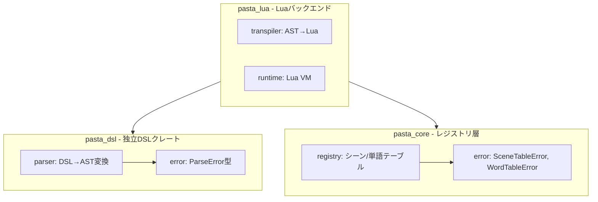
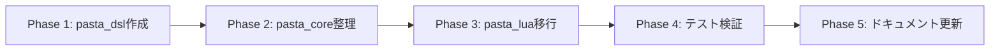

# Technical Design: dsl-separation

## Overview

pasta_coreクレートは現在、DSLパーサー（Pest文法 + AST定義）とレジストリ（シーン/単語テーブル管理）を一体提供しているが、これらは本質的に独立した関心事である。本機能は、DSL固有部分を新規クレート `pasta_dsl` として抽出し、DSLパーサーを単独で利用・テスト・差し替えできるようにする。

**Purpose**: Pasta DSLのパーサー・AST定義を独立クレートとして提供し、Luaバックエンドに依存しない新しいバックエンド実装を容易にする。

**Users**: 外部開発者がpasta_dslのみを依存に追加してPasta DSLのパースを行えるようになる。内部的にはpasta_luaがpasta_dslに直接依存する。

**Impact**: 既存のpasta_coreからparserモジュールを完全除去し、pasta_dslクレートに移動する。下流クレート（pasta_lua）の依存関係を `pasta_core::parser` から `pasta_dsl::parser` に変更する。

### Goals
- pasta_dslクレートの新規作成と独立利用性の確保
- pasta_coreからのparser完全除去（再エクスポートなし）
- 下流クレート（pasta_lua）のpasta_dsl直接依存への移行
- 26テストの移動とテストスイート完全性の維持
- ドキュメント・ステアリングのアーキテクチャ図更新

### Non-Goals
- parser実装ロジックの変更・最適化（既存実装をそのまま移動）
- registry層の変更（完全に独立しているため影響なし）
- pasta_shioriの変更（pasta_core::parserへの参照がないため）
- 新機能の追加（純粋なリファクタリング）

## Architecture

### Existing Architecture Analysis

**現在の構造** (Before):
```
pasta_core
├── parser/          # DSLパーサー（Pest文法、AST定義）
├── registry/        # シーン/単語テーブル管理
└── error.rs         # ParseError + SceneTableError + WordTableError（混在）

pasta_lua → pasta_core（parser + registry）
```

**制約と結合度**:
- parser ↔ registry: **完全独立**（相互参照なし）
- parser → error: `ParseError` のみ使用
- registry → error: registry自体はエラー型を使用しない（error.rsに定義のみ存在）
- pasta_lua → pasta_core::parser: 10箇所の `use` 文 + 多数のフルパス参照
- pasta_shiori → pasta_core::parser: **参照なし**

**発見**: parser と registry の完全疎結合により、分離は安全に実行可能。

### Architecture Pattern & Boundary Map

**新しい構造** (After):


**Architecture Integration**:
- **選択パターン**: Complete Separation（完全分離）
- **Domain境界**: 
  - `pasta_dsl`: DSL固有の関心事（文法、AST、パースエラー）
  - `pasta_core`: レジストリ層とユーティリティ（シーン/単語検索、ランダム選択）
  - `pasta_lua`: Luaバックエンド固有の関心事（トランスパイル、実行）
- **既存パターンの維持**: Pure Virtual Workspace構成を維持
- **新コンポーネントの根拠**: pasta_dsl は独立DSLパーサーとして外部開発者が単独利用可能
- **ステアリング準拠**: レイヤー分離原則（Language-independent Layer → Backend Layer）に準拠

### Technology Stack

| Layer          | Choice / Version | Role in Feature     | Notes                                 |
| -------------- | ---------------- | ------------------- | ------------------------------------- |
| Parser         | Pest 2.8         | PEG文法解析エンジン | grammar.pest を使用してDSLをASTに変換 |
| Error Handling | thiserror 2      | エラー型生成マクロ  | ParseError の derive(Error) に使用    |
| Workspace      | Cargo Workspace  | クレート依存管理    | pasta_dsl を新規メンバーとして追加    |
| Build          | pest_derive 2.8  | ビルド時コード生成  | grammar.pest から PastaParser2 を生成 |

**備考**: tracing 依存は pasta_core に残す（parser で未使用）。pest, pest_derive, thiserror のみが pasta_dsl の依存となる。

## System Flows

（単純なファイル移動・import パス変更のため、フローダイアグラムは不要）

## Requirements Traceability

| Requirement                            | Summary                  | Components                                      | Interfaces                                  | Flows |
| -------------------------------------- | ------------------------ | ----------------------------------------------- | ------------------------------------------- | ----- |
| 1.1, 1.2, 1.3, 1.4                     | DSLクレート抽出          | pasta_dsl (parser, error)                       | parse_str(), parse_file(), ParseError       | -     |
| 2.1, 2.2, 2.3, 2.4, 2.5                | pasta_core整理と下流移行 | pasta_core (lib.rs変更), pasta_lua (import変更) | -                                           | -     |
| 3.1, 3.2, 3.3, 3.4                     | ワークスペース統合       | Cargo.toml (workspace, pasta_dsl)               | -                                           | -     |
| 4.1, 4.2, 4.3, 4.4, 4.5, 4.6           | 独立利用性               | pasta_dsl (Cargo.toml, tests移動)               | 26テスト移動                                | -     |
| 5.1, 5.2, 5.3                          | エラー型分離             | pasta_dsl/error.rs, pasta_core/error.rs         | ParseError, SceneTableError, WordTableError | -     |
| 6.1, 6.2, 6.3, 6.4, 6.5, 6.6, 6.7, 6.8 | ドキュメント更新         | 8ドキュメントファイル                           | -                                           | -     |

## Components and Interfaces

| Component             | Domain/Layer         | Intent                       | Req Coverage | Key Dependencies (P0/P1)        | Contracts      |
| --------------------- | -------------------- | ---------------------------- | ------------ | ------------------------------- | -------------- |
| pasta_dsl             | Language-independent | DSLパーサー・AST定義を提供   | 1, 4, 5      | pest (P0), thiserror (P0)       | Service, State |
| pasta_core (更新)     | Language-independent | レジストリ層とユーティリティ | 2, 5         | fast_radix_trie (P0), rand (P0) | Service        |
| pasta_lua (更新)      | Backend              | Luaバックエンド実装          | 2, 5         | pasta_dsl (P0), pasta_core (P0) | -              |
| Workspace Cargo.toml  | Infrastructure       | クレート依存管理             | 3            | -                               | -              |
| ドキュメント8ファイル | Documentation        | アーキテクチャ図の整合性     | 6            | -                               | -              |

### Language-independent Layer

#### pasta_dsl

| Field        | Detail                                                               |
| ------------ | -------------------------------------------------------------------- |
| Intent       | Pasta DSLのパーサー・AST定義・パースエラー型を独立クレートとして提供 |
| Requirements | 1.1, 1.2, 1.3, 1.4, 4.1, 4.2, 4.3, 4.4, 4.5, 4.6, 5.1                |

**Responsibilities & Constraints**
- DSL文法定義（grammar.pest）の所有
- AST型定義（FileItem, PastaFile, GlobalSceneScope, Action等）の提供
- parse_str(), parse_file() によるパース機能の提供
- ParseError, ParseErrorInfo の独立定義・公開
- レジストリ・Luaランタイムへの依存を持たない（完全独立）

**Dependencies**
- Outbound: pest 2.8 — PEG文法解析エンジン (P0)
- Outbound: pest_derive 2.8 — ビルド時パーサー生成 (P0)
- Outbound: thiserror 2 — エラー型生成マクロ (P0)

**Contracts**: Service [x] / State [x]

##### Service Interface
```rust
// pasta_dsl/src/parser/mod.rs
pub fn parse_str(source: &str, filename: &str) -> ParseResult<PastaFile>;
pub fn parse_file<P: AsRef<Path>>(path: P) -> ParseResult<PastaFile>;

// pasta_dsl/src/error.rs
pub type ParseResult<T> = Result<T, ParseError>;

#[derive(Debug, Clone)]
pub struct ParseError {
    pub info: ParseErrorInfo,
}

#[derive(Debug, Clone)]
pub struct ParseErrorInfo {
    pub filename: String,
    pub line: usize,
    pub column: usize,
    pub message: String,
}
```

- Preconditions: source は有効なUTF-8文字列、filename は参照用の識別子
- Postconditions: 成功時は PastaFile を返す、失敗時は ParseError を返す
- Invariants: grammar.pest の文法定義に準拠したパース結果のみを返す

##### State Management
- State model: Pest パーサーはステートレス、PastaFile AST は不変
- Persistence: なし（インメモリのみ）
- Concurrency: ステートレスのため複数スレッドから安全に呼び出し可能

**Implementation Notes**
- Integration: 既存の `crates/pasta_core/src/parser/` をそのまま `crates/pasta_dsl/src/parser/` に移動
- Validation: `cargo test -p pasta_dsl` で26テストが成功することを確認
- Risks: parser内部での `use crate::error::ParseError` は移動後も同一クレート内で完結するため、変更不要

#### pasta_core (更新)

| Field        | Detail                                                           |
| ------------ | ---------------------------------------------------------------- |
| Intent       | parserモジュールを完全除去し、レジストリ層とユーティリティに特化 |
| Requirements | 2.1, 2.2, 2.4, 5.2                                               |

**Responsibilities & Constraints**
- parserモジュール・ParseError型の完全除去
- registryモジュール（SceneRegistry, WordDefRegistry, SceneTable, WordTable, RandomSelector）の維持
- SceneTableError, WordTableError の定義・公開
- pasta_dslへの依存を持たない（完全分離）

**Dependencies**
- Outbound: fast_radix_trie 1.1.0 — 前方一致シーン検索 (P0)
- Outbound: rand 0.9 — ランダム選択（重複シーン、前方一致候補） (P0)
- Outbound: thiserror 2 — エラー型生成マクロ (P0)
- Outbound: tracing 0.1 — ロギング・診断 (P1)

**Contracts**: Service [x] / State [x]

##### Service Interface
```rust
// pasta_core/src/lib.rs (After)
pub mod error;
pub mod registry;

// 再エクスポート（parserは除外）
pub use error::{SceneTableError, SceneTableResult, WordTableError, WordTableResult};
pub use registry::{
    DefaultRandomSelector, MockRandomSelector, RandomSelector, SceneEntry, SceneId, SceneInfo,
    SceneRegistry, SceneScope, SceneTable, WordCacheKey, WordDefRegistry, WordEntry, WordTable,
};

// ParseError, parser関連の再エクスポートは完全削除
```

- Preconditions: parserモジュールへの内部参照がないこと
- Postconditions: registryのみを公開APIとして提供
- Invariants: pasta_dslへの依存がない状態を維持

**Implementation Notes**
- Integration: `pub mod parser;` と `pub use parser::*;` を lib.rs から削除
- Validation: `cargo test -p pasta_core` で残りの104テストが成功することを確認
- Risks: pasta_lua の変更前に実行すると依存解決エラーが発生するため、pasta_dsl 作成と pasta_lua 変更を同時に実施

### Backend Layer

#### pasta_lua (更新)

| Field        | Detail                                                 |
| ------------ | ------------------------------------------------------ |
| Intent       | pasta_core::parser への参照を pasta_dsl::parser に変更 |
| Requirements | 2.3, 5.3                                               |

**Responsibilities & Constraints**
- pasta_dsl を直接依存に追加
- `use pasta_core::parser::*;` を `use pasta_dsl::parser::*;` に変更
- `pasta_core::ParseError` を `pasta_dsl::ParseError` に変更
- pasta_core への依存は registry 層のみに限定

**Dependencies**
- Outbound: pasta_dsl — DSLパーサー・AST定義 (P0)
- Outbound: pasta_core — レジストリ層 (P0)
- Outbound: mlua 0.11 — Lua VMバインディング (P0)

**Contracts**: Service [ ] / API [ ] / Event [ ] / Batch [ ] / State [ ]

**Implementation Notes**
- Integration: Cargo.toml に `pasta_dsl.workspace = true` を追加し、4ファイルの import パスを一括変更
- Validation: `cargo test -p pasta_lua` で既存のすべてのテストが成功することを確認
- Risks: import パス変更漏れを grep で検出し、`cargo build --workspace` で依存解決を確認

### Infrastructure

#### Workspace Cargo.toml

| Field        | Detail                                                 |
| ------------ | ------------------------------------------------------ |
| Intent       | pasta_dsl をワークスペースメンバーおよび依存として追加 |
| Requirements | 3.1, 3.2                                               |

**Responsibilities & Constraints**
- `members = ["crates/*"]` に pasta_dsl が自動的に含まれる
- `[workspace.dependencies]` に pasta_dsl エントリを追加
- ワークスペース全体のビルド・テストが成功すること

**Implementation Notes**
- Integration: `[workspace.dependencies]` セクションに `pasta_dsl = { path = "crates/pasta_dsl", version = "0.1.3" }` を追加
- Validation: `cargo build --workspace` および `cargo test --all` で全クレートが成功することを確認
- Risks: バージョン指定を他のクレートと一致させる（0.1.3）

#### pasta_dsl/Cargo.toml

**新規作成**:
```toml
[package]
name = "pasta_dsl"
version.workspace = true
edition.workspace = true
authors.workspace = true
license.workspace = true
publish = true
description = "Pasta DSL - Independent DSL parser and AST definitions"
repository.workspace = true
homepage.workspace = true
documentation.workspace = true

[dependencies]
pest.workspace = true
pest_derive.workspace = true
thiserror.workspace = true
```

### Testing

#### テスト移動（4ファイル、26テスト）

**移動対象ファイル**:
1. `crates/pasta_core/tests/actor_code_block_test.rs` → `crates/pasta_dsl/tests/actor_code_block_test.rs` (3テスト)
2. `crates/pasta_core/tests/digit_id_var_test.rs` → `crates/pasta_dsl/tests/digit_id_var_test.rs` (4テスト)
3. `crates/pasta_core/tests/sakura_symbol_tag_test.rs` → `crates/pasta_dsl/tests/sakura_symbol_tag_test.rs` (7テスト)
4. `crates/pasta_core/tests/span_byte_offset_test.rs` → `crates/pasta_dsl/tests/span_byte_offset_test.rs` (12テスト)

**変更内容**:
- `use pasta_core::parser::{...};` → `use pasta_dsl::parser::{...};`
- テストロジックは完全に同一

**検証**:
- `cargo test -p pasta_dsl` で26テストが成功
- `cargo test -p pasta_core` で残りの104テストが成功
- `cargo test --all` で全テストが成功

### Documentation

#### ドキュメント更新対象（8ファイル）

| ファイル                      | 更新内容                                                                          | 要件 |
| ----------------------------- | --------------------------------------------------------------------------------- | ---- |
| README.md                     | レイヤー構成図とディレクトリツリーに pasta_dsl を追加                             | 6.1  |
| SOUL.md                       | Level 2 クレートREADMEリストに pasta_dsl を追加                                   | 6.2  |
| .kiro/steering/tech.md        | ワークスペースレイヤー構成図とクレート責務テーブルに pasta_dsl を追加             | 6.3  |
| .kiro/steering/structure.md   | ディレクトリ構造ツリー、ワークスペース構成図、レイヤー分離原則に pasta_dsl を追加 | 6.4  |
| crates/pasta_core/README.md   | アーキテクチャ図を更新し、parserモジュール除去を反映                              | 6.5  |
| crates/pasta_lua/README.md    | 依存関係セクションに pasta_dsl への直接依存を反映                                 | 6.6  |
| crates/pasta_shiori/README.md | 依存関係テーブルに pasta_dsl の位置付けを反映                                     | 6.7  |
| TEST_COVERAGE.md              | クレート一覧に pasta_dsl を追加、pasta_core のテスト数を更新（130→104）           | 6.8  |

**Implementation Notes**
- Integration: 各ドキュメントの構成図を手動更新（テキスト編集）
- Validation: すべてのドキュメントで pasta_dsl が正しく記載されていることを目視確認
- Risks: 更新漏れを防ぐため、8ファイルをチェックリスト化

## Data Models

（このリファクタリングはデータモデルの変更を含まないため、省略）

## Error Handling

### Error Strategy
既存のエラー型定義を維持したまま、3つのカテゴリに分離する：

1. **ParseError** → pasta_dsl に移動
2. **SceneTableError** → pasta_core に残留
3. **WordTableError** → pasta_core に残留

### Error Categories and Responses

**ParseError** (pasta_dsl):
- Pest パースエラー → `ParseErrorInfo` に変換し、ファイル名・行番号・列番号・メッセージを含む
- ユーザー向けメッセージ: 文法エラーの位置と内容を明示

**SceneTableError** (pasta_core):
- シーンテーブル操作エラー → シーン名重複、未登録シーンアクセス等
- ユーザー向けメッセージ: シーン名を含むエラーメッセージ

**WordTableError** (pasta_core):
- 単語テーブル操作エラー → 単語名重複、未登録単語アクセス等
- ユーザー向けメッセージ: 単語名を含むエラーメッセージ

## Testing Strategy

### Unit Tests
- pasta_dsl: 26テスト（移動後）
  - `actor_code_block_test.rs`: アクターコードブロック解析（3テスト）
  - `digit_id_var_test.rs`: 数字ID変数解析（4テスト）
  - `sakura_symbol_tag_test.rs`: さくらスクリプトシンボルタグ解析（7テスト）
  - `span_byte_offset_test.rs`: バイトオフセット・行列番号計算（12テスト）
- pasta_core: 104テスト（移動後も維持）
  - registry内部テスト（シーン検索、単語検索、ランダム選択）

### Integration Tests
- pasta_lua: 既存のトランスパイル・ランタイムテスト（変更なし）
- pasta_shiori: SHIORI APIエントリポイントテスト（変更なし）
- ワークスペース: `cargo test --all` で全テストが成功

### E2E/UI Tests
- 該当なし（このリファクタリングはエンドユーザー向け機能に影響しない）

### Performance/Load
- 該当なし（パフォーマンス特性は変更なし）

## Migration Strategy

### フェーズ分解



**Phase 1: pasta_dsl作成**
1. `crates/pasta_dsl/` ディレクトリ作成
2. `Cargo.toml` 作成（pest, pest_derive, thiserror 依存）
3. `src/lib.rs` 作成（pub mod parser, pub mod error）
4. `src/parser/` ディレクトリ作成
5. `mod.rs`, `ast.rs`, `grammar.pest` を pasta_core から移動
6. `src/error.rs` 作成、ParseError/ParseErrorInfo/ParseResult を pasta_core/error.rs から移動
7. `tests/` ディレクトリ作成、4テストファイルを移動、import パス変更
8. `README.md` 新規作成（独立DSLパーサーとしての説明、使用例、依存関係を記載）
9. `cargo test -p pasta_dsl` で26テスト成功を確認

**Phase 2: pasta_core整理**
1. `crates/pasta_core/src/lib.rs` から `pub mod parser;` と `pub use parser::*;` を削除
2. `crates/pasta_core/src/error.rs` から ParseError/ParseErrorInfo/ParseResult を削除
3. `crates/pasta_core/tests/` から4テストファイルを削除
4. `crates/pasta_core/src/parser/` ディレクトリを削除（完全除去）
5. `crates/pasta_core/Cargo.toml` から pest, pest_derive を削除（ステップ1-4完了後に実行、dependency unused 警告回避のため）
6. `cargo test -p pasta_core` で104テスト成功を確認

**Phase 3: pasta_lua移行**
1. `crates/pasta_lua/Cargo.toml` に `pasta_dsl.workspace = true` を追加
2. 4ファイル（code_generator.rs, context.rs, transpiler.rs, runtime/mod.rs等）の import パスを変更
   - `use pasta_core::parser::{...};` → `use pasta_dsl::parser::{...};`
   - `pasta_core::ParseError` → `pasta_dsl::ParseError`
3. `cargo test -p pasta_lua` で既存テスト成功を確認

**Phase 4: ワークスペース統合とテスト検証**
1. `Cargo.toml` の `[workspace.dependencies]` に pasta_dsl エントリを追加
2. `cargo build --workspace` で依存解決成功を確認
3. `cargo test --all` で全テスト成功を確認

**Phase 5: ドキュメント更新**
1. README.md, SOUL.md, tech.md, structure.md, pasta_core/README.md, pasta_lua/README.md, pasta_shiori/README.md, TEST_COVERAGE.md の8ファイルを更新
2. 各ドキュメントで pasta_dsl の記載を確認

### Rollback Triggers
- Phase 1: pasta_dsl のテストが失敗する場合 → ファイル移動を取り消し
- Phase 2: pasta_core のテストが失敗する場合 → lib.rs と error.rs の変更を取り消し
- Phase 3: pasta_lua のテストが失敗する場合 → import パス変更を取り消し
- Phase 4: ワークスペースビルドが失敗する場合 → 依存設定を取り消し

### Validation Checkpoints
- Checkpoint 1 (Phase 1完了): `cargo test -p pasta_dsl` で26テスト成功
- Checkpoint 2 (Phase 2完了): `cargo test -p pasta_core` で104テスト成功
- Checkpoint 3 (Phase 3完了): `cargo test -p pasta_lua` で既存テスト成功
- Checkpoint 4 (Phase 4完了): `cargo test --all` で全テスト成功
- Checkpoint 5 (Phase 5完了): 8ドキュメントファイルの整合性確認

## Supporting References

（該当なし - すべての設計判断は本ドキュメント内で完結）
