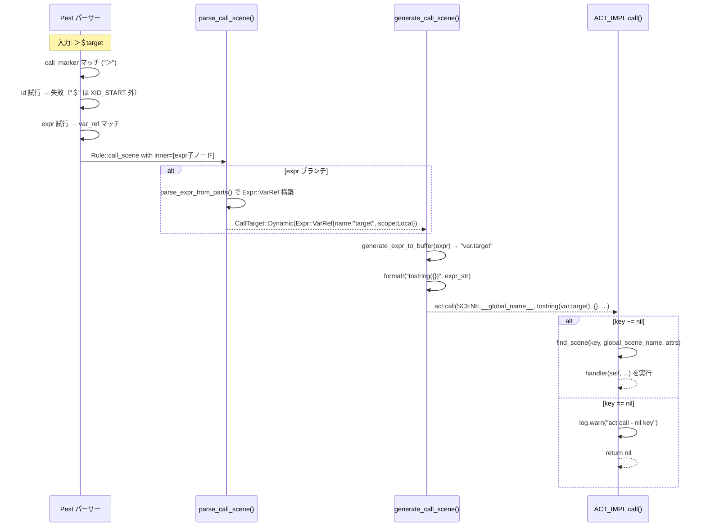
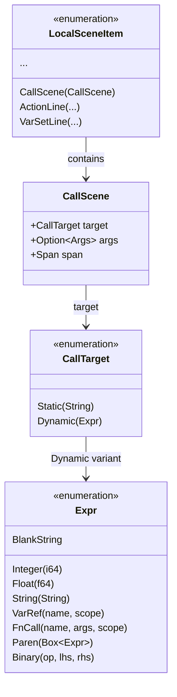

# 設計書: dynamic-call-variable

## 概要

**目的**: Pasta DSL のコールターゲット文法を `＞id` から `＞(id | expr)` に拡張し、式の評価結果をシーン名として動的に解決可能にする。`＞＄変数名` は `expr` の `var_ref` として自然に処理される。

**ユーザー**: ゴースト辞書の作者が `.pasta` ファイルで動的コール（`＞＄target`、`＞（＠func（））`等）を記述し、式の評価結果に基づくシーンディスパッチを実現する。

**影響**: `call_scene` PEG ルール・`CallScene` AST 型・パーサー・コードジェネレーターを外科的に拡張。既存の静的コール `＞シーン名` の挙動は不変。

### ゴール
- `call_scene` 文法を `(id | expr)` に拡張し、全 `Expr` バリアント（`var_ref`, `fn_call`, `paren_expr`, `number_literal`, `string_literal`, `Binary`）をターゲットとして受容
- 既存の `Expr` AST・`generate_expr()`・`try_parse_expr()` を最大限に再利用し、新規ロジックを最小化
- `ACT_IMPL.call` の key=nil ガードを追加し、未定義式評価時のフェイルセーフを確保
- 950+ 既存テストの回帰なし

### 非ゴール
- フィルター構文（`＆key＝value`）の動的コール対応（§4.2 により将来予約・スコープ外）
- `expr` ルール自体の拡張や新しい演算子の追加
- LSP の動的コール向け補完・診断（将来検討）

## アーキテクチャ

> 詳細な調査ログは `research.md` を参照。

### 既存アーキテクチャ分析

変更対象は pasta の3層パイプラインの上流2層 + ランタイムの1箇所:

```
.pasta ファイル
    ↓ [PEG 文法]
  Pest パーサー  ←── grammar.pest の call_scene ルール変更
    ↓ [AST]
  AST 型定義    ←── CallScene.target: String → CallTarget 列挙型
    ↓ [パーサー]
  parse_action   ←── parse_call_scene() に expr 分岐追加
    ↓ [コード生成]
  element_gen    ←── generate_call_scene() に Dynamic 分岐追加
    ↓ [Lua コード]
  Lua ランタイム ←── ACT_IMPL.call に nil ガード追加
```

既存パターン:
- `Expr` AST 型は全バリアント実装済み（`ast/action.rs`）
- `try_parse_expr()` / `parse_expr_from_parts()` は完全実装済み（`parse_action.rs`）
- `generate_expr()` は全バリアント対応済み（`element_gen.rs`）
- `ACT_IMPL.call` は任意文字列 `key` を受容済み（`act.lua`）

### アーキテクチャパターン & 境界マップ

```mermaid
graph TD
    A[".pasta ファイル"] --> B["grammar.pest<br/>call_target_expr = { expr }<br/>call_scene = call_marker ~ (id | call_target_expr) ~ s ~ args?"]
    B --> C{"Pest ordered choice"}
    C -->|"XID_START 先頭"| D["Rule::id → CallTarget::Static(String)"]
    C -->|"＄/＠/（/数字/「 先頭"| E["Rule::expr → CallTarget::Dynamic(Expr)"]
    D --> F["generate_call_scene()"]
    E --> F
    F -->|Static| G["act:call(SCENE.__global_name__, \"name\", {}, ...)"]
    F -->|Dynamic| H["act:call(SCENE.__global_name__, tostring(expr), {}, ...)"]
    G --> I["ACT_IMPL.call()"]
    H --> I
    I -->|"key ~= nil"| J["find_scene(key, ...)"]
    I -->|"key == nil"| K["log.warn + return nil"]
```

**アーキテクチャ統合**:
- **選択パターン**: 既存コンポーネント拡張（Option A）— 型安全な最小変更
- **ドメイン境界**: pasta_dsl（パーサー・AST）= 構文解析責務、pasta_lua（コード生成）= Lua 出力責務、pasta_lua/pasta_scripts（ランタイム）= 実行責務。各レイヤーの責務分離を維持
- **既存パターン保持**: `LocalSceneItem::CallScene(CallScene)`, `is_callable_item()`, TCO フラグなど全て不変
- **ステアリング準拠**: Rust 型安全、Pest PEG パーサー、Lua バックエンド — tech.md の技術スタックに完全準拠

### テクノロジースタック

| レイヤー | 技術 / バージョン | 本機能での役割 | 備考 |
|---------|-------------------|---------------|------|
| パーサー | Pest 2.8.6 | `call_scene` ルールに `(id \| expr)` 追加 | 既存 `expr` / `term` ルール再利用 |
| AST | Rust 2024 edition | `CallTarget` 列挙型導入、`CallScene.target` 型変更 | `Expr` 型は既存 |
| コード生成 | Rust 2024 edition | `generate_call_scene()` に Dynamic 分岐追加 | `generate_expr()` 既存再利用 |
| ランタイム | Lua 5.5 (mlua 0.11) | `ACT_IMPL.call` に nil ガード追加 | 構造変更なし |
| テスト | insta 1.46 | スナップショットテスト追加 | 既存テストフレームワーク |

## システムフロー

### 動的コールのパース〜実行フロー



## 要件トレーサビリティ

| 要件 | 概要 | コンポーネント | インターフェース | フロー |
|------|------|--------------|----------------|--------|
| 1.1 | `＞expr` パース→Dynamic(Expr) | grammar.pest, parse_action.rs, CallTarget | parse_call_scene() | パースフロー |
| 1.2 | 全角/半角自動対応 | grammar.pest | call_marker, var_marker | — |
| 1.3 | Static/Dynamic 型区別 | ast/action.rs | CallTarget 列挙型 | — |
| 2.1 | generate_expr() + tostring() | element_gen.rs | generate_call_scene() | コード生成フロー |
| 2.2 | 前方一致セマンティクス維持 | — (既存 act:call 再利用) | — | 実行フロー |
| 3.1 | var_ref 動的コール E2E | 全コンポーネント | — | 全フロー |
| 3.2 | 複数候補シャッフル選択 | — (既存 find_scene 再利用) | — | 実行フロー |
| 3.3 | 候補不在→空応答 | — (既存挙動) | — | 実行フロー |
| 3.4 | Lua ブロック変数代入→動的コール | 全コンポーネント | — | 全フロー |
| 3.5 | nil 式→早期リターン+警告 | act.lua | ACT_IMPL.call | nil ガードフロー |
| 4.1 | 静的コール解析不変 | grammar.pest, parse_action.rs | — | — |
| 4.2 | 静的コール Lua 出力不変 | element_gen.rs | generate_call_scene() | — |
| 4.3 | 全テスト回帰なし | — | cargo test --all | — |

## コンポーネント & インターフェース

| コンポーネント | ドメイン/レイヤー | 意図 | 要件カバレッジ | 主要依存 (P0/P1) | コントラクト |
|--------------|-----------------|------|--------------|-----------------|-------------|
| grammar.pest | パーサー | `call_target_expr` ラッパー + `call_scene` ルール拡張 | 1.1, 1.2, 4.1 | — | — |
| CallTarget | AST | 静的/動的ターゲットの型表現 | 1.1, 1.3 | Expr (P0) | 型定義 |
| parse_call_scene() | パーサー | call_scene の AST 構築 | 1.1, 1.2 | try_parse_expr (P0) | Service |
| generate_call_scene() | コード生成 | call_scene の Lua 出力 | 2.1, 2.2, 4.2 | generate_expr (P0) | Service |
| ACT_IMPL.call | ランタイム | nil ガード追加 | 3.5 | — | Service |

### パーサーレイヤー

#### grammar.pest: call_scene ルール

| フィールド | 詳細 |
|-----------|------|
| 意図 | コールターゲットに `expr` を許容する PEG ルール拡張 |
| 要件 | 1.1, 1.2, 4.1 |

**責務 & 制約**
- `call_scene` ルールを `call_marker ~ (id | call_target_expr) ~ s ~ args?` に変更
- `id` を先に ordered choice で試行（静的コール高速パス）
- `id ∩ expr = ∅` の先頭文字素集合性によりバックトラック最小
- `expr` は silent rule なので `call_target_expr = { expr }` 非 silent ラッパーで wrap して単一 Pair として捕捉

**変更内容**:
```pest
# Before
call_scene = { call_marker ~ id ~ s ~ args? }

# After
call_target_expr = { expr }  \u2190 非 silent ラッパールール (1行追加)
call_scene = { call_marker ~ (id | call_target_expr) ~ s ~ args? }
```

**実装メモ**
- `expr` は `=_{}` silent rule のため、単体の `Pair` として捕捉できない。`call_target_expr = { expr }` は非 silent ラッパーであり、その inner pairs に `expr` の展開内容（`var_ref_local`, `add_op` 等）が格納される
- `call_target_expr` を `parse_expr_from_parts(call_target_expr_pair)` にそのまま渡せるため、既存関数を完全再利用できる
- LSP `visit_call_scene` は `cs.span` のみ参照するため、この文法変更の影響はない

---

#### CallTarget 列挙型

| フィールド | 詳細 |
|-----------|------|
| 意図 | 静的コール（文字列）と動的コール（式）を型安全に区別 |
| 要件 | 1.1, 1.3 |

**責務 & 制約**
- `CallScene.target: String` を `CallScene.target: CallTarget` に置換
- `Expr` 型を直接保持し、全バリアントを許容

**コントラクト**: 型定義

##### 型定義

```rust
/// コールターゲット: 静的（リテラルシーン名）または動的（式評価結果）
#[derive(Debug, Clone, PartialEq)]
pub enum CallTarget {
    /// 静的コール: リテラルのシーン名（従来の ＞シーン名）
    Static(String),
    /// 動的コール: 式の評価結果をシーン名として使用（＞expr）
    Dynamic(Expr),
}
```

```rust
pub struct CallScene {
    /// ターゲット: 静的シーン名 or 動的式
    pub target: CallTarget,
    /// オプション引数
    pub args: Option<Args>,
    /// ソース位置
    pub span: Span,
}
```

**実装メモ**
- `CallTarget` は `ast/action.rs` 内の `CallScene` 直前に定義
- `#[derive(Debug, Clone, PartialEq)]` は既存の `CallScene` と同一の derive マクロセット
- `Expr` 型は同ファイル内で既に定義済み（追加 import 不要）

---

#### parse_call_scene() 拡張

| フィールド | 詳細 |
|-----------|------|
| 意図 | Pest パース結果から `CallTarget::Static` / `CallTarget::Dynamic` を振り分け |
| 要件 | 1.1, 1.2 |

**依存**
- Inbound: `parse_scene.rs` — `LocalSceneItem::CallScene` 構築 (P0)
- Outbound: `try_parse_expr()` / `parse_expr_from_parts()` — `Expr` AST 構築 (P0)

**コントラクト**: Service

##### サービスインターフェース

```rust
pub(crate) fn parse_call_scene(pair: Pair<Rule>) -> Result<CallScene, ParseError>
```

**事前条件**: `pair.as_rule() == Rule::call_scene`
**事後条件**:
- `pair` の inner に `Rule::id` が含まれる場合 → `CallTarget::Static(String)`
- `pair` の inner に `Rule::call_target_expr` が含まれる場合 → `parse_expr_from_parts(call_target_expr_pair)` → `CallTarget::Dynamic(Expr)`
- `args` の解析は既存ロジック不変

**ロジック概要**:
1. `pair.into_inner()` をイテレート（`call_marker`・`s` は silent なので現れない）
2. `Rule::id` を検出 → `CallTarget::Static(id.as_str().to_string())`
3. `Rule::call_target_expr` を検出 → `parse_expr_from_parts(inner)` で `Expr` 構築 → `CallTarget::Dynamic(expr)`
4. `Rule::args` → 既存の `parse_args()` で処理（不変）

**実装メモ**
- `call_marker`・`s` は `=_{}` silent rule のため `pair.into_inner()` に**含まれない**
- `call_target_expr = { expr }` は**非 silent** ラッパー。`expr` 内ルール（`var_ref_local`, `add_op` 等）は `call_target_expr_pair.into_inner()` として展開され、`parse_expr_from_parts()` がそのまま再利用できる
- 案A（grammar ラッパー）採用: 案B（新ヘルパー `parse_expr_from_iter`）よりロジック重複がなく最小変更

---

### コード生成レイヤー

#### generate_call_scene() 拡張

| フィールド | 詳細 |
|-----------|------|
| 意図 | `CallTarget` 列挙型に基づき静的/動的コールの Lua コードを分岐生成 |
| 要件 | 2.1, 2.2, 4.2 |

**依存**
- Inbound: `scope_gen.rs` — `LocalSceneItem::CallScene` 処理 (P0)
- Outbound: `generate_expr_to_buffer()` — 式の Lua コード生成 (P0)

**コントラクト**: Service

##### サービスインターフェース

```rust
pub(super) fn generate_call_scene(
    &mut self,
    call_scene: &CallScene,
    is_tail_call: bool,
) -> Result<(), TranspileError>
```

**事前条件**: `call_scene` は有効な AST ノード
**事後条件**:
- `Static(name)`: `act:call(SCENE.__global_name__, "{name}", {}, ...)` を出力（既存不変）
- `Dynamic(expr)`: `act:call(SCENE.__global_name__, tostring({expr}), {}, ...)` を出力
- `is_tail_call == true` の場合: `return` プレフィックス付与（既存 TCO 不変）

**Lua 出力例**:

| パターン | 入力 DSL | 生成 Lua |
|---------|---------|---------|
| 静的コール | `＞Hello` | `act:call(SCENE.__global_name__, "Hello", {}, table.unpack(args))` |
| 変数参照 | `＞＄target` | `act:call(SCENE.__global_name__, tostring(var.target), {}, table.unpack(args))` |
| グローバル変数 | `＞＄＊target` | `act:call(SCENE.__global_name__, tostring(save.target), {}, table.unpack(args))` |
| 関数呼び出し | `＞（＠func（））` | `act:call(SCENE.__global_name__, tostring(SCENE.func(act)), {}, table.unpack(args))` |
| 算術式 | `＞＄a＋＄b` | `act:call(SCENE.__global_name__, tostring(var.a + var.b), {}, table.unpack(args))` |

**実装メモ**
- `generate_expr_to_buffer()` で式を一旦バッファに出力し、`tostring(...)` でラップする方式
- `generate_expr_to_buffer` のシグネチャ（element_gen.rs:272 確認済み）: `fn generate_expr_to_buffer(&self, expr: &Expr, buf: &mut Vec<u8>) -> Result<(), TranspileError>`
- 引数生成ロジック（`args_str` 構築）は Static/Dynamic 共通（既存不変）
- `is_tail_call` フラグ処理も共通（既存不変）

---

### ランタイムレイヤー

#### ACT_IMPL.call nil ガード

| フィールド | 詳細 |
|-----------|------|
| 意図 | `key` が nil の場合の早期リターンと警告ログ |
| 要件 | 3.5 |

**コントラクト**: Service

##### サービスインターフェース

```lua
function ACT_IMPL.call(self, global_scene_name, key, attrs, ...)
```

**事前条件**: `self` は有効な Act オブジェクト
**事後条件**:
- `key ~= nil`: 既存の `find_scene()` → `handler()` フロー（不変）
- `key == nil`: `log.warn(...)` を出力し `nil` を返却

**変更内容**: 関数先頭に nil ガード3行を追加

```lua
function ACT_IMPL.call(self, global_scene_name, key, attrs, ...)
    -- nil ガード: 式評価結果が nil の場合（未定義変数等）
    if key == nil then
        log.warn("act:call - nil key (undefined variable?), skipping scene search")
        return nil
    end

    local handler = self:find_scene(key, global_scene_name, attrs)
    -- ... 以降は既存ロジック不変
```

## データモデル

### ドメインモデル

本機能のデータモデル変更は `CallScene` AST ノードの `target` フィールド型のみ:



**整合性**: `CallTarget` は AST の一時データ（トランスパイル中のみ存在）。永続化やシリアライズは不要。
