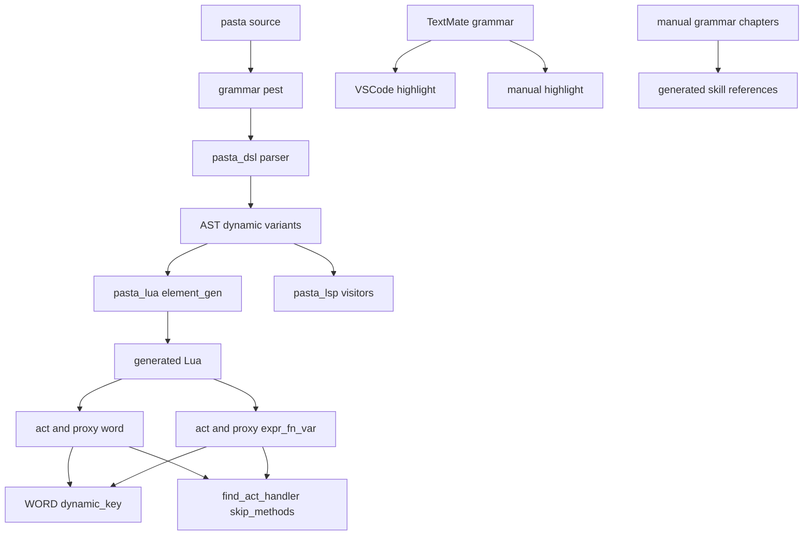
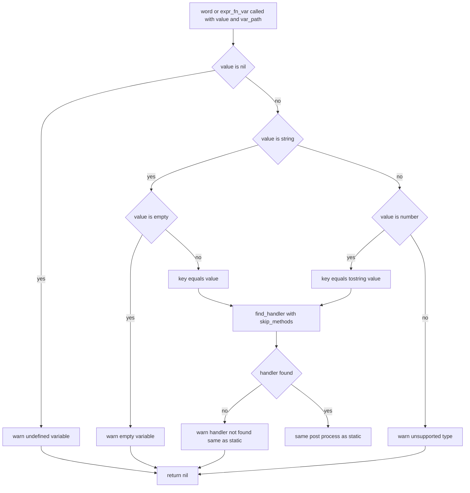

# Design Document: dynamic-word-reference

## Overview

本機能は、Pasta DSL に動的単語参照 `＠＄変数名` と動的関数呼び出し `＠＄変数名（…）` を追加する。ゴースト作者は、変数に入れた文字列を単語キー・関数名として、静的な `＠名前`・`＠名前（…）` と同じ探し方（スコープの段・前方一致・シャッフル＆順次消費）で単語を引き、関数を呼べるようになる。

**Users**: Pasta DSL で辞書を書くゴースト作者が、Lua ブロックの `act:word(…)` に頼らず DSL だけで「変数の値で単語・関数を引き分ける」会話を書くために使う。

**Impact**: 現行で `＠＄` は必ずパースエラーになるため、受理しても既存の辞書の読み込み結果・出力は変わらない。静的単語参照・静的関数呼び出しの生成コードと実行経路はバイト単位で変えず、動的参照のための構文規則・AST 変種・生成コード・ランタイム経路を横に足す。

### Goals

- `＠＄名前`・`＠＄＊名前`・`＠＄０` をアクション行・アクター付きの行・代入の右辺で受理し、参照変数の値を単語キーとした単語検索を行う（1.x, 3.x）。
- `＠＄名前（…）` を静的関数呼び出しを書けるすべての位置で受理し、参照変数の値を関数名とした関数検索・呼び出しを行う（7.x）。
- 未代入・空・型不正・該当なしを、行と後続の実行を止めずに空（値の無い呼び出し）として扱い、区別できる警告を出す（4.x, 3.6, 7.6–7.8）。
- 変数の値で act のメソッド（`talk`・`yield` など）や表の組み込みメソッド（`create_word` など）が意図せず呼ばれないよう、動的参照の検索から act のメソッドの段（L3）を外し、L1・A1 は表自身のフィールドだけを探す（3.10, 3.11, 7.4）。
- マニュアル 5 章・生成スキル・手書きスキル資料・TextMate 文法・LSP を追従させる（5.x, 6.x, 7.9, 7.10）。

### Non-Goals

- 単語検索アルゴリズム（前方一致・シャッフル＆順次消費・段の構成）の変更。
- 多段階参照（`＠＠word`）、値に含まれる `＠`・`＄` の再解釈。
- `＠＊＄名前（…）`（動的グローバル関数呼び出し）、`＠＄％prop`（プロパティとの組み合わせ）、`＠（式）` 等の任意の式への一般化。
- 関数呼び出しの引数の中での単語参照、キューコマンド行の `＠＄x`、単語定義のキー側 `＠＄k：…`。
- 動的コール `＞式` の nil ガード（`dynamic-call-nil-guard` の領分）。

## Boundary Commitments

### This Spec Owns

- 文法規則 `dyn_name_local`・`dyn_name_global`・`word_ref_dynamic`・`fn_call_dynamic` と、それを `action`・`fn_call`・`set` に組み込む順序。
- `pasta_dsl` の AST 変種 `Action::DynamicWordRef`・`Action::DynamicFnCall`・`Expr::DynamicFnCall`・`SetValue::DynamicWordRef` と、そのパース・span 補正。
- 動的参照の生成コード規約（`word(値, "変数パス")`・`expr_fn_var(値, "変数パス", 引数…)`）。
- ランタイムの動的キー解決規約（`WORD.dynamic_key`）、警告文言 3 種（未代入・空・型不正）、継承したメソッドに届かせない検索フラグ（`find_act_handler` の第 4 引数 `skip_methods`。L3 を飛ばし、L1・A1 を `rawget` で引く）。
- `ACT_IMPL.word`／`PROXY_IMPL.word` の省略可能な第 2 引数と、`ACT_IMPL.expr_fn_var`／`PROXY_IMPL.expr_fn_var`。
- LSP の動的参照のトークン分類、TextMate の `inline-dynamic-ref` 規則。
- マニュアル `grammar/words.md`・`markers.md`・`action-line.md`・`variables.md`・`actor-dictionary.md` の動的参照の記述と、その生成スキル `references/` の再生成、手書きスキル資料の追従。

### Out of Boundary

- 静的単語参照・静的関数呼び出し・変数展開の生成コードと挙動（無変更。回帰テストで固定する）。
- 単語検索の Rust バインディング（`@pasta_search` の `search_word`）とシーン検索（`SCENE.search`）。
- 動的コール `＞式` の生成コード（`tostring(<式>)`）と `ACT_IMPL.call` の nil ガード（`dynamic-call-nil-guard`）。
- マニュアル権威化・スキル生成の仕組み（`gen-skill-refs.mjs`・`--check`・リンク検証）とマニュアルのハイライト機構（`book/tools/highlight/`）。本仕様は利用するだけ。
- `pasta_dsl` のクレート版の上げ方・公開手順（`release-workflow` の領分）。
- ロードマップ・ステアリングの更新（spec 完了処理で行う）。

### Allowed Dependencies

- `pasta_lua` code_gen → `pasta_dsl` の AST（新変種を含む）。逆方向の依存は作らない。
- `pasta_lsp` → `pasta_dsl` の AST。
- 生成 Lua → `ACT_IMPL`／`PROXY_IMPL` の公開メソッド（`word`・`expr_fn_var`・`talk`・`set_property`）。
- `act.lua`・`actor.lua` → `pasta.word`（`WORD.dynamic_key`）。`pasta.word` は `pasta.act`・`pasta.actor` を require しない（循環禁止）。
- 既存の部品 `resolve_var_path`・`StringLiteralizer`・`generate_args_string`・`find_act_handler` を再利用する。新しい外部クレート・Lua モジュールは追加しない。

### Revalidation Triggers

- AST 新変種のフィールド構成の変更（`pasta_dsl` 利用者・LSP・code_gen の再確認が要る）。
- `find_act_handler`／`find_handler` の引数構成の変更（`PROXY_IMPL`・`SHIORI_ACT` 継承チェーン・lua_specs の再確認）。
- 警告文言 3 種の変更（`dynamic-call-nil-guard` が文言を揃える前提にしている）。
- TextMate のスコープ名の変更（マニュアルのハイライトの CSS 対応表に波及）。
- `act` のメソッド構成・`SCENE_TABLE_IMPL`・`ACTOR_IMPL` のメソッド構成の変更は影響しない（L3 を丸ごと飛ばし、L1・A1 は `rawget` で引くため）。
- シーンテーブル・アクターの表の作り（メタテーブルを使わず生フィールドに機能を置く等）の変更は、`rawget` で届く範囲が変わるため再確認が要る。

## Architecture

### Existing Architecture Analysis

- 処理の流れは `.pasta` → `pasta_dsl`（Pest PEG → AST）→ `pasta_lua` code_gen（AST → Lua ソース）→ Lua ランタイム（`act`・`proxy` のメソッドがトークンを積む）である。LSP は同じ AST からセマンティックトークンを作り、TextMate 文法は VSCode とマニュアルのハイライトに共有される。
- 静的単語参照は `act.アクター:talk(act.アクター:word("名"))`、代入の右辺は `act:word("名")`。静的関数呼び出しは `act.アクター:expr_fn("名", 引数…)`／`act:expr_fn("名", 引数…)`。変数展開は `act.アクター:talk(var.x, "var.x")` で、第 2 引数の変数パスを使って nil 時に警告する。
- 検索コアは `ACT_IMPL.find_act_handler(mode, key)`（L1 シーンテーブル → L2 ローカル辞書 → L3 act のメソッド → L4 `GLOBAL` → L5 グローバル辞書）。アクター付きの行は `PROXY_IMPL.find_handler` が A1（アクターの表）・A2（アクター辞書）を先に探し、`act:find_act_handler` に委譲する。
- パーサの既定アーム（`parse_actions` の `_ => {}`、`try_parse_expr` の子の再帰）は未知の規則を黙って捨てる・別物として拾うため、新規則には明示アームが必須である。

### Architecture Pattern & Boundary Map



**Architecture Integration**:
- 採用パターン: 既存構造への**並列追加**（新しい AST 変種＋既存ランタイム関数の後方互換拡張。research.md の Option C）。静的経路は触らない。
- 境界: 構文と AST は `pasta_dsl`、変数パスの解決と生成コードは `pasta_lua` code_gen、キー解決と検索段の制御は Lua ランタイムが持つ。値の型判定・文字列化はランタイムだけが行う（生成コードは値をそのまま渡す）。
- 既存パターンの踏襲: `talk(値, "変数パス")` の第 2 引数規約、動的コールの `CallTarget` と同じ「静的と動的を別の形で持つ」AST、`resolve_var_path` による変数パス生成。
- 新規部品の理由: `WORD.dynamic_key` は `act.lua` と `actor.lua` の両方が使い、`act.lua` が `actor.lua` を require する一方向依存のため、両者が依存できる `pasta.word` に置く。`expr_fn_var` は `expr_fn(key, ...)` が可変長引数を取り末尾に変数パスを足せないため別メソッドとする。
- ステアリング適合: マニュアルが文法の唯一の権威（tech/grammar ステアリング）。全角半角の同等扱い。依存方向 `pasta_dsl` ← `pasta_lua`／`pasta_lsp`。

**依存方向**: `grammar.pest` → AST（`ast/action.rs`）→ パーサ（`parse_*.rs`・`partial.rs`）→ code_gen（`element_gen.rs`）／LSP（`visit_*.rs`）→ 生成 Lua → `act.lua`／`actor.lua` → `word.lua`。各層は左側だけを参照し、`word.lua` は `act`・`actor` を参照しない。

### Technology Stack

| Layer | Choice / Version | Role in Feature | Notes |
|-------|------------------|-----------------|-------|
| Parser | Pest 2.8.6 | 動的参照の構文規則 | 既存。新依存なし |
| Transpiler | Rust 2024 / `pasta_lua` code_gen | 動的参照の Lua 生成 | 既存部品を再利用 |
| Runtime | LuaJIT 2.1（mlua 0.11） | キー解決・L3 を飛ばす検索 | `tostring`・`type` のみ使用 |
| Editor | TextMate 文法・tower-lsp 0.20 | ハイライト・セマンティックトークン | 既存 |
| Docs | mdBook マニュアル・`gen-skill-refs.mjs` | 構文の記載・スキル再生成 | 既存 |

## File Structure Plan

### Directory Structure

新規ファイルはテストだけである。本体はすべて既存ファイルの変更で足りる。

```
crates/
├── pasta_dsl/tests/
│   └── dynamic_word_ref_test.rs          # 新規: 構文受理・既存字句との区別・パースエラーの位置（1.x, 2.x, 7.1–7.3）
├── pasta_lua/tests/
│   ├── transpiler/dynamic_word_ref_test.rs  # 新規: 生成コード・スナップショット・マニュアル例の読み込み検証（3.x, 5.5, 7.x）
│   └── lua_specs/act_dynamic_ref_test.lua   # 新規: キー解決・警告・L3 除外・巡回共有（3.x, 4.x, 7.4–7.8）
└── pasta_lsp/tests/
    └── dynamic_ref_token_test.rs         # 新規: トークン分類・全角半角混在（6.3, 7.10）
```

### Modified Files

構文・AST・パーサ（`pasta_dsl`）:
- `crates/pasta_dsl/src/parser/grammar.pest` — `dyn_name_local`・`dyn_name_global`・`word_ref_dynamic`・`fn_call_dynamic` を追加し、`fn_call`・`action`・`set` の選択肢に組み込む。
- `crates/pasta_dsl/src/parser/ast/action.rs` — 4 変種を追加する。
- `crates/pasta_dsl/src/parser/parse_action.rs` — `parse_actions` に 2 アーム、`try_parse_expr` に 1 アーム、補助関数 `parse_dyn_name`・`parse_dyn_fn_call_inner` を追加する。
- `crates/pasta_dsl/src/parser/parse_elements.rs` — `parse_var_set` に `word_ref_dynamic` の明示アームを追加する。
- `crates/pasta_dsl/src/partial.rs` — `shift_action` に 2 変種のアームを追加する。

生成コード（`pasta_lua` code_gen）:
- `crates/pasta_lua/src/code_gen/element_gen.rs` — `action_span`・`generate_action`・`generate_var_set`・`generate_property_set`・`generate_expr_to_buffer` に動的変種のアームを追加する。

ランタイム（Lua）:
- `crates/pasta_lua/pasta_scripts/pasta/word.lua` — `WORD.dynamic_key` を追加する（`@pasta_log` を require）。
- `crates/pasta_lua/pasta_scripts/pasta/act.lua` — `find_act_handler`・`find_handler` に第 4・第 3 引数 `skip_methods` を追加、`word` に省略可能な `var_path`、`expr_fn_var` を追加する。
- `crates/pasta_lua/pasta_scripts/pasta/actor.lua` — `PROXY_IMPL.find_handler` に `skip_methods` の受け渡し、`PROXY_IMPL.word` に `var_path`、`PROXY_IMPL.expr_fn_var` を追加する。

エディタ支援:
- `crates/pasta_lsp/src/analysis/visit_action.rs` — `Action::DynamicWordRef`・`Action::DynamicFnCall` を WORD トークンに分類する。
- `crates/pasta_lsp/src/analysis/visit_expr.rs` — `SetValue::DynamicWordRef`・`Expr::DynamicFnCall` の位置探索と引数のトークン化（`tokenize_args_text` の `Expr::FnCall` 限定の分岐を動的変種にも広げる）。
- `crates/pasta_lsp/src/analysis/text_utils.rs` — 全角半角混在のマーカー列を探す `find_dynamic_ref` を追加する。
- `editors/vscode/syntaxes/pasta.tmLanguage.json` — `inline-dynamic-ref` を追加し、`action-line` のパターン列で `inline-word-ref` より前に置く。

マニュアル・スキル:
- `book/src/grammar/words.md` — 「動的単語参照」節を追加する（5.1, 7.9）。
- `book/src/grammar/markers.md` — マーカー一覧の「単語／関数」の用途に動的参照を追記する。
- `book/src/grammar/action-line.md` — インライン要素の表に 2 行、判定順の文に動的参照を追記する。
- `book/src/grammar/variables.md` — 右辺の表・関数スコープの展開先の表・DSL と Lua の対応表に動的参照を追記する。
- `book/src/grammar/actor-dictionary.md` — アクター付きの行の動的単語参照が A1・A2 を探すこと、代入の右辺・関数呼び出しは探さないことを追記する。
- `.claude/skills/pasta-ghost-authoring/references/{words,markers,action-line,variables,actor-dictionary}.md` — `node book/tools/gen-skill-refs.mjs` で再生成する（手で編集しない）。
- `.claude/skills/pasta-ghost-authoring/SKILL.md` — §3.2 のインライン要素の箇条書きに動的参照を追記する。
- `.claude/skills/pasta-ghost-authoring/references/authoring-patterns.md` — 単語参照の記述を照合し、矛盾があれば揃える（無ければ変更しない）。

既存テストへの追記:
- `crates/pasta_lua/tests/transpiler/main.rs` — `mod dynamic_word_ref_test;` を追加する。
- `crates/pasta_lua/tests/lua_specs/init.lua` — `act_dynamic_ref_test` を `specs` に登録する。
- `crates/pasta_lua/tests/runtime/syntax_test.rs` — E2E（アクター付きの行・代入・関数呼び出し・未代入）を 1 本追加する。
- `editors/vscode/src/test/tmGrammar.test.ts` — 動的参照と `＠＠`・静的参照の不変を確認するケースを追加する。
- `book/tools/highlight/tokenizer-test.mjs` — マニュアルのハイライトで動的参照が単語参照のスコープになるケースを追加する。

## System Flows

### 動的キーの解決と検索



- `var_path` が `nil`（第 2 引数を省略した既存の呼び出し）のときは、この流れに入らず既存の経路（空キーは警告なしで `nil`）を通る（4.6）。
- 「該当なし」の警告と、見つかった後のポストプロセス（関数なら呼ぶ・それ以外は `tostring`）は静的と同一のコードを通る（3.8, 4.3, 7.7）。
- 検索段: アクター付きの行の単語参照は A1 → A2 → L1 → L2 → L4 → L5、それ以外の単語参照は L1 → L2 → L4 → L5、関数呼び出しは L1 → L2（シーン辞書）→ L4 → L5（シーン辞書）。L3 を飛ばし、L1・A1 は `rawget` で表自身のフィールドだけを引く（3.1, 3.2, 3.3, 3.10, 3.11, 7.4）。

## Requirements Traceability

| Requirement | Summary | Components | Interfaces | Flows |
|-------------|---------|------------|------------|-------|
| 1.1 | アクション行の `＠＄名前` を受理 | Grammar, Parser | `word_ref_dynamic` → `Action::DynamicWordRef` | — |
| 1.2 | `＠＄＊名前` を受理 | Grammar, Parser | `dyn_name_global` | — |
| 1.3 | `＠＄０` を受理 | Grammar, Parser | `dyn_name_local`（`var_id`）→ `VarScope::Args` | — |
| 1.4 | 代入の右辺で受理 | Grammar, Parser | `set` の選択肢 → `SetValue::DynamicWordRef` | — |
| 1.5 | プロパティ代入の右辺 | Parser, CodeGen | `act:set_property(名, act:word(値, パス))` | — |
| 1.6 | 全角半角の同等扱い | Grammar | 既存マーカー規則 `at`・`dollar`・`ast` | — |
| 1.7 | 直後の空白を区切りとして捨てる | Grammar | `word_ref_dynamic` の末尾 `s` | — |
| 2.1 | `＠＠` はエスケープのまま | Grammar | `at_escape` を先頭に維持 | — |
| 2.2 | `＄＄` はエスケープのまま | Grammar | `dollar_escape` を維持 | — |
| 2.3 | 静的の `＠名前`・`＠名前（）`・`＠＊名前（）` 不変 | Grammar, CodeGen | 静的規則・静的アーム無変更 | — |
| 2.4 | `＠＄名前（` は動的関数呼び出し | Grammar | `fn_call`（動的を含む）を `word_ref_dynamic` より先に試す | — |
| 2.5 | `＠＄％` はパースエラー | Grammar | `dyn_name_*` が `％` を受けない | — |
| 2.6 | `＠＄` の後に変数名が無いとパースエラー | Grammar | `var_id`・`id` 必須 | — |
| 2.7 | 動的参照の無い辞書は不変 | 全体 | 静的経路無変更・既存スナップショット | — |
| 2.8 | `＠＊＄名前` はパースエラー | Grammar | `fn_call_global` が `id` を要求 | — |
| 3.1 | 静的と同じ探し方（L3 を除く） | Runtime | `word(値, パス)` → `find_handler(…, true)` | 動的キーの解決と検索 |
| 3.2 | アクター付きの行は A1・A2 を先に | CodeGen, Runtime | `act.アクター:word(値, パス)` → `PROXY_IMPL.find_handler` | 同上 |
| 3.3 | 代入の右辺はアクター辞書を探さない | CodeGen | 右辺は `act:word` を生成 | 同上 |
| 3.4 | 巡回を静的と共有 | Runtime | 単語キー文字列で `search_word` を引く（既存） | 同上 |
| 3.5 | 数値は文字列化 | Runtime | `WORD.dynamic_key` の `tostring` | 同上 |
| 3.6 | 文字列・数値以外は空＋型付き警告 | Runtime | `WORD.dynamic_key` | 同上 |
| 3.7 | 値を再解釈しない | Runtime | 値をキーとして渡すだけ | — |
| 3.8 | 関数が見つかれば呼ぶ | Runtime | 既存ポストプロセス | 同上 |
| 3.9 | 評価のたびにその時点の値 | CodeGen | 生成コードが実行時に変数を読む | — |
| 3.10 | act のメソッドの段を飛ばす | Runtime | `find_act_handler(mode, key, skip_methods)` | 同上 |
| 3.11 | L1・A1 は表自身のフィールドだけ | Runtime | `skip_methods` 時の `rawget(current_scene, key)`・`rawget(actor, key)` | 同上 |
| 4.1 | 未代入は空＋変数パス付き警告 | Runtime | `undefined variable` 警告 | 同上 |
| 4.2 | 空文字列は区別できる警告 | Runtime | `empty variable` 警告 | 同上 |
| 4.3 | 該当なしは静的と同じ警告 | Runtime | 既存 `handler not found` | 同上 |
| 4.4 | 右辺は静的未定義と同じ値（nil） | CodeGen, Runtime | `var.y = act:word(…)` が `nil` | 同上 |
| 4.5 | 行の残り・後続を続ける | Runtime | 例外を投げない（警告＋`nil`） | 同上 |
| 4.6 | 既存 API の挙動不変 | Runtime | `var_path == nil` は既存経路 | — |
| 5.1 | `words.md` に動的単語参照の節 | Manual | 「動的単語参照」節 | — |
| 5.2 | `markers`・`action-line`・`variables`・`actor-dictionary` に追記 | Manual | 各表・判定順 | — |
| 5.3 | スキル再生成・鮮度照合・リンク検証 | Manual | `gen-skill-refs.mjs`・`--check`・`link-check.mjs` | — |
| 5.4 | 手書きスキル資料の追従 | Manual | `SKILL.md` §3.2・`authoring-patterns.md` | — |
| 5.5 | 例が読み込み可能 | Tests | マニュアル例の抽出・パース・トランスパイル検証 | — |
| 5.6 | 「未実装」記述を残さない | Manual | 記述の照合 | — |
| 6.1 | 動的参照全体を単語参照として着色 | TextMate | `inline-dynamic-ref` | — |
| 6.2 | 既存の色分け不変 | TextMate | 新規則は `＠＄` で始まる列にだけ一致 | — |
| 6.3 | LSP は診断エラーなし・トークン分類 | LSP | WORD トークン | — |
| 6.4 | マニュアルのハイライトに反映 | TextMate | `highlight-html.mjs` が同文法を読む（既存） | — |
| 7.1 | `＠＄名前（…）` を動的関数呼び出しとして受理 | Grammar, Parser | `fn_call_dynamic` → `Action::DynamicFnCall` | — |
| 7.2 | 静的関数呼び出しを書ける全位置で受理 | Grammar | `fn_call`（`term` 経由で式・引数・Call ターゲット・算術） | — |
| 7.3 | 引数の書き方は静的と同じ | Grammar, Parser | `args` 規則・`parse_args` を再利用 | — |
| 7.4 | 値を関数名に静的と同じ検索（L3 除く） | Runtime | `expr_fn_var` → `find_handler("expr", key, true)` | 同上 |
| 7.5 | アクター付きの行はプロキシを第 1 引数に | CodeGen, Runtime | `act.アクター:expr_fn_var(…)` → `handler(proxy, …)` | 同上 |
| 7.6 | 未代入・空は呼ばず警告 | Runtime | `WORD.dynamic_key` | 同上 |
| 7.7 | 該当なしは静的と同じ警告 | Runtime | `expr_fn` と同じ文言 | 同上 |
| 7.8 | 型の扱いは 3.5–3.7 と同じ | Runtime | `WORD.dynamic_key` | 同上 |
| 7.9 | マニュアルに記載 | Manual | `action-line`・`variables`・`words` | — |
| 7.10 | ハイライト・LSP | TextMate, LSP | `inline-dynamic-ref`・WORD トークン | — |

## Components and Interfaces

| Component | Domain/Layer | Intent | Req Coverage | Key Dependencies (P0/P1) | Contracts |
|-----------|--------------|--------|--------------|--------------------------|-----------|
| DynamicRefGrammar | Parser | `＠＄` 列を受理する規則と順序 | 1.1–1.4, 1.6, 1.7, 2.1–2.8, 7.1–7.3 | 既存 `var_id`・`args`（P0） | State |
| DynamicRefAst | Parser | 動的参照の AST 変種 | 1.1–1.5, 7.1 | `VarScope`・`Args`（P0） | Service |
| DynamicRefParser | Parser | Pest ペア → AST・span 補正 | 1.1–1.5, 7.1–7.3 | DynamicRefAst（P0） | Service |
| DynamicRefCodeGen | Transpiler | 動的変種 → Lua 呼び出し | 1.5, 3.2, 3.3, 3.9, 4.4, 7.5 | `resolve_var_path`（P0） | Service |
| DynamicKeyResolver | Runtime | 値 → 単語キー／関数名と警告 | 3.5–3.7, 4.1, 4.2, 7.6, 7.8 | `@pasta_log`（P1） | Service |
| DynamicLookup | Runtime | 継承メソッドに届かせない検索と既存ポストプロセス | 3.1–3.4, 3.8, 3.10, 3.11, 4.3–4.6, 7.4, 7.5, 7.7 | `find_act_handler`（P0） | Service |
| DynamicRefLsp | Editor | セマンティックトークン | 6.3, 7.10 | DynamicRefAst（P0） | Service |
| DynamicRefTextMate | Editor | 構文ハイライト | 6.1, 6.2, 6.4, 7.10 | なし | State |
| DynamicRefManual | Docs | マニュアル・スキルの記載 | 5.1–5.6, 7.9 | `gen-skill-refs.mjs`（P0） | Batch |

### Parser

#### DynamicRefGrammar

| Field | Detail |
|-------|--------|
| Intent | `＠＄`・`＠＄＊`・`＠＄０` の列と、直後の引数括弧を受理する規則と、その試行順 |
| Requirements | 1.1, 1.2, 1.3, 1.4, 1.6, 1.7, 2.1, 2.2, 2.3, 2.4, 2.5, 2.6, 2.7, 2.8, 7.1, 7.2, 7.3 |

**Responsibilities & Constraints**
- 規則（grammar.pest。表記は契約であり、実装時の微調整は許すが、下の不変条件は守る）:

```pest
// 動的参照の参照変数（プロパティ ＄％ は含めない。末尾の空白は含めない）
dyn_name_local   = { var_marker ~ var_id }
dyn_name_global  = { var_marker ~ global_marker ~ id }
dyn_name         = _{ dyn_name_global | dyn_name_local }

word_ref_dynamic = { word_marker ~ dyn_name ~ s }
fn_call_dynamic  = { fn_marker ~ dyn_name ~ args }

fn_call = _{ fn_call_global | fn_call_local | fn_call_dynamic }
action  = _{ at_escape | dollar_escape | sakura_escape | fn_call | word_ref | word_ref_dynamic | var_ref | sakura_script | talk }
set     = _{ set_marker ~ s ~ ( expr | word_ref | word_ref_dynamic ) }
```

- 不変条件:
  - `at_escape` を `action` の先頭に置いたままにする（`＠＠＄x` は「＠」＋変数展開 `＄x`。2.1）。
  - `fn_call`（動的を含む）を `word_ref_dynamic` より先に試す（静的の `fn_call` → `word_ref` と同じ最長一致。2.4, 7.1）。
  - `dyn_name_*` は末尾に空白を含めない。`fn_call_dynamic` は参照変数の直後に括弧を要求する（`＠＄f （）` は静的の `＠f （）` と同じく単語参照＋台詞「（）」。7.3）。`word_ref_dynamic` だけが末尾の空白を区切りとして消費する（1.7）。
  - `var_ref`（`var_ref_property` を含む）を再利用しない。`＠＄％p` はどの選択肢にも一致せず、`talk_word` が `＠` を除外しているためパースエラーになる（2.5）。
  - `＠＊＄x` は `fn_call_global` が `＊` の後に `id` を要求するため一致せずパースエラー（2.8）。`＠＄`・`＠＄＄`・`＠＄`＋空白も同様にパースエラー（2.6）。エラーは Pest の行・列付きの `ParseError` として既存の経路で報告される。
  - 引数が式として正しくない `＠＄f（時間：朝）` は、静的の `＠f（時間：朝）` と同じく `fn_call_dynamic` が失敗して `word_ref_dynamic`＋台詞「（時間：朝）」になる（7.1 ただし書き・7.3。設計ディスカッション #2）。`word_ref_dynamic` に「括弧が続かない」否定先読みは付けない。
  - `fn_call` は `term` から参照されるため、動的関数呼び出しは代入の右辺・プロパティ代入の右辺・式文・関数や Call の引数・Call の動的ターゲット・算術の項で自動的に受理される（7.2）。単語参照は `term` に入れない（引数の中の単語参照は対象外のまま）。
  - キューコマンド行（`cue_arg_*`）・単語定義のキー（`key_list`）・選択肢行は変更しない。
  - `＠＄＊０` は `＄＊０` が変数参照として書けないのと同じく受理しない。

**Implementation Notes**
- Validation: `pasta_dsl/tests/dynamic_word_ref_test.rs` で受理・拒否・位置を固定する。
- Risks: 既存規則の順序変更は `action`・`fn_call`・`set` の末尾追加に限る。既存の選択肢の相対順は変えない。

#### DynamicRefAst

| Field | Detail |
|-------|--------|
| Intent | 動的参照を静的参照と別の変種で持ち、静的の型を変えない |
| Requirements | 1.1, 1.2, 1.3, 1.4, 1.5, 7.1 |

**Contracts**: Service [x]

```rust
// crates/pasta_dsl/src/parser/ast/action.rs への追加
pub enum Action {
    // …既存の変種は無変更…
    /// Dynamic word reference (@$var, @$*var, @$0)
    DynamicWordRef { var_name: String, var_scope: VarScope, span: Span },
    /// Dynamic function call (@$var(args))
    DynamicFnCall { var_name: String, var_scope: VarScope, args: Args, span: Span },
}

pub enum Expr {
    // …既存の変種は無変更…
    /// Dynamic function call (@$var(args)) inside an expression
    DynamicFnCall { var_name: String, var_scope: VarScope, args: Args },
}

pub enum SetValue {
    Expr(Expr),
    WordRef { name: String },
    /// Dynamic word reference on the right-hand side (`$y = @$x`)
    DynamicWordRef { var_name: String, var_scope: VarScope },
}
```

- 不変条件: `var_scope` は `Local`・`Global`・`Args(n)` のいずれかで、パーサは `Property` を生成しない。`var_name` は書いたままの識別子（`Args` のときは書いた数字列。既存の `VarRef` と同じ）。
- `#[non_exhaustive]` は付けない（既存の公開 enum と揃え、網羅 match のコンパイルエラーで `pasta_lua`・`pasta_lsp` の対応漏れを検出する。設計ディスカッション #4）。

#### DynamicRefParser

| Field | Detail |
|-------|--------|
| Intent | `word_ref_dynamic`・`fn_call_dynamic` を明示アームで AST に変換し、部分パースの span を補正する |
| Requirements | 1.1, 1.2, 1.3, 1.4, 1.5, 7.1, 7.2, 7.3 |

**Contracts**: Service [x]

```rust
// crates/pasta_dsl/src/parser/parse_action.rs
/// dyn_name_local / dyn_name_global を含むペアから (var_name, var_scope) を取り出す。
/// dyn_name_local の var_id は既存 parse_var_ref_local_inner と同じ規則で Local / Args(n) に分ける。
pub(crate) fn parse_dyn_name(pair: Pair<Rule>) -> Option<(String, VarScope)>;

/// fn_call_dynamic の (var_name, var_scope, args) を取り出す。args は既存 parse_args を使う。
pub(crate) fn parse_dyn_fn_call_inner(pair: Pair<Rule>) -> Result<(String, VarScope, Args), ParseError>;
```

- `parse_actions`: `Rule::word_ref_dynamic` → `Action::DynamicWordRef`、`Rule::fn_call_dynamic` → `Action::DynamicFnCall` の**明示アーム**を置く（既定アーム `_ => {}` は黙って捨てるため）。
- `try_parse_expr`: `Rule::fn_call_dynamic` → `Expr::DynamicFnCall` の**明示アーム**を置く（既定アームは子を再帰し、`args` 内の最初の引数を式として返してしまうため、`＄y＝＠＄f（１）` が `＄y＝１` になる）。
- `parse_var_set`: `Rule::word_ref_dynamic` → `SetValue::DynamicWordRef` の**明示アーム**を置く。`word_ref_dynamic` は非サイレント規則のため、内側の `id` が代入先の名前（`Rule::id` アーム）へ漏れない。
- `partial.rs::shift_action`: `DynamicWordRef` は `span`、`DynamicFnCall` は `span` と `args` を補正する。`SetValue`・`Expr` は span を持たないため変更不要。

**Implementation Notes**
- Validation: 「`＄y＝＠＄x` が `SetValue::DynamicWordRef` になり `Expr::VarRef` にならない」「`＄y＝＠＄f（１）` が `Expr::DynamicFnCall` になる」「`＄＝＠＄x` の `name` が `None`」をテストで固定する。

### Transpiler

#### DynamicRefCodeGen

| Field | Detail |
|-------|--------|
| Intent | 動的変種を、値と変数パスを渡すランタイム呼び出しに変換する |
| Requirements | 1.5, 3.2, 3.3, 3.9, 4.4, 7.5 |

**Contracts**: Service [x]

生成コード規約（`{p}` は `resolve_var_path(var_name, var_scope)` の結果 `var.x`・`save.x`・`args[n]`、`{pl}` はその文字列リテラル、`{a}` はアクター名、`{args}` は `generate_args_string` の結果に先頭の `, ` を付けたもの）:

| AST | 生成コード |
|-----|-----------|
| `Action::DynamicWordRef` | `act.{a}:talk(act.{a}:word({p}, {pl}))` |
| `Action::DynamicFnCall` | `act.{a}:talk((act.{a}:expr_fn_var({p}, {pl}{args})))` |
| `SetValue::DynamicWordRef`（ローカル・グローバル代入） | `{代入先} = act:word({p}, {pl})` |
| `SetValue::DynamicWordRef`（式文 `＄＝`） | `act:word({p}, {pl})` |
| `SetValue::DynamicWordRef`（プロパティ代入） | `act:set_property({名}, act:word({p}, {pl}))` |
| `Expr::DynamicFnCall` | `act:expr_fn_var({p}, {pl}{args})` |

例: `さくら：＠＄x　です` → `act.さくら:talk(act.さくら:word(var.x, "var.x"))`、`＄y＝＠＄＊k` → `var.y = act:word(save.k, "save.k")`、`さくら：＠＄０（１）` → `act.さくら:talk((act.さくら:expr_fn_var(args[1], "args[1]", 1)))`。

- 不変条件: 生成コードは値を `tostring` しない（nil・空・型の判定はランタイムが行う。動的コールの `tostring(<式>)` 方式は nil を `"nil"` に変えるため採らない）。静的変種のアームと出力は無変更。
- `VarScope::Property` は `resolve_var_path` が既存どおり `Err` を返す（パーサが生成しないための防御）。
- `action_span` に 2 変種を足し、ソースマップの記録は既存の `out_line` 差分方式に乗せる。

### Runtime

#### DynamicKeyResolver

| Field | Detail |
|-------|--------|
| Intent | 参照変数の値を単語キー・関数名に変換し、使えない値なら警告して `nil` を返す |
| Requirements | 3.5, 3.6, 3.7, 4.1, 4.2, 7.6, 7.8 |

**Contracts**: Service [x]

```lua
--- 動的参照の値を検索キーに変換する（pasta/word.lua）
--- @param value any 参照変数の値
--- @param var_path string 参照変数の Lua パス（"var.x" / "save.x" / "args[1]"）
--- @param via string 警告の接頭辞（"act:word" / "proxy:word" / "act:expr_fn" / "proxy:expr_fn"）
--- @return string|nil 検索キー。nil のときは警告済み
function WORD.dynamic_key(value, var_path, via) end
```

| 値 | 戻り値 | 警告（`log.warn`） |
|----|--------|--------------------|
| `nil` | `nil` | `{via} - undefined variable: '{var_path}'` |
| `""` | `nil` | `{via} - empty variable: '{var_path}'` |
| 空でない文字列 | その文字列 | なし |
| 数値 | `tostring(値)`（変数展開と同じ表記） | なし |
| 上記以外（真偽値・テーブル・関数・userdata・thread） | `nil` | `{via} - unsupported value type: '{var_path}' ({type(値)})` |

- 文言は既存の `act:talk - undefined variable: '…'` の形に揃える（要件ディスカッション #9）。シーン引数の変数パスは既存の変数展開と同じく `args[1]` と表示する。
- `__tostring` を持つテーブルも型不正として扱う（文字列・数値だけを通す。#8）。
- `pasta.word` はモジュール関数として置き、`ACT_IMPL` には置かない（L3 から到達させない）。

#### DynamicLookup

| Field | Detail |
|-------|--------|
| Intent | 動的キーで継承メソッドに届かせずに検索し、静的と同じポストプロセス・警告を通す |
| Requirements | 3.1, 3.2, 3.3, 3.4, 3.8, 3.10, 3.11, 4.3, 4.4, 4.5, 4.6, 7.4, 7.5, 7.7 |

**Contracts**: Service [x]

```lua
-- pasta/act.lua
--- @param skip_methods boolean|nil true のとき L1 を rawget(current_scene, key) で引き、L3（self[key] の関数）を探さない。nil/false は既存どおり
function ACT_IMPL.find_act_handler(self, mode, key, skip_methods) end
function ACT_IMPL.find_handler(self, mode, key, skip_methods) end   -- find_act_handler へそのまま渡す

--- @param name any 単語キー。var_path があるときは参照変数の値
--- @param var_path string|nil 動的参照のときの変数パス。nil なら既存の挙動（空キーは警告なしで nil）
function ACT_IMPL.word(self, name, var_path) end

--- 動的関数呼び出し。value を WORD.dynamic_key で関数名にし、find_handler("expr", key, true) で探す
--- 関数なら handler(self, ...) の戻り値、それ以外は expr_fn と同じ handler not found 警告＋nil
function ACT_IMPL.expr_fn_var(self, value, var_path, ...) end

-- pasta/actor.lua（PROXY_IMPL も同じシグネチャ。A1・A2 は word モードだけで探す既存規則のまま）
function PROXY_IMPL.find_actor_handler(self, mode, key, skip_methods) end -- skip_methods なら A1 を rawget(self.actor, key) で引く
function PROXY_IMPL.find_handler(self, mode, key, skip_methods) end -- find_actor_handler と act:find_act_handler の両方へ skip_methods を渡す
function PROXY_IMPL.word(self, name, var_path) end
function PROXY_IMPL.expr_fn_var(self, value, var_path, ...) end    -- handler(proxy, ...) を呼ぶ（7.5）
```

- Preconditions: 生成コードから呼ばれるときは `var_path` が必ず文字列である。
- Postconditions: 例外を投げない（キー解決・検索の失敗は警告＋`nil`）。`nil` は `talk` で何も出力せず、代入では `nil` が入る（静的未定義と同じ。4.4, 4.5）。
- Invariants:
  - `var_path == nil`／`skip_methods == nil` の既存呼び出しは、検索段・警告・戻り値が現行と同一（4.6, 2.7）。`lua_specs/act_word_expr_test.lua` の `word(nil)`・`word("")` の既存テストはそのまま通る。
  - 「該当なし」の警告文言は静的と同一（`act:word - handler not found: key='…', mode='word', via=act` など）。
  - 巡回の共有は、単語キー文字列で既存の `search_word(key, scope)` を引くことで成立する（3.4）。数値キーも文字列化してから L1・L4・A1 を引く。
- 段の扱い（要件ディスカッション #2・設計ディスカッション #1）: `skip_methods` は「継承したメソッドに届かせない」の 1 つの意味を持つ。
  - L3 は飛ばす（3.10）。
  - L1 のシーンテーブル（`__index = SCENE_TABLE_IMPL`）と A1 のアクターの表（`ACTOR_IMPL` を継承）は `rawget` で引き、表自身のフィールド（シーン関数・`__global_name__`・作者が定義したアクターのフィールド）だけに一致させる。`create_word`・`__index` などメタテーブル経由の組み込みメソッドには届かない（3.11。値が `create_word` のときキー nil の単語ビルダー生成で `table index is nil` になりシーンが止まる、`__index` のとき `table: 0x…` を出力する、を防ぐ）。
  - L2・L4・L5・A2 は静的と同じ。`GLOBAL` はメタテーブルを持たない作者の表のため絞らない。
  - `skip_methods` が nil／false の既存呼び出しは L1・A1 を従来どおり `[]` で引く（2.7, 4.6）。

### Editor

#### DynamicRefLsp

| Field | Detail |
|-------|--------|
| Intent | 動的参照を WORD トークンとして返す |
| Requirements | 6.3, 7.10 |

- `visit_action`: `Action::DynamicWordRef`・`Action::DynamicFnCall` の span を `token_type::WORD` に分類する（静的の `WordRef`・`FnCall` と同じ）。
- `visit_expr::tokenize_expr_text`: `SetValue::DynamicWordRef` は `find_dynamic_ref` で `＠＄名前`（全角半角混在を含む）の位置を探し WORD トークンを出す。
- `visit_expr::tokenize_expr_recursive`: `Expr::DynamicFnCall` は同様に位置を探して WORD トークンを出し、続けて引数をトークン化する。`tokenize_args_text` の `if let Expr::FnCall { args, .. }` を動的変種の `args` も取り出す形に広げる。

```rust
// crates/pasta_lsp/src/analysis/text_utils.rs
/// text 中で `[＠@][＄$]`（global なら続けて `[＊*]`）＋ var_name の並びを探し、(開始, 終了) のバイト位置を返す。
pub(super) fn find_dynamic_ref(text: &str, var_name: &str, global: bool) -> Option<(usize, usize)>;
```

- 診断: 文法が受理するため、動的参照を含む文書でパースエラー由来の診断は出ない（6.3）。

#### DynamicRefTextMate

| Field | Detail |
|-------|--------|
| Intent | アクション行の動的参照全体を単語参照のスコープで着色する |
| Requirements | 6.1, 6.2, 6.4, 7.10 |

```json
"inline-dynamic-ref": {
    "match": "(?<![＠@])(?:[＠@]{2})*([＠@][＄$][＊*]?[^＠@＄$\\\\\\s]+)",
    "captures": { "1": { "name": "markup.inline.raw.string.pasta" } }
}
```

- `action-line` のパターン列で `inline-word-ref` の前に置く。`＠` から変数名・括弧の引数（空白まで）までを 1 つの単語参照スコープにする（静的の `＠名前（…）` が `inline-word-ref` で着色されるのと同じ範囲の取り方）。
- 代入行は既存の `variable` 規則（`^(\s*)([＄$])(.+)$`）が行全体を変数スコープで着色しており、静的の `＄x＝＠単語` と同じく動的参照も着色済みになる。代入行の規則は変えない（6.1 の後段・6.2。設計ディスカッション #3）。右辺の意味の上の分類は LSP のセマンティックトークンが担う（6.3）。
- マニュアルのハイライトは `book/tools/highlight/highlight-html.mjs` が同じ文法ファイルを読むため、追加作業なしで反映される（6.4）。
- エスケープとの区別: 直前の `＠` を後読みで弾き、先行する `＠＠` の組を消費してからキャプチャ 1 だけを着色する。これにより `＠＠＄x`（エスケープ「＠」＋変数展開）は従来どおり無色の `＠＠` と変数参照 `＄x` のまま残り（6.2）、`＠＠＠＄x` は末尾の `＠＄x` だけを動的参照として塗る（パーサの `at_escape` が `＠＠` を先に取るのと一致）。（実装時 4.2 で、当初の「`＠＠＄x` を動的参照の色で塗る」既知の限界を解消した）

### Docs

#### DynamicRefManual

| Field | Detail |
|-------|--------|
| Intent | 動的参照の書き方・探し方・失敗時の挙動をマニュアルに記載し、スキルへ反映する |
| Requirements | 5.1, 5.2, 5.3, 5.4, 5.5, 5.6, 7.9 |

**Contracts**: Batch [x]

- Trigger: マニュアル章の更新。
- Input: 下の記載内容。
- Output: マニュアル 5 章、`node book/tools/gen-skill-refs.mjs` による `references/` の再生成、`node book/tools/gen-skill-refs.mjs --check` と `node book/tools/link-check.mjs` の成功。
- 記載内容:
  - `words.md` に「動的単語参照」節（「単語の参照」の後、「未定義単語の参照」の前）: 書き方（`＠＄名前`・`＠＄＊名前`・`＠＄０`・代入の右辺）、静的と同じ探し方・選び方と巡回の共有、act のメソッドの段（3 段目）を探さないこと、シーンテーブル・アクターの段では作者が定義したもの（シーン関数・アクターのフィールド）だけに一致し組み込みのメソッドには一致しないこと、数値は文字列にして探すこと、未代入・空・型不正・該当なしの挙動と警告、値を DSL として読み直さないこと（多段階参照をしない）、動的関数呼び出し `＠＄名前（…）` の概要、書けない形（`＠＄％名前`・`＠＊＄名前`・`＠＄` の後に変数名が無い形）はパースエラーになること。
  - `action-line.md`: インライン要素の表に「動的単語参照 `＠＄名前`」「動的関数呼び出し `＠＄名前（引数）`」、判定順の文を「エスケープ → 関数呼び出し（動的を含む）→ 単語参照（動的を含む）→ 変数参照 → …」に更新。引数が式として正しくない場合の記述（74 行付近）を動的関数呼び出しにも当てはまる書き方にする。
  - `variables.md`: 右辺の表に動的単語参照・動的関数呼び出し、関数スコープの展開先の表に `＠＄名前（…）` → `act:expr_fn_var(var.名前, "var.名前", …)`、DSL と Lua の対応表に `＄x＝＠＄y` → `var.x = act:word(var.y, "var.y")`。補足の警告文言に動的参照の 3 種を追記。
  - `actor-dictionary.md`: アクター付きの行の動的単語参照も A1・A2 から探すこと、代入の右辺・関数呼び出しは探さないこと、3 段目を探さないこと。
  - `markers.md`: マーカー一覧の「単語／関数」の用途に「変数の値による単語参照・関数呼び出し（`＠＄`）」を追記。
- 規則: 書けない形について「代わりの書き方」（`＄v＝＄％prop` を経由する等）は個別に載せない（プロジェクトの規則・要件ディスカッション #5）。「未実装」「将来予定」の記述を残さない（5.6）。コード例はすべて読み込み可能な完全な例にする（5.5）。
- 手書きスキル資料: `SKILL.md` §3.2 のインライン要素の箇条書きに `＠＄変数名`（動的単語参照）を追記する。`authoring-patterns.md` は照合のみ（矛盾が無ければ変更しない）。

## Data Models

### Domain Model

- 参照変数（`var_name`・`var_scope`）は AST の値オブジェクトで、生成時に Lua パス（`var.x`・`save.x`・`args[n]`）へ一意に写る。
- 単語キー・関数名は実行時にだけ存在し、`WORD.dynamic_key` が「文字列（空でない）」か「数値の文字列化」のときだけ生成される。
- 巡回の記録（シャッフル＆順次消費）は既存のまま「スコープ＋単語キー文字列」を単位とし、本機能は新しい状態を持たない。

## Error Handling

### Error Strategy

| 区分 | 発生条件 | 扱い | 報告 |
|------|----------|------|------|
| 構文エラー | `＠＄％x`・`＠＊＄x`・`＠＄`＋変数名なし | 辞書の読み込み失敗（既存のパースエラー経路） | Pest の行・列付きメッセージ（2.5, 2.6, 2.8） |
| 未代入 | 参照変数が `nil` | 空（値の無い呼び出し）で続行 | `… - undefined variable: '{var_path}'`（4.1, 7.6） |
| 空 | 参照変数が `""` | 同上 | `… - empty variable: '{var_path}'`（4.2, 7.6） |
| 型不正 | 文字列・数値以外 | 同上 | `… - unsupported value type: '{var_path}' ({type})`（3.6, 7.8） |
| 該当なし | どの段にも無い | 同上 | 静的と同一の `handler not found`（4.3, 7.7） |
| 関数内エラー | 見つかった関数が Lua エラーを投げる | 静的と同じ（本機能は捕捉しない） | 既存のシーン実行エラー経路 |

### Monitoring

- 警告は既存の `@pasta_log`（`log.warn`）に出す。接頭辞で静的（`handler not found`）と動的固有（`undefined variable`・`empty variable`・`unsupported value type`）を区別できる。

## Testing Strategy

### Unit Tests

- パーサ（`pasta_dsl/tests/dynamic_word_ref_test.rs`）: `＠＄x`・`＠＄＊x`・`＠＄０`・`@$x`・`＠$＊x` が `Action::DynamicWordRef`（スコープ・名前・span）になる。`＄y＝＠＄x`・`＄＊y＝＠＄＊x`・`＄＝＠＄x`・`＄％p＝＠＄x` が `SetValue::DynamicWordRef` になり、`Expr::VarRef` に化けない。`＠＄f（１、＄a）`・`＄y＝＠＄f（）＋１`・`＞＠＄f（）` が動的関数呼び出しになる。`＠＄f（時間：朝）` が `Action::DynamicWordRef`＋台詞「（時間：朝）」になる（1.1–1.7, 7.1–7.3）。
- 既存字句との区別: `＠＠＄x` が「＠」エスケープ＋`VarRef`、`＄＄`・`＠名前`・`＠名前（）`・`＠＊名前（）` の AST が従来と同一。`＠＄％p`・`＠＄％p（）`・`＠＊＄x（）`・`＠＄`・`＠＄＄`・`＠＄　x` がパースエラーになり、エラーに該当行の行番号と列が含まれる（列は Pest が最も先まで試した位置であり、`＠` そのものとは限らない。2.1–2.8）。
- 生成コード（`pasta_lua/tests/transpiler/dynamic_word_ref_test.rs`）: 上表の 6 形式の出力文字列、アクター付きの行は `act.アクター:` 経由・右辺は `act:` 経由であること、`insta` スナップショット 1 本（3.2, 3.3, 7.5）。
- ランタイム（`lua_specs/act_dynamic_ref_test.lua`）: `word(nil, "var.x")`・`word("", "var.x")`・`word(true, "var.x")` が `nil` と各警告、`word(1, "var.n")` が「1」をキーに検索、値が `"talk"`・`"yield"` のとき act のメソッドを呼ばず L4・L5 へ進む、値が `"create_word"`・`"__index"` のときシーンテーブル・アクターの組み込みメソッドに一致せず（シーンが止まらず）次の段へ進む、`SCENE`・`GLOBAL`・A1 の作者定義の関数は呼ばれる、`word("挨拶", "var.x")` と `word("挨拶")` が巡回を共有、`word(nil)`・`word("")` は警告なし（3.1–3.10, 4.1–4.6, 7.4–7.8）。

### Integration Tests

- E2E（`runtime/syntax_test.rs` に追記）: アクター付きの行の `＠＄x` がアクター辞書から選ばれる、代入の右辺 `＄y＝＠＄x` がアクター辞書を探さない、`＠＄f（１）` の関数にプロキシが渡る、未代入の `＠＄z` で行の残りが出力される（3.2, 3.3, 4.5, 7.5）。
- 回帰: 既存の全テスト・スナップショット（`snapshot_test.rs`・`final_regression_test.rs`）が無変更で通る（2.7）。
- マニュアル例（`transpiler/dynamic_word_ref_test.rs`）: `book/src/grammar/` の 5 章から `＠＄`／`@$` を含む pasta コードブロックを抽出し、パースとトランスパイルが成功することを確認する（5.5。設計ディスカッション #5）。

### E2E/UI Tests

- TextMate（`editors/vscode/src/test/tmGrammar.test.ts`）: `　さくら：＠＄x　です`・`＠＄＊x`・`＠＄f（１）` の `＠` を含む範囲が `markup.inline.raw.string.pasta`、静的参照・変数参照の既存ケースが不変（6.1, 6.2, 7.10）。
- マニュアルのハイライト（`book/tools/highlight/tokenizer-test.mjs`）: 動的参照が単語参照スコープになる（6.4）。
- LSP（`pasta_lsp/tests/dynamic_ref_token_test.rs`）: アクション行・代入の右辺・式の中の動的参照が WORD トークンになり、`＠$x`・`@＄＊x` の混在でも位置が合う。診断が出ない（6.3, 7.10）。
- スキル: `node book/tools/gen-skill-refs.mjs --check`・`node book/tools/link-check.mjs` が成功する（5.3）。

## Security Considerations

- 参照変数の値は、セーブデータ・SHIORI リクエスト由来の値・ユーザー入力を経由しうる。値によって act のメソッド（`yield` などコルーチン操作を含む）や表の組み込みメソッドが呼ばれないよう、動的参照では L3 を探さず、L1・A1 は `rawget` で引く（3.10, 3.11, 7.4）。
- 値は検索キーとしてだけ使い、DSL・Lua として評価しない（3.7）。生成コードに値は埋め込まれない（変数パスだけが文字列リテラルとして埋め込まれ、`StringLiteralizer` を通す）。
- 残余リスク: 表自身のフィールドに置かれた関数（シーン関数・作者が定義したアクターの関数・`GLOBAL` の関数）は値で呼び分けられる。これは作者が定義した関数を呼び分ける用途として意図した挙動（3.8）。

## Migration Strategy

- 既存の辞書は変更不要（現行で `＠＄` はパースエラーのため、動的参照を含む辞書は存在しない）。
- `pasta_dsl` の公開 enum `Action`・`Expr`・`SetValue` への変種追加は、enum を網羅 match する crates.io 利用者にとって破壊的変更になる。過去の AST 追加（`CallTarget::Dynamic` など）と同じく、版の上げ方は `release-workflow` に委ねる（設計ディスカッション #4）。

## 設計ディスカッションの決定

| # | 節 | 問題 | 選択肢 | 決定 |
|---|----|------|--------|--------------|
| 1 | DynamicLookup | L1・A1 からメタテーブル経由で `create_word` 等の組み込みメソッドに届く | (a) 静的と同じ (b) 動的のときだけ L1・A1 を `rawget` (c) 組み込みメソッド名を除外 | **解決（設計ディスカッション #1）: (b)**。`skip_methods` に統合。R3.11 を追加 |
| 2 | DynamicRefTextMate | 代入行は既存規則が行全体を変数スコープで塗るため、R6.1 の右辺の単語参照の色分けと R6.2 が衝突する | (a) 既存規則のまま (b) 右辺をインライン規則で塗り分ける | **解決（設計ディスカッション #3）: (a)**。R6.1 を代入の右辺は既存の代入行の色分けに従う形に修正 |
| 3 | DynamicRefAst・Migration | 公開 enum への変種追加は破壊的変更 | (a) `#[non_exhaustive]` を付けない・版は release-workflow に委ねる (b) 付ける | **解決（設計ディスカッション #4・自明）: (a)**。既存 enum の慣行と過去の AST 追加に揃う |
| 4 | Testing | R5.5（マニュアル例が読み込み可能）の担保方法 | (a) テストがマニュアル章からコードブロックを抽出して検証 (b) 手で写す (c) 書籍ツールに新設 | **解決（設計ディスカッション #5・自明）: (a)**。乖離を自動検出できる最小の手段 |
| 5 | DynamicLookup | `word(値, パス)` と `expr_fn_var(値, パス, …)` で名前の形が揃わない | (a) 非対称のまま (b) `word_var` を新設 | **解決（設計ディスカッション #6・自明）: (a)**。`talk(値, パス)` の既存規約に揃い、API を増やさない |
| 6 | DynamicRefGrammar | 引数が式として正しくない `＠＄f（時間：朝）` の扱い（R7.1 と R7.3 の食い違い） | (a) 静的と同じく分かれる (b) 動的だけパースエラー | **解決（設計ディスカッション #2）: (a)**。R7.1 にただし書きを追加 |
