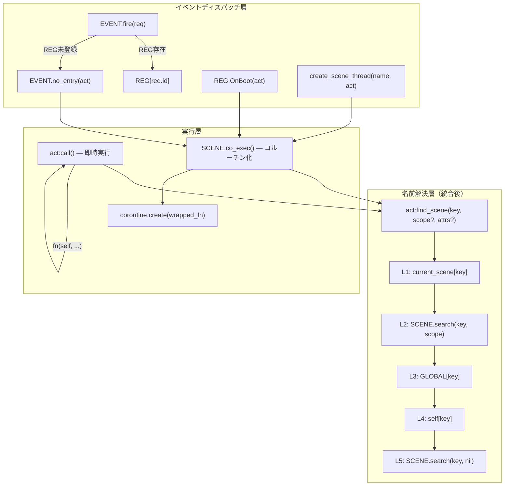
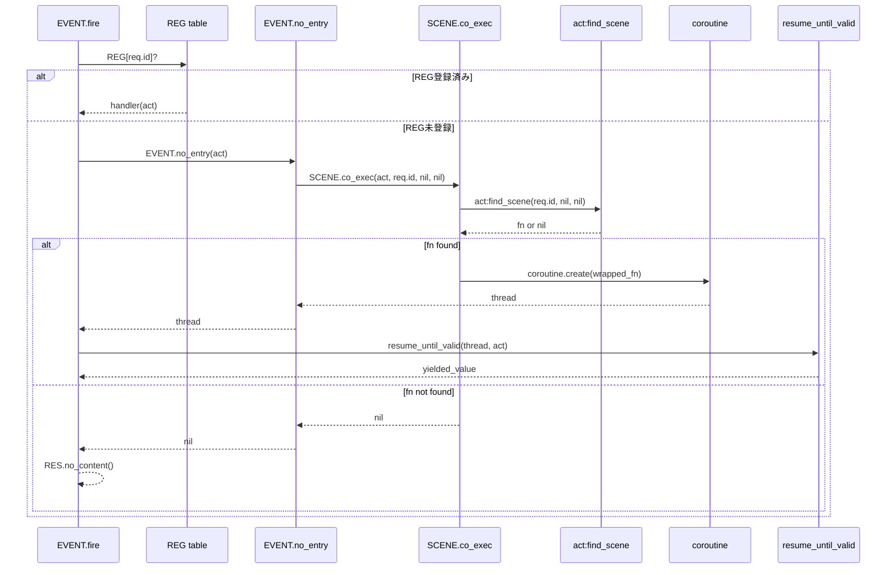
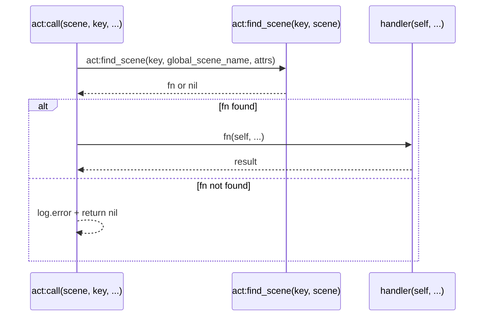

# Design Document: event-handler-call-equivalence

## Overview

**Purpose**: イベントハンドラ（`EVENT.no_entry` → `SCENE.co_exec()`）とシーン内コール（`act:call()`）の名前解決ロジックを `act:find_scene()` に統合し、コードパスを1本化する。

**Users**: ゴースト作者（DSLラベルとGLOBALの一貫した解決保証）、ランタイム開発者（コードパス1本化による保守性向上）。

**Impact**: `act.lua` に `find_scene()` を新規抽出、`scene.lua` の `co_exec()` シグネチャ変更、`event/` 配下3ファイルの呼び出し更新。既存の外部インターフェースは不変。

### Goals
- `act:find_scene()` を唯一のシーン名前解決経路として抽出する
- `act:call()` = `act:find_scene()` + 即時実行 に内部再構成する
- `SCENE.co_exec()` = `act:find_scene()` + コルーチン化 に再構成する
- 解決ロジックの複製を根絶し、経路差異による一貫性バグを防止する

### Non-Goals
- 5段階フォールバックの優先順位変更
- REG テーブルの優先制御ロジックの変更
- `EVENT.fire()` のコルーチン管理ロジックの変更
- `act:call()` の外部インターフェース（パラメータ順序・戻り値型）の変更
- パフォーマンス最適化（EVENT dispatch での L1/L4 スキップ等）

## Architecture

### Existing Architecture Analysis

現在のイベントディスパッチチェーンと `act:call()` は**異なる名前解決経路**を使用している:

```
現状:
EVENT.fire(req) → REG[id] or EVENT.no_entry
                              ↓
                         SCENE.co_exec(name)
                              ↓
                         SCENE.search()  ← L2相当のみ（GLOBAL欠落）

act:call(scene, key)
  ↓
  L1: current_scene[key]
  L2: SCENE.search(key, scene)
  L3: GLOBAL[key]           ← EVENT dispatch では欠落
  L4: self[key]
  L5: SCENE.search(key, nil)
```

**問題**: `SCENE.co_exec()` は `SCENE.search()` のみ使用し、GLOBAL テーブル (L3) へのフォールバックが存在しない。

### Architecture Pattern & Boundary Map



**Architecture Integration**:
- **Selected pattern**: Extract Method + Shared Resolution（名前解決ロジックの抽出と共有）
- **Domain boundaries**: 名前解決層（`act:find_scene`）と実行層（`call` / `co_exec`）を明確に分離
- **Existing patterns preserved**: 5段階フォールバック順序、REG 優先制御、コルーチン管理、STORE パターン
- **New components**: `ACT_IMPL.find_scene()` のみ（既存ロジックの抽出）
- **Steering compliance**: コードパス1本化原則、STORE パターン循環参照回避、Lua 命名規約準拠

### Technology Stack

| Layer | Choice / Version | Role in Feature | Notes |
|-------|------------------|-----------------|-------|
| Runtime | Lua 5.5 (mlua 0.11) | シーン名前解決・コルーチン管理 | 変更なし |
| Search | `@pasta_search` (Rust) | シーン前方一致検索 | 変更なし |
| Data | STORE, GLOBAL, SCENE tables | 名前解決対象テーブル | 変更なし |

## System Flows

### 統合後のイベントディスパッチフロー



### act:call() 内部フロー（リファクタリング後）



## Requirements Traceability

| Requirement | Summary | Components | Interfaces | Flows |
|-------------|---------|------------|------------|-------|
| 1.1 | EVENT.no_entry が act:find_scene() を使用 | FindScene, CoExec | ACT_IMPL.find_scene, SCENE.co_exec | イベントディスパッチ |
| 1.2 | 名前解決 nil → 204 No Content | CoExec, EventFire | SCENE.co_exec → nil | イベントディスパッチ |
| 1.3 | co_exec と call が同一 find_scene を共有 | FindScene, Call, CoExec | ACT_IMPL.find_scene | 両フロー |
| 1.4 | 解決優先順位のドキュメント | — | — | — |
| 2.1 | OnHour が find_scene 経由 | SceneThread, CoExec, FindScene | create_scene_thread → SCENE.co_exec → find_scene | 仮想イベント |
| 2.2 | OnTalk が find_scene 経由 | SceneThread, CoExec, FindScene | create_scene_thread → SCENE.co_exec → find_scene | 仮想イベント |
| 2.3 | GLOBAL.OnHour が検索される | FindScene | L3: GLOBAL[key] | フォールバック |
| 2.4 | DSL優先 > GLOBAL | FindScene | L2 before L3 | フォールバック |
| 3.1 | REG登録済み → find_scene スキップ | EventFire | REG[id] or EVENT.no_entry | イベントディスパッチ |
| 3.2 | REG未登録 → find_scene フォールバック | FindScene, CoExec | EVENT.no_entry → co_exec → find_scene | イベントディスパッチ |
| 3.3 | REG 登録 IF 不変 | — | — | — |
| 4.1 | find_scene 結果をコルーチン化 | CoExec | SCENE.co_exec → coroutine.create | コルーチン管理 |
| 4.2 | チェイントーク継続 | CheckTalk | STORE.co_scene チェック | 仮想イベント |
| 4.3 | act:build() の両経路での正常動作 | CoExec, Call | wrapped_fn, handler 実行 | 両フロー |
| 5.1 | 既存 DSL ラベルのみゴーストの互換性 | FindScene | L2/L5 がカバー | — |
| 5.2 | 既存 REG ハンドラの最優先維持 | EventFire | REG[id] 判定 | イベントディスパッチ |
| 5.3 | EVENT.fire 戻り値 IF 不変 | EventFire | thread/string/nil → RES | — |
| 5.4 | 既存テスト全パス | — | — | — |

## Components and Interfaces

| Component | Domain/Layer | Intent | Req Coverage | Key Dependencies | Contracts |
|-----------|--------------|--------|--------------|------------------|-----------|
| FindScene | 名前解決層 | 5段階フォールバックによるシーン名前解決 | 1.1, 1.3, 2.1-2.4, 5.1 | SCENE.search (P0), GLOBAL (P0) | Service |
| Call | 実行層 | find_scene + 即時実行 | 1.3, 4.3 | FindScene (P0) | Service |
| CoExec | 実行層 | find_scene + コルーチン化 | 1.1-1.3, 4.1, 4.3 | FindScene (P0) | Service |
| CallerUpdates | ディスパッチ層 | co_exec 呼び出しの act 引数追加 | 2.1, 2.2, 3.1, 3.2 | CoExec (P0) | — |

### 名前解決層

#### FindScene — `ACT_IMPL.find_scene()`

| Field | Detail |
|-------|--------|
| Intent | 5段階フォールバックによるシーン/関数の名前解決（検索のみ、実行しない） |
| Requirements | 1.1, 1.3, 2.1, 2.2, 2.3, 2.4, 5.1 |

**Responsibilities & Constraints**
- `act:call()` の既存5段階フォールバック検索ロジックをそのまま抽出
- 関数オブジェクトまたは `nil` を返す（実行しない）
- 検索順序の不変性を保証: L1 → L2 → L3 → L4 → L5

**Dependencies**
- Outbound: `SCENE.search()` — シーン前方一致検索 (P0)
- Outbound: `GLOBAL` — グローバル関数テーブル参照 (P0)

**Contracts**: Service [x]

##### Service Interface

```
ACT_IMPL.find_scene(self, key, global_scene_name?, attrs?)
```

- **Parameters**:
  - `self` — `Act` オブジェクト
  - `key` — `string` 検索キー（シーン名/関数名）
  - `global_scene_name` — `string|nil` グローバルシーンスコープ（省略時 nil）
  - `attrs` — `table|nil` 属性テーブル（省略時 nil）
- **Returns**: `function|nil` — 見つかったハンドラ関数、またはnil
- **Preconditions**: `key` は非 nil 文字列
- **Postconditions**: 返却された関数は `fn(act, ...)` シグネチャで呼び出し可能
- **Invariants**: 検索順序は常に L1 → L2 → L3 → L4 → L5。最初にマッチしたレベルの結果を返す

**5段階フォールバック詳細**:

| Level | 検索対象 | 条件 |
|-------|---------|------|
| L1 | `self.current_scene[key]` | シーンローカル関数 |
| L2 | `SCENE.search(key, global_scene_name, attrs).func` | スコープ付き前方一致検索 |
| L3 | `GLOBAL[key]` | グローバル関数テーブル |
| L4 | `self[key]` (type == "function") | act メソッドフォールバック |
| L5 | `SCENE.search(key, nil, attrs).func` | スコープなし全体検索 |

**Implementation Notes**
- `act:call()` L336+ の検索部分をそのまま抽出（新規ロジックなし）
- L1 の `if self.current_scene then` nil ガードは既存コード（act.lua L340）に存在し、抽出後もそのまま保持（確認済み）
- パラメータ順序は `(key, scope?, attrs?)` — `call()` の `(scope, key, attrs)` とは異なる（設計判断、詳細は `research.md` 参照）

### 実行層

#### Call — `ACT_IMPL.call()` リファクタリング

| Field | Detail |
|-------|--------|
| Intent | find_scene + 即時実行（既存外部IFを維持） |
| Requirements | 1.3, 4.3 |

**Responsibilities & Constraints**
- 外部インターフェース（パラメータ順序・戻り値型）を変更しない
- 内部で `self:find_scene(key, global_scene_name, attrs)` を呼び、結果を即時実行

**Dependencies**
- Inbound: DSL トランスパイラ生成コード — call() 呼び出し (P0)
- Outbound: FindScene — 名前解決 (P0)

**Contracts**: Service [x]

##### Service Interface

```
ACT_IMPL.call(self, global_scene_name, key, attrs, ...)
```

- **Parameters**: 変更なし（既存互換）
- **Returns**: `any` — ハンドラの実行結果、または `nil`（未発見時）
- **Preconditions**: 変更なし
- **Postconditions**: `find_scene` が非 nil を返した場合、`handler(self, ...)` が実行される
- **Invariants**: 外部呼び出し元から見た振る舞いは変更前と同一

#### CoExec — `SCENE.co_exec()` リファクタリング

| Field | Detail |
|-------|--------|
| Intent | find_scene + コルーチン化 |
| Requirements | 1.1, 1.2, 1.3, 4.1, 4.3 |

**Responsibilities & Constraints**
- `SCENE.search()` の直接呼び出しを `act:find_scene()` に置換
- コルーチン生成ロジック（`wrapped_fn` + `coroutine.create`）は変更なし
- `act` パラメータを第1引数に追加（シグネチャ変更）

**Dependencies**
- Inbound: EVENT.no_entry — イベントディスパッチ (P0)
- Inbound: REG.OnBoot — デフォルトハンドラ (P1)
- Inbound: create_scene_thread — 仮想イベント (P0)
- Outbound: FindScene — 名前解決 (P0)

**Contracts**: Service [x]

##### Service Interface

```
SCENE.co_exec(act, name, global_scene_name?, attrs?)
```

- **Parameters**:
  - `act` — `Act` オブジェクト（**新規追加**）
  - `name` — `string` シーン名（find_scene の `key` に対応）
  - `global_scene_name` — `string|nil` スコープ
  - `attrs` — `table|nil` 属性テーブル
- **Returns**: `thread|nil` — コルーチン、またはnil（未発見時）
- **Preconditions**: `act` は有効な Act オブジェクト
- **Postconditions**: 返却コルーチンは `coroutine.resume(co, act, ...)` で起動可能
- **Breaking Change**: 第1引数に `act` 追加。全呼び出し元（3箇所、内部コードのみ）の更新が必要

**Implementation Notes**
- `wrapped_fn` 内の `act:build()` 呼び出しは変更なし
- 内部で `act:find_scene(name, global_scene_name, attrs)` を呼び出す

### ディスパッチ層

#### CallerUpdates — 呼び出し元の更新

| Field | Detail |
|-------|--------|
| Intent | SCENE.co_exec() の新シグネチャに合わせた呼び出し更新 |
| Requirements | 2.1, 2.2, 3.1, 3.2 |

**変更対象**:

| File | Function | Before | After |
|------|----------|--------|-------|
| `event/init.lua` | `EVENT.no_entry(act)` | `SCENE.co_exec(act.req.id, nil, nil)` | `SCENE.co_exec(act, act.req.id, nil, nil)` |
| `event/boot.lua` | `REG.OnBoot(act)` | `SCENE.co_exec(act.req.id, nil, nil)` | `SCENE.co_exec(act, act.req.id, nil, nil)` |
| `event/virtual_dispatcher.lua` | `create_scene_thread(name, act)` | `SCENE.co_exec(event_name, nil, nil)` | `SCENE.co_exec(act, event_name, nil, nil)` |

**Implementation Notes**
- 全箇所で `act` は既に引数として利用可能
- `transfer_date_to_var` の呼び出しタイミング（`create_scene_thread` の前）は不変

## Error Handling

### Error Strategy

- `act:find_scene()` が `nil` を返却 → 呼び出し元（`call` / `co_exec`）がそれぞれ処理
  - `call()`: `log.error()` + `return nil`（既存動作維持）
  - `co_exec()`: `return nil` → `EVENT.fire()` で `RES.no_content()` (1.2)
- コルーチン内の例外 → 既存の `resume_until_valid` / `xpcall` チェーンで捕捉（変更なし）

## Testing Strategy

### Unit Tests
- `act:find_scene()` 単体テスト:
  - L1: current_scene にローカル関数が存在する場合の解決
  - L2: SCENE.search でスコープ付き一致する場合の解決
  - L3: GLOBAL テーブルに関数が登録されている場合の解決
  - L5: スコープなし全体検索でのフォールバック
  - 全レベル未発見で nil 返却

### Integration Tests
- EVENT dispatch → GLOBAL フォールバック（1.1, 2.3）:
  - `GLOBAL.OnHour` に関数登録 → OnHour 発火 → GLOBAL の関数が呼ばれる
  - `GLOBAL.OnBoot` に関数登録（REG.OnBoot のデフォルト経由）→ GLOBAL の関数が呼ばれる
- DSL + GLOBAL 共存時の優先順位（2.4）:
  - `＊OnHour` DSL ラベル + `GLOBAL.OnHour` 両方存在 → DSL 優先
- `act:call()` リグレッション:
  - 既存の call テストが全パス
- SCENE.co_exec リグレッション:
  - 既存の event_dispatch_test, virtual_event_dispatch_test が全パス

### E2E Tests
- `.pasta` フィクスチャを使用した仮想イベント E2E:
  - OnHour の DSL → EVENT.fire → find_scene → コルーチン → RES.ok 全経路
- チェイントーク + find_scene 統合:
  - `STORE.co_scene` 継続時に find_scene がスキップされることの確認

### Existing Test Verification
- `event_dispatch_test` — イベントディスパッチ基本フロー
- `event_handler_test` — REG ハンドラ登録・実行
- `virtual_event_dispatch_test` — OnHour/OnTalk 仮想イベント
- `virtual_event_config_test` — 仮想ディスパッチャ設定
- act:call() 関連テスト全件（12+件）
