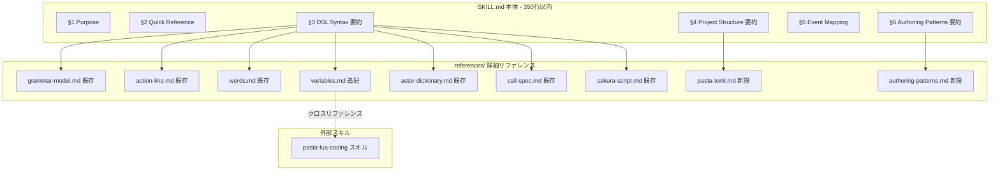
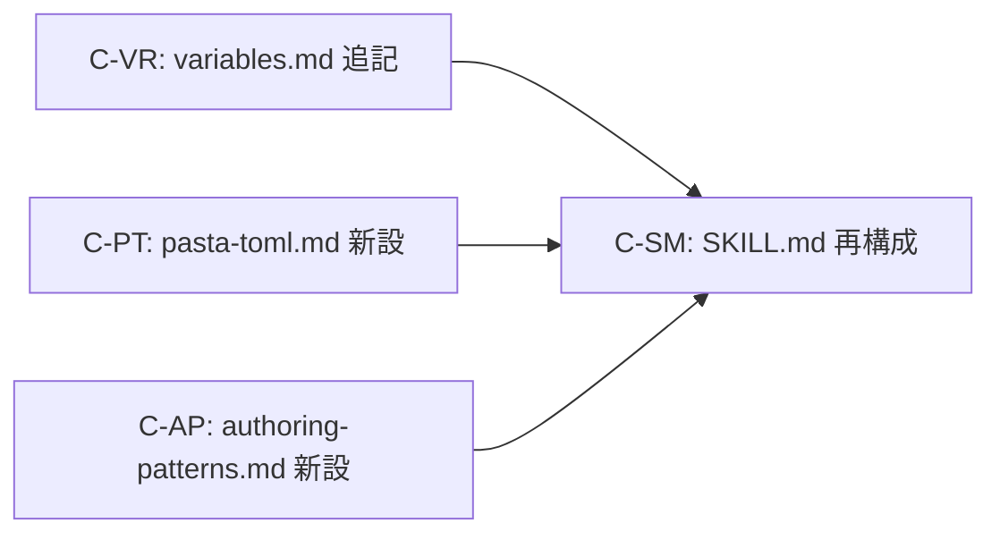

# Design Document: ghost-authoring-skill-restructure

## Overview

**Purpose**: `pasta-ghost-authoring` スキル（`.agents/skills/pasta-ghost-authoring/`）のドキュメント品質向上と構造再編を実施する。永続化メカニズムの説明追加、SAVE エンジン予約キーの記載、pasta.toml リファレンス新設、SKILL.md の大規模整理（§4・§6 分離）、バージョンバンプを一連の変更として行う。

**Users**: ゴースト辞書制作者（Pasta DSL で `.pasta` ファイルを編集する LLM およびユーザー）。

**Impact**: SKILL.md を約620行から350行以内に圧縮し、`references/` に2ファイルを新設する。既存の references/ 1ファイルに追記する。

### Goals

- 永続化メカニズム（`＄＊` → SAVE テーブル → JSON ファイル）を辞書制作者が理解できるよう文書化
- SAVE テーブルのエンジン予約キー（`pasta_` プレフィックス）の命名規約と影響を文書化
- pasta.toml の全8セクション・約33キーを網羅するリファレンスを新設
- SKILL.md を「要約 + リファレンスリンク」形式で一貫させ、350行以内に圧縮
- metadata.version を 1.4.0 → 1.5.0 にバンプ

### Non-Goals

- Rust クレート実装コードの変更
- Lua ランタイムスクリプトの変更
- `pasta-lua-coding` スキルのドキュメント変更
- 新機能の追加や DSL 言語仕様の変更

---

## Architecture

### Existing Architecture Analysis

現在のスキルフォルダ構造:

```
.agents/skills/pasta-ghost-authoring/
├── SKILL.md                  (~620行, v1.3.0)
└── references/
    ├── grammar-model.md      (~240行)
    ├── action-line.md        (~220行)
    ├── words.md              (~150行)
    ├── variables.md          (~210行)
    ├── actor-dictionary.md   (~150行)
    ├── call-spec.md          (~150行)
    └── sakura-script.md      (~120行)
```

**既存パターン**: §3 DSL Syntax は既に「要約 + 📖 リファレンスリンク」の2層構成を採用。§4 と §6 はこのパターンに従っていない。

**制約事項**:
- §1〜§6 のセクション番号体系を維持（外部参照の破壊防止）
- SKILL.md と references/ の間に記述の矛盾がないことを保証
- スキルフォルダは自己完結（pasta-lua-coding への参照はクロスリファレンスとして記載）

### Architecture Pattern & Boundary Map



**Architecture Integration**:
- **Selected pattern**: 2層ドキュメント（要約層 + リファレンス層）。既存の §3 パターンを §4・§6 に拡張
- **Domain boundaries**: SKILL.md（LLM 初回読み込み用要約）と references/（詳細が必要な場合のみ読み込み）の明確な分離
- **Existing patterns preserved**: §3 の「📖 詳細:」リンクパターン、セクション番号体系
- **New components**: `references/pasta-toml.md`（pasta.toml リファレンス）、`references/authoring-patterns.md`（§6 分離先）
- **Steering compliance**: `workflow.md` のスキルドキュメント更新基準に準拠

### Technology Stack

| Layer | Choice / Version | Role in Feature | Notes |
|-------|------------------|-----------------|-------|
| ドキュメント形式 | Markdown | スキルドキュメント全体 | YAML フロントマター付き |
| メタデータ | YAML frontmatter | SKILL.md バージョン管理 | `metadata.version` フィールド |

---

## Requirements Traceability

| Requirement | Summary | Components | Interfaces | Flows |
|-------------|---------|------------|------------|-------|
| 1.1 | variables.md に SAVE 永続化メカニズム追記 | C-VR | — | — |
| 1.2 | SKILL.md §3.4 の「永続的に有効」表現更新 | C-SM | — | — |
| 1.3 | pasta-lua-coding へのクロスリファレンス | C-VR | — | — |
| 2.1 | `pasta_` プレフィックス命名規約記載 | C-VR | — | — |
| 2.2 | エンジン予約キーの用途・既定値・影響記載 | C-VR | — | — |
| 2.3 | `pasta_` 使用時の警告記載 | C-VR | — | — |
| 3.1 | pasta-toml.md リファレンス新設 | C-PT | — | — |
| 3.2 | 全8セクションの記載 | C-PT | — | — |
| 3.3 | 各キーの型・既定値・説明・使用例 | C-PT | — | — |
| 3.4 | BudouX 設定の記載 | C-PT | — | — |
| 3.5 | SKILL.md §4 を参照形式に圧縮 | C-SM | — | — |
| 4.1 | 「要約 + リファレンスリンク」形式の一貫維持 | C-SM | — | — |
| 4.3 | セクション番号体系の維持 | C-SM, C-AP | — | — |
| 4.4 | §6 パターン集を authoring-patterns.md に分離 | C-AP, C-SM | — | — |
| 4.5 | SKILL.md 350行以内 | C-SM | — | — |
| 4.6 | 矛盾排除の保証 | C-SM, C-VR, C-PT, C-AP | — | — |
| 5.1 | metadata.version 1.4.0 → 1.5.0 | C-SM | — | — |
| 5.2 | マイナーバンプ判定 | C-SM | — | — |

---

## Components and Interfaces

| Component | Domain/Layer | Intent | Req Coverage | Key Dependencies | Contracts |
|-----------|--------------|--------|--------------|------------------|-----------|
| C-SM | SKILL.md 本体 | 要約 + リファレンスリンク形式への圧縮 | 1.2, 3.5, 4.1, 4.3, 4.4, 4.5, 4.6, 5.1, 5.2 | C-PT, C-AP, C-VR (P0) | — |
| C-VR | references/variables.md | 永続化メカニズム + SAVE 予約キー追記 | 1.1, 1.3, 2.1, 2.2, 2.3, 4.6 | pasta-lua-coding (P2) | — |
| C-PT | references/pasta-toml.md | pasta.toml 全キーリファレンス新設 | 3.1, 3.2, 3.3, 3.4, 4.6 | — | — |
| C-AP | references/authoring-patterns.md | §6 パターン集の分離先 | 4.3, 4.4, 4.6 | — | — |

---

### ドキュメント層

#### C-SM: SKILL.md 本体の再構成

| Field | Detail |
|-------|--------|
| Intent | SKILL.md を「要約 + 📖 リファレンスリンク」形式で一貫させ、350行以内に圧縮する |
| Requirements | 1.2, 3.5, 4.1, 4.3, 4.4, 4.5, 4.6, 5.1, 5.2 |

> 💡 **バージョン補足**: 本スキルの現バージョンは `1.4.0`（他機能の更新により requirements.md 作成後に進んだ）。本スペック完了時に `1.5.0` にバンプする。

**Responsibilities & Constraints**
- §3.4 Variables の「永続的に有効」を「SAVE テーブル経由でセッション間にわたりファイルに永続化される」に更新（1.2）
- §4 Project Structure の pasta.toml 記述を圧縮し、`references/pasta-toml.md` への参照に置き換え（3.5）
- §6 Authoring Patterns のパターン集（305行）を要約テーブル + 代表パターン1つに圧縮し、`references/authoring-patterns.md` への参照に置き換え（4.4）
- §1〜§6 のセクション見出しと番号体系を維持（4.3）
- 分離後の SKILL.md 内の6箇所の §6 相互参照を `references/authoring-patterns.md` 内のアンカーリンクに更新
- YAML フロントマターの `metadata.version` を `1.5.0` に更新（5.1, 5.2）
- 最終行数を350行以内に収める（4.5）

**Dependencies**
- Outbound: C-PT — §4 からの参照先 (P0)
- Outbound: C-AP — §6 からの参照先 (P0)
- Outbound: C-VR — §3.4 からの参照先 (P0)

**変更対象セクションの詳細設計**

##### §3.4 Variables 更新内容

現在の記述:
```
- **グローバル変数** `＄＊変数名`: 永続的に有効
```

更新後:
```
- **グローバル変数** `＄＊変数名`: SAVE テーブル経由でセッション間にわたりファイルに永続化される（JSON 保存）
```

追加文言（§3.4 末尾に1行追記）:
```
> 📖 永続化の詳細・SAVE エンジン予約キー: [references/variables.md](references/variables.md#永続化とsaveテーブル)
```

##### §4 Project Structure 再構成

**変更方針**: pasta.toml のインライン記述（現在~20行のコードブロック + 説明）を圧縮し、要約テーブル + リファレンスリンクに置き換える。

**変更後の §4 pasta.toml セクション構成**:

```markdown
### pasta.toml（ゴースト設定）

ゴーストの動作を制御する設定ファイル。主要セクション:

| セクション | 用途 | 辞書制作者向け重要度 |
|-----------|------|-------------------|
| `[loader]` | 辞書ファイルの読み込みパターン | ★★★ |
| `[ghost]` | トーク間隔・時報マージン等 | ★★★ |
| `[actor."名前"]` | バルーン割当・BudouX 自動改行 | ★★★ |
| `[talk]` | ウェイト・禁則処理のカスタマイズ | ★★ |
| `[persistence]` | 保存ファイルの形式・場所 | ★ |
| `[logging]` | ログ出力の設定 | ★ |
| `[package]` | パッケージメタデータ | ★ |
| `[lua]` | Lua ライブラリ選択 | ★ |

> 📖 全セクション・全キーの詳細: [references/pasta-toml.md](references/pasta-toml.md)
```

##### §6 Authoring Patterns 再構成

**変更方針**: 305行のパターン集を要約テーブル + 代表パターン1つに圧縮。

**変更後の §6 構成**:

```markdown
## §6 Authoring Patterns（辞書制作パターン集）

辞書ファイル（`.pasta`）の実践的な記述パターン。

| パターン | 内容 | 代表ファイル |
|---------|------|-------------|
| §6.1 アクター辞書定義 | `％名前` + `＠表情：\s[ID]` | `actors.pasta` |
| §6.2 イベントハンドラ | OnBoot / OnFirstBoot / OnClose | `boot.pasta` |
| §6.3 ランダムトーク | 同名 `＊OnTalk` の複数定義 | `talk.pasta` |
| §6.4 時報 | 4段階フォールバック + 日時変数 | `hour.pasta` |
| §6.5 クリック反応 | OnMouseDoubleClick | `click.pasta` |
| §6.6 シャッフル＆順次消費 | 単語・シーンの選択アルゴリズム | — |
| §6.7 継続トーク | `＞チェイントーク` / `＞yield` | `talk.pasta` |
| §6.8 ファイル分割ガイド | 責務別ファイル構成 | — |
| §6.9 自然言語→シーン変換 | LLM 向け変換ワークフロー | — |
| §6.10 複数キー単語定義 | `＠キー1、キー2：値` 構文 | — |

### 代表パターン: ランダムトーク

同名シーン `＊OnTalk` を複数定義するだけで、シャッフル＆順次消費方式でランダムに選択される。

（コードブロック: §6.3 のランダムトーク例を1つ表示）

> 📖 全パターンの詳細・応用例: [references/authoring-patterns.md](references/authoring-patterns.md)
```

**§6 相互参照の更新マップ**:

全角文字を含む Markdown ヘッダーのアンカーは GitHub / VS Code / LLM で挙動が異なる。
`references/authoring-patterns.md` の各セクション先頭に `<a id="s6-X"></a>` 形式の **明示的 HTML アンカー**を付与し、リンクはそのIDを使用する。

| 現在の参照（SKILL.md 内） | 更新後 |
|--------------------------|--------|
| `§6.6 参照`（§3.1 内） | `[authoring-patterns.md §6.6](references/authoring-patterns.md#s6-6)` |
| `§6.10 参照`（§3.3 内） | `[authoring-patterns.md §6.10](references/authoring-patterns.md#s6-10)` |
| `§6.6 参照`（§3.3 内） | `[authoring-patterns.md §6.6](references/authoring-patterns.md#s6-6)` |
| `§6.7 参照`（§3.5 内） | `[authoring-patterns.md §6.7](references/authoring-patterns.md#s6-7)` |
| `§6.7`（§5 内） | `[authoring-patterns.md §6.7](references/authoring-patterns.md#s6-7)` |
| `§6.4 参照`（§5 内） | `[authoring-patterns.md §6.4](references/authoring-patterns.md#s6-4)` |

##### 行数見積もり

| セクション | 変更前（行） | 変更後（行） | 差分 |
|-----------|-------------|-------------|------|
| §1 Purpose & Prerequisites | 16 | 16 | 0 |
| §2 Quick Reference | 15 | 15 | 0 |
| §3 DSL Syntax (3.1-3.9) | 289 | 290 | +1 |
| §4 Project Structure | 37 | ~30 | -7 |
| §5 Event Mapping | 31 | 31 | 0 |
| §6 Authoring Patterns | 305 | ~30 | -275 |
| YAML ヘッダー + 空行 | ~25 | ~25 | 0 |
| **合計** | **~620** | **~341** | **-279** |

目標350行以内を達成可能（推定 ~341行）。

**Implementation Notes**
- §3 は既に最適化されており、変更不要（§3.4 の1行更新 + 1行追記のみ）
- §5 も変更不要（相互参照リンクの文字列更新のみ、行数変化なし）
- §6 の代表パターンは §6.3 ランダムトーク（最も基本的で頻出するパターン）を選択

---

#### C-VR: references/variables.md への追記

| Field | Detail |
|-------|--------|
| Intent | 永続化メカニズムと SAVE エンジン予約キーを辞書制作者向けに文書化する |
| Requirements | 1.1, 1.3, 2.1, 2.2, 2.3, 4.6 |

**Responsibilities & Constraints**
- `＄＊変数名` が内部的に Lua の `save.変数名` に展開され、JSON ファイルに永続化されることを説明（1.1）
- 永続化の詳細（`@pasta_persistence` モジュール、gzip 圧縮等）は `pasta-lua-coding` スキルへのクロスリファレンスとして記載（1.3）
- `pasta_` プレフィックスはエンジン予約であることを命名規約として記載（2.1）
- `pasta_talk_interval_min` / `pasta_talk_interval_max` の用途・既定値・3段フォールバックを記載（2.2）
- `＄＊pasta_XXX = ...` 使用時の警告を明記（2.3）

**Dependencies**
- External: `pasta-lua-coding` スキル — クロスリファレンスターゲット (P2)

**追記セクションの構造設計**

variables.md の末尾（現在の「自動設定される日時変数」セクションの後）に以下のセクションを追加:

```markdown
---

## 永続化と SAVE テーブル

### 永続化メカニズム

グローバル変数 `＄＊変数名` は、DSL トランスパイル時に Lua の `save.変数名` に変換される。
SAVE テーブルの内容はセッション終了時に JSON ファイル（既定: `profile/pasta/save/save.json`）
に自動保存され、次回起動時に復元される。

| DSL 構文 | Lua 変換後 | 永続化 |
|---------|-----------|--------|
| `＄変数名` | `var.変数名` | ❌ シーン終了で消滅 |
| `＄＊変数名` | `save.変数名` | ✅ JSON ファイルに保存 |

> 📖 永続化の実装詳細（`@pasta_persistence` モジュール、gzip 圧縮オプション等）は
> `pasta-lua-coding` スキルを参照:
> - `references/runtime-api.md` — `@pasta_persistence`
> - `references/internal-modules.md` — SAVE モジュール

### エンジン予約キー（`pasta_` プレフィックス）

SAVE テーブルのキー名のうち、`pasta_` で始まるキーはエンジンが内部で使用する**予約キー**。
辞書制作者が意図的に変更することでエンジン動作を制御できるが、衝突を避けるため
ユーザー独自の変数には `pasta_` プレフィックスを使用しないこと。

| キー | 用途 | 既定値 | 影響 |
|------|------|--------|------|
| `pasta_talk_interval_min` | ランダムトーク最小間隔（秒） | `180` | OnTalk 発火の最小待ち時間 |
| `pasta_talk_interval_max` | ランダムトーク最大間隔（秒） | `300` | OnTalk 発火の最大待ち時間 |

**3段フォールバック**: これらのキーは以下の優先順位で決定される:
1. SAVE テーブル（`＄＊pasta_talk_interval_min`）— 最優先
2. pasta.toml `[ghost].talk_interval_min` — 次優先
3. ハードコード既定値（180秒 / 300秒）— 最終フォールバック

辞書内で `＄＊pasta_talk_interval_min＝60` と書くと、トーク間隔の下限を60秒に変更できる。

⚠️ **警告**: `pasta_` プレフィックスのキーを辞書内で変更すると、エンジンの動作に直接影響する。
変更する場合はキーの用途を理解した上で行うこと。ユーザー独自の変数には `pasta_` 以外の
プレフィックスを使用することを推奨する。
```

**Implementation Notes**
- 追記位置は既存の「自動設定される日時変数」セクションの後（ファイル末尾）
- 既存のスコープ表（`ローカル変数` / `グローバル変数`）の「永続的」を「SAVE テーブル経由で永続化（JSON 保存）」に更新
- 追記行数: 約45行

---

#### C-PT: references/pasta-toml.md 新設

| Field | Detail |
|-------|--------|
| Intent | pasta.toml の全セクション・全キーを網羅するリファレンスを新設する |
| Requirements | 3.1, 3.2, 3.3, 3.4, 4.6 |

**Responsibilities & Constraints**
- 全8セクション・約33キーを網羅的に記載（3.1, 3.2）
- 各キーにキー名・型・既定値・説明・使用例を記載（3.3）
- `[actor."名前"].budoux` の設定方法と動作説明を含める（3.4）
- 2階層アーキテクチャ（エンジン正式解析 vs カスタムフィールド）はフラットに列挙し、備考で注記（DJ-4）
- `[lua]` と `[package]` は「上級者向け」として簡潔に記載（DJ-3）

**Dependencies**
- なし（自己完結）

**ファイル構造設計**

```markdown
# pasta.toml リファレンス

> Pasta ゴーストプロジェクトの設定ファイル `pasta.toml` 全セクション・全キーのリファレンス。

---

## 概要

（pasta.toml の役割、2階層の簡潔な説明、最小構成例）

## [loader]（ファイル読み込み）

（pasta_patterns, lua_search_paths, transpiled_output_dir, debug_mode の4キー）

## [ghost]（ゴースト動作）

（talk_interval_min, talk_interval_max, hour_margin, spot_newlines の4キー）

## [actor."名前"]（アクター設定）

（spot, budoux, default_surface の3キー。budoux の設定方法・配列形式の詳細説明）

## [talk]（トーク表示制御）

（script_wait_* 5キー + chars_* 6キー）

## [persistence]（永続化）

（obfuscate, file_path, debug_mode の3キー）

## [logging]（ログ出力）

（file_path, rotation_days, level, filter の4キー）

## [package]（パッケージ情報）★ 上級者向け

（name, version, edition の3キー。簡潔に記載）

## [lua]（Lua ライブラリ）★ 上級者向け

（libs の1キー。簡潔に記載、詳細は pasta-lua-coding 参照）

## 最小構成例

（hello-pasta の pasta.toml をベースにした最小構成例）
```

**各セクションの記載フォーマット（統一）**:

```markdown
## [セクション名]（日本語説明）

セクションの1行説明。

| キー | 型 | 既定値 | 説明 |
|------|-----|--------|------|
| `key_name` | `type` | `default` | 説明文 |

### key_name

（補足が必要なキーのみ詳細サブセクションを設ける）

**使用例**:
（toml コードブロック）
```

**推定行数**: ~180行

**Implementation Notes**
- [ghost] セクションの `talk_interval_min/max` は variables.md のエンジン予約キーセクションとの重複に注意。pasta-toml.md では「設定ファイルでの初期値指定」の観点で記載し、「DSL からの実行時変更」は variables.md に委譲
- `[actor."名前"]` は複数定義可能であることを明示（`[actor."女の子"]`, `[actor."男の子"]` 等）
- budoux の設定例: `budoux = [10, 12]` → 1行目≤10文字、2行目以降≤12文字

---

#### C-AP: references/authoring-patterns.md 新設

| Field | Detail |
|-------|--------|
| Intent | SKILL.md §6 のパターン集をリファレンスファイルとして分離する |
| Requirements | 4.3, 4.4, 4.6 |

**Responsibilities & Constraints**
- SKILL.md §6 の全サブセクション（§6.1〜§6.10）の内容を移動
- セクション番号体系（6.1〜6.10）を維持し、SKILL.md からのアンカーリンクを機能させる
- 移動時に内容の変更は行わない（現行コンテンツをそのまま移動）
- ファイル先頭に概要説明とスキル本体への逆参照を記載

**Dependencies**
- なし（C-SM から参照されるのみ）

**ファイル構造設計**

```markdown
# 辞書制作パターン集

> Pasta DSL 辞書ファイル（`.pasta`）の実践的な記述パターンの詳細リファレンス。
> 本ファイルは [SKILL.md §6](../SKILL.md#6-authoring-patterns辞書制作パターン集) の詳細版。

---

<a id="s6-1"></a>
## 6.1 アクター辞書定義（actors.pasta）
（現 SKILL.md §6.1 の内容をそのまま移動）

<a id="s6-2"></a>
## 6.2 イベントハンドラ（boot.pasta）
（現 SKILL.md §6.2）

<a id="s6-3"></a>
## 6.3 ランダムトーク（talk.pasta）
（現 SKILL.md §6.3）

<a id="s6-4"></a>
## 6.4 時報（hour.pasta / talk.pasta）
（現 SKILL.md §6.4 — 最大セクション、日時変数テーブル含む）

<a id="s6-5"></a>
## 6.5 クリック反応（click.pasta）
（現 SKILL.md §6.5）

<a id="s6-6"></a>
## 6.6 単語ランダム選択（シャッフル＆順次消費方式）
（現 SKILL.md §6.6）

<a id="s6-7"></a>
## 6.7 継続トーク（チェイントーク）
（現 SKILL.md §6.7）

<a id="s6-8"></a>
## 6.8 ファイル分割ガイド
（現 SKILL.md §6.8）

<a id="s6-9"></a>
## 6.9 自然言語→シーン変換指針
（現 SKILL.md §6.9）

<a id="s6-10"></a>
## 6.10 複数キー単語定義（マルチキー）
（現 SKILL.md §6.10）
```

**推定行数**: ~305行（現 §6 の内容 + ヘッダー追加分）

**Implementation Notes**
- §6.4 の日時変数テーブルは variables.md にも記載があるが、ここでは「辞書制作パターン」としてのコンテキスト（使用例付き）を維持する。variables.md が「リファレンス」、authoring-patterns.md が「パターン集（ハウツー）」という役割分離
- 移動時はコンテンツをそのままコピーし、変更しない（矛盾防止: 4.6）
- 各セクション先頭に `<a id="s6-X"></a>` 形式の **明示的 HTML アンカー**を付与（D-1 クローズ: GitHub / VS Code / LLM いずれでも同一アンカーで到達できることを保証）
- 自動生成アンカー（全角文字依存）は **使用しない**

---

## Data Models

本仕様はドキュメントのみの変更のため、データモデルの変更はなし。

---

## 変更ファイル一覧

| # | ファイル | 操作 | 推定行数 | 主要要件 |
|---|---------|------|---------|---------|
| 1 | `SKILL.md` | 編集 | ~340行（-280行） | 1.2, 3.5, 4.1, 4.3, 4.4, 4.5, 5.1, 5.2 |
| 2 | `references/variables.md` | 追記 | ~255行（+45行） | 1.1, 1.3, 2.1, 2.2, 2.3 |
| 3 | `references/pasta-toml.md` | 新設 | ~180行 | 3.1, 3.2, 3.3, 3.4 |
| 4 | `references/authoring-patterns.md` | 新設 | ~310行 | 4.3, 4.4 |

**変更後のスキルフォルダ構成**:

```
.agents/skills/pasta-ghost-authoring/
├── SKILL.md                  (~340行, v1.4.0)
└── references/
    ├── grammar-model.md      (~240行) — 変更なし
    ├── action-line.md        (~220行) — 変更なし
    ├── words.md              (~150行) — 変更なし
    ├── variables.md          (~255行) — 追記
    ├── actor-dictionary.md   (~150行) — 変更なし
    ├── call-spec.md          (~150行) — 変更なし
    ├── sakura-script.md      (~120行) — 変更なし
    ├── pasta-toml.md         (~180行) — 新設
    └── authoring-patterns.md (~310行) — 新設
```

---

## 実装順序の制約



1. **Phase 1**（並列可能）: C-VR、C-PT、C-AP の3ファイルを作成・追記
2. **Phase 2**: C-SM — SKILL.md の再構成（Phase 1 の成果物へのリンクを含む）
3. **Phase 3**: 矛盾チェック + 行数検証
