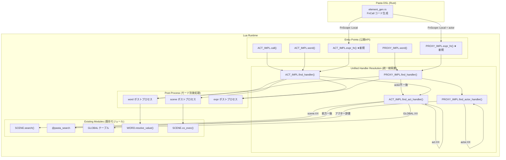
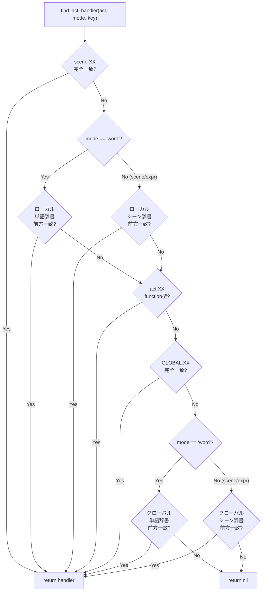
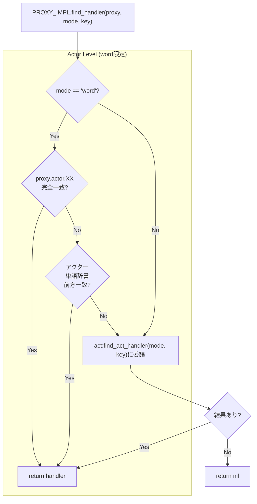

# Design Document: handler-resolution-fallback

## Overview

**Purpose**: `ACT_IMPL` と `PROXY_IMPL` に分散する3つのハンドラー検索経路（シーン解決・ワード取得・expr関数呼び出し）を、共通の `find_handler()` / `find_act_handler()` / `find_actor_handler()` で統一する。新規の `expr_fn` メソッドおよびトランスパイラ変更を含む。

**Users**: ランタイム開発者（フォールバック順序の一貫性・保守性向上）、ゴースト制作者（`＠func()` 構文で辞書定義場所を意識せず関数を呼び出せる）。

**Impact**: `act.lua` / `actor.lua` の内部検索ロジックを全面書き換え。`element_gen.rs` のローカル関数呼び出しコード生成を変更。外部インターフェース（`act:word()`, `act:call()`, `proxy:word()`）の振る舞いはフォールバック順序の正規化を除き互換。

### Goals
- 3経路のフォールバック検索を `find_handler` 1系統に集約し、順序の一貫性を保証する
- 新規 `expr_fn` メソッドにより、DSLのローカル関数呼び出しをフォールバック検索経由で実行する
- モード別ポストプロセスを明確に分離し、呼び出し側が型判定を意識しない設計にする

### Non-Goals
- `FnScope::Global`（`＠＊func()`）のコード生成変更（直接参照を維持）
- `scene.lua` の `SCENE.search()` 内部リファクタリング（本フィーチャーのスコープ外）
- `ACT_IMPL.call()` のシグネチャ変更（find_scene → find_handler の内部委譲のみ）

---

## Architecture

### Existing Architecture Analysis

**現行3経路の構造**:

```
ACT_IMPL.find_scene(key)    ─── 5段階独自フォールバック
ACT_IMPL.word(name)         ─── 4段階独自フォールバック
PROXY_IMPL.word(name)       ─── 3段階+act:word()委譲
```

**問題点**:
- フォールバック順序が経路ごとに異なる（GLOBAL の位置が `word` では L2、`find_scene` では L3）
- `word` と `find_scene` で同じ検索対象（scene[key], GLOBAL[key]）を異なる順序で検索
- `expr_fn` 追加時に4つ目の独自経路が生まれるリスク

**維持する既存パターン**:
- `@pasta_search` の pcall 保護パターン
- `SCENE.co_exec()` によるコルーチン化
- `ACT_IMPL.__index` のメタテーブル経由アクタープロキシ生成
- `SHIORI_ACT_IMPL` → `ACT_IMPL` の継承チェーン

> **注**: `WORD.resolve_value()` は本フィーチャーで廃止。ポストプロセス（word モード: function/その他 の2分岐）はインライン実装に移行する。table→先頭要素ロジックは `SEARCH:search_word()` の Rust 側で完結しているためポストプロセス層では不要。

### Architecture Pattern & Boundary Map



**Architecture Integration**:
- **Selected pattern**: 既存コンポーネント拡張（Option C: ハイブリッド）。各 IMPL テーブルのメソッドとして配置
- **Domain boundaries**: 検索層（find_handler/find_act_handler/find_actor_handler）とポストプロセス層（word/scene/expr）を明確に分離。検索層は「ハンドラーを返す」のみ、実行は行わない
- **Existing patterns preserved**: pcall 保護、WORD.resolve_value、SCENE.co_exec、メタテーブル継承
- **New components rationale**: `find_handler` / `find_act_handler` / `find_actor_handler` / `expr_fn` はすべて既存モジュール（act.lua / actor.lua）内のメソッド追加。新規ファイルなし

### Technology Stack

| Layer | Choice / Version | Role in Feature | Notes |
|-------|------------------|-----------------|-------|
| Lua ランタイム | Lua 5.5 (mlua 0.11) | フォールバック検索ロジック・ポストプロセス実装 | `act.lua`, `actor.lua` |
| Rust トランスパイラ | Rust 2024 edition | FnCall コード生成の変更 | `element_gen.rs` |
| 検索バインディング | `@pasta_search` (Rust) | 前方一致検索（単語辞書・シーン辞書） | pcall 保護で利用 |
| テスト | lua_test + insta | Lua BDD テスト + Rust スナップショットテスト | 既存テスト全パス必須 |

---

## System Flows

### フォールバック検索フロー（find_act_handler）



### プロキシ経由検索フロー（PROXY_IMPL.find_handler）



---

## Requirements Traceability

| Requirement | Summary | Components | Interfaces | Flows |
|-------------|---------|------------|------------|-------|
| 1.1 | ACT_IMPL.find_handler | FindHandlerAct | find_handler(act, mode, key) | find_act_handler フロー |
| 1.2 | PROXY_IMPL.find_handler | FindHandlerProxy | find_handler(proxy, mode, key) | プロキシ検索フロー |
| 1.3 | find_actor_handler | FindActorHandler | find_actor_handler(proxy, mode, key) | プロキシ検索フロー Actor Level |
| 1.4 | find_act_handler | FindActHandler | find_act_handler(act, mode, key) | find_act_handler フロー |
| 2.1–2.11 | フォールバック戦略 | FindActHandler, FindActorHandler | — | 両フロー |
| 3.1–3.7 | モード別ポストプロセス | PostProcess | word/scene/expr ポストプロセス | — |
| 4.1–4.3 | expr_fn 新設 | ExprFn | expr_fn(act/proxy, key, ...) | — |
| 5.1–5.3 | トランスパイラ変更 | CodeGen | generate_action/generate_expr | — |
| 6.1–6.4 | 既存リファクタリング | Refactor | word(), find_scene() | — |
| 7.1–7.2 | エラーログ | ErrorLog | @pasta_log | — |

---

## Components and Interfaces

| Component | Domain/Layer | Intent | Req Coverage | Key Dependencies | Contracts |
|-----------|-------------|--------|--------------|------------------|-----------|
| FindActHandler | Lua ランタイム / act.lua | actスコープのフォールバック検索 | 1.1, 1.4, 2.4–2.11 | SCENE, SEARCH, GLOBAL (P0) | Service |
| FindActorHandler | Lua ランタイム / actor.lua | アクタースコープのフォールバック検索 | 1.2, 1.3, 2.1–2.3 | SEARCH (P1) | Service |
| FindHandlerAct | Lua ランタイム / act.lua | act 経由の統一検索エントリ | 1.1 | FindActHandler (P0) | Service |
| FindHandlerProxy | Lua ランタイム / actor.lua | proxy 経由の統一検索エントリ | 1.2 | FindActorHandler, FindActHandler (P0) | Service |
| PostProcess | Lua ランタイム / act.lua, actor.lua | モード別ハンドラー後処理 | 3.1–3.7 | WORD, SCENE.co_exec (P0), @pasta_log (P1) | Service |
| ExprFn | Lua ランタイム / act.lua, actor.lua | expr関数呼び出しメソッド | 4.1–4.3 | FindHandlerAct/Proxy, PostProcess (P0) | Service |
| CodeGen | Rust トランスパイラ | FnCall ローカルスコープコード生成 | 5.1–5.3 | pasta_dsl AST (P0) | — |
| Refactor | Lua ランタイム / act.lua, actor.lua | 既存 word/find_scene の書き換え | 6.1–6.4 | FindHandlerAct/Proxy, PostProcess (P0) | Service |
| ErrorLog | Lua ランタイム | ハンドラー未発見時の診断ログ | 7.1–7.2 | @pasta_log (P1) | — |

### Lua ランタイム層

#### FindActHandler

| Field | Detail |
|-------|--------|
| Intent | act スコープ（ローカル→act.XX→グローバル）のフォールバック検索 |
| Requirements | 1.4, 2.4, 2.5, 2.6, 2.7, 2.8, 2.9, 2.10, 2.11 |

**Responsibilities & Constraints**
- `key` に対するハンドラーを以下の優先順で検索し、最初のマッチを返却する
- モード（`"word"` / `"scene"` / `"expr"`）に応じて前方一致検索の対象辞書を切り替える
- `@pasta_search` の可用性は関数先頭で1回のみ pcall チェック
- `nil` を返した場合、呼び出し側が未発見処理を行う

**Dependencies**
- Inbound: FindHandlerAct, FindHandlerProxy — フォールバック検索委譲 (P0)
- Outbound: SCENE テーブル — `scene.XX` 完全一致検索 (P0)
- Outbound: `@pasta_search` — 前方一致検索 (P1, pcall 保護)
- Outbound: GLOBAL テーブル — `GLOBAL.XX` 完全一致検索 (P0)

**Contracts**: Service [x]

##### Service Interface

```lua
--- act スコープのフォールバック検索
--- @param self table ACT インスタンス
--- @param mode string "word" | "scene" | "expr"
--- @param key string 検索キー
--- @return any|nil マッチしたハンドラー、または nil
function ACT_IMPL.find_act_handler(self, mode, key)
```

- Preconditions: `mode` は `"word"` / `"scene"` / `"expr"` のいずれか。`key` は非nil文字列
- Postconditions: 戻り値は検索にマッチした値（function / string / table / その他）、または nil
- Invariants: フォールバック順序は常に以下の固定順序:
  1. `scene.XX` 完全一致（全モード）
  2. ローカル辞書前方一致（word: 単語辞書 / scene,expr: シーン辞書）
  3. `act.XX` 完全一致・function型限定（全モード）
  4. `GLOBAL.XX` 完全一致（全モード）
  5. グローバル辞書前方一致（word: 単語辞書 / scene,expr: シーン辞書）
  6. nil

**Implementation Notes**
- `self.current_scene[key]` の nil チェック（current_scene が nil の場合をガード）
- `self[key]`（act.XX）は `type(method) == "function"` チェック付き。メタテーブル経由で SHIORI_ACT_IMPL のメソッドも検索される
- `@pasta_search` 未実装時、前方一致レベル（2, 5）はすべてスキップ
- **SCENE.search スコープ**: `SCENE.search(key, scope, nil)` の `scope` には `SCENE.__global_name__` を使用する。トランスパイラ（`element_gen.rs` L.105, L.114）は `act:call()` の第1引数を**常に `SCENE.__global_name__`** として生成するため、`find_act_handler` がこれをパラメータとして受け取る必要はない。ローカル前方一致（Level 2）は `SCENE.__global_name__`、グローバル前方一致（Level 5）は `nil` としてそれぞれ渡す。

---

#### FindActorHandler

| Field | Detail |
|-------|--------|
| Intent | アクタースコープ（proxy.actor.XX → アクター辞書）の検索 |
| Requirements | 1.3, 2.1, 2.2, 2.3 |

**Responsibilities & Constraints**
- アクターレベルの検索は `mode == "word"` のときのみ実行
- `mode` が `"word"` 以外の場合は即座に nil を返却
- アクター辞書のスコープ名は `"__actor_{actor.name}__"` 形式

**Dependencies**
- Inbound: FindHandlerProxy — アクターレベル検索委譲 (P0)
- Outbound: `proxy.actor` テーブル — 完全一致検索 (P0)
- Outbound: `@pasta_search` — アクター辞書前方一致検索 (P1, pcall 保護)

**Contracts**: Service [x]

##### Service Interface

```lua
--- アクタースコープのフォールバック検索（word モード限定）
--- @param self table PROXY インスタンス
--- @param mode string "word" | "scene" | "expr"
--- @param key string 検索キー
--- @return any|nil マッチしたハンドラー、または nil
function PROXY_IMPL.find_actor_handler(self, mode, key)
```

- Preconditions: `self.actor` が非nil。`mode` は `"word"` / `"scene"` / `"expr"` のいずれか
- Postconditions: `mode ~= "word"` の場合は常に nil。`mode == "word"` の場合は検索結果または nil
- Invariants: 検索順序は `proxy.actor.XX` 完全一致 → アクター辞書前方一致

**Implementation Notes**
- `proxy.actor` の `resolve_value` 相当（actor.XX が function の場合は呼び出し対象として返す）は word ポストプロセスの責務であり、find_actor_handler はフィルタリングしない（生の値を返す）

---

#### FindHandlerAct / FindHandlerProxy

| Field | Detail |
|-------|--------|
| Intent | 統一検索エントリポイント。呼び出し側（word/call/expr_fn）が直接使う |
| Requirements | 1.1, 1.2 |

**Contracts**: Service [x]

##### Service Interface

```lua
--- act 経由の統一ハンドラー検索
--- @param self table ACT インスタンス
--- @param mode string "word" | "scene" | "expr"
--- @param key string 検索キー
--- @return any|nil
function ACT_IMPL.find_handler(self, mode, key)
    return self:find_act_handler(mode, key)
end

--- proxy 経由の統一ハンドラー検索（アクターレベル → act 委譲）
--- @param self table PROXY インスタンス
--- @param mode string "word" | "scene" | "expr"
--- @param key string 検索キー
--- @return any|nil
function PROXY_IMPL.find_handler(self, mode, key)
    local h = self:find_actor_handler(mode, key)
    if h then return h end
    return self.act:find_act_handler(mode, key)
end
```

- Preconditions: find_act_handler / find_actor_handler と同一
- Postconditions: 最初にマッチしたハンドラー、またはすべての検索を通過して nil
- Invariants: アクターレベル → act レベルの順序は不変

---

#### PostProcess

| Field | Detail |
|-------|--------|
| Intent | モード別のハンドラー後処理（検索結果を実行可能形式に変換） |
| Requirements | 3.1, 3.2, 3.3, 3.4, 3.5, 3.6, 3.7 |

**Responsibilities & Constraints**
- ポストプロセスは各公開メソッド（`word()` / `call()` / `expr_fn()`）内でインラインに実装。独立関数ではない
- **共有不可の理由**: ① word は `tostring(h)` 分岐を持つが expr/scene は持たない ② word の caller は `self.act`（PROXY経由）だが expr は `self`（proxy自身） ③ expr_fn と call は構造が同じだがファイルが分かれている（act.lua vs actor.lua）。よって `local function` では共有できない
- 各モードの型判定ルール:

| モード | handler型 | 処理 |
|--------|-----------|------|
| word | nil | エラーログ + return nil |
| word | function | `h(caller)` を呼び出し、戻り値を返す |
| word | その他 | `tostring(h)` を返す |
| scene | function | コルーチン化して実行 |
| scene | 非function | エラーログ + return nil |
| expr | function | `h(caller, ...)` を呼び出し、戻り値を返す |
| expr | 非function | エラーログ + return nil |

- `caller` は `act`（ACT_IMPL経由）または `proxy`（PROXY_IMPL経由）

---

#### ExprFn

| Field | Detail |
|-------|--------|
| Intent | DSL ローカル関数呼び出しのランタイムエントリポイント |
| Requirements | 4.1, 4.2, 4.3 |

**Dependencies**
- Inbound: トランスパイラ生成コード — `act:expr_fn("key", ...)` / `proxy:expr_fn("key", ...)` (P0)
- Outbound: FindHandlerAct / FindHandlerProxy — ハンドラー検索 (P0)

**Contracts**: Service [x]

##### Service Interface

```lua
--- act 経由の expr 関数呼び出し
--- @param self table ACT インスタンス
--- @param key string 関数名
--- @param ... any 可変引数
--- @return any|nil
function ACT_IMPL.expr_fn(self, key, ...)
    local h = self:find_handler("expr", key)
    -- expr ポストプロセス
    if type(h) == "function" then
        return h(self, ...)
    end
    -- h が nil または非function → エラーログ + return nil
end

--- proxy 経由の expr 関数呼び出し
--- @param self table PROXY インスタンス
--- @param key string 関数名
--- @param ... any 可変引数
--- @return any|nil
function PROXY_IMPL.expr_fn(self, key, ...)
    local h = self:find_handler("expr", key)
    -- expr ポストプロセス
    if type(h) == "function" then
        return h(self, ...)
    end
    -- h が nil または非function → エラーログ + return nil
end
```

- Preconditions: `key` は非nil文字列
- Postconditions: function ハンドラー発見時は実行結果。それ以外は nil
- Invariants: 可変引数はハンドラーにそのまま伝搬

---

### Rust トランスパイラ層

#### CodeGen

| Field | Detail |
|-------|--------|
| Intent | `FnScope::Local` の FnCall コード生成を find_handler 経由に変更 |
| Requirements | 5.1, 5.2, 5.3 |

**Responsibilities & Constraints**
- `FnScope::Local` のみ変更。`FnScope::Global` は `GLOBAL.func(act, ...)` のまま維持
- Action::FnCall（アクター付き）→ `proxy:expr_fn("key", ...)` 形式
- Expr::FnCall（式）→ `act:expr_fn("key", ...)` 形式
- 引数のリテラル化・エスケープは既存の `generate_args_string()` を再利用

**Dependencies**
- Inbound: pasta_dsl AST — `Action::FnCall`, `Expr::FnCall`, `FnScope` 定義 (P0)

**Contracts**: —（Rust 関数の内部変更のみ）

**Implementation Notes**

変更対象箇所（`element_gen.rs`）:

| 箇所 | 現行出力 | 変更後出力 |
|------|----------|-----------|
| `generate_action()` の `Action::FnCall { scope: Local }` | `act.{actor}:talk(tostring(SCENE.{name}(act, ...)))` | `act.{actor}:talk(tostring(act.{actor}:expr_fn("{name}", ...)))` |
| `generate_expr()` の `Expr::FnCall { scope: Local }` | `SCENE.{name}(act, ...)` | `act:expr_fn("{name}", ...)` |
| `generate_expr_to_buffer()` の `Expr::FnCall { scope: Local }` | `SCENE.{name}(act, ...)` | `act:expr_fn("{name}", ...)` |

- `Action::FnCall` では `actor` 変数が利用可能。`act.{actor}` でプロキシを取得し `:expr_fn()` を呼ぶ
- `Expr::FnCall` では actor 情報がないため `act:expr_fn()` を使用
- 関数名 `{name}` は文字列リテラルとして渡す（`string_literalizer` で Lua 文字列エスケープ）

---

### Refactor

| Field | Detail |
|-------|--------|
| Intent | 既存の word() / find_scene() を find_handler ベースに移行 |
| Requirements | 6.1, 6.2, 6.3, 6.4 |

**Implementation Notes**

| 対象メソッド | Before | After |
|--------------|--------|-------|
| `ACT_IMPL.word(name)` | 4段階独自検索 + WORD.resolve_value | `find_handler("word", name)` + word ポストプロセス |
| `PROXY_IMPL.word(name)` | 3段階 + act:word() 委譲 | `find_handler("word", name)` + word ポストプロセス |
| `ACT_IMPL.find_scene(key, ...)` | 5段階独自検索 | `find_handler("scene", key)` の thin wrapper（ハンドラーを返すのみ） |
| `ACT_IMPL.call(key, ...)` | find_scene + handler 実行 | `find_handler("scene", key)` → ハンドラーを `handler(self, ...)` で直接実行（`call()` はすでに `SCENE.co_exec()` によるコルーチン内で呼ばれるため再度コルーチン化しない） |

- `ACT_IMPL.find_scene()` は `find_handler("scene", key)` のラッパーとして残す（`call()` からの呼び出し互換性のため）
- `PROXY_IMPL.word()` の `act:word()` 委譲は不要になる（`find_handler` がアクターレベル → actレベルを一貫して検索）

---

### ErrorLog

| Field | Detail |
|-------|--------|
| Intent | ハンドラー未発見時に key・mode・経路の診断情報をログ出力 |
| Requirements | 7.1, 7.2 |

**Implementation Notes**
- `@pasta_log` モジュールの `log.warn()` を使用（`log.error()` は致命的な場合のみ）
- フォーマット: `"handler not found: key='%s', mode='%s', via='%s'"` （via = "act" or "proxy"）
- ログ出力後は例外を投げず nil を返却

---

## Error Handling

### Error Strategy

ハンドラー未発見は**ゴーストのクラッシュにつながってはならない**。すべてのケースで nil 返却 + ログ出力。

### Error Categories and Responses

| カテゴリ | 条件 | 対応 |
|---------|------|------|
| ハンドラー未発見 | find_handler → nil | `log.warn` + nil 返却 |
| キーが nil | word/expr_fn に nil key が渡された | `log.warn` + 即座に nil 返却（検索スキップ） |
| SEARCH 利用不可 | pcall 失敗 | 前方一致レベルをスキップ（silent） |
| handler が非function（scene/expr） | find_handler は値を返すが function でない | `log.warn` + nil 返却 |

---

## Testing Strategy

### Lua Unit Tests (lua_specs/)

1. **find_act_handler フォールバック順序テスト**: 各レベル（scene.XX → ローカル辞書 → act.XX → GLOBAL.XX → グローバル辞書 → nil）の優先順位を個別に検証。モード別（word/scene/expr）でのレベルスキップを検証
2. **find_actor_handler テスト**: word モードでのアクター完全一致・前方一致。非word モードでの即座 nil 返却
3. **find_handler 統合テスト**: PROXY_IMPL.find_handler のアクター→act委譲フロー
4. **expr_fn テスト**: 関数ハンドラー呼び出し・可変引数伝搬・非function エラーログ
5. **act.XX 保護位置テスト**: act.XX が GLOBAL.XX より前に解決されることの検証（`act_method_fallback_test.lua` 更新）

### Rust Integration Tests

1. **スナップショットテスト更新**: `FnScope::Local` のコード生成出力が `act:expr_fn()` / `proxy:expr_fn()` 形式であることを検証
2. **既存テスト全パス**: 950+ 件のリグレッションなし

### E2E Tests (fixtures/)

1. **ローカル関数呼び出し E2E**: `.pasta` ファイルから `＠func()` → `act:expr_fn("func", ...)` → ハンドラー実行 → 結果返却の一連のフロー
2. **アクター付き関数呼び出し E2E**: `さくら：＠func()` → `proxy:expr_fn("func", ...)` → アクターレベル検索 → act レベルフォールバックのフロー

---

## Supporting References

### フォールバック優先順位マトリックス（確定版）

**アクターレベル**（PROXY_IMPL.find_actor_handler、word モード限定）:

| 順位 | 検索対象 | 一致方式 | word | scene | expr |
|------|---------|---------|:----:|:-----:|:----:|
| A1 | `proxy.actor.XX` | 完全一致 | ✅ | — | — |
| A2 | アクター単語辞書 | 前方一致 | ✅ | — | — |

**act レベル**（ACT_IMPL.find_act_handler、全モード）:

| 順位 | 検索対象 | 一致方式 | word | scene | expr |
|------|---------|---------|:----:|:-----:|:----:|
| 1 | `scene.XX`（current_scene[key]） | 完全一致 | ✅ | ✅ | ✅ |
| 2 | ローカル単語辞書 | 前方一致 | ✅ | — | — |
| 2 | ローカルシーン辞書 | 前方一致 | — | ✅ | ✅ |
| 3 | `act.XX`（self[key] if function） | 完全一致 | ✅ | ✅ | ✅ |
| 4 | `GLOBAL.XX` | 完全一致 | ✅ | ✅ | ✅ |
| 5 | グローバル単語辞書 | 前方一致 | ✅ | — | — |
| 5 | グローバルシーン辞書 | 前方一致 | — | ✅ | ✅ |
| 6 | nil | — | ✅ | ✅ | ✅ |

### トランスパイラ コード生成変更表

| コンテキスト | Scope | Before | After |
|-------------|-------|--------|-------|
| Action::FnCall (アクター付き) | Local | `act.{actor}:talk(tostring(SCENE.{name}(act, ...)))` | `act.{actor}:talk(tostring(act.{actor}:expr_fn("{name}", ...)))` |
| Action::FnCall (アクター付き) | Global | `act.{actor}:talk(tostring(GLOBAL.{name}(act, ...)))` | **変更なし** |
| Expr::FnCall (式) | Local | `SCENE.{name}(act, ...)` | `act:expr_fn("{name}", ...)` |
| Expr::FnCall (式) | Global | `GLOBAL.{name}(act, ...)` | **変更なし** |

### 変更対象ファイル一覧

| ファイル | 変更内容 |
|---------|---------|
| `pasta_scripts/pasta/act.lua` | `find_handler`, `find_act_handler`, `expr_fn` 追加。`word()`, `find_scene()` リファクタリング |
| `pasta_scripts/pasta/actor.lua` | `find_handler`, `find_actor_handler`, `expr_fn` 追加。`word()` リファクタリング |
| `src/code_gen/element_gen.rs` | `Action::FnCall(Local)`, `Expr::FnCall(Local)` のコード生成変更 |
| `tests/lua_specs/act_find_scene_test.lua` | フォールバック順序テスト全面書き換え |
| `tests/lua_specs/act_method_fallback_test.lua` | act.XX 位置変更に伴うテスト更新 |
| `tests/lua_specs/` | find_act_handler / find_actor_handler / expr_fn 新規テスト追加 |
| `tests/transpiler/snapshots/` | insta スナップショット更新 |
