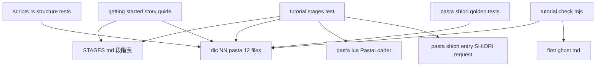
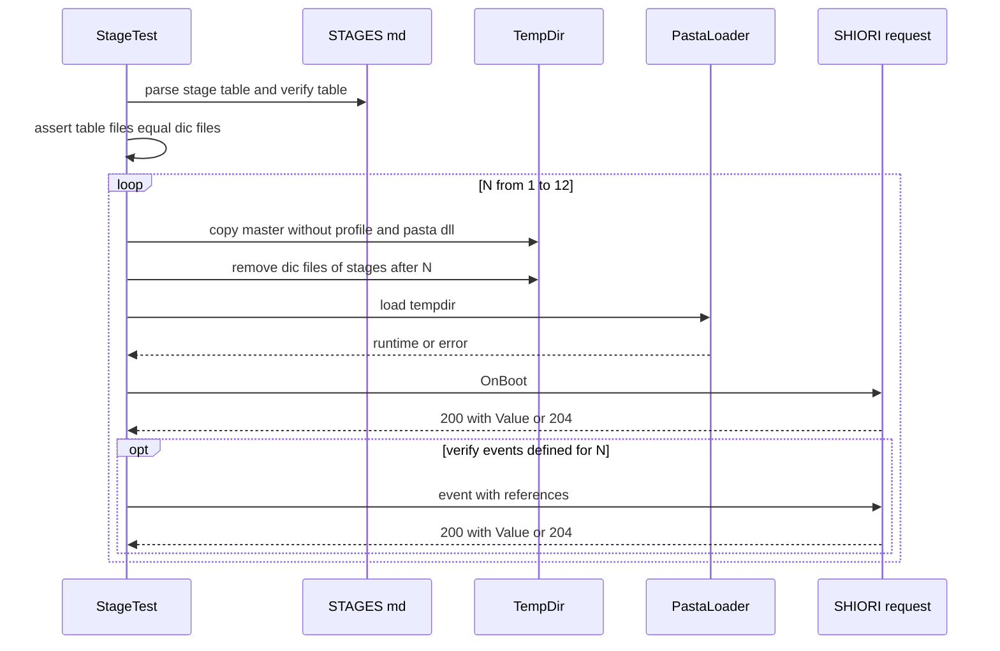

# 設計書: hello-pasta-tutorial-stages

## Overview

**Purpose**: 入門ガイドの読者が「こんな表現をしたい」を 1 章ずつ叶え、章の終わりごとに自分のゴーストを起動して確かめられるよう、hello-pasta の配布辞書を**段階ごとのファイル**に組み替え、その段階の順と中身を**段階表**として確定し、全段階が読み込めて起動できることを `cargo test -p pasta_sample_ghost` で保証する。

**Users**: 下流 spec `getting-started-story-guide` の執筆者は段階表と段階辞書を逐語で引用する。入門ガイドの読者は章ごとに `.pasta` を 1 つ `dic/` に足していく。保守者は CI で全段階の読み込みを監視する。

**Impact**: `ghosts/hello-pasta/ghost/master/dic/` の 5 ファイル（`actors`・`boot`・`talk`・`click`・`choice`）を、段階番号を接頭にした 12 ファイル（`01-boot.pasta`〜`12-lua.pasta`）に置き換える。`OnBoot` の固定文が変わるため、`pasta_shiori` の 3 つのゴールデンテストを更新する。マニュアルの `first-ghost.md`・`tutorial-check.mjs`・`manual.yml` は機械的な範囲で追従する。

### Goals
- 段階表（13 段）をリポジトリ内の 1 か所（`crates/pasta_sample_ghost/STAGES.md`）に確定し、テストがそれを読む。
- 段階 N の辞書 ＝ 段階 1〜N で追加されたファイルの集まり、という構成だけで全段階を表す（別置きの段階ディレクトリ・複製を持たない）。
- N = 1〜12 の全段階を実ローダーで読み込み、`OnBoot` と段階表が定める実イベントに応答することを検証する。
- 既存テスト・マニュアル CI を壊さずに完了する（`cargo test --all`・clippy・`tutorial-check.mjs`）。

### Non-Goals
- 入門ガイド本文の執筆・章立て・Claudia の語り（`getting-started-story-guide`）。
- `tutorial-check.mjs` の照合方式の段階化（`getting-started-story-guide`）。
- シェル画像・`surfaces.txt`（`hello-pasta-shell-art`）。
- DSL・ランタイムの機能追加（段階表は現行実装で書ける表現だけを使う）。
- emo2 側の辞書の変更（ghost_dev）。
- 台詞そのものの創作。各段の台詞は emo2 開発（ghost_dev）に相談して確定する（本設計は台詞の**要件**だけを定める）。

## Boundary Commitments

### This Spec Owns
- **段階表**（`crates/pasta_sample_ghost/STAGES.md`）: 段階の順、各段の願い・新しく覚える表現・文法要素・初めて扱うイベント・追加ファイル・検証イベント、ファイル名規則、段階 N の組み立て方。下流が逐語参照する正本。
- **段階辞書 ＝ hello-pasta 配布辞書**（`ghosts/hello-pasta/ghost/master/dic/NN-*.pasta` の 12 ファイル）とそのコメント。
- **全段階の検証**（`crates/pasta_sample_ghost/tests/tutorial_stages_test.rs`）: 段階の組み立て・読み込み・イベント疎通・段階表とファイル集合の一致・シーン名の前方一致衝突の検査。
- **配布版のトーク間隔**: hello-pasta の `pasta.toml` の `[ghost]` `talk_interval_min`・`talk_interval_max` の 2 行（45・75 秒。3.10）。
- 辞書の組み替えに追従する既存テスト・検査ツール・文書の更新（下記 File Structure Plan の Modified Files）。

### Out of Boundary
- `first-ghost.md` の章立て・語り・全面書き直し、段階ごとの照合（`getting-started-story-guide`）。
- `surfaces.txt` の当たり判定（collision）の追加を含むシェル側の変更（`hello-pasta-shell-art` へ申し送り。設計ディスカッション #2）。当たり判定は本 spec の実装ゲートにしない。入門ガイドの公開（`getting-started-story-guide`）までに入っていればよい依存とする。
- `descript.txt`・`install.txt`・シェル・`scripts/` の変更、および `pasta.toml` の talk 間隔 2 行以外の変更（Requirement 6.4）。
- 読者が自分で書く `pasta.toml`（`first-ghost.md` ステップ 7 の最小構成）に talk 間隔を書き足す案内の本文（`getting-started-story-guide`。段階表の 2 段目にはその書き方を記す）。
- シーン名別名表（`＊会話` → `OnTalk`）の実装とそのマニュアル記述（上流 `scene-name-alias`）。
- スキル `pasta-ghost-authoring` の `references/authoring-patterns.md` 等にある `actors.pasta`・`talk.pasta` という**汎用の分割例**（hello-pasta を指していないため追従しない）。
- `release.ps1`・`pasta_check release`（`.nar` の中身が変わるだけで手順は変えない）。

### Allowed Dependencies
- `pasta_lua`（既存 dev-dependency）: `PastaLoader::load` と `PastaLuaRuntime::exec` によるロードと SHIORI 疎通。**新しい依存（dev-dependency を含む）は追加しない**。`pasta_shiori` への依存も追加しない。
- 標準ライブラリ・`tempfile`・`ctor`（既存 dev-dependency）。
- 上流 spec `expr-nil-coercion`（式の中の nil を算術では 0 とみなす。実装着手のゲート。10 段目が依存。規則の正本は同 spec の requirements.md（PR #77 のブランチ））。
- 上流 spec `scene-name-alias` の別名「会話 → OnTalk」（実装着手のゲート）。本 spec は `pasta.toml` の別名表を書かない（talk 間隔 2 行だけを変える。6.4）ので、別名表 `[scene.alias]` を書かずに既定（`OnTalk = ["会話"]` 相当）が効く。`＊会話` の登録名は `OnTalk_N`、Call 失敗の表記は書いた名前（「会話」）になる（上流の要件ディスカッション完了時点の共有。2026-10-08）。
- マニュアル（`book/src/`）に記載のある文法・API だけ。

### Revalidation Triggers
- 段階表の列・行の形（`STAGES.md` の表の見出し名、ファイル名規則 `NN-name.pasta`）を変えたとき → `getting-started-story-guide` と本 spec のテストの再確認。
- `OnBoot` の台詞・`pasta.toml` の `[talk]` 待ち時間・`[actor]` spot を変えたとき → `pasta_shiori` のゴールデン 3 本。
- `pasta.toml` の talk 間隔の行の書き方を変えたとき → `scene_kick_gate`・`scene_kick_multibeat`・`scene_kick_preempt` の e2e の置き換え元の文字列、`integration_test.rs` の talk 間隔の検査。
- `scene-name-alias` の別名の挙動（完全一致・登録側への適用）が変わったとき → 2〜5・7・10〜12 段の `＊会話`、`ontalk_probe_test.rs`。
- 上流 spec `expr-nil-coercion`の 0 扱いの範囲（対象の演算子・警告の有無）が変わったとき → 10 段目の作例。
- `hello-pasta-shell-art` が `surfaces.txt` の当たり判定の名前を決めた／変えたとき → 8 段目の検証 Reference4 と台詞。
- `tutorial-check.mjs` の抽出規則（コードフェンス）を下流が変えたとき → 12 段目（Lua ブロック入り）の逐語照合。

## Architecture

### Existing Architecture Analysis
- 配布辞書は `ghosts/hello-pasta/ghost/master/dic/*.pasta`（`pasta.toml` の `pasta_patterns = ["dic/*.pasta"]`）。ローダーは `glob` で列挙し、ファイル名の辞書順に読み込む（`pasta_lua/src/loader/discovery.rs`）。
- 同名のアクター辞書 `％女の子` は別ファイルでも 1 つにまとまり単語は合算される。グローバル単語も別ファイルで合算される（マニュアル `actor-dictionary.md`・`words.md`）。→ 表情の定義を 3 段目のファイルに置き、以後の段から参照できる。
- アクター名は `pasta.toml` の `[actor."女の子"] spot = 0` だけでアクション行に使え、話者が切り替わるたびに `\p[spot]` が出る（`sakura_builder.lua` の `emit_actor_switch`）。表情の有無に依存しない。→ 1〜2 段目はアクター辞書なしで成立する。
- `SHIORI.request(req)`（`pasta.shiori.entry`）は `EVENT.fire` の結果を SHIORI/3.0 応答文字列で返し、例外は 500 にする。`pasta_lua/tests/shiori/event_handler_test.rs` が同じ経路を使っている。
- テストはコミット済みゴーストを tempdir へコピーして読む（`self_deploy_integration_test.rs` の `copy_tree_skip_profile`、`#[ctor]` による `PASTA_DEBUG` 中和）。

### Architecture Pattern & Boundary Map



**Architecture Integration**:
- 採用パターン: 「配布辞書そのものを段階ごとのファイルに分け、段階 N ＝ 段階 1〜N のファイル」（research.md Option D。要件ディスカッション議題 5 で確定）。
- 責務の分離: 段階表（何をどの順で）＝ `STAGES.md`、作例 ＝ `dic/`、保証 ＝ `tutorial_stages_test.rs`（実行時）と `src/scripts.rs`（文字列構造）。
- 既存パターンの維持: tempdir コピー・`#[ctor]` 中和・実ローダー、`dic/*.pasta` の自動読み込み。
- 新規コンポーネントの理由: 段階の組み立てとイベント疎通は既存テストに無い責務なので、専用のテストファイルを 1 つ足す。
- 依存の向き: `STAGES.md`・`dic/`（データ）← テスト・検査ツール（読む側）← 下流 spec。テストや検査ツールがデータを書き換えることはない。

### Technology Stack

| Layer | Choice / Version | Role in Feature | Notes |
|-------|------------------|-----------------|-------|
| 辞書 | Pasta DSL（現行 main ＋ `scene-name-alias`） | 段階辞書 12 ファイル | 文法はマニュアル記載のものだけ |
| テスト | Rust（workspace edition）・`pasta_lua`・`tempfile`・`ctor` | 段階の組み立て・ロード・疎通 | 新規依存なし |
| 段階表 | Markdown（GFM 表） | 人と テストの両方が読む正本 | パースは行単位の文字列処理 |
| マニュアル CI | Node（`book/tools/*.mjs`）・GitHub Actions | 逐語一致・構文ガードの起動条件 | 既存ツールの追従のみ |

## File Structure Plan

### Directory Structure
```
crates/pasta_sample_ghost/
├── STAGES.md                         # [新規] 段階表の正本（ファイル名規則・組み立て方・検証イベント表を含む）
├── ghosts/hello-pasta/ghost/master/dic/
│   ├── 01-boot.pasta                 # [新規] 1 段: ＊OnBoot（女の子の一言・単一シーン）
│   ├── 02-talk.pasta                 # [新規] 2 段: ＊会話 で 2 人の掛け合い
│   ├── 03-face.pasta                 # [新規] 3 段: ％女の子・％男の子 のアクター辞書＋表情を使う ＊会話
│   ├── 04-variety.pasta              # [新規] 4 段: 同名 ＊会話 の繰り返しと単独 ＊
│   ├── 05-words.pasta                # [新規] 5 段: ＠単語：a、b、c とそれを使う ＊会話
│   ├── 06-hour.pasta                 # [新規] 6 段: ＊時報12・＊時報その他（＄時１２）
│   ├── 07-greeting.pasta             # [新規] 7 段: OnGhostChanged・OnGhostChanging・OnFirstBoot・OnClose、＄％baseware.name の ＊会話
│   ├── 08-touch.pasta                # [新規] 8 段: ＊OnMouseDoubleClick（＞transfer_req_to_var・＄ｒ４）
│   ├── 09-choice.pasta               # [新規] 9 段: 選択肢を出す ＊OnMouseDoubleClick とジャンプ先シーン
│   ├── 10-save.pasta                 # [新規] 10 段: ＄＊回数 で自分の回数を言う ＊会話
│   ├── 11-jump.pasta                 # [新規] 11 段: ＞Call・前方一致のランダムジャンプ・ローカルシーン・チェイントーク
│   └── 12-lua.pasta                  # [新規] 12 段: Lua ブロックの小さな関数を ＞＠関数（） で呼ぶ
└── tests/
    └── tutorial_stages_test.rs       # [新規] 全段階の組み立て・ロード・疎通・一致・前方一致衝突の検査
```

削除: `dic/actors.pasta`・`dic/boot.pasta`・`dic/talk.pasta`・`dic/click.pasta`・`dic/choice.pasta`（内容は新ファイルへ移る）。

### Modified Files
- `crates/pasta_sample_ghost/src/scripts.rs` — 文字列構造テストを新ファイル構成へ付け替える（Components「DicStructureTests」）。
- `crates/pasta_sample_ghost/ghosts/hello-pasta/ghost/master/pasta.toml` — `[ghost]` の `talk_interval_min = 45`・`talk_interval_max = 75` に変える（行末のコメントの形 `# 最小トーク間隔（デフォルト: 180）` は残す）。他の行は変えない（3.10・6.4）。
- `crates/pasta_sample_ghost/tests/integration_test.rs` — `test_pasta_scripts`・`test_random_talk_patterns`・`test_hour_chime_patterns`（`src/scripts.rs` と重複する辞書の文字列検査）を削除し、辞書の構造検査を `src/scripts.rs` に一本化する。`pasta.toml` の検査の talk 間隔の値を `45`・`75` に直す（5.2）。画像のテストと、設定ファイルのその他の検査は不変。
- `crates/pasta_shiori/tests/scene_kick_gate_e2e_test.rs`・`scene_kick_multibeat_e2e_test.rs`・`scene_kick_preempt_e2e_test.rs` — talk 間隔を上書きするときの置き換え元の文字列を新しい行に合わせる。上書き後の値と、上書きが効いたことの assert は変えない（5.3）。
- `crates/pasta_sample_ghost/tests/dist_src_validation_test.rs` — 必須ファイル一覧から旧 `dic/*.pasta` 4 件を外す（`dic/` の集合は `tutorial_stages_test.rs` が段階表との一致で保証する）。非辞書ファイルの一覧は不変。
- `crates/pasta_sample_ghost/README.md` — 「配布物の構成」のツリーを 12 ファイルに更新し、段階表 `STAGES.md` への参照を足す（6.2）。
- `crates/pasta_shiori/tests/byte_invariant_test.rs`・`kick_unused_byte_invariant_test.rs` — `GOLDEN_ONBOOT` を新しい `OnBoot` の完全応答に差し替える（特性化採取。5.1）。
- `crates/pasta_shiori/tests/shiori_sample_ghost_test.rs` — `OnBoot` 応答の assert（`\s[` の存在、`起動したよ` 等の文言）を新しい `OnBoot` に合わせる（5.1）。
- `book/tools/tutorial-check.mjs` — 固定の `DIC_FILES` をやめ、`HELLO_DIC_REL` の `*.pasta` を辞書順に列挙する関数にする。```` ```` ```` 以上の長さのフェンス（中に ```` ```lua ```` を含むブロック）を正しく抽出する（Components「TutorialCheck」）。
- `book/tools/tutorial-check-test.mjs` — 件数の固定（「5 件」）を列挙結果の件数に置き換える。
- `book/src/getting-started/first-ghost.md` — 辞書のステップを 12 ファイルの小見出しに機械的に差し替え、各 ```` ```pasta ```` ブロックを新ファイルと逐語一致させる。Lua ブロックを含むファイルは ````` ````pasta ````` で囲む。辞書の行を引用している本文（`起動したよ～`・`＄ゴースト名` など）と見出しのファイル名を直す（5.4）。
- `.github/workflows/manual.yml` — `push`・`pull_request` の `paths` に `crates/pasta_sample_ghost/ghosts/hello-pasta/ghost/master/dic/**` を足す（5.4b）。

## System Flows

段階ごとの検証（`tutorial_stages_test.rs`）:



- 失敗は段階番号とその段階で追加されたファイル名を含むメッセージで `panic` する（4.4）。最初に失敗した段階で止まる。
- `profile/` はコピーしない（フレッシュ起動・自己展開は tempdir 内だけ。4.6）。`pasta.dll` もコピーしない（ローダーに不要。3.8 MB × 12 回の無駄なコピーを避ける）。

## Requirements Traceability

| Requirement | Summary | Components | Interfaces | Flows |
|-------------|---------|------------|------------|-------|
| 1.1 | 段階表を 1 か所に、所定の列で | StageTable | 段階表・検証イベント表の列定義 | — |
| 1.2 | 段階の順と各段の扱い | StageTable, StageDictionaries | 段階表の行 1〜13 | — |
| 1.3 | マニュアル記載の文法だけ | StageTable, StageDictionaries | 各行の「使う文法要素」がマニュアルの節を指す | — |
| 1.4 | 7 段目で初めて扱う内容 | StageTable, StageDictionaries（07） | 07-greeting.pasta の内容要件 | — |
| 1.5 | 8 段目で `＄ｒ４` を読む | StageDictionaries（08） | 08-touch.pasta の内容要件 | — |
| 1.6 | ファイルを足すだけ・OnBoot 不変 | StageDictionaries, StageVerificationTest | 1 段 1 ファイル、組み立ては先頭 N ファイル | 段階検証フロー |
| 1.7 | 13 段目は辞書差分なし | StageTable | 行 13 の追加ファイル「—」 | — |
| 1.8 | `.nar` は SSP の機能で、UKADOC へリンク | StageTable | 行 13 の説明とリンク | — |
| 2.1 | 配布辞書が正本・段階 N ＝ 1〜N のファイル | StageDictionaries, StageTable | 組み立て規則 | 段階検証フロー |
| 2.2 | 新しいファイルを足すだけで育つ | StageDictionaries | 1 段 1 ファイル | — |
| 2.3 | 段階番号を接頭にしたファイル名 | StageTable, StageDictionaries | `NN-name.pasta` 規則 | — |
| 2.4 | 表情名と surface 番号の対応を保つ | StageDictionaries（03）, DicStructureTests | 03-face.pasta のアクター辞書 | — |
| 2.5 | 既存シーン名で始まる名前を付けない | StageDictionaries, StageVerificationTest | シーン名規則・前方一致衝突検査 | — |
| 2.6 | 設定・シェルは全段階で共通 | StageVerificationTest | `master/` をコピーし `dic/` だけ絞る | 段階検証フロー |
| 2.7 | 段階辞書の形を説明ファイルに記す | StageTable | `STAGES.md` の「ファイル名規則」「組み立て方」節 | — |
| 3.1 | テスト向けの説明を含まない | StageDictionaries | コメント規約 | — |
| 3.2 | 既存の表現を引き続き含む | StageDictionaries, DicStructureTests | 表現の移行表 | — |
| 3.3 | 新しい表現を含む | StageDictionaries（07〜12） | 各ファイルの内容要件 | — |
| 3.4 | 切り替えの作例（迎え入れ・送り出し） | StageDictionaries（07） | 07 の内容要件 | — |
| 3.5 | emo2 の台詞の制約 | StageDictionaries（07） | 台詞の要件・emo2 開発への相談 | — |
| 3.6 | 自分の回数を数える保存の作例 | StageDictionaries（10） | 10 の内容要件（`＄＊回数＝＄＊回数＋１`。Q1 で決定） | — |
| 3.7 | Lua の最小作例 | StageDictionaries（12）, TutorialCheck | 12 の内容要件・長いフェンスの抽出 | — |
| 3.8 | `＄％baseware.name` の ＊会話 | StageDictionaries（07） | 07 の内容要件 | — |
| 3.9 | 実ローダーで読み込みを通る | StageVerificationTest | 段階 12 のロード | 段階検証フロー |
| 3.10 | 配布版のトーク間隔 1 分前後・設定は 2 段目で扱う | SampleConfig, StageTable | `[ghost]` の 2 行・段階表 2 段目 | — |
| 4.1 | 全段階のロード | StageVerificationTest | `load_stage(n)` | 段階検証フロー |
| 4.2 | OnBoot の疎通 | StageVerificationTest | `shiori_request`・`assert_responds` | 段階検証フロー |
| 4.2a | 実イベントの疎通 | StageVerificationTest, StageTable | 検証イベント表 | 段階検証フロー |
| 4.3 | 段階表とファイル集合の一致 | StageVerificationTest | `stage_files_match_dic` | 段階検証フロー |
| 4.4 | 失敗段階とファイル名の報告 | StageVerificationTest | panic メッセージ規約 | 段階検証フロー |
| 4.5 | 時刻・乱数依存は起動確認のみ | StageVerificationTest | 仮想イベントを送らない | — |
| 4.6 | tempdir コピーで検証 | StageVerificationTest | `assemble_stage` | 段階検証フロー |
| 4.7 | 同じ cargo test で実行 | StageVerificationTest | `crates/pasta_sample_ghost/tests/` 配置 | — |
| 5.1 | OnBoot 単一・決定的、ゴールデン更新 | StageDictionaries（01）, ShioriGoldenUpdate | `GOLDEN_ONBOOT`・assert | — |
| 5.2 | ファイル名依存テストの更新 | DicStructureTests, SampleConfig | 新しい検査項目・talk 間隔の値 | — |
| 5.3 | e2e テストのシーン名・pasta.toml と衝突しない | StageDictionaries, StageVerificationTest, SampleConfig | シーン名規則（`Kick`・`Gate` で始めない）・置き換え元の文字列 | — |
| 5.4 | first-ghost.md の逐語一致 | FirstGhostSync, TutorialCheck | pasta ブロック差し替え | — |
| 5.4a | tutorial-check をファイル列挙から | TutorialCheck | `listDicFiles()` | — |
| 5.4b | manual.yml の paths | ManualWorkflowPaths | `paths` 追加 | — |
| 5.5 | 完了時の全体成功 | 全コンポーネント | 完了条件 | — |
| 6.1 | `feat(pasta_sample_ghost): …` の PR タイトル | ReleaseNotice | PR タイトル規約 | — |
| 6.2 | README の辞書構成を更新 | ReleaseNotice | README のツリー | — |
| 6.3 | `.nar` 同梱文書を増やさない | ReleaseNotice | `STAGES.md` は `ghosts/` の外 | — |
| 6.4 | 辞書以外の配布ファイルを変えない | StageDictionaries, SampleConfig | 変更対象は `dic/` と `pasta.toml` の talk 間隔 2 行だけ | — |

## Components and Interfaces

| Component | Domain/Layer | Intent | Req Coverage | Key Dependencies (P0/P1) | Contracts |
|-----------|--------------|--------|--------------|--------------------------|-----------|
| StageTable | データ（文書） | 段階表の正本 | 1.1–1.8, 2.3, 2.7, 4.2a | — | State |
| StageDictionaries | データ（辞書） | 段階ごとの作例 12 ファイル | 1.2–1.6, 2.1–2.5, 3.1–3.9, 5.1, 5.3, 6.4 | scene-name-alias (P0), emo2 開発 (P1) | State |
| SampleConfig | データ（設定） | 配布版のトーク間隔を 1 分前後にする | 3.10, 5.2, 5.3, 6.4 | — | State |
| StageVerificationTest | テスト | 全段階の組み立て・ロード・疎通・一致 | 1.6, 2.5, 2.6, 3.9, 4.1–4.7, 5.3 | pasta_lua (P0), StageTable (P0) | Batch |
| DicStructureTests | テスト | 辞書の文字列構造の検査 | 2.4, 3.2, 5.2 | StageDictionaries (P0) | — |
| ShioriGoldenUpdate | テスト（他クレート） | OnBoot ゴールデンの追従 | 5.1 | 01-boot.pasta (P0) | — |
| TutorialCheck | マニュアル CI ツール | 逐語一致の照合対象をファイル列挙から導く | 3.7, 5.4, 5.4a | first-ghost.md (P0) | Service |
| FirstGhostSync | マニュアル本文 | 逐語一致の機械的追従 | 5.4 | StageDictionaries (P0) | — |
| ManualWorkflowPaths | CI | 辞書だけの PR でもマニュアル CI を起動 | 5.4b | — | — |
| ReleaseNotice | 文書・PR | 配布物の変化の周知 | 6.1–6.3 | release-workflow (P2) | — |

### データ層

#### StageTable（`crates/pasta_sample_ghost/STAGES.md`）

| Field | Detail |
|-------|--------|
| Intent | 段階表・ファイル名規則・組み立て方・検証イベントの正本 |
| Requirements | 1.1, 1.2, 1.3, 1.4, 1.5, 1.6, 1.7, 1.8, 2.3, 2.7, 4.2a |

**Responsibilities & Constraints**
- 置き場所は `ghosts/` の**外**（`ghosts/hello-pasta/` の下に置くと `pasta_check release` が `.nar` に詰めるため。research G14・6.3）。
- 人が読む説明とテストが読む表を同じファイルに持つ（二重管理しない）。
- 次の節を持つ: 「段階表」（GFM 表）、「検証イベント表」（GFM 表）、「ファイル名の規則」、「段階 N の辞書の組み立て方」、「brief のたたき台からの変更理由」（1.2）、「13 段目：配布したい」（SSP の NAR 作成機能の手順と UKADOC SSP ヘルプ `ssphelp/dev.html`・`ssphelp/config-dev.html` へのリンク。内製ツールは案内しない。1.8）、「確かめるための道具」（下記。設計ディスカッション #4）。

##### State Management（表の契約）

**段階表**（見出し `## 段階表` の直後の最初の表。列の順と見出し名を固定する）

| 列見出し | 内容 | テストでの扱い |
|----------|------|----------------|
| `段階` | 1〜13 の整数 | 読む |
| `願い` | 「しゃべらせたい」など | 読まない |
| `新しく覚える表現` | 自由記述 | 読まない |
| `使う文法要素` | 記法とマニュアルの節へのリンク | 読まない |
| `初めて扱うイベント` | イベント名、無ければ `—` | 読まない |
| `追加するファイル` | `` `NN-name.pasta` `` を 1 つ、無ければ `—` | 読む |

**検証イベント表**（見出し `## 検証イベント表` の直後の最初の表）

| 列見出し | 内容 |
|----------|------|
| `段階` | 1〜12 の整数（同じ段階に複数行可） |
| `イベント` | `` `OnGhostChanged` `` のようにイベント ID を 1 つ |
| `Reference` | `` `0=むらさき, 1=manual` `` の形（半角 `番号=値` を `, ` 区切り）。無ければ `—` |

- 不変条件: 段階表の「追加するファイル」の集合（`—` を除く）＝ `dic/*.pasta` の集合。各ファイルの番号 `NN` ＝ その行の `段階`。1 段 1 ファイル。13 段目のみ `—`。
- 検証イベント表に載せるのは実イベントだけ（仮想イベント OnTalk・OnHour は載せない。4.2a・4.5）。`OnBoot` は全段で送るので載せない。

**ファイル名の規則**（2.3）
- `NN-name.pasta`。`NN` は 2 桁ゼロ埋めの段階番号（`01`〜`12`）、区切りは半角ハイフン、`name` は ASCII 小文字の英単語（必要ならハイフン連結）。ローダーの辞書順の読み込みが段階順と一致する。
- ASCII に限るのは、読者の環境・`.nar`・URL でのファイル名の扱いを単純にするため。

**段階表の内容（草案）**

| 段階 | 願い | 新しく覚える表現 | 使う文法要素 | 初めて扱うイベント | 追加するファイル |
|------|------|------------------|--------------|--------------------|------------------|
| 1 | しゃべらせたい | 起動したら一言しゃべる | `＊OnBoot`、アクション行 `アクター：台詞`、pasta.toml の `[actor]` | `OnBoot` | `01-boot.pasta` |
| 2 | 二人で掛け合いさせたい | 暇なときに 2 人でおしゃべりする | `＊会話`（暇なときに pasta が呼ぶシーンの名前）、2 人のアクション行、`：` の位置合わせ、`talk_interval_min/max`（すぐ確かめたいときは `[ghost]` で間隔を短くする。配布版は 45〜75 秒） | — | `02-talk.pasta` |
| 3 | 表情を変えたい | 台詞ごとに表情を付ける | アクター辞書 `％女の子`・`＠表情：\s[n]`、台詞頭の `＠表情`、表情チェイン | — | `03-face.pasta` |
| 4 | 毎回ちがうことを言わせたい | 同じ名前のシーンから 1 つ選ばれる | 同名 `＊会話` の繰り返し、単独 `＊`（同名の別シーン。ファイル先頭は不可）。別名は完全一致なので `＊会話朝` は別シーン | — | `04-variety.pasta` |
| 5 | 単語でちょこっと変えたい | 単語のランダム選択 | `＠単語：a、b、c`、台詞中の `＠単語` | — | `05-words.pasta` |
| 6 | 時刻を知らせたい | 正時に時報 | `＊時報12`・`＊時報その他`、日時変数 `＄時１２`、4 段のフォールバック | — | `06-hour.pasta` |
| 7 | 挨拶したい | ベースウェアのイベントに応える・付加情報を読む・ベースウェアに聞く | シーン名＝イベント名、`＞transfer_req_to_var`、`＄ｒ０`、`＄％baseware.name`、OnGhostChanged/Changing に応答すると OnBoot/OnClose は来ない、一覧に無いイベントも同名シーンで応答できる（UKADOC `OnGhostChanging` へリンク） | `OnGhostChanged`・`OnGhostChanging`・`OnFirstBoot`・`OnClose` | `07-greeting.pasta` |
| 8 | 触ったら反応してほしい | 触られた部位で台詞を変える | `＊OnMouseDoubleClick`、`＞transfer_req_to_var`、`＄ｒ４` | `OnMouseDoubleClick` | `08-touch.pasta` |
| 9 | 選ばせたい | 選択肢を出して選ばれた先へ進む | `＠？ジャンプ先「表示」`、`!select(秒)`、選ばれた ID のシーンへの自動ルーティング | `OnChoiceSelectEx` | `09-choice.pasta` |
| 10 | 覚えていてほしい | 終了しても残る値 | `＄＊回数`、算術の代入 `＄＊回数＝＄＊回数＋１`（未代入の変数は算術で 0 とみなされる。上流 spec `expr-nil-coercion`。Q1） | — | `10-save.pasta` |
| 11 | 話を続けたい・分岐させたい | 話の続き・ランダムジャンプ | `＞シーン名`（Call）、同名・前方一致の候補からのランダム選択、ローカルシーン `・`、`＞チェイントーク`、ローカル優先のスコープ解決 | — | `11-jump.pasta` |
| 12 | もっと凝ったことをしたい | Lua の関数を呼ぶ | シーン内の ```` ```lua ```` ブロック、`function SCENE.名前(act)`、`＞＠名前（）` | — | `12-lua.pasta` |
| 13 | 配布したい | `.nar` にする | SSP の NAR 作成機能（6 段目で有効にした開発者用機能の「ディレクトリをドロップした際に更新ファイルや NAR を作成」を ON → フォルダをドロップ） | — | — |

**検証イベント表の内容（草案）**

| 段階 | イベント | Reference |
|------|----------|-----------|
| 7 | `OnGhostChanged` | `0=むらさき, 2=えも？？` |
| 7 | `OnGhostChanging` | `0=むらさき, 1=manual, 2=えも？？` |
| 7 | `OnFirstBoot` | `0=0` |
| 7 | `OnClose` | `0=user` |
| 8 | `OnMouseDoubleClick` | `3=0, 4=Head`（`Head` は仮の部位名。`hello-pasta-shell-art` が名前を確定したら合わせる） |
| 9 | `OnChoiceSelectEx` | `0=〈表示文字列〉, 1=〈09 のジャンプ先シーン名〉, 2=OnMouseDoubleClick`（値は 09 の作例確定時に埋める） |

> 決定（設計ディスカッション #4）: `OnFirstBoot`・`OnClose` は 7 段目に置く。`OnFirstBoot` は「応答しなければ（204）SSP が続けて `OnBoot` を起こす」ので、`OnGhostChanged` → `OnBoot` と同じ規則で教えられる。`OnClose` は「応答したら台詞の最後に `＞ゴースト終了` が要る（無いと閉じない）。応答しなければ SSP がそのまま閉じる」ことをコメントで説明し、`＞ゴースト終了（３００）` を含む既存形を保つ。どちらも実イベントなので検証イベント表に載せる。

**確かめるための道具**（`STAGES.md` の節。設計ディスカッション #4）
- 読者は 1 段目で初回起動を済ませるので、7 段目で足した `OnFirstBoot` は自然には呼ばれない。`profile/` を消して初期状態に戻す方法は案内しない（`profile/pasta/save/save.json` に入っている 10 段目の `＄＊回数` も消え、pasta の本質から外れるため）。
- 代わりに SSP の開発用パレット（UKADOC SSP ヘルプ `ssphelp/dev-palette.html`）を「辞書を確かめる道具」として使う。`STAGES.md` には「どの段でどの道具を使うか」だけを書き、操作の文章はガイド本文（`getting-started-story-guide`）に任せる。
  - 6 段目: 本体設定「一般」で開発者用機能を有効にする（初出。13 段目の NAR 作成もこの設定を使う）。開発用パレット（`Ctrl+Shift+D`）の「現在時刻の仮想的変更」で、正時を待たずに時報を確かめる。
  - 7 段目: 「スクリプト入力」に `\![raise,イベント名,Reference0,…]` を入れてイベントを起こす（`OnFirstBoot`・`OnGhostChanged` など。emo2 が手元に無くても切り替えを試せる）。`OnClose` は「`\-` タグで終了しない」を ON にして繰り返し試す。
- SSP の MCP など、エージェント開発向けの手段には触れない。

**Implementation Notes**
- Integration: 下流 `getting-started-story-guide` は段階表の 1〜13 行に 1 章ずつ対応させる。
- Validation: テストは見出し名で列を引く（列の追加には強く、見出しの改名には弱い。改名は Revalidation Trigger）。
- Risks: 表のセルに `|` を書くと列がずれる。セルでは `|` を使わない（規則として `STAGES.md` に明記）。

#### StageDictionaries（`dic/01-boot.pasta`〜`dic/12-lua.pasta`）

| Field | Detail |
|-------|--------|
| Intent | 段階ごとに 1 つ足す作例。12 ファイルの全体が hello-pasta の配布辞書 |
| Requirements | 1.2–1.6, 2.1–2.5, 3.1–3.9, 5.1, 5.3, 6.4 |

**Responsibilities & Constraints**
- 1 段 1 ファイル。前の段のファイルを書き換えない（1.6・2.2）。`01-boot.pasta` の `＊OnBoot` は以後どの段でも増やさない・変えない。
- 改行は既存辞書と同じ CRLF、BOM なし（`tutorial-check` は改行を正規化するので照合には影響しない）。
- コメント（`＃`）は読者向けの「何を表現しているか・どう書くか」の説明だけ。テストの都合の説明（「テスト安定性のため」など）を書かない（3.1）。
- シーンの `％女の子、男の子` 行は書かない。立ち位置は `pasta.toml` の `spot` で決まる（マニュアル `actor-dictionary.md`「バルーン連携」）。入門の作例を短く保ち、`％` 行の説明を 3 段目のアクター辞書と混同させないため。
- 台詞の本文は emo2 開発（ghost_dev）に相談して確定する。本設計は各ファイルの**構造の要件**だけを定める（下表）。台詞は emo2 からの知見（brief「emo2 からの知見」）に従う: 1 トーク 1〜2 往復のショートコント、`：` を縦にそろえる（全角空白で調整）、1 場面 3 通り程度、変数の直後に空白、名前が入る台詞は短く。

**シーン名の規則**（2.5・5.3）
- 新しいシーン名は、既存のどのグローバルシーン名でも始まらず、既存のどのシーン名の先頭部分にもならない（前方一致の候補に混ざらない）。テストで機械的に検査する（StageVerificationTest）。
- イベント名・`会話`・`時報NN`・`時報その他` は意図した名前なので例外ではなく、同じ規則で衝突しないことを確かめる（`OnGhostChanged` と `OnGhostChanging` は互いの先頭部分ではない）。
- `Kick`・`Gate` で始まる名前と、`GLOBAL` のキー（`yield`・`チェイントーク`・`ゴースト終了`・`close_ghost`）と同じ名前を使わない（`pasta_shiori` の e2e が追加するシーン `KickE2EProbe`・`GatePrevScene` などと、Call の検索順で GLOBAL が先に引かれることへの配慮）。
- 現行の `＊挨拶`・`＊天気`（選択肢のジャンプ先）は、11 段目で前方一致の例に使う名前と衝突しうるので、09 では別の名前にする（下表）。

**各ファイルの構造要件**

| ファイル | 書くもの | 件数の目安 | 要件 |
|----------|----------|-----------|------|
| `01-boot.pasta` | `＊OnBoot` 1 つ | 1 | 女の子の一言。表情なし。句点を含める（`\_w[...]` が出る）。文言は実装時に他の段の台詞と一括で emo2 開発に相談して決める（設計ディスカッション #3） |
| `02-talk.pasta` | `＊会話` | 1〜2 | 女の子と男の子の掛け合い。表情なし |
| `03-face.pasta` | `％女の子`（`＠笑顔：\s[0]`〜`＠怒り：\s[8]`）、`％男の子`（`\s[10]`〜`\s[18]`）、表情を使う `＊会話` | 辞書 2・会話 1〜2 | 表情名と surface の対応は現行と同一（2.4）。表情チェインの例を 1 つ |
| `04-variety.pasta` | 同名 `＊会話` の繰り返しと単独 `＊` | 3 程度 | 単独 `＊` はファイル先頭に置かない |
| `05-words.pasta` | グローバル単語 1〜2 個（例: 雑談の言い出し・終了の挨拶）、それを使う `＊会話` | 会話 1〜2 | 単語名は既存単語と別名。`＠終了挨拶` は 07 の `OnClose` が使う |
| `06-hour.pasta` | `＊時報12` 1、`＊時報その他` 3 | 4 | `＄時１２` を使う（変数の直後に空白） |
| `07-greeting.pasta` | `＊OnGhostChanged`・`＊OnGhostChanging`（各 1〜3）、`＊OnFirstBoot` 1、`＊OnClose` 2、`＄％baseware.name` を使う `＊会話` 1 | — | `＞transfer_req_to_var` → `＄ｒ０　` を台詞に使う。送り出しは `＄ｒ０` に向けて一言。204 と OnBoot/OnClose の関係をコメントで説明。台詞は emo2 の制約（3.5）に従い emo2 開発と相談 |
| `08-touch.pasta` | `＊OnMouseDoubleClick` | 3 程度 | 先頭で `＞transfer_req_to_var`、`＄ｒ４` を台詞に使う。部位名は `hello-pasta-shell-art` が足す当たり判定の名前に従う（確定までは仮に `Head` で書き、確定時に台詞と検証イベント表を合わせる） |
| `09-choice.pasta` | 選択肢を出す `＊OnMouseDoubleClick` 1、ジャンプ先のグローバルシーン 2 | 3 | ジャンプ先の名前は既存・11 段目の名前と前方一致しない名前（例: `＊おやつの話`・`＊おでかけの話`。最終名は作例確定時）。`!select(秒)` を含む |
| `10-save.pasta` | `＄＊回数` を 1 増やして回数を言う `＊会話` 1 | 1 | `＄＊回数＝＄＊回数＋１` の 1 行で 1 増やし、次の行で `＄＊回数　` を台詞に使う。初期値の代入行・Lua は書かない。初回（未代入）でも 1 になることは上流 spec `expr-nil-coercion`が保証する（Q1） |
| `11-jump.pasta` | Call で続ける `＊会話`、前方一致で候補が集まる呼び先（例: `＊雑学・…` ではなく同じ接頭辞の複数シーン）、ローカルシーン `・`、`＞チェイントーク` | 数シーン | ローカル優先の解決を示す例を 1 つ。チェイントークの影響は Risks 参照 |
| `12-lua.pasta` | ```` ```lua ```` ブロックで `function SCENE.名前(act)` を 1 つ定義し `＞＠名前（）` で呼ぶ `＊会話` 1 | 1 | `scripts/` を使わない。条件分岐の作り込みはしない（3.7） |

**既存の表現の移行**（3.2）

| 現行 | 移行先 |
|------|--------|
| `actors.pasta` のアクター辞書 | `03-face.pasta`（同一の対応） |
| `boot.pasta` の `OnBoot` | `01-boot.pasta`（台詞は新しい一言に変わる。5.1） |
| `boot.pasta` の `OnFirstBoot`・`OnClose`・`＠終了挨拶` | `07-greeting.pasta`・`05-words.pasta` |
| `talk.pasta` の `OnTalk` 6 個 | `＊会話` として 02〜05 に分配（台詞は作例として作り直す） |
| `talk.pasta` の `＄％currentghost.name` の `OnTalk` | 削除し、07 の `＄％baseware.name` に置き換え（3.8） |
| `talk.pasta` の時報 | `06-hour.pasta` |
| `click.pasta` の `OnMouseDoubleClick` 7 個 | `08-touch.pasta`（`＄ｒ４` を使う形に作り直し、3 程度） |
| `choice.pasta` | `09-choice.pasta`（ジャンプ先の名前を変更） |

**Implementation Notes**
- Integration: 実装は `scene-name-alias` と上流 spec `expr-nil-coercion`の両方が main に入ってから着手する（ブランチに main を取り込み、`＊会話` が OnTalk として登録されること、未代入の `＄＊回数＋１` が 1 になることを確認してから辞書を書く）。
- Validation: StageVerificationTest・DicStructureTests・tutorial-check。
- Risks: 2〜5・10〜12 段の `＊会話` の中身はテストで実行されない（4.5 によりロードのみ）。Lua ブロック内の実行時エラーや `＞＠関数（）` の戻り値の誤りはロードでは検出されない。→ 実装時に SSP/areka で 12 段目を手で確かめる（Testing Strategy）。

#### SampleConfig（`ghosts/hello-pasta/ghost/master/pasta.toml` の `[ghost]`）

| Field | Detail |
|-------|--------|
| Intent | 配布版のランダムトークを 1 分前後で発生させ、2 段目以降の `＊会話` をすぐ確かめられるようにする |
| Requirements | 3.10, 5.2, 5.3, 6.4 |

**Responsibilities & Constraints**
- 変えるのは `talk_interval_min = 45`・`talk_interval_max = 75` の 2 行だけ。行末のコメントの形（`# 最小トーク間隔（デフォルト: 180）`）は既定値の説明として残す。
- 段階 1〜12 で共通の 1 ファイル。段階ごとに設定を変えない（段階の組み立ては `dic/` のファイルの集まりだけで定義する）。
- 設定を触る段は独立させず、段階表の 2 段目「新しく覚える表現」で `[ghost]` の 2 行を短くする書き方を示す（Q9）。
- この行を文字列で置き換える既存テスト（`scene_kick_gate`・`scene_kick_multibeat`・`scene_kick_preempt` の e2e、`integration_test.rs` の値の検査）を同じ変更で直す。置き換え後の値（10 秒など）と上書きが効いたことの assert は変えない。
- 本番の OnTalk の発生間隔だけが変わり、`OnBoot` の応答（ゴールデン 3 本）と全段階の検証（仮想イベントを送らない）には影響しない。

### テスト層

#### StageVerificationTest（`crates/pasta_sample_ghost/tests/tutorial_stages_test.rs`）

| Field | Detail |
|-------|--------|
| Intent | 全段階の組み立て・読み込み・イベント疎通・段階表とファイル集合の一致・前方一致衝突を検査する |
| Requirements | 1.6, 2.5, 2.6, 3.9, 4.1, 4.2, 4.3, 4.4, 4.5, 4.6, 4.7, 5.3 |

**Responsibilities & Constraints**
- 既存の `self_deploy_integration_test.rs` と同じく `#[ctor]` で `PASTA_DEBUG`・`PASTA_DEBUG_PORT` を中和する（固定ポート枯渇の回避）。
- コミット済みのゴーストをその場でロードしない。tempdir へコピーしてから読む（4.6）。
- 新しい依存を足さない。Markdown 表のパースは行単位の文字列処理で行う。
- コピー関数は `self_deploy_integration_test.rs` の `copy_tree_skip_profile` と同じ処理をこのファイル内に持つ（`tests/common/mod.rs` へ移すと、使わないテストバイナリで dead_code 警告になり clippy `-D warnings` に触れるため）。

**Dependencies**
- Inbound: `cargo test -p pasta_sample_ghost`（`manual.yml` のチュートリアル構文ガード・`build.yml` の `cargo test --all`）— 実行（P0）
- Outbound: `STAGES.md`・`dic/`（読み取り）（P0）
- External: `pasta_lua::loader::PastaLoader::load`、`PastaLuaRuntime::exec`（P0）

**Contracts**: Batch [x]

##### Batch / Job Contract
- Trigger: `cargo test -p pasta_sample_ghost`（`cargo test --all` を含む）。
- Input / validation: `STAGES.md` の 2 つの表、`ghosts/hello-pasta/ghost/master/` 一式。
- Output: テスト結果のみ（リポジトリへ書き込まない。tempdir は drop で消える）。
- Idempotency & recovery: 毎回フレッシュな tempdir で実行するため冪等。

##### Service Interface（テスト内の関数）
```rust
/// 段階表の 1 行（テストが読む列だけ）
struct StageRow {
    stage: u8,
    file: Option<String>, // "—" なら None
}

/// 検証イベント表の 1 行
struct VerifyEvent {
    stage: u8,
    id: String,
    references: Vec<(u8, String)>, // (Reference 番号, 値)
}

/// `## 段階表` 直後の表を読む。見出し名で列を引く。形が崩れていれば panic（テストの失敗）
fn parse_stage_table(markdown: &str) -> Vec<StageRow>;

/// `## 検証イベント表` 直後の表を読む
fn parse_verify_events(markdown: &str) -> Vec<VerifyEvent>;

/// master/ を tempdir へコピーし（profile/ と pasta.dll を除く）、
/// dic/ から段階 n より後のファイルを消す
fn assemble_stage(rows: &[StageRow], n: u8) -> tempfile::TempDir;

/// SHIORI.request を Lua から呼び、応答文字列を返す
fn shiori_request(
    runtime: &pasta_lua::PastaLuaRuntime,
    id: &str,
    references: &[(u8, String)],
) -> String;

/// 200 OK かつ空でない Value 行、または 204 No Content であることを確かめる。
/// 違えば panic（メッセージに stage・file・id・応答全文を含める）
fn assert_responds(stage: u8, file: &str, id: &str, response: &str);
```
- `shiori_request` は Lua 側で `{ id = …, method = "get", version = 30, charset = "UTF-8", sender = "SSP", reference = { [n] = 値, … }, dic = {} }` を組み、`require("pasta.shiori.entry")` の `SHIORI.request` に渡す。値の Lua 文字列への埋め込みは長括弧 `[=[…]=]` で行う（値に引用符が入っても壊れない）。
- 前提: `PastaLoader::load` 後のランタイムで `pasta.shiori.entry` が require できる（research G3 で確認済み）。`req.date` が無くても OnBoot・実イベントの経路は動く想定（仮定 A6。実装時に確認し、必要なら `date = { unix = os.time() }` 等を足す）。

**テスト関数**
- `stage_table_matches_dic_files` — 段階表の「追加するファイル」集合 ＝ `dic/*.pasta` の集合、各ファイル名の番号 ＝ 段階、1 段 1 ファイル（4.3・2.3）。
- `every_stage_loads_and_responds` — N = 1〜12 で `assemble_stage` → `PastaLoader::load` → `OnBoot` → 検証イベント表の該当行を順に送る（4.1・4.2・4.2a・4.4・4.5・4.6・2.6・3.9）。
- `scene_names_do_not_prefix_collide` — 全 `dic/*.pasta` の行頭 `＊名前` を集め（単独 `＊` は除く・重複は 1 つに）、異なる 2 つの名前 a・b について b が a で始まらないことを確かめる。`Kick`・`Gate` で始まる名前が無いことも確かめる（2.5・5.3）。

**Implementation Notes**
- Integration: `crates/pasta_sample_ghost/tests/` に置くので、`manual.yml` の `cargo test -p pasta_sample_ghost` で追加の手順なしに走る（4.7）。
- Validation: 失敗メッセージ例 `stage 8 (08-touch.pasta): OnMouseDoubleClick returned 500: …`。
- Risks: 12 回のロード（毎回自己展開）で実行時間が延びる。1 回のロードは既存テストと同程度で、12 回でも数十秒以内の見込み。遅すぎる場合の改善は「自己展開済みの `profile/` を段階間で使い回す」だが、フレッシュ起動の保証が弱まるので最初は採らない。

#### DicStructureTests（`crates/pasta_sample_ghost/src/scripts.rs`）

| Field | Detail |
|-------|--------|
| Intent | 辞書の文字列構造（必須シーン・表情の定義済み・アクター辞書の置き場所）を検査する |
| Requirements | 2.4, 3.2, 5.2 |

**検査項目（現行の意図を保った付け替え）**

| 現行の検査 | 新しい検査 |
|-----------|-----------|
| `actors.pasta` に `％女の子`・`％男の子`・`＠笑顔`・`＠通常`・`＠怒り` | `03-face.pasta` に同じ。加えて `＠笑顔：\s[0]`〜`＠怒り：\s[8]`・`\s[10]`〜`\s[18]` の 18 行が現行と同じ対応で揃う（2.4） |
| `boot.pasta` に `＊OnBoot`・`＊OnFirstBoot`・`＊OnClose` | `01-boot.pasta` に `＊OnBoot` がちょうど 1 つ、全 `dic/` で `＊OnBoot` がちょうど 1 つ（5.1）。`07-greeting.pasta` に `＊OnFirstBoot`・`＊OnClose`・`＊OnGhostChanged`・`＊OnGhostChanging` |
| `talk.pasta` の `＊OnTalk` 5〜10 個 | 全 `dic/` の `＊会話` 行（完全一致）が 5〜10 個 |
| `talk.pasta` に `＊時報12`・`＊時報その他`・`＄時１２` | `06-hour.pasta` に同じ |
| `click.pasta` の `＊OnMouseDoubleClick` 7 個以上 | `08-touch.pasta` に `＊OnMouseDoubleClick` が 3 個以上、`＞transfer_req_to_var` と `＄ｒ４` を含む（件数は作例確定時に合わせる） |
| シーン内の `＠表情` が `actors.pasta` に定義済み（各ファイル 1 つ以上） | 全 `dic/` のシーン内の `＠表情` が `03-face.pasta` に定義済み。「1 つ以上」は辞書全体で 1 つ以上に緩める（01・02 は表情を使わない） |
| イベント辞書にグローバルアクター辞書が無い | 行頭の `％女の子`・`％男の子` は `03-face.pasta` にだけある |

- `tests/integration_test.rs` の重複検査 3 本は削除する（同じ意図を `src/scripts.rs` が持つ）。

#### ShioriGoldenUpdate（`crates/pasta_shiori/tests/` の 3 ファイル）

| Field | Detail |
|-------|--------|
| Intent | 新しい `OnBoot` の決定的出力にゴールデンと assert を合わせる |
| Requirements | 5.1 |

- `GOLDEN_ONBOOT`（`byte_invariant_test.rs`・`kick_unused_byte_invariant_test.rs`）は、実装後の応答を採取して差し替える（特性化。手書きで予想しない）。形は `\p[0]〈台詞と句読点ウェイト〉\e` になる見込み（表情が無いので `\s[n]` は出ない。`\p[0]` は話者切替で必ず出る）。コメントの「hello-pasta 単一 OnBoot シーン」の意図は残す。
- `shiori_sample_ghost_test.rs` の OnBoot 応答 assert は、`\s[` の存在を外し、`\p[0]`・`\_w[`・新しい台詞の一部を確かめる形にする（`\_w[` が出るよう OnBoot の台詞に句読点を含める）。
- 他の hello-pasta 利用テスト（`ontalk_probe_test.rs`・`scene_kick_*_e2e_test.rs`）は変更しない。`ontalk_probe_test.rs` は `SCENE.search("OnTalk")` が見つかることを要求するので、`＊会話` が別名で OnTalk に登録されることが前提（上流ゲート）。

### マニュアル CI 層

#### TutorialCheck（`book/tools/tutorial-check.mjs`・`tutorial-check-test.mjs`）

| Field | Detail |
|-------|--------|
| Intent | 照合対象を `dic/` の実ファイルから導き、Lua ブロック入りの辞書も抽出できるようにする |
| Requirements | 3.7, 5.4, 5.4a |

**Contracts**: Service [x]

##### Service Interface
```typescript
/** HELLO_DIC_REL 直下の *.pasta を辞書順に返す（ファイル名のみ） */
export function listDicFiles(repoRoot?: string): string[];

/**
 * ```pasta（3 つ以上のバッククォート）で始まるフェンスの中身を全抽出する。
 * 閉じフェンスは開きと同じ長さ以上のバッククォートだけの行。
 * 内側の ```lua … ``` は、外側が ````pasta なら中身として残る。
 */
export function extractPastaBlocks(markdown: string): string[];
```
- `DIC_FILES` 定数は削除し、`runTutorialCheck` は `listDicFiles(repoRoot)` を使う。照合方式（各ファイルがいずれかのブロックと正規化後に逐語一致）は変えない。
- 現行の抽出正規表現は最初の ```` ``` ```` で閉じるため、12 段目のように中に ```` ```lua ```` を含むブロックが途中で切れて一致しない。CommonMark のフェンス規則（開きと同じ長さ以上で閉じる）に合わせるのは抽出の修正であり、照合方式の変更ではない（→ Q5 で境界を確認）。
- `tutorial-check-test.mjs`: 「5 件」の固定を `listDicFiles().length` に置き換え、4 バッククォートのフェンスの抽出ケースを 1 つ足す。

#### FirstGhostSync（`book/src/getting-started/first-ghost.md`）
- 「ステップ 2〜6」（辞書ファイルごとの見出し）を、12 ファイルの小見出し（`### 01-boot.pasta` …）に機械的に並べ替え、各ブロックを新ファイルと逐語一致させる。既存の説明の箇条書きは対応するファイルの下へ移す。Claudia の語りと章立ては変えない（5.4）。
- 本文中の辞書の引用（`起動したよ～`・`＄ゴースト名`・`boot.pasta` などのファイル名）を新しい内容に直す。
- Lua ブロックを含むファイル（12 段目だけ）は ````` ````pasta ````` で囲む（マニュアル `call-jump.md` と同じ書き方）。

#### ManualWorkflowPaths（`.github/workflows/manual.yml`）
- `push` と `pull_request` の `paths` に `crates/pasta_sample_ghost/ghosts/hello-pasta/ghost/master/dic/**` を足す（5.4b）。`STAGES.md` は tutorial-check の入力ではないため足さない（段階表の検証は `build.yml` の `cargo test --all` でも走る）。

### 文書・リリース層

#### ReleaseNotice
- 書き直しを取り込む PR タイトルを `feat(pasta_sample_ghost): …` とし、「hello-pasta の辞書を入門ガイドの段階ごとの教材に書き直し、emo2 との切り替えの作例を入れた」ことが分かる言葉で書く（6.1）。
- `crates/pasta_sample_ghost/README.md` の辞書構成を 12 ファイルに更新し、`STAGES.md` を案内する（6.2）。
- `.nar` に入る文書は増やさない。`STAGES.md` は `ghosts/` の外に置くので `.nar` に入らない（6.3）。

## Data Models

### Domain Model
- **段階（Stage）**: 番号 1〜13、願い、追加ファイル 0〜1、検証イベント 0〜n。
- **段階辞書（Stage N の辞書）**: `{ f ∈ dic/*.pasta | stage(f) ≤ N }`。値オブジェクトとして都度組み立てる（保存しない）。
- 不変条件:
  - `stage(f)` はファイル名の `NN` と段階表の行で一致する。
  - 段階 12 の辞書 ＝ `dic/*.pasta` 全体 ＝ 配布辞書（13 段目も同じ）。
  - `＊OnBoot` は全体で 1 つだけで、`01-boot.pasta` にある。
  - 行頭の `％女の子`・`％男の子` は `03-face.pasta` にだけある。

## Error Handling

### Error Strategy
- テストの失敗は `panic`（`assert!`・`expect`）で即時に止め、どの段階・どのファイル・どのイベントかをメッセージに含める（4.4）。
- 段階表の形の崩れ（見出しが無い・列が足りない・段階番号が数値でない）もテストの失敗として報告する（黙って 0 件にしない）。
- `tutorial-check.mjs` は従来どおり不一致のファイルを列挙して exit 1。

### Monitoring
- CI（`build.yml`・`manual.yml`）のテスト結果のみ。新しい監視は足さない。

## Testing Strategy

### Unit Tests
- `parse_stage_table`・`parse_verify_events`: 実物の `STAGES.md` を読み、行数 13・追加ファイル 12・検証イベント行の存在を確かめる（`stage_table_matches_dic_files` に含める。別のユニットテストは作らない）。
- `extractPastaBlocks`（`tutorial-check-test.mjs`）: 3 バッククォートと 4 バッククォート（内側に ```` ```lua ````）の両方を正しく抽出する。

### Integration Tests
- `every_stage_loads_and_responds`: N = 1〜12 の全段階でロード成功・`OnBoot` 応答・検証イベント応答（7 段 `OnGhostChanged`・`OnGhostChanging`・`OnFirstBoot`・`OnClose`、8 段 `OnMouseDoubleClick`、9 段 `OnChoiceSelectEx`）。1 段目でアクター辞書が無くても起動すること、12 段目（＝配布辞書）が読めることを含む。
- `stage_table_matches_dic_files`: 段階表と `dic/` の集合一致。
- `scene_names_do_not_prefix_collide`: 前方一致の衝突なし。
- `src/scripts.rs` の構造検査（DicStructureTests の表）。
- `pasta_shiori` の `byte_invariant_test.rs`・`kick_unused_byte_invariant_test.rs`・`shiori_sample_ghost_test.rs`（新しいゴールデン）、`ontalk_probe_test.rs`・`scene_kick_*_e2e_test.rs`（変更なしで通ること）。

### E2E / 手動確認
- `node book/tools/tutorial-check.mjs` が exit 0、`node book/tools/tutorial-check-test.mjs` が全 PASS。
- 実装の最後に、配布辞書（12 段目）を SSP または areka で起動し、ランダムトーク・7 段目の切り替え（emo2 との往復）・12 段目の Lua 呼び出しを目視で確かめる（ロードだけのテストでは実行されない経路のため）。

### 完了条件（5.5）
- `cargo test --all`、`cargo clippy --all-targets --workspace -- -D warnings`、`node book/tools/tutorial-check.mjs` が成功する。
- cargo の前に環境変数 `NoDefaultCurrentDirectoryInExePath` を外す（LuaJIT のビルドが失敗するため）。

## Open Questions / Risks

設計ディスカッションで決める論点（詳細と選択肢は報告書に記載）。本設計は各項の「仮定」で草案を書いている。

| ID | 論点 | 本設計の仮定 |
|----|------|--------------|
| Q1 | 未代入の `＄＊回数＋１` は値なし（警告）で、回数が永久に始まらない。DSL に条件分岐が無いので初回の初期化を書けない | **決定（設計ディスカッション #1）**: この程度で Lua を出させるのは DSL の問題として扱う。上流 spec `expr-nil-coercion` を起こし、未代入の変数を算術で 0 とみなせるようにする（nil の出どころの扱い・警告の有無などの規則は規則の正本は同 spec の requirements.md（PR #77 のブランチ）に従う。本 spec が依存するのは「未代入の `＄＊回数＋１` が 1 になる」ことだけ）。10 段目は `＄＊回数＝＄＊回数＋１` とだけ書く。上流 spec は本 spec の実装着手ゲートに加わる |
| Q2 | hello-pasta の `surfaces.txt` に当たり判定が無く、ダブルクリックの `Reference4` は空になる。`＄ｒ４` の作例が実機で空文字を言う | **決定（設計ディスカッション #2）**: `hello-pasta-shell-art` に当たり判定の追加と部位名の確定を申し送る（同 spec の brief に追記済み）。座標は絵に合わせて決めるものなので絵の spec が持つ。本 spec は仮の部位名 `Head` で進め、確定時に台詞と検証イベント表を合わせる。本 spec の実装ゲートにはせず、入門ガイドの公開までに入っていればよい依存とする |
| Q3 | 新しい `OnBoot` の固定文 | **決定（設計ディスカッション #3）**: 設計では形（女の子の一言・表情なし・句点を含む）だけを固める。文言は実装時に 12 段の台詞と一括で emo2 開発（ghost_dev）に相談して決め、口調をそろえる。ゴールデンは文言確定後に 1 回だけ特性化採取する |
| Q4 | `OnFirstBoot`・`OnClose` を置く段 | **決定（設計ディスカッション #4）**: 7 段目。読者の手元での確かめ方は `profile/` の削除ではなく、SSP 開発用パレットの「スクリプト入力」（`\![raise,OnFirstBoot,0]`）。開発者用機能の有効化は 6 段目に前倒しし（時報を「現在時刻の仮想的変更」で確かめる）、13 段目はその設定を使う。検証イベント表に `OnFirstBoot`・`OnClose` を加える。MCP には触れない |
| Q5 | `tutorial-check.mjs` の抽出規則の修正（長いフェンス対応）を本 spec が行ってよいか | **決定（自明修正）**: 本 spec が行う。CommonMark のフェンス規則に合わせる抽出の修正は、要件 5.4a が保つ「照合方式（各ファイルがいずれかのブロックと逐語一致）」を変えず、Lua ブロック入りの辞書を逐語一致させる（5.4）ための機械的な追従である |
| Q6 | 11 段目のチェイントークが `＊会話` に入ると、`pasta_shiori` の e2e（talk 間隔を 10 秒に上書き）で進行中会話が生じうる | **決定（自明修正）**: 実装時の確認事項とする。`scene_kick_*_e2e_test.rs` を流し、干渉したらチェイントークを `＊会話` 以外（ダブルクリックの続きなど）から呼ぶ形にする（5.3 の範囲内の調整） |
| Q7 | `DicStructureTests` の件数の下限（`＊会話` 5〜10、`OnMouseDoubleClick` 3 以上） | **決定（自明修正）**: 表の値を暫定値として実装し、作例の件数が確定したタスクで実数に合わせて固定する（検査の意図は「必須の表現が揃っている」こと。5.2） |
| Q8 | Lua から組む `SHIORI.request` の req に `date` が無い | **決定（自明修正）**: 仮定 A6 のまま省き、実装時に失敗したら `date` を足す（テスト内の補助関数だけの変更） |
| Q9 | 配布版のトーク間隔（180〜300 秒）では 2 段目の `＊会話` を確かめるのに数分待つ。設定ファイルを編集する段を独立させるか | **決定（2026-10-09、ユーザー指示による見直し）**: 配布版を 45〜75 秒（平均 1 分）にする。設定の段は独立させない。`pasta.toml` は 1 段目から全段で共通の 1 ファイルで、設定の段は辞書ファイルを持たず 1 段 1 ファイルの組み立て方と検査を崩す。間隔はランダムトークを初めて書く 2 段目の「新しく覚える表現」で扱う（3.10） |
