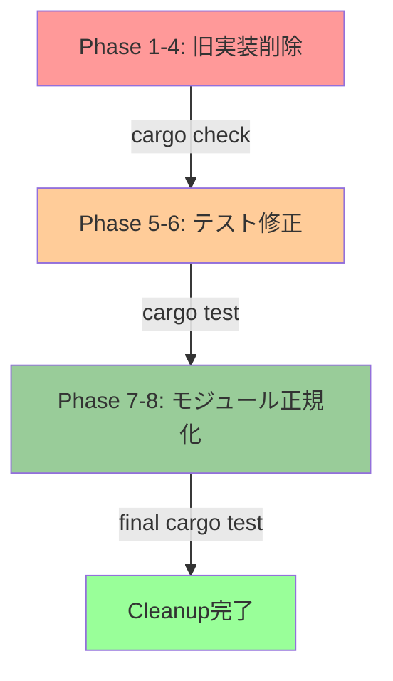
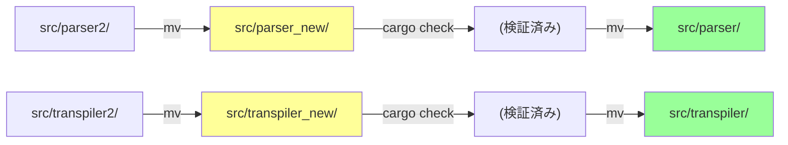

# 設計ドキュメント - legacy-parser-transpiler-cleanup

## 概要

**目的**: 旧 `parser/transpiler` モジュールを完全削除し、 `parser2/transpiler2` を正規化モジュール名 `parser/transpiler` にリネームする。  
**対象ユーザー**: Pasta開発チーム  
**影響**: コードベースの整理。API契約は変更なし（registry モジュールが責務を継承）。

### 目標
1. 旧実装ディレクトリ完全削除（src/parser/, src/transpiler/）
2. ソースコード層のビルド復旧（cargo check 成功）
3. テストコード層のビルド復旧（cargo check --all 成功）
4. テスト実行復旧（cargo test --all 成功）
5. モジュール名正規化（parser2 → parser, transpiler2 → transpiler）
6. 最終ビルド・テスト検証とコミット

### 非目標
- 新機能追加
- パブリックAPI契約の変更
- Registry モジュール実装の変更
- テストケース追加（カバレッジ維持のみ）

---

## 既存アーキテクチャ分析

### 現在のレイヤー構成

```
Engine (上位API) → Cache/Loader
    ↓
Parser2, Transpiler2 (2pass) 
    ↓
Runtime (Rune VM) → Registry (公開型) → IR Output
```

### レイヤー責務の変化なし

| レイヤー   | 現状                  | 変更後                           | 影響             |
| ---------- | --------------------- | -------------------------------- | ---------------- |
| Parser     | parser (削除対象)     | parser (parser2から改名)         | モジュール名のみ |
| Transpiler | transpiler (削除対象) | transpiler (transpiler2から改名) | モジュール名のみ |
| Registry   | src/registry/ 独立    | src/registry/ (変更なし)         | 影響なし         |
| Runtime    | Runtime (変更なし)    | Runtime (変更なし)               | 影響なし         |

**🔒 Registry モジュール独立性**:  
`src/registry/` は既に `parser/transpiler` モジュールから**完全に独立**しており、このリファクタリング対象外です。Registry が提供する `SceneRegistry`, `WordDefRegistry` などの型は、runtime 層から直接参照できます（削除対象外）。

### 設計哲学の継続

- **UI独立性**: Wait/Sync はマーカーのみ → 変更なし
- **宣言的フロー**: Call/Jump で制御 → 変更なし
- **Yield型**: 全出力は yield → 変更なし
- **2パス変換**: Pass1: シーン登録, Pass2: コード生成 → 変更なし

---

## アーキテクチャパターンと境界マップ

このリファクタリングは**アーキテクチャ変化なし**。以下の 3 フェーズで段階的に実施：



---

## 要件トレーサビリティ

| 要件 | 説明                     | 対応コンポーネント                 | インターフェース             | フロー    |
| ---- | ------------------------ | ---------------------------------- | ---------------------------- | --------- |
| 1    | 旧実装ディレクトリ削除   | ファイルシステム操作               | コマンドライン (rm -rf)      | Phase 1   |
| 2    | ソースコード層ビルド復旧 | src/lib.rs, src/cache.rs 等        | Rust パース・型チェック      | Phase 2   |
| 3-4  | テストコード層ビルド復旧 | tests/ 配下のファイル操作          | cargo check --all            | Phase 3-4 |
| 5-6  | モジュール名正規化       | src/parser_new, src/transpiler_new | ディレクトリリネーム         | Phase 7-8 |
| 7-8  | 最終検証とコミット       | Git 操作                           | cargo test --all, git commit | Phase 8   |

---

## コンポーネントとインターフェース

このリファクタリングは **コンポーネント新規追加なし**。実施するのは以下の**削除と修正**：

### ソースコード層（削除・修正対象）

| 対象                      | 操作 | 削除行数 | 説明                                                |
| ------------------------- | ---- | -------- | --------------------------------------------------- |
| src/parser/               | 削除 | ~400     | 旧パーサー実装全体                                  |
| src/transpiler/           | 削除 | ~100     | 旧トランスパイラー実装全体                          |
| src/lib.rs (L47)          | 削除 | 1        | pub mod parser;                                     |
| src/lib.rs (L52)          | 削除 | 1        | pub mod transpiler;                                 |
| src/lib.rs (L61-64)       | 削除 | 4        | pub use parser::{...13個の型...};                   |
| src/lib.rs (L70)          | 削除 | 1        | pub use transpiler::{TranspileContext, Transpiler}; |
| src/cache.rs (L96-233)    | 削除 | 138      | #[cfg(test)] mod tests {...}                        |
| src/runtime/words.rs (L8) | 修正 | 0        | 参照行の削除（実装コードに影響なし）                |

#### Interface: ファイルシステム操作

```
Phase 1: 削除操作
  rm -rf src/parser/
  rm -rf src/transpiler/
  
Phase 2-3: 修正操作
  sed / 手動編集で use 文削除
  
Phase 4: コミット操作
  git add -A && git commit
```

### テストコード層（削除・修正対象）

| カテゴリ  | ファイル数 | 操作 | 説明                                            |
| --------- | ---------- | ---- | ----------------------------------------------- |
| カテゴリA | 12         | 削除 | tests/pasta_parser_*.rs                         |
| カテゴリB | 7          | 削除 | tests/pasta_transpiler_*.rs                     |
| カテゴリC | 3          | 削除 | 統合テスト（e2e, compile, vm_comprehensive）    |
| カテゴリD | 1          | 修正 | tests/pasta_stdlib_call_jump_separation_test.rs |

#### Interface: テストファイル修正

**パターン 1: ファイル削除**
```bash
# 計21ファイル削除
rm -f tests/pasta_parser_*.rs
rm -f tests/pasta_transpiler_*.rs
rm -f tests/pasta_integration_e2e_simple_test.rs
rm -f tests/pasta_engine_rune_compile_test.rs
rm -f tests/pasta_engine_rune_vm_comprehensive_test.rs
```

**パターン 2: インポート修正**
```rust
// tests/pasta_stdlib_call_jump_separation_test.rs
// 修正前
use pasta::transpiler::{SceneRegistry, WordDefRegistry};

// 修正後
use pasta::registry::{SceneRegistry, WordDefRegistry};
```

### ドキュメント層（修正対象）

| ファイル  | 行番号 | 操作 | 説明                 |
| --------- | ------ | ---- | -------------------- |
| README.md | 26-43  | 削除 | レガシースタック記述 |

#### Interface: README 修正
```markdown
削除対象:
  - モジュール状態テーブルの「レガシー」行
  - レガシースタック使用例のコードブロック (Line 37-43)
  - Phase 4 「保留」記述
  
残留:
  - 「パーサー/トランスパイラーアーキテクチャ」セクション
  - 「現行スタック（推奨）」記述
```

---

## モジュール正規化フロー

Phase 7-8 のモジュール正規化は **段階的リネーム戦略** を採用：



**戦略の利点**:
1. 中間名でチェックポイント (rollback 可能)
2. 各段階で `cargo check` 検証
3. 最終名への移行は確実性が高い

---

## テスト戦略

### テストコード削除の正当性

**削除対象テスト: 21ファイル**

| テスト                                     | 理由                                      | カバレッジ                 | リスク |
| ------------------------------------------ | ----------------------------------------- | -------------------------- | ------ |
| pasta_parser_*.rs (12個)                   | 旧parser専用; parser2でカバー済み         | ✅ parser2 テストで継続     | 低     |
| pasta_transpiler_*.rs (7個)                | 旧transpiler専用; transpiler2でカバー済み | ✅ transpiler2 テストで継続 | 低     |
| pasta_integration_e2e_simple_test.rs       | 旧parser/transpiler統合; 機能的に非推奨   | ✅ engine テストで継続      | 低     |
| pasta_engine_rune_compile_test.rs          | 旧parser使用; transpiler2が標準           | ✅ 統合テスト継続           | 低     |
| pasta_engine_rune_vm_comprehensive_test.rs | 旧transpiler依存; 機能冗長                | ✅ runtime テスト継続       | 低     |

**📚 削除前後のカバレッジ検証**:  
詳細なテスト削除の正当性については [gap-analysis.md](./gap-analysis.md) の「テスト削除戦略」を参照。削除対象テスト 21 ファイルの機能は既に parser2/transpiler2 ベースのテストで網羅されていることが確認済みです。

**修正対象テスト: 1ファイル**

| テスト                                    | 修正内容              | 理由                                                  |
| ----------------------------------------- | --------------------- | ----------------------------------------------------- |
| pasta_stdlib_call_jump_separation_test.rs | transpiler → registry | 設計原則検証: Call/Jumpがword辞書にアクセスしないこと |

### ビルド検証チェックポイント

| Phase | 実行コマンド        | 成功条件   | 失敗時アクション       | ゲート条件                                 |
| ----- | ------------------- | ---------- | ---------------------- | ------------------------------------------ |
| 2     | `cargo check`       | エラーなし | ソースコード参照を修正 | —                                          |
| 3     | `cargo check --all` | エラーなし | テストコード参照を修正 | —                                          |
| 4     | `cargo test --all`  | テスト成功 | テスト内容を修正       | ✅ **Phase 7-8 への進行条件: 全テスト合格** |
| 6     | `cargo check`       | エラーなし | モジュール参照を修正   | Phase 4 の `cargo test --all` 合格後に開始 |
| 8     | `cargo test --all`  | テスト成功 | 最終検証               | 最終ゲート                                 |

---

## 技術スタック

**影響を受けるスタック要素**:

| レイヤー        | 選択 / バージョン | 役割                | 変更                              |
| --------------- | ----------------- | ------------------- | --------------------------------- |
| ビルドシステム  | Cargo (standard)  | Rust パッケージ管理 | なし                              |
| コンパイラ      | Rust 2024 edition | コンパイラ言語      | なし                              |
| パーサー生成器  | Pest 2.8          | PEG 文法定義        | 位置のみ変更 (parser2/ → parser/) |
| バックエンド VM | Rune 0.14         | スクリプト実行環境  | なし                              |

**新規依存関係**: なし

---

## データモデル

**データ構造の変更なし**。

旧実装 `src/parser/` と新実装 `src/parser2/` が扱う AST および IR 型は同一の意味論に従う。削除後、すべての変換は `src/parser/` (renamed from parser2) で実施される。

---

## エラーハンドリング

**リスク**: 削除時に参照漏れが発生する可能性

| エラーシナリオ       | 検出方法                 | 復旧手順                    |
| -------------------- | ------------------------ | --------------------------- |
| use 文忘却           | cargo check エラー       | grep で残存参照を探索, 修正 |
| モジュール参照漏れ   | cargo check --all エラー | 同上                        |
| テスト失敗           | cargo test --all エラー  | テストケース内容確認, 修正  |
| ディレクトリ削除漏れ | 手動確認                 | ls -la で確認               |

---

## パフォーマンスと スケーラビリティ

**影響なし**。

削除操作はビルド時のコンパイル対象を減らすため、**コンパイル時間は短縮**される。

---

## 実装上の注意点

### 注意1: 削除順序の重要性

削除は以下の順序で実施（上位レイヤーから下位へ）：

1. テストコード層（テスト依存をクリア）
2. ソースコード層（実装参照をクリア）
3. src/parser/, src/transpiler/ （ディレクトリ削除）

この順序でないと、中間段階で参照エラーが多発する可能性がある。

### 注意2: cargo check --all の重要性

`cargo check --all` は、テストコードを含むすべての crate をコンパイル対象にする。テストファイル削除後、この確認は必須。

### 注意3: 中間リネーム (parser_new) の価値

直接リネーム (parser2 → parser) ではなく、中間名を経由することで、各段階で rollback 可能な安全性が得られる。

### 注意4: README 修正の理由

レガシースタックに関する記述は、**ユーザーに混乱をもたらす**。メンテナンス対象外の古いコード例は削除が望ましい。

---

## 支援資料

詳細な調査結果、依存関係マッピング、リスク評価については [research.md](./research.md) を参照。

---

## 承認ゲート

**設計承認前チェックリスト**:
- [x] 全要件 (1-8) に対応するコンポーネント操作が明確か？
- [x] 削除ファイル 21 個のリストが正確か？
- [x] モジュール正規化フローは安全か？
- [x] ビルド検証チェックポイントは十分か？
- [x] Registry モジュール独立性が明記されているか？（レビュー指摘 #1 → 修正済み）
- [x] Phase 3-4 完了後の Phase 7-8 進行条件が明記されているか？（レビュー指摘 #2 → 修正済み）
- [x] テスト削除後のカバレッジ検証ガイダンスが明記されているか？（レビュー指摘 #3 → 修正済み）

**設計分析結果**: ✅ GO (承認可)

**承認者署名欄**:
- 設計承認: [待機中 → 修正完了]
- 実装前最終確認: [保留中]

