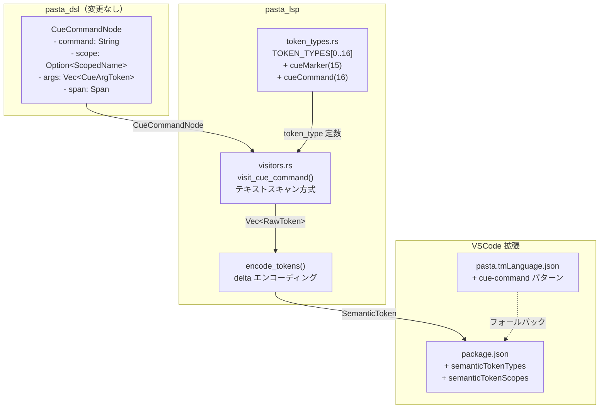
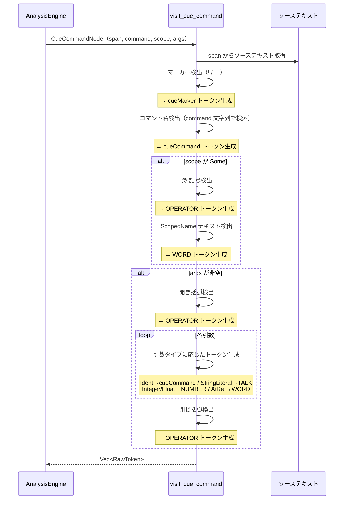

# 技術設計書: lsp-spec-conformance

> **バージョン**: v1（2026-03-12）
> **ステータス**: 設計生成済み・未承認

## 概要

**目的**: `pasta-cue-dsl-extension` 仕様で追加されたキューコマンド行（`!` / `！`）に対して、pasta_lsp のセマンティックトークン細分化および VSCode 拡張の TextMate 文法対応を実装し、LSP の仕様追従ギャップを解消する。

**対象ユーザー**: VSCode 拡張利用者（スクリプト作成者）、テーマ作成者、拡張開発者。キューコマンド行の各構成要素（マーカー・コマンド名・スコープ・引数）を視覚的に区別できるハイライトを提供する。

**影響**: 現在の最小実装（行全体を単一 OPERATOR トークン）を、構成要素ごとの細粒度トークンに置き換える。既存の 15 トークンタイプ（インデックス 0-14）は不変。

### ゴール
- キューコマンド行の 5 構成要素（マーカー・コマンド名・スコープ・引数・区切り記号）を個別セマンティックトークンとして生成
- 新規トークンタイプ `cueMarker`（インデックス 15）と `cueCommand`（インデックス 16）を追加
- TextMate 文法でキューコマンド行のフォールバックハイライトを提供
- 全テスト（既存 79 + 新規）のパスを保証

### 非ゴール
- コマンド名の意味解釈・バリデーション（dola 側の責務）
- キューコマンドの補完候補提案・Hover 情報・Go to Definition（将来仕様）
- `pasta_dsl` の `CueCommandNode` への Span 追加（スコープ外）
- `ScopedName` 内の `actor:name` 個別トークン分割（D5 で全体 1 トークンに決定）

## アーキテクチャ

### 既存アーキテクチャ分析

pasta_lsp のセマンティックトークン生成パイプライン:

```
pasta_dsl::parse_str(source)
    → PastaFile { items: Vec<FileItem> }
        → AnalysisEngine::visit_file_items()
            → visitors.rs 内のビジターメソッド群
                → Vec<RawToken>
                    → encode_tokens() → Vec<SemanticToken>
```

キューコマンド行は以下のパスで処理される:
```
FileItem::GlobalSceneScope → LocalSceneScope → LocalSceneItem::CueCommand(CueCommandNode)
```

現在の CueCommand 処理は `visit_local_scene_item` 内で `add_token_from_span` を1回呼び出すのみ（行全体を OPERATOR として出力）。

### アーキテクチャパターン & 境界マップ



**アーキテクチャ統合**:
- **選択パターン**: 既存コンポーネント拡張（Option A） — ギャップ分析の推奨に従う
- **ドメイン境界**: pasta_dsl は変更なし。変更は pasta_lsp（analysis モジュール）と VSCode 拡張に限定
- **既存パターン維持**: `visit_var_set` のテキストスキャンパターンを踏襲
- **ステアリング準拠**: visitors.rs の guideline exception（750 行超許容）を維持

### 技術スタック

| レイヤー      | 選択 / バージョン         | 本機能での役割                         | 備考                            |
| ------------- | ------------------------- | -------------------------------------- | ------------------------------- |
| LSP サーバー  | tower-lsp 0.20            | SemanticTokensLegend 拡張              | 既存依存、変更なし              |
| DSL パーサー  | pasta_dsl（内部）         | CueCommandNode AST 提供                | 既存依存、変更なし              |
| TextMate 文法 | Oniguruma (VS Code 内蔵)  | フォールバックハイライト               | `[\s\u3000]` で全角スペース対応 |
| VSCode 拡張   | package.json マニフェスト | トークンタイプ登録・スコープマッピング | 追記のみ                        |

## システムフロー

### キューコマンド行のトークン生成フロー



## 要件トレーサビリティ

| 要件  | 概要                          | コンポーネント            | インターフェース               | フロー           |
| ----- | ----------------------------- | ------------------------- | ------------------------------ | ---------------- |
| 1.1   | マーカー + コマンド名トークン | token_types, visitors     | visit_cue_command              | テキストスキャン |
| 1.2   | スコープ個別トークン          | visitors                  | visit_cue_command              | スコープスキャン |
| 1.3   | 引数個別トークン              | visitors                  | visit_cue_command              | 引数スキャン     |
| 1.4   | 文字列リテラル引数            | visitors                  | visit_cue_command              | 引数タイプ判定   |
| 1.5   | 数値リテラル引数              | visitors                  | visit_cue_command              | 引数タイプ判定   |
| 1.6   | @参照引数                     | visitors                  | visit_cue_command              | 引数タイプ判定   |
| 1.7   | 全角/半角同値                 | visitors                  | visit_cue_command              | マーカー検出     |
| 2.1   | マーカー用トークンタイプ      | token_types               | TOKEN_TYPES[15]                | —                |
| 2.2   | コマンド名用トークンタイプ    | token_types               | TOKEN_TYPES[16]                | —                |
| 2.3   | SemanticTokensLegend 登録     | token_types               | semantic_tokens_legend()       | 自動反映         |
| 2.4   | package.json 設定             | VSCode package.json       | semanticTokenTypes             | —                |
| 3.1   | TextMate パターン追加         | pasta.tmLanguage.json     | cue-command                    | —                |
| 3.2   | マーカースコープ              | pasta.tmLanguage.json     | keyword.other.marker.pasta     | —                |
| 3.3   | コマンド名スコープ            | pasta.tmLanguage.json     | entity.name.function.cue.pasta | —                |
| 3.4   | @scope スコープ               | pasta.tmLanguage.json     | variable.other.reference.pasta | —                |
| 3.5   | 引数スコープ                  | pasta.tmLanguage.json     | cue-command サブパターン       | —                |
| 4.1-4 | テスト                        | cue_command_token_test.rs | AnalysisEngine::analyze        | —                |
| 4.5   | リグレッションなし            | 既存テスト                | cargo test                     | —                |
| 5.1   | インデックス不変              | token_types               | TOKEN_TYPES[0..14]             | —                |
| 5.2   | 末尾追加                      | token_types               | TOKEN_TYPES[15..16]            | —                |
| 5.3   | 既存パターン不変              | pasta.tmLanguage.json     | 既存 8 パターン                | —                |
| 5.4   | 優先度衝突回避                | pasta.tmLanguage.json     | call/actor 間に挿入            | —                |

## コンポーネントとインターフェース

### サマリー

| コンポーネント                | ドメイン/レイヤー | 意図                             | 要件カバレッジ          | 主要依存                          | 契約    |
| ----------------------------- | ----------------- | -------------------------------- | ----------------------- | --------------------------------- | ------- |
| token_types 拡張              | analysis          | 新規トークンタイプ定義           | 2.1, 2.2, 2.3, 5.1, 5.2 | —                                 | State   |
| visit_cue_command             | analysis/visitors | キューコマンド細粒度トークン生成 | 1.1-1.7                 | token_types (P0), text_utils (P0) | Service |
| cue-command TextMate パターン | VSCode 拡張       | フォールバックハイライト         | 3.1-3.5, 5.3, 5.4       | —                                 | —       |
| package.json 拡張             | VSCode 拡張       | トークンタイプ登録               | 2.4                     | —                                 | —       |
| cue_command_token_test        | テスト            | セマンティックトークン検証       | 4.1-4.5                 | AnalysisEngine (P0)               | —       |

### Analysis レイヤー

#### token_types 拡張

| フィールド | 詳細                                                            |
| ---------- | --------------------------------------------------------------- |
| 意図       | キューコマンド用の 2 つの新規セマンティックトークンタイプを定義 |
| 要件       | 2.1, 2.2, 2.3, 5.1, 5.2                                         |

**責務と制約**
- `TOKEN_TYPES` 配列の末尾（インデックス 15, 16）に 2 エントリを追加
- 既存インデックス 0-14 は一切変更しない（後方互換性 R5.1）
- `token_type` mod に `CUE_MARKER: u32 = 15` と `CUE_COMMAND: u32 = 16` を追加

**依存関係**
- Inbound: visitors.rs — トークンタイプ定数参照 (P0)
- Inbound: semantic_tokens_legend() — TOKEN_TYPES 配列自動参照 (P0)

**契約**: State

##### 状態管理

**TOKEN_TYPES 配列拡張**:

```rust
// 既存 15 エントリ（インデックス 0-14）は不変
pub const TOKEN_TYPES: &[SemanticTokenType] = &[
    // ... 既存 0-14 ...
    SemanticTokenType::new("cueMarker"),  // 15: キューコマンドマーカー (!/！)
    SemanticTokenType::new("cueCommand"), // 16: キューコマンド名
];
```

**token_type mod 拡張**:

```rust
pub mod token_type {
    // ... 既存 0-14 ...
    pub const CUE_MARKER: u32 = 15;
    pub const CUE_COMMAND: u32 = 16;
}
```

#### visit_cue_command

| フィールド | 詳細                                                                                 |
| ---------- | ------------------------------------------------------------------------------------ |
| 意図       | キューコマンド行のソーステキストをカーソル走査し、構成要素ごとの細粒度トークンを生成 |
| 要件       | 1.1, 1.2, 1.3, 1.4, 1.5, 1.6, 1.7                                                    |

**責務と制約**
- `visit_local_scene_item` の `CueCommand` アームから呼び出される
- `CueCommandNode.span` から行テキストを取得し、カーソルベースで走査
- 全角/半角マーカー（`！` / `!`）を同一処理（R1.7）
- `visit_var_set` / `tokenize_var_set_text` のテキストスキャンパターンに準拠

**依存関係**
- Inbound: visit_local_scene_item — CueCommand マッチアームからの呼び出し (P0)
- Outbound: token_types — `CUE_MARKER`, `CUE_COMMAND`, `OPERATOR`, `TALK`, `NUMBER`, `WORD` 定数参照 (P0)
- Outbound: text_utils — `get_line_text`, `line_byte_offset`, `utf8_offset_to_utf16`, `utf8_len_to_utf16` (P0)

**契約**: Service

##### サービスインターフェース

```rust
impl AnalysisEngine {
    /// キューコマンド行を細粒度トークンに分解して生成する。
    ///
    /// # 生成トークン
    /// 1. マーカー（`!` / `！`）→ CUE_MARKER
    /// 2. コマンド名 → CUE_COMMAND
    /// 3. スコープ（存在する場合）:
    ///    - `@name` 全体（`@` を含む）→ WORD（ActionLine の WordRef と同方針）
    /// 4. 引数（存在する場合）:
    ///    - `(` → OPERATOR
    ///    - 各引数（タイプ別）:
    ///      - Ident → CUE_COMMAND
    ///      - StringLiteral → TALK
    ///      - Integer / Float → NUMBER
    ///      - AtRef → WORD
    ///    - `)` → OPERATOR
    fn visit_cue_command(
        cue: &CueCommandNode,
        source: &str,
        tokens: &mut Vec<RawToken>,
    );
}
```

- 事前条件: `cue.span.is_valid() == true`（呼び出し元で検証済み）
- 事後条件: `tokens` に 2 個以上の `RawToken` が追加される（最低限マーカー + コマンド名）
- 不変条件: 既存トークンは変更されない（追加のみ）

**トークンタイプマッピング表**:

| キューコマンド構成要素                | トークンタイプ | インデックス | 根拠                                                                                |
| ------------------------------------- | -------------- | ------------ | ----------------------------------------------------------------------------------- |
| マーカー `!` / `！`                   | `cueMarker`    | 15           | D1: テーマ独立制御                                                                  |
| コマンド名                            | `cueCommand`   | 16           | D2: 意味的差別化                                                                    |
| スコープ名全体（`@name`、`@` を含む） | `word`         | 4            | ActionLine の WordRef（`@笑顔` = 1 WORD）と同方針。`ScopedName.span` をそのまま使用 |
| `(` / `)` 括弧                        | `operator`     | 13           | D6: 括弧を OPERATOR として生成                                                      |
| `,` / `、` カンマ                     | （スキップ）   | —            | カンマはトークン化せずスキャンのみ                                                  |
| 引数 `Ident`                          | `cueCommand`   | 16           | キューコマンド固有の識別子                                                          |
| 引数 `StringLiteral`                  | `talk`         | 10           | 文字列リテラル（R1.4）                                                              |
| 引数 `Integer` / `Float`              | `number`       | 14           | 数値リテラル（R1.5）                                                                |
| 引数 `AtRef`                          | `word`         | 4            | @参照（R1.6）                                                                       |

**実装ノート**

テキストスキャンのアルゴリズム概要（`visit_var_set` パターン準拠）:

1. `CueCommandNode.span` から行番号・行テキスト・行内オフセットを取得
2. span テキスト内でカーソルを進めながら以下を順次検出:
   - **マーカー**: `！`（3 バイト）or `!`（1 バイト）— 全角優先で検索
   - **コマンド名**: `cue.command` 文字列を `span_text[cursor..]` 内で検索
   - **スコープ**: `cue.scope` が `Some` なら `ScopedName.span` をそのまま `WORD` として emit（`@` を含む全体）。テキストスキャン不要
   - **引数**: `cue.args` が非空なら以下の手順で処理:
     1. `(` / `（` を検出 → OPERATOR emit
     2. 括弧内のテキスト `args_text` を取得（`tokenize_args_text` と同方式）
     3. `arg_cursor = 0` を初期化し、各 `CueArgToken` を前進スキャン:
        - カンマ・全角カンマ・空白をスキップして `arg_text_start` を求める
        - `find_arg_end(args_text[arg_text_start..])` で引数テキスト範囲を確定
        - 確定した `arg_slice` に絞って、トークンタイプ別に検出:
          - `Ident(s)` → `arg_slice.find(s)` → CUE_COMMAND
          - `StringLiteral(s)` → `arg_slice.find(s)` → TALK（括弧 `「」` も含む）
          - `Integer(_)` / `Float(_)` → `find_number_literal(arg_slice)` → NUMBER
          - `AtRef(s)` → `arg_slice.find(@ + s)` → WORD
        - `arg_cursor` を `arg_text_start + arg_end` に進める
     4. `)` / `）` を検出 → OPERATOR emit
     - **同値引数の衝突回避**: 各引数のスライスに絞ってから検索するため `!cmd(1, 1, 1)` でも正確に位置特定できる（`tokenize_args_text` と同一方針）
3. 各検出位置で `utf8_offset_to_utf16` を使い UTF-16 オフセットに変換して `RawToken` を生成

### VSCode 拡張レイヤー

#### cue-command TextMate パターン

| フィールド | 詳細                                                         |
| ---------- | ------------------------------------------------------------ |
| 意図       | セマンティックトークンが無効な場合のフォールバックハイライト |
| 要件       | 3.1, 3.2, 3.3, 3.4, 3.5, 5.3, 5.4                            |

**責務と制約**
- `pasta.tmLanguage.json` の `patterns` 配列で `call` の後、`actor` の前に挿入（R5.4）
- 既存パターンの正規表現は一切変更しない（R5.3）
- Oniguruma の `\s` が U+3000 を含まないため `[\s\u3000]*` を使用（R3.1）

**依存関係**
- 外部: Oniguruma 正規表現エンジン（VS Code 内蔵）(P0)

**TextMate パターン定義**:

`repository` に `cue-command` エントリを追加:

```json
"cue-command": {
    "match": "^([\\s\\u3000]*)([!！])([^@＠(（\\s\\u3000]+)(?:([＠@])([^(（\\s\\u3000]+))?(?:([(（])([^)）]*)?([)）])?)?" ,
    "captures": {
        "2": { "name": "keyword.other.marker.pasta" },
        "3": { "name": "entity.name.function.cue.pasta" },
        "4": { "name": "punctuation.separator.pasta" },
        "5": { "name": "variable.other.reference.pasta" },
        "6": { "name": "punctuation.bracket.begin.pasta" },
        "7": {
            "patterns": [
                { "include": "#cue-arg-string" },
                { "include": "#cue-arg-number" },
                { "include": "#cue-arg-at-ref" },
                { "include": "#cue-arg-ident" }
            ]
        },
        "8": { "name": "punctuation.bracket.end.pasta" }
    },
    "name": "meta.cue-command.pasta"
}
```

引数のサブパターン（`repository` に追加）:

```json
"cue-arg-string": {
    "match": "「[^」]*」|\"[^\"]*\"",
    "name": "string.quoted.other.pasta"
},
"cue-arg-number": {
    "match": "[0-9０-９]+(?:[.．][0-9０-９]+)?",
    "name": "constant.numeric.pasta"
},
"cue-arg-at-ref": {
    "match": "[＠@][^,、)）\\s\\u3000]+",
    "name": "variable.other.reference.pasta"
},
"cue-arg-ident": {
    "match": "[^,、)）\\s\\u3000]+",
    "name": "entity.name.tag.pasta"
}
```

> **注意（best-effort）**: 引数サブパターン（`cue-arg-string`, `cue-arg-number`, `cue-arg-at-ref`, `cue-arg-ident`）の適用は best-effort です。`cue-arg-ident` は汎用フォールバックとして機能しますが、ネストした括弧を含む複合引数など複雑なケースでは、すべての引数が期待するサブスコープで識別されない可能性があります。この制限は Oniguruma エンジンの `match` によるキャプチャグループ処理の特性によるものであり、許容範囲内とします。将来の改善が必要な場合は別仕様で対応します。

`patterns` 配列の挿入位置:

```json
"patterns": [
    { "include": "#comment" },
    { "include": "#lua-code-block" },
    { "include": "#global-scene" },
    { "include": "#local-scene" },
    { "include": "#attribute" },
    { "include": "#word" },
    { "include": "#variable" },
    { "include": "#call" },
    { "include": "#cue-command" },   // ← 新規挿入
    { "include": "#actor" },
    { "include": "#action-line" }
]
```

**スコープ割り当て表**:

| 構成要素            | TextMate スコープ                       | 根拠                               |
| ------------------- | --------------------------------------- | ---------------------------------- |
| マーカー `!` / `！` | `keyword.other.marker.pasta`            | R3.2: 既存マーカースコープを再利用 |
| コマンド名          | `entity.name.function.cue.pasta`        | R3.3: 関数的な名前空間             |
| `@` 記号            | `punctuation.separator.pasta`           | 区切り記号                         |
| スコープ名          | `variable.other.reference.pasta`        | R3.4: 参照用スコープ               |
| `(` / `)`           | `punctuation.bracket.{begin,end}.pasta` | 括弧                               |
| 引数（文字列）      | `string.quoted.other.pasta`             | R3.5                               |
| 引数（数値）        | `constant.numeric.pasta`                | R3.5                               |
| 引数（@参照）       | `variable.other.reference.pasta`        | R3.5                               |
| 引数（識別子）      | `entity.name.tag.pasta`                 | R3.5                               |

#### package.json 拡張

| フィールド | 詳細                                                                         |
| ---------- | ---------------------------------------------------------------------------- |
| 意図       | 新規セマンティックトークンタイプの VSCode 登録とデフォルトスコープマッピング |
| 要件       | 2.4                                                                          |

**`semanticTokenTypes` 追加エントリ**:

```json
{
    "id": "cueMarker",
    "superType": "keyword",
    "description": "Cue command marker (! / ！)"
},
{
    "id": "cueCommand",
    "superType": "function",
    "description": "Cue command name"
}
```

**`semanticTokenScopes` 追加マッピング**:

```json
"cueMarker": ["keyword.other.marker.pasta"],
"cueCommand": ["entity.name.function.cue.pasta"]
```

### テストレイヤー

#### cue_command_token_test

| フィールド | 詳細                                                       |
| ---------- | ---------------------------------------------------------- |
| 意図       | キューコマンド行のセマンティックトークン生成を網羅的に検証 |
| 要件       | 4.1, 4.2, 4.3, 4.4, 4.5                                    |

**責務と制約**
- `crates/pasta_lsp/tests/cue_command_token_test.rs` に新設
- 既存テストインフラ（`AnalysisEngine::analyze` 直接呼び出し）を使用
- `token_type::*` 定数でトークンタイプを検証

**テストケース設計**:

| テスト名                           | 入力                         | 検証内容                                     | 要件      |
| ---------------------------------- | ---------------------------- | -------------------------------------------- | --------- |
| `test_cue_simple_command`          | `!clear`                     | マーカー(cueMarker) + コマンド名(cueCommand) | 4.1       |
| `test_cue_command_with_scope`      | `!emote@笑顔`                | マーカー + コマンド名 + @ + スコープ名       | 4.1       |
| `test_cue_command_with_args`       | `!choice(yes, no)`           | マーカー + コマンド名 + 括弧 + 各引数        | 4.1       |
| `test_cue_command_full`            | `!emote@さくら:笑顔(normal)` | 全構成要素                                   | 4.1       |
| `test_cue_fullwidth_marker`        | `！clear` vs `!clear`        | 同一トークンタイプ生成                       | 4.2       |
| `test_cue_mixed_scene`             | シーン内に cue + action      | 混在ドキュメントの正確なトークン生成         | 4.3       |
| `test_cue_string_literal_arg`      | `!msg(「こんにちは」)`       | 文字列リテラル → TALK                        | 4.1(R1.4) |
| `test_cue_number_arg`              | `!yield(10.0)`               | 数値リテラル → NUMBER                        | 4.1(R1.5) |
| `test_cue_at_ref_arg`              | `!bind(@name)`               | @参照 → WORD                                 | 4.1(R1.6) |
| `test_cue_parse_error_diagnostics` | `!cmd(unclosed`              | Diagnostics にエラー報告                     | 4.4       |

## エラーハンドリング

### エラー戦略

キューコマンド行のトークン生成は best-effort 方式を採用する。パースエラーが存在する場合でも、`parse_str_partial` により回復された部分に対してトークン生成を試みる。

### エラーカテゴリと対応

| カテゴリ             | 具体例                                              | 対応                                                                                                |
| -------------------- | --------------------------------------------------- | --------------------------------------------------------------------------------------------------- |
| 構文エラー           | 引数括弧の不一致 `!cmd(unclosed`                    | pasta_dsl のパーサーが ParseError を生成 → AnalysisEngine が Diagnostics に変換（既存パイプライン） |
| テキストスキャン失敗 | マーカー/コマンド名がソーステキスト内で見つからない | トークン生成をスキップ（サイレントフォールバック）— `visit_var_set` と同じ方針                      |
| 無効な Span          | `cue.span.is_valid() == false`                      | `visit_cue_command` を呼び出さない（呼び出し元でガード）                                            |

## テスト戦略

### 統合テスト（cue_command_token_test.rs）
- `test_cue_simple_command`: `!id` 形式 — マーカー + コマンド名の 2 トークン検証
- `test_cue_command_with_scope`: `!id@scope` 形式 — 4 トークン検証
- `test_cue_command_with_args`: `!id(args)` 形式 — 括弧 + 引数トークン検証
- `test_cue_command_full`: `!id@scope(args)` 形式 — 全構成要素検証
- `test_cue_fullwidth_marker`: 全角マーカー `！` の同値性検証

### 全角/半角同値テスト
- 既存 `fullwidth_halfwidth_test.rs` パターンに準拠
- `！command` と `!command` で同一トークンタイプ・同一トークン数を検証

### リグレッションテスト
- 既存 79 テスト（インライン 19 + 統合 60）が全パスすることを確認
- `cargo test -p pasta_lsp` で全テスト実行

### Diagnostics テスト
- `!cmd(unclosed` 等の不正入力で `diagnostics` が非空であることを検証
- 既存の Diagnostics 変換パイプライン（`AnalysisEngine::analyze` の Err パス）に依存

## 補足参照

ディスカバリー調査の詳細は [research.md](research.md) を参照:
- 既存ビジターパターンの分析
- AST Span 保持状況の確認
- Oniguruma 全角スペース対応
- 全 6 設計判断（D1-D6）の検討経緯と理由
